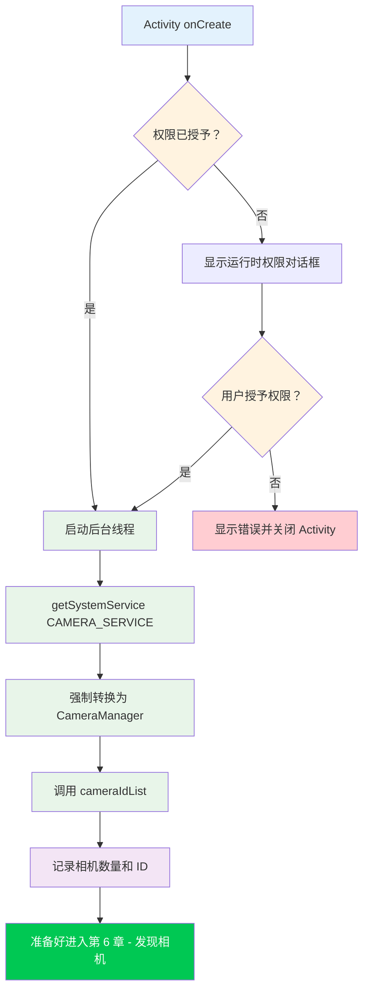

欢迎来到 Camera2 教程系列的动手实践部分。在前几章中，你学习了智能手机相机硬件以及 Camera2 API 的理论基础。现在，是时候卷起袖子编写真正的代码了。到本章结束时，你将拥有一个可以运行的 Android 项目，它成功初始化了 Camera2 API 并访问了 CameraManager 服务——这是在枚举相机、打开设备或显示预览之前至关重要的第一步。

如果你想查看我们将在此系列中构建的所有内容的生产级示例，请查看 [GitHub](https://github.com/zoozooll/AndroidCameraParameters) 和 [Google Play](https://play.google.com/store/apps/details?id=com.minininja.cameraparams) 上的 **Android Camera Parameters** 应用。它演示了高级 Camera2 用法，包括完整的 CameraCharacteristics 枚举、手动拍摄控制和多摄像头支持。

## 为什么要从项目设置开始？

在编写任何一行 Camera2 代码之前，必须正确配置你的应用程序。Camera2 是一个低级、性能敏感的 API，在设置上走捷径会导致神秘的崩溃、ANR（应用无响应）或画面永远无法送达。正确设置 Camera2 项目的三大支柱是：

1. **权限** — Android 框架在安装时（清单文件）和运行时（用户同意）都对相机访问进行了限制。
2. **线程架构** — Camera2 回调绝不能阻塞主线程；我们需要一个专用的后台线程。
3. **视图配置** — 如果你打算使用 TextureView 进行预览（推荐方法），则必须启用硬件加速。

让我们系统地解决每一个问题。

## 第 1 步：创建一个新的 Android Studio 项目

启动 Android Studio 并创建一个新项目。对于本教程系列，我们建议：

- **模板**：Empty Activity（最简单的起点）
- **语言**：Kotlin（现代 Android 开发的标准；本系列中的所有示例均使用 Kotlin）
- **最低 SDK**：API 21 (Lollipop) — 这是原生支持 Camera2 的第一个 SDK 级别。如果你需要通过 OTG 支持外部 USB 相机，请针对 API 23 或更高版本。如果你需要为保存照片提供分区存储支持（第 9 章），则 API 29+ 是相关的，但我们会在那里处理向后兼容性。
- **构建配置语言**：Kotlin DSL 或 Groovy — 均可；我们的示例将与构建系统无关。

项目生成后，打开模块级的 `build.gradle`（或 `build.gradle.kts`）文件。默认的 Empty Activity 模板包含了你大部分所需的依赖项，但请确认至少包含：

```kotlin
dependencies {
    implementation("androidx.core:core-ktx:1.12.0")
    implementation("androidx.appcompat:appcompat:1.6.1")
    implementation("com.google.android.material:material:1.11.0")
    implementation("androidx.constraintlayout:constraintlayout:2.1.4")
    // Camera2 是 Android 框架的一部分，因此基础 API 不需要额外的依赖项。
    // androidx.camera.camera2 仅用于 CameraX 互操作。
}
```

:::tip
你**不需要**添加任何外部 Camera2 依赖项。整个 `android.hardware.camera2` 包都是 Android 框架的一部分。Jetpack CameraX 库是建立在 Camera2 之上的独立高级抽象；在本教程中，我们直接使用**原生 Camera2 API**。
:::

## 第 2 步：在 AndroidManifest.xml 中声明权限

每个相机应用程序都必须在 `AndroidManifest.xml` 中声明 `CAMERA` 权限。这会告知 Google Play 商店你的应用使用了相机硬件，并在 Android 6.0 (API 23) 及更高版本上启用运行时权限对话框。

打开 `app/src/main/AndroidManifest.xml` 并添加以下元素作为**根 `<manifest>` 标签的子项**（不要放在 `<application>` 内部）：

```xml
<?xml version="1.0" encoding="utf-8"?>
<manifest xmlns:android="http://schemas.android.com/apk/res/android"
    xmlns:tools="http://schemas.android.com/tools">

    <!-- ✅ 相机权限声明 -->
    <uses-permission android:name="android.permission.CAMERA" />

    <!-- 可选的特性声明（用于 Google Play 过滤） -->
    <uses-feature
        android:name="android.hardware.camera"
        android:required="true" />
    <uses-feature
        android:name="android.hardware.camera.autofocus"
        android:required="false" />

    <application
        android:allowBackup="true"
        ...>
        <activity
            android:name=".MainActivity"
            android:exported="true"
            android:hardwareAccelerated="true">
            ...
        </activity>
    </application>
</manifest>
```

让我们分解一下重要部分：

### `<uses-permission android:name="android.permission.CAMERA" />`

这是核心权限。没有它，任何对相机服务的调用都将抛出 `SecurityException`。在 API 22 及更低版本上，用户在安装时授予此权限；在 API 23+ 上，你还必须在运行时请求它（稍后介绍）。

### `<uses-feature android:name="android.hardware.camera" android:required="true" />`

此声明告知 Google Play 将你的应用过滤到至少拥有一个摄像头的设备上。如果你的应用在没有摄像头的情况下也能运行（例如，带有可选拍摄功能的图库应用），请设置 `android:required="false"`。如果你根本不声明此项，Google Play 会假设**不**需要摄像头，这可能会导致你的应用被安装在没有摄像头的设备上。

### Activity 上的 `android:hardwareAccelerated="true"`

这对于 TextureView 预览渲染**至关重要**。TextureView 使用 GPU 合成管线来高效显示相机画面。如果在 Activity 或 Application 级别未启用硬件加速，TextureView 将静默失败，无法渲染或显示黑屏。现代 Android 的默认值是对整个应用为 `true`，但在承载 TextureView 的任何 Activity 上显式声明它是一个好习惯。

## 第 3 步：运行时权限请求

在 Android 6.0 (Marshmallow, API 23) 及更高版本中，在清单中声明权限只是完成了一半工作。你还必须使用 Activity Compat 库在运行时**显式请求用户授权**。标准模式是：

1. 使用 `ContextCompat.checkSelfPermission` 检查权限是否已授予。
2. 如果已授予，继续进行相机初始化。
3. 如果未授予，调用 `ActivityCompat.requestPermissions` 显示系统对话框。
4. 在 `onRequestPermissionsResult` 中处理结果。

这是 `MainActivity.kt` 中完整的权限流程：

```kotlin
package com.example.camera2tutorial

import android.Manifest
import android.content.pm.PackageManager
import android.os.Bundle
import android.widget.Toast
import androidx.appcompat.app.AppCompatActivity
import androidx.core.app.ActivityCompat
import androidx.core.content.ContextCompat

class MainActivity : AppCompatActivity() {

    override fun onCreate(savedInstanceState: Bundle?) {
        super.onCreate(savedInstanceState)
        setContentView(R.layout.activity_main)

        if (allPermissionsGranted()) {
            initializeCamera()
        } else {
            ActivityCompat.requestPermissions(
                this,
                REQUIRED_PERMISSIONS,
                REQUEST_CODE_PERMISSIONS
            )
        }
    }

    private fun allPermissionsGranted() = REQUIRED_PERMISSIONS.all {
        ContextCompat.checkSelfPermission(baseContext, it) == PackageManager.PERMISSION_GRANTED
    }

    override fun onRequestPermissionsResult(
        requestCode: Int,
        permissions: Array<out String>,
        grantResults: IntArray
    ) {
        super.onRequestPermissionsResult(requestCode, permissions, grantResults)
        if (requestCode == REQUEST_CODE_PERMISSIONS) {
            if (allPermissionsGranted()) {
                initializeCamera()
            } else {
                Toast.makeText(
                    this,
                    "需要相机权限才能使用此应用。",
                    Toast.LENGTH_LONG
                ).show()
                finish()
            }
        }
    }

    private fun initializeCamera() {
        // TODO: 我们将在下面的章节中实现此方法。
        // 这里是设置 CameraManager 的地方。
        // 目前，仅记录成功日志。
        android.util.Log.d(TAG, "权限已授予。准备初始化相机。")
    }

    companion object {
        private const val TAG = "Camera2Tutorial"
        private const val REQUEST_CODE_PERMISSIONS = 10
        private val REQUIRED_PERMISSIONS = arrayOf(Manifest.permission.CAMERA)
    }
}
```

### 为什么 `allPermissionsGranted()` 使用数组模式

即使我们现在只需要 `CAMERA`，定义一个 `REQUIRED_PERMISSIONS` 数组可以轻松地在以后添加其他权限（例如用于旧式照片保存的 `WRITE_EXTERNAL_STORAGE` 或用于视频的 `RECORD_AUDIO`）。`all { ... }` 函数在继续之前检查数组中的**每一个**权限是否都已授予。

## 第 4 步：后台线程 (HandlerThread)

这是初学者 Camera2 代码中最常被忽略的细节，它会导致**随机、难以重现的错误**。让我们了解为什么 Camera2 需要后台线程，然后正确实现它。

### 为什么 Camera2 绝对不能在主线程运行

Android 主（UI）线程负责：
- 以 60-120 FPS 绘制 UI
- 处理用户触摸事件
- 分发生命周期回调
- 默认运行所有 Activity/Fragment 代码

Camera2 API 同步交付几个关键回调：
- `CameraDevice.StateCallback` — 当相机打开、断开连接或报错时
- `CameraCaptureSession.StateCallback` — 当捕获会话配置完成时
- `CameraCaptureSession.CaptureCallback` — 针对每一帧（每秒高达 60+ 次！）

如果这些回调在主线程运行，会发生两件灾难性的事情：

1. **掉帧和卡顿**：如果处理一个回调耗时哪怕 10ms，一个 60FPS 的帧就会被跳过，用户会看到卡顿。
2. **死锁和 ANR**：一些 Camera2 方法（如 `close()`）是同步的并等待回调。如果回调必须在调用 `close()` 的同一个线程上运行，就会产生死锁。

解决方案是使用带有独立 Looper 的**专用后台线程**，通过 `HandlerThread` 实现。

### 正确实现 HandlerThread

后台线程的生命周期必须与相机操作的生命周期相匹配。我们在 Activity 启动/恢复时启动线程，并在 Activity 停止/暂停时退出线程。

```kotlin
package com.example.camera2tutorial

import android.Manifest
import android.content.Context
import android.content.pm.PackageManager
import android.hardware.camera2.CameraManager
import android.os.Bundle
import android.os.Handler
import android.os.HandlerThread
import android.util.Log
import android.widget.Toast
import androidx.appcompat.app.AppCompatActivity
import androidx.core.app.ActivityCompat
import androidx.core.content.ContextCompat

class MainActivity : AppCompatActivity() {

    // --- 后台线程组件 ---
    private lateinit var backgroundThread: HandlerThread
    private lateinit var backgroundHandler: Handler

    override fun onCreate(savedInstanceState: Bundle?) {
        super.onCreate(savedInstanceState)
        setContentView(R.layout.activity_main)

        if (allPermissionsGranted()) {
            initializeCamera()
        } else {
            ActivityCompat.requestPermissions(
                this,
                REQUIRED_PERMISSIONS,
                REQUEST_CODE_PERMISSIONS
            )
        }
    }

    override fun onResume() {
        super.onResume()
        startBackgroundThread()
        // 如果在应用处于后台时授予了权限，则重新初始化
        if (allPermissionsGranted() && this::cameraManager.isInitialized) {
            // (cameraManager 在下面声明)
        }
    }

    override fun onPause() {
        stopBackgroundThread()
        super.onPause()
    }

    private fun startBackgroundThread() {
        backgroundThread = HandlerThread("Camera2Background").apply {
            start()
        }
        backgroundHandler = Handler(backgroundThread.looper)
        Log.d(TAG, "后台线程已启动: ${backgroundThread.name}")
    }

    private fun stopBackgroundThread() {
        backgroundThread.quitSafely()
        try {
            backgroundThread.join(1000) // 最多等待 1 秒完成清理
            Log.d(TAG, "后台线程已正常停止")
        } catch (e: InterruptedException) {
            Log.e(TAG, "连接后台线程时被中断", e)
        }
    }

    // --- CameraManager 初始化 ---
    private lateinit var cameraManager: CameraManager

    private fun initializeCamera() {
        cameraManager = getSystemService(Context.CAMERA_SERVICE) as CameraManager

        val cameraIdList = cameraManager.cameraIdList
        Log.d(TAG, "成功访问 CameraManager。找到 ${cameraIdList.size} 个摄像头。")
        cameraIdList.forEachIndexed { index, cameraId ->
            Log.d(TAG, "摄像头 $index: ID = $cameraId")
        }

        Toast.makeText(
            this,
            "CameraManager 已初始化！找到 ${cameraIdList.size} 个摄像头。",
            Toast.LENGTH_LONG
        ).show()
    }

    // --- 权限处理（与之前相同） ---
    private fun allPermissionsGranted() = REQUIRED_PERMISSIONS.all {
        ContextCompat.checkSelfPermission(baseContext, it) == PackageManager.PERMISSION_GRANTED
    }

    override fun onRequestPermissionsResult(
        requestCode: Int,
        permissions: Array<out String>,
        grantResults: IntArray
    ) {
        super.onRequestPermissionsResult(requestCode, permissions, grantResults)
        if (requestCode == REQUEST_CODE_PERMISSIONS) {
            if (allPermissionsGranted()) {
                initializeCamera()
            } else {
                Toast.makeText(
                    this,
                    "需要相机权限才能使用此应用。",
                    Toast.LENGTH_LONG
                ).show()
                finish()
            }
        }
    }

    companion object {
        private const val TAG = "Camera2Tutorial"
        private const val REQUEST_CODE_PERMISSIONS = 10
        private val REQUIRED_PERMISSIONS = arrayOf(Manifest.permission.CAMERA)
    }
}
```

### 关键线程模式详解

1. **`onResume()` 中的 `startBackgroundThread()`**：每次 Activity 进入前台时，我们都会创建一个全新的 `HandlerThread`，启动它，并创建一个绑定到该线程 `Looper` 的 `Handler`。这个 Handler 将被传递给所有接受回调的 Camera2 方法（`openCamera`、`createCaptureSession` 等）。

2. **`onPause()` 中的 `stopBackgroundThread()`**：在 Activity 进入后台之前，我们在线程上调用 `quitSafely()`。这告诉 Looper 在当前消息处理完后停止处理新消息（与 `quit()` 不同，后者会丢弃挂起的消息）。然后我们调用 `join(1000)` 以阻塞主线程最多一秒钟，同时等待后台线程完成清理。这可以防止资源泄漏。

3. **为什么使用 `HandlerThread` 而不是 `CoroutineDispatcher`？** Camera2 比 Kotlin 协程早几年出现，其回调系统从根本上是基于 Handler/Looper 的。虽然你可以使用 `Dispatchers.Default.asExecutor()` 或在 `suspendCoroutine` 中包装回调以获得更高级别的代码，但底层的 Camera2 API 仍然需要一个 Looper 线程来处理回调。直接使用 `HandlerThread` 是官方 Android 示例中记录的标准规范做法。

## 第 5 步：完整的初始化流程（合并）

现在让我们看看应用程序启动时必须发生的全套事件序列。顺序至关重要：权限 → 线程 → CameraManager。如果你颠倒任何步骤，代码将会崩溃或表现不一致。



上面的流程图说明了为什么每个步骤都存在：

- **权限网关**：整个相机子系统都受到保护；在用户表示同意之前，我们无法继续。
- **线程先于 CameraManager**：虽然 `getSystemService()` 本身是线程安全的，但我们希望在执行任何回调驱动的 Camera2 操作（从下一章开始）之前，后台线程已经运行。
- **CameraManager → cameraIdList**：调用 `cameraIdList` 是验证 CameraManager 是否正常工作的成本最低的方法。如果此调用成功且未抛出异常，则说明你的清单声明、运行时权限和服务绑定都是正确的。

## 综合：运行并验证

此时，你拥有了一个完整的、可运行的 Camera2 项目，它具备：
1. 使用正确的 SDK 目标创建 Android 项目。
2. 在清单中声明 CAMERA 权限。
3. 在运行时请求权限，并处理接受和拒绝路径。
4. 在 `onResume` 中启动专用 HandlerThread，并在 `onPause` 中正常停止。
5. 获取 `CAMERA_SERVICE` 系统服务并强制转换为 `CameraManager`。
6. 调用 `cameraIdList` 并记录相机的数量和 ID。

### 运行后你应该看到的内容

1. 首次启动时，Android 会显示权限对话框：*"允许 Camera2Tutorial 拍摄照片和录制视频吗？"*
2. 点击**允许**。
3. 出现一个 Toast：*"CameraManager 已初始化！找到 X 个摄像头。"*
4. 在 Logcat 中（通过 `Camera2Tutorial` 过滤），你应该看到如下条目：
   ```
   D/Camera2Tutorial: 后台线程已启动: Camera2Background
   D/Camera2Tutorial: 成功访问 CameraManager。找到 4 个摄像头。
   D/Camera2Tutorial: 摄像头 0: ID = 0
   D/Camera2Tutorial: 摄像头 1: ID = 1
   D/Camera2Tutorial: 摄像头 2: ID = 2
   D/Camera2Tutorial: 摄像头 3: ID = 3
   ```
5. 当你按下主屏幕键或离开应用时，Logcat 显示：
   ```
   D/Camera2Tutorial: 后台线程已正常停止
   ```

如果你看到这些日志，**恭喜你**！你已经成功建立了 Camera2 应用程序的基础。目前还没有相机预览——那将在第 8 章中介绍——但底层的"管道"是正确的。如果你收到 `SecurityException`，请仔细检查你是否接受了权限对话框。如果 `cameraIdList` 返回空数组，则设备可能没有摄像头（在手机上不太可能）或者权限被拒绝。

## 常见设置错误排查

### `SecurityException: Lacking privileges to access camera service`

这意味着运行时权限未获得授权。检查：
- 你是否在清单中添加了 `<uses-permission android:name="android.permission.CAMERA" />`。
- 你是否使用了正确的请求代码调用 `ActivityCompat.requestPermissions`。
- 用户是否在对话框中点击了**允许**。
- 如果你在物理设备上测试，请转到 设置 → 应用 → 你的应用 → 权限，确保相机已启用。

### `backgroundHandler` 出现 `NullPointerException`

如果你在 `startBackgroundThread()` 运行之前尝试使用 `backgroundHandler`，就会发生这种情况。确保所有接受 Handler 的 Camera2 操作仅在调用 `onResume` 且线程正在运行**之后**执行。在我们的代码中，`initializeCamera()` 是从 `onCreate` 调用的，但它仅同步使用 CameraManager；需要 `backgroundHandler` 的回调将在后续章节中添加，并正确地通过 `onResume` 进行控制。

### 后续章节中 `TextureView` 显示黑屏

如果你跳过前面的步骤现在就添加 TextureView，请确保在清单中的 Activity 上设置了 `android:hardwareAccelerated="true"`。此外，还要确保 TextureView 已附加到视图层级并在 XML 布局中可见。

## 小结

在本章中，你构建了一个 Android Camera2 应用程序的完整脚手架。你学习了：

1. **项目结构**：如何使用 Empty Activity 模板创建新的 Android Studio 项目，针对 API 21+，使用 Kotlin，并验证无需额外的 Camera2 依赖项。
2. **清单配置**：`CAMERA` 权限声明、用于 Google Play 过滤的 `uses-feature` 标签，以及 Activity 上用于 TextureView 渲染的 `hardwareAccelerated="true"`。
3. **运行时权限**：使用 `ContextCompat.checkSelfPermission` 和 `ActivityCompat.requestPermissions` 进行完整的检查 → 请求 → 结果循环，并处理允许和拒绝路径。
4. **后台线程**：为什么 Camera2 回调绝不能在主线程运行，以及如何实现一个受生命周期管理的 `HandlerThread` + `Handler` 对，在 `onResume` 中使用 `startBackgroundThread()`，并在 `onPause` 中使用 `quitSafely()` + `join()` 调用 `stopBackgroundThread()`。
5. **CameraManager 初始化**：获取 `CAMERA_SERVICE` 系统服务，强制转换为 `CameraManager`，调用 `cameraIdList` 验证服务是否正常工作，并记录发现的相机 ID。

本章中的代码是后续所有内容的基础。**Android Camera Parameters** 应用（[GitHub](https://github.com/zoozooll/AndroidCameraParameters)，[Google Play](https://play.google.com/store/apps/details?id=com.minininja.cameraparams)）正是使用了这些模式——为不同的工作负载使用多个 `HandlerThread`，仔细的权限检查，以及稳健的生命周期管理。

## 下一章

现在 `CameraManager` 已成功初始化，我们有了一个相机 ID 列表，下一步是**查询每个摄像头的性能**。在**第 6 章：发现相机**中，你将：

- 学习相机 ID 字符串代表什么（以及为什么永远不应硬编码关于它们的假设）。
- 使用 `LENS_FACING` 区分前置、后置和外部 (USB OTG) 摄像头。
- 查询每个摄像头的硬件级别 (`INFO_SUPPORTED_HARDWARE_LEVEL`)，以确定其为 LEGACY、LIMITED、FULL 还是 LEVEL_3。
- 迭代设备上的每个摄像头，并使用 `CameraCharacteristics` 记录其属性。

到第 6 章结束时，你将拥有一个可运行的相机枚举实用程序，它可以从设备中提取真实的 Camera2 元数据——这已经是你可以用来比较不同手机相机硬件的工具了！
