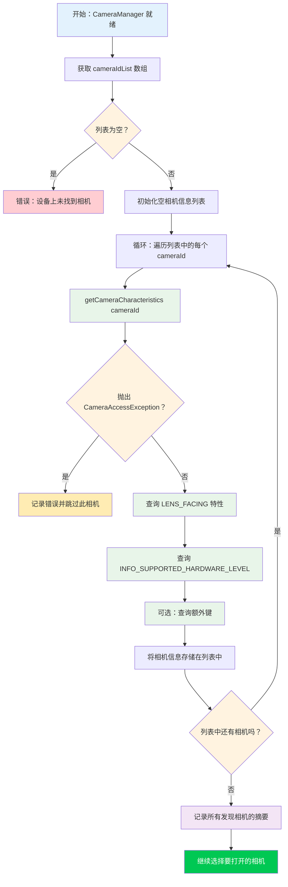

在第 5 章中，你成功初始化了 `CameraManager` 并检索到了相机 ID 列表——但像 `"0"` 或 `"2"` 这样的字符串并没有告诉你那个摄像头到底**是什么**。它是超广角后置摄像头吗？是自拍摄像头吗？还是通过 OTG 连接的外部 USB 网络摄像头？本章将教你如何使用 `CameraCharacteristics` 来回答这些问题，它是描述相机设备每一项能力的元数据容器。

如需查看相机枚举和特性检查的生产级参考实现，请查看 [GitHub](https://github.com/zoozooll/AndroidCameraParameters) 或 [Google Play](https://play.google.com/store/apps/details?id=com.minininja.cameraparams) 上的 **Android Camera Parameters** 应用。它遍历了设备上每个摄像头的 `CameraCharacteristics` 中的每个键，并在一个可搜索、可过滤的 UI 中展示结果——这正是你在调试特定硬件的 Camera2 问题时想要的工具。

## 理解相机 ID

在深入了解特性之前，我们需要解决新 Camera2 开发者最容易困惑的一个根本问题：**数字相机 ID 字符串到底意味着什么？**

当你调用 `cameraManager.cameraIdList` 时，你会得到一个 `Array<String>`——例如：`["0", "1", "2", "3", "4"]`。我们很容易**倾向于**硬编码一些假设，例如：
- `"0"` = 后置广角相机
- `"1"` = 前置相机
- `"2"` = 长焦相机

**永远不要这样做。** ID 与物理相机的映射关系是：
1. **设备特定**：Pixel 8 可能会将 ID `"1"` 用于前置相机，而三星 Galaxy S24 可能会使用 ID `"3"`。
2. **版本特定**：OEM 的 OTA 更新可能会在设备发货后更改 ID 列表。
3. **重建特定**：一些多摄像头逻辑设备（在后面的第三部分章节中介绍）会根据模式动态显示或隐藏底层的物理相机。

**唯一**正确的方法是**查询每个 ID 的特性**，并根据你关心的属性（镜头朝向、硬件级别、焦距范围等）选择相机。这是编写良好的 Camera2 应用的做法，也是我们在这里要实现的模式。

## 相机枚举流程

发现相机的整体算法表面上很简单，但在错误处理方面有一些重要的边缘情况。让我们先通过流程图看看这个过程，然后在代码中实现它。



流程图中的关键点：
1. **始终处理空 ID 列表**：在手机上很少见，但在 Android TV、无屏设备或未设置虚拟摄像头的模拟器上很常见。
2. **始终将 `getCameraCharacteristics` 封装在 try/catch 中**：相机可能会在枚举过程中断开连接（特别是外部 USB 相机），或者严格的设备策略可能会限制某些相机。
3. **完全迭代后再选择**：先收集所有候选设备，然后根据你的标准选择最好的一个。不要打开你发现的第一个"好"相机——你可能会错过更好的。

## 认识 CameraCharacteristics

`CameraCharacteristics` 是一个不可变的、只读的键值对映射，描述了相机的硬件级性能。它包含数百个键，涵盖了从镜头焦距到传感器像素阵列尺寸，再到支持的输出格式等所有内容。

你可以通过以下方式获取特性对象：
```kotlin
val characteristics: CameraCharacteristics =
    cameraManager.getCameraCharacteristics(cameraId)
```

并通过通用的 `get` 方法查询单个键：
```kotlin
val lensFacing: Int? = characteristics.get(CameraCharacteristics.LENS_FACING)
```

返回类型是可空的（在此例中为 `Int?`），因为某些键是可选的，可能并不存在于所有设备上。实际上，我们在本章查询的键（`LENS_FACING` 和 `INFO_SUPPORTED_HARDWARE_LEVEL`）可以保证存在于每个有效的相机上，但进行防御性的空处理仍然是良好的习惯。

:::note
本章特意只涵盖了 `LENS_FACING` 和 `INFO_SUPPORTED_HARDWARE_LEVEL`。`CameraCharacteristics` 更深层的内部结构（传感器特性、输出配置、可用功能）是第三部分第 10 章《CameraCharacteristics 百科全书》的主题。我们现在专注于挑选相机进行打开所需的最少信息。
:::

## 关键键 1：LENS_FACING — 前置、后置或外部

几乎每个相机应用首先需要知道的就是镜头指向哪个方向。Camera2 定义了三个常量：

| 常量 | 值 | 含义 | 典型用例 |
|---|---|---|---|
| `LENS_FACING_BACK` | `0` | 相机位于设备背面，背对用户 | 拍照、风景视频、AR |
| `LENS_FACING_FRONT` | `1` | 相机位于设备正面，面向用户 | 自拍、视频通话 |
| `LENS_FACING_EXTERNAL` | `2` | 相机在设备外部（例如 USB OTG 网络摄像头） | 外部配件、特种相机 |

以下是如何将原始整数转换为人类可读字符串的方法：

```kotlin
fun lensFacingToString(facing: Int?): String = when (facing) {
    CameraCharacteristics.LENS_FACING_BACK -> "后置 (LENS_FACING_BACK)"
    CameraCharacteristics.LENS_FACING_FRONT -> "前置 (LENS_FACING_FRONT)"
    CameraCharacteristics.LENS_FACING_EXTERNAL -> "外部 / USB OTG (LENS_FACING_EXTERNAL)"
    null -> "未知 (null)"
    else -> "未知 (值=$facing)"
}
```

### 特殊情况：外部相机 (USB OTG)

`LENS_FACING_EXTERNAL` 是在 API 23 (Marshmallow) 中添加的。在打开外部相机之前，请考虑：

1. **USB 主机特性声明**：如果你的应用专门针对外部相机，请在清单中添加 `<uses-feature android:name="android.hardware.usb.host" />`。如果应用也支持内置相机，请设置 `required="false"`。
2. **外部设备的权限**：在许多设备上，访问 USB 相机仅需要 `CAMERA` 权限。但是，某些 USB 网络摄像头芯片组需要通过 `UsbManager.requestPermission()` 进行额外的 USB 主机权限确认。如果你想在插入相机时自动检测，请处理 `UsbManager.ACTION_USB_DEVICE_ATTACHED` 广播。
3. **硬件级别**：外部相机几乎总是报告 `INFO_SUPPORTED_HARDWARE_LEVEL_EXTERNAL`（见下文），这意味着它们的功能集受 USB 视频类 (UVC) 驱动程序的限制。不要指望从通用网络摄像头获得手动控制或 RAW 输出。

在连接了 USB 网络摄像头的手机上，`cameraIdList` 可能会返回类似 `["0", "1", "100"]` 的结果，其中 `"100"` 是动态分配的外部相机 ID。外部相机 ID 通常是较大的数字，并且在重启或重新插拔后**不**稳定。

## 关键键 2：INFO_SUPPORTED_HARDWARE_LEVEL — 这个相机能做什么？

硬件级别是 Camera2 中最重要的功能分类。它告诉你相机硬件和 HAL（硬件抽象层）是实现了完整的 Camera2 管线，还是在旧版 Camera API 基础上使用了遗留兼容性封装器。共有五个值：

| 级别 | 值 | 含义 | 现实中的设备 |
|---|---|---|---|
| `LEGACY` | `2` | 遗留 HAL 模式。相机通过垫片运行在旧版 Camera API 之上。功能非常受限，无手动控制，无 RAW。 | 廉价手机、2015 年前的设备、许多模拟器 |
| `LIMITED` | `0` | 受限的 HAL3 支持。支持基础拍摄、基础 3A（自动曝光、自动对焦、自动白平衡），但缺少高级功能。 | 中端手机、旗舰设备上的一些前置摄像头 |
| `FULL` | `1` | 完整的 HAL3 支持。支持手动传感器控制、逐帧设置、RAW 输出、重处理。 | 旗舰手机主摄/后置、Pixel 系列主摄 |
| `LEVEL_3` | `3` | 扩展的 HAL3 支持。增加 YUV 重处理、多帧输入、高帧率分辨率配置。 | 最新的旗舰机、Pixel 6+ 主摄 |
| `EXTERNAL` | `4` | 外部相机 (USB/OTG)。功能受限，UVC 类设备。 | USB 网络摄像头、HDMI 采集棒 |

理解这个层级结构的一个好方法是将其视为功能阶梯：

```
LEGACY → LIMITED → FULL → LEVEL_3
          ↑
       EXTERNAL (针对 USB 相机的平行分支)
```

每一步都建立在前一步的基础上：`FULL` 包含 `LIMITED` 中的所有内容，`LEVEL_3` 包含 `FULL` 中的所有内容。编写功能检测代码时，请从最高级别向下检查——如果一个相机是 `LEVEL_3`，你自动知道它也支持 `FULL` 功能。

以下是将级别转换为描述的辅助函数：

```kotlin
fun hardwareLevelToString(level: Int?): String = when (level) {
    CameraMetadata.INFO_SUPPORTED_HARDWARE_LEVEL_LEGACY ->
        "LEGACY (旧版 Camera API 兼容模式 — 手动控制受限)"
    CameraMetadata.INFO_SUPPORTED_HARDWARE_LEVEL_LIMITED ->
        "LIMITED (基础 HAL3 — 标准照片/视频)"
    CameraMetadata.INFO_SUPPORTED_HARDWARE_LEVEL_FULL ->
        "FULL (完整 HAL3 — 手动控制 + RAW)"
    CameraMetadata.INFO_SUPPORTED_HARDWARE_LEVEL_3 ->
        "LEVEL_3 (扩展 HAL3 — 重处理 + 多帧)"
    CameraMetadata.INFO_SUPPORTED_HARDWARE_LEVEL_EXTERNAL ->
        "EXTERNAL (USB/OTG 相机 — UVC 类)"
    null -> "未知 (null)"
    else -> "未知 (值=$level)"
}
```

:::tip
如果你想编写仅在性能较强的硬件上运行的代码，请对基础拍摄使用 `>= LIMITED`，对手动控制使用 `>= FULL`，对重处理管线使用 `>= LEVEL_3`。永远不要假设相机是 FULL 或更高版本——务必进行检查。Google Play 上的 **Android Camera Parameters** 应用为每个相机显示显眼的硬件级别徽章，以便你快速查看每台设备支持的内容。
:::

## 完整的 Kotlin 代码：相机发现工具

现在让我们将所有内容合并到一个有效的实现中。我们将使用 `discoverAndLogCameras()` 方法扩展第 5 章中的 `MainActivity.kt`，该方法遍历所有相机，查询每个摄像头的 `LENS_FACING` 和 `INFO_SUPPORTED_HARDWARE_LEVEL`，并将结果记录到 Logcat。

```kotlin
package com.example.camera2tutorial

import android.Manifest
import android.content.Context
import android.content.pm.PackageManager
import android.hardware.camera2.CameraAccessException
import android.hardware.camera2.CameraCharacteristics
import android.hardware.camera2.CameraManager
import android.hardware.camera2.CameraMetadata
import android.os.Bundle
import android.os.Handler
import android.os.HandlerThread
import android.util.Log
import android.widget.Toast
import androidx.appcompat.app.AppCompatActivity
import androidx.core.app.ActivityCompat
import androidx.core.content.ContextCompat

class MainActivity : AppCompatActivity() {

    private lateinit var backgroundThread: HandlerThread
    private lateinit var backgroundHandler: Handler
    private lateinit var cameraManager: CameraManager

    override fun onCreate(savedInstanceState: Bundle?) {
        super.onCreate(savedInstanceState)
        setContentView(R.layout.activity_main)

        if (allPermissionsGranted()) {
            initializeCameraManager()
        } else {
            ActivityCompat.requestPermissions(
                this,
                REQUIRED_PERMISSIONS,
                REQUEST_CODE_PERMISSIONS
            )
        }
    }

    override fun onResume() {
        super.onResume()
        startBackgroundThread()
    }

    override fun onPause() {
        stopBackgroundThread()
        super.onPause()
    }

    private fun startBackgroundThread() {
        backgroundThread = HandlerThread("Camera2Background").apply { start() }
        backgroundHandler = Handler(backgroundThread.looper)
    }

    private fun stopBackgroundThread() {
        backgroundThread.quitSafely()
        try {
            backgroundThread.join(1000)
        } catch (e: InterruptedException) {
            Log.e(TAG, "连接后台线程时被中断", e)
        }
    }

    private fun initializeCameraManager() {
        cameraManager = getSystemService(Context.CAMERA_SERVICE) as CameraManager
        discoverAndLogCameras()
    }

    // -------------------------------------------------------------------------
    // 📸 第 6 章新增内容：相机发现与特性查询
    // -------------------------------------------------------------------------
    data class CameraInfo(
        val id: String,
        val lensFacing: Int?,
        val hardwareLevel: Int?
    ) {
        fun description(): String = buildString {
            append("相机 ID: $id | ")
            append("朝向: ${lensFacingToString(lensFacing)} | ")
            append("硬件级别: ${hardwareLevelToString(hardwareLevel)}")
        }
    }

    private fun discoverAndLogCameras() {
        val cameraIdList: Array<String> = try {
            cameraManager.cameraIdList
        } catch (e: CameraAccessException) {
            Log.e(TAG, "获取相机 ID 列表失败", e)
            Toast.makeText(this, "相机服务不可用", Toast.LENGTH_LONG).show()
            return
        }

        if (cameraIdList.isEmpty()) {
            Log.w(TAG, "在此设备上未找到相机")
            Toast.makeText(this, "无可用相机", Toast.LENGTH_LONG).show()
            return
        }

        val discoveredCameras = mutableListOf<CameraInfo>()
        Log.i(TAG, "═══════════════════════════════════════════")
        Log.i(TAG, "开始相机发现 (共有 ${cameraIdList.size} 个摄像头)")
        Log.i(TAG, "═══════════════════════════════════════════")

        for ((index, cameraId) in cameraIdList.withIndex()) {
            try {
                val characteristics = cameraManager.getCameraCharacteristics(cameraId)

                val lensFacing = characteristics.get(CameraCharacteristics.LENS_FACING)
                val hardwareLevel =
                    characteristics.get(CameraCharacteristics.INFO_SUPPORTED_HARDWARE_LEVEL)

                val info = CameraInfo(cameraId, lensFacing, hardwareLevel)
                discoveredCameras.add(info)

                Log.i(TAG, "── 相机 $index ──")
                Log.i(TAG, info.description())

            } catch (e: CameraAccessException) {
                Log.e(TAG, "访问相机 $cameraId 的特性失败", e)
            } catch (e: IllegalArgumentException) {
                Log.e(TAG, "无效的相机 ID: $cameraId", e)
            }
        }

        Log.i(TAG, "═══════════════════════════════════════════")
        Log.i(TAG, "发现完成。成功枚举 ${discoveredCameras.size} 个摄像头。")

        // 按朝向分组并汇总
        val byFacing = discoveredCameras.groupBy { it.lensFacing }
        Log.i(TAG, "  后置摄像头:    ${byFacing[CameraCharacteristics.LENS_FACING_BACK]?.size ?: 0}")
        Log.i(TAG, "  前置摄像头:    ${byFacing[CameraCharacteristics.LENS_FACING_FRONT]?.size ?: 0}")
        Log.i(TAG, "  外部/OTG 相机: ${byFacing[CameraCharacteristics.LENS_FACING_EXTERNAL]?.size ?: 0}")

        // 按硬件级别分组并汇总
        val byLevel = discoveredCameras.groupBy { it.hardwareLevel }
        Log.i(TAG, "  LEGACY 级别:  ${byLevel[CameraMetadata.INFO_SUPPORTED_HARDWARE_LEVEL_LEGACY]?.size ?: 0}")
        Log.i(TAG, "  LIMITED 级别: ${byLevel[CameraMetadata.INFO_SUPPORTED_HARDWARE_LEVEL_LIMITED]?.size ?: 0}")
        Log.i(TAG, "  FULL 级别:    ${byLevel[CameraMetadata.INFO_SUPPORTED_HARDWARE_LEVEL_FULL]?.size ?: 0}")
        Log.i(TAG, "  LEVEL_3 级别: ${byLevel[CameraMetadata.INFO_SUPPORTED_HARDWARE_LEVEL_3]?.size ?: 0}")
        Log.i(TAG, "  EXTERNAL 级别: ${byLevel[CameraMetadata.INFO_SUPPORTED_HARDWARE_LEVEL_EXTERNAL]?.size ?: 0}")
        Log.i(TAG, "═══════════════════════════════════════════")

        val summary = buildString {
            append("发现 ${discoveredCameras.size} 个摄像头！\n")
            append("后置: ${byFacing[CameraCharacteristics.LENS_FACING_BACK]?.size ?: 0} • ")
            append("前置: ${byFacing[CameraCharacteristics.LENS_FACING_FRONT]?.size ?: 0} • ")
            append("外部: ${byFacing[CameraCharacteristics.LENS_FACING_EXTERNAL]?.size ?: 0}")
        }

        Toast.makeText(this, summary, Toast.LENGTH_LONG).show()

        // 存储供后续章节使用（选择要打开的相机）
        this.discoveredCameras = discoveredCameras
    }

    private var discoveredCameras: List<CameraInfo> = emptyList()

    // 辅助函数：获取"默认"后置相机 ID（我们找到的第一个后置相机）
    fun getDefaultBackCameraId(): String? =
        discoveredCameras.firstOrNull {
            it.lensFacing == CameraCharacteristics.LENS_FACING_BACK
        }?.id

    // 辅助函数：获取"默认"前置相机 ID
    fun getDefaultFrontCameraId(): String? =
        discoveredCameras.firstOrNull {
            it.lensFacing == CameraCharacteristics.LENS_FACING_FRONT
        }?.id

    companion object {
        private const val TAG = "Camera2Tutorial"
        private const val REQUEST_CODE_PERMISSIONS = 10
        private val REQUIRED_PERMISSIONS = arrayOf(Manifest.permission.CAMERA)

        fun lensFacingToString(facing: Int?): String = when (facing) {
            CameraCharacteristics.LENS_FACING_BACK -> "后置"
            CameraCharacteristics.LENS_FACING_FRONT -> "前置"
            CameraCharacteristics.LENS_FACING_EXTERNAL -> "外部/USB"
            null -> "未知(null)"
            else -> "未知($facing)"
        }

        fun hardwareLevelToString(level: Int?): String = when (level) {
            CameraMetadata.INFO_SUPPORTED_HARDWARE_LEVEL_LEGACY -> "LEGACY"
            CameraMetadata.INFO_SUPPORTED_HARDWARE_LEVEL_LIMITED -> "LIMITED"
            CameraMetadata.INFO_SUPPORTED_HARDWARE_LEVEL_FULL -> "FULL"
            CameraMetadata.INFO_SUPPORTED_HARDWARE_LEVEL_3 -> "LEVEL_3"
            CameraMetadata.INFO_SUPPORTED_HARDWARE_LEVEL_EXTERNAL -> "EXTERNAL"
            null -> "未知(null)"
            else -> "未知($level)"
        }
    }

    private fun allPermissionsGranted() = REQUIRED_PERMISSIONS.all {
        ContextCompat.checkSelfPermission(baseContext, it) == PackageManager.PERMISSION_GRANTED
    }

    override fun onRequestPermissionsResult(
        requestCode: Int,
        permissions: Array<out String>,
        grantResults: IntArray
    ) {
        super.onRequestPermissionsResult(requestCode, permissions, grantResults)
        if (requestCode == REQUEST_CODE_PERMISSIONS) {
            if (allPermissionsGranted()) {
                initializeCameraManager()
            } else {
                Toast.makeText(
                    this,
                    "需要相机权限才能使用此应用。",
                    Toast.LENGTH_LONG
                ).show()
                finish()
            }
        }
    }
}
```

### 代码中的关键模式

1. **`data class CameraInfo`**：我们不传递原始元组，而是将关心的属性封装在一个类型化的数据类中。这使代码更具可读性且易于扩展（以后只需添加 `focalLengths` 等新字段即可，无需更改调用点）。

2. **循环内的 `CameraAccessException` try/catch**：如果一个相机失败（例如，外部相机在枚举途中被拔掉），循环仍会继续，其余相机仍能被发现。一个相机的失败绝不能破坏整个枚举过程。

3. **双重 `groupBy` 汇总**：通过朝向和硬件级别对相机进行分组，然后对每组进行计数，可以立即了解设备相机拓扑的概况。这种模式直接取自 **Android Camera Parameters** 应用的概览屏幕。

4. **`getDefaultBackCameraId()` 和 `getDefaultFrontCameraId()`**：这些辅助函数展示了选择相机的正确方法——查询特性，而不是硬编码 ID `"0"` 或 `"1"`。我们将在第 7 章真正打开相机时使用这些辅助函数。

## 预期的 Logcat 输出

当你在真实设备（例如具有 4 个以上摄像头的现代旗舰机）上运行此程序时，按 `Camera2Tutorial` 过滤的 Logcat 输出应类似于：

```
I/Camera2Tutorial: ═══════════════════════════════════════════
I/Camera2Tutorial: 开始相机发现 (共有 5 个摄像头)
I/Camera2Tutorial: ═══════════════════════════════════════════
I/Camera2Tutorial: ── 相机 0 ──
I/Camera2Tutorial: 相机 ID: 0 | 朝向: 后置 | 硬件级别: LEVEL_3
I/Camera2Tutorial: ── 相机 1 ──
I/Camera2Tutorial: 相机 ID: 1 | 朝向: 前置 | 硬件级别: FULL
I/Camera2Tutorial: ── 相机 2 ──
I/Camera2Tutorial: 相机 ID: 2 | 朝向: 后置 | 硬件级别: LIMITED
I/Camera2Tutorial: ── 相机 3 ──
I/Camera2Tutorial: 相机 ID: 3 | 朝向: 后置 | 硬件级别: LIMITED
I/Camera2Tutorial: ── 相机 4 ──
I/Camera2Tutorial: 相机 ID: 4 | 朝向: 后置 | 硬件级别: LIMITED
I/Camera2Tutorial: ═══════════════════════════════════════════
I/Camera2Tutorial: 发现完成。成功枚举 5 个摄像头。
I/Camera2Tutorial:   后置摄像头:    4
I/Camera2Tutorial:   前置摄像头:    1
I/Camera2Tutorial:   外部/OTG 相机: 0
I/Camera2Tutorial:   LEGACY 级别:  0
I/Camera2Tutorial:   LIMITED 级别: 3
I/Camera2Tutorial:   FULL 级别:    1
I/Camera2Tutorial:   LEVEL_3 级别: 1
I/Camera2Tutorial:   EXTERNAL 级别: 0
I/Camera2Tutorial: ═══════════════════════════════════════════
```

在此示例输出中：
- **相机 0** (LEVEL_3, 后置)：主广角后置摄像头，画质最高的拍摄者。
- **相机 1** (FULL, 前置)：前置自拍摄像头，FULL 级别，支持手动控制。
- **相机 2, 3, 4** (LIMITED, 后置)：超广角、长焦，以及可能的深度或微距传感器——均为 LIMITED 级别，意味着它们支持基础拍摄但不具备完整的手动控制能力（即使在旗舰机上，辅助后置摄像头也极其常见这种情况）。

## 相机发现问题排查

### 在模拟器上 `cameraIdList` 返回空数组

大多数 Android 模拟器都带有模拟的后置和前置摄像头，但必须在 AVD (Android Virtual Device) 设置中启用。打开 AVD 管理器，编辑你的虚拟设备，转到 **Advanced Settings**，并将 **Back camera** 和 **Front camera** 设置为 `Emulated`（使用主机的网络摄像头）或 `VirtualScene`（渲染虚构的 3D 场景）。然后冷启动模拟器。

### 本应具有 FULL 支持的手机上所有相机都报告为 LEGACY

这发生在两种场景下：
1. **你使用的是带有旧相机 HAL 的自定义 ROM 或 root 设备**：OEM 没有实现 HAL3，因此即使传感器硬件有能力，也使用了兼容性垫片。
2. **你使用的是工作资料或受管理设备**：一些 MDM（移动设备管理）策略会限制相机功能，相机服务可能会向工作资料中的应用报告降级的级别。

安装 **Android Camera Parameters** 应用进行交叉参考。如果该应用也显示 LEGACY，则是设备级的限制，而不是你代码中的 bug。

### 外部 USB 相机未出现在列表中

首先，验证你的 USB OTG 适配器是否工作：插上 USB 鼠标，看它是否能移动光标。如果硬件工作正常，请验证：
- 设备运行的是 API 23+（Marshmallow 中增加了外部相机支持）。
- 网络摄像头符合 USB 视频类 (UVC) 标准。大多数消费级网络摄像头都符合，但特殊的工业相机可能需要自定义驱动程序。
- 某些设备在电池电量低于一定水平时会禁用 USB 主机模式。给设备充电后再试。

## 小结

在本章中，你将无意义的相机 ID 字符串数组转化为了关于设备相机硬件的可操作信息。你学习了：

1. **相机 ID 语义**：为什么永远不应硬编码关于 ID 与相机映射的假设，以及 ID 如何随设备、OTA 和重启而变化。
2. **CameraCharacteristics 基础**：如何通过 `cameraManager.getCameraCharacteristics(cameraId)` 获取特性对象，并使用通用的 `get` 方法查询单个键。
3. **LENS_FACING**：三种可能的镜头方向（`LENS_FACING_BACK`、`LENS_FACING_FRONT`、`LENS_FACING_EXTERNAL`），并深入探讨了 USB OTG 外部相机的要求（USB 主机特性、动态 ID、UVC 限制）。
4. **INFO_SUPPORTED_HARDWARE_LEVEL**：五级功能阶梯（LEGACY → LIMITED → FULL → LEVEL_3，外加针对 USB 相机的 EXTERNAL），每一级在功能支持方面的保证，以及如何根据所需的最低级别编写功能门控代码。
5. **稳健的相机发现**：完整的 `discoverAndLogCameras()` 实现，包含针对每个摄像头的 try/catch、`CameraInfo` 数据类、人类可读的描述字符串、按朝向和硬件级别的汇总摘要，以及选择默认后置/前置相机的辅助函数。

你现在已经让真实的 Camera2 元数据在你的应用中流动。这是一个重要的里程碑——你在这里编写的枚举代码可以在你以后构建的每一个 Camera2 项目中重复使用。

## 下一章

选定相机后（通过 `getDefaultBackCameraId()`），是时候真正启动它并与硬件对话了。在**第 7 章：打开相机**中，你将：

- 学习 `CameraDevice` 代表什么（与物理相机的活动、已打开的连接）。
- 实现 `CameraDevice.StateCallback`，包含针对 `onOpened`、`onDisconnected` 和 `onError` 的处理程序。
- 理解同步 `onPause` 和 `onResume` 的打开、重新打开和关闭相机的生命周期规则。
- 处理每一个常见的 `CameraAccessException` 错误代码：`CAMERA_IN_USE`、`MAX_CAMERAS_IN_USE`、`CAMERA_DISABLED` 和 `CAMERA_ERROR`。
- 使用 `Semaphore` 防止并发打开操作，并使用 `tryAcquire` 超时以确保死锁安全。

到第 7 章结束时，你的代码将持有一个活动的、已打开的 `CameraDevice` 对象——这是创建捕获会话并最终显示相机预览的前提。
