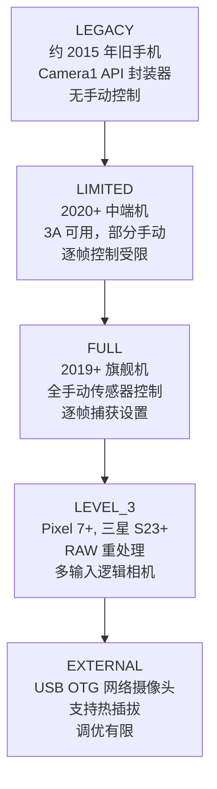
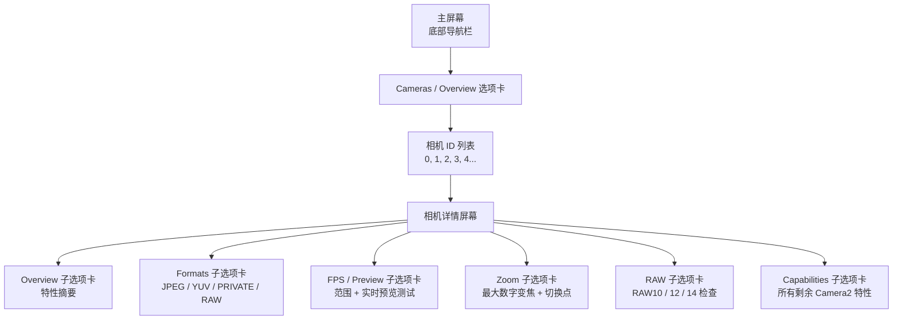

# 第 4 章：探索你自己的手机

这是你的应用变得重要的时刻。第 2 章和第 3 章为你提供了相机硬件和现代计算摄影功能的理论理解。本章是动手实践且针对具体设备的。你将在自己的手机上安装 **Android Camera Parameters** 配套应用，启动它，并系统地检查你的硬件能做什么和不能做什么——并边检查边记下答案。

你本章发现的信息并非学术琐事。Camera2 API 是按设备、按摄像头暴露功能的。在一个功能在你的个人 Pixel 10 上运行完美，但在中端 2023 三星 A 系列上可能会无声失败（或降级为无操作，甚至崩溃），因为该设备的 HAL 根本没有实现所需的功能。在本系列第二部分编写任何一行 Camera2 API 代码之前，你必须了解自己的测试设备具备什么能力。

到本章结束时，你将为自己的特定手机记录下：完整的相机 ID 列表及其朝向和硬件级别；每个摄像头支持哪些输出格式；最大 JPEG 分辨率；最高慢动作 FPS 范围；最大数字变焦和物理摄像头变焦切换阈值；以及你的主摄像头是否支持 RAW 输出。

## 安装 Android Camera Parameters 应用

有两个安装选项可用。选择你喜欢的一个。

### 选项 A —— 从源代码构建

如果你是一名 Android 开发者且已安装 Android Studio，此选项让你能够浏览配套应用的源代码（见本章最后一部分），甚至可以修改它来检查你感兴趣的其他 Camera2 特性。

1. 克隆 GitHub 仓库：
   `https://github.com/zoozooll/AndroidCameraParameters`
2. 在 Android Studio Iguana (2023.2.1) 或更高版本中打开项目。Gradle 同步将自动完成；该项目针对 Android SDK 34 (Android 14)，最低 SDK 版本 (`minSdkVersion`) 为 21 (Android 5.0 Lollipop)，因此它几乎可以在你拥有的任何手机上运行。
3. 在手机上启用 USB 调试。转到**设置 → 关于手机 → 版本号**，连续点击"版本号"项 7 次。将出现一个提示，内容为"您现在处于开发者模式"。返回主设置屏幕，进入**开发者选项**，并将 **USB 调试**切换为开启。
4. 使用 USB-C 数据线将手机连接到电脑。在手机上接受"允许从此计算机进行 USB 调试吗？"提示，并勾选"始终允许从此计算机"，以避免以后再次出现该对话框。
5. 从 Android Studio 顶部的下拉菜单中选择 **app** 运行配置（默认运行配置通常命名为 `app`）。确保连接的手机出现在设备下拉菜单中作为目标设备。
6. 点击绿色的**运行**按钮（三角形播放图标）或按 **Shift + F10**。Android Studio 将编译应用，通过 ADB 将 APK 安装到你的手机上，并自动启动它。

### 选项 B —— 从 Google Play 安装

如果你只想运行应用而不进行编译，或者想在多个最终用户设备上测试其行为而无需为每个设备配置 ADB，请使用 Play 商店版本。

在你的 Android 手机上打开 Google Play 商店并导航至：

`https://play.google.com/store/apps/details?id=com.minininja.cameraparams`

点击**安装**。该应用免费，且不含广告、无应用内购买、无跟踪器。它仅需要 `CAMERA` 权限（用于查询相机特性并打开预览界面）以及可选的 `RECORD_AUDIO` 权限（在当前版本中从未使用，但保留给未来的视频录制测试活动）。`ACCESS_FINE_LOCATION` 权限是可选的，仅当你想要在预览选项卡中为示例捕获标记 GPS 元数据时才需要。

安装完成后启动应用。首次启动时，在系统权限对话框出现时授予**相机**权限。没有此权限，应用将无法运行，因为 Android 的安全模型要求即使是*查询*相机的特性也需要运行时权限授予——如果没有 `CAMERA` 权限，你甚至无法枚举相机 ID。

## 相机 ID (Camera IDs)

查看应用的主屏幕。底部的第一个（也是默认的）选项卡标有 **Cameras**（在某些版本中可能称为 **Overview**）。此选项卡顶部的标题为 **All Camera IDs**。

Android 设备上的每个独立摄像头——每个后置摄像头、前置摄像头、任何逻辑多摄像头融合设备以及任何外部 USB OTG 网络摄像头——都被分配了一个唯一的字符串标识符，称为 **Camera ID**。相机 ID 几乎总是简单的十进制整数：`"0"`、`"1"`、`"2"`、`"3"`，在拥有多个摄像头的设备上甚至会有 `"4"`、`"5"`。在极少数设备上（一些外部网络摄像头和模拟器的虚拟摄像头），你可能会看到类似 `"camera@0"` 或 `"0@external"` 的相机 ID，但纯整数是迄今为止最常见的格式。

"All Camera IDs"列表中的每一行显示了三条信息，从左到右依次为：

1. 相机 ID 数字本身，显示为一个粗体徽章。
2. **LENS_FACING** 朝向：`BACK`（后置摄像头，背对屏幕）、`FRONT`（前置自拍摄像头，面向用户）或 `EXTERNAL`（USB 网络摄像头 / OTG 摄像头）之一。
3. 该摄像头的**硬件级别 (Hardware Level)**：一个彩色徽章，显示为 `LEGACY`、`LIMITED`、`FULL`、`LEVEL_3` 或 `EXTERNAL`。这直接对应于本系列第 1 章中描述的 Camera2 API 的 `INFO_SUPPORTED_HARDWARE_LEVEL` 特性。

举一个具体的例子，Galaxy S26 Ultra 通常会报告 **5 个相机 ID**：

- **ID 0**：BACK（后置广角 / 主 24mm 摄像头），硬件级别 = **FULL**
- **ID 1**：FRONT（自拍摄像头），硬件级别 = **LIMITED**
- **ID 2**：BACK（后置超广角 0.5 倍摄像头），硬件级别 = **FULL**
- **ID 3**：BACK（后置 5 倍潜望长焦摄像头），硬件级别 = **FULL**
- **ID 4**：BACK（代表 ID 0 + 2 + 3 融合组合的逻辑多摄像头 ID，由 HAL 管理以实现无缝变焦），硬件级别 = **FULL**

中端手机（例如三星 A54 5G）可能仅报告 3 个相机 ID：后置广角、后置超广角和前置。2016 年左右的廉价手机可能仅报告 2 个：后置和前置。

**针对你设备的任务：** 记下你手机报告的完整相机 ID 列表。对于每个 ID，记下其 LENS_FACING（后置 / 前置 / 外部）及其硬件级别徽章的颜色/标签。计算摄像头总数。如果你看到一个用途不明显的相机 ID（例如，一个与手机背面明显的镜头凸起不对应的额外后置 ID），请留意它——这些通常是 ToF 深度传感器、微距摄像头或逻辑多摄像头融合设备。

## 硬件级别 (Hardware Levels)

本系列第 1 章介绍了五个 Camera2 硬件级别，从能力最弱到最强排列：**LEGACY → LIMITED → FULL → LEVEL_3 → EXTERNAL**。本节将刷新该层级结构，并要求你使用应用检查每个摄像头的级别。

每个级别都增加了新的功能和更严格的性能保证：

- **LEGACY**：Camera2 API 是作为已弃用的 `android.hardware.Camera` (Camera1) API 之上的薄封装实现的。几乎没有任何功能能可靠工作——没有手动曝光，没有逐帧控制，没有 RAW 支持。你可以在 2026 年放心地忽略 LEGACY 设备；基本上没有还在活跃使用的手机会报告此级别。
- **LIMITED**：中端手机以及各档次手机前置摄像头最常见的硬件级别。3A（自动曝光、自动对焦、自动白平衡）算法运行正常，基础 YUV 和 JPEG 输出工作正常，但大多数手动传感器控制不可用（没有低于 AE 下限的手动快门速度，没有手动增益控制，逐帧捕获设置更新延迟超过 3–5 帧）。
- **FULL**：旗舰机的黄金标准级别。保证每个 Camera2 API 功能都能正常工作：针对每个独立帧全手动控制传感器曝光时间和模拟增益，保证遵守帧率，在 30+ fps 下进行连拍且每帧设置不同，YUV 重处理，基础 DNG RAW 输出。如果你的手机后置主摄像头报告为 FULL，则你可以实现本教程系列中的每一项功能。
- **LEVEL_3**：最高等级，随 Pixel 7 和三星 S23 系列于 2022/2023 年引入。增加了保证的 RAW 重处理输入流（你可以将先前捕获的 DNG 馈回 ISP，并使用不同的色调映射或色彩矩阵重新运行管线）、多分辨率 YUV 输出流以及保证的逻辑多摄像头融合支持。
- **EXTERNAL**：用于通过 USB-C 插入的 USB OTG 网络摄像头和 HDMI 采集器。API 表面相同，但不存在工厂校准数据（没有 OTP 存储的镜头遮蔽图，没有每个模块的色彩校正矩阵），因此外部摄像头的质量参差不齐。

**如何在应用中检查：** 点击列表中任何相机 ID 旁的**硬件级别 (Hardware Level)** 徽章。将弹出一个底边栏对话框，显示该摄像头的完整 `INFO_SUPPORTED_HARDWARE_LEVEL` 描述，以及该级别保证（或不保证）的关键功能列表。

**针对你设备的任务：** 对于你的后置主摄像头（通常是 ID 0），确认它报告的硬件级别。对于你的前置摄像头，确认其级别。然后问自己这个问题并在继续阅读前思考答案：**为什么前置摄像头几乎普遍报告为 LIMITED 而非 FULL？**

答案是前置摄像头通常是成本较低、较简单的传感器。3A 算法在它们上面运行可靠（毕竟自拍需要自动曝光和自动白平衡才能产出可接受的输出），但手动传感器控制对自拍来说并不是产品优先级。没有人会为了 1300 万像素自拍摄像头上的手动 1/1000s 快门速度支付溢价。因此，HAL 供应商针对自拍用例优化了其 LIMITED 级别的实现，而从未实现通过 FULL 级别 Camera2 CTS（兼容性测试套件）测试所需的额外测试和验证。

## 可用摄像头：朝向

Android 为 `LENS_FACING` 相机特性定义了三个可能的值。应用在 Cameras 选项卡顶部提供了一个过滤器切换栏，可以在它们之间切换：**All · Back · Front · External**。

- **BACK**：手机背面的摄像头，背对屏幕。任何后置超广角、广角、长焦、潜望、微距或 ToF 传感器都会报告 `LENS_FACING_BACK`。这是你的应用 90% 的时间会用到的摄像头。
- **FRONT**：自拍摄像头，当屏幕面向用户时指向用户。请注意，来自前置摄像头的预览图像通常由默认相机应用进行水平镜像（左右翻转），以匹配用户在镜子中看到的画面，但除非你的应用显式操作，否则写入 JPEG 文件的实际像素数据是不经过镜像的。
- **EXTERNAL**：通过 USB-C 连接的 USB OTG 网络摄像头、USB 内窥镜、USB HDMI 采集卡或其他热插拔视频输入设备。Camera2 API 最被低估的功能之一是：外部摄像头通过*完全相同的代码路径*暴露，就像内部摄像头一样。一个编写良好的 Camera2 应用会自动枚举并使用 USB 网络摄像头，而不需要任何 USB 专用代码，只要手机的 USB-C 端口支持主机模式下的 USB 视频类 (UVC) 设备模式即可。

**针对你设备的任务：** 使用过滤器切换 Back、Front 和 External。计算每个类别下的摄像头数量。你的手机现在列出了任何 EXTERNAL 摄像头吗？几乎肯定没有——除非你插了一个 USB 网络摄像头。如果你恰好拥有一个 USB 网络摄像头或 USB 内窥镜，请现在通过 USB-C OTG 转接器将其插入手机，并点击应用右上角菜单中的**刷新 (Refresh)** 按钮。你应该会看到一个带有 LENS_FACING = EXTERNAL 的新相机 ID 出现。打开该外部摄像头的 Preview 选项卡——如果一切正常，你将看到来自网络摄像头的实时预览，使用的正是 30 秒前打开内部后置相机的完全相同的 Camera2 API 代码路径。

## 支持的输出格式

每个 Camera2 相机设备都宣传一个支持的**输出格式**列表，以及针对每种格式支持的分辨率/尺寸对列表。如果你的应用尝试针对该相机未宣传的格式/尺寸组合进行拍摄请求，Camera2 API 将予以拒绝。

该应用在相机详情屏幕中展示了此信息。要进入详情屏幕，请在 Cameras 选项卡中点击任何相机 ID 行。你将被带到一个带有多个可滑动子选项卡的详情屏幕：**Overview · Formats · FPS · Zoom · RAW · Capabilities**。滑动（或点击选项卡栏）到 **Formats** 选项卡。

Android SDK 中有数十种可能的 `ImageFormat` 常量，但以下 **5 种格式**占据了现实世界中 99% 的 Camera2 应用用法。该应用在 Formats 选项卡顶部列出了它们并附带通俗的说明：

1. **JPEG**：你通过电子邮件、社交媒体或消息分享的正常处理过的照片。8 位 YCbCr 4:2:0 色彩，经过 ISP 处理（应用了第 2 章中的所有 8 个阶段），有损 DCT 压缩。文件体积小。这是默认且最常见的静态捕获输出。
2. **YUV_420_888**：用于设备端处理的通用未压缩格式。8 位 Y（亮度）平面加上 8 位 Cb 和 Cr（色度）平面，水平方向 2:1 抽样。用于人脸检测、二维码扫描、条形码扫描、机器学习推理（TensorFlow Lite, PyTorch Mobile）、编码为 JPEG 之前的自定义图像处理，以及作为 MediaCodec 视频编码器的输入用于视频录制。
3. **PRIVATE**：用于向显示屏进行高速预览的专有零拷贝格式。实际的像素布局由供应商决定且对应用隐藏（因此称为 "private"）。PRIVATE Surface（通常是 `SurfaceView`、`TextureView` 或带有 `PRIV` 使用标志的 `ImageReader`）跳过所有 CPU 可访问的拷贝，直接从 ISP 输出到显示合成器。这是唯一能保证在现代旗舰机上实现 60 fps 或 120 fps 全分辨率预览的格式。
4. **RAW_SENSOR**：来自传感器的未经处理的拜耳马赛克数据，在任何 ISP 阶段运行之前。位深随传感器而异：RAW10（每采样 10 位）、RAW12（12 位）或 RAW14（14 位）。写入 DNG（数字负片）文件，用于在 Adobe Lightroom、Capture One 或 Darktable 中进行桌面后期制作。仅硬件级别为 FULL 或更高的摄像头支持 RAW 输出；LIMITED 和 LEGACY 摄像头从未支持。
5. **JPEG_R**：Ultra HDR 格式，在 Android 14 中引入。一个标准的 8 位 JPEG 主图像（向下兼容所有查看器）加上一个嵌入的 10 位增益图，支持 HDR 的查看器（Android 14 系统相册、Chrome 120+、Adobe Lightroom 7+、Apple iOS 18 照片）可以使用它在 HDR10 或 Dolby Vision 显示器上重建完整的 10 位 HDR 亮度范围。仅 2023+ 年的旗舰手机支持 JPEG_R 输出。

**针对你设备的任务：** 在应用中点击你的后置主摄像头 (ID 0)，滑动到 **Formats** 选项卡。应用会显示该摄像头支持的每种输出格式，并在每种格式下显示支持的所有分辨率列表，按从大到小排列。记下：

- 上面列出的 5 种格式（JPEG, YUV_420_888, PRIVATE, RAW_SENSOR, JPEG_R）中，你的主摄像头支持哪些？
- **最大 JPEG 分辨率**是多少？这几乎总是接近（但不一定完全等于）传感器的活动阵列像素尺寸。一个 4800 万像素传感器可能会将 8000×6000 (48MP full)、4000×3000 (12MP binned)、1920×1080 (2MP) 和 1280×720 (1MP) 列为 JPEG 尺寸。
- 是否存在 RAW_SENSOR？如果是，请注意你的手机支持 DNG RAW 拍摄；我们将在第 18 章中使用这项能力。
- 是否存在 JPEG_R (Ultra HDR)？这告诉了你设备的 ISP 是否能够输出增益图 HDR 静态图像。

对前置摄像头以及（如果存在）后置超广角和长焦摄像头重复此练习。

## FPS（每秒帧数）范围

滑动到相机详情屏幕中的 **FPS / Preview** 选项卡。Camera2 API 并不将相机的"最大 FPS"报告为单个数字。相反，每个摄像头都会报告一个 **FPS 范围**列表，每个范围记作 `[minimum_fps, maximum_fps]`。相机 HAL 保证，如果你的应用配置了该 FPS 范围的会话，传感器的自动曝光算法将选择一个曝光时间，使实际帧率保持在这两个边界之间。

你在现代手机上通常会看到的条目：

- `[15, 30]`：正常的自适应预览。在曝光时间变长的极暗场景中，AE 算法可以自由地将帧率降至 15 fps。这是几乎所有静态相机预览用例的默认设置。
- `[30, 30]`：固定 30 fps。AE 永远不会超过 1/30 秒的曝光时间；如果场景太暗，则提升模拟增益。用于标准的 30 fps 视频录制。
- `[60, 60]`：固定 60 fps。用于游戏相机用例或 60 fps 视频录制的平滑预览。要求传感器的滚动读取速度足够快，能维持每秒 60 个完整帧。
- `[120, 120]`：固定 120 fps，用于 4 倍慢动作视频拍摄。通常仅在较低分辨率（1080p 或更低）下可用。
- `[240, 240]`：固定 240 fps，用于 8 倍慢动作视频。几乎总是仅在 720p 分辨率下可用。
- `[960, 960]`：固定 960 fps，用于 32 倍超慢动作。极其罕见；仅有少数索尼 Xperia 和三星 Galaxy 顶级旗舰支持，且仅支持在 720p 下进行非常短（0.2–0.3 秒）的预录制连拍。

应用在可滚动列表中显示了所有支持的 FPS 范围。列表下方是一个预览测试卡：点击 **Start 60fps Preview Test**，应用将开启一个固定 60fps 的预览流，并在角落显示实时 FPS 计数器，以便你验证设备上是否真的能达到 60fps。

**针对你设备的任务：** 对于后置主摄像头，记下支持的完整 FPS 范围列表。回答这些问题：

- 是否存在 `[60, 60]`？你的手机支持平滑的 60fps 预览。
- 是否存在 `[120, 120]`？你的手机支持 4 倍慢动作。
- 是否存在 `[240, 240]`？你的手机支持 8 倍慢动作。
- 是否存在 `[960, 960]`？如果是，你的手机是顶级旗舰——尽情享受超慢动作吧！

现在对比前置摄像头的列表。前置摄像头的 FPS 列表几乎总是较短：它很少有 240fps 或 960fps 条目，有时甚至缺少 60fps 条目。

## 变焦范围与相机切换点 (Zoom Ranges and Camera Switch Points)

滑动到相机详情屏幕中的 **Zoom** 选项卡。此选项卡展示了相机的变焦能力。

你看到的第一个数字标为 **SCALER_AVAILABLE_MAX_DIGITAL_ZOOM**。这是一个浮点值，如 `10.0`、`20.0` 或 `100.0`，代表 HAL 为该摄像头支持的最大*数字*变焦倍率。值 10.0 意味着你可以裁剪传感器中心 1/10 的像素（线性地——宽度 1/10 且高度 1/10 = 总像素数的 1%），并且仍能获得有效的输出流。请注意，超过约 2 倍的数字变焦会产生明显的模糊和像素感；三星旗舰机上的营销话术 "100 倍空间变焦" 其实是 10 倍光学（潜望镜）× 10 倍数字变焦，在 100 倍时，图像本质上只是 1% 的传感器像素经过 AI 锐化后的放大结果。

对于**逻辑多摄像头设备**（例如 Galaxy S26 Ultra 的相机 ID 4，它融合了广角、超广角和潜望长焦），Zoom 选项卡还会显示**光学变焦倍率**图表和 HAL 管理的相机切换点。以下是一个来自 Galaxy S26 Ultra 的代表性例子：

- **0.5×**：活动摄像头 = 超广角 (ID 2)。在 0.7 倍以下，输出是 100% 的超广角传感器。
- **0.7× → 0.9×**：融合区域。HAL 同时捕获超广角和广角摄像头，对其进行对齐并淡入淡出输出。用户看不到跳动。
- **1.0× (默认)**：活动摄像头 = 广角 / 主摄像头 (ID 0)。这是 80% 日常照片使用的摄像头。
- **1.1× → 2.9×**：广角传感器的数字裁剪。随着变焦倍率增加，画质逐渐下降。
- **2.9× → 3.1×**：融合区域。HAL 从数字裁剪的广角淡入淡出到原生的 3 倍潜望长焦传感器。
- **3.0×**：活动摄像头 = 3 倍长焦（如果存在），或潜望裁剪的开始。
- **5.0× → 9.9×**：5 倍潜望传感器 (ID 3) 的数字裁剪。
- **10.0×**：原生 10 倍潜望输出（如果该潜望镜头支持）。
- **10.1× → 30.0×**：10 倍潜望输出的数字裁剪。在 30 倍时，你看到的是原始传感器面积经放大后的 1/900——营销噱头十足，但在摄影上大多数情况下并无大用。

该应用为此提供了一个交互式测试。返回相机详情屏幕的 **Preview** 选项卡。你将看到实时相机预览和屏幕底部的变焦倍率滑块。

**针对你设备的任务：** 在预览界面上执行缓慢、稳定的双指缩放手势，或者从左向右平滑拖动变焦滑块。观察变焦倍率数值标签。当你经过特定阈值（0.5×, 1.0×, 3.0×, 5.0×, 10.0×）时，你会注意到预览图像在视野、清晰度甚至色调上会发生短暂的"跳动"——这些跳动正是 HAL 在逻辑多摄像头设备背后切换活动物理摄像头。记下你观察到的变焦切换点。如果你想要最大画质而非 HAL 管理的数字裁剪，这些特定阈值就是你作为 Camera2 API 开发者希望在不同物理相机 ID 之间切换拍摄请求的倍率。

## RAW 支持

返回 **Formats** 选项卡。选项卡栏右上角有一个过滤器切换：**All / Processed / RAW**。点击 **RAW** 将格式列表过滤为仅显示 RAW 格式。

如果此摄像头支持 RAW_SENSOR，应用将列出所有可用的 RAW 变体。2026 年 Android 上最常见的 RAW 位深：

- **RAW10**：每采样 10 位。在中端手机以及旗舰机的超广角/长焦摄像头上最常见。每个拜耳通道有 1,024 个不同级别。
- **RAW12**：每采样 12 位。旗舰机主广角摄像头的默认值。每个通道 4,096 个级别。极佳的编辑空间。
- **RAW14**：每采样 14 位。非常罕见；仅在专业级手机上出现，如索尼 Xperia Pro-I 或小米 13 Ultra 的 1 英寸传感器。每个通道 16,384 个级别。与许多 APS-C 单反相机的编辑宽容度相当。
- **RAW_SENSOR**：映射到设备默认 RAW 位深的通用标记。你可以随时请求 `RAW_SENSOR` 格式，HAL 将为你替换为适当的位深变体。

来自 `RAW_SENSOR` 流的 DNG 文件还嵌入了每个模块的工厂校准数据：色彩滤镜阵列模式、将传感器原生 RGB 映射到 D65 光源 XYZ 的色彩矩阵、中性色彩点、每通道黑电平和每通道白电平。桌面 RAW 编辑器需要所有这些元数据才能解读原本无法解读的拜耳马赛克数据。

**针对你设备的任务：** 你的后置主摄像头是否存在 RAW_SENSOR？如果是，列出了哪些位深变体？记下答案。在本系列第 18 章中，你将学习如何打开 RAW 输出流、捕获 DNG 文件，并将其带有正确的 EXIF 和元数据写入应用存储。如果不支持 RAW（前置摄像头和中端 LIMITED 设备常见），那么在你自己的 Camera2 应用中，该摄像头将无法进行 RAW 拍摄，你应该设计你的应用在缺少该能力时优雅地隐藏"拍摄 RAW" UI 选项。

## 源代码 (Source Code)

**Android Camera Parameters** 配套应用是 100% 开源的。GitHub 仓库地址为：

`https://github.com/zoozooll/AndroidCameraParameters`

如果你按照选项 A 从源代码构建了应用，那么你的机器上已经有了这些代码。如果你是从 Google Play 安装的，你可以随时克隆该仓库，看看应用是如何查询你刚刚检查的每个值的。浏览源代码，你将发现：

- 应用如何使用 `CameraManager.getCameraIdList()` 来枚举所有相机 ID。
- 它如何读取 `CameraCharacteristics.LENS_FACING` 和 `INFO_SUPPORTED_HARDWARE_LEVEL` 来填充主 Cameras 选项卡上的徽章。
- 它如何查询 `SCALER_STREAM_CONFIGURATION_MAP` 来枚举每种支持的格式和分辨率，以及它是如何为 Formats 和 RAW 选项卡过滤该列表的。
- 它如何读取 `CONTROL_AE_AVAILABLE_TARGET_FPS_RANGES` 来构建 FPS 范围列表。
- 它如何查询 `SCALER_AVAILABLE_MAX_DIGITAL_ZOOM` 和 `SCALER_AVAILABLE_ZOOM_RATIOS` 来构建变焦切换图表和交互式预览变焦滑块。

应用显示的每个值都是从同一个 `CameraCharacteristics` 映射中读取的，你的 Camera2 API 代码将从第 5 章开始查询该映射。配套应用实际上是本教程系列第二部分前几章节的可视化参考实现。

## 小结

在本动手实践章节中，你在自己的 Android 手机上安装了 Android Camera Parameters 配套应用（通过编译 GitHub 源码 `https://github.com/zoozooll/AndroidCameraParameters` 或从 Google Play 安装 `https://play.google.com/store/apps/details?id=com.minininja.cameraparams`）。你枚举了设备上的每个相机 ID，并记录了每个 ID 的 LENS_FACING（后置 / 前置 / 外部）及其硬件级别（LEGACY → LIMITED → FULL → LEVEL_3 → EXTERNAL），并了解了为什么前置摄像头几乎普遍报告为 LIMITED 而非 FULL。你使用朝向过滤器查看了后置 vs 前置 vs 外部摄像头的细分，并且（如果你手头有 USB 网络摄像头）验证了 Camera2 API 枚举 USB OTG 摄像头与内部摄像头的路径完全相同。你检查了每个摄像头支持的输出格式（JPEG, YUV_420_888, PRIVATE, RAW_SENSOR, JPEG_R Ultra HDR），并记下了最大 JPEG 分辨率以及是否支持 RAW 和 Ultra HDR。你枚举了每个摄像头的 FPS 范围，并了解了你的手机可以捕获哪些慢动作速度。你探索了变焦滑块，并确定了在双指缩放期间活动物理摄像头发生变化的 HAL 管理切换点。最后，你确认了主摄像头是否支持 RAW_SENSOR 输出以及位深，并受邀浏览了配套应用的开源代码，以了解这些值是如何从 Camera2 API 中读取的。

## 下一章

本系列的第一部分现已完成。你已经掌握了硬件基础（第 2 章）、计算摄影功能词汇（第 3 章）以及你自己手机的具体能力图谱（第 4 章）。第二部分从第 5 章开始，涉及你的第一段 Camera2 API 代码：打开 `CameraManager`、以编程方式枚举 `CameraCharacteristics`、打开 `CameraDevice`、创建 `CaptureSession` 并向 `TextureView` 发送第一个重复预览请求——从零开始用 100 行 Kotlin 代码实现屏幕上的实时相机预览。
