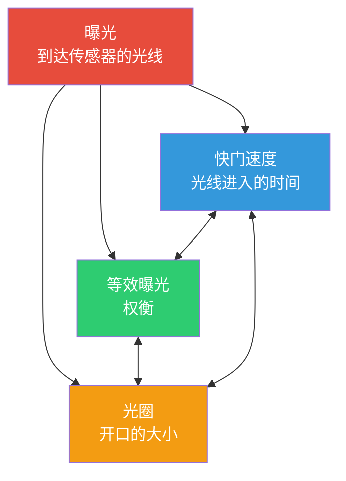

# 第 13 章：曝光

## 曝光三角：三个旋钮，一个目标

当你用智能手机拍照时，你实际上是在捕捉光线。到达传感器的光线**量**决定了你的照片是太暗（欠曝）、太亮（过曝）还是恰到好处（曝光正确）。三个基本控件管理着这一点——它们共同构成了**曝光三角**。



**核心思想：** 三角形的每个角都控制光线，但每个角也都会引入一种*创意权衡*。你可以通过三个设置的不同组合实现*相同*的总曝光量——但每种组合都会为你的照片带来不同的*观感*。

在我们在下一章深入探讨 Android Camera2 API 的细节之前，让我们先为每个元素建立稳固的直观基础。

---

## ISO：传感器灵敏度（增益控制）

在胶片时代，**ISO** 描述的是*胶片对光线的敏感度*——ISO 100 胶片较"慢"，需要明亮的光线，而 ISO 800 胶片较"快"，可以在室内拍摄。

**在数字摄影（包括智能手机相机）中，ISO 是传感器增益 / 电子放大。** 当你将 ISO 值加倍时，你实际上是将应用于传感器模拟信号的放大倍数加倍，然后再将其数字化。

### ISO 的工作原理

想象传感器的像素井正在收集光子（光粒子）。在曝光期结束后：

1. 每个像素将积累的光子转换为微小的电荷
2. **模拟增益放大器**将该信号乘以与你的 ISO 设置相对应的系数
3. 放大后的信号被转换为数字信号 (ADC)
4. 数字处理随后进行进一步处理（降噪、色调映射）

**ISO 100 = 基础 / 最低增益。** 信号放大倍数最低，因此：
- 照片*干净*，数字噪声（噪点）最少
- 动态范围（可记录的最亮和最暗色调之间的差异）最高
- 色彩最准确

**ISO 3200 = 高增益。** 信号被放大 32 倍：
- 你可以在更暗的场景中拍摄，而无需增加快门时间
- 但你会得到*可见的噪声*（彩色斑点、亮度噪点）
- 动态范围和色彩准确度显著下降

### 典型智能手机 ISO 范围

| ISO 范围 | 特征 | 用例 |
|-----------|---------------|----------|
| 50–200 | 基础 ISO，图像最干净 | 明亮的日光，影棚照明 |
| 200–800 | 中等增益，轻微噪声 | 阴天，背阴处 |
| 800–3200 | 可见噪声，仍可用 | 室内照明，黄昏 |
| 3200–12800+ | 重度噪声 / 应用重度降噪 | 夜景，暗光活动 |

> **智能手机现实注记：** 旗舰手机通常在较高的 ISO 值下应用重度计算降噪（供应商特定的"夜间模式"处理）。当你稍后在 Camera2 中禁用自动管线时，你将*失去*许多这些 OEM 优化——这是我们将在第 14 章回归的一个关键警告。

---

## 快门速度（曝光时间）

**快门速度**简单来说就是*传感器暴露在光线下的时间长短*。在传统相机中，机械快门会物理性地开启和关闭。在智能手机中，它几乎总是**电子快门**——传感器被重置，允许收集光线一段时间（精确时长），然后读取数据。

快门速度以**秒**为单位，通常表示为分数：

| 快门速度 | 它的作用 | 典型用途 |
|--------------|-------------|-------------|
| 1/2000s – 1/1000s | 极短曝光，冻结所有动作 | 运动、鸟类、快速行驶的车辆 |
| 1/500s – 1/250s | 冻结典型的人类动作 | 走动的人、玩耍的孩子 |
| 1/125s – 1/60s | 配合防抖的"安全"手持速度 | 稳健手持拍摄的一般摄影 |
| 1/30s – 1/15s | 可见轻微运动模糊，需要三脚架 | 创意动态，弱光 |
| 1s – 30s | 长曝光，重度运动模糊 | 瀑布、星轨、丝滑的水面 |
| 30s+ | 超长曝光（专业） | 天文摄影、光绘 |

### 运动模糊效果

除了"获得足够光线"之外，有两个理由让你刻意选择特定的快门速度：

1. **冻结动作：** 以 1/1000s 拍摄飞行中的鸟，每一根羽毛都清晰可见，因为鸟在曝光期间移动的距离几乎为零。

2. **创造运动模糊：** 以 2 秒拍摄瀑布，移动的水流会呈现出平滑、丝滑的白色痕迹——因为在传感器曝光期间，每一滴水都经过了传感器上的许多像素。

把它想象成一种长曝光绘画：*任何在快门开启期间移动的东西都会变成条纹。*

**对于视频很重要：** 拍摄 30fps 视频时，每一帧的曝光时间*最多*约为 1/30s。电影制作人遵循 **180° 快门法则**：将快门速度设置为帧率的两倍 → 对于 30fps 视频，设置为 1/60s。这能提供自然的、"电影感"的运动模糊，既不会太生硬也不会太模糊。

---

## 光圈

**光圈**是镜头内部光线通过的开口大小。它以 **f 值** (f-stops) 来衡量 (f/1.4, f/2.0, f/2.8, f/4.0, f/5.6, f/8.0 等) —— 这是一个*反直觉的刻度，数字越小 = 开口越宽*。

```
  f/1.4     f/2.0     f/2.8     f/4.0     f/5.6     f/8.0
█████████████████████████████████████████████████████████
█████████████████                              █████████
███████████████                                  ███████
█████████████                                    ██████
████████████                                      █████
███████████                                      ██████
```

**每档光线减半：** 从 f/1.4 → f/2.0 → f/2.8 → f/4.0 移动，每一步都会使开口面积*减半*，因此通过的总光线减少一半。这就是每步减暗一"档"。

### 光圈权衡（创意与实践）

1. **景深 (DoF)：** 大光圈 (f/1.8) = *浅*景深 —— 只有窄窄的一层平面在焦点内；之前/之后的任何东西都会模糊（虚化/焦外）。小光圈 (f/8) = *深*景深 —— 从前景到背景的一切都是清晰的。

2. **集光能力：** f/1.4 比 f/2.8 多收集 4 倍的光线。这就是为什么"大光圈镜头"（宽最大光圈）在弱光拍摄中备受青睐的原因。

3. **衍射：** 在极小的光圈 (f/11+) 下，光波会绕过光圈叶片弯曲，使图像略微变软。这在智能手机上通常无关紧要。

### 智能手机现状检查

大多数智能手机拥有**固定光圈镜头** —— 你无法更改 f 值。廉价手机可能是 f/2.4–f/2.8；旗舰机通常达到 f/1.4–f/1.8。[Android Camera Parameters 应用](https://play.google.com/store/apps/details?id=com.minininja.cameraparams)让你可以在 `CameraCharacteristics` 中检查镜头的固定光圈。

少数高端手机（例如三星 Galaxy S23 Ultra、索尼 Xperia 系列）提供*双光圈*机制，可以在两个档位（例如 f/1.5 和 f/2.4）之间机械切换。在 Camera2 中，查询 `LENS_INFO_AVAILABLE_APERTURES` 看看你的设备是否支持多种光圈。

**实践启示：** 对于大多数 Android Camera2 开发，光圈是*固定的*，因此你仅通过 **ISO + 快门速度**控制曝光。两个旋钮而不是三个 —— 这实际上简化了事情！

---

## EV：曝光值（对数刻度）

当摄影师说"调整一档"时，他们的意思是**将总光量加倍或减半**。为了使基于"档"的思维更加精确，行业标准化了**曝光值 (EV)**。

**EV 0** 被定义为产生标准参考亮度的曝光组合：**1 秒曝光，f/1.0 光圈，ISO 100**。

每 **+1 EV 将光量加倍**（更亮）。每 **−1 EV 将光量减半**（更暗）：

| EV 变化 | 含义 |
|-----------|---------|
| +3 EV | 8 倍光量 (2³) |
| +2 EV | 4 倍光量 |
| +1 EV | 2 倍光量 |
| 0 EV | 参考：1s @ f/1.0 ISO 100 |
| −1 EV | ½ 光量 |
| −2 EV | ¼ 光量 |
| −3 EV | ⅛ 光量 |

美妙之处在于：**任何总和为相同 EV 值的 ISO + 快门 + 光圈组合，都会产生相同的总曝光量**。这就是连接三角形三个角的*等效曝光*原则。

### EV 与 ISO/快门组合

在固定光圈的情况下，EV 方程大大简化。对于光圈为 f/1.8 的智能手机：

| 场景 | 典型 EV | ISO 100 快门 | ISO 400 快门 | ISO 1600 快门 |
|-------|-----------|----------------|-----------------|------------------|
| 明亮的阳光沙滩 | 15 | 1/4000s | 1/1000s | 1/250s |
| 阴天 / 多云 | 12 | 1/500s | 1/125s | 1/30s |
| 明亮的室内办公室 | 8 | 1/30s | 1/8s | 1/2s |
| 夜间的起居室 | 4 | 2s | 0.5s | 1/8s |
| 星空夜景 | −2 | 30s | 8s | 2s |

### 著名的阳光 16 法则

在矩阵测光和复杂的自动曝光算法出现之前，摄影师依靠一种经验法则，在没有测光表的情况下锁定日光下的曝光：

> **在晴天，将光圈设置为 f/16，快门速度设置为 1/ISO 秒。**

| 阳光 16 (f/16) | f/1.8 等效 (智能手机) |
|-----------------|----------------------------------|
| ISO 100, 1/100s, f/16 → EV 15 | ISO 100, 1/4000s, f/1.8 → EV 15 ✓ |
| ISO 200, 1/200s, f/16 → EV 15 | ISO 200, 1/8000s, f/1.8 → EV 15 ✓ |

计算结果吻合：f/1.8 比 f/16 宽约 **6⅓ 档**。每一档加倍？不 —— 每一档*光线面积*加倍。2^(6.33) ≈ 80 倍光量。因此快门速度必须快 80 倍来补偿：1/100s ÷ 80 ≈ 1/8000s (在 ISO 200 下)。对于实地拍摄来说足够接近了。

---

## 欠曝 / 正确 / 过曝的观感

让我们心理对比一下同一场景（例如，一个人在户外，身后是天空）的三种拍摄效果：

**欠曝 (−2 EV)：** 主体太暗。阴影被*压死*成纯黑，没有细节。在直方图中，所有数据都堆积在左侧（暗部）。天空看起来可能不错，但人看起来像个剪影。你*可以*尝试在后期处理中"提亮"欠曝的原始数据，但阴影会露出严重的噪声，因为你在放大一个微弱的信号。

**曝光正确 (0 EV)：** 中间调显示出正常的质感。人的脸上有可见的皮肤细节、衣服褶皱、眼睛高光。直方图数据分布在整个范围内，两端没有硬剪裁。在动态范围有限的手机上，这可能意味着*一些*明亮的天空高光会剪裁成白色（没有蓝色细节） —— 这是一个相对于让主体欠曝的经典权衡。

**过曝 (+2 EV)：** 高光*溢出*成纯白，无法恢复。天空是一个均匀的白色平面；明亮的衬衫纽扣和镜面反射被剪裁。人的皮肤看起来可能很讨喜（很亮），但你永久失去了所有高光细节。不像欠曝的阴影（你通常可以用噪声来部分恢复），*溢出的高光永远消失了* —— 那些像素中根本没有数据。

**摄影师的信条：** *宁欠勿过 (Expose for the highlights, recover the shadows)。* 在 RAW 拍摄中（我们稍后会介绍），这一点尤为强大，因为 14 位 RAW 存储了足够的阴影细节，可以拉升 +2 EV 或更多而不会产生毁灭性的噪声。

---

## 现实世界 EV 参考表

记住几个里程碑式的 EV 值可以让你在任何地方估算曝光：

| 场景 | 典型 EV (在 ISO 100 下) | 大致快门 @ f/1.8, ISO 400 |
|-------|------------------------|--------------------------------|
| 直射阳光下的雪景 | 16 | 1/4000s |
| 阳光沙滩，晴朗的一天 | 15 | 1/2000s |
| 典型的晴天 | 14 | 1/1000s |
| 阴天 / 多云 | 12 | 1/250s |
| 浓云 / 下雨 | 11 | 1/125s |
| 开阔阴影处（人在阴影中，背景被日光照亮） | 9 | 1/30s |
| 日落 / 黄金时段 | 7 | 1/8s |
| 明亮的室内办公室 | 8 | 1/15s |
| 家中起居室，仅靠灯光 | 4 | 1/2s |
| 昏暗的餐厅内部 | 2 | 2s |
| 夜间的城市街道（霓虹灯） | 1 | 4s |
| 夜间风景，远处的城市灯光 | −2 | 30s |
| 月光下的风景（满月） | −3 | 1 分钟 |
| 星空，无月亮 | −6 | 8 分钟 |

你可以针对你手机自动曝光实际选择的数值来验证这些近似值。启动 [Android Camera Parameters 应用](https://github.com/zoozooll/AndroidCameraParameters)，进入实时预览，并观察当你从阳光明媚处走到暗室时 `SENSOR_EXPOSURE_TIME` 和 `SENSOR_SENSITIVITY` 的变化 —— 你会看到映射到此表的真实数值。

---

## 综合：等效曝光

假设你想要*相同的总曝光量* (EV 12 = 阴天，f/1.8 智能手机)。以下是产生相同传感器亮度的三个有效组合：

| 组合 | ISO | 快门速度 | 观感与质感 |
|-------------|-----|---------------|-------------|
| 干净且锐利 | 100 | 1/500s | 噪声最少，对动作的冻结最清晰 |
| 折中方案 | 400 | 1/125s | 轻微噪声，良好的平衡 |
| 平滑运动 | 1600 | 1/30s | 可见噪声；移动主体会有轻微模糊 |

三者都落在相同的 EV。三者*看起来同样亮*。但*质感*（噪声噪点）和*运动刻画*是完全不同的。**这就是曝光的艺术。**

### 如果我两者都需要呢？

这就是计算摄影大放异彩的地方。手机处于"夜间模式"时不是拍摄*一张* 2 秒的照片 —— 它捕获了*几十张* 1/60s 的帧（在每一张中冻结动作），然后通过计算进行对齐和平均。结果在大约获得长曝光集光能力的同时，没有运动模糊的惩罚。

一旦你理解了 Camera2 级别的手动曝光，你就可以自己实现类似的技术。

---

## 小结

在本章中，我们涵盖了*摄影基础知识*，而没有触及任何一行 Android 代码：

- **曝光三角：** 快门速度（时间）、ISO（传感器增益）和光圈（开口大小）结合起来控制总光量。每一个都有创意权衡。
- **数字摄影中的 ISO** = 模拟传感器增益。低 ISO = 干净，高 ISO = 噪点。智能手机通常支持带有 OEM 降噪的 ISO 100–6400+。
- **快门速度** 是曝光时间（秒）。快速快门 (1/1000s) 冻结动作；慢速快门 (1s+) 创造运动模糊。180° 快门法则适用于视频。
- **光圈** 是由 f 值控制的镜头开口。大多数智能手机光圈固定，因此我们仅依靠 ISO + 快门。
- **EV (曝光值)** 是对数档位刻度，每个 ±1 步长使光量加倍/减半。EV 0 = 1s @ f/1.0 ISO 100。
- **阳光 16 法则** 和 EV 参考表让你无需测光即可估算曝光。
- **正确曝光** 平衡了中间调细节，避免压死阴影和溢出高光。RAW 保留了恢复空间。

## 下一章

在**第 14 章：Camera2 中的手动曝光**中，我们将把这套概念模型转化为具体的 Camera2 API 调用。你将学习：

- 如何禁用自动曝光管线 (`CONTROL_MODE = OFF`, `CONTROL_AE_MODE = OFF`)
- 如何将 ISO 值映射到 `SENSOR_SENSITIVITY`
- 如何在人类可读的秒 ↔ 纳秒之间转换 `SENSOR_EXPOSURE_TIME`
- 完整的 Kotlin 代码，用于固定间隔拍摄曝光、夜间长曝光和 3 张连拍的曝光包围序列
- 关于关闭 3A 时 OEM 降噪会被禁用的关键警告

准备好你的思考帽 —— 代码部分马上开始。
