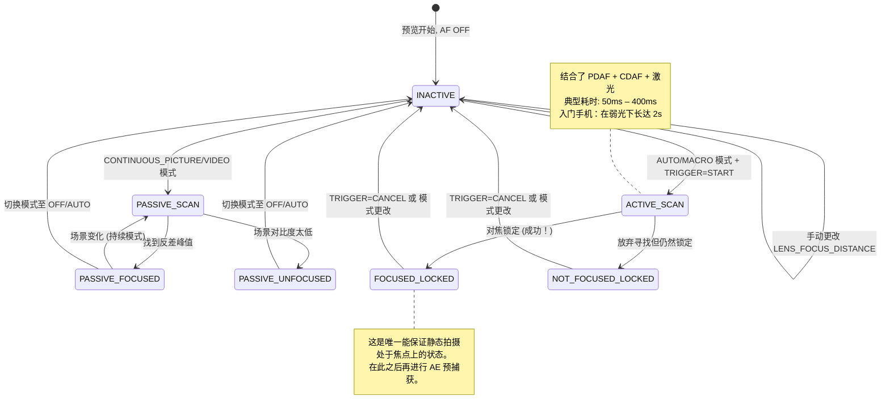

# 第 15 章：对焦

曝光控制亮度。**对焦则控制清晰度。** 曝光完美但对焦模糊的照片是一张废片。在本章中，你将学习智能手机对焦系统的工作原理，如何通过 Camera2 可靠地驱动自动对焦 (AF)，以及如何使用 `LENS_FOCUS_DISTANCE` 实现丝滑的手动对焦滑块。

**Android Camera Parameters** 应用在"对焦"面板中演示了所有这些内容——你可以实时观察 AF 状态机的转换，并拖动手动对焦滑块观察镜头从无穷远推向最近对焦距离。

---

## 现代智能手机中的自动对焦 (AF)

在深入探讨 API 细节之前，让我们先了解智能手机使用的三种物理对焦机制。

### 1. 反差检测对焦 (CDAF) — 被动扫描

软件技术：分析图像帧，寻找最大边缘对比度（边缘清晰 = 空间频率最高），并移动镜头直到找到反差峰值。

- **优点：** 适用于任何相机硬件（无需特殊像素）
- **缺点：** 慢。镜头必须在整个对焦范围内来回*拉风箱 (hunt)*。Camera2 状态映射中的 "AF SCANNING" 等标签即对应于此。

### 2. 相位检测对焦 (PDAF) — 主动扫描

传感器上的特殊光电二极管被一分为二。左右两半之间的相位差可以直接测量镜头必须移动的*距离和方向*——无需拉风箱。现在的旗舰手机使用全像素双核对焦 (Dual-Pixel PDAF)，其中*每一个*像素都参与相位检测。

- **优点：** 极快（在光线充足的情况下 < 100ms 锁定）；在视频中表现可靠
- **缺点：** 在弱光下表现吃力（光子不足以可靠计算相位），且有最近对焦距离限制

### 3. 激光对焦 / ToF 对焦 (主动) — 测距仪

一个专用的硬件模块发射红外激光脉冲，计时反射，并直接向 ISP 报告主体距离。在中高端手机上非常常见。

- **优点：** 在任何目标上都能实现极速锁定，即使在纯黑环境下也是如此（只要目标反射红外线）
- **缺点：** 有效范围有限（最大约 50cm–5m），在玻璃或红外透明物体上会失效

真实的手机结合了**这三者**：PDAF 用于快速粗调，CDAF 用于精调，激光对焦用于弱光或近距离场景。Camera2 将这个统一的管线暴露为一个单一的抽象状态机。

---

## AF 模式：CONTROL_AF_MODE

Camera2 在 `CameraMetadata` 中定义了以下 AF 模式：

| 模式 (CONTROL_AF_MODE_*) | 行为 | 用例 |
|-------------------------|----------|----------|
| `OFF` | 完全没有 AF。你手动设置 `LENS_FOCUS_DISTANCE`。 | 手动对焦、景深合成、天文摄影（锁定无穷远） |
| `AUTO` | 单次 AF。在发送 `CONTROL_AF_TRIGGER = START` 之前不做任何操作，然后扫描一次并锁定。 | 经典的傻瓜式静态摄影 |
| `MACRO` | 与 AUTO 相同，但偏向于近距离主体检测。 | 近摄、文档扫描、"美食模式" |
| `CONTINUOUS_PICTURE` | 持续重新对焦，但**在触发静态拍摄时会暂停重新对焦**，以避免在拍摄瞬间焦点发生偏移。 | 静态摄影默认值 |
| `CONTINUOUS_VIDEO` | 持续重新对焦——从不暂停。可能会有可见的拉风箱过程，但能保持视频清晰。 | 视频录制、视频聊天 |
| `EDOF` | 增强型景深 (Extended Depth of Field)：软件/固件模拟的深焦。无物理镜头移动。 | 无移动镜头执行器的廉价设备 |

**两个关键注意点：**

1. `EDOF` 设备（廉价手机、前置自拍摄像头）具有*固定*的焦平面。你永远不会从它们那里得到 `FOCUSED_LOCKED` 状态——你最多只能得到 `PASSIVE_SCAN` → `PASSIVE_FOCUSED` → `INACTIVE`。**Android Camera Parameters** 应用会针对这些相机显式显示 "Fixed Focus (固定对焦)"。

2. `CONTINUOUS_*` 模式在空闲后会返回 `INACTIVE`，而不是保持锁定。不要在持续模式下期待 `FOCUSED_LOCKED` —— 那仅适用于 `AUTO`/`MACRO` 配合显式触发的情况。

---

## AF 状态机

Camera2 通过 `CaptureResult.CONTROL_AF_STATE` 报告 AF 状态。理解这些状态对于实现可靠的静态捕获序列至关重要。



状态参考表：

| CONTROL_AF_STATE | 含义 | 下一步操作 |
|------------------|---------|-------------|
| `INACTIVE` (0) | AF 已关闭、空闲或持续模式当前未扫描 | 若处于 AUTO 模式：发送 TRIGGER_START |
| `PASSIVE_SCAN` (1) | 持续模式正在进行被动扫描 | 等待；暂不触发静态捕获 |
| `PASSIVE_FOCUSED` (2) | 持续模式找到焦点，但未锁定（可能漂移） | 在 CONTINUOUS_PICTURE 模式下可以安全触发拍摄（会自动锁定） |
| `ACTIVE_SCAN` (3) | 显式触发启动了一次扫描 | 只能等待... |
| `NOT_FOCUSED_LOCKED` (4) | 未能找到焦点，但镜头仍被锁定 | 提示用户；可选重试或照常拍摄 |
| `FOCUSED_LOCKED` (5) | **成功。** 找到焦点且硬件已锁定。 | 立即进行 AE 预捕获触发 |
| `PASSIVE_UNFOCUSED` (6) | 持续模式无法锁定，仍在扫描 | 改善光照或更换目标 |

**静态摄影不可逾越的规则：** *绝对不要*在看到 `FOCUSED_LOCKED` 之前提交静态拍摄（尤其是使用闪光灯时！）。跳过这一步，你的应用就会间歇性地拍出模糊的照片。

---

## 对焦距离：屈光度，而非米

这是第二个让 Camera2 开发者栽跟头的"坑"（第一个是纳秒级的快门）：

**`LENS_FOCUS_DISTANCE` 使用的是屈光度 (D)，而不是米。** 屈光度是焦距的*数学倒数*：

```
对焦距离 (米) = 1.0 / 屈光度
屈光度 = 1.0 / 对焦距离 (米)
```

| 屈光度 (LENS_FOCUS_DISTANCE) | 物理对焦距离 |
|--------------------------------|-------------------------|
| **0.0** | **无穷远** (∞) — 星星, 远山 |
| 0.1 | 10 米 |
| 0.25 | 4 米 |
| 0.5 | 2 米 |
| 1.0 | 1 米 |
| 2.0 | 0.5 米 (50 cm) |
| 5.0 | 0.2 米 (20 cm) |
| 10.0 | 0.1 米 (10 cm) |
| 20.0 | 0.05 米 (5 cm) |

为什么要用屈光度？因为镜头执行器的移动与*光学倍率*呈线性关系，而非物理距离。从 0.0D 到 20.0D 的对焦扫描对应于均匀的镜头移动，而从 10m 到 5cm 的"米"级扫描则是高度非线性的。

### 查询最小对焦距离

每只镜头都有最近对焦距离（你不能让镜头对焦在紧贴着玻璃的物体上）。查询该值：

```kotlin
// 此镜头可用的最大屈光度值
val maxDiopters = characteristics.get(
    CameraCharacteristics.LENS_INFO_MINIMUM_FOCUS_DISTANCE
) ?: 0.0f // 0.0f = 固定对焦 EDOF 镜头 (完全没有对焦控制！)

if (maxDiopters == 0.0f) {
    Log.w("Focus", "这是一个固定对焦镜头。手动 AF 已禁用。")
} else {
    // 有效的屈光度范围是 [0.0f .. maxDiopters]
    Log.d("Focus", "对焦范围: 0.0D (无穷远) → $maxDiopters D (最近对焦 ${1/maxDiopters}m)")
}
```

典型数值：
- 廉价手机后置摄像头：~10D (10 cm 最近对焦)
- 旗舰机广角摄像头：~15–25D (4–7 cm 最近对焦)
- 微距摄像头：~30–50D (2–3 cm 最近对焦)
- 前置自拍摄像头：通常为 0.0D (固定对焦, EDOF)

### 超焦距 (概念)

风景摄影师喜欢这个：将焦点设置为**超焦距**，从该距离的一半到无穷远的所有景物都是"可以接受的清晰"。在光圈为 f/1.8 且使用标准广角镜头的手机上，超焦距大约为 0.5–1.0 米。

**智能手机的经验法则：** 将 `LENS_FOCUS_DISTANCE = 2.0D` (50 cm 对焦距离) 设为大多数广角手机镜头的近似超焦距。这非常适合那些不想等待 AF 的风景和街头摄影。

```kotlin
// 设置超焦距"全清"预设
const val HYPERFOCAL_DIOPTERS_APPROX = 2.0f

fun setHyperfocal(builder: CaptureRequest.Builder, characteristics: CameraCharacteristics) {
    val maxD = characteristics.get(
        CameraCharacteristics.LENS_INFO_MINIMUM_FOCUS_DISTANCE
    ) ?: 0.0f
    val diopters = min(HYPERFOCAL_DIOPTERS_APPROX, maxD.takeIf { it > 0 } ?: 0.0f)
    builder.set(CaptureRequest.CONTROL_AF_MODE, CameraMetadata.CONTROL_AF_MODE_OFF)
    builder.set(CaptureRequest.LENS_FOCUS_DISTANCE, diopters)
}
```

想要为你的特定镜头计算精确的超焦距？你还需要 `LENS_INFO_AVAILABLE_FOCAL_LENGTHS` (以 mm 为单位的焦距) 和传感器的物理像素间距。对于 95% 的智能手机用例，2.0D 已经足够接近了。

---

## 完整示例 1：单次 AF 触发并拍摄

这是 `AUTO` / `MACRO` 模式下静态摄影最基础的流程。它也是第 17 章 3A 编排中将要复用的精确序列。

**目标：** 用户点击"拍照" → 驱动 AF 进入锁定对焦 → 一旦锁定，提交静态拍摄。

```kotlin
class AutoFocusCaptureHelper(
    private val characteristics: CameraCharacteristics,
    private val captureSession: CameraCaptureSession,
    private val previewSurface: Surface,
    private val jpegReaderSurface: Surface
) {
    private var afTriggered = false
    private var capturePlanned = false

    fun triggerAutoFocusAndCapture(onCaptureComplete: () -> Unit) {
        // ---- 第 1 步：构建带有显式 AF 触发的重复请求 ----
        val triggerRequest = captureSession.device.createCaptureRequest(
            CameraDevice.TEMPLATE_PREVIEW
        ).apply {
            addTarget(previewSurface)

            // 使用 AUTO 模式以保证最终达到 LOCKED 状态
            set(CaptureRequest.CONTROL_AF_MODE,
                CameraMetadata.CONTROL_AF_MODE_AUTO)

            // 立即发起一次性 AF 触发
            set(CaptureRequest.CONTROL_AF_TRIGGER,
                CameraMetadata.CONTROL_AF_TRIGGER_START)
        }

        afTriggered = true
        capturePlanned = true

        // ---- 第 2 步：订阅我们的状态追踪回调 ----
        captureSession.setRepeatingRequest(
            triggerRequest.build(),
            object : CameraCaptureSession.CaptureCallback() {
                override fun onCaptureCompleted(
                    session: CameraCaptureSession,
                    request: CaptureRequest,
                    result: TotalCaptureResult
                ) {
                    val afState = result.get(CaptureResult.CONTROL_AF_STATE)
                        ?: return
                    Log.d("AF", "AF 状态: $afState")

                    when (afState) {
                        // --- 成功路径 ---
                        CaptureResult.CONTROL_AF_STATE_FOCUSED_LOCKED -> {
                            if (capturePlanned) {
                                capturePlanned = false
                                submitStillCapture()
                                onCaptureComplete()
                            }
                        }
                        // --- 失败路径：无法锁定，但我们照常尝试 ---
                        CaptureResult.CONTROL_AF_STATE_NOT_FOCUSED_LOCKED -> {
                            Log.w("AF", "AF 无法锁定 — 照常拍摄 (可能会模糊)")
                            if (capturePlanned) {
                                capturePlanned = false
                                submitStillCapture()
                                onCaptureComplete()
                            }
                        }
                        // --- 正在扫描：忽略 ---
                        CaptureResult.CONTROL_AF_STATE_ACTIVE_SCAN,
                        CaptureResult.CONTROL_AF_STATE_PASSIVE_SCAN -> {
                            // 仍在工作中，暂不执行任何操作
                        }
                    }
                }
            },
            null // 在当前线程的处理程序上运行
        )
    }

    private fun submitStillCapture() {
        val stillRequest = captureSession.device.createCaptureRequest(
            CameraDevice.TEMPLATE_STILL_CAPTURE
        ).apply {
            addTarget(previewSurface)
            addTarget(jpegReaderSurface)

            // 为这张静态图保持 AF 锁定 — 先不要释放触发器
            set(CaptureRequest.CONTROL_AF_MODE,
                CameraMetadata.CONTROL_AF_MODE_AUTO)
            // 保持 AF_TRIGGER 现状 (START 状态会保留直到我们显式 CANCEL)

            set(CaptureRequest.JPEG_QUALITY, 95.toByte())
        }

        captureSession.capture(
            stillRequest.build(),
            object : CameraCaptureSession.CaptureCallback() {
                override fun onCaptureCompleted(
                    session: CameraCaptureSession,
                    request: CaptureRequest,
                    result: TotalCaptureResult
                ) {
                    // 照片已捕获 — 现在释放 AF 锁定，返回持续对焦
                    resetFocusToContinuous()
                }
            },
            null
        )
    }

    private fun resetFocusToContinuous() {
        val resumePreview = captureSession.device.createCaptureRequest(
            CameraDevice.TEMPLATE_PREVIEW
        ).apply {
            addTarget(previewSurface)
            set(CaptureRequest.CONTROL_AF_MODE,
                CameraMetadata.CONTROL_AF_MODE_CONTINUOUS_PICTURE)
            set(CaptureRequest.CONTROL_AF_TRIGGER,
                CameraMetadata.CONTROL_AF_TRIGGER_CANCEL)
        }
        afTriggered = false
        captureSession.setRepeatingRequest(resumePreview.build(), null, null)
    }
}
```

**关键细节：** 你必须在静态捕获完成*之后*再取消触发器——而不是在此之前。如果取消得太早，镜头会在拍摄期间解锁，导致照片变模糊。

**超时保障（未显示）：** 真实的应用会在 AF 扫描上添加一个 2–3 秒的超时。如果 `ACTIVE_SCAN` 运行 3 秒仍未达到 `FOCUSED_LOCKED`，请取消并向用户显示"点击高对比度区域进行对焦"的提示。

---

## 完整示例 2：手动对焦 SeekBar 滑块

这就是你在专业相机应用中看到的用户级手动对焦功能。使用 SeekBar 平滑映射 0.0D → maxD 的物理对焦范围。

### 布局 (res/layout/fragment_manual_focus.xml)

```xml
<LinearLayout
    xmlns:android="http://schemas.android.com/apk/res/android"
    android:layout_width="match_parent"
    android:layout_height="wrap_content"
    android:orientation="vertical"
    android:padding="16dp">

    <TextView
        android:id="@+id/tvFocusLabel"
        android:layout_width="match_parent"
        android:layout_height="wrap_content"
        android:text="焦点: ∞ (无穷远)"
        android:textSize="14sp"/>

    <SeekBar
        android:id="@+id/seekFocus"
        android:layout_width="match_parent"
        android:layout_height="wrap_content"
        android:max="1000"/>
</LinearLayout>
```

### Kotlin: Fragment / Activity 代码连接

```kotlin
class ManualFocusController(
    private val seekBar: SeekBar,
    private val labelView: TextView,
    private val characteristics: CameraCharacteristics,
    private val captureSessionProvider: () -> CameraCaptureSession?,
    private val previewSurface: Surface
) {
    // 滑块使用 1000 个整数步长以实现亚屈光度精度
    private val sliderSteps = 1000
    private val maxDiopters = characteristics.get(
        CameraCharacteristics.LENS_INFO_MINIMUM_FOCUS_DISTANCE
    ) ?: 0.0f

    private var currentDiopters = 0.0f

    init {
        if (maxDiopters == 0.0f) {
            seekBar.isEnabled = false
            labelView.text = "固定对焦 (不支持手动对焦)"
        } else {
            bindSeekBar()
            applyFocus(0.0f) // 从无穷远开始
        }
    }

    private fun bindSeekBar() {
        // 转换滑块整数 [0..1000] ↔ 屈光度 [0.0 .. maxDiopters]
        seekBar.setOnSeekBarChangeListener(object : SeekBar.OnSeekBarChangeListener {
            private var lastUpdate = 0L

            override fun onProgressChanged(seekBar: SeekBar, progress: Int, fromUser: Boolean) {
                if (!fromUser) return

                // 节流至约 30fps (33ms) — 避免过多的请求导致 HAL 过载
                val now = SystemClock.elapsedRealtime()
                if (now - lastUpdate < 33L) return
                lastUpdate = now

                val diopters = progress.toFloat() / sliderSteps.toFloat() * maxDiopters
                applyFocus(diopters)
            }
            override fun onStartTrackingTouch(seekBar: SeekBar) {
                // 用户开始拖动时立即切换到全手动对焦模式
                switchToManualMode()
            }
            override fun onStopTrackingTouch(seekBar: SeekBar) {
                // 应用最终的精确值以消除节流误差
                val diopters = seekBar.progress.toFloat() / sliderSteps.toFloat() * maxDiopters
                applyFocus(diopters, force = true)
            }
        })
    }

    private fun switchToManualMode() {
        // CONTROL_AF_MODE_OFF 禁用对焦马达自动驱动
        val session = captureSessionProvider() ?: return
        val request = session.device.createCaptureRequest(
            CameraDevice.TEMPLATE_PREVIEW
        ).apply {
            addTarget(previewSurface)
            set(CaptureRequest.CONTROL_AF_MODE, CameraMetadata.CONTROL_AF_MODE_OFF)
            set(CaptureRequest.CONTROL_MODE, CameraMetadata.CONTROL_MODE_USE_SCENE_MODE)
        }
        session.setRepeatingRequest(request.build(), null, null)
    }

    fun applyFocus(diopters: Float, force: Boolean = false) {
        currentDiopters = diopters.coerceIn(0.0f, maxDiopters)

        // 更新标签: < 0.1D 显示 "∞", 否则显示 "X.Y m"
        labelView.text = when {
            currentDiopters < 0.1f -> "焦点: ∞ (无穷远)"
            else -> {
                val meters = 1.0f / currentDiopters
                String.format("焦点: %.1f D  (%.2f m)", currentDiopters, meters)
            }
        }

        // 构建并提交带有新对焦距离的重复请求
        val session = captureSessionProvider() ?: return
        val request = session.device.createCaptureRequest(
            CameraDevice.TEMPLATE_PREVIEW
        ).apply {
            addTarget(previewSurface)
            set(CaptureRequest.CONTROL_AF_MODE, CameraMetadata.CONTROL_AF_MODE_OFF)
            set(CaptureRequest.LENS_FOCUS_DISTANCE, currentDiopters)
        }

        // 使用 setRepeatingRequest 使每一帧预览都遵循新的焦距
        session.setRepeatingRequest(request.build(), null, null)
    }

    // --- 预设辅助函数 ---
    fun setInfinity() { seekBar.progress = 0; applyFocus(0.0f, true) }
    fun setHyperfocalApprox() {
        val d = min(2.0f, maxDiopters)
        seekBar.progress = (d / maxDiopters * sliderSteps).toInt()
        switchToManualMode()
        applyFocus(d, true)
    }
    fun setNearest() { seekBar.progress = sliderSteps; applyFocus(maxDiopters, true) }
}
```

**关键实现细节：**

1. **节流 (Throttle)。** SeekBar 的 `onProgressChanged` 触发频率高达 200Hz。每发生一次事件都提交一次 `setRepeatingRequest` 会导致 HAL 工作过载，产生延迟。33ms 的节流将更新频率限制在约 30fps —— 对于镜头马达的物理运动速度来说这已经足够平滑了。

2. **尽早切换至 CONTROL_AF_MODE_OFF。** 如果你处于 `CONTINUOUS_PICTURE` 模式下直接设置 `LENS_FOCUS_DISTANCE` 而不禁用 AF，AF 算法会*反击*你——在一帧之后就焦点弹回到它认为正确的位置。必须先在 `onStartTrackingTouch` 中进行切换。

3. **通过 `setRepeatingRequest` 更新**，而不是单次的 `capture()`。手动对焦需要应用到*每一帧*预览中，直到用户再次移动滑块。

4. **松开时强制应用。** 节流会跳过中间位置；当用户抬起手指时，应用滑块的最终精确值。

---

## 对焦区域 (点击对焦)

现代相机应用允许你*点击取景器*来选择对焦目标。Camera2 通过 `CONTROL_AF_REGIONS` 实现这一点——它是一个包含权重矩形的列表（在活动阵列坐标系中）。

```kotlin
// 将取景器 (x,y) 点击转换为 CameraCharacteristics 传感器坐标区域
fun createTapFocusRegion(viewfinderWidth: Int, viewfinderHeight: Int,
                         tapX: Float, tapY: Float,
                         characteristics: CameraCharacteristics): MeteringRectangle {
    val activeArray = characteristics.get(
        CameraCharacteristics.SENSOR_INFO_ACTIVE_ARRAY_SIZE
    )!!
    // 将点击坐标在每个轴上归一化至 [0..1]
    val nx = tapX / viewfinderWidth.toFloat()
    val ny = tapY / viewfinderHeight.toFloat()
    // 映射至传感器活动阵列，创建一个以点击位置为中心的 200×200 区域
    val cx = (nx * activeArray.width()).toInt()
    val cy = (ny * activeArray.height()).toInt()
    val rSize = 200
    return MeteringRectangle(
        max(0, cx - rSize/2), max(0, cy - rSize/2),
        rSize, rSize,
        MeteringRectangle.METERING_WEIGHT_MAX
    )
}

// 将区域附加至请求构建器
fun applyTapFocus(builder: CaptureRequest.Builder, region: MeteringRectangle) {
    builder.set(CaptureRequest.CONTROL_AF_REGIONS, arrayOf(region))
    builder.set(CaptureRequest.CONTROL_AE_REGIONS, arrayOf(region)) // 同时耦合 AE 测光点！
    builder.set(CaptureRequest.CONTROL_AF_TRIGGER,
        CameraMetadata.CONTROL_AF_TRIGGER_CANCEL) // 取消先前的锁定
    builder.set(CaptureRequest.CONTROL_AF_TRIGGER,
        CameraMetadata.CONTROL_AF_TRIGGER_START)  // 在新区域触发扫描
}
```

**专业建议：** 始终将 `CONTROL_AE_REGIONS` 与 `CONTROL_AF_REGIONS` 配对。用户点击人脸是因为他们希望该人脸*既*在焦点内*又*曝光正确——而不是焦点在脸上，却针对其背后明亮的天空进行了测光。

---

## 对焦问题排查

| 症状 | 根本原因 | 解决办法 |
|---------|-----------|-----|
| AF 状态永远停留在 ACTIVE_SCAN | 低对比度场景（白墙、纯净蓝天）或硬件故障 | 在约 3s 后超时；提示用户；回退到超焦距预设 |
| 手动对焦滑块无效 | 忘记将 `CONTROL_AF_MODE` 设置为 OFF → AF 正在干扰你 | 在 onStartTrackingTouch 中调用 `switchToManualMode()` |
| 尽管显示 FOCUSED_LOCKED，静态拍摄仍模糊 | 在静态捕获完成*之前*取消了 AF 触发器 | 仅在*静态*请求的 `onCaptureCompleted` 中执行取消 |
| 前置摄像头忽略对焦命令 | 固定对焦 EDOF 镜头 (`MINIMUM_FOCUS_DISTANCE == 0`) | 优雅降级：针对该相机禁用对焦 UI |
| 视频 AF 频繁"拉风箱" | 录制视频时使用了 `CONTINUOUS_PICTURE` 而非 `CONTINUOUS_VIDEO` | 在 MediaRecorder 启动时将模式切换为 CONTINUOUS_VIDEO |

---

## 小结

Camera2 中的对焦是一个你必须显式驱动的状态机，而非"设置并忘掉"的参数：

- **AF 硬件：** 智能手机结合了反差检测对焦、相位检测对焦 (Dual-Pixel) 和激光对焦，以实现快速可靠的锁定。
- **模式：** `AUTO`（单次，锁定）、`CONTINUOUS_PICTURE`（持续重对焦，拍摄时暂停）、`CONTINUOUS_VIDEO`（始终重对焦）、`MACRO`、`OFF`（手动）。EDOF 镜头没有移动对焦件。
- **状态：** 在进行高价值静态拍摄前，请等待 `FOCUSED_LOCKED`（而不只是 `PASSIVE_FOCUSED`）。
- **屈光度：** `LENS_FOCUS_DISTANCE` 使用焦距的倒数 (0.0D = ∞, 10D = 10 cm)。范围是 `[0.0 .. LENS_INFO_MINIMUM_FOCUS_DISTANCE]`。
- **单次 AF 拍摄：** `TRIGGER = START` → 等待 `FOCUSED_LOCKED` → 提交静态拍摄 → 然后执行 `CANCEL`。
- **手动对焦滑块：** 具有 1000 个步长的 SeekBar，节流至 30fps；必须先切换到 `AF_MODE_OFF` 模式，以免自动算法干扰你的手动设置。
- **点击对焦使用传感器活动阵列坐标下的 `CONTROL_AF_REGIONS`**。配合 `AE_REGIONS` 使用可获得专业级效果。

## 下一章

亮度 ✓ 清晰度 ✓。现在让我们来修正**色彩**。在**第 16 章：白平衡与色彩**中，我们将涵盖：

- 自动白平衡 (AWB) 及其 7 个预设模式 (从 Incandescent 到 Shade)
- 使用 `COLOR_CORRECTION_GAINS` (4 通道 R/G/B/G) 和 `COLOR_CORRECTION_TRANSFORM` (3×3 RGB 矩阵) 进行手动色彩校正
- 色温概念 (从 2000K 烛光到 10000K 阴影) 及其与白平衡的对应关系
- 暖色调"日落效果"预设以及全手动 AWB off 模式的 Kotlin 代码

色彩是手动控制三部曲的最后一环。
