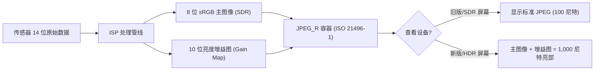

# 第 21 章：HDR 与 Ultra HDR

传统的数字影像一直被限制在 8 位标准动态范围 (SDR) 内：sRGB 色彩空间、100 尼特峰值亮度以及约 6 档的可用对比度。现代手机传感器却能捕获 14 档以上的动态范围。直到最近，这些多余的信息都必须在 ISP（图像信号处理器）中通过调低高光来"挤压"进 8 位 JPEG。Android 13 (API 33) 通过 **DynamicRangeProfiles** 引入了原生的 10 位 HDR 视频支持，而 Android 14 (API 34) 则引入了革命性的 **JPEG_R (Ultra HDR)** 格式用于静态照片。通过这些 API，你的应用可以生成能在现代 1,000+ 尼特屏幕上呈现极致亮度和深邃阴影的照片和视频。

本章实现了项目研究文档中《10 位 HDR 与 Ultra HDR》部分的规格说明，包括 HLG 兼容性、HDR10 静态元数据注入以及 JPEG_R 增益图 (gain map) 的生命周期。你可以使用 [Android Camera Parameters](https://github.com/zoozooll/AndroidCameraParameters) 应用（[Google Play](https://play.google.com/store/apps/details?id=com.zoozooll.cameraparameters)）实时检测每台设备的 HDR 性能：其 HDR 仪表板列出了支持的 `DynamicRangeProfiles`（如 `HDR10`、`HDR10_PLUS`、`HLG`），并根据 Android 14 CDD 15 级性能标准验证 JPEG_R 的合规性。

## SDR vs HDR：不仅仅是"更亮"

理解 HDR 需要区分两个物理概念：**位深 (Bit Depth)** 和 **传递函数 (Transfer Function)**。

- **Bit Depth**：SDR 使用每通道 8 位（256 级）。HDR 使用 10 位（1,024 级），消除了日落或纯色背景中常见的色彩断层（banding）。
- **Transfer Function (EOTF)**：SDR 使用伽马曲线 (Gamma 2.2)。HDR 使用 **HLG (Hybrid Log-Gamma)** 或 **PQ (Perceptual Quantizer)**。HLG 是向后兼容的（在 SDR 屏幕上看起来正常）；PQ（用于 HDR10）是非向后兼容的，但在 HDR 屏幕上能实现更高的对比度。

| 规格 | SDR (sRGB) | HLG | HDR10 (PQ) | Ultra HDR (JPEG_R) |
|------|------------|-----|------------|--------------------|
| **位深** | 8 位 | 10 位 | 10 位 | 8 位 SDR + 10 位增益图 |
| **色彩空间** | Rec.709 | Rec.2020 | Rec.2020 | sRGB / Display P3 |
| **峰值亮度** | 100 尼特 | 1,000+ 尼特 | 4,000+ 尼特 | 视显示器而定 |
| **兼容性** | 通用 | SDR 兼容 | 需要 HDR10 解码器 | 标准 JPEG 兼容 |

## 第 1 步：查询 10 位 HDR 性能

要录制 10 位视频或预览，相机必须在 `REQUEST_AVAILABLE_CAPABILITIES` 中声明支持 **`DYNAMIC_RANGE_TEN_BIT`**。

```kotlin
import android.hardware.camera2.CameraCharacteristics
import android.hardware.camera2.params.DynamicRangeProfiles

fun queryHdrProfiles(chars: CameraCharacteristics) {
    val profiles: DynamicRangeProfiles? = chars.get(
        CameraCharacteristics.REQUEST_AVAILABLE_DYNAMIC_RANGE_PROFILES
    )
    
    if (profiles == null) {
        Log.d("HDR", "此设备不支持 10 位 HDR")
        return
    }

    val supported = profiles.supportedProfiles
    Log.d("HDR", "支持的 HDR 简况: ${supported.joinToString()}")

    // 检查具体格式
    val hasHlg = supported.contains(DynamicRangeProfiles.HLG)
    val hasHdr10 = supported.contains(DynamicRangeProfiles.HDR10)
    val hasHdr10Plus = supported.contains(DynamicRangeProfiles.HDR10_PLUS)
}
```

:::note
**HLG** 是最通用的格式，因为它不需要复杂的元数据，且可以在大多数社交媒体应用上直接分享。**HDR10+** 需要 HAL 进行逐帧元数据生成。
:::

## 第 2 步：配置 10 位输出 Surface

在 Camera2 中，如果你想得到 10 位输出，必须在创建会话之前，通过 **`OutputConfiguration.setDynamicRangeProfile()`** 将该 Surface 的简况设置为 10 位模式。

```kotlin
import android.hardware.camera2.params.OutputConfiguration
import android.hardware.camera2.params.SessionConfiguration

fun create10BitSession(
    cameraDevice: CameraDevice,
    previewSurface: Surface,
    recordSurface: Surface,
    handler: Handler
) {
    // 1. 针对预览 Surface 配置 10 位
    val previewConfig = OutputConfiguration(previewSurface).apply {
        dynamicRangeProfile = DynamicRangeProfiles.HLG
    }
    
    // 2. 针对录制 Surface 配置 10 位
    val recordConfig = OutputConfiguration(recordSurface).apply {
        dynamicRangeProfile = DynamicRangeProfiles.HLG
    }

    val sessionConfig = SessionConfiguration(
        SessionConfiguration.SESSION_REGULAR,
        listOf(previewConfig, recordConfig),
        { runnable -> handler.post(runnable) },
        object : CameraCaptureSession.StateCallback() {
            override fun onConfigured(session: CameraCaptureSession) {
                // 此时管线将以 10 位 Rec.2020 模式运行
                startHdrPreview(session, previewSurface)
            }
            override fun onConfigureFailed(s: CameraCaptureSession) = Unit
        }
    )

    cameraDevice.createCaptureSession(sessionConfig)
}
```

## 第 3 步：Android 14 Ultra HDR (JPEG_R)

JPEG_R 是目前移动端照片的最佳方案。它生成的是一个 **.jpg** 文件，内部包含一个标准的 8 位 sRGB 图像（用于旧设备）和一个隐藏的 **10 位增益图 (Gain Map)**（用于新设备）。当在 Android 14+ 相册中查看时，系统会根据屏幕的 HDR 性能，使用增益图将高光部分的亮度"拉升"到极致。

### 配置 JPEG_R 捕获

这不需要特殊的 session，只需要一个支持该格式的 `ImageReader`：

```kotlin
import android.graphics.ImageFormat

// 检查是否支持 JPEG_R 格式 (API 34+)
val map = characteristics.get(CameraCharacteristics.SCALER_STREAM_CONFIGURATION_MAP)
val supportsUltraHdr = map?.getOutputSizes(ImageFormat.JPEG_R)?.isNotEmpty() ?: false

if (supportsUltraHdr) {
    val ultraHdrReader = ImageReader.newInstance(
        width, height, ImageFormat.JPEG_R, 2
    )
    
    // 在捕获请求中添加目标
    val captureBuilder = cameraDevice.createCaptureRequest(
        CameraDevice.TEMPLATE_STILL_CAPTURE
    ).apply {
        addTarget(ultraHdrReader.surface)
        // JPEG_R 会自动生成增益图，无需手动干预 ISP
    }
}
```

## JPEG_R 增益图原理 (Mermaid)



## HDR 录制的性能与温控

录制 10 位视频会显著增加 ISP 和内存控制器的负载：
- **带宽**：10 位数据的总比特量比 8 位多 25%。
- **温控**：在 4K@60 HDR 模式下，入门级手机可能会在 5-10 分钟内触发热保护。
- **存储**：必须使用 HEVC (H.265) 编码器，因为 AVC (H.264) 在 Android 上通常不支持 10 位简况。

## 小结

本章涵盖了现代 Android HDR 体系结构的两大支柱：

- **DynamicRangeProfiles**：用于 10 位视频，核心是 `HLG`（兼容性好）和 `HDR10`（对比度高）。
- **JPEG_R (Ultra HDR)**：用于静态照片，在标准 JPEG 中嵌入 10 位增益图，实现完美的高光回放。
- **配置要点**：通过 `OutputConfiguration.setDynamicRangeProfile()` 为每个输出开启 10 位模式。
- **光照要求**：HDR 依赖于传感器捕获的多余动态范围，在极暗环境下 HDR 效果并不明显，但在日落、海滩等高光比场景中效果惊人。

## 下一章

在第 22 章中，我们将学习如何利用 OEM 的专有算法：**相机扩展 (Camera Extensions)**。你将了解如何调用厂商内置的夜景模式 (Night)、人像模式 (Bokeh) 和 HDR 融合，这些功能通常比直接使用 `TEMPLATE_STILL_CAPTURE` 能提供更好的画质。

你可以通过 **Android Camera Parameters** 应用验证你手机的 HDR 配置文件支持情况，看看它是否符合 Android 14 旗舰级的 Ultra HDR 标准。
