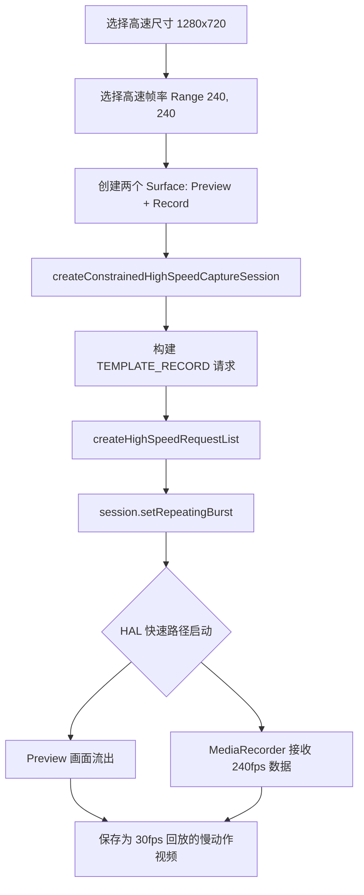

# 第 19 章：高速视频

慢动作视频一直是旗舰手机的招牌功能。它能揭示肉眼看不清的瞬间：气球爆炸的一瞬、水滴溅起的波纹，或者是运动员飞跃的姿态。在 Android Camera2 API 中，实现 120 fps（4 倍慢动作）或 240 fps（8 倍慢动作）不仅仅是设置一个较高的帧率。它需要一种特殊的会话类型：**CameraConstrainedHighSpeedCaptureSession**。这种模式会解锁硬件加速的捕获路径，绕过标准的预览处理，以维持极高的像素带宽。

本章将介绍如何检测高速视频支持、配置受限会话，以及最重要的——如何使用 `createHighSpeedRequestList` 满足 HAL 的连拍要求。你可以在 **Android Camera Parameters** 应用（[GitHub](https://github.com/zoozooll/AndroidCameraParameters) / [Google Play](https://play.google.com/store/apps/details?id=com.minininja.cameraparams)）的 "High Speed" 选项卡中查看你手机支持的所有高速尺寸和 FPS 组合。

## 为什么高速视频需要"受限会话"？

在标准 `CameraCaptureSession` 中，ISP 每一帧都要处理大量的后期工作：降噪、边缘增强、面部检测。当你尝试以每秒 240 帧的速度运行 1080p 画面时，总像素量高达每秒 5 亿像素。对于大多数移动 ISP 来说，在运行完整 3A 和后处理的同时维持这一带宽是不可能的。

`CameraConstrainedHighSpeedCaptureSession` 通过强加**三项关键限制**来解决这个问题：

1. **输出目标受限**：最多只能有两个 Surface：一个预览 Surface 和一个视频录制 Surface（MediaRecorder/MediaCodec）。不能添加 ImageReader 进行分析或拍照。
2. **尺寸受限**：只能使用 `StreamConfigurationMap.getHighSpeedVideoSizes()` 返回的特定分辨率。通常这些尺寸比最大拍照尺寸小（例如 1080p 或 720p）。
3. **设置受限**：你无法控制单帧曝光或 ISO。为了维持帧率，HAL 会接管一切，通常会将 AE/AF/AWB 强制锁定为特定的自动模式。

作为交换，HAL 会启用一条"快速路径"，直接将原始像素流送到硬件编码器，从而实现流畅、无掉帧的高速采集。

## 第 1 步：检测高速视频支持

并非所有支持 Camera2 的手机都能做高速视频。你必须显式检查功能标志。

```kotlin
fun supportsHighSpeed(characteristics: CameraCharacteristics): Boolean {
    val caps = characteristics.get(
        CameraCharacteristics.REQUEST_AVAILABLE_CAPABILITIES
    ) ?: return false
    
    return caps.contains(
        CameraCharacteristics.REQUEST_AVAILABLE_CAPABILITIES_CONSTRAINED_HIGH_SPEED_VIDEO
    )
}
```

即使此标志为 `true`，也只有部分尺寸支持高速。你需要查询 `StreamConfigurationMap`：

```kotlin
val map = characteristics.get(
    CameraCharacteristics.SCALER_STREAM_CONFIGURATION_MAP
) ?: return

// 获取支持高速视频的所有尺寸 (例如 1920x1080, 1280x720)
val hsSizes = map.highSpeedVideoSizes

for (size in hsSizes) {
    // 获取该尺寸支持的 FPS 范围 (例如 [120, 120], [240, 240])
    val fpsRanges = map.getHighSpeedVideoFpsRangesFor(size)
    Log.d("HighSpeed", "尺寸 $size 支持帧率: ${fpsRanges.contentToString()}")
}
```

:::tip
大多数设备在 1080p 下支持 120 fps，而在 720p 下才支持 240 fps。极少数顶级旗舰（如索尼 Xperia 1 系列）可在 4K 下实现 120 fps。**Android Camera Parameters** 应用可以为你列出每种组合的精确上限。
:::

## 第 2 步：创建受限高速会话

创建会话的过程与之前类似，但要调用不同的方法：`createConstrainedHighSpeedCaptureSession()`。

```kotlin
private var highSpeedSession: CameraConstrainedHighSpeedCaptureSession? = null

fun startHighSpeedSession(
    device: CameraDevice,
    previewSurface: Surface,
    recordSurface: Surface,
    handler: Handler
) {
    val surfaces = listOf(previewSurface, recordSurface)
    
    // 注意：在 API 28+ 建议使用 SessionConfiguration，
    // 但此处展示的是通用的回调方式
    device.createConstrainedHighSpeedCaptureSession(
        surfaces,
        object : CameraCaptureSession.StateCallback() {
            override fun onConfigured(session: CameraCaptureSession) {
                // 强制转换为受限子类
                highSpeedSession = session as CameraConstrainedHighSpeedCaptureSession
                startHighSpeedStreaming(previewSurface, recordSurface, handler)
            }
            
            override fun onConfigureFailed(session: CameraCaptureSession) {
                Log.e("HighSpeed", "配置高速会话失败")
            }
        },
        handler
    )
}
```

## 第 3 步：使用 `createHighSpeedRequestList`

这是最关键的一步。在高速模式下，HAL 需要一次性接收多个重复的请求（一组连拍），以便它能在硬件底层预调度帧。**你不能只调用 `setRepeatingRequest()`。**

你必须使用 `createHighSpeedRequestList(request)`。这个方法会将你的单个请求扩展为一个经过优化的列表（通常是包含 4 或 8 个请求的列表）。

```kotlin
private fun startHighSpeedStreaming(
    previewSurface: Surface,
    recordSurface: Surface,
    handler: Handler
) {
    val session = highSpeedSession ?: return
    
    // 1. 构建一个基础的高速捕获请求
    val requestBuilder = session.device.createCaptureRequest(
        CameraDevice.TEMPLATE_RECORD
    ).apply {
        addTarget(previewSurface)
        addTarget(recordSurface)
        
        // 设置你之前查询到的 FPS 范围，例如 Range(240, 240)
        set(CaptureRequest.CONTROL_AE_TARGET_FPS_RANGE, Range(240, 240))
    }
    
    // 2. ⭐ 将单个请求转换为高速请求列表
    // 框架会自动根据硬件需求决定列表长度
    val highSpeedRequestList = session.createHighSpeedRequestList(requestBuilder.build())
    
    // 3. ⭐ 提交重复的请求列表
    session.setRepeatingBurst(
        highSpeedRequestList,
        null, // 通常不需要逐帧回调
        handler
    )
    
    Log.d("HighSpeed", "240 fps 高速流已启动")
}
```

### 为什么用 `setRepeatingBurst`？

在高速硬件中，每一帧的曝光时间极短（240 fps 下每帧只有约 4.1ms）。为了防止掉帧，HAL 需要知道接下来一组帧的配置是完全一样的。`setRepeatingBurst` 配合 `createHighSpeedRequestList` 提供这种原子性的保证。如果直接发送单个请求，由于 Android 框架与 HAL 之间的 Binder 通信开销，很难稳定维持 240 fps 的频率。

## 第 4 步：视频录制注意事项

高速视频采集通常配合 `MediaRecorder` 使用。

1. **设置目标 FPS**：在 `MediaRecorder` 中，即使你以 240 fps 捕获，你通常希望以 30 fps **回放**。这意味着 `setVideoFrameRate(240)` 会产生一段运行速度只有正常 1/8 的慢动作视频。
2. **带宽**：1080p @ 240 fps 的原始码率非常高。确保设置一个足够高的比特率，例如 `setVideoEncodingBitRate(50_000_000)` (50 Mbps)。
3. **光照**：这是最容易失败的地方。在 240 fps 下，快门速度必须快于 1/240 秒。这意味着你需要的进光量是普通 30 fps 视频（1/30s 快门）的 **8 倍**。在室内灯光下尝试 240 fps 通常会得到漆黑一片且充满噪点的视频。**请在阳光充足的室外进行测试。**

## 高速管线流程图 (Mermaid)



## 常见问题排查

| 症状 | 原因 | 解决方法 |
|---------|-----------|-----|
| `onConfigureFailed` 触发 | 尝试使用了不支持的尺寸或添加了超过 2 个 Surface | 仅使用 `getHighSpeedVideoSizes()` 中的尺寸，且只保留预览 + 录制 Surface |
| 画面非常暗 | 快门速度太快，进光量不足 | 增加环境光照（在室外拍摄）或回退到 120 fps |
| 画面出现频闪 | 室内日光灯频率 (50/60Hz) 与 240 fps 采样不匹配 | 在自然光下拍摄，或尝试设置 `CONTROL_AE_ANTIBANDING_MODE` |
| `setRepeatingBurst` 报错 | 未使用 `createHighSpeedRequestList` 生成列表 | 必须将单请求通过该方法转换为 List |

## 小结

高速视频开发的核心在于**受限 (Constrained)**：

- **受限功能**：必须具备 `CONSTRAINED_HIGH_SPEED_VIDEO` 性能。
- **受限输出**：最多 2 个 Surface，必须是 `getHighSpeedVideoSizes()` 列表中的尺寸。
- **受限 API**：使用 `createConstrainedHighSpeedCaptureSession` 和 `createHighSpeedRequestList`。
- **光照要求**：帧率越高，对环境光照的要求就越苛刻。

## 下一章

在第 20 章中，我们将探索现代手机的多摄像头架构：**逻辑多摄像头 (Logical Multi-Camera)**。你将学习如何通过一个逻辑 ID 访问多个物理传感器，如何实现无缝变焦，以及如何同时从广角和长焦镜头获取同步的图像流，用于深度计算或多摄融合。

你可以通过 **Android Camera Parameters** 应用验证你设备的硬件能力，看看它是否支持受限的高速模式以及最大支持的分辨率和帧率。
