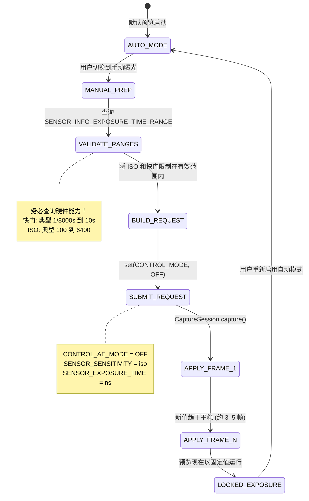

# 第 14 章：Camera2 中的手动曝光

掌握了第 13 章的摄影理论后，现在是将概念转化为代码的时候了。在本章中，你将学习如何**完全接管**相机的自动曝光 (AE) 系统，并使用 Camera2 API 手动设置 ISO 和快门速度。

**Android Camera Parameters** 应用演示了本章中的所有技术——你可以切换到应用中的 Manual (手动) 模式，并调整 ISO 和 Shutter (快门) 滑块以实时查看结果。

---

## 大开关：从 AUTO 到 MANUAL

默认情况下，你提交的每一个 `CaptureRequest` 都在相机内置的 3A 自动管线（自动曝光、自动对焦、自动白平衡）下运行。要进入手动模式，你必须**显式禁用**该管线。

有两个级别的覆盖：

| 级别 | 设置 | 发生什么 |
|-------|---------|-------------|
| 1. 仅禁用 AE | `CONTROL_AE_MODE = OFF` | ISO + 快门变为手动；AF 和 AWB 仍自动运行 |
| 2. 禁用整个 3A | `CONTROL_MODE = OFF` | **所有** 3A 算法停止；每个 3A 参数必须手动设置 |

为了获得可靠的手动曝光，请**两者**都设置。在某些设备上，仅禁用 `CONTROL_AE_MODE` 仍会留下 OEM 后处理在幕后进行"辅助"。将 `CONTROL_MODE = OFF` 是最干净、最可预测的路径。



**转换延迟：** 当你提交一个手动捕获请求时，新的 ISO/快门值不会出现在*下一帧*。CMOS 传感器存在管线延迟——*当前*帧已经在使用旧设置进行曝光。预计会有 **3-5 帧的转换期**，然后数值才会趋于平稳。**Android Camera Parameters** 应用在报告"已锁定"之前，会显式等待 `CaptureResult` 以确认请求值与应用值匹配。

---

## Camera2 API 中的手动控制

### SENSOR_SENSITIVITY (ISO)

Camera2 将 ISO 表示为 `CaptureRequest.SENSOR_SENSITIVITY` —— 一个直接映射到 ISO 算术刻度的整数。在大多数设备上，这是一个 1:1 的映射：

| 摄影师的 ISO | SENSOR_SENSITIVITY 值 |
|-------------------|--------------------------|
| 100 | 100 |
| 400 | 400 |
| 3200 | 3200 |
| 6400 | 6400 |

**务必查询有效范围。** 不要硬编码数值：

```kotlin
val sensorSensitivityRange = characteristics.get(
    CameraCharacteristics.SENSOR_INFO_SENSITIVITY_RANGE
)
val minIso = sensorSensitivityRange?.lower ?: 100
val maxIso = sensorSensitivityRange?.upper ?: 6400
```

一些超高端手机报告的范围如 50–12800，而廉价设备可能将你限制在 100–3200。超出范围的值会被 HAL 夹断 —— 这违背了你手动控制的目的。

### SENSOR_EXPOSURE_TIME (以纳秒为单位的快门速度)

这是困扰每一个 Camera2 新开发者的第一个"坑"：**快门速度以纳秒 (ns) 存储，而不是秒。** 人类考虑的是 1/60s；而 HAL 考虑的是 16666666 ns。

两者之间的转换是简单的算术：

```kotlin
// 秒 → 纳秒 (乘以 1,000,000,000)
fun secondsToNs(seconds: Double): Long = (seconds * 1_000_000_000.0).toLong()

// 纳秒 → 秒 (用于用户显示)
fun nsToSeconds(ns: Long): Double = ns.toDouble() / 1_000_000_000.0

// 用户友好的字符串格式化程序 (例如 "1/60s" 或 "2.5s")
fun formatShutter(ns: Long): String {
    val seconds = nsToSeconds(ns)
    return when {
        seconds >= 1.0 -> String.format("%.1fs", seconds)
        else -> {
            val fraction = (1.0 / seconds).toInt()
            "1/${fraction}s"
        }
    }
}
```

**供参考的常见转换：**

| 人类习惯的快门速度 | 纳秒 (ns) |
|--------------|-------------------|
| 1/8000s | 125,000 |
| 1/1000s | 1,000,000 |
| 1/500s | 2,000,000 |
| 1/120s (24fps 180° 法则) | 8,333,333 |
| 1/60s | 16,666,666 |
| 1/30s | 33,333,333 |
| 1/15s | 66,666,666 |
| 1s | 1,000,000,000 |
| 2s | 2,000,000,000 |
| 10s | 10,000,000,000 |
| 30s | 30,000,000,000 |

**同样，查询硬件范围：**

```kotlin
val exposureTimeRange = characteristics.get(
    CameraCharacteristics.SENSOR_INFO_EXPOSURE_TIME_RANGE
)
val minShutterNs = exposureTimeRange?.lower ?: 1_000_000L   // 1/1000s 下限
val maxShutterNs = exposureTimeRange?.upper ?: 10_000_000_000L  // 10s 上限
```

在支持超长曝光的设备上（例如，某些索尼 Xperia 和 Google Pixel 机型），`SENSOR_INFO_EXPOSURE_TIME_RANGE.upper` 可以超过 30,000,000,000 ns (30s)。请遵守此限制 —— 超出最大值的请求会被静默夹断。

---

## ⚠️ 至关重要：手动模式下的画质下降

**这是本章最重要的警告。** 请不要跳过。

当你设置 `CONTROL_MODE = OFF`（完全手动覆盖）时，你不只是禁用了 AE/AF/AWB *算法* —— 在几乎所有的 Android 设备上，你也**禁用了通常在 3A 管线内运行的 OEM 专有计算后处理**。

具体而言，根据 HAL3 的研究分析显示，禁用 3A 通常会关闭：

| 处理步骤 | AUTO (自动) 模式 | MANUAL (手动) 模式 (CONTROL_MODE = OFF) |
|-----------------|-----------|-----------------------------------|
| 多帧降噪 | ✓ 激活 — 降噪后的输出 | ✗ 关闭 — 可见原始传感器噪声 |
| 自适应色调映射 / HDR 合成 | ✓ 激活 — 恢复高光 + 阴影 | ✗ 关闭 — 仅单帧曲线 |
| 局部对比度增强 (MiraVision 等) | ✓ 视场景而异 | ✗ 平坦的通用曲线 |
| 人脸测光 / 场景检测 | ✓ 根据人脸权重进行曝光 | ✗ 被忽略 |
| 镜头遮蔽 / 暗角校正 | ✓ 每镜头校准 | ✗ 通常减少或关闭 |

**结果：** 在手动模式下以 ISO 3200 和 1/15s 拍摄的照片，看起来会比在 AUTO 模式下以 HAL 选择的*完全相同*的 ISO 和快门拍摄的照片*明显更差*（噪声更多，对比度更平淡）。

**你能做些什么？** 两个现实的选择：

1. **自己进行后处理。** 既然你禁用了 OEM 处理，你可以在自己的处理管线中应用你自己的去噪（例如，OpenCV 双边滤波、MediaPipe 降噪器或自定义训练的 CNN）。RAW 拍摄（见后续章节）+ 自定义 RAW 显影可以提供最大的艺术控制。

2. **使用手动 AE 覆盖而非 CONTROL_MODE = OFF。** 如果你只需要*锁定*特定值，同时保持 OEM 处理开启，请尝试将 `CONTROL_AE_MODE = ON` 但在逐请求的基础上固定 `SENSOR_SENSITIVITY` 和 `SENSOR_EXPOSURE_TIME`。对此混合模式的支持视设备而定 —— 请彻底测试。

**Android Camera Parameters** 应用在 Manual 面板中有一个切换开关，可以在这两种方法之间切换，并让你直观地比较画质差异。

---

## 完整示例 1：延时摄影的锁定曝光

手动曝光的一个经典用例是**延时摄影 (timelapse photography)**。在 AUTO 模式下，相机会随着云层移动或光线变化，在帧与帧之间进行微妙的曝光调整。生成的视频闪烁严重。锁定 ISO + 快门可以消除这种情况。

**目标：** ISO 100，1/60s (16,666,666 ns) — 每一帧都锁定。

```kotlin
class TimelapseManualExposure(
    private val characteristics: CameraCharacteristics,
    private val captureSession: CameraCaptureSession,
    private val imageReaderSurface: Surface,
    private val previewSurface: Surface
) {
    companion object {
        private const val TARGET_ISO = 100
        private const val TARGET_SHUTTER_NS = 16_666_666L // 1/60s
    }

    fun captureTimelapseFrame(frameCallback: ImageReader.OnImageAvailableListener) {
        try {
            // ---- 第 1 步：验证请求的值是否在硬件范围内 ----
            val isoRange = characteristics.get(
                CameraCharacteristics.SENSOR_INFO_SENSITIVITY_RANGE
            )
            val shutterRange = characteristics.get(
                CameraCharacteristics.SENSOR_INFO_EXPOSURE_TIME_RANGE
            )

            val clampedIso = isoRange?.let {
                TARGET_ISO.coerceIn(it.lower, it.upper)
            } ?: TARGET_ISO

            val clampedShutter = shutterRange?.let {
                TARGET_SHUTTER_NS.coerceIn(it.lower, it.upper)
            } ?: TARGET_SHUTTER_NS

            // ---- 第 2 步：构建手动曝光的 CaptureRequest ----
            val requestBuilder = captureSession.device.createCaptureRequest(
                CameraDevice.TEMPLATE_STILL_CAPTURE
            ).apply {
                addTarget(previewSurface)
                addTarget(imageReaderSurface)

                // --- 关键行：禁用 3A 并固定数值 ---
                set(CaptureRequest.CONTROL_MODE, CameraMetadata.CONTROL_MODE_OFF)
                set(CaptureRequest.CONTROL_AE_MODE, CameraMetadata.CONTROL_AE_MODE_OFF)
                set(CaptureRequest.SENSOR_SENSITIVITY, clampedIso)
                set(CaptureRequest.SENSOR_EXPOSURE_TIME, clampedShutter)

                // 可选：将 AWB 固定在 Daylight 模式，以获得一致的色彩
                set(CaptureRequest.CONTROL_AWB_MODE, CameraMetadata.CONTROL_AWB_MODE_DAYLIGHT)

                // 静态拍摄 JPEG 质量
                set(CaptureRequest.JPEG_QUALITY, 95.toByte())
            }

            // ---- 第 3 步：提交静态捕获 ----
            captureSession.capture(
                requestBuilder.build(),
                object : CameraCaptureSession.CaptureCallback() {
                    override fun onCaptureCompleted(
                        session: CameraCaptureSession,
                        request: CaptureRequest,
                        result: TotalCaptureResult
                    ) {
                        // 验证 HAL 实际上应用了我们的值（它可能会夹断！）
                        val appliedIso = result.get(CaptureResult.SENSOR_SENSITIVITY)
                        val appliedShutter = result.get(CaptureResult.SENSOR_EXPOSURE_TIME)
                        Log.d("Timelapse", "应用值: ISO=$appliedIso, 快门=${formatShutter(appliedShutter!!)}")
                    }
                },
                null // 在当前线程的 Handler 上运行
            )

        } catch (e: CameraAccessException) {
            Log.e("Timelapse", "手动捕获失败", e)
        }
    }
}
```

**关键点：**

- 始终针对硬件范围使用 `coerceIn()`。如果一台廉价手机的最小 ISO 是 120，你对 100 的请求就会静默变成 120。`onCaptureCompleted()` 会确认*实际*应用了什么值。
- 对于延时摄影，每隔 N 秒提交一次此请求（例如，每 5 秒拍摄一次，以在 30fps 输出下获得 300 倍的加速）。
- 固定 `CONTROL_AWB_MODE_DAYLIGHT` 是可选的，但在延时摄影中强烈推荐 —— 否则即使曝光被锁定，AWB 在帧与帧之间仍可能微妙地漂移白平衡。

---

## 完整示例 2：夜景摄影的长曝光

**目标：** ISO 3200，2 秒 (2,000,000,000 ns) — 丝滑的水面，明亮的星空。

**关键硬件要求：** 设备必须支持 `SENSOR_INFO_EXPOSURE_TIME_RANGE.upper >= 2,000,000,000 ns`。许多中端手机上限约为 1/8s 到 1s。

```kotlin
class NightLongExposure(
    private val characteristics: CameraCharacteristics,
    private val captureSession: CameraCaptureSession,
    private val previewSurface: Surface,
    private val jpegReaderSurface: Surface,
    private val rawReaderSurface: Surface? // 可选 RAW 捕获
) {
    fun shootLongExposure(onPhotoSaved: (path: String) -> Unit) {
        val shutterNs = 2_000_000_000L  // 2 秒
        val targetIso = 3200

        // --- 验证硬件是否具备此能力 ---
        val shutterRange = characteristics.get(
            CameraCharacteristics.SENSOR_INFO_EXPOSURE_TIME_RANGE
        )
        if (shutterRange == null || shutterRange.upper < shutterNs) {
            throw UnsupportedOperationException(
                "设备不支持 2s 曝光。最大支持 = " +
                "${shutterRange?.upper?.let { nsToSeconds(it) } ?: "未知"}s"
            )
        }

        val requestBuilder = captureSession.device.createCaptureRequest(
            CameraDevice.TEMPLATE_STILL_CAPTURE
        ).apply {
            addTarget(previewSurface)
            addTarget(jpegReaderSurface)
            // 如果你之前配置了支持 RAW 的 OutputConfiguration：
            rawReaderSurface?.let { addTarget(it) }

            // 手动曝光覆盖
            set(CaptureRequest.CONTROL_MODE, CameraMetadata.CONTROL_MODE_OFF)
            set(CaptureRequest.CONTROL_AE_MODE, CameraMetadata.CONTROL_AE_MODE_OFF)
            set(CaptureRequest.SENSOR_SENSITIVITY, targetIso)
            set(CaptureRequest.SENSOR_EXPOSURE_TIME, shutterNs)

            // --- 长曝光的关键点 ---
            // 禁用光学/数字视频防抖（长于 1s 时会发生冲突）
            set(CaptureRequest.LENS_OPTICAL_STABILIZATION_MODE,
                CameraMetadata.LENS_OPTICAL_STABILIZATION_MODE_OFF)
            // 长曝光拍摄不开启闪光灯
            set(CaptureRequest.CONTROL_AE_MODE, CameraMetadata.CONTROL_AE_MODE_OFF)
        }

        captureSession.capture(
            requestBuilder.build(),
            object : CameraCaptureSession.CaptureCallback() {
                override fun onCaptureStarted(
                    session: CameraCaptureSession,
                    request: CaptureRequest,
                    timestamp: Long,
                    frameNumber: Long
                ) {
                    super.onCaptureStarted(session, request, timestamp, frameNumber)
                    // 通知 UI: "曝光开始 — 保持 2 秒钟不动"
                    Log.d("LongExposure", "曝光开始于时间戳 $timestamp")
                }

                override fun onCaptureCompleted(
                    session: CameraCaptureSession,
                    request: CaptureRequest,
                    result: TotalCaptureResult
                ) {
                    // ImageReader.OnImageAvailableListener 会单独触发以保存 JPEG
                    Log.d("LongExposure", "长曝光捕获完成")
                }
            },
            null
        )
    }
}
```

**长曝光技巧：**

1. **关闭 OIS。** 多数镜头的全光学防抖会尝试在曝光*期间*补偿手抖。对于 >0.5s 的曝光，OIS 执行器会饱和并导致可见的漂移。请关闭它并使用三脚架。

2. **做好冻结准备。** 在运行 2 秒曝光时，相机不会输出预览帧。你的 UI 应当显示一个明确的"正在曝光..."指示器。

3. **RAW 效果更好。** 高 ISO (3200) + 长曝光会产生热噪声（传感器发热）。保存一张 RAW 帧，并使用桌面端 RAW 显影工具进行帧平均 —— 或者通过平均 8 张 0.25s 的帧而非单张 2s 的帧来实现你自己的多帧长曝光（这样可以大幅减少热噪声）。

---

## 完整示例 3：3 帧曝光包围

**目标：** 相同的 ISO，3 种不同的曝光：−1 EV、0 EV、+1 EV。用户稍后将其合并为 HDR 照片。

从第 13 章我们知道，每一个 EV 步长都会使光量翻倍/减半。在 ISO 固定的情况下，每一个 EV 步长 = 将快门速度乘以/除以 2。

```kotlin
class ExposureBracketing(
    private val characteristics: CameraCharacteristics,
    private val captureSession: CameraCaptureSession,
    private val previewSurface: Surface,
    private val jpegReaderSurface: Surface
) {
    data class BracketFrame(
        val label: String,
        val evShift: Double,  // -1.0, 0.0, +1.0
        val shutterNs: Long,
        val iso: Int
    )

    fun captureBracketSeries(baseIso: Int, baseShutterNs: Long) {
        val isoRange = characteristics.get(
            CameraCharacteristics.SENSOR_INFO_SENSITIVITY_RANGE
        )
        val shutterRange = characteristics.get(
            CameraCharacteristics.SENSOR_INFO_EXPOSURE_TIME_RANGE
        )

        // 构建包围计划：将快门乘以 2^(evStep)
        val frames = listOf(-1.0, 0.0, +1.0).map { ev ->
            val multiplier = Math.pow(2.0, ev)
            val rawShutter = (baseShutterNs.toDouble() * multiplier).toLong()
            val clampedShutter = shutterRange?.let {
                rawShutter.coerceIn(it.lower, it.upper)
            } ?: rawShutter
            val clampedIso = isoRange?.let {
                baseIso.coerceIn(it.lower, it.upper)
            } ?: baseIso
            BracketFrame("EV${if (ev > 0) "+" else ""}${ev.toInt()}", ev, clampedShutter, clampedIso)
        }

        Log.d("Bracket", "计划: ${frames.map { "${it.label} ISO${it.iso} ${formatShutter(it.shutterNs)}" }}")

        // 使用 captureBurst() 将每一帧作为一个连拍提交，以确保原子性
        val requestList = frames.map { frame ->
            captureSession.device.createCaptureRequest(
                CameraDevice.TEMPLATE_STILL_CAPTURE
            ).apply {
                addTarget(previewSurface)
                addTarget(jpegReaderSurface)

                set(CaptureRequest.CONTROL_MODE, CameraMetadata.CONTROL_MODE_OFF)
                set(CaptureRequest.CONTROL_AE_MODE, CameraMetadata.CONTROL_AE_MODE_OFF)
                set(CaptureRequest.SENSOR_SENSITIVITY, frame.iso)
                set(CaptureRequest.SENSOR_EXPOSURE_TIME, frame.shutterNs)

                // 为每个请求贴上标签，以便我们在回调中区分各个帧
                setTag(frame.label)
            }.build()
        }

        captureSession.captureBurst(
            requestList,
            object : CameraCaptureSession.CaptureCallback() {
                override fun onCaptureCompleted(
                    session: CameraCaptureSession,
                    request: CaptureRequest,
                    result: TotalCaptureResult
                ) {
                    val tag = request.tag as? String ?: "?"
                    Log.d("Bracket", "$tag 已完成 — 准备进行 HDR 合并")
                }
            },
            null
        )
    }
}
```

**为什么使用 `captureBurst()` 而非三个独立的 `capture()` 调用？** `captureBurst()` 原子地提交整个列表。HAL 保证中间不会插入其他预览帧，对焦/白平衡状态也不会在帧与帧之间发生漂移。

**想要 5 帧或 7 帧包围？** 只需修改 `listOf(-2.0, -1.0, 0.0, +1.0, +2.0)` —— 数学计算会随之缩放。许多专业的 HDR 应用拍摄 9 帧包围，用于极端动态范围场景。

**合并步骤：** 一旦获得三个 JPEG（或 RAW）帧，你可以使用以下方式合并它们：
- Android 通过 `CameraExtensionSession` 内置的 HDR 管线（见 HDR 章节）
- 第三方库如 OpenCV 的 `createMergeDebevec()` / `createMergeRobertson()`，用于真正的曝光融合
- Google 的 Photo Sphere HDR 库

---

## 常见失败排查

| 问题 | 可能原因 | 解决办法 |
|---------|-------------|-----|
| 手动数值似乎被忽略，看起来仍是自动模式 | `CONTROL_MODE` 未设置为 OFF，或者数值被夹断 | 将 CONTROL_MODE 和 CONTROL_AE_MODE 均设置为 OFF；在 `onCaptureCompleted()` 中验证实际应用的值 |
| 2s 长曝光请求立即报错 | 设备不支持 2s 曝光 | 检查 `SENSOR_INFO_EXPOSURE_TIME_RANGE.upper`；减少曝光时间或改用提升 ISO 代替 |
| 切换手动模式时预览卡顿或延迟 | 调用了太多次 `setRepeatingRequest()` | 使用经过节流的滑块监听器（每 30–50 ms）；仅更新重复请求，而非静态捕获 |
| 在 ISO 100 2s 拍摄的长曝光照片全黑 | 场景实际需要比 ISO 100 下更多的光线 | 提高 ISO 或延长快门；2s ISO 100 是 EV 0 基准，并非真正的"夜间亮度" |
| 相同 ISO 下的手动拍摄比自动拍摄噪点更多 | CONTROL_MODE = OFF 禁用了 OEM 降噪 | 预期行为！见"手动模式下的画质下降"一节。进行后处理，或通过 AE_LOCK 使用部分手动模式 |

---

## 小结

你现在已经掌握了从 Camera2 HAL 手中夺取曝光控制权的工具：

- 使用 `CONTROL_MODE = OFF` + `CONTROL_AE_MODE = OFF` **禁用 3A 管线**以进行全手动控制
- **将 ISO 映射到 `SENSOR_SENSITIVITY`** (多数硬件上为 1:1 映射；务必查询范围)
- **将秒 ↔ 纳秒映射**到 `SENSOR_EXPOSURE_TIME`，使用简单的 10⁹ 转换
- **延时锁定：** 每一帧重复固定的 ISO 100 + 1/60s = 零闪烁
- **夜间长曝光：** 禁用 OIS 的情况下使用 ISO 3200 + 2s = 明亮平滑的夜景（在支持的硬件上）
- **曝光包围：** 通过 `captureBurst()` 拍摄 ISO 相同、快门 ×0.5 / ×1 / ×2 的序列 = 准备好合并的 HDR 输入
- **⚠️ 手动画质权衡：** 禁用 3A 会关闭 OEM 降噪和色调映射 —— 在相同 ISO 下，手动照片往往看起来比自动照片*更差*。请做好后处理计划。

## 下一章

曝光控制*亮度*。**对焦控制锐度。** 在**第 15 章：对焦**中，我们将介绍：

- 自动对焦 (AF) 状态和模式 —— 被动扫描的工作原理，连续图片 vs 视频的区别
- 使用屈光度单位的 `LENS_FOCUS_DISTANCE` 进行手动对焦 (0.0 = 无穷远, 10D = 0.1m)
- 用于单次 AF 触发并捕获序列的 Kotlin 代码，以及手动对焦 SeekBar 滑块
- AF 状态机 —— `CONTROL_AF_STATE_FOCUSED_LOCKED` 究竟何时触发，以及如何等待它

模糊到此为止。（双关语，很冷，但我很认真。）
