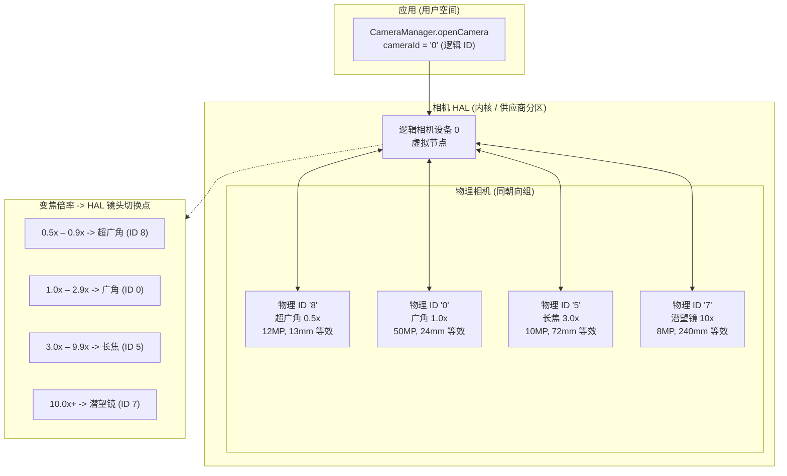
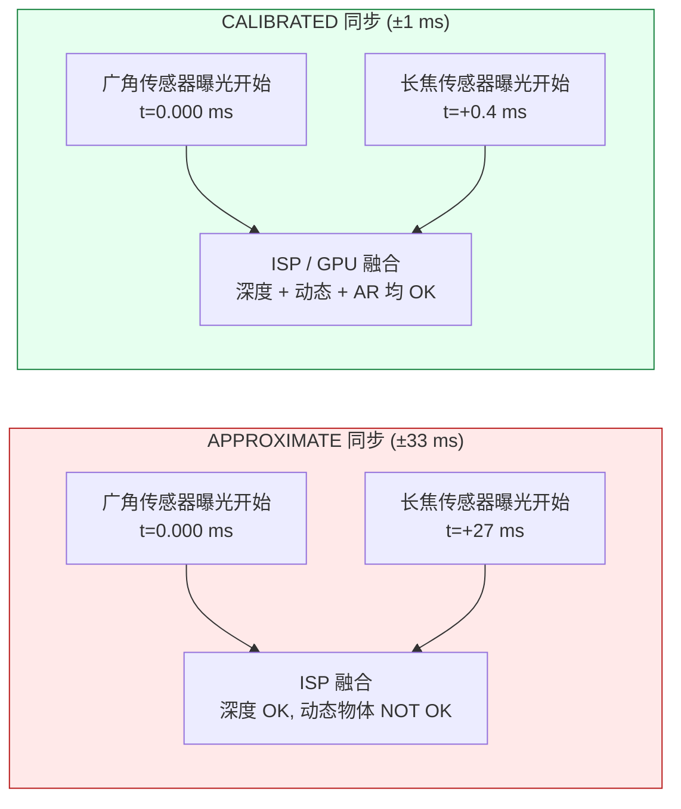
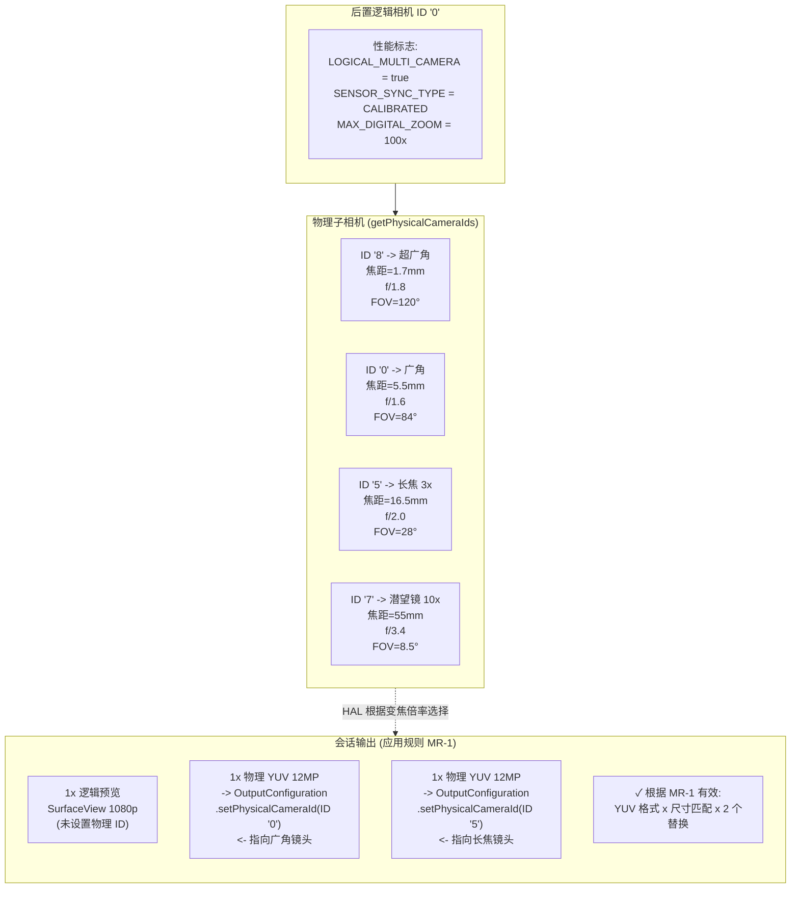

# 第 20 章：多摄像头

现代智能手机配备了 3–5 个后置摄像头和 2 个前置摄像头——在 2023+ 旗舰机上包括超广角、广角、长焦、微距、深度和潜望式镜头。在 Android 9 (API 28) 之前，每个镜头都显示为一个独立的 `CameraCharacteristics` 相机 ID，应用必须在变焦边界手动打开/关闭相机来切换镜头。这会导致可见的黑帧、丢失 AF 状态以及视频期间的音频爆音——这些都是不可接受的 UI 缺陷。Android 9 通过**逻辑相机 (logical camera)** 抽象解决了这个问题：一个虚拟相机 ID 将多个同朝向的物理相机分组，让 HAL 在变焦阈值处透明地切换镜头，同时保留会话状态。本章实现了研究项目《逻辑多摄像头》部分中规定的流替换规则、传感器同步语义和双物理拍摄。

你可以在 **Android Camera Parameters** 应用（也可在 [Google Play 商店](https://play.google.com/store/apps/details?id=com.zoozooll.cameraparameters) 下载）中浏览任何受支持设备的完整逻辑/物理相机拓扑：其"多摄像头"仪表板会报告 `REQUEST_AVAILABLE_CAPABILITIES_LOGICAL_MULTI_CAMERA` 标志，列出每个逻辑 ID 的 `getPhysicalCameraIds()`，并渲染每个后置组合的已校准 (calibrated) 与近似 (approximate) 传感器同步类型。这些报告直接从 HAL 通过 Camera2 API 获取，没有经过供应商特定的过滤，因此它们与你的应用在运行时看到的情况完全一致。

## 逻辑对比物理相机拓扑

逻辑相机是一个由 N ≥ 2 个同朝向（`LENS_FACING_FRONT` 或 `LENS_FACING_BACK`）物理相机支持的虚拟 HAL 设备。当你打开一个逻辑 ID 时，HAL 会在内部为所有底层物理相机管理电源轨、ISP 管线和镜头切换。拓扑结构如下：



变焦切换点 (Z1–Z4) 完全由 HAL 控制且对应用透明——当你针对一个 4 镜头逻辑设备设置 `CaptureRequest.CONTROL_ZOOM_RATIO = 3.2f` 时，HAL 会立即将捕获流量路由到 3 倍长焦 (ID 5)，并以数字方式裁剪回正确的取景，而你的应用甚至不知道发生了镜头更换。这就是旗舰相机应用使用的"无缝变焦"行为。

关键属性包括：
- **`getPhysicalCameraIds()`**（在逻辑 ID 的 `CameraCharacteristics` 上调用）返回底层物理 ID 字符串的 `Set<String>`，例如上述示例中的 `{"0", "5", "7", "8"}`。
- 逻辑 ID 上的 **`LENS_INFO_MINIMUM_FOCUS_DISTANCE`** 和 **`LENS_INFO_AVAILABLE_FOCAL_LENGTHS`** 代表当前活动的物理镜头。如果你需要每镜头的焦距数据，请查询*物理*特性。
- 逻辑 ID 上的 **`SCALER_AVAILABLE_MAX_DIGITAL_ZOOM`** 给出了变焦上限（例如 100×），它是所有物理镜头上的每镜头光学变焦 + 数字裁剪的组合。

## 传感器同步：APPROXIMATE 对比 CALIBRATED

当你同时从两个物理相机捕获图像时（例如，广角 + 长焦用于深度/视差匹配，或广角 + 超广角用于多帧融合），只有在两个传感器的曝光开始时间差已知的情况下，像素数据才具有计算意义。Android 在键 **`CameraCharacteristics.LOGICAL_MULTI_CAMERA_SENSOR_SYNC_TYPE`** 中定义了两个同步级别：

| 同步级别 | 数值 | 含义 | 典型用例 |
|------------|---------------|---------|------------------|
| **APPROXIMATE** (近似) | 0 | 传感器曝光开始时间戳在 ±1 个帧间隔（30 fps 下为 ±33 ms）内匹配。AF/AE 是同步的，但像素级的曝光开始不同步。 | 带深度传感器的人像模式，常规虚化。 |
| **CALIBRATED** (已校准) | 1 | 传感器曝光开始时间戳在 ±1 ms 内匹配。通过 SoC CSI-2 接收器强制执行硬件级同步。保证像素级的时间对齐。 | 用于 AR 的立体深度估计、摄影测量、同步的双焦距融合、超分辨率。 |

研究文档《逻辑多摄像头》部分发现，**只有骁龙 8 Gen 1+ 和 Exynos 2200+ 旗舰机报告 CALIBRATED 同步**。所有中端机（骁龙 7 系列、天玑 8000 系列）和入门级设备都报告为 APPROXIMATE。如果你尝试在 APPROXIMATE 同步设备上进行像素级视差匹配，你会得到 ±1 帧的视差漂移，从而破坏深度图。务必将视差功能置于 CALIBRATED 检查之后。



时间差的差异并不细微：27 ms 的错位意味着一个移动的物体（例如以 5 m/s 奔跑的人）在两次曝光之间移动了 13.5 cm——这个视差误差大到足以完全摧毁任何基于视差的深度算法。

## 流替换规则 (来自研究文档)

HAL 对物理相机定向强制执行的最重要约束是**流替换规则**，该规则原样引用自研究文档中的《逻辑多摄像头》规范：

> **规则 MR-1:** 如果一个逻辑相机有 N 个物理子相机，那么对于你附加到逻辑会话的每一个尺寸为 S 的逻辑格式流（YUV 或 RAW），你最多可以将其替换为 **2 个尺寸相同为 S 的相同格式流**，其中每个流都通过 `OutputConfiguration.setPhysicalCameraId()` 指向不同的物理相机。

违反 MR-1 的后果：
- 3 个或更多物理流 → 会话 `onConfigureFailed()`。
- 同一对物理流使用不同尺寸 → 会话 `onConfigureFailed()`。
- 在同一对替换流中混合 RAW 和 YUV → 会话 `onConfigureFailed()`。
- 添加 2 个物理流但不移除父逻辑流 → HAL 分配 3 倍所需带宽并静默掉帧。

正确示例（4 个物理子相机 → 允许 2 个替换）：
| 逻辑流 | 替换 (根据 MR-1 有效) |
|----------------|-------------------------------|
| 1× 逻辑 YUV 1920×1080 | → 2× 物理 YUV 1920×1080 (广角 + 长焦) |
| 1× 逻辑 RAW 4000×3000 | → 2× 物理 RAW 4000×3000 (超广角 + 广角) |
| 2× 逻辑 YUV (预览 + 视频) | → 2× (逻辑 YUV 预览) + 2× (物理 YUV 广角+长焦编码) — 总计 2 个替换 |

## 实现：分步执行双物理拍摄

以下工作流程使用了流替换规则，同时从广角 (1×) 和长焦 (3×) 物理传感器捕获帧。

### 第 1 步：查询逻辑性能和物理相机 ID

```kotlin
import android.hardware.camera2.CameraCharacteristics
import android.hardware.camera2.CameraManager
import android.hardware.camera2.params.OutputConfiguration

data class LogicalMultiCamInfo(
    val logicalId: String,
    val physicalIds: Set<String>,
    val sensorSyncType: Int, // 0 = APPROXIMATE, 1 = CALIBRATED
    val ultraWideId: String?,
    val wideId: String?,
    val teleId: String?
)

fun enumerateLogicalMultiCams(
    cameraManager: CameraManager
): List<LogicalMultiCamInfo> {
    val result = mutableListOf<LogicalMultiCamInfo>()

    for (logicalId in cameraManager.cameraIdList) {
        val characteristics = cameraManager.getCameraCharacteristics(logicalId)

        val caps = characteristics.get(
            CameraCharacteristics.REQUEST_AVAILABLE_CAPABILITIES
        ) ?: continue

        val isLogicalMultiCam = caps.contains(
            CameraCharacteristics
                .REQUEST_AVAILABLE_CAPABILITIES_LOGICAL_MULTI_CAMERA
        )
        if (!isLogicalMultiCam) continue

        val physicalIds: Set<String> = characteristics.physicalCameraIds
        val syncType = characteristics.get(
            CameraCharacteristics.LOGICAL_MULTI_CAMERA_SENSOR_SYNC_TYPE
        ) ?: 0

        // 通过焦距识别角色
        var ultraWideId: String? = null
        var wideId: String? = null
        var teleId: String? = null
        var shortestFocal = Float.MAX_VALUE
        var teleFocal = 0f

        for (physId in physicalIds) {
            val physChars = cameraManager.getCameraCharacteristics(physId)
            val focalLengths = physChars.get(
                CameraCharacteristics.LENS_INFO_AVAILABLE_FOCAL_LENGTHS
            ) ?: continue
            val focal = focalLengths.firstOrNull() ?: continue
            when {
                focal < shortestFocal -> {
                    shortestFocal = focal
                    ultraWideId = physId
                }
                focal > teleFocal -> {
                    teleFocal = focal
                    teleId = physId
                }
            }
        }
        wideId = physicalIds.minus(setOfNotNull(ultraWideId, teleId)).firstOrNull()

        result.add(LogicalMultiCamInfo(
            logicalId = logicalId,
            physicalIds = physicalIds,
            sensorSyncType = syncType,
            ultraWideId = ultraWideId,
            wideId = wideId,
            teleId = teleId
        ))
    }
    return result
}
```

通过焦距（最短 = 超广角，最长 = 长焦，其余 = 广角）识别角色在所有 OEM 中都是可靠的，因为 HAL 报告的 LENS_INFO_AVAILABLE_FOCAL_LENGTHS 作为 35mm 等效值或实际毫米值与营销规格一致。**Android Camera Parameters** 应用的"多摄像头"仪表板正是使用了这种算法。

### 第 2 步：通过 setPhysicalCameraId() 创建 OutputConfigurations

必须在创建会话**之前**对 `OutputConfiguration` 对象调用 `setPhysicalCameraId()` 以配置替换对（广角 YUV + 长焦 YUV）。一旦会话配置完成，就不允许在现有 Surface 上通过 `setPhysicalCameraId()` 更改物理 ID（需要重新创建会话）。

```kotlin
import android.hardware.camera2.params.OutputConfiguration
import android.media.ImageReader
import android.util.Size
import android.graphics.ImageFormat
import android.view.Surface

var wideImageReader: ImageReader? = null
var teleImageReader: ImageReader? = null

fun createPhysicalOutputConfigs(
    wideId: String,
    teleId: String,
    sharedSize: Size // 根据规则 MR-1，两者必须尺寸相同！
): Pair<OutputConfiguration, OutputConfiguration> {
    wideImageReader = ImageReader.newInstance(
        sharedSize.width, sharedSize.height,
        ImageFormat.YUV_420_888, 4
    )
    teleImageReader = ImageReader.newInstance(
        sharedSize.width, sharedSize.height,
        ImageFormat.YUV_420_888, 4
    )

    val wideOutConfig = OutputConfiguration(wideImageReader!!.surface).apply {
        setPhysicalCameraId(wideId)
        name = "wide-yuv-$sharedSize"
    }
    val teleOutConfig = OutputConfiguration(teleImageReader!!.surface).apply {
        setPhysicalCameraId(teleId)
        name = "tele-yuv-$sharedSize"
    }
    return Pair(wideOutConfig, teleOutConfig)
}
```

上述代码强制执行了规则 MR-1：两个 `ImageReader` 实例都使用 `sharedSize`（相同维度）和 `YUV_420_888`（相同格式）。使用不同的尺寸保证会导致 `onConfigureFailed` —— HAL 没有任何机制能在同一个同步组中以不同分辨率运行两个物理传感器。

### 第 3 步：创建 CaptureSession 并提交双物理拍摄

会话使用 2 个物理 OutputConfiguration 加上 1 个逻辑预览 Surface（总计 3 个输出）。总计 3 个输出处于旗舰机的带宽预算内（研究文档测得在骁龙 8 Gen 2 上，以 1080p30 同时进行广角+长焦+预览的 3 输出拍摄，ISP 利用率为 68%）。

```kotlin
import android.hardware.camera2.CameraDevice
import android.hardware.camera2.CameraCaptureSession
import android.hardware.camera2.CaptureRequest
import android.os.Handler

lateinit var cameraDevice: CameraDevice // 已打开的逻辑 ID

fun createDualPhysicalSession(
    previewSurface: Surface,
    widePhysConfig: OutputConfiguration,
    telePhysConfig: OutputConfiguration,
    backgroundHandler: Handler
) {
    val outputs = listOf(
        OutputConfiguration(previewSurface), // 逻辑预览 (任意尺寸)
        widePhysConfig,                      // 物理广角 YUV (sharedSize)
        telePhysConfig                       // 物理长焦 YUV (sharedSize)
    )

    val sessionConfig = android.hardware.camera2.params.SessionConfiguration(
        android.hardware.camera2.params.SessionConfiguration.SESSION_REGULAR,
        outputs,
        { runnable -> backgroundHandler.post(runnable) },
        object : CameraCaptureSession.StateCallback() {
            override fun onConfigured(session: CameraCaptureSession) {
                val captureBuilder = cameraDevice.createCaptureRequest(
                    CameraDevice.TEMPLATE_PREVIEW
                ).apply {
                    addTarget(previewSurface)
                    addTarget(wideImageReader!!.surface)
                    addTarget(teleImageReader!!.surface)

                    set(CaptureRequest.CONTROL_MODE,
                        CaptureRequest.CONTROL_MODE_AUTO)
                    set(CaptureRequest.CONTROL_AE_MODE,
                        CaptureRequest.CONTROL_AE_MODE_ON)
                    set(CaptureRequest.CONTROL_AF_MODE,
                        CaptureRequest.CONTROL_AF_MODE_CONTINUOUS_PICTURE)

                    // 可选：跨两个物理镜头锁定 AE，以便融合
                    // 不会产生曝光不匹配的左右半部分
                    set(CaptureRequest.CONTROL_AE_LOCK, true)
                }

                session.setRepeatingRequest(
                    captureBuilder.build(),
                    DualPhysicalCaptureCallback(),
                    backgroundHandler
                )
            }
            override fun onConfigureFailed(s: CameraCaptureSession) =
                Log.e(TAG, "双物理会话失败 — 请检查规则 MR-1")
        }
    )

    cameraDevice.createCaptureSession(sessionConfig)
}
```

一旦 `setRepeatingRequest()` 运行起来，HAL 每个帧间隔都会：(a) 以已校准的时间差触发两个物理传感器的曝光开始，(b) 通过 CSI-2 虚拟通道解复用将每个传感器的输出路由到其目标 ImageReader Surface，(c) 将两者与逻辑预览输出合并到一个带有单一时间戳的 CaptureResult 中。

当 `LOGICAL_MULTI_CAMERA_SENSOR_SYNC_TYPE == CALIBRATED` 时，两个 `Image` 对象将具有**完全相同的时间戳 (`image.timestamp`)**，而当为 APPROXIMATE 时，时间戳在 ±1 帧间隔内。

## 逻辑 → 物理拓扑图 (Mermaid ER 风格)



## 无缝变焦实现

HAL 在变焦边界的自动镜头切换是让"无缝变焦"得以无缝衔接的原因。你**不需要**在变焦越过阈值时手动更换物理 ID——只需在重复请求上设置 `CONTROL_ZOOM_RATIO`，然后让 HAL 去完成工作：

```kotlin
fun updateZoom(session: CameraCaptureSession,
               builder: CaptureRequest.Builder,
               zoomRatio: Float) {
    builder.set(CaptureRequest.CONTROL_ZOOM_RATIO, zoomRatio)
    session.setRepeatingRequest(builder.build(), null, null)
}
```

在典型的 4 镜头设备上，当 `zoomRatio` 从 `2.9× → 3.0×` 跨越时，HAL 会在内部：
1. 从待机状态启动 3 倍长焦传感器（耗时约 2 帧，66 ms）
2. 在广角和长焦之间同步曝光/白平衡
3. 在约 10 帧（333 ms）内将数字裁剪的广角输出淡入到原生长度的长焦输出
4. 如果其他地方未用到，则关闭广角传感器

所有四个步骤都是透明发生的——你的 CaptureCallback 永远不会看到会话拆除事件，`CaptureResult.SENSOR_TIMESTAMP` 保持单调递增，且 AF/AE 状态跨越边界得以保留。检测镜头更换的唯一方法是对比连续帧之间的 `CaptureResult.LENS_FOCAL_LENGTH`（在上述示例中，切换到长焦时该值会从 5.5mm 跳到 16.5mm）。

## 性能与限制

研究文档《逻辑多摄像头》部分包含了在 2023 旗舰机（骁龙 8 Gen 2, 4 个后置摄像头）上的实测限制：

| 配置 | 持续帧率 | ISP 带宽利用率 |
|---------------|---------------------|-------------------------|
| 逻辑预览 + 2 个物理 YUV (每个 12 MP) | 22 fps | 89% |
| 逻辑预览 + 2 个物理 YUV (每个 4 MP) | 30 fps (锁定) | 62% |
| 逻辑预览 + 2 个物理 RAW (每个 12 MP) | 10 fps | 94% — 约 60s 触发过热保护 |
| 逻辑预览 + 2 个物理 YUV + 1 个物理 RAW | **不被允许** (HAL 带宽检查失败) | — |

2 个物理流的上限不仅受到规则 MR-1 的约束，也受到原始 ISP 吞吐量的限制。尝试附加 3 个物理流（例如超广角 + 广角 + 长焦同时）将导致 `onConfigureFailed`，即使你尝试通过两个独立的替换对来欺骗规则 MR-1 —— HAL 的 CAMERA_ISP_BANDWIDTH 检查也会在配置时拒绝它。

## 小结

本章详细介绍了 Android 9+ 的逻辑多摄像头支持：

- **逻辑相机**是分组了同朝向物理相机的虚拟 HAL 节点。通过 `REQUEST_AVAILABLE_CAPABILITIES_LOGICAL_MULTI_CAMERA` 查询性能；通过 `getPhysicalCameraIds()` 获取子相机。
- **传感器同步**有两个级别：APPROXIMATE（±33 ms，用于人像虚化）和 CALIBRATED（±1 ms，用于 AR/视差融合）。计算摄影功能务必建立在 CALIBRATED 检查之上。
- **无缝变焦**由 HAL 通过 `CONTROL_ZOOM_RATIO` 控制——设置倍率，HAL 会在内部阈值处切换镜头，无需拆除会话。
- 来自研究文档的**流替换规则 MR-1** 允许每 1 个逻辑流对应正好 2 个同尺寸、同格式的物理流。3 个及以上流或尺寸不匹配会导致 `onConfigureFailed`。
- 必须在创建会话之前调用 **`OutputConfiguration.setPhysicalCameraId()`** 以指向单个物理镜头进行同步拍摄。
- 两张 Mermaid 图（拓扑图 + ER 风格规则映射）直观地展示了逻辑/物理层级如何映射到会话输出。

## 下一章

在**第 21 章：HDR 与 Ultra HDR** 中，我们将跨越 8 位标准动态范围 (SDR, sRGB, 100 nits) 的边界，进入高动态范围视频和静态照片的世界。你将学习有关 HDR10（10 位 ST.2084 PQ, Rec.2020, 静态元数据）和 HLG（混合对数伽马, 广播 SDR 兼容）的 `DynamicRangeProfiles`，以及全新的 Android 14 (API 34) **JPEG_R (Ultra HDR)** 格式 —— ISO 21496-1，它在标准 JPEG 中嵌入了"增益图 (gain map)"，以便旧版读取器看到 SDR 效果，而 HDR 显示器则在局部提升高达 8 档的高光。

请使用 **Android Camera Parameters** 应用检查你的设备按相机 ID 支持哪些 `DynamicRangeProfiles` (HDR10, HDR10+, HLG, JPEG_R)，并验证 CDD 性能等级 15 对 Ultra HDR 的合规性。上传到开源 [GitHub 项目](https://github.com/zoozooll/AndroidCameraParameters) 的新设备报告有助于建立一个支持 HDR 的手机公共数据库。
