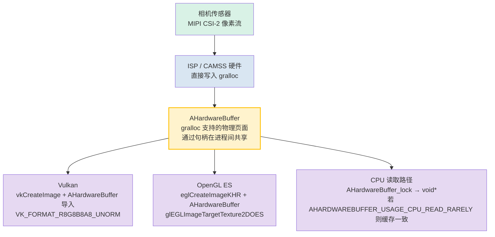

# 第 25 章：原生相机开发

## 摘要

第 1-24 章在托管代码中运行：Kotlin 或 Java 在 ART 上运行，针对每一个 `CaptureRequest` 都要跨越一次 Binder IPC 边界，并且要么分配帧的 `ByteBuffer` 副本，要么接受由 `SurfaceTexture` 调解的纹理流带来的开销。对于社交相机类应用，这已经足够了。但对于 AR 引擎、实时计算机视觉管线、车载倒车影像，或者是每一帧预算仅 16ms 的 3D 引擎来说，这还远远不够。

原生相机开发使用 NDK 的 `<camera/NdkCameraManager.h>` 和 `<android/hardware_buffer.h>` 头文件，将整个相机的打开/配置/捕获循环移动到 C/C++ 中。直接的回报是热路径上的零 JNI 开销，以及至关重要的一点：能够将 gralloc 分配的 `AHardwareBuffer` 对象直接包装为 Vulkan `VkImage` 或 OpenGL `EGLImage` 目标，而无需在传感器输出与 GPU 纹理采样之间进行任何字节的内存拷贝。

**Android Camera Parameters** 可帮助你验证目标设备是否提供了可预测的低级原生操作所需的 `INFO_SUPPORTED_HARDWARE_LEVEL_FULL` 或 `LEVEL_3` 保证。可从 [Google Play](https://play.google.com/store/apps/details?id=com.minininja.cameraparams) 下载，或在 [github.com/zoozooll/AndroidCameraParameters](https://github.com/zoozooll/AndroidCameraParameters) 查看源码。

---

## 为什么要进行原生开发？

在深入研究 C++ 之前，让我们准确界定原生开发能带给你什么，以及它何时能证明其复杂性是值得的。

### 选择原生开发的理由

1. **关键路径上的零 JNI 开销。** 60fps 管线每帧只有 16.67ms。单次跨越 ART/C 边界的 JNI `CallVoidMethod` 调用在微基准测试中约为 0.5–2µs，但真正的成本在于*每帧*的调用、线程切换、JNI 局部引用记账以及托管 `Image` 代理带来的 GC 压力。如果有四个相机同时为一个 AR 会话供流，仅在语言边界的切换上就会耗费 1 毫秒的预算。原生开发消除了这一点。

2. **通过 `AHardwareBuffer` 直接拥有内存。** 在托管代码中，`Image.getPlanes()[0].getBuffer()` 返回的是 gralloc 内存的一个*视图* `ByteBuffer`；读取它会强制执行 CPU 缓存失效，并且对于 `PRIVATE` 等格式通常涉及内部拷贝。在原生代码中，`AHardwareBuffer` 就是 gralloc 句柄本身，GPU 可以原位将其绑定为纹理内存。

3. **AR/3D 引擎集成。** Unity、Unreal、Ogre 以及各种自研引擎使用 C++ 编写是有充分理由的。在渲染循环的 C++ 代码内部运行相机，消除了 "ART + JNI + 渲染线程" 这一由三个进程组成的纠结团块。

4. **汽车 EVS (外部显示系统) 迁移。** 在 Android 10 之前，汽车倒车摄像头使用带有独立 HAL 的旧版 `EVS` 堆栈。2020–2024 年间的 OEM 迁移将 EVS 收敛到了标准的 Camera2 NDK API 上，为 `AID_AUTOMOTIVE_EVS_UID = 1071` 保留了在启动早期（甚至在 `system_server` 的 CameraService 运行之前）访问硬件的权限。如果你的代码针对汽车领域，原生开发是不可逾越的选择。

### 反对原生开发的理由

- 调试更困难。`ACameraDevice` 回调中的崩溃会产生 tombstone (墓碑) 追踪信息，而不是清晰的 Kotlin 堆栈追踪。
- 生命周期管理完全手动。`ACameraManager` *不是* 生命周期感知的；在 Surface 销毁时忘记执行 `ACameraCaptureSession_stopRepeating()` + `ACameraDevice_close()` 会导致相机资源泄漏，并可能在重启前阻塞其他应用。
- 较少的设备变通方案。CameraX 的异常行为数据库在 NDK 领域并不存在；你继承的是 HAL 的原始表现。
- 没有 `DngCreator`，没有 `ExifInterface` 辅助程序，没有 `CameraCharacteristics` 便捷访问器 —— 你需要通过 `ACameraMetadata_getConstEntry` 自己解析元数据标签。

决策很简单：如果你无法在托管代码中满足帧预算，或者你需要 EVS 级别的启动时相机访问权限，请选择原生。否则，请留在托管端。

---

## ACameraManager：对应于 Java CameraManager 的 NDK 实现

`<camera/NdkCameraManager.h>`、`<camera/NdkCameraDevice.h>` 和 `<camera/NdkCaptureRequest.h>` 中的 NDK 相机 API 表面几乎与你熟悉的 Java API 一一对应。每个 Java 类都有对应的原生结构体和一组空闲函数：

| Java 类 | NDK 句柄 / 函数前缀 |
|-------------------------------|-------------------------------------------------------|
| `CameraManager` | `ACameraManager` · `ACameraManager_*` |
| `CameraCharacteristics` | `ACameraMetadata` · `ACameraMetadata_*` |
| `CameraDevice` | `ACameraDevice` · `ACameraDevice_*` |
| `CaptureRequest.Builder` | `ACaptureRequest` · `ACaptureRequest_setEntry_*` |
| `CameraCaptureSession` | `ACameraCaptureSession` · `ACameraCaptureSession_*` |
| `TotalCaptureResult` | `ACameraCaptureResult` · `ACaptureResult` |
| `ImageReader` | `AImageReader` (来自 `<media/NdkImageReader.h>`) |

生命周期完全相同：枚举相机 → 读取特性 → 打开 → 创建输出 Surface → 创建会话 → 设置重复请求 → 按相反顺序拆除。

### 示例 1：枚举相机、读取特性、打开设备 (C++)

```cpp
#include <camera/NdkCameraManager.h>
#include <camera/NdkCameraDevice.h>
#include <camera/NdkCameraMetadata.h>
#include <android/log.h>

#define LOG_TAG "NativeCam"
#define LOGI(...) __android_log_print(ANDROID_LOG_INFO, LOG_TAG, __VA_ARGS__)
#define LOGE(...) __android_log_print(ANDROID_LOG_ERROR, LOG_TAG, __VA_ARGS__)

static ACameraManager* g_cameraManager = nullptr;
static ACameraDevice* g_cameraDevice = nullptr;

void onDeviceDisconnected(void* ctx, ACameraDevice* dev) {
    LOGI("相机设备已断开连接");
}

void onDeviceError(void* ctx, ACameraDevice* dev, int err) {
    LOGE("相机设备错误: %d", err);
}

static ACameraDevice_stateCallbacks g_deviceCallbacks = {
    .context = nullptr,
    .onDisconnected = onDeviceDisconnected,
    .onError = onDeviceError,
};

bool enumerateAndOpenBackCamera() {
    g_cameraManager = ACameraManager_create();
    if (!g_cameraManager) {
        LOGE("创建 ACameraManager 失败");
        return false;
    }

    ACameraIdList* cameraIdList = nullptr;
    camera_status_t status = ACameraManager_getCameraIdList(
        g_cameraManager, &cameraIdList);
    if (status != ACAMERA_OK) {
        LOGE("getCameraIdList 失败: %d", status);
        return false;
    }

    const char* chosenId = nullptr;

    for (int i = 0; i < cameraIdList->numCameras; ++i) {
        const char* id = cameraIdList->cameraIds[i];
        ACameraMetadata* chars = nullptr;
        status = ACameraManager_getCameraCharacteristics(
            g_cameraManager, id, &chars);
        if (status != ACAMERA_OK) continue;

        ACameraMetadata_const_entry lensFacingEntry{};
        status = ACameraMetadata_getConstEntry(
            chars,
            ACAMERA_LENS_FACING,
            &lensFacingEntry);

        uint8_t facing = 0;
        if (status == ACAMERA_OK && lensFacingEntry.count > 0) {
            facing = lensFacingEntry.data.u8[0];
        }

        if (facing == ACAMERA_LENS_FACING_BACK) {
            chosenId = id;
            // 同时查询硬件级别以进行性能检查：
            ACameraMetadata_const_entry hwEntry{};
            if (ACameraMetadata_getConstEntry(
                    chars, ACAMERA_INFO_SUPPORTED_HARDWARE_LEVEL,
                    &hwEntry) == ACAMERA_OK && hwEntry.count > 0) {
                LOGI("后置相机 %s 硬件级别 = %d (期待 %d=FULL %d=LEVEL3)",
                     id, hwEntry.data.u8[0],
                     (int)ACAMERA_INFO_SUPPORTED_HARDWARE_LEVEL_FULL,
                     (int)ACAMERA_INFO_SUPPORTED_HARDWARE_LEVEL_3);
            }
            ACameraMetadata_free(chars);
            break;
        }
        ACameraMetadata_free(chars);
    }

    ACameraManager_deleteCameraIdList(cameraIdList);

    if (!chosenId) {
        LOGE("未找到后置相机");
        return false;
    }

    status = ACameraManager_openCamera(
        g_cameraManager, chosenId,
        &g_deviceCallbacks,
        &g_cameraDevice);

    if (status != ACAMERA_OK) {
        LOGE("openCamera 失败: %d", status);
        return false;
    }

    LOGI("成功打开相机 %s", chosenId);
    return true;
}
```

请注意，这里没有异常机制。每个函数都返回 `camera_status_t`，你*必须*检查每一个返回值。`ACAMERA_OK = 0`；任何非零值都是特定的失败代码（`ACAMERA_ERROR_CAMERA_IN_USE`、`ACAMERA_ERROR_CAMERA_DISCONNECTED` 等）。没有 `CameraAccessException` 可捕捉 —— 如果你忽略了返回值，函数只是静默地将输出指针保留为 `nullptr`，而你会在三行代码后发生崩溃。

### 创建捕获会话并设置重复请求

一旦设备打开，其模式就镜像了 Java 的会话创建。为每个 Surface 创建一个 `ACameraOutputTarget`，将它们打包进一个 `ACaptureSessionOutputContainer`，然后调用 `ACameraDevice_createCaptureSession()`。对于重复请求，从模板构建一个 `ACaptureRequest`，添加你的输出目标，并调用 `ACameraCaptureSession_setRepeatingRequest()`。回调结构体（`ACameraCaptureSession_stateCallbacks`、`ACameraCaptureSession_captureCallbacks`）在会话创建时注册，与它们的 Java 对应项完全匹配。

---

## AHardwareBuffer：零拷贝的关键路径

这是进行原生开发的真实理由。`AHardwareBuffer`（定义在 `<android/hardware_buffer.h>` 中）是 gralloc 分配内存的 NDK 句柄 —— 也就是相机 HAL 写入传感器像素的同一块内存。当你向 `ACameraDevice_createCaptureSession` 馈送一个由 `AHardwareBuffer` 支持的 Surface，随后将同一个 `AHardwareBuffer` 导入到 Vulkan 或 OpenGL 中时，你就实现了真正的零拷贝：



`AHardwareBuffer` 节点是关键：它是相机 HAL 写入端点、GPU 纹理采样器以及（可选的）CPU 共享的单一分配单元。没有 memcpy，没有 `glTexImage2D` 上传，没有 `ByteBuffer.wrap()` —— GPU 纹理实际上指向了相机刚刚写入的同一个物理 DRAM 页面。

对于 4K 流上的 AR 60fps 管线，这相当于每秒约 200ms 的带宽节省（4K × 60fps × 4 字节 = 约 4.7 GB/s 的节省），也是平滑体验与卡顿体验之间的分水岭。

### 示例 2：从 AHardwareBuffer 到 Vulkan VkImage 的逐步实现 (C++)

```cpp
#include <android/hardware_buffer.h>
#include <vulkan/vulkan.h>
#include <vulkan/vulkan_android.h>

VkImage createVkImageFromAHardwareBuffer(
    VkDevice device,
    AHardwareBuffer* aBuffer,
    VkFormat format,
    uint32_t width,
    uint32_t height) {

    // 第 1 步：填充 AndroidHardwareBufferProperties2KHR
    VkAndroidHardwareBufferPropertiesANDROID ahbProps{};
    ahbProps.sType = VK_STRUCTURE_TYPE_ANDROID_HARDWARE_BUFFER_PROPERTIES_ANDROID;
    VkResult res = vkGetAndroidHardwareBufferPropertiesANDROID(
        device, aBuffer, &ahbProps);
    if (res != VK_SUCCESS) {
        LOGE("vkGetAndroidHardwareBufferPropertiesANDROID 失败: %d", res);
        return VK_NULL_HANDLE;
    }

    // 第 2 步：描述图像导入 (不是分配)
    VkExternalMemoryImageCreateInfo externalInfo{};
    externalInfo.sType = VK_STRUCTURE_TYPE_EXTERNAL_MEMORY_IMAGE_CREATE_INFO;
    externalInfo.handleTypes =
        VK_EXTERNAL_MEMORY_HANDLE_TYPE_ANDROID_HARDWARE_BUFFER_BIT_ANDROID;

    VkImageCreateInfo imgInfo{};
    imgInfo.sType = VK_STRUCTURE_TYPE_IMAGE_CREATE_INFO;
    imgInfo.pNext = &externalInfo;
    imgInfo.imageType = VK_IMAGE_TYPE_2D;
    imgInfo.format = format;             // 例如 VK_FORMAT_R8G8B8A8_UNORM
    imgInfo.extent = { width, height, 1 };
    imgInfo.mipLevels = 1;
    imgInfo.arrayLayers = 1;
    imgInfo.samples = VK_SAMPLE_COUNT_1_BIT;
    imgInfo.tiling = VK_IMAGE_TILING_OPTIMAL;
    imgInfo.usage = VK_IMAGE_USAGE_SAMPLED_BIT |
                    VK_IMAGE_USAGE_TRANSFER_DST_BIT;
    imgInfo.sharingMode = VK_SHARING_MODE_EXCLUSIVE;
    imgInfo.initialLayout = VK_IMAGE_LAYOUT_UNDEFINED;

    VkImage image = VK_NULL_HANDLE;
    res = vkCreateImage(device, &imgInfo, nullptr, &image);
    if (res != VK_SUCCESS) {
        LOGE("vkCreateImage 失败: %d", res);
        return VK_NULL_HANDLE;
    }

    // 第 3 步：分配导入 AHB 的 VkDeviceMemory (不分配新内存)
    VkMemoryRequirements memReqs{};
    vkGetImageMemoryRequirements(device, image, &memReqs);

    VkImportAndroidHardwareBufferInfoANDROID importInfo{};
    importInfo.sType =
        VK_STRUCTURE_TYPE_IMPORT_ANDROID_HARDWARE_BUFFER_INFO_ANDROID;
    importInfo.buffer = aBuffer;

    VkMemoryDedicatedAllocateInfo dedicatedInfo{};
    dedicatedInfo.sType = VK_STRUCTURE_TYPE_MEMORY_DEDICATED_ALLOCATE_INFO;
    dedicatedInfo.pNext = &importInfo;
    dedicatedInfo.image = image;

    VkMemoryAllocateInfo allocInfo{};
    allocInfo.sType = VK_STRUCTURE_TYPE_MEMORY_ALLOCATE_INFO;
    allocInfo.pNext = &dedicatedInfo;
    allocInfo.allocationSize = memReqs.size;
    allocInfo.memoryTypeIndex = ahbProps.memoryTypeBits
        // memoryTypeIndex 必须从 memReqs.memoryTypeBits
        // 与 ahbProps.memoryTypeBits 的交集中选择。此处省略细节。
        ;

    VkDeviceMemory mem = VK_NULL_HANDLE;
    res = vkAllocateMemory(device, &allocInfo, nullptr, &mem);
    if (res != VK_SUCCESS) {
        LOGE("vkAllocateMemory 导入失败: %d", res);
        vkDestroyImage(device, image, nullptr);
        return VK_NULL_HANDLE;
    }

    // 第 4 步：将导入的内存绑定到 VkImage
    vkBindImageMemory(device, image, mem, 0);

    // 第 5 步：通过命令缓冲区转换到 SHADER_READ_ONLY_OPTIMAL 布局
    // (省略 —— 针对 VK_IMAGE_LAYOUT_UNDEFINED 
    // → VK_IMAGE_LAYOUT_SHADER_READ_ONLY_OPTIMAL 的标准图像内存屏障)

    LOGI("成功将 AHardwareBuffer 导入为 VkImage %p", image);
    return image;
}
```

大多数新手最容易产生困惑的是第 3 步：带有 `VK_STRUCTURE_TYPE_IMPORT_ANDROID_HARDWARE_BUFFER_INFO_ANDROID` 的 `vkAllocateMemory` 调用**并不**进行分配。它将现有的 `AHardwareBuffer` 注册为 `VkDeviceMemory` 对象。这些字节已在相机生产者创建 Surface 时由 gralloc 分配；Vulkan 只是在将其纳入其内存模型。

OpenGL ES 路径与之类似但更短：`eglCreateImageKHR(..., EGL_NATIVE_BUFFER_ANDROID, aBuffer, ...)` → `glEGLImageTargetTexture2DOES(GL_TEXTURE_2D, eglImage)`。只需一次调用即可进行采样。

---

## OpenGL 与 Vulkan 互操作总结

两种路径都可行。如何选择：

| 考量因素 | OpenGL ES 3.x + EGLImage | Vulkan 1.1+ + AHB 导入 |
|-----------------------|----------------------------------------------|----------------------------------------------|
| 复杂度 | 设置较短，流程较简 | 样板代码较多，显式同步 |
| 同步 | 隐式；驱动程序插入屏障 | 显式；你需要编写管线屏障 + 信号量 |
| 多队列/多线程 | 绑定到每个线程的单个 EGLContext | 一等公民的多队列传输 |
| 汽车/AR 认证 | 在多数 EVS 目标上经过认证 | 新的 AR 运行时越来越多地要求此项 |

如果你正在集成到现有引擎中，引擎会为你做出选择。如果你是白手起家并追求极致性能，Vulkan 是未来。如果你想要最少的代码，通过 EGLImage 的 OpenGL ES 仍是务实的选择，且在每一台带相机的设备上都有提供。

---

## 汽车 EVS 背景：向 Camera2 NDK 迁移

为了完整起见，这里记录一下研究笔记中引用的汽车领域迁移路径。在 Android 9 之前，车载倒车摄像头使用独立的 `EVS` HAL (`android.hardware.automotive.evs@1.0`)，它有自己的枚举和流管线。从 Android 10 开始，并在 Android 12+ 的新 IVI 系统中成为强制要求，EVS 管理器被重新实现*在标准的相机 HAL3 + NDK 相机堆栈之上*，并使用新的保留 UID `AID_AUTOMOTIVE_EVS_UID = 1071`。该 UID 甚至在 `system_server` 的 `CameraService` 初始化之前，就能在 `early-boot` 阶段获得 `CAMERA` 权限组访问权。

实际上，如果你正在编写汽车倒车摄像头代码：
1. 你的进程以 UID 1071 运行。
2. 你使用的正是本章中的原生 API (`ACameraManager_openCamera`、`AImageReader`、`AHardwareBuffer` → Vulkan 导入)。
3. 你必须能够在冷启动后的 2 秒内打开、配置并输出一帧画面 (FMVSS 111 法规要求)。这就是 EVS 堆栈要求原生开发的原因 —— ART 启动的每一毫秒都是你消耗不起的。

EVS 向 Camera2 NDK 的迁移是过去五年中 Android 相机生态系统最重大的内部重构之一，这也是为什么 NDK 相机 API 从 Android 10 起获得了如此沉重的投入。如果你阅读本章是为了发布车载相机产品，那么你使用的正是 Google 汽车合规性测试所规定的代码路径。

---

## 示例 3 (Kotlin JNI 桥接存根)

为了完整起见，这里提供一个调用上述 C++ 代码的极简 Kotlin JNI 入口点：

```kotlin
// NativeBridge.kt
class NativeBridge {

    external fun enumerateAndOpenBackCameraNative(): Boolean

    companion object {
        init {
            System.loadLibrary("native_camera")
        }
    }
}
```

```cpp
// native_camera.cpp JNI 导出
extern "C" JNIEXPORT jboolean JNICALL
Java_com_example_NativeBridge_enumerateAndOpenBackCameraNative(
    JNIEnv* /*env*/, jobject /*thiz*/) {
    return static_cast<jboolean>(enumerateAndOpenBackCamera() ? JNI_TRUE : JNI_FALSE);
}
```

在 `build.gradle` 中：

```kotlin
android {
    defaultConfig {
        ndk { abiFilters += listOf("arm64-v8a", "armeabi-v7a", "x86_64") }
    }
    externalNativeBuild {
        cmake { path = file("src/main/cpp/CMakeLists.txt") }
    }
}
```

以及相应的 `CMakeLists.txt` 链接 `-lcamera2ndk`、`-lmediandk`、`-landroid` 和 `-lvulkan`。

---

## 小结

原生相机开发牺牲了托管代码的易用性，以换取极致的性能和对硬件的直接掌控。`ACameraManager` 及其配套结构体与 Java Camera2 API 一一对应，只是改用了 C 风格的错误返回和手动生命周期。真正的价值在于 `AHardwareBuffer` —— 这一 gralloc 句柄让你能将相机 HAL 的输出直接馈送到 Vulkan `VkImage` 或 OpenGL `EGLImage` 纹理中，而无需任何内存拷贝，从而在 60fps AR 管线中节省每秒数 GB 的 DRAM 带宽。对于汽车领域，由于 2 秒启动帧要求以及 `AID_AUTOMOTIVE_EVS_UID` 的早期硬件访问，EVS 向 NDK 的迁移使得原生开发成为必选项。在使用原生实现之前，请使用 **Android Camera Parameters** 验证你的目标设备是否具备 `INFO_SUPPORTED_HARDWARE_LEVEL_FULL` 或更好的性能。

## 下一章

无论是在 Kotlin 还是 C++ 中，Camera2 本质上都是一个异步 API：`StateCallbacks`、`CaptureCallbacks`、`AvailabilityCallbacks` 都在后台线程触发。第 26 章将利用 Kotlin 协程和 Flow 来驯服这种混乱，将你在早期章节中编写的、支离破碎的回调地狱转换为整洁、线性且响应式的管线。
