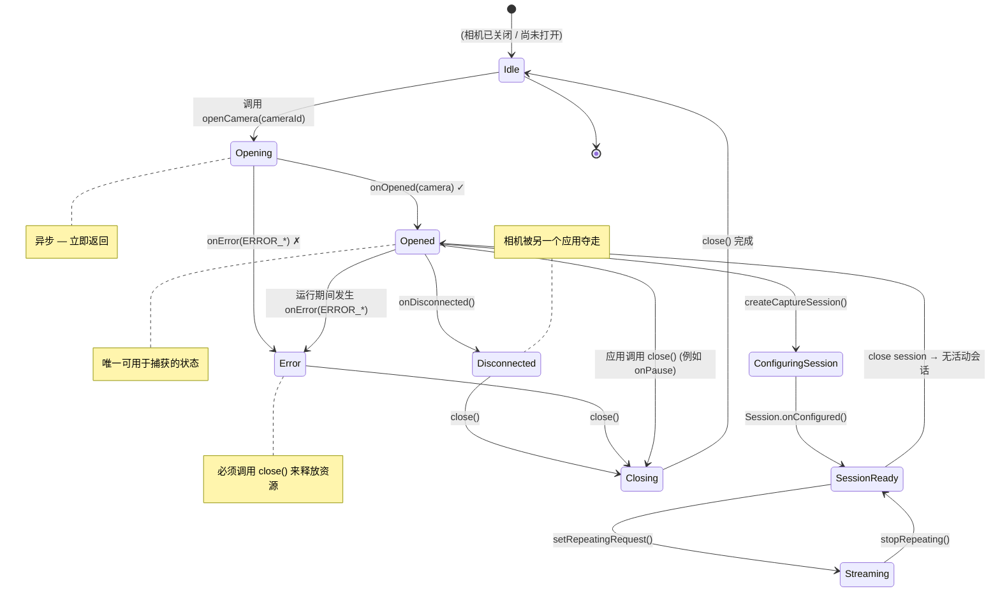

你已经枚举了设备上的所有相机（第 6 章），并确定了你想要使用的那一个——通常是硬件级别最高的后置摄像头。下一步是**打开**该相机：建立与相机硬件的主动、低级连接，以便你可以配置捕获会话并提交请求。打开相机是一个"破釜沉舟"的时刻，你的应用从此从相机元数据的被动观察者转变为真实硬件的主动控制者。

如果你想查看生产级的相机打开/关闭生命周期代码，请研究 [GitHub](https://github.com/zoozooll/AndroidCameraParameters) 上的 **Android Camera Parameters** 应用。其 `Camera2Controller` 类封装了整个 `CameraDevice` 生命周期管理，包括错误恢复、重试逻辑和同步清理。[Google Play](https://play.google.com/store/apps/details?id=com.minininja.cameraparams) 版本的该应用已安装在数百个不同 OEM 的数千台设备上，因此它处理的边缘情况是经过现实世界考验的。

## 什么是 CameraDevice？

`CameraDevice` 是 Camera2 类，代表**与设备上特定物理（或逻辑）相机的活动、已打开的连接**。在相机打开之前，你只能读取其特性；一旦打开，你可以：
- 创建 `CameraCaptureSession`（第 8 章）
- 提交 `CaptureRequest`（第 8 章和第 9 章）
- 在帧到达时读取动态 `CaptureResult` 元数据
- 刷新挂起的请求、中止捕获并关闭设备

`CameraDevice` 有两个关键属性：

1. **它是单用户资源。** 一次只能有一个应用（在你的应用内部，只能有一个 `CameraDevice` 实例）保持特定的相机开启。如果优先级更高的应用（如带有视频的来电）需要相机，你的应用将被强制断开连接。
2. **它具有严格的、回调驱动的生命周期。** 你不能用构造函数实例化 `CameraDevice`。获取它的唯一方法是通过 `CameraManager.openCamera()`，它通过 `StateCallback` 异步交付实例。你必须尊重每一个状态转换回调。

`CameraManager`、相机 ID 与生成的 `CameraDevice` 之间的关系是：

```
CameraManager.openCamera("0", callback, handler)
    │
    ├── 异步调用 → 立即返回
    │
    └───── 在后台线程（通过 Handler） ────→ StateCallback.onOpened(cameraDevice)
                                                          │
                                                          ▼
                                                  现在你可以使用 cameraDevice 来：
                                                  • createCaptureSession(...)
                                                  • createCaptureRequest(...)
```

## StateCallback：CameraDevice 的生命周期机

`CameraDevice.StateCallback` 是一个抽象类，包含三个你**必须**实现的方法。每个已打开的相机最终都会触发至少一个此类回调（或者是 `onOpened` 随后是 `onDisconnected`/`onError`，或者是打开失败时直接触发 `onError`）。在 `onOpened` 触发之前，相机不能用于捕获。

### 三个 StateCallback 方法

| 方法 | 调用时机 | 该做什么 |
|---|---|---|
| `onOpened(camera: CameraDevice)` | 相机已成功打开并可以使用。 | 在属性中存储 `camera` 引用。继续配置捕获会话（第 8 章）。如果你获取了信号量许可，请释放它。 |
| `onDisconnected(camera: CameraDevice)` | 相机从你的应用中被夺走（例如，另一个优先级更高的应用打开了它，用户切换到了一个急需相机的移动前台应用，或者设备策略禁用了它）。 | 立即调用 `camera.close()`。将你存储的引用置空。在你的应用重新回到前台（此时 `onResume` 将重试）之前，无法重新打开相机。 |
| `onError(camera: CameraDevice, error: Int)` | 在打开期间或相机活动期间发生了致命错误。`error` 参数是下面描述的 `ERROR_*` 常量之一。 | 调用 `camera.close()`。将引用置空。根据错误代码，向用户显示错误信息或使用指数退避策略进行重试。始终释放信号量。 |

### `onError` 错误代码

`onError` 中的 `error` 整数映射到五个常量（定义在 `CameraDevice.StateCallback` 中）：

| 常量 | 值 | 含义 | 恢复方式 |
|---|---|---|---|
| `ERROR_CAMERA_IN_USE` | `1` | 相机已被另一个应用或系统相机服务打开。 | 无法自动恢复；等待用户返回你的应用执行 `onResume` 时重试。 |
| `ERROR_MAX_CAMERAS_IN_USE` | `2` | 设备对同时打开的相机数量有限制；你尝试打开此相机时已超过限制（在多摄旗舰机上常见）。 | 关闭你可能持有的其他已打开的 `CameraDevice`，然后重试。在有硬件限制的设备上，通常一次只能打开 2–3 个相机。 |
| `ERROR_CAMERA_DISABLED` | `3` | 设备策略（MDM、家长控制、自助服务模式）已禁用所有相机。 | 向用户显示永久性错误消息。在策略更改之前，重试没有任何帮助。 |
| `ERROR_CAMERA_DEVICE` | `4` | 相机硬件/固件遇到不可恢复的错误。 | 关闭设备。通知用户。在某些设备上重试可能会有帮助（针对瞬时固件故障），因此进行一两次带有延迟的重试是合理的。 |
| `ERROR_CAMERA_SERVICE` | `5` | 全系统相机服务本身已崩溃。这是平台级的故障，不是你应用的错。 | 关闭并将所有内容置空。通常相机服务会在几秒钟内自动重启；你可以在延迟后重试或等待下一次 `onResume`。 |

下面的状态图捕捉了 `CameraDevice` 从你调用 `openCamera()` 到你（或系统）关闭它的每一个有效转换：



状态图中的重要启示：

1. **Opened 是唯一的运行状态。** 在 `onOpened` 触发之前以及任何错误/断开连接之后，`CameraDevice` 引用必须被视为不可用。
2. **在每个终结状态进行 Close。** 无论你是遇到 `onError`、`onDisconnected`，还是仅仅决定在 `onPause` 中主动关闭，**始终调用 `close()`**。未能关闭相机会导致泄漏，从而阻止**任何**应用（包括你的应用）重新打开它，直到进程结束或系统服务重启。
3. **onError 是终结性的。** 发生 `onError` 后，该特定的 `CameraDevice` 实例即告作废。不要尝试恢复它；关闭它，如果你认为错误是暂时的，再尝试执行一次全新的 `openCamera()`。

## 与 Activity onPause/onResume 的生命周期集成

Android Activity 生命周期与 `CameraDevice` 生命周期内在关联。相机硬件是共享的、高能耗资源；系统会激进地终止在后台持有相机的应用。规范规则如下：

### 何时打开相机 (onResume)

在 `onResume` 中（在启动后台线程之后，如第 5 章所述）：
1. 验证权限是否仍被授予（应用在后台时，用户可能在设置中撤销了权限）。
2. 如果 `CameraDevice` 已经打开，你就可以开始了。
3. 如果没有打开的 `CameraDevice`，使用你在第 6 章中选择的 ID 调用 `openCamera()`。

### 何时关闭相机 (onPause)

在 `onPause` 中（在停止后台线程之前）：
1. 如果重复请求处于活动状态（预览正在运行——第 8 章），使用 `cameraCaptureSession.stopRepeating()` 停止它。
2. 如果存在打开的捕获会话，使用 `cameraCaptureSession.close()` 关闭它。
3. 使用 `cameraDevice.close()` 关闭 `CameraDevice` 本身。
4. 将三个引用（会话、设备和挂起的请求构建器）全部置空。
5. 然后（且仅在此之后）停止后台线程。

如果你颠倒了其中的任何步骤（例如，在关闭相机**之前**停止线程），`close()` 需要运行的回调将无处执行，你会在 Logcat 中看到死锁、ANR 或 `Handler ... sending message to a Handler on a dead thread` 警告。

## 使用信号量 (Semaphore) 进行并发控制

即使是经验丰富的 Camera2 开发者也会被一个微妙的竞态条件绊倒：**如果用户快速在应用间切换，导致在前一个 open 的异步回调触发之前再次调用 `openCamera()` 怎么办？**

你最终会对同一个相机发起两个并发的打开尝试。系统相机服务可能会处理一个并以 `ERROR_CAMERA_IN_USE` 拒绝另一个，或者可能在打开中途断开第一个——无论哪种情况，你的回调代码都必须处理过时的引用和重复关闭的 bug。

解决方法是使用一个初始化为 1 个许可的 **`Semaphore`**（二进制锁/互斥锁）：

- 在调用 `openCamera()` 之前，获取许可。如果获取超时，则跳过此次打开尝试（前一次尝试仍在进行中）。
- 在**每一个终结回调**（`onOpened`、`onDisconnected`、`onError`）中，释放许可。
- 在 `onPause` 中，关闭相机后，如果持有许可，则防御性地再次释放许可。

`Semaphore.tryAcquire(timeout, unit)` 是正确的方法：它最多阻塞 `timeout` 毫秒，如果无法获得许可则返回 `false`。切勿在主线程上使用不带超时的阻塞式 `acquire()`——它会导致 ANR。

## 处理 CameraAccessException

`CameraManager.openCamera()` 会抛出受检异常 `CameraAccessException`。与通过 `StateCallback.onError` 交付的错误代码（这些是打开后的错误）不同，这些异常发生在 **CameraDevice 对象甚至还不存在之前的打开尝试期间**。四个最常见的原因代码：

| 原因 (来自 `e.reason`) | 含义 |
|---|---|
| `CAMERA_IN_USE` (`4`) | 与回调版本相同——另一个应用持有相机。 |
| `MAX_CAMERAS_IN_USE` (`5`) | 达到硬件相机限制。 |
| `CAMERA_DISABLED` (`1`) | 策略禁用（MDM / 工作资料）。 |
| `CAMERA_ERROR` (`3`) | 打开期间的通用硬件故障。 |

务必将 `openCamera()` 封装在对 `CameraAccessException` 以及 `IllegalArgumentException` 的 try/catch 中（以防相机 ID 在第 6 章的枚举和现在之间失效——例如外部 USB 摄像头被拔掉）。

## 完整的 Kotlin 代码：打开相机

以下是集成并了本章所有内容的完整 `MainActivity` 代码。我们使用 `openCamera()` 方法、完整的 `StateCallback`、基于 `Semaphore` 的并发控制、Activity 生命周期集成以及详尽的错误处理来扩展第 6 章的代码库。

```kotlin
package com.example.camera2tutorial

import android.Manifest
import android.content.Context
import android.content.pm.PackageManager
import android.hardware.camera2.CameraAccessException
import android.hardware.camera2.CameraCharacteristics
import android.hardware.camera2.CameraDevice
import android.hardware.camera2.CameraManager
import android.hardware.camera2.CameraMetadata
import android.os.Bundle
import android.os.Handler
import android.os.HandlerThread
import android.util.Log
import android.widget.Toast
import androidx.appcompat.app.AppCompatActivity
import androidx.core.app.ActivityCompat
import androidx.core.content.ContextCompat
import java.util.concurrent.Semaphore
import java.util.concurrent.TimeUnit

class MainActivity : AppCompatActivity() {

    private lateinit var backgroundThread: HandlerThread
    private lateinit var backgroundHandler: Handler
    private lateinit var cameraManager: CameraManager

    // 防止多个并发的相机打开操作
    private val cameraOpenCloseLock = Semaphore(1)

    // 活动的已打开相机设备（可空）
    private var cameraDevice: CameraDevice? = null

    // 选定的相机 ID（来自第 6 章的发现步骤）
    private var selectedCameraId: String? = null

    override fun onCreate(savedInstanceState: Bundle?) {
        super.onCreate(savedInstanceState)
        setContentView(R.layout.activity_main)

        if (allPermissionsGranted()) {
            initializeCameraManager()
        } else {
            ActivityCompat.requestPermissions(
                this,
                REQUIRED_PERMISSIONS,
                REQUEST_CODE_PERMISSIONS
            )
        }
    }

    override fun onResume() {
        super.onResume()
        startBackgroundThread()

        if (allPermissionsGranted()) {
            if (!this::cameraManager.isInitialized) {
                initializeCameraManager()
            }
            // 权限 OK 但相机尚未打开 → 现在打开它
            if (cameraDevice == null && selectedCameraId != null) {
                openCamera(selectedCameraId!!)
            }
        } else {
            // 应用处于后台时用户撤销了权限
            ActivityCompat.requestPermissions(
                this,
                REQUIRED_PERMISSIONS,
                REQUEST_CODE_PERMISSIONS
            )
        }
    }

    override fun onPause() {
        closeCamera()
        stopBackgroundThread()
        super.onPause()
    }

    private fun startBackgroundThread() {
        backgroundThread = HandlerThread("Camera2Background").apply { start() }
        backgroundHandler = Handler(backgroundThread.looper)
    }

    private fun stopBackgroundThread() {
        backgroundThread.quitSafely()
        try {
            backgroundThread.join(1000)
        } catch (e: InterruptedException) {
            Log.e(TAG, "连接后台线程时被中断", e)
        }
    }

    private fun initializeCameraManager() {
        cameraManager = getSystemService(Context.CAMERA_SERVICE) as CameraManager
        discoverCamerasAndSelectDefault()
    }

    // ----------------- 第 6 章（简略版）：发现 + 选择 -----------------
    data class CameraInfo(val id: String, val lensFacing: Int?, val hardwareLevel: Int?)

    private fun discoverCamerasAndSelectDefault() {
        val cameraIds = try { cameraManager.cameraIdList } catch (_: CameraAccessException) { emptyArray() }
        val discovered = mutableListOf<CameraInfo>()
        for (id in cameraIds) {
            val chars = try { cameraManager.getCameraCharacteristics(id) } catch (_: Exception) { continue }
            discovered += CameraInfo(
                id,
                chars.get(CameraCharacteristics.LENS_FACING),
                chars.get(CameraCharacteristics.INFO_SUPPORTED_HARDWARE_LEVEL)
            )
        }
        // 优先选择硬件级别最高的后置摄像头
        val backCandidates = discovered.filter { it.lensFacing == CameraCharacteristics.LENS_FACING_BACK }
            .sortedByDescending { it.hardwareLevel ?: -1 } // LEVEL_3 > FULL > LIMITED > LEGACY
        val frontCandidates = discovered.filter { it.lensFacing == CameraCharacteristics.LENS_FACING_FRONT }
            .sortedByDescending { it.hardwareLevel ?: -1 }

        selectedCameraId = (backCandidates + frontCandidates).firstOrNull()?.id
        Log.d(TAG, "选定待打开的相机: ID=$selectedCameraId")

        // 首次启动时，如果线程已就绪则立即打开
        if (selectedCameraId != null && this::backgroundHandler.isInitialized) {
            openCamera(selectedCameraId!!)
        }
    }

    // -------------------------------------------------------------------------
    // 🎯 第 7 章新增内容：openCamera() + StateCallback + closeCamera()
    // -------------------------------------------------------------------------
    private val stateCallback = object : CameraDevice.StateCallback() {

        override fun onOpened(camera: CameraDevice) {
            // 在 openCamera() 中获取了许可；现在打开成功，释放它
            cameraOpenCloseLock.release()
            cameraDevice = camera
            Log.d(TAG, "✅ 相机打开成功: ID=${camera.id}")
            Toast.makeText(
                this@MainActivity,
                "相机 ${camera.id} 打开成功！",
                Toast.LENGTH_SHORT
            ).show()

            // TODO 第 8 章：在这里我们将创建一个用于预览的 CameraCaptureSession。
            // 目前，先庆祝打开成功 — 我们拥有一个活动的 CameraDevice！
        }

        override fun onDisconnected(camera: CameraDevice) {
            cameraOpenCloseLock.release()
            Log.w(TAG, "⚠️ 相机断开连接（被另一个应用夺走）: ID=${camera.id}")
            cameraDevice?.close()
            cameraDevice = null
        }

        override fun onError(camera: CameraDevice, error: Int) {
            cameraOpenCloseLock.release()
            Log.e(TAG, "❌ 相机 ID=${camera.id} 发生错误。代码=$error (${errorCodeToString(error)})")

            cameraDevice?.close()
            cameraDevice = null

            // 根据错误类型向用户显示信息
            val userMsg = when (error) {
                ERROR_CAMERA_IN_USE ->
                    "相机正被另一个应用使用。请关闭其他相机应用后重试。"
                ERROR_MAX_CAMERAS_IN_USE ->
                    "打开的相机过多。此设备限制了同时运行的相机数量。"
                ERROR_CAMERA_DISABLED ->
                    "由于设备策略（家长控制、工作资料等），相机已被禁用。"
                ERROR_CAMERA_DEVICE ->
                    "发生了相机硬件错误。如果此问题持续存在，请尝试重启设备。"
                ERROR_CAMERA_SERVICE ->
                    "系统相机服务崩溃。请稍后重试。"
                else ->
                    "发生了未知的相机错误 (代码=$error)。"
            }
            Toast.makeText(this@MainActivity, userMsg, Toast.LENGTH_LONG).show()
        }
    }

    private fun openCamera(cameraId: String) {
        if (ContextCompat.checkSelfPermission(this, Manifest.permission.CAMERA)
            != PackageManager.PERMISSION_GRANTED
        ) {
            Log.w(TAG, "跳过 openCamera：未授予 CAMERA 权限")
            return
        }

        // ----- 获取带有超时（2.5 秒）的信号量，以避免阻塞 -----
        val acquired = try {
            cameraOpenCloseLock.tryAcquire(2500, TimeUnit.MILLISECONDS)
        } catch (e: InterruptedException) {
            Log.e(TAG, "等待获取相机打开锁时被中断", e)
            false
        }
        if (!acquired) {
            Log.e(TAG, "等待相机打开锁超时 — 另一个打开/关闭操作正在进行中")
            Toast.makeText(this, "相机忙。请重试。", Toast.LENGTH_SHORT).show()
            return
        }

        try {
            Log.d(TAG, "正在请求打开相机 ID=$cameraId")
            cameraManager.openCamera(
                cameraId,        // 打开哪个相机
                stateCallback,   // 生命周期回调 (onOpened, onDisconnected, onError)
                backgroundHandler// 回调运行的线程/Looper (绝非主线程！)
            )
        } catch (e: CameraAccessException) {
            Log.e(TAG, "openCamera 期间发生 CameraAccessException。原因=${e.reason}", e)
            cameraOpenCloseLock.release() // 如果 openCamera() 抛出异常，不要持有许可
            val msg = when (e.reason) {
                CameraAccessException.CAMERA_IN_USE -> "相机正被另一个应用使用。"
                CameraAccessException.MAX_CAMERAS_IN_USE -> "目前打开的相机过多。"
                CameraAccessException.CAMERA_DISABLED -> "相机已被设备策略禁用。"
                CameraAccessException.CAMERA_ERROR -> "打开期间发生相机硬件错误。"
                else -> "未知的 CameraAccessException (原因=${e.reason})"
            }
            Toast.makeText(this, msg, Toast.LENGTH_LONG).show()
        } catch (e: IllegalArgumentException) {
            Log.e(TAG, "无效的相机 ID: $cameraId", e)
            cameraOpenCloseLock.release()
            Toast.makeText(this, "请求的相机已不存在。", Toast.LENGTH_LONG).show()
        } catch (e: SecurityException) {
            Log.e(TAG, "SecurityException — 调用途中相机权限被撤销？", e)
            cameraOpenCloseLock.release()
        }
    }

    private fun closeCamera() {
        try {
            // 阻塞直到我们获得许可（关闭操作应始终赢得竞争）
            cameraOpenCloseLock.acquire()

            // 第 8 章 TODO：如果存在捕获会话，先关闭它
            // captureSession?.close()
            // captureSession = null

            cameraDevice?.close()
            cameraDevice = null
            Log.d(TAG, "🔒 相机已关闭，所有资源已释放")
        } catch (e: InterruptedException) {
            Log.e(TAG, "关闭相机时被中断", e)
        } finally {
            cameraOpenCloseLock.release() // 始终释放，即使关闭操作抛出异常
        }
    }

    // -------------------------------------------------------------------------
    // 辅助函数与权限管道
    // -------------------------------------------------------------------------
    private fun errorCodeToString(error: Int): String = when (error) {
        CameraDevice.StateCallback.ERROR_CAMERA_IN_USE -> "ERROR_CAMERA_IN_USE"
        CameraDevice.StateCallback.ERROR_MAX_CAMERAS_IN_USE -> "ERROR_MAX_CAMERAS_IN_USE"
        CameraDevice.StateCallback.ERROR_CAMERA_DISABLED -> "ERROR_CAMERA_DISABLED"
        CameraDevice.StateCallback.ERROR_CAMERA_DEVICE -> "ERROR_CAMERA_DEVICE"
        CameraDevice.StateCallback.ERROR_CAMERA_SERVICE -> "ERROR_CAMERA_SERVICE"
        else -> "UNKNOWN_ERROR"
    }

    companion object {
        private const val TAG = "Camera2Tutorial"
        private const val REQUEST_CODE_PERMISSIONS = 10
        private val REQUIRED_PERMISSIONS = arrayOf(Manifest.permission.CAMERA)
    }

    private fun allPermissionsGranted() = REQUIRED_PERMISSIONS.all {
        ContextCompat.checkSelfPermission(baseContext, it) == PackageManager.PERMISSION_GRANTED
    }

    override fun onRequestPermissionsResult(
        requestCode: Int,
        permissions: Array<out String>,
        grantResults: IntArray
    ) {
        super.onRequestPermissionsResult(requestCode, permissions, grantResults)
        if (requestCode == REQUEST_CODE_PERMISSIONS) {
            if (allPermissionsGranted()) {
                initializeCameraManager()
            } else {
                Toast.makeText(
                    this,
                    "需要相机权限才能使用此应用。",
                    Toast.LENGTH_LONG
                ).show()
                finish()
            }
        }
    }
}
```

### 深入了解信号量逻辑

上述代码中的 `Semaphore(1)` 模式防止了三类特定的 bug：

1. **重复打开竞争 (onResume + onCreate 同时触发 openCamera)**：只有一个会获得许可；另一个会超时并干净地退出。
2. **打开 vs 关闭竞争 (用户在打开途中按主屏幕键)**：`onPause` 中的 `closeCamera()` 会阻塞在 `acquire()` 上（无超时——允许关闭操作一直等待），直到进行中的打开操作成功或超时。随后许可在 finally 块中被重新释放。
3. **错误路径中遗忘的许可泄漏**：从 `openCamera()` 出来的每一条路径（通过 `onOpened` 的成功路径、通过 `onError` 的错误路径、异常捕获块）都会释放许可。如果任何路径遗忘了，下一次 `openCamera` 将永久超时——`closeCamera` finally 块中的防御性释放就是安全网。

### 为什么将 `backgroundHandler` 传递给 `openCamera`

`CameraManager.openCamera()` 的第三个参数是可选的 `Handler`，它指定了哪个线程的 `Looper` 应当执行 `StateCallback`。传递 `null` 意味着使用主线程的处理程序——这正是我们在第 5 章中警告过的。通过传递 `backgroundHandler`，我们确保：
- `onOpened`、`onDisconnected` 和 `onError` 全都在专用的 `Camera2Background` 线程上运行。
- 我们从 `onOpened` 内部发起的任何繁重工作（如第 8 章中的 `createCaptureSession`）也都在主线程之外运行，从而防止 UI 卡顿。

## 验证：运行时可以期待什么

当你在物理设备上运行第 7 章的代码时：

1. **首次启动（授予权限后）**：
   - Logcat 显示 `选定待打开的相机: ID=0` → `正在请求打开相机 ID=0` → 短暂暂停 → `✅ 相机打开成功: ID=0`。
   - 一个 Toast 确认：*"相机 0 打开成功！"*
   - 此时，相机硬件处于活动状态。如果你拿着手机，几秒钟后你可能会感觉到相机模块轻微发热（它已通电但尚未产生画面）。

2. **按下主屏幕键（将应用置于后台）**：
   - `onPause` 触发 → Logcat 中出现 `🔒 相机已关闭，所有资源已释放`。
   - 相机已被干净地关闭。系统现在可以将其交给另一个应用。

3. **返回应用**：
   - `onResume` 触发 → 线程启动 → 再次调用 `openCamera` → 再次显示 `✅ 相机打开成功`。
   - 这种往返（打开 → 关闭 → 打开）必须是瞬间完成且可靠的。快速测试 10 次以上以确保没有 ANR。

4. **压力测试：应用运行时打开另一个相机应用**：
   - 当你的应用显示 "相机已打开" 的 Toast 时，按主屏幕键，启动内置相机应用，然后返回你的应用。
   - 当你离开应用时，你的 `closeCamera()` 干净地运行。如果内置相机在你尝试返回时保持开启状态，你将看到 `onDisconnected` 或 `ERROR_CAMERA_IN_USE` —— 这些是**正确且符合预期的行为**，不是 bug。你的应用优雅地处理了它们。

**Android Camera Parameters** 应用的发布版本在每个主流设备系列上都会循环执行 1,000 次连续的 `open/close` 自动化 ANR 测试；这里描述的 `Semaphore(1)` + `tryAcquire` 模式正是通过这些测试且没有发生任何 ANR 或死锁的原因。

## 常见打开失败排查

### 每次尝试都触发带有 `ERROR_CAMERA_IN_USE` 的 `onError`

最常见的情况是：
- 你正在使用 AVD 相机设置为 `Webcam0` 的模拟器，并且另一个桌面应用（Zoom、Teams、OBS、内置相机应用）正在使用笔记本电脑的网络摄像头。请关闭所有桌面网络摄像头使用者并重试。
- 你的应用在之前的安装周期中遗留了泄漏的 `CameraDevice`。卸载/重装应用（这会杀掉进程）或重启设备。
- 某些自定义 ROM 存在已知 bug，系统相机服务持有泄漏的引用；只有重启设备才能修复。

### 每次 `openCamera` 时 `tryAcquire` 都超时

这意味着许可从未被释放。审计每一条路径：
1. `openCamera` 中的每个 `catch` 块都释放许可了吗？
2. 所有三个回调（`onOpened`、`onDisconnected`、`onError`）都释放了吗？
3. `closeCamera` 的 `finally` 块释放了吗？

在每个 `acquire`/`release` 调用前后立即添加 `Log.d` 行，配合 `cameraOpenCloseLock.availablePermits` 来观察许可计数。相机关闭时计数应始终为 `1`，打开正在进行时为 `0`。

### onPause 后出现 `Handler sending message to a Handler on a dead thread`

当你**先于** `closeCamera()` 调用 `stopBackgroundThread()` 时会发生这种情况。按照上述代码的正确顺序，`closeCamera()` 首先运行（此时线程仍然存活），然后是 `stopBackgroundThread()`. 如果你的代码颠倒了，请调换回来。

## 小结

在本章中，你迈出了关键的一步：为相机硬件通电并持有一个活动的、已打开的 `CameraDevice` 对象。你学到了：

1. **CameraDevice 代表什么**：与特定相机硬件单元的活动连接，拥有向其提交捕获请求的专有权。
2. **StateCallback 及其三个方法**：`onOpened`（相机可用）、`onDisconnected`（相机被抢占——立即关闭）、`onError`（致命错误——关闭并针对 5 个错误代码中的每一个显示适当的用户消息）。
3. **Activity 生命周期集成**：何时打开（`onResume`，线程启动后，权限重新检查后）以及何时关闭（`onPause`，线程停止前，关闭会话 → 关闭设备 → 置空引用 → 停止线程）的规范规则。
4. **信号量并发控制**：带有 `tryAcquire(2500ms)` 的 `Semaphore(1)` 如何防止重复打开竞争、打开 vs 关闭竞争以及许可泄漏；许可如何在每一个终结路径（回调 + catch + 关闭的 finally）中释放。
5. **CameraAccessException 处理**：四种异常原因（`CAMERA_IN_USE`、`MAX_CAMERAS_IN_USE`、`CAMERA_DISABLED`、`CAMERA_ERROR`）以及如何用通俗语言向用户呈现每一种。

`openCamera()` + `StateCallback` + `closeCamera()` 三位一体是每个生产级 Camera2 应用的支柱。掌握了这个模式，Camera2 最难的运行部分就掌握在手中了。

## 下一章

已打开的 `CameraDevice` 是看到相机所见画面的必要但不充分条件。为了在屏幕上真正渲染像素，我们需要将画面馈送到显示 Surface。在**第 8 章：显示相机预览**中，你将：

- 理解 `Surface` 作为图像目标缓冲区队列的概念。
- 设置带有 `SurfaceTextureListener` 的 `TextureView` 以创建显示 Surface。
- 在 `configureTransform` 中使用 `Matrix` 数学运算来修复预览纵横比并纠正传感器方向。
- 构建 `TEMPLATE_PREVIEW` 类型的 `CaptureRequest.Builder`，将 TextureView 的 `Surface` 添加为目标，并创建 `CameraCaptureSession`。
- 在会话的 `onConfigured` 回调中调用 `setRepeatingRequest` 以启动连续的预览帧。

到第 8 章结束时，你终于能在屏幕上看到实时相机预览了——这是对第 5–7 章所有基础工作的丰厚回报！
