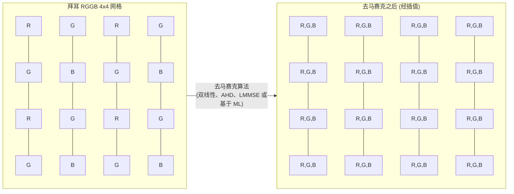
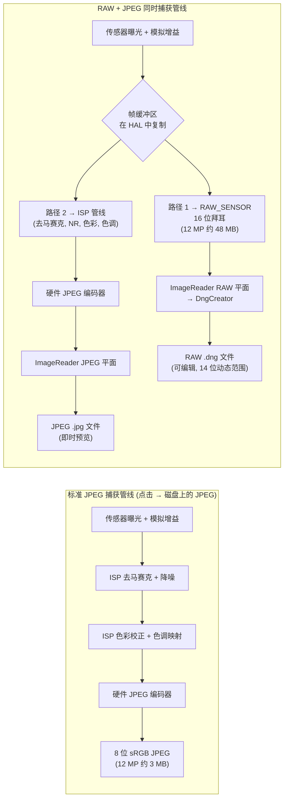

---     
sidebar_position: 18
title: "第 18 章：RAW 摄影"
description: "在 Android Camera2 API 中掌握 RAW_SENSOR 格式、使用 DngCreator 创建 DNG 文件、拜耳模式以及同时进行的 RAW+JPEG 捕获"
keywords: [Android Camera2, RAW 摄影, RAW_SENSOR, DngCreator, DNG, 拜耳模式, RGGB, JPEG_R, 相机元数据]
---

# 第 18 章：RAW 摄影

专业的移动摄影要求的不仅仅是 Android 的 ISP（图像信号处理器）默认生成的处理后的 JPEG。当你捕获 JPEG 时，传感器的原始数据已经过过滤、插值、色彩校正、降噪和色调映射——这破坏了摄影师赖以生存的大部分后期空间。Camera2 API 让你能够直接访问 **RAW_SENSOR** 格式：来自传感器的、未经 ISP 干扰的 16 位原始拜耳模式数据。结合 **DngCreator**，Android 框架提供了生成符合标准的 Adobe DNG（数字负片）文件所需的一切，这些文件可以直接在 Lightroom、Capture One、Photoshop 及所有专业 RAW 编辑器中打开。

本章建立在项目内部参考文档 *RAW / DngCreator* 章节的研究基础之上，并扩展了你可以直接插入到自己应用中的实际代码。你可以在 **Android Camera Parameters** 应用中查看每台受支持设备的这些性能枚举——该应用也可在 [Google Play 商店](https://play.google.com/store/apps/details?id=com.zoozooll.cameraparameters) 下载——它会报告最大的 RAW 尺寸、可用的 RAW 变体（RAW10, RAW12, RAW14）以及每个相机 ID 的 DngCreator 元数据是否填充完整。

## 为什么选择 RAW？ISP 处理的代价

在深入 API 细节之前，准确理解 ISP 在生成 JPEG 时到底做了什么，以及为什么要绕过它，是至关重要的。一个典型的智能手机 ISP 管线会按顺序执行以下阶段：

1. **黑电平钳位 (Black level clamping)** — 减去传感器的暗电流基准
2. **镜头遮蔽校正 (Lens shading correction)** — 使用逐像素增益图消除暗角
3. **去马赛克 (Demosaicing)** — 将每像素只有一种颜色的拜耳网格插值为完整的 RGB 图像
4. **降噪 (Noise reduction)** — 应用空间/时域滤波，这会在擦除噪声的同时抹去精细细节
5. **色彩校正 (Color correction)** — 应用 3×3 矩阵将传感器色彩空间映射到 sRGB
6. **伽马 / 色调映射 (Gamma / tone mapping)** — 将场景线性的 14 档动态范围压缩成非线性的 8 位曲线
7. **边缘增强 (Edge enhancement)** — 进行锐化以补偿光学低通滤镜
8. **JPEG 压缩** — 应用有损色度抽样（通常是 4:2:0）和量化

这种管线的问题在于每个阶段都是**不可逆的**，且是针对消费者*预览*而非专业*后期*而调优的。JPEG 将高光限制在 100:1 的对比度，并将传感器的 14 位动态范围包裹进 8 位中——因此当你在后期拉升 2 档阴影时，你得到的是断层而非细节。RAW 保留了完整的线性传感器输出，支持 4–6 档的阴影/高光恢复，以及不会引入色彩伪影的自定义白平衡偏移。

```mermaid
flowchart TD
    subgraph ISP["ISP 处理管线 (JPEG 路径)"]
        S1[传感器 RAW 数据] --> S2[黑电平钳位]
        S2 --> S3[镜头遮蔽校正]
        S3 --> S4[去马赛克]
        S4 --> S5[降噪]
        S5 --> S6[色彩校正]
        S6 --> S7[伽马 / 色调映射]
        S7 --> S8[边缘增强]
        S8 --> S9[JPEG 压缩]
        S9 --> S10["8 位 sRGB JPEG<br/>(≈6 档可用动态范围)"]
    end

    subgraph RAW["RAW 路径 (无 ISP 处理)"]
        R1[传感器 RAW 数据] --> R2["16 位线性拜耳模式<br/>(10–14 档可用动态范围)"]
        R2 --> R3["DngCreator 写入<br/>元数据 + 像素数据"]
        R3 --> R4[".dng 文件<br/>可在 Lightroom/PS 中编辑"]
    end
```



通过上图视觉化对比两条路径：JPEG 路径在每一步都会剔除数据，而 RAW 路径保留了完整的传感器载荷。代价是 RAW 文件**无法直接显示**——它们需要单独的渲染传递（Lightroom 中的"显影"步骤）来解释拜耳网格并转换为 sRGB 或 Rec.2020 等色彩空间。

## 拜耳色彩滤镜阵列 (CFA)

RAW 数据不是 RGB。传感器上的每个光敏点仅记录**一种颜色**——红、绿或蓝——因为硅光电二极管本身是色盲的，只能测量光子计数（亮度）。为了重构颜色，制造商在传感器上沉积了**色彩滤镜阵列 (CFA)**，由此产生的单通道网格以其发明者命名：拜耳模式 (Bayer pattern)。

Android 设备中存在四种常见的 CFA 布局，由左上角 2×2 瓦片的顺序标识：

| 模式 | 瓦片布局 | 典型用例 |
|---------|-------------|------------------|
| **RGGB** | `R G / G B` | 多数智能手机 (三星, 索尼 Exmor RS 默认) |
| **BGGR** | `B G / G R` | 某些小米/一加设备中的索尼 IMX 传感器 |
| **GRBG** | `G R / B G` | 某些豪威 (OmniVision) 传感器 |
| **GBRG** | `G B / R G` | 罕见；见于某些摩托罗拉中端设备 |

拜耳网格最显著的特征是 **50% 的像素是绿色**，而红色和蓝色各占 25%。这不是任意的选择——人眼的视觉亮度响应在绿色波长（约 555 nm）处达到峰值，因此将两倍的样本分配给绿色可以最大限度地提高感知锐度和噪声性能。任何生成的 JPEG 中的亮度通道约有 60% 派生自绿色光敏点，因此绿色采样密度直接转化为解析出的细节。



上面的去马赛克图块 (P11–P44) 展示了每个像素是如何重建的：一个 `R` 光敏点通过插值使用其邻居的 `G` 和 `B` 值，反之亦然。这种插值是 JPEG 管线中导致图像变软的最大来源——也正是为什么你想在后期制作中自己完成这一步的原因。现代 AI 去马赛克（如 Lightroom 的 AI 增强、Topaz DeNoise AI 等）可以提供比智能手机实时硬件 ISP 更锐利的结果。

## RAW_SENSOR 格式及其压缩变体 (RAW10 / RAW12 / RAW14)

Android 规范的 RAW 格式标识符是 `ImageFormat.RAW_SENSOR`，它在 `Image.getPlanes()` 返回的 `Plane` 中枚举为每像素 16 位的缓冲区。然而，*有效*位深是设备相关的，并通过 `CameraCharacteristics.SENSOR_INFO_BIT_DEPTH` 报告——超出传感器实际 ADC 分辨率的高位会被补零。

大多数当今的智能手机使用三种压缩 RAW 变体之一，它们通过 `StreamConfigurationMap.getOutputSizes()` 暴露，并带有专门的格式常量：

| 格式常量 | 位/样本 | 存储布局 | 典型传感器世代 |
|-----------------|-------------|----------------|---------------------------|
| `RAW10`         | 10          | 压缩：每 5 个字节存储 4 个样本 (MSB 对齐) | 中端 2019–2022 传感器 (如 IMX586, IMX682) |
| `RAW12`         | 12          | 压缩：每 3 个字节存储 2 个样本 | 旗舰 2021–2024 (如 IMX800, IMX989 一英寸级) |
| `RAW14`         | 14          | 16 位补齐 (MSB 对齐) | 专业级 / 一英寸以上传感器 (带 DOL-HDR 的 IMX989) |

压缩格式是**你必须使用具有像素步长意识的 `Buffer.getByte()` / `Buffer.getShort()`**，而不是将 RAW 缓冲区视为扁平的 short[] 数组的原因——RAW10 和 RAW12 的样本会跨越字节边界，需要位偏移才能提取。如果你直接传递 `Image` 对象，`DngCreator` 会透明地处理所有这些压缩/解压，这也是推荐的方法。

## DNG：Adobe 数字负片标准 1.4

为什么要编写 `.dng` 文件而不是像 `.arw` (索尼) 或 `.cr3` (佳能) 这样的专有格式？因为 **DNG 是唯一的通用 RAW 格式**，由 ISO 12234-2 发布，并被所有专业照片工具链接受。DNG v1.4（Android 针对的版本）规定了：

- 兼容 TIFF/EP 的容器（小端序 IFD 结构）
- 用于拜耳模式 (CFA)、黑电平和色彩矩阵的强制性 TIFF 标签
- 用于双光源配置文件的可选 `ColorMatrix2` / `CalibrationIlluminant2`
- 用于逐像素平场校正的可选镜头遮蔽图 (标签 0xC618)
- 用于 OEM 特定校准数据的可选 "makernotes" IFD

没有这些元数据，RAW 缓冲区只是一个无标签的数字网格——没有 RAW 编辑器能正确渲染它。Android 的 `android.hardware.camera2` 包中的 `DngCreator` 类专门用于从 `CameraCharacteristics` 和 `CaptureResult` 中**自动填充所有必需的 DNG 1.4 元数据**，这意味着你的应用不需要为每台设备附带传感器校准数据。

`DngCreator` 写入的具体元数据字段包括：

| DNG 标签 | 来源 | 用途 |
|---------|--------|---------|
| **BlackLevel** (SENSOR_BLACK_LEVEL_PATTERN) | `CameraCharacteristics` | 4 元素的逐通道暗电流基准 |
| **ColorMatrix1 / ColorMatrix2** (SENSOR_COLOR_TRANSFORM1 / 2) | `CameraCharacteristics` | 在光源 A (D65) 下将传感器 RGB → XYZ 的 3×3 矩阵映射 |
| **CalibrationIlluminant1 / 2** | `CameraCharacteristics` | 标准光源枚举 (17 = 标准 A, 21 = D65) |
| **ForwardMatrix1 / ForwardMatrix2** (SENSOR_FORWARD_MATRIX1 / 2) | `CameraCharacteristics` | XYZ → 传感器 RGB 的逆变换 |
| **NeutralColorPoint** (SENSOR_NEUTRAL_COLOR_POINT) | `CameraCharacteristics` | 原生白平衡 (r/g, b/g 比率) |
| **LensShadingMap** (STATISTICS_LENS_SHADING_MAP) | `CaptureResult` | 用于消除暗角的 4 通道逐通道增益网格 |
| **CFA Pattern 2** | `CameraCharacteristics.SENSOR_INFO_COLOR_FILTER_ARRANGEMENT` | 拜耳切片编码 |
| **BaselineExposure** | `SENSOR_REFERENCE_ILLUMINANT1` | 渲染时应用的默认曝光偏移 |

此列表直接摘自项目研究文档中的 *RAW / DngCreator* 规范。如果 Camera2 API 将其中任何字段报告为 `null`，`DngCreator` 仍将生成有效的 DNG，但产生的文件在后期可能需要手动校准。你可以使用 **Android Camera Parameters** 应用检查每个相机 ID 填充了哪些字段。

## 设置同时进行的 RAW + JPEG 捕获

RAW 捕获的正确工作流程是**在单个 `CaptureRequest` 中使用多个输出目标**——这保证了 RAW 缓冲区和 JPEG 来自*完全相同的帧*（相同的时间戳，相同的传感器曝光），这对于大多数摄影师期望的 RAW+JPEG 备份工作流至关重要。尝试两次连续捕获会在曝光、AF 和 AWB 方面引入帧间差异。

### 第 1 步：查询性能和最大 RAW 尺寸

```kotlin
import android.hardware.camera2.CameraCharacteristics
import android.hardware.camera2.params.StreamConfigurationMap
import android.util.Size
import android.graphics.ImageFormat

fun getRawCapabilities(cameraId: String,
                       characteristics: CameraCharacteristics): Pair<Boolean, Size?> {
    val caps = characteristics.get(
        CameraCharacteristics.REQUEST_AVAILABLE_CAPABILITIES
    ) ?: intArrayOf()
    val supportsRaw = caps.contains(
        CameraCharacteristics.REQUEST_AVAILABLE_CAPABILITIES_RAW
    )
    if (!supportsRaw) return Pair(false, null)

    val configMap: StreamConfigurationMap? =
        characteristics.get(CameraCharacteristics.SCALER_STREAM_CONFIGURATION_MAP)

    val rawSizes = configMap?.getOutputSizes(ImageFormat.RAW_SENSOR)
        ?: emptyArray()
    val maxRawSize = rawSizes.maxByOrNull { it.width * it.height }

    return Pair(true, maxRawSize)
}
```

`REQUEST_AVAILABLE_CAPABILITIES_RAW` 是强制性的门槛——如果未设置，HAL 将拒绝任何 RAW_SENSOR 输出，且尝试创建具有该格式的 `ImageReader` 将抛出 `IllegalArgumentException`。**Android Camera Parameters** 应用在其主仪表板上按相机 ID 列出了此项性能。

### 第 2 步：创建双 ImageReader (RAW + JPEG)

```kotlin
import android.media.ImageReader
import android.graphics.ImageFormat

private var rawImageReader: ImageReader? = null
private var jpegImageReader: ImageReader? = null

fun setupDualImageReaders(rawSize: Size, jpegSize: Size) {
    rawImageReader = ImageReader.newInstance(
        rawSize.width,
        rawSize.height,
        ImageFormat.RAW_SENSOR,
        5 // 获取缓冲区深度：>= 2, 5 为连拍预留空间
    ).apply {
        setOnImageAvailableListener(
            OnRawImageAvailableListener(),
            backgroundHandler
        )
    }

    jpegImageReader = ImageReader.newInstance(
        jpegSize.width,
        jpegSize.height,
        ImageFormat.JPEG,
        2
    ).apply {
        setOnImageAvailableListener(
            OnJpegImageAvailableListener(),
            backgroundHandler
        )
    }
}
```

RAW 的 `maxImages` 缓冲区深度应该更大 (5)，因为 RAW 缓冲区是 JPEG 带宽的 2–4 倍，且 HAL 可能在磁盘写入器赶上之前交付 2–3 帧。RAW 缓冲区空间耗尽会导致静默掉帧且没有错误回调。

### 第 3 步：创建包含两个 Surface 的 CaptureSession 并发出多目标捕获

```kotlin
import android.hardware.camera2.CameraDevice
import android.hardware.camera2.CaptureRequest
import android.view.Surface

lateinit var cameraDevice: CameraDevice

fun createCaptureSessionAndCapture(
    rawSurface: Surface,
    jpegSurface: Surface,
    previewSurface: Surface
) {
    val outputSurfaces = listOf(previewSurface, rawSurface, jpegSurface)

    cameraDevice.createCaptureSession(
        outputSurfaces,
        object : CameraCaptureSession.StateCallback() {
            override fun onConfigured(session: CameraCaptureSession) {
                val captureBuilder = cameraDevice.createCaptureRequest(
                    CameraDevice.TEMPLATE_STILL_CAPTURE
                ).apply {
                    addTarget(previewSurface)
                    addTarget(rawSurface)
                    addTarget(jpegSurface)

                    set(CaptureRequest.CONTROL_AF_MODE,
                        CaptureRequest.CONTROL_AF_MODE_CONTINUOUS_PICTURE)
                    set(CaptureRequest.CONTROL_AE_MODE,
                        CaptureRequest.CONTROL_AE_MODE_ON)
                    set(CaptureRequest.CONTROL_AWB_MODE,
                        CaptureRequest.CONTROL_AWB_MODE_OFF) // 在 RAW 模式下锁定白平衡！
                }

                session.capture(
                    captureBuilder.build(),
                    RawCaptureCallback(),
                    backgroundHandler
                )
            }
            override fun onConfigureFailed(session: CameraCaptureSession) = Unit
        },
        backgroundHandler
    )
}
```

这里有三个细节是不可逾越的：

1. **RAW 捕获必须锁定 AWB (`CONTROL_AWB_MODE_OFF`)。** 如果开启 AWB，HAL 会在连拍中途应用 RGB 增益渐变，这意味着每个 RAW 帧都有不同的原生白平衡——这破坏了 RAW 编辑器应用统一配置文件的能力。请改用 `CaptureResult.SENSOR_NEUTRAL_COLOR_POINT` 在后期推导正确的白平衡。

2. **使用 `TEMPLATE_STILL_CAPTURE`** 作为基础模板。它将传感器配置为最高质量的读取模式，并禁用了 HAL 可能会注入的针对预览的降噪。

3. **所有三个目标（预览、RAW、JPEG）都在一个 `CaptureRequest` 中。** HAL 保证了时间上的一致交付。

### 第 4 步：使用 DngCreator 写入 DNG 文件

`OnImageAvailableListener` 回调接收 `Image` 对象，从中可以直接访问 RAW 像素数据。将 `Image` **和**匹配的 `CaptureResult` 连同用于打开相机的原始 `CameraCharacteristics` 一起传递给 `DngCreator` —— 为了正确填充所有 DNG 1.4 元数据，这一组合是必需的。

```kotlin
import android.hardware.camera2.CameraCharacteristics
import android.hardware.camera2.CaptureResult
import android.hardware.camera2.DngCreator
import android.media.Image
import java.io.File
import java.io.FileOutputStream
import java.io.IOException

inner class OnRawImageAvailableListener : ImageReader.OnImageAvailableListener {
    private val pendingDngWrites =
        HashMap<Long, CaptureResult>() // 时间戳 → CaptureResult

    fun registerCaptureResult(timestamp: Long, result: CaptureResult) {
        pendingDngWrites[timestamp] = result
    }

    override fun onImageAvailable(reader: ImageReader) {
        var image: Image? = null
        try {
            image = reader.acquireLatestImage() ?: return
            val timestamp = image.timestamp

            val captureResult = pendingDngWrites.remove(timestamp) ?: return
            val characteristics = latestCameraCharacteristics ?: return

            val dngFile = File(
                getExternalFilesDir(null),
                "RAW_${System.currentTimeMillis()}.dng"
            )

            FileOutputStream(dngFile).use { fos ->
                val dngCreator = DngCreator(characteristics, captureResult)
                dngCreator.writeByteBuffer(
                    fos,
                    image.width,
                    image.height,
                    image.planes[0].buffer,
                    0 // 填充，对于 RAW_SENSOR 始终为 0
                )
            }

        } catch (e: IOException) {
            Log.e(TAG, "写入 DNG 文件失败", e)
        } catch (e: IllegalStateException) {
            Log.e(TAG, "DngCreator 拒绝元数据 (缺少必填字段)", e)
        } finally {
            image?.close() // 关键：绝对不要泄漏 Image 引用
        }
    }
}
```

`DngCreator` 构造函数恰好接收两个参数：
- **`CameraCharacteristics`** — 静态、逐相机的字段（黑电平、色彩矩阵、CFA 模式、中性色点、光源 1 和 2）
- **`CaptureResult`** — 逐帧、动态的字段（传感器曝光、ISO、镜头遮蔽图、AF 镜头位置）

如果其中任何一个为 `null`，或者缺少必填的元数据字段（例如某些廉价设备对 `SENSOR_COLOR_TRANSFORM1` 报告 `null`），构造函数将在构造时（而非 `writeByteBuffer` 时）抛出 `IllegalArgumentException`。这就是为什么 **Android Camera Parameters** 应用显式报告每个 DNG 相关字段的原因：开发者可以预先过滤设备，以避免在 HAL 实现不完整的设备上发生崩溃。

`pendingDngWrites` 时间戳映射解决了一个真实的并发问题：`CaptureResult.CaptureCallback.onCaptureCompleted()` 的触发时机可能**早于或晚于** `OnImageAvailableListener.onImageAvailable()` (取决于 HAL)。通过 `image.timestamp` == `CaptureResult.SENSOR_TIMESTAMP` 进行匹配，可以保证正确的元数据与正确的像素缓冲区配对。

## 处理管线对比 (详细 Mermaid 图)



此图的关键启示在于**帧复制节点 G**：HAL 从传感器读取一帧，然后将未经修改的副本路由到 RAW 输出，同时将*同一*副本馈入 ISP 进行 JPEG 编码。这保证了帧的一致性，且无需使传感器读取带宽翻倍。

## 性能考量与实践限制

将 12–48 MB 的 DNG 文件写入闪存需要可测量的时间：
- UFS 3.1 存储：~250 MB/s 顺序写入 → 12 MP DNG (~48 MB) 耗时约 190 ms
- eMMC 5.1 存储：~120 MB/s 顺序写入 → 同一文件耗时约 400 ms

这意味着你**不能在 UI 线程上阻塞 DNG 写入** — 务必在后台线程/Handler 上运行 `writeByteBuffer`，并务必在 `finally` 块中关闭 `Image` 以避免 HAL 缓冲区匮乏。

另一个重要限制：并不是所有设备都支持在同一会话中同时使用 RAW + JPEG，即使设置了 `CAPABILITIES_RAW` 也是如此。正确的验证方法是使用包含两个 Surface 的列表调用 `StreamConfigurationMap.isOutputSupportedFor(surfaceList)`。如果返回 `false`，则回退到仅 RAW 的会话。

## 小结

本章涵盖了 Android Camera2 中完整的端到端 RAW 摄影工作流程：

- **RAW_SENSOR 格式**提供来自传感器的未经处理的 16 位拜耳网格，绕过了每一个 ISP 处理阶段。
- **拜耳模式** (RGGB, BGGR, GRBG, GBRG) 为绿色分配了 50% 的光敏点，用于针对人眼视觉优化的亮度采样。
- **压缩变体** — RAW10, RAW12, RAW14 — 以原生 ADC 位深存储样本；DngCreator 会透明地解压它们。
- **DNG v1.4** 是通用的 RAW 容器。`DngCreator(characteristics, result).writeByteBuffer(...)` 填充了所有必需的元数据：黑电平、色彩矩阵、镜头遮蔽图、中性色点以及校准光源 1 和 2。
- **多目标 CaptureRequest** 将同一帧路由到 RAW 和 JPEG ImageReader，保证了 RAW+JPEG 工作流中的帧一致性。
- 由于回调触发顺序取决于 HAL，因此需要在 `CaptureResult` 和 `Image` 之间进行**时间戳匹配**。

## 下一章

在下一章中，我们将从静态摄影转向视频：**第 19 章：高速视频**，我们将使用 `CameraConstrainedHighSpeedCaptureSession` 实现 120 fps（4 倍慢动作）和 240 fps（8 倍慢动作）拍摄。你将了解为什么高速会话需要 `createHighSpeedRequestList` 而非单独的 CaptureRequest，以及 HAL 的专用高速管线如何绕过正常预览路径，交付原本会令 CPU 不堪重负的帧率。

你可以通过安装 **Android Camera Parameters** 应用来验证你设备的 RAW 性能、最大 RAW 尺寸以及 DngCreator 元数据的完整性 —— 并向开源 [GitHub 仓库](https://github.com/zoozooll/AndroidCameraParameters) 提交设备报告，帮助其他开发者了解哪些设备支持专业的 RAW 工作流。
