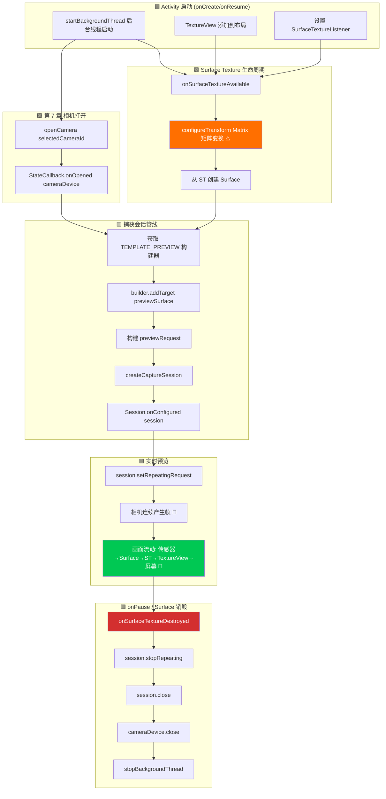

这是你一直期待的章节。在经过三章的架构搭建（权限、线程、CameraManager、枚举、打开/关闭生命周期）后，你终于要**在 Android 设备屏幕上看到实时渲染的相机输出了**。预览是相机应用的核心——它是用户在点击快门前观察画面、检查对焦和验证曝光的窗口。做得好，它就是流畅响应的相机体验；做得不好，应用就会显得卡顿且难以使用。

如需查看处理数百种设备边缘情况的参考预览实现，请参阅 **Android Camera Parameters** 应用（[GitHub](https://github.com/zoozooll/AndroidCameraParameters) / [Google Play](https://play.google.com/store/apps/details?id=com.minininja.cameraparams)）中的预览屏幕。其预览管线包括感知朝向的变换、多分辨率输出 Surface 和平滑的帧率节流——所有这些都建立在我们此处涵盖的基础组件之上。

## 预览管线：组件概览

在深入代码之前，让我们先梳理一下单帧预览从相机传感器到手机屏幕的逻辑旅程。每一帧都会经过五层：

```
相机传感器 → CameraDevice 管线 → Surface (BufferQueue) → SurfaceTexture → TextureView → 显示屏
```

每一层都扮演着特定的、不可替代的角色。跳过或忽略其中任何一层都会导致黑屏、纵横比失调或画面撕裂。让我们定义每一个组件：

### 1. Surface — 图像目标缓冲区

`Surface` 是 Camera2 API 对**处理后图像帧目标**的通用概念。在底层，Surface 包装了一个 Android `BufferQueue`：一个由系统合成器 (SurfaceFlinger) 管理的图形缓冲区环形队列（通常深度为 3–5 个缓冲区）。当 Camera2 向 Surface "渲染一帧"时，它从队列中取出一个空缓冲区，填入像素数据，然后将其放回队列供消费者使用。

任何能消耗图形缓冲区的组件都可以暴露一个 `Surface`。最常见的消费者包括：
- **SurfaceTexture** → 馈送给 `TextureView`（用于屏幕预览——本章内容）
- **MediaRecorder/MediaCodec 的 Surface** → 视频编码（本系列不涵盖）
- **ImageReader Surface** → 供 CPU 访问的用于 JPEG/RAW 拍摄的 `Image` 对象（第 9 章）

### 2. SurfaceTexture — GPU 到 GPU 的桥梁

`SurfaceTexture` 是一个魔法类，它将原始的相机帧流转换为 GPU 可以采样并渲染的纹理。它是 Surface 的 BufferQueue 的消费者端，但它并不将缓冲区交给 CPU，而是将其转换为 OpenGL ES `GL_TEXTURE_EXTERNAL_OES` 纹理。这使得 `TextureView` 可以使用标准 GPU 渲染将相机帧合成到视图层级中——无需 CPU 拷贝，因此轻而易举地实现 60+ FPS 的预览。

你可以通过以下方式获取 `SurfaceTexture` 的 `Surface`：
```kotlin
val surface = Surface(surfaceTexture)
```

### 3. TextureView — 屏幕上的窗口

`TextureView` 是一个 `View` 子类，可以显示 `SurfaceTexture` 的内容。它是旧版 `SurfaceView` 的现代继承者，是 Camera2 预览的推荐选择，原因有三：
- 它的行为类似于正常的 View（可以进行动画处理、变换、透明混合、放置在可滚动容器中）。
- 它不强制 Activity 使用透明窗口（不像 SurfaceView 会在视图层级中打一个"洞"）。
- 它的 `SurfaceTextureListener` 提供了精确的生命周期回调，告知 Surface 何时创建、销毁或调整大小。

为了通过回调访问底层的 SurfaceTexture，`TextureView` 暴露了 `setSurfaceTextureListener()`，包含四个回调：
- `onSurfaceTextureAvailable(surfaceTexture, width, height)` — Surface 已准备好接收帧（在视图布局完成后触发一次）。
- `onSurfaceTextureSizeChanged(surfaceTexture, width, height)` — Surface 尺寸发生变化（例如设备旋转）。
- `onSurfaceTextureDestroyed(surfaceTexture)` — 即将被销毁；我们必须在此返回前停止预览。
- `onSurfaceTextureUpdated(surfaceTexture)` — **每一新帧**都会触发（可用于驱动人脸追踪覆盖层等）。

### 4. CameraCaptureSession — 已配置的管线

在 `CameraDevice` 产生任何帧之前，你必须创建一个 `CameraCaptureSession`。会话是**相机管线将写入的所有输出 Surface 的配置**。你可以将其视为对相机 ISP（图像信号处理器）进行"接管"，将其输出路由到一个或多个接收器。对于仅预览模式，会话只有一个 Surface（TextureView 的）。当我们要在第 9 章添加照片拍摄时，会话将有两个 Surface：预览 + `ImageReader`。

关键规则：
- 会话通过 `CameraDevice.createCaptureSession(outputSurfaces, stateCallback, handler)` 创建。
- 会话仅在 `StateCallback.onConfigured(session)` 触发**后**才可用。
- 一个 `CameraDevice` **一次只能有一个活动会话**。创建新会话会关闭前一个。
- 会话在其生命周期内拥有*所有*输出；添加新 Surface（例如突然决定录制视频）需要拆除旧会话并创建一个包含所有 Surface（预览 + 录制器）的新会话。

### 5. 重复捕获请求 (TEMPLATE_PREVIEW)

配置好会话后，连续预览是如何实现的？Camera2 是一个请求驱动的 API——每一帧都是提交给会话的一个 `CaptureRequest`。对于预览，我们提交**一个请求并将其标记为重复 (repeating)**：相机硬件将不断重复运行该请求（使用相同的传感器设置、目标和 3A 状态），以管线允许的最快速度（通常 30–120 FPS）产生画面。

通过以下方式提交重复请求：
```kotlin
session.setRepeatingRequest(previewRequest, captureCallback, backgroundHandler)
```

预览模板是 `CameraDevice.TEMPLATE_PREVIEW`。Camera2 提供了几种预构建模板，它们会根据用例适当地配置数百个低级参数（曝光、帧率范围、3A 模式、降噪等）。对于预览，`TEMPLATE_PREVIEW` 针对**低延迟和平滑帧率**进行了优化，即使这意味着与 `TEMPLATE_STILL_CAPTURE`（第 9 章用于照片）相比，传感器的动态范围会略有降低。

## 端到端预览流程图

下面的流程图显示了所有这些组件是如何连接的。阅读代码时请仔细对照——每个方块都对应一个真实的函数调用。



橙色高亮方块 (`configureTransform`) 和绿色高亮方块 (实时预览) 是两个最关键的步骤。跳过 `configureTransform`，你的预览将被拉伸、旋转或挤压。如果正确连接了其他所有部分但未能调用 `setRepeatingRequest`，屏幕将保持黑色且不会记录任何错误。

## 第 1 步：将 TextureView 添加到布局 XML

首先，创建或更新 `app/src/main/res/layout/activity_main.xml` 以包含全屏 `TextureView`。我们还将添加一个 `TextView` 覆盖层作为状态指示器，以便我们可以看到预览尺寸。

```xml
<?xml version="1.0" encoding="utf-8"?>
<FrameLayout xmlns:android="http://schemas.android.com/apk/res/android"
    xmlns:tools="http://schemas.android.com/tools"
    android:layout_width="match_parent"
    android:layout_height="match_parent">

    <TextureView
        android:id="@+id/textureView"
        android:layout_width="match_parent"
        android:layout_height="match_parent"
        android:layout_gravity="center" />

    <TextView
        android:id="@+id/statusTextView"
        android:layout_width="wrap_content"
        android:layout_height="wrap_content"
        android:layout_gravity="top|center_horizontal"
        android:layout_marginTop="16dp"
        android:background="#80000000"
        android:padding="8dp"
        android:textColor="#FFFFFFFF"
        android:textSize="12sp"
        tools:text="正在初始化相机..." />

</FrameLayout>
```

为什么要用 `FrameLayout` 作为根视图？因为预览是一个全屏层，而 `FrameLayout` 会按 Z 轴顺序堆叠子视图（后添加的子视图绘在顶部）。稍后我们将添加一个快门按钮覆盖层。`TextureView` 在两个维度上都使用 `match_parent`——但别担心，我们稍后会使用 `configureTransform` 进行正确的黑边填充处理（letterboxing），这样即使视图填满屏幕，像素本身也永远不会被拉伸。

## 第 2 步：configureTransform — 正确预览纵横比的秘诀

如果你什么都不做，只是将画面传输到全屏 TextureView，预览将会被**拉伸**。为什么？因为相机传感器具有固定的纵横比（静态拍摄几乎总是 4:3，视频模式有时是 16:9），而手机屏幕具有不同的纵横比（现代旗舰机通常约为 20:9）。如果相机输出 4032×3024 (4:3) 的预览帧，而 TextureView 将其拉伸到 1080×2400 (20:9)，人脸看起来就会又瘦又长。

解决方案是 **`configureTransform(viewWidth: Int, viewHeight: Int)`**：一个计算 `Matrix`（旋转 + 中心裁剪缩放）并将其应用于 TextureView 的方法。该矩阵做三件事：
1. 根据设备相对于相机传感器自然方向旋转的角度，**旋转**图像。
2. **缩放**图像，使其在保持纵横比的同时填满整个 TextureView（中心裁剪风格，或者如果你愿意，也可以留黑边）。
3. **重新居中**缩放/旋转后的图像，使其位于视图正中。

这是官方 Android Camera2 示例中最常被复制的函数——每个开发者都需要它，而且很容易出错。以下是标准版本：

```kotlin
/**
 * 配置 `textureView` 所需的 Matrix 变换。
 * 此方法应在确定相机预览尺寸且 `textureView` 尺寸固定后调用。
 *
 * @param viewWidth  `textureView` 的宽度
 * @param viewHeight `textureView` 的高度
 * @param previewSize 相机选定的预览尺寸 (width, height)
 * @param sensorOrientationDegrees 相机的 SENSOR_ORIENTATION 特性
 * @param deviceDisplayRotationDegrees 屏幕相对于自然方向的旋转角度 (0/90/180/270)
 */
private fun configureTransform(
    viewWidth: Int,
    viewHeight: Int,
    previewSize: android.util.Size,
    sensorOrientationDegrees: Int,
    deviceDisplayRotationDegrees: Int
) {
    val rotation = when (deviceDisplayRotationDegrees) {
        android.view.Surface.ROTATION_0 -> 0
        android.view.Surface.ROTATION_90 -> 90
        android.view.Surface.ROTATION_180 -> 180
        android.view.Surface.ROTATION_270 -> 270
        else -> return
    }

    val matrix = android.graphics.Matrix()
    val viewRect = android.graphics.RectF(0f, 0f, viewWidth.toFloat(), viewHeight.toFloat())
    val bufferRect = android.graphics.RectF(
        0f,
        0f,
        previewSize.height.toFloat(),
        previewSize.width.toFloat()
    )
    val centerX = viewRect.centerX()
    val centerY = viewRect.centerY()

    // 第 1 步：考虑设备相对于传感器方向的旋转
    if (Surface.ROTATION_90 == rotation || Surface.ROTATION_270 == rotation) {
        bufferRect.offset(centerX - bufferRect.centerX(), centerY - bufferRect.centerY())
        matrix.setRectToRect(viewRect, bufferRect, android.graphics.Matrix.ScaleToFit.FILL)
        val scale = maxOf(
            viewHeight.toFloat() / previewSize.height,
            viewWidth.toFloat() / previewSize.width
        )
        matrix.postScale(scale, scale, centerX, centerY)
        matrix.postRotate(
            (90 * (rotation - 2)).toFloat(),
            centerX,
            centerY
        )
    } else if (Surface.ROTATION_180 == rotation) {
        matrix.postRotate(180f, centerX, centerY)
    }

    // 第 2 步：还要考虑传感器相对于设备的安装方式
    val relativeRotation = (sensorOrientationDegrees - rotation + 360) % 360
    if (relativeRotation != 0) {
        matrix.postRotate(relativeRotation.toFloat(), centerX, centerY)
    }

    textureView.setTransform(matrix)
}
```

一个关键细节：`previewSize` 是相机的输出尺寸，按**传感器方向**报告为 (width, height)。TextureView 的维度按**显示方向**计算。使用交换了宽/高的 RectF 技巧（`bufferRect` 使用 `previewSize.height` 作为宽度，反之亦然）解决了这种传感器与显示器坐标的翻转。

你需要两项 CameraCharacteristics 信息来调用此方法：
- `SENSOR_ORIENTATION` — 传感器相对于设备自然方向旋转的角度。对于后置相机，这几乎总是 90°。对于前置相机，通常是 270°（以便图像正确镜像）。在发现阶段为每个相机读取一次。
- 屏幕旋转角度 — 来自 `(getSystemService(Context.WINDOW_SERVICE) as WindowManager).defaultDisplay.rotation`（在较新的 API 上使用 `display?.rotation`）。

## 第 3 步：从 SCALER_STREAM_CONFIGURATION_MAP 中选择预览尺寸

在编写 `configureTransform` 或创建会话之前，我们需要知道相机可以输出什么预览尺寸。对于每个相机，`CameraCharacteristics.SCALER_STREAM_CONFIGURATION_MAP` 会返回一个 `StreamConfigurationMap`，其中包含相机可以产出的所有有效（格式，尺寸）对。对于 `SurfaceTexture` 上的预览，我们针对类 `SurfaceTexture::class.java` 查询输出尺寸：

```kotlin
private fun chooseOptimalPreviewSize(
    characteristics: CameraCharacteristics,
    maxWidth: Int,
    maxHeight: Int,
    targetAspectRatio: Double
): android.util.Size {
    val map = characteristics.get(CameraCharacteristics.SCALER_STREAM_CONFIGURATION_MAP)
        ?: throw IllegalStateException("无可用流配置映射")

    // SurfaceTexture 输出（预览类）支持的所有尺寸
    val choices = map.getOutputSizes(SurfaceTexture::class.java).toList()

    // 优先选择匹配纵横比的尺寸，然后是符合最大维度的尺寸，
    // 最后在剩余尺寸中挑选最大的（画质最好的）。
    val acceptable = choices.filter {
        it.width <= maxWidth
            && it.height <= maxHeight
            && Math.abs(it.width.toDouble() / it.height - targetAspectRatio) < 0.02
    }

    val chosen = acceptable.ifEmpty { choices }
        .maxByOrNull { it.width * it.height }!!

    Log.d(TAG, "选定的预览尺寸: ${chosen.width}x${chosen.height} " +
        "(来自 ${choices.size} 个选项, 最大允许尺寸=${maxWidth}x${maxHeight})")
    return chosen
}
```

常识性的默认参数：`maxWidth = 1920`, `maxHeight = 1080`, `targetAspectRatio = textureView.width.toDouble() / textureView.height`。预览 Surface 不需要 4K——1080p 足以在手机屏幕上取景，耗电更少，并能保持较低的管线延迟。

## 第 4 步：第 8 章完整代码 — 实时预览

以下是集成了本章所有部分的完整 `MainActivity.kt`：基于布局的 `TextureView`、`SurfaceTextureListener`、尺寸选择、`configureTransform`、`CameraCaptureSession` 创建，以及最重要的 `setRepeatingRequest(TEMPLATE_PREVIEW)`。

```kotlin
package com.example.camera2tutorial

import android.Manifest
import android.content.Context
import android.content.pm.PackageManager
import android.graphics.Matrix
import android.graphics.RectF
import android.graphics.SurfaceTexture
import android.hardware.camera2.CameraAccessException
import android.hardware.camera2.CameraCharacteristics
import android.hardware.camera2.CameraCaptureSession
import android.hardware.camera2.CameraDevice
import android.hardware.camera2.CameraManager
import android.hardware.camera2.CaptureRequest
import android.hardware.camera2.params.StreamConfigurationMap
import android.os.Bundle
import android.os.Handler
import android.os.HandlerThread
import android.util.Log
import android.util.Size
import android.view.Surface
import android.view.TextureView
import android.view.WindowManager
import android.widget.TextView
import android.widget.Toast
import androidx.appcompat.app.AppCompatActivity
import androidx.core.app.ActivityCompat
import androidx.core.content.ContextCompat
import java.util.Collections
import java.util.concurrent.Semaphore
import java.util.concurrent.TimeUnit
import kotlin.math.max
import kotlin.math.min

class MainActivity : AppCompatActivity() {

    // UI
    private lateinit var textureView: TextureView
    private lateinit var statusTextView: TextView

    // 线程
    private lateinit var backgroundThread: HandlerThread
    private lateinit var backgroundHandler: Handler

    // 相机
    private lateinit var cameraManager: CameraManager
    private var cameraDevice: CameraDevice? = null
    private var captureSession: CameraCaptureSession? = null
    private var previewRequestBuilder: CaptureRequest.Builder? = null
    private var previewRequest: CaptureRequest? = null
    private var selectedCameraId: String? = null
    private var sensorOrientation = 0
    private lateinit var previewSize: Size

    private val cameraOpenCloseLock = Semaphore(1)

    // ------------------------- 生命周期 -------------------------
    override fun onCreate(savedInstanceState: Bundle?) {
        super.onCreate(savedInstanceState)
        setContentView(R.layout.activity_main)

        textureView = findViewById(R.id.textureView)
        statusTextView = findViewById(R.id.statusTextView)
        statusTextView.text = "正在等待 TextureView 布局..."

        if (allPermissionsGranted()) {
            initializeCameraManager()
        } else {
            ActivityCompat.requestPermissions(
                this, REQUIRED_PERMISSIONS, REQUEST_CODE_PERMISSIONS
            )
        }
    }

    override fun onResume() {
        super.onResume()
        startBackgroundThread()

        if (allPermissionsGranted()) {
            if (!this::cameraManager.isInitialized) initializeCameraManager()
            // 如果 texture view 已经可用，现在就打开相机并创建会话
            if (textureView.isAvailable) {
                openCameraAndStartPreview(textureView.width, textureView.height)
            }
        } else {
            ActivityCompat.requestPermissions(
                this, REQUIRED_PERMISSIONS, REQUEST_CODE_PERMISSIONS
            )
        }
    }

    override fun onPause() {
        closeCameraAndPreview()
        stopBackgroundThread()
        super.onPause()
    }

    private fun startBackgroundThread() {
        backgroundThread = HandlerThread("Camera2Background").apply { start() }
        backgroundHandler = Handler(backgroundThread.looper)
    }

    private fun stopBackgroundThread() {
        backgroundThread.quitSafely()
        try { backgroundThread.join(1000) } catch (_: InterruptedException) {}
    }

    // ------------------------- 第 6 章简略版：发现 -------------------------
    data class CameraInfo(val id: String, val facing: Int?, val hwLevel: Int?, val chars: CameraCharacteristics)

    private fun initializeCameraManager() {
        cameraManager = getSystemService(Context.CAMERA_SERVICE) as CameraManager
        val discovered = mutableListOf<CameraInfo>()
        for (id in cameraManager.cameraIdList) {
            val chars = try { cameraManager.getCameraCharacteristics(id) } catch (_: Exception) { continue }
            discovered += CameraInfo(
                id,
                chars.get(CameraCharacteristics.LENS_FACING),
                chars.get(CameraCharacteristics.INFO_SUPPORTED_HARDWARE_LEVEL),
                chars
            )
        }
        val chosen = discovered
            .sortedWith(
                compareByDescending<CameraInfo> { it.facing == CameraCharacteristics.LENS_FACING_BACK }
                    .thenByDescending { it.hwLevel ?: -1 }
            )
            .first()
        selectedCameraId = chosen.id
        sensorOrientation = chosen.chars.get(CameraCharacteristics.SENSOR_ORIENTATION) ?: 90

        Log.d(TAG, "选定的相机 ID=$selectedCameraId, sensorOrientation=$sensorOrientation°")

        // 挂接 SurfaceTexture 监听器 — 它将触发实际的预览启动
        textureView.surfaceTextureListener = object : TextureView.SurfaceTextureListener {
            override fun onSurfaceTextureAvailable(st: SurfaceTexture, width: Int, height: Int) {
                Log.d(TAG, "✅ SurfaceTexture 可用: ${width}x$height")
                statusTextView.text = "SurfaceTexture 已就绪 — 正在打开相机..."
                openCameraAndStartPreview(width, height)
            }
            override fun onSurfaceTextureSizeChanged(st: SurfaceTexture, w: Int, h: Int) {
                if (this@MainActivity::previewSize.isInitialized) {
                    configureTransform(w, h)
                }
            }
            override fun onSurfaceTextureDestroyed(st: SurfaceTexture): Boolean {
                Log.d(TAG, "⛔ SurfaceTexture 已销毁")
                return true
            }
            override fun onSurfaceTextureUpdated(st: SurfaceTexture) {
                // 每一帧都会被调用。此处工作应保持 <1ms。如果需要可以计算帧数以得出 FPS。
            }
        }
    }

    // ------------------------- 第 7 章简略版：openCamera -------------------------
    private val deviceStateCallback = object : CameraDevice.StateCallback() {
        override fun onOpened(camera: CameraDevice) {
            cameraOpenCloseLock.release()
            cameraDevice = camera
            Log.d(TAG, "✅ 相机 ${camera.id} 已打开 → 正在创建捕获会话")
            statusTextView.text = "相机已打开 — 正在创建捕获会话..."

            // ⬇️ 第 8 章：相机已打开且 SurfaceTexture 可用，
            // 我们现在创建捕获会话
            createCaptureSession()
        }
        override fun onDisconnected(camera: CameraDevice) {
            cameraOpenCloseLock.release()
            cameraDevice?.close()
            cameraDevice = null
            Log.w(TAG, "相机 ${camera.id} 已断开连接")
        }
        override fun onError(camera: CameraDevice, error: Int) {
            cameraOpenCloseLock.release()
            cameraDevice?.close()
            cameraDevice = null
            val msg = when (error) {
                ERROR_CAMERA_IN_USE -> "相机正被另一个应用使用"
                else -> "相机错误 $error"
            }
            Toast.makeText(this@MainActivity, msg, Toast.LENGTH_LONG).show()
        }
    }

    // ------------------------- 🎯 第 8 章：预览管线 -------------------------
    private fun openCameraAndStartPreview(viewWidth: Int, viewHeight: Int) {
        val camId = selectedCameraId ?: return
        if (ContextCompat.checkSelfPermission(this, Manifest.permission.CAMERA)
            != PackageManager.PERMISSION_GRANTED) return
        if (!cameraOpenCloseLock.tryAcquire(2500, TimeUnit.MILLISECONDS)) {
            Toast.makeText(this, "相机锁定超时", Toast.LENGTH_SHORT).show()
            return
        }

        // 1) 在打开会话之前确定预览尺寸
        val chars = cameraManager.getCameraCharacteristics(camId)
        previewSize = chooseOptimalPreviewSize(chars, viewWidth, viewHeight)

        // 2) 向 TextureView 应用纵横比校正变换
        configureTransform(viewWidth, viewHeight)

        // 3) 配置 SurfaceTexture 缓冲区尺寸，以匹配选定的预览尺寸
        textureView.surfaceTexture!!.setDefaultBufferSize(previewSize.width, previewSize.height)

        statusTextView.text = "预览尺寸: ${previewSize.width}×${previewSize.height}"

        // 4) 打开相机 — 会话创建将在 onOpened → createCaptureSession() 中继续
        try {
            cameraManager.openCamera(camId, deviceStateCallback, backgroundHandler)
        } catch (e: CameraAccessException) {
            cameraOpenCloseLock.release()
            Toast.makeText(this, "无法打开相机: ${e.reason}", Toast.LENGTH_LONG).show()
        }
    }

    /**
     * 创建一个唯一的输出 Surface 是 TextureView 预览 Surface 的 CameraCaptureSession。
     * 然后构建一个 TEMPLATE_PREVIEW 请求并开始重复。
     */
    private fun createCaptureSession() {
        val camera = cameraDevice ?: return
        val texture = textureView.surfaceTexture ?: return

        val previewSurface = Surface(texture)
        val outputSurfaces = Collections.singletonList(previewSurface)

        try {
            // 一次性构建 TEMPLATE_PREVIEW CaptureRequest.Builder
            previewRequestBuilder =
                camera.createCaptureRequest(CameraDevice.TEMPLATE_PREVIEW).apply {
                    addTarget(previewSurface)
                }

            // 创建捕获会话
            camera.createCaptureSession(
                outputSurfaces,
                object : CameraCaptureSession.StateCallback() {
                    override fun onConfigured(session: CameraCaptureSession) {
                        captureSession = session
                        previewRequest = previewRequestBuilder!!.build()
                        Log.d(TAG, "✅ CaptureSession 已配置 → 正在启动重复预览")
                        statusTextView.text = "🎥 实时预览: ${previewSize.width}×${previewSize.height}"

                        // ⭐ 启动预览的神奇一行：
                        session.setRepeatingRequest(
                            previewRequest!!,
                            null,  // 预览不需要每帧元数据，故 CaptureCallback 为 null
                            backgroundHandler
                        )
                    }

                    override fun onConfigureFailed(session: CameraCaptureSession) {
                        Log.e(TAG, "❌ CaptureSession 配置失败")
                        Toast.makeText(
                            this@MainActivity,
                            "捕获会话失败 — 预览不可用",
                            Toast.LENGTH_LONG
                        ).show()
                    }

                    override fun onClosed(session: CameraCaptureSession) {
                        // 可选：对称清理挂钩
                        if (captureSession === session) captureSession = null
                    }
                },
                backgroundHandler
            )
        } catch (e: CameraAccessException) {
            Log.e(TAG, "createCaptureSession 抛出了 CameraAccessException", e)
        } catch (e: IllegalStateException) {
            Log.e(TAG, "创建会话时相机已关闭", e)
        }
    }

    /**
     * 选择与视图纵横比相匹配且符合给定最大维度的最大预览尺寸。
     */
    private fun chooseOptimalPreviewSize(
        characteristics: CameraCharacteristics,
        viewWidth: Int,
        viewHeight: Int
    ): Size {
        val map: StreamConfigurationMap =
            characteristics.get(CameraCharacteristics.SCALER_STREAM_CONFIGURATION_MAP)
                ?: throw IllegalStateException("StreamConfigurationMap 不可用")

        val viewAspect = max(viewWidth, viewHeight).toDouble() / min(viewWidth, viewHeight)
        val choices = map.getOutputSizes(SurfaceTexture::class.java).toList()

        // 预览的合理上限 — 不需要 4K 预览流
        val maxPreviewPixels = 1920 * 1080

        val aspectMatches = choices.filter {
            val szAspect = max(it.width, it.height).toDouble() / min(it.width, it.height)
            kotlin.math.abs(szAspect - viewAspect) < 0.02
                && (it.width * it.height) <= maxPreviewPixels * 2
        }

        val final = aspectMatches.ifEmpty { choices }
            .sortedByDescending { it.width * it.height }
            .first()

        Log.d(TAG, "预览尺寸选择: ${final.width}×${final.height} " +
            "(来自 ${choices.size} 个选项, 目标纵横比=%.2f)".format(viewAspect))
        return final
    }

    /**
     * 向 TextureView 应用 Matrix，以便预览像素以正确的纵横比（不拉伸）和正确的朝向（不旋转）进行渲染。
     */
    private fun configureTransform(viewWidth: Int, viewHeight: Int) {
        if (!this::previewSize.isInitialized) return
        val rotation = (getSystemService(Context.WINDOW_SERVICE) as WindowManager)
            .defaultDisplay.rotation
        val matrix = Matrix()
        val viewRect = RectF(0f, 0f, viewWidth.toFloat(), viewHeight.toFloat())
        val bufferRect = RectF(
            0f, 0f,
            previewSize.height.toFloat(),
            previewSize.width.toFloat()
        )
        val cx = viewRect.centerX()
        val cy = viewRect.centerY()
        bufferRect.offset(cx - bufferRect.centerX(), cy - bufferRect.centerY())
        matrix.setRectToRect(viewRect, bufferRect, Matrix.ScaleToFit.FILL)
        val scale = max(
            viewHeight.toFloat() / previewSize.height,
            viewWidth.toFloat() / previewSize.width
        )
        matrix.postScale(scale, scale, cx, cy)
        val rotationDegrees = when (rotation) {
            Surface.ROTATION_0 -> sensorOrientation
            Surface.ROTATION_90 -> 0
            Surface.ROTATION_180 -> 360 - sensorOrientation
            Surface.ROTATION_270 -> 180
            else -> 0
        }
        matrix.postRotate(rotationDegrees.toFloat(), cx, cy)
        textureView.setTransform(matrix)
        Log.d(TAG, "已应用 configureTransform (旋转角度=$rotationDegrees°, 缩放倍率=%.2f)".format(scale))
    }

    // ------------------------- 拆除 -------------------------
    private fun closeCameraAndPreview() {
        try {
            cameraOpenCloseLock.acquire()

            captureSession?.apply {
                try {
                    stopRepeating()
                    abortCaptures()
                } catch (_: CameraAccessException) {}
                close()
            }
            captureSession = null

            cameraDevice?.close()
            cameraDevice = null

            Log.d(TAG, "🔒 预览和相机已完全拆除")
        } catch (_: InterruptedException) {
        } finally {
            cameraOpenCloseLock.release()
        }
    }

    // ------------------------- 样板代码 -------------------------
    companion object {
        private const val TAG = "Camera2Tutorial"
        private const val REQUEST_CODE_PERMISSIONS = 10
        private val REQUIRED_PERMISSIONS = arrayOf(Manifest.permission.CAMERA)
    }

    private fun allPermissionsGranted() = REQUIRED_PERMISSIONS.all {
        ContextCompat.checkSelfPermission(baseContext, it) == PackageManager.PERMISSION_GRANTED
    }

    override fun onRequestPermissionsResult(
        requestCode: Int, permissions: Array<out String>, grantResults: IntArray
    ) {
        super.onRequestPermissionsResult(requestCode, permissions, grantResults)
        if (requestCode == REQUEST_CODE_PERMISSIONS) {
            if (allPermissionsGranted()) {
                initializeCameraManager()
            } else {
                Toast.makeText(this, "需要相机权限", Toast.LENGTH_LONG).show()
                finish()
            }
        }
    }
}
```

### 真正启动预览的 5 行代码

在 350 多行基础代码中，上述代码中仅有的**五个连续语句**负责真正将画面呈现到屏幕上：

```kotlin
// 行 A：构建一个针对预览 Surface 的 TEMPLATE_PREVIEW 请求
previewRequestBuilder = camera.createCaptureRequest(CameraDevice.TEMPLATE_PREVIEW).apply {
    addTarget(previewSurface)
}

// 行 B：创建以预览 Surface 为输出的捕获会话
camera.createCaptureSession(outputSurfaces, object : CameraCaptureSession.StateCallback() {
    override fun onConfigured(session: CameraCaptureSession) {
        // 行 C：从构建器构建不可变的 CaptureRequest
        previewRequest = previewRequestBuilder!!.build()
        // 行 D：⭐ 启动连续重复的预览帧流
        session.setRepeatingRequest(previewRequest!!, null, backgroundHandler)
    }
}, backgroundHandler)
```

跳过 `addTarget(previewSurface)`，会话将不知道将画面发送到哪里，导致黑屏。跳过 `setRepeatingRequest`，相机将等待一个永远不会到来的捕获——同样会黑屏。搞错构建器模板（使用 `TEMPLATE_STILL_CAPTURE` 而非 `TEMPLATE_PREVIEW`），预览画面将以 5 FPS 的低速产生。这五行（外加用于校正纵横比的 `configureTransform`）必须全部正确。

## 验证：成功后的表现

当你在物理设备上运行第 8 章的应用时，你应该观察到以下行为，将其作为一系列检查点：

1. **闪屏 (0s)**：状态显示 *"正在等待 TextureView 布局..."* —— 视图正在被加载填充。
2. **SurfaceTexture 就绪 (~0.1s)**：状态更新为 *"SurfaceTexture 已就绪 — 正在打开相机..."*。`onSurfaceTextureAvailable` 回调已触发。
3. **相机已打开 (~0.5s)**：状态更改为 *"相机已打开 — 正在创建捕获会话..."*。Logcat 显示了 `previewSize` 选择行和 `configureTransform applied` 行。
4. **会话已配置 (~0.7s)**：状态更改为 **🎥 实时预览: 1920×1080**，并且**你在屏幕上看到了相机图像**！画面流畅 (30–60 FPS)，朝向正确，纵横比看起来很自然（人脸没有被拉伸）。
5. **按下主屏幕键 / 将应用置于后台**：Logcat 显示 `🔒 预览和相机已完全拆除`。当你返回时，预览会立即恢复。
6. **将设备旋转至横向**：`onSurfaceTextureSizeChanged` 触发，`configureTransform` 以新维度重新运行，预览在横向模式下正确地重新居中，且没有发生故障。

如果你没有看到预览图像，请系统地检查上述五个启动行，并确认在创建会话之前在 `SurfaceTexture` 上调用了 `setDefaultBufferSize`。这一步 (`textureView.surfaceTexture!!.setDefaultBufferSize(previewSize.width, previewSize.height)`) 是一个**无声失败点**：如果漏掉它，某些设备会交付全黑画面且没有任何错误消息。

## 预览问题排查

### 黑屏，Logcat 中无错误

这是第 8 章中最常见也最令人沮丧的 bug。请按顺序检查：

1. **是否调用了 `setDefaultBufferSize`？** 它必须使用与会话所用的相同的 `previewSize.width/height`，且必须在会话创建之前调用。
2. **是否运行了 `addTarget(previewSurface)`？** 在 `.build()` 之前记录 `previewRequestBuilder` 上的目标列表。
3. **`setRepeatingRequest` 是否真的触发了？** 添加一个 `CaptureCallback`（将 `null` 替换为记录 `onCaptureStarted` 的回调），看看是否正在产生帧。如果 `onCaptureStarted` 从未触发，则说明会话从未进入活动状态——回溯检查 `onConfigured` 与 `onConfigureFailed`。
4. **Activity 上是否设置了 `hardwareAccelerated="true"`？**（第 2 章的要求。）如果未设置，TextureView 将静默地不进行渲染。

### 预览倒置或旋转了 90°

你的 `configureTransform` 函数不正确。在 `configureTransform` 内部为 `rotationDegrees` 添加调试日志，并与 `sensorOrientation` 进行比较。一个常见的 bug 是：传感器旋转和设备旋转的应用顺序不对。对于 Pixel 系列，后置传感器相对于自然方向旋转了 90°；在某些三星设备上，它们旋转了 270°。请始终读取 `SENSOR_ORIENTATION` 而不是硬编码。

### 预览显得拉伸（人脸又瘦又长或又扁又宽）

这意味着 `configureTransform` 运行了但没有正确缩放。记录 `viewAspect`、最终选定的 `previewSize` 纵横比以及 `scale` 变量。`scale` 应当 >1.0（中心裁剪）或 &lt;1.0（留黑边）。如果 `scale` 正好是 1.0 且纵横比不匹配，则说明你在拉伸像素以填充视图。

### 预览帧率过低（感觉像是 5–10 FPS）

检查两件事：
1. **所用模板**：`TEMPLATE_STILL_CAPTURE` 以静态拍摄帧率（较低）运行。你必须使用 `TEMPLATE_PREVIEW`。
2. **预览尺寸**：`chooseOptimalPreviewSize` 是否选择了 4K (3840×2160) 预览？这大约是 1080p 像素量的 8 倍，会拖慢入门级设备的帧率。请参考上述代码添加 `maxPreviewPixels` 上限。

## 小结

本章是对所有基础架构工作的回报。你现在拥有了一个可以工作的相机预览应用。你学到了：

1. **预览管线的五个组件**：`Surface`（缓冲区队列）、`SurfaceTexture` (GPU 纹理转换)、`TextureView`（屏幕显示）、`CameraCaptureSession`（将所有输出连接在一起）以及重复的 `TEMPLATE_PREVIEW` 类型的 `CaptureRequest`（连续帧生成）。
2. **TextureView + SurfaceTextureListener**：如何通过 XML 布局设置全屏 TextureView，挂接 `onSurfaceTextureAvailable` 以获知 GPU Surface 何时就绪，并为运行时的尺寸调整/重新定向连接 `onSurfaceTextureSizeChanged`。
3. **预览尺寸选择**：如何读取 `SCALER_STREAM_CONFIGURATION_MAP`，查询 `getOutputSizes(SurfaceTexture::class.java)`，并在保持 1080p 上限以确保低延迟和低功耗的前提下，选择与视图纵横比最匹配的最大尺寸。
4. **configureTransform**：标准的纵横比校正矩阵，用于旋转预览帧以匹配设备朝向，并进行中心裁剪缩放以防拉伸。以及为什么在缓冲区 Rect 和视图 Rect 之间交换宽/高。
5. **CameraCaptureSession + setRepeatingRequest**：构建 `TEMPLATE_PREVIEW` 请求构建器，执行 `addTarget(previewSurface)`，创建会话，并在 `onConfigured` 中调用 `session.setRepeatingRequest()` —— 真正开启画面流的那一行代码。

[Google Play](https://play.google.com/store/apps/details?id=com.minininja.cameraparams) 上的 **Android Camera Parameters** 应用使用了完全相同的预览管线。其覆盖层系统（显示逐帧 3A 状态、ISO、曝光时间、镜头位置）是建立在你作为 `null` 传递的 CaptureCallback 参数之上的——预览帧持续流动，而我们在不中断流的情况下监听元数据。

## 下一章

实时预览是一个惊艳的演示，但在你能拍摄并保存照片之前，它还不能被称为相机**应用**。在**第 9 章：拍照**中，我们将：

1. 引入 JPEG 格式的 `ImageReader`，它是供 CPU 访问的高质量静态帧接收器。
2. 学习如何设置 JPEG 压缩质量并管理 `maxImages` 缓冲区队列深度。
3. 走通预捕获 AE（自动曝光）触发流程：停止重复 → 开启预捕获 AE 触发 → 等待 AE 收敛 → 捕获静态图像 → 保存字节数据 → 解锁 AE → 恢复重复。
4. 在 Android 10+ 上通过 `MediaStore` 实现兼容分区存储（Scoped Storage）的照片保存，在旧版本上通过直接的 `FileOutputStream` 实现，并始终记得 `.close()` 掉 `Image` 以避免缓冲区匮乏。
5. 添加带有逐次捕获状态追踪的 `CaptureCallback` 链，以确保预捕获等待正确无误。

到第 9 章结束时，你的教程项目将成为一个**实用的、真正的相机应用程序**：点击按钮，听到快门声，然后在设备的 Pictures 文件夹中找到你的 JPEG 照片。到那时，你可以将输出画质与 **Android Camera Parameters** 应用（[GitHub](https://github.com/zoozooll/AndroidCameraParameters)）进行横向对比，看看手动控制能带来多大差异！
