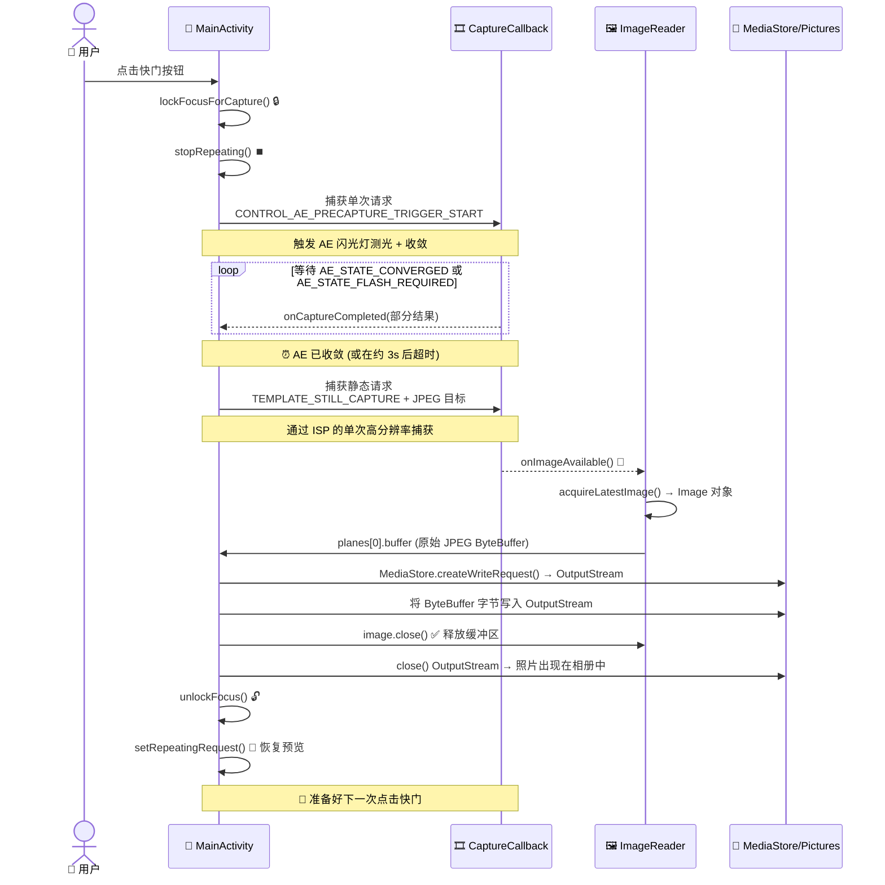

恭喜你完成了第二部分的最后一章！如果你从第 5 章开始一直关注本系列，那么你的应用现在已经具备了：权限处理、专用后台线程、使用 `CameraCharacteristics` 的相机枚举、通过 `Semaphore` 实现的稳健的打开/关闭生命周期管理，以及通过 `TextureView` 渲染的平滑、朝向正确的实时预览。还差什么？**点击按钮并保留照片的能力**。这就是本章要交付的内容。

到本章结束时，你的教程项目将成为一个真正可用的相机应用程序：点击快门，应用会短暂冻结预览（这是为了刷新管线），通过适当的自动曝光收敛捕获一张静态图像，将其保存到设备的公共 Pictures 目录中（带有正确的 EXIF 朝向元数据），然后预览自动恢复。你可以随后在 Google 相册或 **Android Camera Parameters** 应用（[GitHub](https://github.com/zoozooll/AndroidCameraParameters)，[Google Play](https://play.google.com/store/apps/details?id=com.minininja.cameraparams)）中打开照片，以检查 EXIF 数据、分辨率和质量。

**Android Camera Parameters** 应用的手动拍摄模式使用了比我们在本章中构建的管线更高级的版本：它执行带有逐帧自定义 ISO、曝光时间和镜头位置的多帧连拍捕获——但这一切都建立在你将在此处学到的 `ImageReader` + `CaptureCallback` 基础之上。

## 为什么拍照比预览更复杂

乍一看，"捕获一帧"听起来很容易——我们已经有每秒 60 帧的预览流经会话，为什么不能直接抓取一帧？答案是预览帧和静态帧是根本不同的输出：

1. **分辨率差异**：预览约为 1–2 MP (1080p)。而静态照片应当使用传感器的**最大**分辨率（在现代旗舰机上通常为 50+ MP）。在手机可以提供 50 MP 画质时，你肯定不想要一张 2 MP 的照片。
2. **曝光差异**：`TEMPLATE_PREVIEW` 针对低延迟帧率进行了优化。`TEMPLATE_STILL_CAPTURE` 则针对动态范围、降噪和色彩准确性进行了优化——静态帧需要管线能提供的最高质量 ISP 处理。
3. **3A 收敛**：在拍照之前，相机的自动曝光 (AE) 算法需要被告知"我们要拍一张静态照片了——锁定当前场景，收敛曝光、白平衡和对焦，并根据需要闪光"。这就是**预捕获触发 (precapture trigger)** 序列。跳过这一步会导致照片相对于预览显示的画面出现过曝或欠曝。
4. **存储与分区存储**：预览帧永远不会被持久化。而照片帧必须作为有效的 JPEG 文件写入磁盘，由 MediaStore 索引以便图库应用可见，且在 Android 10+ 上必须使用分区存储 (Scoped Storage) API（不能直接向 `/sdcard/DCIM/` 进行任意的 `File` 写入）。

静态拍摄是一个**多阶段异步状态机**，而不是单次调用。下面的序列图展示了你必须实现的准确顺序和时机。请勿跳过任何步骤。



预捕获触发的时机至关重要：它必须在静态捕获之前发送，并且你必须等待 AE 收敛（或达到超时）后才能触发静态拍摄。如果你跳过等待，照片将使用预览的曝光设置，而预览设置可能是为了高帧率而非照片质量而调整的。

## 认识 ImageReader：供 CPU 访问的帧接收器

在第 8 章中，我们将预览帧馈送到 `SurfaceTexture`（GPU 接收器）。对于静态拍摄，我们需要一个供 CPU 访问的接收器，以便我们可以将 JPEG 字节写入磁盘。这个接收器就是 `ImageReader`。

通过以下方式构造 `ImageReader`：
```kotlin
val imageReader = ImageReader.newInstance(
    width,           // 静态帧的像素宽度 (来自 characteristics 的最大静态尺寸)
    height,          // 静态帧的像素高度
    ImageFormat.JPEG,// 格式 — 照片用 JPEG, DNG RAW 用 RAW_SENSOR, 处理用 YUV_420_888
    maxImages        // 队列中要分配的缓冲区数量 (通常为 2–5)
)
```

四个参数详解：

1. **width/height**：使用相机从 `SCALER_STREAM_CONFIGURATION_MAP.getOutputSizes(ImageFormat.JPEG)` 中获取的最大 JPEG 尺寸。始终选择最大尺寸以获得最高质量的照片。
2. **ImageFormat.JPEG**：图像信号处理器 (ISP) 会在交付帧之前运行完整的 JPEG 编码管线（哈夫曼编码、量化、EXIF 嵌入、JFIF 文件头）。`Image.planes[0].buffer` 是一个**完整的、有效的 JPEG 文件**——无需重新编码；你可以直接将这些字节写入磁盘。
3. **maxImages**：内部 `BufferQueue` 的深度。JPEG 缓冲区很大（每个 5–20 MB）。对于典型的照片拍摄，将其设置为 **2**（一个在途中 + 一个备用）。设置得更高会浪费 RAM；设置得太低（为 **1**）且忘记 `close()` 掉 Image 会导致永久的捕获死锁（队列再也无法取出空缓冲区进行使用了）。

`ImageReader` 暴露了两个关键的 API 表面：
- **`imageReader.surface`**：返回一个 `Surface`，可以将其作为目标添加到 CaptureRequest 中，并包含在 `CameraCaptureSession` 的输出 Surface 列表中。
- **`imageReader.setOnImageAvailableListener(listener, handler)`**：注册一个回调，该回调在交付给此 reader 的**每一新帧**上触发。在此回调内部，你调用 `acquireLatestImage()`（或 `acquireNextImage()`）来获取 `Image` 对象。

### ⚠️ 关键规则：始终关闭 Image

如果你调用了 `acquireLatestImage()` 但**没有**调用 `image.close()`，该缓冲区将从池中**永久移除**。一旦泄露了 `maxImages` 个缓冲区，`OnImageAvailableListener` 将永远停止触发（队列没有可用的空缓冲区，因此没有新帧能到达）。请务必使用 try/finally 块：

```kotlin
val image = imageReader.acquireLatestImage()
try {
    // 在此处使用图像字节
} finally {
    image.close() // 始终执行。无一例外。
}
```

这是第 9 章中最常见的 bug：拍照能成功一次，然后就再也不起作用了，除非重启应用。

## 预捕获 AE 状态机

Camera2 的 3A（自动曝光 / 自动对焦 / 自动白平衡）系统是一个由 `CONTROL_AE_PRECAPTURE_TRIGGER` 请求键驱动的逐帧状态机。流程如下：

1. **停止重复预览**：`captureSession.stopRepeating()`。我们不希望预览帧干扰静态拍摄管线。
2. **发送预捕获触发**：构建一个将 `CONTROL_AE_PRECAPTURE_TRIGGER` 设置为 `START` 的单次 `CaptureRequest`。使用 `captureSession.capture()` 提交它（不是 `setRepeatingRequest` —— 这是一个单次命令，不是持续性的）。
3. **等待收敛**：在预捕获触发（及后续帧）的 `CaptureCallback.onCaptureCompleted()` 中，检查 `CaptureResult.CONTROL_AE_STATE`。我们在等待以下状态之一：
   - `CONTROL_AE_STATE_CONVERGED` ✓（AE 满意，场景测光正确）
   - `CONTROL_AE_STATE_FLASH_REQUIRED` ✓（AE 判定需要闪光，且闪光灯已就绪）
   - `CONTROL_AE_STATE_LOCKED` ✓（如果用户之前手动锁定了 AE）
   - 触发 3000ms 超时 ✗（安全阀——一些有问题的设备永远不会发出收敛信号）。
4. **触发静态拍摄**：构建一个针对 `ImageReader` 的 Surface 的 `TEMPLATE_STILL_CAPTURE` 请求。使用 `captureSession.capture()` 提交它。
5. **图像到达**：`OnImageAvailableListener.onImageAvailable()` 触发 → 获取 JPEG 字节 → 保存到磁盘。
6. **解锁并恢复**：构建一个取消 AE 触发 (`CONTROL_AE_PRECAPTURE_TRIGGER_CANCEL`) 的请求，为 AF/AWB 调用 `unlockFocus()`，然后调用 `setRepeatingRequest(previewRequest, ...)` 重新启动预览。

上述 6 个步骤中的每一步都对应于我们代码中定义的 `CaptureStateMachine` 枚举中的一个状态。

## 分区存储与 MediaStore (Android 10+)

从 Android 10 (API 29) 开始，应用不能再使用 `java.io.File` API 向共享的 `/sdcard/Pictures` 目录写入任意文件——这样做会抛出 `FileNotFoundException` 并提示 "Permission denied"，即使你持有 `WRITE_EXTERNAL_STORAGE` 权限也是如此。正确的、面向未来的做法是使用 `MediaStore` 内容提供者：

1. **准备 `ContentValues` 束**：MIME 类型 (`image/jpeg`)、相对路径 (`Pictures/Camera2Tutorial/` —— 系统会在需要时创建目录)、显示名称（带时间戳）。
2. **插入挂起行**：`contentResolver.insert(MediaStore.Images.Media.EXTERNAL_CONTENT_URI, values)` 返回一个 `Uri`。
3. **打开指向该 Uri 的 OutputStream**：`contentResolver.openOutputStream(uri)` 为你提供一个由 `ParcelFileDescriptor` 支持的流。
4. **写入字节并关闭**：将来自 `ImageReader` 的 JPEG ByteBuffer 直接复制到 OutputStream 中。
5. **使文件对图库应用可见**：可选——如果你使用了挂起写入模式，请在 values 中添加 `IS_PENDING=0`（我们将使用更简单的 `IS_PENDING=1` 然后更新的方法，以获得最大兼容性）。

在 API 28 及更低版本上，我们回退到传统的 `File(Environment.getExternalStoragePublicDirectory(Environment.DIRECTORY_PICTURES), ...)` 路径并使用直接的 `FileOutputStream`，这仍然有效，因为应用的是旧版存储模型。

## 第 9 章完整代码 — 照片捕获

以下是集成了上述所有内容的完整 `MainActivity.kt`：`ImageReader`、6 状态预捕获 AE 状态机、快门按钮、`MediaStore`/旧版保存，以及对两个会话 Surface（预览 + jpeg）的拆除。我们还更新了快门按钮的布局 XML。

### 更新后的布局 (activity_main.xml)

```xml
<?xml version="1.0" encoding="utf-8"?>
<FrameLayout xmlns:android="http://schemas.android.com/apk/res/android"
    xmlns:tools="http://schemas.android.com/tools"
    xmlns:app="http://schemas.android.com/apk/res-auto"
    android:layout_width="match_parent"
    android:layout_height="match_parent">

    <TextureView
        android:id="@+id/textureView"
        android:layout_width="match_parent"
        android:layout_height="match_parent"
        android:layout_gravity="center" />

    <TextView
        android:id="@+id/statusTextView"
        android:layout_width="wrap_content"
        android:layout_height="wrap_content"
        android:layout_gravity="top|center_horizontal"
        android:layout_marginTop="16dp"
        android:background="#80000000"
        android:padding="8dp"
        android:textColor="#FFFFFFFF"
        android:textSize="12sp"
        tools:text="正在初始化..." />

    <com.google.android.material.floatingactionbutton.FloatingActionButton
        android:id="@+id/shutterButton"
        android:layout_width="wrap_content"
        android:layout_height="wrap_content"
        android:layout_gravity="bottom|center_horizontal"
        android:layout_marginBottom="48dp"
        android:contentDescription="拍照"
        android:src="@android:drawable/ic_menu_camera"
        app:fabSize="normal" />

</FrameLayout>
```

如果你没有 Material Components，请将 FAB 替换为带有 `layout_gravity="bottom|center_horizontal"` 的 `Button`。

### 完整的 Kotlin Activity

```kotlin
package com.example.camera2tutorial

import android.Manifest
import android.content.ContentValues
import android.content.Context
import android.content.pm.PackageManager
import android.graphics.ImageFormat
import android.graphics.Matrix
import android.graphics.RectF
import android.graphics.SurfaceTexture
import android.hardware.camera2.CameraAccessException
import android.hardware.camera2.CameraCharacteristics
import android.hardware.camera2.CameraCaptureSession
import android.hardware.camera2.CameraDevice
import android.hardware.camera2.CameraManager
import android.hardware.camera2.CaptureRequest
import android.hardware.camera2.CaptureResult
import android.hardware.camera2.TotalCaptureResult
import android.hardware.camera2.params.StreamConfigurationMap
import android.media.Image
import android.media.ImageReader
import android.os.Build
import android.os.Bundle
import android.os.Environment
import android.os.Handler
import android.os.HandlerThread
import android.provider.MediaStore
import android.util.Log
import android.util.Size
import android.view.Surface
import android.view.TextureView
import android.view.View
import android.view.WindowManager
import android.widget.TextView
import android.widget.Toast
import androidx.appcompat.app.AppCompatActivity
import androidx.core.app.ActivityCompat
import androidx.core.content.ContextCompat
import com.google.android.material.floatingactionbutton.FloatingActionButton
import java.io.File
import java.io.FileOutputStream
import java.io.OutputStream
import java.text.SimpleDateFormat
import java.util.Collections
import java.util.Date
import java.util.Locale
import java.util.concurrent.Semaphore
import java.util.concurrent.TimeUnit
import kotlin.math.max
import kotlin.math.min

class MainActivity : AppCompatActivity() {

    // UI
    private lateinit var textureView: TextureView
    private lateinit var statusTextView: TextView
    private lateinit var shutterButton: FloatingActionButton

    // 线程
    private lateinit var backgroundThread: HandlerThread
    private lateinit var backgroundHandler: Handler

    // 相机管线状态
    private lateinit var cameraManager: CameraManager
    private var cameraDevice: CameraDevice? = null
    private var captureSession: CameraCaptureSession? = null
    private var previewRequestBuilder: CaptureRequest.Builder? = null
    private var previewRequest: CaptureRequest? = null
    private var selectedCameraId: String? = null
    private var sensorOrientation = 0
    private var jpegOrientation = 0
    private lateinit var previewSize: Size
    private lateinit var jpegSize: Size

    // 🆕 静态拍摄接收器
    private lateinit var imageReader: ImageReader

    // 并发
    private val cameraOpenCloseLock = Semaphore(1)

    // 🆕 捕获状态机
    private enum class CaptureState {
        IDLE,                 // 预览正常运行
        WAITING_AE_PRECAPTURE, // 已触发 AE 预捕获，等待收敛
        WAITING_AF_LOCK,      // (可选) 如果我们也添加了 AF 触发
        WAITING_STILL_CAPTURE,// 已提交静态捕获，等待 ImageReader
        PICTURE_SAVED         // 照片已保存，准备返回 IDLE
    }
    private var captureState: CaptureState = CaptureState.IDLE
    private val precaptureTimeoutHandler: Handler by lazy { Handler(mainLooper) }
    private val precaptureTimeoutRunnable = Runnable {
        if (captureState == CaptureState.WAITING_AE_PRECAPTURE) {
            Log.w(TAG, "⏰ 预捕获 AE 超时 — 仍继续进行静态拍摄")
            captureStillPicture()
        }
    }

    // -------------------------------------------------------------------------
    // 生命周期 + UI 挂接
    // -------------------------------------------------------------------------
    override fun onCreate(savedInstanceState: Bundle?) {
        super.onCreate(savedInstanceState)
        setContentView(R.layout.activity_main)

        textureView = findViewById(R.id.textureView)
        statusTextView = findViewById(R.id.statusTextView)
        shutterButton = findViewById(R.id.shutterButton)
        statusTextView.text = "正在初始化..."

        shutterButton.setOnClickListener { takePicture() }

        if (allPermissionsGranted()) {
            initializeCameraManager()
        } else {
            val allPerms = REQUIRED_PERMISSIONS + WRITE_EXTERNAL_IF_NEEDED
            ActivityCompat.requestPermissions(this, allPerms, REQUEST_CODE_PERMISSIONS)
        }
    }

    override fun onResume() {
        super.onResume()
        startBackgroundThread()
        if (allPermissionsGranted()) {
            if (!this::cameraManager.isInitialized) initializeCameraManager()
            if (textureView.isAvailable) openCameraAndStartSession(textureView.width, textureView.height)
        }
    }

    override fun onPause() {
        closeEverything()
        stopBackgroundThread()
        super.onPause()
    }

    private fun startBackgroundThread() {
        backgroundThread = HandlerThread("Camera2Background").apply { start() }
        backgroundHandler = Handler(backgroundThread.looper)
    }

    private fun stopBackgroundThread() {
        backgroundThread.quitSafely()
        try { backgroundThread.join(1000) } catch (_: InterruptedException) {}
    }

    // -------------------------------------------------------------------------
    // 第 6 章简略版：相机发现
    // -------------------------------------------------------------------------
    data class CamInfo(val id: String, val facing: Int?, val hw: Int?, val chars: CameraCharacteristics)

    private fun initializeCameraManager() {
        cameraManager = getSystemService(Context.CAMERA_SERVICE) as CameraManager
        val cams = mutableListOf<CamInfo>()
        for (id in cameraManager.cameraIdList) {
            val chars = try { cameraManager.getCameraCharacteristics(id) } catch (_: Exception) { continue }
            cams += CamInfo(
                id,
                chars[CameraCharacteristics.LENS_FACING],
                chars[CameraCharacteristics.INFO_SUPPORTED_HARDWARE_LEVEL],
                chars
            )
        }
        val best = cams.sortedWith(
            compareByDescending<CamInfo> { it.facing == CameraCharacteristics.LENS_FACING_BACK }
                .thenByDescending { it.hw ?: -1 }).first()
        selectedCameraId = best.id
        sensorOrientation = best.chars[CameraCharacteristics.SENSOR_ORIENTATION] ?: 90

        textureView.surfaceTextureListener = object : TextureView.SurfaceTextureListener {
            override fun onSurfaceTextureAvailable(s: SurfaceTexture, w: Int, h: Int) {
                openCameraAndStartSession(w, h)
            }
            override fun onSurfaceTextureSizeChanged(s: SurfaceTexture, w: Int, h: Int) {
                if (this@MainActivity::previewSize.isInitialized) configureTransform(w, h)
            }
            override fun onSurfaceTextureDestroyed(s: SurfaceTexture): Boolean = true
            override fun onSurfaceTextureUpdated(s: SurfaceTexture) {}
        }
    }

    // -------------------------------------------------------------------------
    // 第 7 章简略版：openCamera
    // -------------------------------------------------------------------------
    private val deviceCallback = object : CameraDevice.StateCallback() {
        override fun onOpened(cam: CameraDevice) {
            cameraOpenCloseLock.release()
            cameraDevice = cam
            createCaptureSession()
        }
        override fun onDisconnected(cam: CameraDevice) {
            cameraOpenCloseLock.release()
            cameraDevice?.close(); cameraDevice = null
        }
        override fun onError(cam: CameraDevice, err: Int) {
            cameraOpenCloseLock.release()
            cameraDevice?.close(); cameraDevice = null
            Toast.makeText(this@MainActivity, "相机错误 $err", Toast.LENGTH_LONG).show()
        }
    }

    // -------------------------------------------------------------------------
    // 会话创建 (现在包含 2 个 surface：预览 + jpeg)
    // -------------------------------------------------------------------------
    private fun openCameraAndStartSession(vw: Int, vh: Int) {
        val camId = selectedCameraId ?: return
        if (checkSelfPermission(Manifest.permission.CAMERA) != PackageManager.PERMISSION_GRANTED) return
        if (!cameraOpenCloseLock.tryAcquire(2500, TimeUnit.MILLISECONDS)) {
            Toast.makeText(this, "相机锁定超时", Toast.LENGTH_SHORT).show(); return
        }
        val chars = cameraManager.getCameraCharacteristics(camId)

        // 预览尺寸
        previewSize = choosePreviewSize(chars, vw, vh)
        // 🆕 静态 JPEG 尺寸 (为了最佳画质选择可用的最大尺寸)
        jpegSize = chooseMaxJpegSize(chars)

        // JPEG 朝向标签 = 经设备旋转后的传感器朝向
        jpegOrientation = computeJpegOrientation()

        // 🆕 创建 ImageReader: width=jpegW, height=jpegH, 格式=JPEG, 2 个缓冲区
        imageReader = ImageReader.newInstance(
            jpegSize.width,
            jpegSize.height,
            ImageFormat.JPEG,
            2
        )
        // 🆕 挂接 JPEG 帧可用监听器
        imageReader.setOnImageAvailableListener(onJpegAvailableListener, backgroundHandler)

        configureTransform(vw, vh)
        textureView.surfaceTexture!!.setDefaultBufferSize(previewSize.width, previewSize.height)
        statusTextView.text = "会话: 预览 ${previewSize} • JPEG ${jpegSize}"

        try { cameraManager.openCamera(camId, deviceCallback, backgroundHandler) }
        catch (e: CameraAccessException) { cameraOpenCloseLock.release() }
    }

    private fun createCaptureSession() {
        val cam = cameraDevice ?: return
        val st = textureView.surfaceTexture ?: return
        val previewSurface = Surface(st)
        val jpegSurface = imageReader.surface
        val outputs = listOf(previewSurface, jpegSurface)

        previewRequestBuilder =
            cam.createCaptureRequest(CameraDevice.TEMPLATE_PREVIEW).apply { addTarget(previewSurface) }

        cam.createCaptureSession(outputs, object : CameraCaptureSession.StateCallback() {
            override fun onConfigured(session: CameraCaptureSession) {
                captureSession = session
                previewRequest = previewRequestBuilder!!.build()
                captureState = CaptureState.IDLE
                shutterButton.isEnabled = true
                statusTextView.text = "🎥 预览 — 点击快门拍照"
                session.setRepeatingRequest(previewRequest!!, captureCallback, backgroundHandler)
            }
            override fun onConfigureFailed(session: CameraCaptureSession) {
                Toast.makeText(this@MainActivity, "会话失败", Toast.LENGTH_LONG).show()
            }
        }, backgroundHandler)
    }

    // -------------------------------------------------------------------------
    // 🆕 CaptureCallback + takePicture 状态机
    // -------------------------------------------------------------------------
    private val captureCallback = object : CameraCaptureSession.CaptureCallback() {
        override fun onCaptureStarted(
            session: CameraCaptureSession,
            request: CaptureRequest,
            timestamp: Long,
            frameNumber: Long
        ) {}

        override fun onCaptureProgressed(
            session: CameraCaptureSession,
            request: CaptureRequest,
            partialResult: CaptureResult
        ) {
            process(partialResult)
        }

        override fun onCaptureCompleted(
            session: CameraCaptureSession,
            request: CaptureRequest,
            result: TotalCaptureResult
        ) {
            process(result)
        }

        /**
         * 在每一部分或完整帧上被调用。
         * 当我们在等待 AE 预捕获收敛时，在此处检查 AE_STATE。
         */
        private fun process(result: CaptureResult) {
            when (captureState) {
                CaptureState.WAITING_AE_PRECAPTURE -> {
                    val aeState = result[CaptureResult.CONTROL_AE_STATE]
                    Log.d(TAG, "AE_STATE = $aeState")
                    if (aeState == null) return
                    when (aeState) {
                        CaptureResult.CONTROL_AE_STATE_CONVERGED,
                        CaptureResult.CONTROL_AE_STATE_FLASH_REQUIRED,
                        CaptureResult.CONTROL_AE_STATE_LOCKED -> {
                            // ✅ AE 已就绪 — 取消超时并触发静态捕获
                            precaptureTimeoutHandler.removeCallbacks(precaptureTimeoutRunnable)
                            captureStillPicture()
                        }
                        // 否则 → CONTROL_AE_STATE_PRECAPTURE / SEARCHING / INACTIVE → 继续等待
                    }
                }
                else -> { /* 在 IDLE 或其他状态下无需进行状态追踪 */ }
            }
        }
    }

    /** 快门点击公共入口。 */
    fun takePicture() {
        if (cameraDevice == null || captureSession == null) return
        if (captureState != CaptureState.IDLE) {
            Log.d(TAG, "⚠️ 捕获正在进行中 — 忽略重复快门点击")
            return
        }
        shutterButton.isEnabled = false
        statusTextView.text = "📸 正在锁定曝光..."
        lockFocusAndFirePrecaptureTrigger()
    }

    /**
     * 第 1–3 步：停止重复预览，提交 AE 预捕获触发，启动 3s 超时。
     * captureCallback.process() 方法监视 AE_STATE 并在收敛时调用 captureStillPicture()。
     */
    private fun lockFocusAndFirePrecaptureTrigger() {
        val session = captureSession ?: return
        try {
            captureState = CaptureState.WAITING_AE_PRECAPTURE

            // 构建一个与预览相同但带有 AE 预捕获触发 = START 的请求
            previewRequestBuilder?.apply {
                set(
                    CaptureRequest.CONTROL_AE_PRECAPTURE_TRIGGER,
                    CaptureRequest.CONTROL_AE_PRECAPTURE_TRIGGER_START
                )
            }

            // 暂停连续预览帧 — 使用 capture() 发送单个触发帧
            session.stopRepeating()
            session.capture(previewRequestBuilder!!.build(), captureCallback, backgroundHandler)

            // 安全阀超时 (3 秒): 一些设备永远不会发出 AE 收敛信号
            precaptureTimeoutHandler.postDelayed(precaptureTimeoutRunnable, 3000)

        } catch (e: CameraAccessException) {
            Log.e(TAG, "预捕获触发失败", e)
            unlockFocusAndResumePreview()
        }
    }

    /**
     * 第 4 步：AE 已收敛 (或超时)。发送针对 ImageReader surface 的单个 TEMPLATE_STILL_CAPTURE 请求
     * → JPEG 字节通过 onJpegAvailableListener 到达。
     */
    private fun captureStillPicture() {
        val cam = cameraDevice ?: return
        val session = captureSession ?: return
        captureState = CaptureState.WAITING_STILL_CAPTURE
        statusTextView.text = "📷 正在捕获照片..."

        try {
            // 🆕 使用 TEMPLATE_STILL_CAPTURE — 最高质量的 ISP 管线
            val stillBuilder = cam.createCaptureRequest(CameraDevice.TEMPLATE_STILL_CAPTURE)
            stillBuilder.addTarget(imageReader.surface)
            stillBuilder.set(CaptureRequest.JPEG_ORIENTATION, jpegOrientation)
            stillBuilder.set(CaptureRequest.JPEG_QUALITY, 95.toByte()) // 1–100 质量

            val stillCallback = object : CameraCaptureSession.CaptureCallback() {
                override fun onCaptureCompleted(
                    s: CameraCaptureSession,
                    req: CaptureRequest,
                    res: TotalCaptureResult
                ) {
                    Log.d(TAG, "📨 静态捕获元数据已交付")
                    // 注意：实际的 JPEG 字节是通过 onJpegAvailableListener 到达的，而不是在这里。
                }
            }

            session.stopRepeating()
            session.capture(stillBuilder.build(), stillCallback, backgroundHandler)

        } catch (e: CameraAccessException) {
            Log.e(TAG, "静态捕获失败", e)
            unlockFocusAndResumePreview()
        }
    }

    /**
     * 第 5 步：ImageReader 中的 JPEG 字节可用。获取最新 Image，将其字节写入 MediaStore (或旧版 File)，
     * 关闭 IMAGE，然后恢复预览。
     */
    private val onJpegAvailableListener = ImageReader.OnImageAvailableListener { reader ->
        var image: Image? = null
        try {
            image = reader.acquireLatestImage()
            if (image == null) {
                Log.w(TAG, "acquireLatestImage 返回 null — 缓冲区丢弃")
                return@OnImageAvailableListener
            }
            val buffer = image.planes[0].buffer
            val bytes = ByteArray(buffer.remaining())
            buffer.get(bytes)

            val savedUri = savePhotoToStorage(bytes)
            captureState = CaptureState.PICTURE_SAVED

            // 切换到主线程进行 UI 更新 / 显示 Toast
            runOnUiThread {
                shutterButton.isEnabled = true
                if (savedUri != null) {
                    statusTextView.text = "✅ 已保存！Uri=$savedUri"
                    Toast.makeText(
                        this@MainActivity,
                        "照片已保存: $savedUri",
                        Toast.LENGTH_LONG
                    ).show()
                } else {
                    statusTextView.text = "❌ 保存失败"
                    Toast.makeText(
                        this@MainActivity,
                        "照片保存失败 — 检查 Logcat",
                        Toast.LENGTH_LONG
                    ).show()
                }
            }
        } catch (e: Exception) {
            Log.e(TAG, "onJpegAvailable 错误", e)
        } finally {
            image?.close() // ✅ 始终关闭 IMAGE — 无一例外！
        }

        // 第 6 步：无论保存成功还是失败，都要恢复预览
        runOnUiThread { unlockFocusAndResumePreview() }
    }

    /**
     * 第 6 步：取消 AE 预捕获触发，清除对焦锁定，重新开始重复预览。
     */
    private fun unlockFocusAndResumePreview() {
        val session = captureSession ?: return
        try {
            previewRequestBuilder?.apply {
                set(
                    CaptureRequest.CONTROL_AF_TRIGGER,
                    CaptureRequest.CONTROL_AF_TRIGGER_CANCEL
                )
                set(
                    CaptureRequest.CONTROL_AE_PRECAPTURE_TRIGGER,
                    CaptureRequest.CONTROL_AE_PRECAPTURE_TRIGGER_CANCEL
                )
            }
            session.capture(previewRequestBuilder!!.build(), captureCallback, backgroundHandler)

            captureState = CaptureState.IDLE
            precaptureTimeoutHandler.removeCallbacks(precaptureTimeoutRunnable)
            session.setRepeatingRequest(previewRequest!!, captureCallback, backgroundHandler)

            if (statusTextView.text.startsWith("📸") ||
                statusTextView.text.startsWith("📷")) {
                statusTextView.text = "🎥 预览 — 点击快门拍照"
            }
        } catch (e: CameraAccessException) {
            Log.e(TAG, "静态捕获后恢复预览失败", e)
        }
    }

    // -------------------------------------------------------------------------
    // 🆕 savePhotoToStorage: MediaStore (API 29+) + 旧版 File (API 28+)
    // -------------------------------------------------------------------------
    private fun savePhotoToStorage(jpegBytes: ByteArray): android.net.Uri? {
        val timestamp = SimpleDateFormat("yyyyMMdd_HHmmss", Locale.US).format(Date())
        val displayName = "IMG_Camera2Tutorial_$timestamp"
        val relativeDir = "${Environment.DIRECTORY_PICTURES}/Camera2Tutorial"

        return if (Build.VERSION.SDK_INT >= Build.VERSION_CODES.Q) {
            // ✅ 通过 MediaStore 进行分区存储 (无需 WRITE_EXTERNAL_STORAGE 权限！)
            val values = ContentValues().apply {
                put(MediaStore.Images.Media.DISPLAY_NAME, "$displayName.jpg")
                put(MediaStore.Images.Media.MIME_TYPE, "image/jpeg")
                put(MediaStore.Images.Media.RELATIVE_PATH, relativeDir)
                put(MediaStore.Images.Media.IS_PENDING, 1) // 写入时标记为挂起
            }
            val resolver = contentResolver
            val uri = resolver.insert(MediaStore.Images.Media.EXTERNAL_CONTENT_URI, values)
                ?: return null
            try {
                resolver.openOutputStream(uri)?.use { os -> os.write(jpegBytes) }
                // 清除 PENDING 标志，以便图库应用现在可以看到它
                values.clear()
                values.put(MediaStore.Images.Media.IS_PENDING, 0)
                resolver.update(uri, values, null, null)
                Log.d(TAG, "✅ MediaStore 已保存: $uri")
                uri
            } catch (e: Exception) {
                Log.e(TAG, "MediaStore 写入失败", e)
                resolver.delete(uri, null, null) // 清理写了一半的挂起文件
                null
            }
        } else {
            // 🕰️ 旧版路径：直接将文件写入公共 Pictures 目录
            val dir = File(Environment.getExternalStoragePublicDirectory(Environment.DIRECTORY_PICTURES), "Camera2Tutorial")
            if (!dir.exists()) dir.mkdirs()
            val file = File(dir, "$displayName.jpg")
            try {
                FileOutputStream(file).use { os -> os.write(jpegBytes) }
                // 索引文件，以便图库应用立即发现它
                val values = ContentValues().apply {
                    put(MediaStore.Images.Media.DATA, file.absolutePath)
                    put(MediaStore.Images.Media.MIME_TYPE, "image/jpeg")
                    put(MediaStore.Images.Media.DISPLAY_NAME, displayName)
                }
                contentResolver.insert(MediaStore.Images.Media.EXTERNAL_CONTENT_URI, values)
                android.net.Uri.fromFile(file)
            } catch (e: Exception) {
                Log.e(TAG, "旧版文件写入失败", e)
                null
            }
        }
    }

    // -------------------------------------------------------------------------
    // 尺寸 + 朝向辅助函数
    // -------------------------------------------------------------------------
    private fun choosePreviewSize(chars: CameraCharacteristics, vw: Int, vh: Int): Size {
        val map = chars[CameraCharacteristics.SCALER_STREAM_CONFIGURATION_MAP]!!
        val viewAspect = max(vw, vh).toDouble() / min(vw, vh)
        val choices = map.getOutputSizes(SurfaceTexture::class.java).toList()
        val matches = choices.filter {
            val a = max(it.width, it.height).toDouble() / min(it.width, it.height)
            kotlin.math.abs(a - viewAspect) < 0.02 && (it.width * it.height) <= 1920 * 1080 * 2
        }
        return (matches.ifEmpty { choices }).maxByOrNull { it.width * it.height }!!
    }

    private fun chooseMaxJpegSize(chars: CameraCharacteristics): Size {
        val map = chars[CameraCharacteristics.SCALER_STREAM_CONFIGURATION_MAP]!!
        val choices = map.getOutputSizes(ImageFormat.JPEG).toList()
        val max = choices.maxByOrNull { it.width * it.height }!!
        Log.d(TAG, "选定的最大 JPEG 尺寸: ${max.width}×${max.height} " +
            "(来自 ${choices.size} 个尺寸)")
        return max
    }

    private fun computeJpegOrientation(): Int {
        val deviceRotation = (getSystemService(Context.WINDOW_SERVICE) as WindowManager)
            .defaultDisplay.rotation
        val facing = try {
            selectedCameraId?.let {
                cameraManager.getCameraCharacteristics(it)[CameraCharacteristics.LENS_FACING]
            }
        } catch (_: Exception) { CameraCharacteristics.LENS_FACING_BACK }
        val frontFacing = facing == CameraCharacteristics.LENS_FACING_FRONT

        return when (deviceRotation) {
            Surface.ROTATION_0 -> if (frontFacing) (360 - sensorOrientation) % 360 else sensorOrientation
            Surface.ROTATION_90 -> if (frontFacing) (360 - (sensorOrientation + 270) % 360) % 360 else (sensorOrientation + 270) % 360
            Surface.ROTATION_180 -> if (frontFacing) (360 - (sensorOrientation + 180) % 360) % 360 else (sensorOrientation + 180) % 360
            Surface.ROTATION_270 -> if (frontFacing) (360 - (sensorOrientation + 90) % 360) % 360 else (sensorOrientation + 90) % 360
            else -> 0
        }
    }

    private fun configureTransform(vw: Int, vh: Int) {
        val rotation = (getSystemService(Context.WINDOW_SERVICE) as WindowManager).defaultDisplay.rotation
        val matrix = Matrix()
        val vr = RectF(0f, 0f, vw.toFloat(), vh.toFloat())
        val br = RectF(0f, 0f, previewSize.height.toFloat(), previewSize.width.toFloat())
        val cx = vr.centerX(); val cy = vr.centerY()
        br.offset(cx - br.centerX(), cy - br.centerY())
        matrix.setRectToRect(vr, br, Matrix.ScaleToFit.FILL)
        val scale = max(vh.toFloat() / previewSize.height, vw.toFloat() / previewSize.width)
        matrix.postScale(scale, scale, cx, cy)
        val rot = when (rotation) {
            Surface.ROTATION_0 -> sensorOrientation
            Surface.ROTATION_90 -> 0
            Surface.ROTATION_180 -> 360 - sensorOrientation
            Surface.ROTATION_270 -> 180
            else -> 0
        }
        matrix.postRotate(rot.toFloat(), cx, cy)
        textureView.setTransform(matrix)
    }

    // -------------------------------------------------------------------------
    // 拆除
    // -------------------------------------------------------------------------
    private fun closeEverything() {
        try {
            cameraOpenCloseLock.acquire()
            precaptureTimeoutHandler.removeCallbacks(precaptureTimeoutRunnable)
            captureSession?.apply {
                try { stopRepeating(); abortCaptures() } catch (_: CameraAccessException) {}
                close()
            }
            captureSession = null
            cameraDevice?.close(); cameraDevice = null
            if (this::imageReader.isInitialized) {
                imageReader.close() // 重要 — 释放 JPEG BufferQueue 内存
            }
        } catch (_: InterruptedException) {
        } finally {
            cameraOpenCloseLock.release()
        }
    }

    // -------------------------------------------------------------------------
    // 权限样板代码
    // -------------------------------------------------------------------------
    companion object {
        private const val TAG = "Camera2Tutorial"
        private const val REQUEST_CODE_PERMISSIONS = 10
        private val REQUIRED_PERMISSIONS = arrayOf(Manifest.permission.CAMERA)
        // pre-Q 在旧版文件保存路径下仅需要 WRITE_EXTERNAL_STORAGE 权限
        private val WRITE_EXTERNAL_IF_NEEDED =
            if (Build.VERSION.SDK_INT < Build.VERSION_CODES.Q)
                arrayOf(Manifest.permission.WRITE_EXTERNAL_STORAGE)
            else
                emptyArray()
    }

    private fun allPermissionsGranted(): Boolean {
        val need = REQUIRED_PERMISSIONS + WRITE_EXTERNAL_IF_NEEDED
        return need.all { ContextCompat.checkSelfPermission(baseContext, it) == PackageManager.PERMISSION_GRANTED }
    }

    override fun onRequestPermissionsResult(
        requestCode: Int, permissions: Array<out String>, grantResults: IntArray
    ) {
        super.onRequestPermissionsResult(requestCode, permissions, grantResults)
        if (requestCode == REQUEST_CODE_PERMISSIONS) {
            if (allPermissionsGranted()) {
                initializeCameraManager()
            } else {
                Toast.makeText(this, "需要权限", Toast.LENGTH_LONG).show()
                finish()
            }
        }
    }
}
```

### 解读捕获状态机

遵循 `takePicture()` → `lockFocusAndFirePrecaptureTrigger()` → (AE 已收敛或超时) → `captureStillPicture()` → `onJpegAvailableListener` → `unlockFocusAndResumePreview()` 调用链。每一步的转换都受 `captureState` 控制。重复的点击将被忽略（`takePicture()` 顶部的 `if (captureState != IDLE) return` 检查）。

关键的具体细节：
- **`JPEG_ORIENTATION`**：在静态捕获请求中设置。图库应用读取 JPEG 文件头中的 EXIF 朝向标签，以旋转显示的照片。没有此标签，即使像素数据正确，横向照片也会显示为侧向。
- **`JPEG_QUALITY = 95`**：质量与文件大小之间的良好平衡。100 在理论上是无损的，但会产生大 2–3 倍的文件，视觉提升微乎其微；80 在精细纹理中会产生可见的压缩伪影。
- **`IS_PENDING=1 → 0` 模式 (API 29+)**：告诉 MediaStore "在写入完成之前，不要让照片编辑器、图库应用或 MTP 主机看到此文件"。防止正在进行的 `OutputStream` 写入导致损坏的半成品文件出现在 Google 相册中。务必清除此标志。

## 验证：运行照片捕获流程

在真实的 Android 设备上安装并启动第 9 章的应用（模拟器相机的 AE 状态机比较奇怪，不具代表性）。验证以下每一个检查点行为：

1. **预览如常运行**。状态显示 *🎥 预览 — 点击快门拍照*。快门 FAB 可见且可点击。
2. **点击快门**。状态变为 *📸 正在锁定曝光...* → *📷 正在捕获照片...* → *✅ 已保存！Uri=content://media/external/images/media/12345*。
3. **预览短暂冻结**（约 0.3–1.0 秒），期间 AE 收敛且静态帧正在被处理。然后预览再次启动。这种短暂冻结是正确且符合预期的行为。
4. **打开设备的图库 / 相册应用**。导航到 **Pictures → Camera2Tutorial** 相册。你应该能看到拍摄照片的缩略图。打开它——它应该是全分辨率的（例如 50 MP 传感器对应 8160×6120），朝向正确且曝光正常。
5. **在 Android Camera Parameters 应用的 EXIF 查看器中打开照片**（[Google Play](https://play.google.com/store/apps/details?id=com.minininja.cameraparams)）。检查 EXIF 朝向标签是否与拍摄时的设备旋转匹配，JPEG 质量 = 95，且分辨率与会话启动时记录的 `jpegSize` 匹配。
6. **快速点击快门 10 次以上**。`captureState != IDLE` 防御机制应当在捕获周期内吞掉重复的点击；最后你应该拥有与完成的捕获周期数量完全一致的已保存照片。

### Logcat 输出参考

成功的捕获会产生大致按此顺序排列的 Logcat 条目：
```
D/Camera2Tutorial: 选定的最大 JPEG 尺寸: 8160×6120 (来自 9 个尺寸)
D/Camera2Tutorial: 📸 正在锁定曝光...
D/Camera2Tutorial: AE_STATE = CONTROL_AE_STATE_SEARCHING
D/Camera2Tutorial: AE_STATE = CONTROL_AE_STATE_SEARCHING
D/Camera2Tutorial: AE_STATE = CONTROL_AE_STATE_CONVERGED
D/Camera2Tutorial: 📷 正在捕获照片...
D/Camera2Tutorial: 📨 静态捕获元数据已交付
D/Camera2Tutorial: ✅ MediaStore 已保存: content://media/external/images/media/9876
D/Camera2Tutorial: 🎥 预览 — 点击快门拍照
```

## 捕获失败排查

### captureStillPicture() 从未触发 (卡在"正在锁定曝光...")

3 秒超时最终应当触发并继续——如果连超时都没触发，说明 `precaptureTimeoutRunnable` 从未被投递。仔细检查 `lockFocusAndFirePrecaptureTrigger()` 是否调用了 `precaptureTimeoutHandler.postDelayed(precaptureTimeoutRunnable, 3000)`。如果每次都触发超时，但 `AE_STATE` 看起来从未收敛，你可能使用的是带有损坏的 AE 状态报告的 LEGACY 级别相机。在这种情况下，添加一个检查：如果硬件级别是 LEGACY，跳过预捕获触发，直接从 `takePicture()` 跳转到 `captureStillPicture()`。

### 拍照成功一次，但后续所有捕获都无法产生 onImageAvailable

由于忘记调用 `image.close()`，你导致了 `Image` 泄露。`maxImages = 2` 的池子已耗尽，除非杀掉应用进程，否则无法交付新帧。验证 `onJpegAvailableListener` 中的 `finally { image?.close() }` 块。作为调试辅助，可以记录 `imageReader.acquireLatestImage()` 返回 null 的情况——这是缓冲区泄露的明显迹象。

### 图库中的照片显示为侧向

你的 `computeJpegOrientation()` 返回值有误。在所有 4 种设备方向（纵向、左横向、反向横向、反向纵向）下对后置和前置摄像头分别进行测试。前置摄像头需要翻转（镜像）朝向，因为按照惯例，`LENS_FACING_FRONT` 传感器是镜像的。

### MediaStore 在 API 29+ 上抛出 SecurityException

你忘记从 API 29+ 的权限列表中移除 `WRITE_EXTERNAL_STORAGE` 且你使用的设备设置了 `requestLegacyExternalStorage=false`。在 API 29+ 上，`WRITE_EXTERNAL_STORAGE` **不授予任何权限** —— 只有 MediaStore Uri 才有效。`WRITE_EXTERNAL_IF_NEEDED` 辅助函数在 Q+ 上正确地忽略了该权限。

## 小结

第二部分圆满结束：你的教程应用现在是一个**功能齐全的相机应用程序**。你实现了：

1. **ImageReader** 作为供 CPU 访问的 JPEG 接收器：正确的宽/高 (最大 JPEG 尺寸)、`ImageFormat.JPEG`、`maxImages = 2` 的缓冲区计数、`OnImageAvailableListener` 注册，以及**始终在 finally 块中关闭 Image** 以防止缓冲区永久匮乏的不变规则。
2. **6 状态捕获状态机**：`IDLE → WAITING_AE_PRECAPTURE → (收敛/超时) → WAITING_STILL_CAPTURE → PICTURE_SAVED → 回到 IDLE`，受重复点击抑制和针对损坏的 AE 状态报告设备的 3 秒安全阀超时保护。
3. **预捕获 AE 触发流程**：`stopRepeating → session.capture(CONTROL_AE_PRECAPTURE_TRIGGER_START) → 在 CaptureCallback 中处理 AE_STATE 直到 CONVERGED/FLASH_REQUIRED/LOCKED → 发起静态拍摄`。
4. **TEMPLATE_STILL_CAPTURE + 质量设置**：基于传感器朝向 + 设备旋转设置 `JPEG_ORIENTATION` EXIF 标签（前置摄像头正确镜像），`JPEG_QUALITY = 95`。
5. **面向未来的照片存储**：Android 10+ 采用分区存储的 `MediaStore.Images.Media.EXTERNAL_CONTENT_URI` + `RELATIVE_PATH` + `IS_PENDING=1→0` 模式，Android 9 及以下版本回退到 `Environment.DIRECTORY_PICTURES` 的旧版 `FileOutputStream` 路径，外加立即进行的 MediaStore 索引，以便图库应用能立刻看到新文件。
6. **对称拆除**：`closeEverything()` 会停止重复、中止捕获、关闭会话、关闭设备、关闭 `ImageReader`（关键在于释放 2× 20 MB 的 JPEG 缓冲区），所有操作均在 `Semaphore(1)` 临界区内进行。

本章中的代码构成了任何严谨的 Camera2 静态摄影应用的基础。[GitHub](https://github.com/zoozooll/AndroidCameraParameters) 上的 **Android Camera Parameters** 应用将此状态机扩展了 10 多个额外状态，用于 AF 触发、AWB 锁定、多帧连拍捕获、RAW (DNG) 输出以及 JPEG 旁路、手动逐帧 ISO/曝光时间覆盖——但其中每一项功能都是对你现在已经完全理解的同一个 `ImageReader` + `CaptureCallback` + 状态机模式的增量补充。

## 下一章（展望第三部分）

**第二部分：你的第一个 Camera2 应用**到此结束。在五章中，你构建了一个具有权限处理、线程化、相机枚举、打开/关闭生命周期、预览渲染和 JPEG 静态捕获功能的生产级骨架应用。如果你就此止步并发布这段代码，你已经拥有了一个比 Play 商店中许多应用更好的相机应用。

但 Camera2 API 的真正威力在于接下来的内容。**第三部分 (第 10–12 章)** 将深入探讨专业相机应用所需的内部机制：
- **第 10 章：CameraCharacteristics 百科全书** —— 每一个键系列 (SENSOR, LENS, SCALER, STATISTICS, CONTROL, INFO, REQUEST, SYNC)，它们的含义，以及如何围绕它们设计功能标志。
- **第 11 章：Camera2 管线与 HAL3 架构** —— P1、P2 与 P3 节点、重处理、`CaptureRequest`/`CaptureResult` 键的对等性、同步框架，以及 `TEMPLATE_*` 在底层到底配置了什么。
- **第 12 章：捕获类型、连拍与深入 3A** —— 重复 vs 单次 vs 连拍、ZSL 重处理队列、AF/AE/AWB 状态机转换、手动控制 (`LENS_FOCUS_DISTANCE`, `SENSOR_SENSITIVITY`/`SENSOR_EXPOSURE_TIME`) 以及 `CONTROL_CAPTURE_INTENT` 分类学。

在此之前，请尝试用你第 9 章的应用拍些照片。探索光线复杂的场景（明亮的窗户 + 昏暗的室内），看看预捕获 AE 触发如何相对于预览调整曝光。对比 `JPEG_QUALITY = 50` vs `95` vs `100` 的文件大小。将 `chooseMaxJpegSize` 换成 4K 尺寸，观察速度差异。内化这些材料的最佳方式是观察每个参数带来的现实后果。恭喜你构建了你的第一台 Camera2 相机——这是你应得的。
