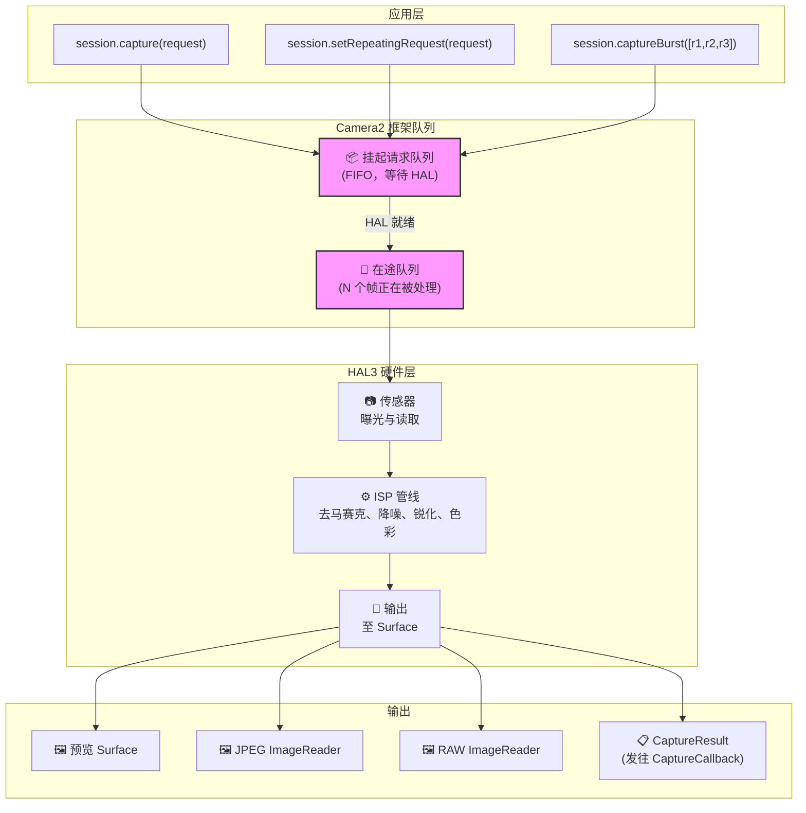
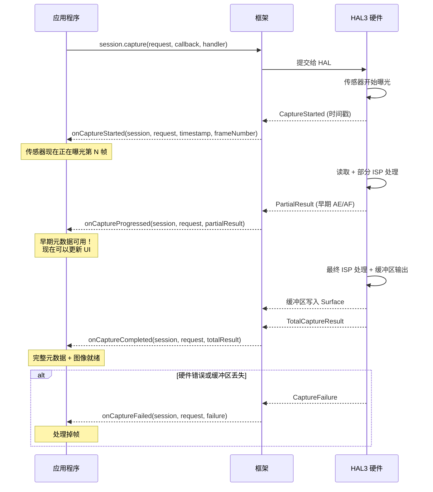
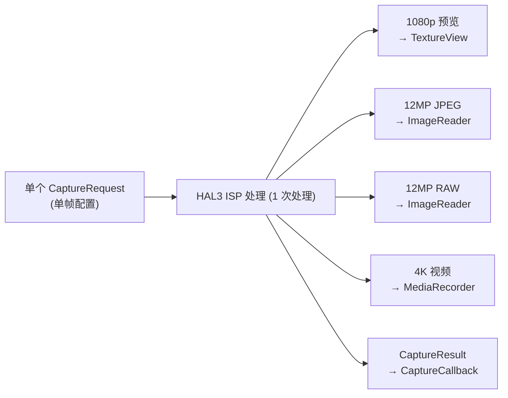
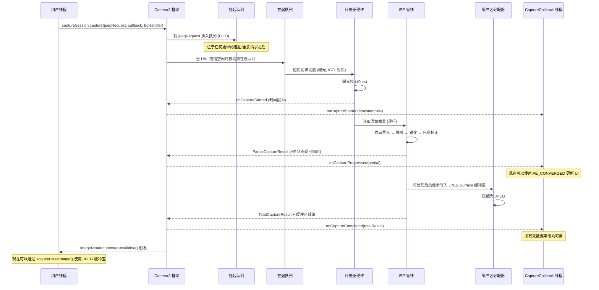

## 10.1 从使用到理解

在本系列的之前章节中，你*使用*了 Camera2：显示预览、捕获照片以及处理 RAW 文件。现在是时候反转镜头，向内观察了——**Camera2 到底是如何交付这些帧的？**

理解管线不仅仅是为了学术研究。当你了解请求如何在系统中流动时，你就可以：
- 诊断高帧率拍摄时的掉帧问题
- 解释为什么更改设置需要 1-2 帧才能生效
- 优化连拍捕获以实现零黑屏
- 为回调时机建立正确的思维模型

**Android Camera Parameters** 应用（[GitHub](https://github.com/zoozooll/AndroidCameraParameters)，[Play 商店](https://play.google.com/store/apps/details?id=com.minininja.cameraparams)）实时可视化了管线行为——查看 **Frame Timing (帧时序)** 和 **Raw JSON** 选项卡，即可在你自己的设备上实时观察本章中的概念。

## 10.2 核心数据结构

在观察管线本身之前，让我们深入研究流经管线的两个对象：`CaptureRequest`（进入的）和 `CaptureResult`（出来的）。

### CaptureRequest：不可变的帧蓝图

`CaptureRequest` 是针对**单帧的完整、不可变配置**。它描述了传感器、镜头和 ISP 在一次曝光中应该执行的*所有*操作：传感器曝光时间、ISO、镜头对焦距离、3A 模式、输出目标、JPEG 质量、裁剪区域等等。

`CaptureRequest` 的关键属性：

- **build() 后不可变** — 一旦你调用了 `.build()`，请求就被冻结了。要更改设置，你必须创建一个新的 Builder。
- **构建器模式** — 通过 `CaptureRequest.Builder` 构造，从 `CameraDevice.createCaptureRequest(template)` 获取。
- **逐帧** — 每一个独立的帧都有其自己的请求对象。即使是重复捕获也会（隐式地）为每一帧创建一个新请求。
- **定向到 Surface** — 每个请求都会明确列出哪些输出 Surface 接收处理后的图像缓冲区。

```kotlin
// 使用构建器模式构建 CaptureRequest
val builder = cameraDevice.createCaptureRequest(CameraDevice.TEMPLATE_STILL_CAPTURE)

// 传感器级参数
builder.set(CaptureRequest.SENSOR_EXPOSURE_TIME, 10_000_000L)   // 10ms
builder.set(CaptureRequest.SENSOR_SENSITIVITY, 400)             // ISO 400
builder.set(CaptureRequest.SENSOR_FRAME_DURATION, 33_333_333L)  // 最大约 30fps

// 镜头参数
builder.set(CaptureRequest.LENS_FOCUS_DISTANCE, 0.1f)           // 10cm 对焦
builder.set(CaptureRequest.LENS_APERTURE, 1.8f)                 // f/1.8

// 3A 控制模式
builder.set(CaptureRequest.CONTROL_AF_MODE, CaptureRequest.CONTROL_AF_MODE_OFF)
builder.set(CaptureRequest.CONTROL_AE_MODE, CaptureRequest.CONTROL_AE_MODE_OFF)
builder.set(CaptureRequest.CONTROL_AWB_MODE, CaptureRequest.CONTROL_AWB_MODE_OFF)

// 输出目标
builder.addTarget(previewSurface)
builder.addTarget(jpegReader.surface)

// 构建 — 现在不可变了！
val request: CaptureRequest = builder.build()

// request.set(...) 将会失败 — 构建后的对象没有 set() 方法！
```

:::note
不可变性对于管线的正确性至关重要。由于 HAL 会异步读取请求，如果你能在提交后修改它，就会在应用线程和硬件处理线程之间产生竞态条件。
:::

### CaptureResult：元数据报告（而非图像！）

`CaptureResult` 是处理后帧的**元数据输出**。至关重要的是：**CaptureResult 不包含图像像素数据**。像素流向了你添加到请求中的 `Surface` 目标；`CaptureResult` 流向了你的 `CaptureCallback`，承载着拍摄期间发生的*故事*。

以下是 `CaptureResult` 中最重要的字段：

| 结果键 | 类型 | 说明 |
|-----------|------|-------------|
| `SENSOR_EXPOSURE_TIME` | `Long` | 实际使用的曝光时间（纳秒），可能与请求值不同 |
| `SENSOR_SENSITIVITY` | `Int` | 实际应用的 ISO 增益 |
| `SENSOR_TIMESTAMP` | `Long` | 曝光开始时的纳秒时间戳（来自 `SystemClock.elapsedRealtimeNanos()`） |
| `CONTROL_AE_STATE` | `Int` | 自动曝光状态：INACTIVE、SEARCHING、CONVERGED、LOCKED、FLASH_REQUIRED |
| `CONTROL_AF_STATE` | `Int` | 自动对焦状态：INACTIVE、PASSIVE_SCAN、ACTIVE_SCAN、FOCUSED_LOCKED、NOT_FOCUSED_LOCKED |
| `CONTROL_AWB_STATE` | `Int` | 自动白平衡状态 |
| `LENS_FOCUS_DISTANCE` | `Float` | 镜头设置的实际对焦距离 |
| `SCALER_CROP_REGION` | `Rect` | 用于数字变焦的实际裁剪区域 |
| `JPEG_GPS_LOCATION` | `Location` | 写入 JPEG 的 GPS 标签（如果请求了） |
| `STATISTICS_FACE_DETECT_MODE` | `Int` | 实际使用的人脸检测模式 |

结果字段是你的**地面真值 (ground truth)**。`CaptureRequest` 是你*要求*硬件做的；`CaptureResult` 是硬件*实际执行*的。在 LEGACY 或 LIMITED 设备上，HAL 可能会静默地夹断、舍入或覆盖你的请求值——而结果能让你检测到这一点。

```kotlin
val captureCallback = object : CameraCaptureSession.CaptureCallback() {
    override fun onCaptureCompleted(
        session: CameraCaptureSession,
        request: CaptureRequest,
        result: TotalCaptureResult
    ) {
        val timestampNs = result.get(CaptureResult.SENSOR_TIMESTAMP)
        val exposureNs = result.get(CaptureResult.SENSOR_EXPOSURE_TIME)
        val iso = result.get(CaptureResult.SENSOR_SENSITIVITY)
        val aeState = result.get(CaptureResult.CONTROL_AE_STATE)
        val afState = result.get(CaptureResult.CONTROL_AF_STATE)
        val focusDistance = result.get(CaptureResult.LENS_FOCUS_DISTANCE)
        val cropRegion = result.get(CaptureResult.SCALER_CROP_REGION)

        val aeStateStr = when (aeState) {
            CaptureResult.CONTROL_AE_STATE_INACTIVE -> "未活动"
            CaptureResult.CONTROL_AE_STATE_SEARCHING -> "搜索中"
            CaptureResult.CONTROL_AE_STATE_CONVERGED -> "已收敛"
            CaptureResult.CONTROL_AE_STATE_LOCKED -> "已锁定"
            CaptureResult.CONTROL_AE_STATE_FLASH_REQUIRED -> "需要闪光"
            else -> "未知($aeState)"
        }

        val afStateStr = when (afState) {
            CaptureResult.CONTROL_AF_STATE_INACTIVE -> "未活动"
            CaptureResult.CONTROL_AF_STATE_PASSIVE_SCAN -> "被动扫描"
            CaptureResult.CONTROL_AF_STATE_ACTIVE_SCAN -> "主动扫描"
            CaptureResult.CONTROL_AF_STATE_FOCUSED_LOCKED -> "对焦锁定"
            CaptureResult.CONTROL_AF_STATE_NOT_FOCUSED_LOCKED -> "未对焦锁定"
            else -> "未知($afState)"
        }

        Log.d("Pipeline", buildString {
            append("帧 @${timestampNs?.let { it / 1_000_000 } ?: "?"}ms | ")
            append("曝光: ${exposureNs?.let { "%.2fms".format(it / 1_000_000.0) } ?: "?"} | ")
            append("ISO: $iso | ")
            append("对焦: ${focusDistance?.let { "%.3f".format(it) } ?: "?"} 屈光度 | ")
            append("AE: $aeStateStr | ")
            append("AF: $afStateStr | ")
            append("裁剪: ${cropRegion?.width()}x${cropRegion?.height()}")
        })
    }
}
```

:::tip
在 **Android Camera Parameters** 应用中，在设置中启用 **Live Result Logging (实时结果记录)**，即可实时观察元数据的流动。随着曝光趋于平稳，你会看到 AE_SEARCHING 转换为 AE_CONVERGED；点击对焦时，AF_SCAN 会转换为 FOCUSED_LOCKED。
:::

## 10.3 请求队列

Camera2 在框架层使用**双队列管线模型**。理解这些队列可以解释你观察到的几乎所有时序行为。

### 挂起请求队列 (FIFO)

当你调用 `session.capture()`、`session.captureBurst()` 或 `session.setRepeatingRequest()` 时，请求不会立即发送到 HAL。相反，它进入**挂起请求队列 (Pending Request Queue)**——一个由 Camera2 框架管理的 FIFO（先进先出）队列。

把它想象成"候诊室"。请求在这里等待，直到 HAL 有能力接受新请求进行处理。

关键属性：
- **FIFO 顺序** — 请求按提交的确切顺序进行处理。
- **连拍原子性** — `captureBurst()` 中的所有帧都会被连续排队并处理，不会被重复请求穿插。
- **优先级覆盖** — 单次/连拍请求在队列中会跳到重复请求*之前*执行（单次完成后，重复请求会自动重新排队）。
- **有界的** — 队列深度有限（通常为 4-8 个请求）；溢出会触发错误。

### 在途队列 (In-Flight Queue)

当 HAL 从挂起队列中取出一个请求并开始传感器读取/ISP 处理时，该请求就会移动到**在途队列 (In-Flight Queue)**。此队列包含硬件当前正在处理的所有请求。

在途队列的深度 (`CameraCharacteristics.REQUEST_PIPELINE_MAX_DEPTH`) 告诉你硬件可以同时处理多少个帧。在典型的 FULL 设备上，这通常是 3–4 帧深度，这意味着：当帧 N 正在曝光时，帧 N-1 正在由 ISP 处理，帧 N-2 正在被写入内存，而帧 N-3 正在返回给应用。这就是 Camera2 尽管每帧端到端耗时约 100ms 却能实现 30+ fps 的原因。



## 10.4 结果回调：CaptureCallback 生命周期

结果通过 `CameraCaptureSession.CaptureCallback` 返回。HAL 可以分阶段返回结果，让你在完整帧就绪之前提前获取部分元数据。

### 四种回调方法

| 方法 | 调用时机 | 包含内容 | 用例 |
|--------|------------|----------|----------|
| `onCaptureStarted` | 传感器*开始*对此帧进行曝光 | 最少信息：帧号、时间戳 | 精确的时序同步 |
| `onCaptureProgressed` | ISP 已部分处理该帧 | PartialCaptureResult — 部分元数据字段就绪 | 早期 AE/AF 状态更新 |
| `onCaptureCompleted` | 完整帧已完成，所有缓冲区已交付 | TotalCaptureResult — 所有字段 | 最终元数据记录 |
| `onCaptureFailed` | 掉帧 / 发生错误 | CaptureFailure — 错误代码、原因 | 错误恢复 |

### 部分结果 vs. 全体结果

当 ISP 计算出*一些*元数据字段但尚未完成整个管线时，会返回 `PartialCaptureResult`。当一切完成后，会返回 `TotalCaptureResult`。



```kotlin
val fullPipelineCallback = object : CameraCaptureSession.CaptureCallback() {
    override fun onCaptureStarted(
        session: CameraCaptureSession,
        request: CaptureRequest,
        timestamp: Long,
        frameNumber: Long
    ) {
        super.onCaptureStarted(session, request, timestamp, frameNumber)
        Log.d("Pipeline", "帧 #$frameNumber 在 ${timestamp / 1_000_000}ms 开始曝光")
    }

    override fun onCaptureProgressed(
        session: CameraCaptureSession,
        request: CaptureRequest,
        partialResult: CaptureResult
    ) {
        super.onCaptureProgressed(session, request, partialResult)
        val aeState = partialResult.get(CaptureResult.CONTROL_AE_STATE)
        val afState = partialResult.get(CaptureResult.CONTROL_AF_STATE)
        Log.v("Pipeline", "部分结果: AE=$aeState AF=$afState")
    }

    override fun onCaptureCompleted(
        session: CameraCaptureSession,
        request: CaptureRequest,
        result: TotalCaptureResult
    ) {
        super.onCaptureCompleted(session, request, result)
        val totalFrames = result.frameNumber
        Log.d("Pipeline", "帧 #$totalFrames 已完全完成")
    }

    override fun onCaptureFailed(
        session: CameraCaptureSession,
        request: CaptureRequest,
        failure: CaptureFailure
    ) {
        super.onCaptureFailed(session, request, failure)
        val reason = when (failure.reason) {
            CaptureFailure.REASON_ERROR -> "内部错误"
            CaptureFailure.REASON_FLUSHED -> "由于 abortCaptures() 被刷新丢弃"
            else -> "未知 (${failure.reason})"
        }
        Log.e("Pipeline", "帧 #${failure.frameNumber} 失败: $reason。已捕获图像: ${failure.wasImageCaptured()}")
    }
}
```

## 10.5 管线内部机制：无状态、顺序、异步、多输出

Camera2 暴露的 HAL3 管线模型具有四个定义性属性。内化这些属性，大多数 Camera2 的"诡异"行为就会突然变得合理。

### 1. 无状态性 (Statelessness)

硬件在**请求之间没有记忆**。每一个 `CaptureRequest` 必须是自包含的——它包含*每一个设置*，而不仅仅是你相对于前一帧所做的更改。

这意味着：
- 如果你在第 N 帧设置了 `SENSOR_EXPOSURE_TIME` 但在第 N+1 帧中*省略*了它，它将恢复为模板默认值。
- 重复请求不是一组"覆盖设置"——它是框架在每一帧都完整生成并重新提交的。
- 在 HAL 级别没有"设置并忘掉"。

```kotlin
// 🔴 错误：期待设置能持久存在
session.setRepeatingRequest(requestWithExposure10ms, callback, handler)
// 稍后：仅更改 AF 触发，忘记重新设置曝光
val triggerBuilder = cameraDevice.createCaptureRequest(CameraDevice.TEMPLATE_PREVIEW)
triggerBuilder.set(CaptureRequest.CONTROL_AF_TRIGGER, CaptureRequest.CONTROL_AF_TRIGGER_START)
triggerBuilder.addTarget(previewSurface)
session.capture(triggerBuilder.build(), callback, handler)
// 🐛 在此单次帧中，曝光恢复为 TEMPLATE_PREVIEW 的默认值！

// ✅ 正确：每个请求都是自包含的
val triggerBuilder = cameraDevice.createCaptureRequest(CameraDevice.TEMPLATE_PREVIEW)
triggerBuilder.set(CaptureRequest.SENSOR_EXPOSURE_TIME, 10_000_000L)
triggerBuilder.set(CaptureRequest.CONTROL_AF_TRIGGER, CaptureRequest.CONTROL_AF_TRIGGER_START)
triggerBuilder.addTarget(previewSurface)
session.capture(triggerBuilder.build(), callback, handler)
```

### 2. 顺序处理

在单个逻辑相机流中，请求按 **FIFO 顺序一次处理一个**。没有重排序，没有并行请求评估。如果第 50 帧在队列中位于第 49 帧之后，那么即使第 50 帧的处理速度会"更快"，它也必须等待第 49 帧完成曝光。

这就是为什么连拍捕获能产生连续、无间隙的帧：连拍的 N 个请求保证背靠背执行。

### 3. 异步结果

提交请求的线程**永远不是**接收结果的线程。结果是在你提供的 `Handler` 线程上交付的（如果你传递了 `null`，则在 Binder 线程上交付）。

实际后果：**绝对不要在没有同步的情况下从回调中访问共享的可变状态**。一个常见的 bug 是从点击捕获按钮和回调中同时读取/写入 `latestExposure`。

### 4. 单个请求多输出

一个请求 → 多个输出。单个 `CaptureRequest` 可以同时针对 2、3 甚至 4 个以上的 `Surface` 目标：

- **预览 SurfaceTexture**（用于显示）
- **JPEG ImageReader**（用于静态拍摄）
- **RAW ImageReader**（用于 DNG）
- **MediaRecorder Surface**（用于视频编码）
- **Allocation Surface**（用于 RenderScript/机器学习处理）

HAL 负责将单次传感器读取路由到多个 ISP 分支，以产生每种输出格式。你不需要重复进行捕获；你只需声明目标，硬件就会扇出。



## 10.6 端到端：追踪单帧

让我们追踪一个 JPEG 捕获请求流经整个管线的过程，将所有内容串联起来：



## 10.7 观察管线运行

**Android Camera Parameters** 应用（[GitHub](https://github.com/zoozooll/AndroidCameraParameters)，[Play 商店](https://play.google.com/store/apps/details?id=com.minininja.cameraparams)）包含一个 **Pipeline Visualizer (管线可视化器)** 调试视图，它显示了当前挂起队列深度、在途队列深度以及每帧的时间戳。打开应用，在设置中启用 **Developer Mode (开发者模式)**，选择一个相机，并切换到 **Pipeline** 选项卡以查看：

- 有多少请求正在排队 vs. 在途
- 从开始到完成的每帧延迟
- 每帧的部分结果计数（触发了多少次 `onCaptureProgressed` 调用）
- 任何带有失败原因的掉帧

该选项卡是建立本章概念直觉的最佳方式。

## 10.8 小结

| 概念 | 关键要点 |
|---------|-------------|
| **CaptureRequest** | 不可变的逐帧蓝图。通过 Builder 构建。包含所有设置（无持久性）。 |
| **CaptureResult** | 仅包含元数据（无像素）。硬件*实际执行*情况的真实记录。检查 AE/AF 状态、曝光、裁剪。 |
| **挂起队列** | FIFO 候诊室。连拍保持连续。单次拍摄会插到重复请求之前。 |
| **在途队列** | 当前正在处理的请求。深度 = 管线最大深度。在 FULL 设备上通常为 3-4 帧。 |
| **CaptureCallback** | 四个阶段：started → progressed → completed (或 failed)。部分结果 vs 全部结果。 |
| **无状态性** | 硬件没有记忆。每个请求必须包含你关心的每一个设置。 |
| **顺序 + 异步** | 保证 FIFO 顺序。回调线程与提交线程不同。 |
| **多输出** | 一个请求 → 多个 Surface（预览 + JPEG + RAW + 视频，一次完成）。 |

## 下一章

在[第 11 章：捕获类型](capture-types.md)中，我们将研究向此管线提交请求的三种方式——单次、连拍和重复——以及何时使用每一种。我们还将探索内置模板（`TEMPLATE_PREVIEW`、`TEMPLATE_STILL_CAPTURE` 等），它们为常见用例预配置了合理的默认值。
