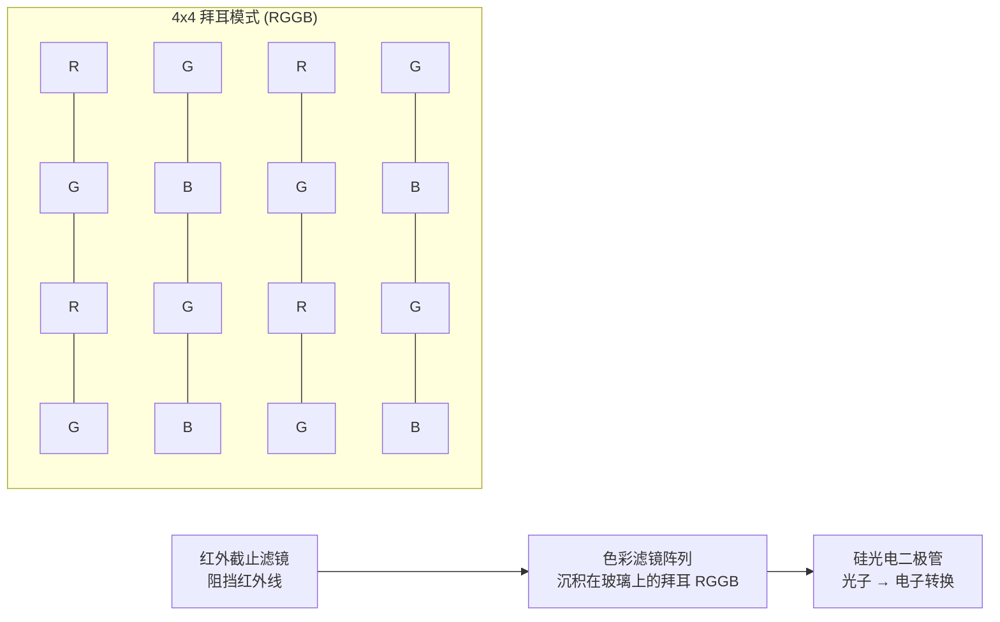
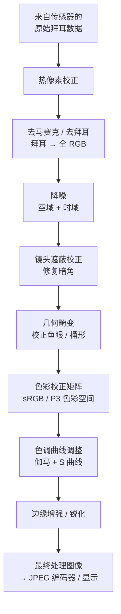
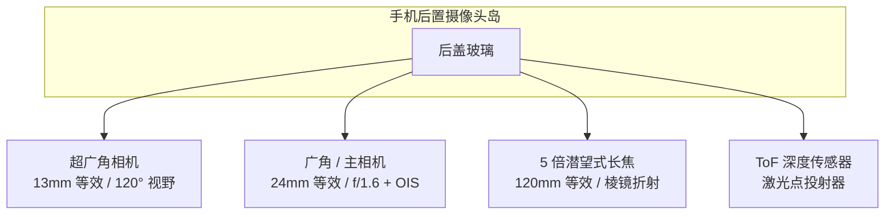
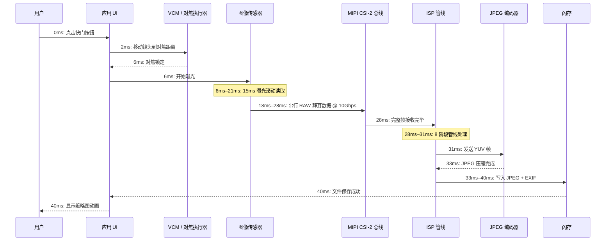

# 第 2 章：理解智能手机相机

在编写任何一行 Camera2 API 代码之前，你必须了解你的代码将要指挥的物理硬件。智能手机相机不仅仅是"对着传感器的镜头"。它是一个紧密集成的、密封的、精密设计的组件，包含光学元件、执行器、滤镜、半导体和高速数据总线。本章将解释从最初捕获光线的玻璃到存储最终照片的闪存芯片的每一个组件。

本章的目标是建立相机管线作为物理系统的思维模型。当后面的章节要求你使用 `CONTROL_AE_TARGET_FPS_RANGE` 或 `SENSOR_SENSITIVITY` 配置拍摄请求时，你将准确了解这些参数影响的是哪部分硬件，以及这些值为什么重要。

## 相机模块：密封的光学组件

当你观察现代旗舰手机（想象一下 Pixel 10 或 Galaxy S26 Ultra）的背面时，你会看到一个从后玻璃凸出 2 到 4 毫米的矩形岛。那个岛不是单个相机。一个矩形岛容纳了三个独立的圆形模块：底部最大的主广角镜头，上方较小的是 3 倍潜望式长焦镜头，左侧中等大小的是 0.5 倍超广角镜头。岛内的每个圆形"凸起"都是一个完整、独立的相机模块。

相机模块是在无尘无缝室中制造的密封单元。它按从外界向内的顺序包含：

1. **保护盖板玻璃**：蓝宝石或大猩猩玻璃窗口，防刮擦，密封模块并阻挡灰尘。
2. **镜筒**：由 4 到 6 个独立的玻璃（有时是塑料非球面）镜片组成的圆柱形堆叠，由薄塑料垫片保持精确对准。
3. **音圈马达 (VCM)**：一种电磁执行器，可沿光轴前后移动整个镜筒（位移不足一毫米），以实现自动对焦。一些高端 VCM 还可以使镜头垂直于轴移动，以实现光学防抖 (OIS)。
4. **红外线 (IR) 截止滤镜**：放置在传感器正前方的薄镀膜玻璃片。它阻挡红外光（硅传感器对其敏感，但人眼不敏感），使记录的颜色与人类感知的颜色相匹配。
5. **传感器芯片**：硅 CMOS 图像传感器芯片本身，焊接到基板上。活动像素阵列朝上对着镜头。
6. **柔性印刷电路 (FPC)**：薄且可弯曲的带状电缆，将功率、地、控制信号 (I2C) 和高速图像数据 (MIPI CSI-2) 从模块传输到手机主板。
7. **板对板连接器**：FPC 末端的微型高密度插头，插入手机主 PCB 上的匹配插座。

对于传统的后置相机，整个组件（从盖板玻璃到连接器）通常厚 5 到 8 毫米；对于潜望式长焦，长度通常为 10 到 14 毫米（在手机内部水平定向）。模块在工厂中单独校准：镜头对齐、传感器倾斜、色彩遮蔽和自动对焦无穷远位置均经过测量并存储在模块本身的 OTP（一次性可编程）存储器中。Camera2 API 在设备启动时读取这些校准数据，因此你的应用无需考虑单元之间的制造差异。

## 镜头：焦距、光圈和防抖

镜头是光线遇到的第一个组件。它的工作是弯曲入射光线，使其精确地汇聚在图像传感器平面上形成清晰的图像。

### 焦距和全画幅等效

焦距决定了视野（画面中能容纳多少场景）和放大倍数（远处物体显示多大）。智能手机相机的规格总是宣传**全画幅等效焦距**。这是一种在不同传感器尺寸之间进行标准化的惯例，以便消费者进行对比。全画幅传感器是历史性地用于 35mm 胶片单反相机的 36mm × 24mm 尺寸。

智能手机上常见的全画幅等效焦距：

- **10–18mm (超广角)**：100° 到 130° 的对角线视野。用于风景、建筑、团体自拍和近距离微距拍摄。
- **22–28mm (广角 / 主摄)**：每部手机上的默认"正常"相机。约 75° 视野，类似于人类的周边视觉，但更平坦。
- **45–80mm (长焦，2 倍到 3 倍)**：30° 到 50° 的窄视野。用于人像（面部比例看起来自然，透视畸变较少）和常规变焦。
- **100–240mm (潜望式长焦，5 倍到 10 倍)**：10° 到 25° 视野。棱镜折射的潜望式设计允许长焦距，而不会使手机厚度达到 2 厘米。

以下是光线穿过典型的 5 镜片广角镜头组件的过程：

### 光圈

光圈是镜头内部光线通过的开口大小。它被描述为 **f 值**（或光圈值）：焦距除以光圈直径。**较小的 f 值意味着更大的孔径，这意味着更多光线**到达传感器。

- f/1.4 到 f/1.8：非常大的光圈。典型的旗舰主摄像头。在弱光环境下表现出色。
- f/2.0 到 f/2.4：中等光圈。大多数手机上的典型超广角和长焦相机。
- f/2.8 到 f/4.0：窄光圈。常见于低成本前置摄像头和一些潜望式模块。

智能手机相机的光圈通常是固定的。2020 年代的一些三星旗舰机型配备了**可变光圈机制**，带有双光圈叶片，可在 f/1.5 和 f/2.4 之间机械切换。这在今天极其罕见，因为基于 VCM 的对焦和多帧计算 HDR 已使可变光圈对大多数用例而言变得不必要。

### 光学防抖 (OIS)

当你拿着手机时，你的手会自然地产生微小的角度抖动——在 1/30 秒内大约为 0.1° 到 0.5°。在足够长的曝光时间内，这种抖动会导致整张图像模糊。**光学防抖 (OIS)** 通过物理移动镜筒（镜头位移 OIS）或传感器芯片本身（传感器位移 OIS）来抵消检测到的运动，从而解决这个问题。相机模块内部的微型陀螺仪（或共享自手机的主 IMU）每秒测量 1,000 到 8,000 次角速度，OIS 执行器据此移动光学元件。OIS 通常可以补偿 3 到 5 档的手抖，这意味着原本需要 1/60 秒才能保持清晰的曝光，现在可以在 1/8 秒或 1/4 秒下拍摄，且清晰度相同。

## 图像传感器：光线如何变成电能

图像传感器是一个硅芯片，包含数百万个称为**光电二极管**的独立光探测器，排列成精确的矩形网格。当今每台智能手机传感器都是 **CMOS（互补金属氧化物半导体）** 类型。

### 像素尺寸和百万像素

每个独立的光电二极管 + 读取电路被称为一个**像素**。每个像素的物理尺寸（以微米 μm 为单位衡量）可以说比总像素数更重要。更大的像素每单位时间捕获的光子更多，这意味着散粒噪声更小，弱光性能更好。

2026 年智能手机中常见的像素尺寸：

- **0.6μm 到 0.8μm**：非常小的像素。用于 1.08 亿到 2 亿像素的高分辨率传感器。这些完全依赖像素合并（Pixel Binning）来获得可接受的噪声水平。
- **1.0μm 到 1.2μm**：中等尺寸。用于 4800 万到 6400 万像素传感器，默认 4 合 1 合并为 1200 万至 1600 万像素输出。
- **2.0μm 到 2.4μm**：大型"旗舰"像素。用于专用 1200 万至 1600 万像素传感器（Google Pixel、iPhone Pro）或作为 4800 万像素传感器在"高质量"模式下的合并输出。

像素合并是在读取过程中将来自相邻 2×2（或 3×3，或 4×4）像素的电荷组合成单个"超级像素"的技术。一个拥有 0.8μm 独立像素的 4800 万像素传感器，当 4 合 1 合并时，表现得像一个拥有 1.6μm 有效像素的 1200 万像素传感器——大幅提高了信噪比。Camera2 API 将全分辨率原始模式和默认合并模式作为独立的流配置暴露出来。

百万像素的计算很简单：一个 4800 万像素传感器拥有约 8,000 × 6,000 的活动光电二极管阵列 = 48,000,000 个独立的光传感器。

### 传感器尺寸分类

传感器尺寸沿用了 1950 年代 Vidicon 电视摄像管基于英寸的旧式表示法。格式为 "1/X 英寸"，其中 X 是除数；X 越小意味着传感器越大：

- 1/3.06" 到 1/2.55"：小型传感器，常用于前置摄像头和廉价超广角（约 5MP 到 13MP）。
- 1/1.7" 到 1/1.3"：大型移动传感器，旗舰主摄像头（48MP、50MP、108MP）。
- 1 英寸 (Type 1)：对于手机来说非常大。见于小米 13 Ultra、夏普 Aquos R 系列和索尼 Xperia Pro-I。活动区域约为 13.2mm × 8.8mm——接近某些微型四分之三 (M43) 相机的尺寸。

在像素数相同的情况下，更大的传感器总是拥有更大的独立像素。这就是为什么"一英寸传感器"手机拍摄的弱光照片明显更好的原因。

### 拜耳色彩滤镜阵列 (CFA)

原始硅光电二极管是色盲的——它只测量总光子强度，而不测量波长。为了记录颜色，制造商在每个独立像素顶部沉积了一个微小的**色彩滤镜**。几乎通用的模式是**拜耳 (Bayer) RGGB 滤镜阵列**：50% 绿色像素，25% 红色和 25% 蓝色，排列成重复的 2×2 单元。人眼对绿光更敏感，因此加倍绿色采样可以提高感知的亮度分辨率和噪声性能。

读取后，传感器数据是独立的红、绿、蓝值的马赛克——还不是全彩图像。为每个像素填充缺失颜色信息的步骤称为**去马赛克 (Demosaicing)**，这是 ISP 执行的第一个主要计算步骤。

### 滚动快门对比全局快门

几乎每台智能手机图像传感器都使用**滚动快门 (Rolling Shutter)**。传感器不会一次性曝光或读取所有像素。相反，它逐行、自上而下、一次一行地曝光并读取像素阵列。一个典型的 4800 万像素传感器完成全帧滚动读取大约需要 15 到 25 毫秒。

滚动快门在拍摄快速移动的物体时会产生特征性的畸变：旋转的飞机螺旋桨或吊扇看起来是弯曲或波浪状的；垂直平移的建筑物顶部和底部倾斜方向相反（视频中的"果冻效应"）。相比之下，全局快门传感器会同时曝光每个像素，并在曝光结束后一次性读取。全局快门用于机器视觉、动作相机和一些专门的前置红外人脸解锁传感器，但全局快门像素设计的光敏度较低且成本较高，因此不用于主智能手机相机。

## ISP：图像信号处理器

**ISP（图像信号处理器）** 是一个专用的硬件块（或者是独立的芯片，或者是当今更常见的——与 CPU 和 GPU 一起集成在主 SoC 中），其唯一工作是将传感器传出的原始、马赛克状、多噪声、畸变的数据转换为视觉上令人愉悦的彩色图像。

ISP 以极高的吞吐量运行固定的、硬连线的图像处理阶段管线。一个运行在每秒 30 帧的现代 4800 万像素传感器每秒向 ISP 发送 14.4 亿个像素。ISP 必须在每帧不到 33 毫秒的时间内处理完所有阶段的每个像素，才能跟上进度。

典型的 ISP 管线阶段按顺序排列为：

1. **热像素校正**：工厂校准的"坏"像素（始终亮或始终暗）被替换为来自邻近像素的插值。
2. **去马赛克 / 去拜耳**：通过使用边缘感知的插值算法，根据周围像素估算每个像素位置缺失的两个色彩通道，将拜耳 RGGB 马赛克转换为完整的 RGB 图像。
3. **降噪（空域 + 时域）**：抑制随机散粒噪声和传感器读取噪声。空域降噪模糊平坦区域，同时保留边缘。时域降噪融合来自先前视频帧的信息（如果可用），以获得更干净的结果。
4. **镜头遮蔽校正（暗角校正）**：由于光线必须以更陡的角度穿过镜头，图像的边缘自然更暗。ISP 应用逐像素数字增益坡度，四角更亮，以平衡照明。该坡度的校准数据存储在模块的 OTP 中。
5. **几何畸变校正**：超广角和鱼眼镜头会产生桶形畸变（直线向外弯曲）。ISP 使用存储的多项式镜头模型重新映射像素坐标，以产生直线看起来确实是直的线性图像。此步骤固有地裁剪了外层 5–10% 的像素环。
6. **色彩校正矩阵 (CCM)**：原始传感器的 RGB 光谱响应与人眼的三色响应不匹配。3×3 矩阵乘法将传感器原生 RGB 转换为标准 sRGB 或 DCI-P3 色彩空间。CCM 系数按模块、按光源（日光、钨丝灯、荧光灯）进行调整。
7. **色调曲线调整**：将非线性 S 形色调映射曲线应用于线性 RGB 数据，以将高动态范围传感器信号压缩为低动态范围输出（通常是 8 位 sRGB 伽马编码）。此步骤使图像具有"质感"——中间色调对比度增加，高光被压缩，阴影被提升。
8. **边缘增强 / 锐化**：应用微妙的反遮蔽锐化，以恢复被降噪和光学低通滤镜软化的高频细节。锐化量经过仔细控制，以避免引入光晕。

ISP 的处理质量是手机制造商之间的主要差异。Google、三星、苹果和小米各自定义其 ISP 管线，具有不同的艺术偏好：有的倾向于自然色彩，有的倾向于高饱和度、"讨喜"的输出，有的倾向于激进的降噪对比保留细节。Camera2 API 允许你控制某些 ISP 阶段的强度（通过 Android 色调映射和色彩校正控件），但大多数详细的阶段参数都被锁定在供应商专有 API 之后。

## RAW 对比 JPEG：从传感器到存储的两条路径

上述 ISP 管线产生处理后的图像。但 Camera2 API 还允许你完全绕过 ISP，直接读取原始传感器数据。这是 RAW 和 JPEG 输出之间的关键区别。

### RAW 格式

**RAW 文件**（在 Android 上通常指 DNG 文件，即数字负片）包含传感器在任何 ISP 处理运行之前测量到的确切内容。它是逐像素 10 位、12 位或 14 位的拜耳马赛克——仍处于原始 RGGB 模式，仍有暗角，仍有噪声，仍是线性的。RAW 文件还包含指定确切色彩滤镜阵列模式、传感器色彩配置文件、黑电平、白电平和镜头模型的元数据标签。

- **位深**：RAW10 = 每个通道 10 位 = 1,024 级。RAW12 = 4,096 级。RAW14 = 16,384 级。相比之下，JPEG 为 8 位 = 256 级。
- **文件大小**：每张 4800 万像素照片 20–40 MB。未压缩或近乎无损压缩。
- **用例**：专业的后期编辑。额外的宽容度允许编辑者"挽救"过度曝光的高光（增加 2 到 3 档 EV）或提升欠曝的阴影而不产生断层。

### JPEG 格式

**JPEG 文件**是 ISP 的"熟成"输出。上述所有 8 个 ISP 阶段都已应用于像素数据。然后，图像从 RGB 转换为 YCbCr 4:2:0 色度抽样色彩空间，并使用有损离散余弦变换算法以大约 10:1 到 20:1 的压缩率进行压缩。

- **位深**：始终为每个通道 8 位 = 每种颜色 256 级。
- **文件大小**：一张 12MP–48MP 照片为 2–5 MB，取决于 JPEG 质量级别。
- **用例**：即时分享、社交媒体，任何照片在拍摄时即"完成"的工作流。在移动编辑器中进行调整会迅速降低图像质量，因为仅剩 256 级。

### 对比表：RAW 对比 JPEG

| 特性 | RAW (DNG) | JPEG |
|:---|:---|:---|
| **应用 ISP 处理** | 无——跳过所有阶段 | 应用所有 8 个阶段且不可逆 |
| **色彩深度** | 10–14 位 (1,024–16,384 级) | 8 位 (256 级) |
| **白平衡** | 在元数据中标记，后期完全可变 | 固化在像素中——仅支持微调 |
| **曝光宽容度** | 可恢复 ±2 到 3 档 | 最多 ±1/2 档，否则出现断层 |
| **文件大小 (48MP)** | 25–40 MB | 3–6 MB |
| **色彩空间** | 传感器原生线性 RGB | sRGB 或 Display P3 伽马编码 |
| **锐化 / 降噪** | 无——编辑者选择 | 已应用；无法撤销 |
| **典型工作流** | Adobe Lightroom / Capture One | 直接分享至 Instagram / 消息 |

## 多摄像头手机：为什么不使用一个巨大的变焦镜头？

传统的傻瓜相机使用单个变焦镜头，带有移动的内部镜组，可连续改变从广角到长焦的焦距。为什么智能手机不能做同样的事情？物理学。一个涵盖全画幅等效 24mm–240mm 且恒定 f/2.8 光圈的 10 倍变焦镜头需要大约 5 厘米（2 英寸）长的光路。智能手机最多只有 0.9 厘米厚。数学上根本不成立。

智能手机行业解决这个问题不是通过变焦镜头，而是通过**多个固定焦距摄像头**，每个摄像头都针对不同目的进行了优化，并使用一个"平滑变焦"计算系统，在特定变焦倍率下从一个摄像头淡入淡出到下一个摄像头。

典型的 2026 年旗舰机后置摄像头岛包含：

1. **超广角 (0.5 倍变焦，约 13mm 等效，约 120° 视野)**：焦距短，景深大。非常适合风景、建筑、团体照，以及通过软件重新定位后的近距离微距拍摄。
2. **广角 / 主摄 (1 倍变焦，约 24mm 等效，约 75° 视野)**：默认相机。最大的传感器，最大的光圈，最好的 OIS。用于 80% 的日常照片。
3. **长焦 / 潜望式 (3 倍到 10 倍光学变焦，约 72mm 至 240mm 等效)**：常规长焦镜头 (3x) 直接位于传感器上方。潜望式长焦 (5x, 10x) 在手机边缘附近使用 45° 棱镜反射 90° 的光线，因此镜筒在手机机身内部水平运行，而不是垂直穿过其厚度。
4. **ToF / 深度传感器**：近红外激光点投射器（或者在 iPhone 上是结构光 LiDAR 扫描仪），向场景发射 30,000+ 个红外点，并测量它们的往返时间以生成逐像素深度图。用于精确的人像虚化、增强现实遮挡和暗光下的快速对焦。

当你在相机应用中执行双指缩放手势时，HAL（硬件抽象层）会在预设的阈值平滑切换活动的物理摄像头。例如，从 0.5 倍缩放到 1.0 倍会从超广角淡入淡出到广角。在 2.9 倍时，应用仍在使用广角相机的数字裁剪。在 3.0 倍时，HAL 将活动源切换到潜望式长焦相机。在这些变焦倍率之间，复杂的图像融合算法同时使用两个相机，以保持无缝过渡。

## 完整旅程：从光子到保存照片的毫秒级记录

以下是智能手机内部单次静态照片拍摄物理过程的完整编号时间线，从用户手指离开虚拟快门按钮的那一刻开始。这些数字代表 2026 年旗舰机在日光下拍摄 12MP 默认模式 JPEG 的情况：

- **0 ms**：用户点击快门。Camera2 API 框架接收到带有 `TEMPLATE_STILL_CAPTURE` 的 `CaptureRequest`。
- **0–2 ms**：3A 算法（自动对焦、自动曝光、自动白平衡）收敛到最终值。
- **2–6 ms**：音圈马达 (VCM) 为其线圈通电，将镜筒物理移动 0.2mm 到 AF 算法计算出的确切对焦距离。
- **6–21 ms (15 ms 曝光)**：全局重置释放传感器像素的电荷。在 15 毫秒内，光电二极管积累光生电子。滚动快门在此窗口期间及之后逐行读取。
- **18–28 ms**：传感器通过 MIPI CSI-2 高速串行总线输出原始拜耳数据。典型配置是 4 条数据通道，每条 2.5 Gbps = 总带宽 10 Gbps，可轻松处理 12MP 帧的原始位深加上消隐间隔。
- **28–31 ms**：ISP 的 8 阶段管线处理该帧：热像素校正、去马赛克、降噪、镜头遮蔽、几何校正、色彩矩阵、色调曲线和锐化。这完全在硬件中发生——在像素级别没有 CPU 参与。
- **31–33 ms**：处理后的 YUV 图像被发送到硬件 JPEG 编码器，该编码器在质量级别 90–95 下应用有损 DCT 压缩，并编写 JFIF 文件头（EXIF、缩略图、GPS 坐标等）。
- **33–40 ms**：完整的 JPEG 数据块通过 MediaStore 内容提供者写入应用的文件夹，例如 `/data/data/com.yourpackagename/files/DCIM/Camera/IMG_20260806_151042.jpg`。MediaScanner 收到通知，照片出现在系统相册中。

对于日光下的静态照片，整个过程从头到尾大约需要 40 毫秒。在弱光环境下，曝光时间本身会延长（夜间模式多帧合成可能需要数秒），时间线会按比例缩放。

## 小结

你现在已经对智能手机相机系统有了完整的物理认识。你知道每个后置摄像头凸起都是一个密封模块，包含带有多个镜片的镜筒、VCM 自动对焦执行器、红外截止滤镜、带有拜耳 RGGB 色彩滤镜阵列的 CMOS 传感器，以及传输 MIPI CSI-2 数据的柔性电缆。你了解焦距等效、光圈和 OIS。你了解 ISP 的 8 阶段管线如何将原始拜耳马赛克转换为成品 JPEG，并且可以区分 RAW（传感器原生、10–14 位、有后期空间）和 JPEG（ISP 处理、8 位、即拍即得）。你了解为什么现代手机使用 3 个以上固定摄像头而不是变焦镜头，并且浏览了一张照片拍摄的确切毫秒级时间线。

## 下一章

在第 3 章中，我们从物理硬件转向该硬件能够产出的内容。我们将探索现代智能手机摄影的现实功能：HDR 多帧包围曝光、通过双摄 / ToF / 机器学习实现的人像虚化、夜景模式多帧长曝光、慢动作高帧率视频捕获、超广角畸变校正和潜望式变焦。你将学习计算摄影——光学、传感器、多帧信号处理和设备端机器学习的融合——如何创造出单镜头/传感器组合自身永远无法产生的图像。
