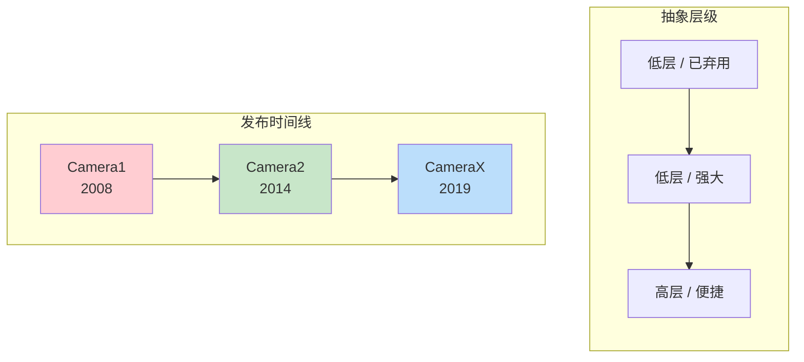
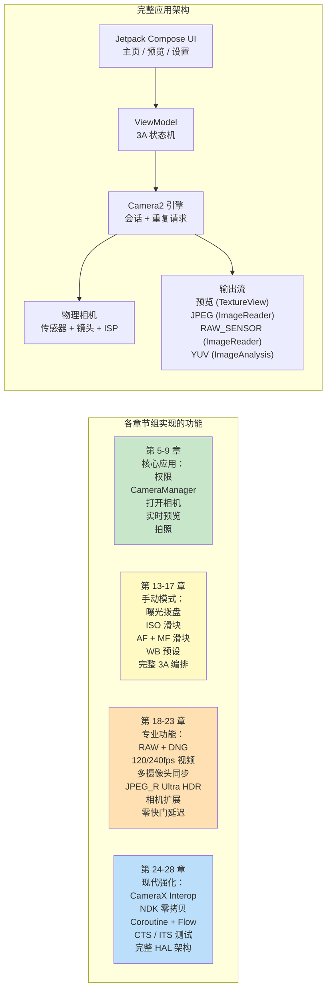

# 第 1 章：欢迎来到 Android Camera2

> **本章概览：** 在这个开篇章节中，我们退后一步，纵览全局。Camera2 为什么存在？与旧版 Camera API 和较新的 CameraX 库相比，它解决了什么问题？谁应该投入时间学习 Camera2？最重要的是，到这个系列结束时你实际会构建出什么？这里没有深入架构，没有 HAL 层，也没有管线图——只有每位开发者在深入之前都会问的那些问题的清晰答案。

***

## 1.1 为什么需要 Camera2？

拿出你的智能手机。

看看背面。你大概会看到两个、三个甚至更多摄像头镜头。那个小小的矩形凸起所容纳的光学和硅片性能，比 2000 年代中期的专业单反还要强大。

现在打开默认相机应用。

点一下快门。瞬间，一张高分辨率照片就存进了你的相册。照片很可能看起来很棒——色彩鲜艳、主体清晰、背景虚化柔和，即使在室内光线下阴影也很明亮。

但你正在使用的相机应用仅仅触及了硬件能力的冰山一角。在友好的快门按钮之下隐藏着一条极其精密的成像管线：它能拍摄 RAW 照片、录制 240 fps 慢动作视频、为一张夜景照片融合 10 帧画面，或者独立控制镜头移动的每一微米。

大多数第三方 Android 应用从未访问过这种能力。为什么？因为**旧版 Android 相机 API（后来被称为 Camera1）极其有限**。Camera1 是为单摄像头手机、基础拍照和录像的世界设计的。它无法：

- 手动控制曝光时间或 ISO
- 捕获 RAW 传感器数据
- 以高帧率录制慢动作
- 同时使用多个摄像头
- 在拍摄过程中访问逐帧元数据
- 可靠地进行连拍

从 **Android 5.0（API level 21）** 开始，Google 引入了 **Camera2（android.hardware.camera2）** 来打破这些壁垒。Camera2 不是一次增量更新——它是一次**彻底的重新设计**，从零开始构建，旨在向每一位 Android 开发者暴露现代相机芯片的原始能力。

简而言之：**Camera2 之所以存在，是因为智能手机摄像头已成为专业级产品，而旧 API 无法跟上步伐。**

***

## 1.2 Camera1 vs Camera2 vs CameraX

十多年的 Android 相机发展催生了**三代**相机 API。在编写一行代码之前，理解哪个 API 解决哪个问题至关重要。

### 三代 API，三种理念

### Camera1 — `android.hardware.Camera`

原始的相机 API，随 Android 1.0 引入，**在 Android 5.0 中被弃用**。

- **模型：** 过程式命令。你调用 `startPreview()`、`takePicture()`、`setFlashMode()` 等方法。
- **设计理念：** "相机是一台你发号施令的状态机。"
- **最适合：** 面向非常老旧设备（Lollipop 之前）的遗留应用。仅此而已。
- **为什么避免使用：** Google 不再更新它。新硬件特性（多摄像头、RAW、HDR）从未回移植到 Camera1。API 表面极小。在现代设备上，Camera1 实际上**由 Camera2 包装器内部模拟**，所以你付出了 Camera2 的复杂性却得不到 Camera2 的好处。

### Camera2 — `android.hardware.camera2.*`

现代低层框架，于 Android 5.0 引入，并在此后的每个 Android 版本中持续扩展。

- **模型：** 请求/响应管线。你构建不可变的 `CaptureRequest` 对象，将它们提交给 `CameraCaptureSession`，并异步接收 `CaptureResult` 元数据 + 图像缓冲区。
- **设计理念：** "相机是一条可编程管线。你控制每一帧的每一个参数。"
- **最适合：** 高级相机应用、手动摄影工具、计算机视觉管线、RAW 拍摄、多摄像头研究、高速视频，以及任何需要接近硬件控制的场景。
- **为什么使用它：** 完全访问 OEM HAL 暴露的每一项能力。直接帧控制。专业功能的唯一 API 路径。CameraX 内部调用的正是 Camera2。

### CameraX — `androidx.camera.*`

一个 **Jetpack 库**（不是平台 API），2019 年以测试版发布，约在 Android 11 时趋于稳定。

- **模型：** 声明式用例。你将一组 `Preview`、`ImageCapture`、`ImageAnalysis` 或 `VideoCapture` 用例 `bindToLifecycle()`，库负责其余工作。
- **设计理念：** "我们已经为你解决了一万个边缘情况。只需告诉我们你需要什么输出。"
- **最适合：** 大多数需要相机的应用。QR/条码扫描器、照片上传、文档扫描、简单录像——任何便捷性和可靠性胜过原始控制的场景。
- **为什么使用它：** 生命周期感知（无资源泄漏）、分辨率选择自动化、OEM 怪癖内置变通方案，完全相同的代码可以在数千款设备型号上运行，且无需任何 `if` 语句。

### 并排对比

| 维度 | Camera1 | Camera2 | CameraX |
|:---|:---|:---|:---|
| **引入版本** | Android 1.0 (2008) | Android 5.0 (2014) | Android 10 (Jetpack) |
| **状态** | 已弃用 | 活跃，持续维护 | 推荐 (Jetpack) |
| **抽象层级** | 低（遗留） | 低 | 高 |
| **学习曲线** | 简单 | 非常陡峭 | 非常平缓 |
| **手动曝光 / ISO / 对焦** | 有限 | 完全控制 | 通过 Interop 有限支持 |
| **RAW 拍摄** | 否 | 是 | 需 Interop 变通 |
| **多摄像头（物理流）** | 否 | 是 | 否 |
| **高速视频（120+ fps）** | 否 | 是 | 有限 |
| **连拍 / 包围** | 否 | 完全控制 | 否 |
| **逐帧元数据** | 否 | 是，完整 + 部分结果 | 通过 Interop 回调暴露 |
| **生命周期安全** | 手动，易出错 | 手动，易出错 | 自动，绑定生命周期 |
| **OEM 怪癖处理** | 无 | 无 | 内置（已测试 1000+ 设备） |
| **可用应用的代码量** | 中等 | 非常高（冗长） | 非常低 |
| **性能** | 尚可（间接包装器） | 最大可能 | 接近最大（轻微开销） |

***

## 1.3 Camera2 能做什么？

为具体理解 Camera2 的能力，想象一下你在旗舰手机上见过的功能。Camera2 让**所有这些都能以编程方式访问**：

### 专业级拍摄

- **全手动曝光：** 从 1/8000 秒到 30 秒调节快门速度，ISO 从 50 到 102,400。构建真正的专业模式 UI。
- **RAW 摄影：** 直接从传感器提取 10 位、12 位、14 位或 16 位**未处理的 Bayer 数据**（无去马赛克、无降噪、无色彩校正）。使用内置的 `DngCreator` 写入 Adobe DNG 文件，用于 Lightroom 编辑。
- **曝光包围：** 以精确步进的 EV 值拍摄 3、5、7 或 9 帧。将它们输入到 HDR 融合算法中。
- **延时锁定：** 在**数千帧**之间冻结曝光、对焦和白平衡——太阳移动或云层飘过时也不会出现闪烁。

### 计算摄影硬件访问

- **高速视频：** 配置 `CameraConstrainedHighSpeedCaptureSession` 以 120 fps、240 fps 甚至 960 fps 拍摄。构建慢动作编辑器。
- **逻辑多摄像头：** **同时**访问一个逻辑多摄像头 ID 下的**两个**物理摄像头。从广角和长焦镜头获取同步的 YUV 帧，以在设备上计算深度图。
- **YUV / PRIVATE 重处理（LEVEL_3 设备）：** 在 ISP 中维护一个全分辨率**环形缓冲区**，然后在按下快门时，从过去抓取一帧并重新运行重型降噪和锐化。这就是 OEM 实现**零快门延迟（ZSL）**的方式。
- **Ultra HDR / JPEG_R（Android 14+）：** 请求并写入 `ImageFormat.JPEG_R` 文件，存储 8 位 SDR JPEG **加上**一个辅助 HDR 增益图。传统查看器看到的是普通照片；HDR 面板可渲染 1,000+ 尼特的高光。
- **相机扩展（Android 12+）：** 将夜景、Bokeh（人像）、HDR 和面部柔化模式**委托给 OEM HAL**——使用与系统相机相同的多帧 AI 管线。

### 高级视频与视觉管线

- **多流并发输出：** 通过单次拍摄请求驱动**预览** Surface、**YUV 分析** Surface（用于以 30 fps 运行的 ML 目标检测）和 **JPEG 静态** Surface——全部无需复制内存。
- **闪光灯时序精度：** 在逐帧基础上精确协调预闪测光、主闪光触发和卷帘快门读出。
- **部分拍摄结果：** 在最终图像缓冲区就绪前**几毫秒**接收 AE 状态和焦距元数据——实现"点击任意位置 UI 即刻更新"的响应速度。
- **离线会话（API 30+）：** 如果用户在夜间模式中途将你的应用切到后台，将进行中的多帧合并交给一个隔离的 `CameraOfflineSession`，HAL 异步完成处理；你的应用醒来即可获得最终照片。

### 这只是开始

每个新的 Android 版本都在扩展 Camera2。Android 15（API 35）增加了 `CameraDeviceSetup`，让你可以**完全不开启传感器**就探查会话配置，将能力检查延迟降低了 10 倍。这个 API 是活的，不断演进，始终领先于最新的相机硬件一步。

***

## 1.4 谁应该学习 Camera2？

正确学习 Camera2 需要时间。API 表面庞大——300+ 个元数据键、数十个回调、多种会话类型，以及数百个 OEM 边缘情况。如果以下任何一条描述了你或你的项目，你就应该投入这段时间：

### 你正在构建高级相机应用

你的应用提供带手动 ISO/快门/对焦/WB 旋钮的**专业模式**。或者它拍摄**RAW 照片**并允许用户导出用于桌面编辑。或者它录制**慢动作视频**。这些功能在 CameraX 中都无法实现（或严重受限）。

### 你正在构建计算机视觉或研究应用

你需要**零拷贝、最低延迟的 YUV 帧**来供给设备上的 ML 管线。或者你需要**帧锁定的传感器数据**（`SENSOR_TIMESTAMP` 中的陀螺仪时间戳必须与图像在 ±1 毫秒内匹配，以实现精确的 SLAM / 视觉惯性里程计）。或者你必须为结构光/深度传感控制**每帧的精确快门时长**。

### 你正在构建相机能力诊断工具

就像本系列的配套应用——**Android Camera Parameters**（[GitHub](https://github.com/zoozooll/AndroidCameraParameters)，[Google Play](https://play.google.com/store/apps/details?id=com.minininja.cameraparams)）——你需要详尽地导出每个 `CameraCharacteristics` 键，以可视化每台设备支持什么。CameraX 有意隐藏了大部分这些细节。

### 你正在调试 CameraX 或 OEM 相机问题

CameraX 确实会在某些冷门设备上出问题。当你的 CameraX 预览被拉伸，或者某个 Galaxy 型号在夜间模式返回绿色画面，或者 Pixel 9 在 `VideoCapture` 上崩溃时，你**必须**下到 Camera2 层来复现和隔离 bug。

### 你从事移动影像、OEM 相机栈或汽车相机管线工作

如果你接触供应商 HAL 代码、`frameworks/av/camera`、Camera NDK，或汽车 EVS→Camera2 迁移——Camera2 的精通是基本要求。

### 谁**不**需要学习 Camera2？

如果你的需求是：*"我需要让用户拍一张头像照片或扫描二维码"*——**使用 CameraX**。认真的。CameraX 是工程杰作。它会为你节省数月的设备兼容性工作。Camera2 是一种专业工具；当确实需要那种能力时再去用它。

***

## 1.5 你将在本书中构建什么

没有代码的理论是抽象的。没有递进的代码是令人困惑的。

在本书中，你将**渐进式构建一个真实、功能完整的 Camera2 应用**。每一章都增加一个功能，每个功能都能在真实手机上编译运行。到最后一章，你将组装出这个完整的应用：

### 里程碑

| 章节范围 | 之后你能做什么 |
|:---|:---|
| **第 1–4 章** | 你理解了硬件。你知道镜头、传感器和 ISP 如何交互。你能阅读任何手机的规格表并说出它支持哪些 Camera2 功能。你已安装 Android Camera Parameters 配套应用并探索了自己的设备。 |
| **第 5–9 章** | 你有了一个**可用的相机应用**。它能打开后置摄像头，在屏幕上显示实时预览，并在你点击快门按钮时保存一张 JPEG 照片。完整的纵横比校正、正确的竖屏旋转和正确的生命周期清理都能正常工作。 |
| **第 10–12 章** | 你理解了代码**为什么**这样工作。你能追踪一个 CaptureRequest 穿过挂起队列、进行中队列、HAL，最后作为 CaptureResult 返回。你知道如何根据报告的实际硬件等级和能力来为功能设置门控。 |
| **第 13–17 章** | 你的应用有了**完整的专业模式**。手动 ISO、快门、焦距和 WB 色温拨盘。实时直方图 / EV 回读。完整的单次 AF → 预捕获 AE → 拍摄序列，精确模拟 OEM 系统相机获得完美结果的方式。 |
| **第 18–23 章** | 你的应用现在是**旗舰级**：同时保存 RAW+JPEG，录制 120 fps 慢动作视频，能拍摄双物理 YUV 流用于人像深度，写入 Ultra HDR JPEG_R 文件，将 Bokeh 和夜景模式委托给相机扩展，并在 LEVEL_3 设备上实现零快门延迟重处理。 |
| **第 24–28 章** | 你是一名**高级 Android 相机工程师**。你能通过 Interop 为 90% 的应用引入 CameraX，同时对需要它的 10% 使用 Camera2。你能编写零拷贝的 NDK 原生相机管线。你将所有回调包装在 Kotlin Coroutines 和 Flow 中，实现干净、可测试的代码。你了解如何编写通过 CTS ITS 的相机测试。你能在白板上画出完整的 应用→Framework→Binder→Native→HAL→Kernel→硬件 栈。 |
| **第 29 章（百科全书）** | 你有了一份桌面参考资料，涵盖 29 个最重要的 `CameraCharacteristics` 键，每个都配有原理解释、Kotlin 查询、Android Camera Parameters 指针和 OEM 陷阱。这一章在你交付生产代码时保持打开。 |

那是一种真正罕见的技能组合。让我们开始这段旅程。

***

## 1.6 小结

- **Camera2** 是现代低层 Android 相机框架，于 Android 5.0 引入，旨在暴露当今多摄像头、ISP 丰富的智能手机的全部能力。
- **Camera1** 已弃用；**CameraX** 对大多数用例很便捷，但隐藏了只有 Camera2 才暴露的能力。你根据需求来选择。
- Camera2 解锁了**手动控制、RAW 摄影、高速视频、逻辑多摄像头、YUV 重处理/ZSL、Ultra HDR、OEM 扩展**和**离线会话**。
- 当你构建专业摄影工具、视觉/研究管线、诊断应用或调试更深层时，投资 Camera2。
- 在本书中，你将**渐进式构建一个功能完整的 Camera2 应用**——从第 9 章的单按钮相机，到第 23 章的旗舰级影像工具，再到第 28 章由现代 Android 模式强化。

## 1.7 下一章

在编写一行 Camera2 代码之前，我们需要理解我们所指挥的硬件。在**第 2 章：理解智能手机摄像头**中，你将学习手机摄像头模块的每个部件实际做什么：镜头、图像传感器、ISP，以及原始光线如何变成压缩的 JPEG。到最后，你会明白为什么包装盒上的"4800 万像素"标签几乎不能说明真实的图像质量。
