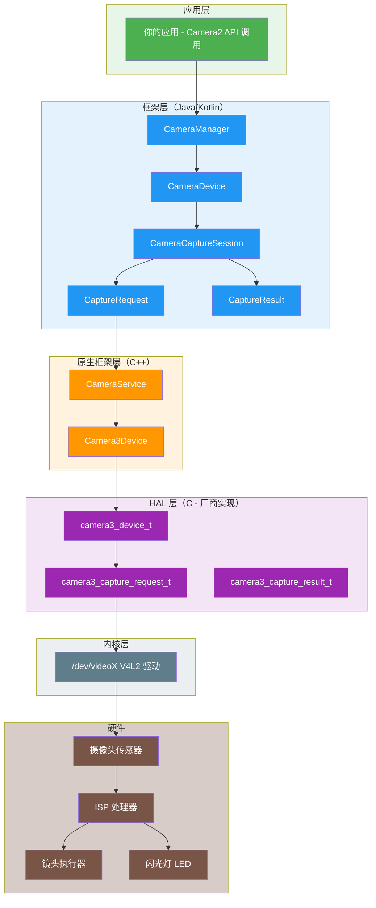
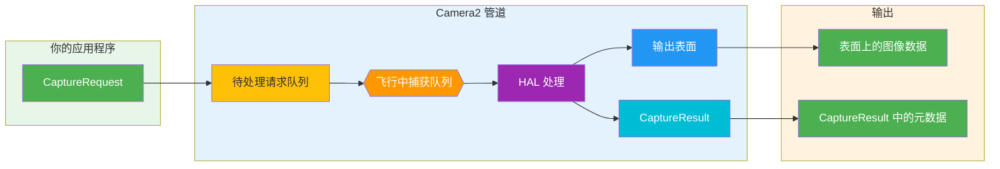
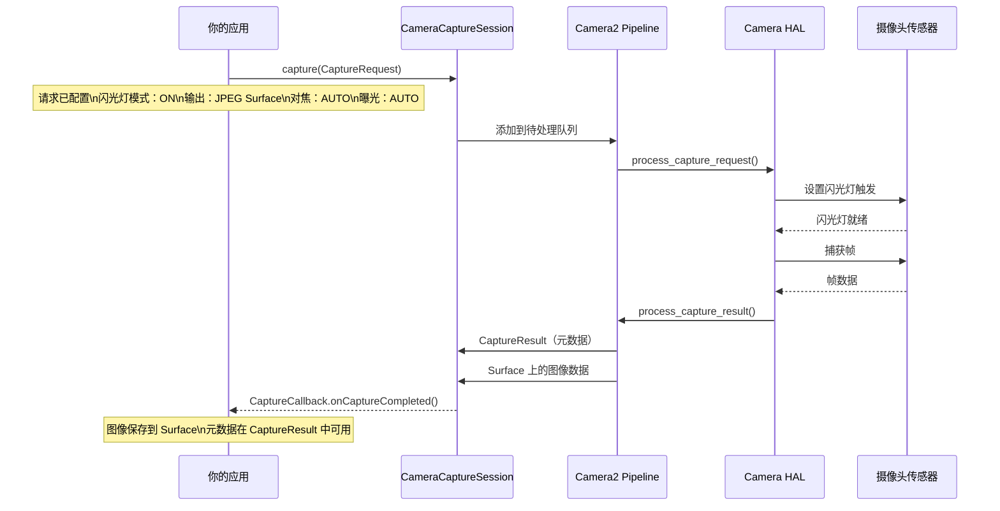
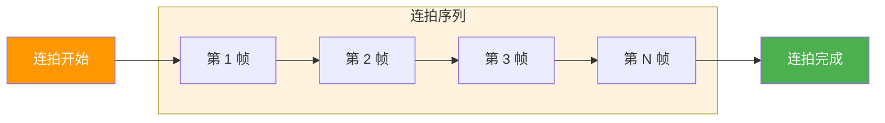
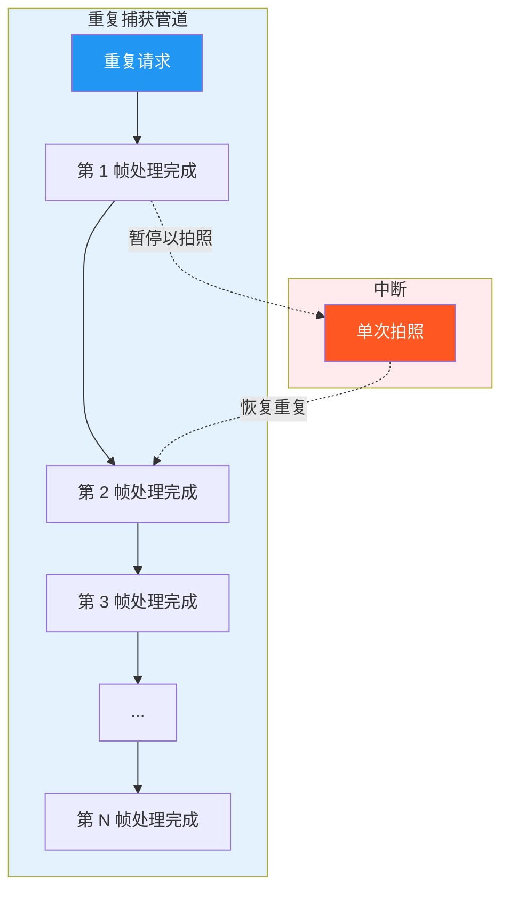
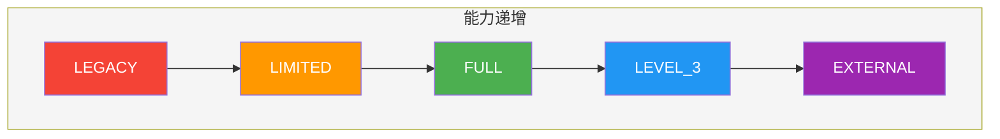
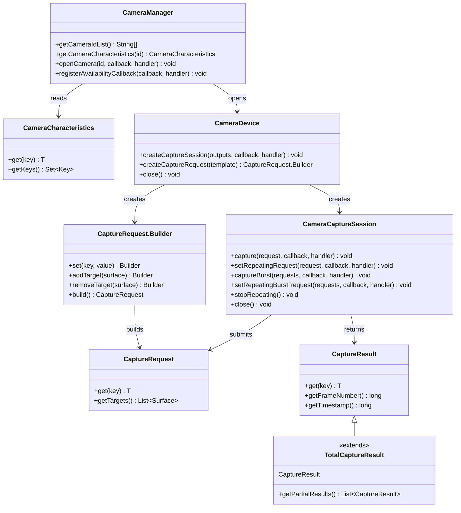
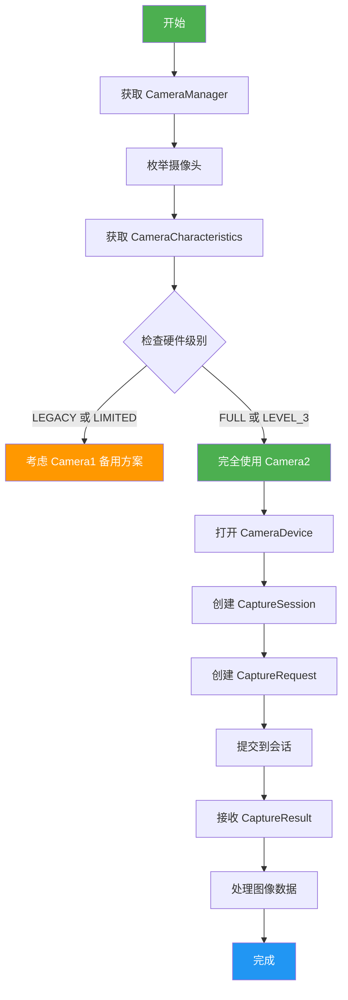
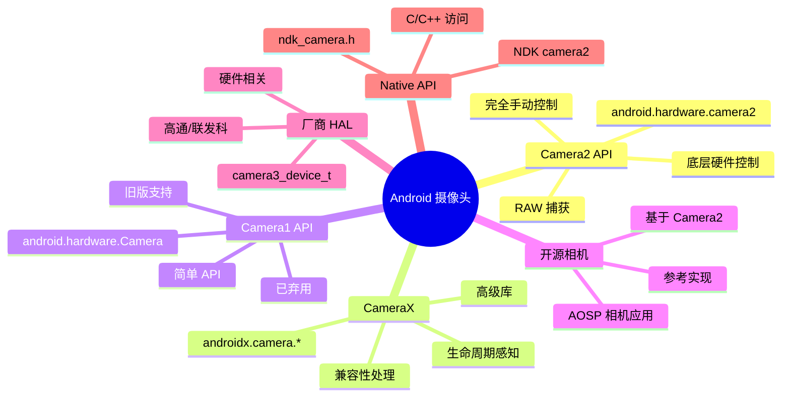

# 第 1 章：欢迎使用 Android Camera2

> **章节概述：** 在本章中，我们将从零开始探索 Android Camera2 的世界。你不仅会理解 Camera2 *是什么*，还会明白它*为什么*被创建、*如何*工作，以及它在 Android 摄像头生态系统中处于什么位置。我们将介绍 Pipeline 模型、捕获类型、硬件级别分类，以及从应用到 HAL 的完整架构。

---

## 1.1 为什么要学习 Camera2？

如今几乎每台智能手机都拥有强大的摄像头系统。一部现代手机可以：

- 通过计算摄影拍摄具有专业外观的照片
- 以高帧率录制 4K 和 8K 视频
- 利用深度感应创建人像效果
- 使用夜景模式在极弱光下拍摄
- 以 960 fps 拍摄慢动作视频
- 为 AR 应用生成 3D 深度信息
- 无缝组合多个摄像头

但当你打开默认的相机应用时，你只看到一个简单的界面：一个快门按钮、一个变焦控件和几个拍摄模式。

在这个简单界面的背后，是一个惊人复杂的系统。相机应用与硬件组件、图像处理器和 Android 框架通信，以生成每一帧画面。

### 谁应该学习 Camera2？

作为 Android 开发者，我们可能想要构建超越默认相机应用的应用程序：

- 一个**手动摄影应用程序**，可以完全控制曝光、ISO 和对焦
- 一个**摄像头测试工具**，供技术人员验证设备能力
- 一个**计算机视觉应用程序**，需要原始帧访问权限
- 一个**3D 扫描应用程序**，使用深度传感器
- 一个**专业视频录像机**，支持编解码器选择和码率控制
- 一个**摄像头能力分析器**，就像我们自己的 [Android Camera Parameters](/zh-Hans) 一样

如果这些场景中有任何一个听起来很熟悉，那么 Camera2 就是你需要掌握的 API。

---

## 1.2 什么是 Android Camera2？

**Android Camera2** 是 Google 在 **Android 5.0（API 级别 21）** 中引入的现代摄像头框架。它取代了最初的 `android.hardware.Camera` API（现被追溯称为 **Camera1**）。

### Camera2 解决的问题

旧版 Camera API（Camera1）是为更简单的世界设计的：单个摄像头、基本拍照和简单视频录制。但智能手机摄像头发生了巨大的演变：

| 时代 | 典型设备 | Camera API |
|-----|---------|------------|
| 2010-2014 | 单摄、基础传感器 | Camera1 |
| 2015-2018 | 双摄、OIS、HDR | Camera2（有限使用） |
| 2019-2022 | 三摄、深度、长焦 | Camera2（标准） |
| 2023+ | 四摄、潜望、LiDAR、UWB | Camera2（必不可少） |

现代设备可能包含多个后置摄像头（广角、超广角、长焦、潜望）、深度传感器，甚至外置 USB 摄像头。它们支持的高级功能包括：

- 手动曝光和对焦
- RAW 图像捕获
- 高速视频录制
- HDR 处理
- 光学防抖（OIS）
- 多摄像头融合

Camera2 的创建就是为了给开发者提供对摄像头硬件的**深度、精确和细粒度控制**。

---

## 1.3 Camera2 vs Camera1 vs CameraX

在深入了解 Camera2 之前，让我们先澄清三个主要摄像头 API 之间的关系。

### Camera1 (`android.hardware.Camera`)

- **引入版本：** Android 1.0（在 Android 5.0 中弃用）
- **模型：** 过程式、有状态、单摄像头导向
- **优点：** 简单、易懂、兼容性广
- **缺点：** 控制有限、不支持 RAW、不支持多摄像头、不支持连拍

### Camera2 (`android.hardware.camera2`)

- **引入版本：** Android 5.0（API 21）
- **模型：** 面向对象、无状态、请求/响应管道
- **优点：** 深度硬件控制、支持 RAW、支持多摄像头、支持高速视频
- **缺点：** 复杂、冗长、需要了解摄像头内部原理

### CameraX (`androidx.camera.*`)

- **引入版本：** Android 10（预发布），Android 11+ 稳定
- **模型：** 声明式、生命周期感知、用例驱动
- **优点：** 易用、自动兼容性、生命周期管理
- **缺点：** 高级控制有限，可能不会暴露所有硬件功能

### 对比表

| 维度 | Camera1 | Camera2 | CameraX |
|-----|---------|---------|---------|
| **级别** | 底层（已弃用） | 底层（当前） | 高层（Jetpack） |
| **难度** | 简单 | 困难 | 简单 |
| **控制力** | 最小 | 最大 | 中等 |
| **RAW 支持** | 否 | 是 | 有限 |
| **多摄像头** | 否 | 是 | 有限 |
| **连拍模式** | 否 | 是 | 否 |
| **手动控制** | 有限 | 完全 | 有限 |
| **最适合** | 旧版应用 | 高级相机应用 | 大多数相机应用 |
| **状态** | 已弃用 | 活跃 | 推荐 |

### 本系列为何专注于 Camera2

虽然 CameraX 是大多数应用的推荐选择，但理解 Camera2 之所以至关重要，原因如下：

1. **CameraX 基于 Camera2 构建** — CameraX 在底层使用 Camera2。理解 Camera2 有助于你理解 CameraX 在做什么。
2. **某些功能仅在 Camera2 中可用** — RAW 捕获、手动传感器控制和高级多摄像头场景需要 Camera2。
3. **调试需要 Camera2 知识** — 当 CameraX 应用未按预期工作时，你通常需要理解底层的 Camera2 行为来诊断问题。
4. **Camera2 理解是基础** — 即使你在应用中使用 CameraX，理解 Camera2 也会让你成为更好的 Android 摄像头开发者。

---

## 1.4 Camera2 架构：总体概览

Camera2 位于 Android 摄像头栈的中间，连接着应用代码和硬件驱动。理解这一架构对于调试和优化至关重要。

### 分层架构



### 架构层说明

| 层 | 位置 | 语言 | 职责 |
|---|------|------|------|
| **应用** | 你的应用代码 | Kotlin/Java | 创建 CaptureRequest，处理 CaptureResult |
| **框架（Java）** | `android.hardware.camera2.*` | Java | 公共 API，管理会话，转换数据 |
| **原生框架** | `frameworks/av/` | C++ | Binder IPC、CameraService、Camera3Device |
| **HAL** | `hardware/libhardware/` + 厂商 | C | 硬件抽象，厂商特定实现 |
| **内核** | `/dev/videoX` | C | V4L2 驱动，硬件通信 |
| **硬件** | 物理摄像头模块 | — | 传感器、ISP、镜头、闪光灯 |

### 关键设计原则：Camera2 是一个 Pipeline

关于 Camera2 需要理解的最重要概念是，它将摄像头操作建模为一个**管道**。每一个动作——预览、拍照、视频录制——都被表达为一个**捕获请求**，流经管道并产生一个**捕获结果**。

---

## 1.5 Camera2 Pipeline 模型

Pipeline 是 Camera2 设计的核心。它用一个无状态的请求/响应模型取代了 Camera1 的有状态、逐一处理的模型。

### Pipeline 如何工作



### Pipeline 组件说明

| 组件 | 描述 |
|-----|------|
| **CaptureRequest** | 一个配置对象，描述*一帧*的捕获。包含所有参数：曝光时间、对焦模式、闪光灯、输出表面等。 |
| **待处理请求队列** | 新的 CaptureRequest 等待处理的 FIFO 队列 |
| **飞行中捕获队列** | 当前正在被 HAL 处理的请求。通常限制为 1-4 个请求，取决于设备 |
| **HAL 处理** | 硬件抽象层处理请求：控制传感器、ISP、镜头等 |
| **输出表面** | 图像被写入配置的 Surface（预览 Surface、ImageReader Surface 等） |
| **CaptureResult** | 关于捕获的元数据：实际曝光时间、AF 状态、时间戳等。不包含图像数据 |

### Pipeline 关键属性

1. **请求是无状态的** — 每个 CaptureRequest 包含所有必要信息。管道没有之前请求的记忆。
2. **处理是顺序的** — 请求由 HAL 按 FIFO 顺序处理。
3. **结果是异步的** — CaptureResult 通过回调到达，而不是同步返回。
4. **每个请求有多个输出** — 一个 CaptureRequest 可以写入多个 Surface（例如，同时预览 + 拍照）。
5. **Pipeline 可以配置** — 你可以选择模板（预览、静态捕获、录制）或完全手动模式。

### 具体示例：使用闪光灯拍照

为了理解 Pipeline，让我们追踪使用闪光灯拍照时发生的过程：



---

## 1.6 捕获类型：单次、连拍和重复

Camera2 定义了三种基本的捕获类型，每种都服务于不同的用例。理解这些对于正确设计相机应用至关重要。

### 类型 1：单次捕获

**单次**捕获只执行一次。它们非常适合单次操作，如拍照或应用一次性设置更改。


**用例：**
- 拍单张照片
- 应用临时闪光灯
- 捕获一帧用于分析
- 触发一次自动对焦

**API 调用：**
```kotlin
cameraCaptureSession.capture(captureRequest, callback, handler)
```

### 类型 2：连拍捕获

**连拍**捕获无间断地连续执行多次。一旦启动，在连拍完成之前不能插入其他请求。



**关键特性：**
- 连拍中的所有帧具有相同或递增差异的设置
- 连拍期间不能处理其他请求
- 连拍队列与待处理请求队列分开
- 优先级高于重复请求

**用例：**
- 连续照片捕获（连拍模式）
- 包围曝光（以不同曝光捕获同一场景）
- 运动分析（捕获快速移动的主体）
- 用于合成的顺序多帧捕获

**API 调用：**
```kotlin
cameraCaptureSession.captureBurst(burstRequests, callback, handler)
```

### 类型 3：重复捕获

**重复**捕获持续执行，形成实时预览和视频录制的基础。当重复请求处于活动状态时，它会在其他捕获之间占据管道。



**关键特性：**
- 同一时间只能有一个重复请求处于活动状态（替换前一个）
- 被单次和连拍请求中断，然后自动恢复
- 形成预览和视频录制的基础
- 不会为每一帧产生单独的 CaptureResult（为效率使用部分结果）

**用例：**
- 实时摄像头预览
- 视频录制
- 持续对焦监控
- 实时帧分析

**API 调用：**
```kotlin
cameraCaptureSession.setRepeatingRequest(captureRequest, callback, handler)
// 或用于视频：
cameraCaptureSession.setRepeatingBurstRequest(burstRequests, callback, handler)
```

### 捕获类型对比

| 特性 | 单次 | 连拍 | 重复 |
|-----|------|------|------|
| **执行** | 一次 | 多次（连续） | 持续 |
| **优先级** | 高 | 最高 | 最低 |
| **中断** | 不可中断 | 不可中断 | 可中断 |
| **队列** | 待处理队列 | 独立连拍队列 | 管道占用 |
| **典型用途** | 拍照、单帧 | 连拍模式、包围曝光 | 预览、视频 |
| **结果回调** | 每次调用一个结果 | 每帧一个结果 | 周期性结果 |

### 捕获模板系统

Camera2 为常见的捕获场景提供了预定义模板：

| 模板 | 描述 | 用例 |
|-----|------|------|
| `TEMPLATE_PREVIEW` | 为实时预览优化 | 相机预览 |
| `TEMPLATE_STILL_CAPTURE` | 为拍照优化 | 拍照 |
| `TEMPLATE_RECORD` | 为视频录制优化 | 视频捕获 |
| `TEMPLATE_VIDEO_SNAPSHOT` | 视频录制时的照片 | 录制时拍照 |
| `TEMPLATE_ZERO_SHUTTER_LAG` | 高质量、最小延迟 | 连拍摄影 |
| `TEMPLATE_MANUAL` | 所有自动控制已禁用 | 完全手动控制 |

模板是预配置常见参数的快捷方式。然后你可以从模板修改各个设置。

---

## 1.7 支持的硬件级别

并非所有 Android 设备都支持完整的 Camera2 功能集。为了解决这个问题，Google 定义了**支持的硬件级别**——一个分类系统，告诉开发者可以从设备的摄像头实现中期待什么。

### 硬件级别分类



### 级别说明

| 级别 | 描述 | Camera2 支持 |
|-----|------|-------------|
| **LEGACY** | 与 Camera1 向后兼容。Camera2 调用在底层转换为 Camera1。 | 仅基本 Camera1 功能 |
| **LIMITED** | 支持部分 Camera2 功能。不保证完整的 Camera2 管道。 | 部分 Camera2 功能 |
| **FULL** | 完整的 Camera2 功能集。完整管道、手动控制、多摄像头。 | 所有 Camera2 功能 |
| **LEVEL_3** | FULL 中的所有功能，加上 YUV 重新处理和额外的输出流。 | FULL + 高级功能 |
| **EXTERNAL** | 类似于 LIMITED，但用于外置摄像头（USB 等）。 | 外置摄像头支持 |

### 如何检查硬件级别

你可以使用 `CameraCharacteristics` 查询硬件级别：

```kotlin
val cameraManager = getSystemService(Context.CAMERA_SERVICE) as CameraManager
val cameraId = cameraManager.cameraIdList[0]
val characteristics = cameraManager.getCameraCharacteristics(cameraId)

val hardwareLevel = characteristics.get(CameraCharacteristics.INFO_SUPPORTED_HARDWARE_LEVEL)
val levelName = when (hardwareLevel) {
    CameraCharacteristics.INFO_SUPPORTED_HARDWARE_LEVEL_LEGACY -> "LEGACY"
    CameraCharacteristics.INFO_SUPPORTED_HARDWARE_LEVEL_LIMITED -> "LIMITED"
    CameraCharacteristics.INFO_SUPPORTED_HARDWARE_LEVEL_FULL -> "FULL"
    CameraCharacteristics.INFO_SUPPORTED_HARDWARE_LEVEL_3 -> "LEVEL_3"
    CameraCharacteristics.INFO_SUPPORTED_HARDWARE_LEVEL_EXTERNAL -> "EXTERNAL"
    else -> "UNKNOWN"
}
Log.d("Camera", "Hardware Level: $levelName")
```

### 实际含义

| 级别 | 对你的应用意味着什么 |
|-----|---------------------|
| **LEGACY** | Camera2 可能可以工作但有局限性。考虑使用 Camera1 作为备用方案。 |
| **LIMITED** | 基本 Camera2 功能可用。某些高级功能可能缺失。 |
| **FULL** | 完整的 Camera2 支持。可以安全使用所有 Camera2 功能。 |
| **LEVEL_3** | 可以使用 YUV 重新处理和高级多流功能。 |
| **EXTERNAL** | 可以支持 USB 摄像头和其他外部输入。 |

### 运行时能力查询

除了硬件级别之外，始终在运行时检查特定能力：

```kotlin
val capabilities = characteristics.get(CameraCharacteristics.REQUEST_AVAILABLE_CAPABILITIES)
capabilities?.forEach { capability ->
    when (capability) {
        CameraMetadata.REQUEST_AVAILABLE_CAPABILITIES_BACKWARD_COMPATIBLE ->
            Log.d("Camera", "Supports backward compatible mode")
        CameraMetadata.REQUEST_AVAILABLE_CAPABILITIES_MANUAL_SENSOR ->
            Log.d("Camera", "Supports manual sensor control")
        CameraMetadata.REQUEST_AVAILABLE_CAPABILITIES_MANUAL_POST_PROCESSING ->
            Log.d("Camera", "Supports manual post-processing")
        CameraMetadata.REQUEST_AVAILABLE_CAPABILITIES_RAW ->
            Log.d("Camera", "Supports RAW capture")
        CameraMetadata.REQUEST_AVAILABLE_CAPABILITIES_PRIVATE_REPROCESSING ->
            Log.d("Camera", "Supports private reprocessing")
        CameraMetadata.REQUEST_AVAILABLE_CAPABILITIES_DEEP_OUTPUT ->
            Log.d("Camera", "Supports deep output")
    }
}
```

---

## 1.8 Camera2 核心类概览

Camera2 的 API 围绕一小组核心类构建。让我们在深入研究每个类之前先认识它们。

### 核心类关系图



### 类职责

| 类 | 包 | 职责 |
|---|---|------|
| `CameraManager` | `android.hardware.camera2` | 顶级系统服务。枚举摄像头，提供对 CameraDevice 的访问。 |
| `CameraCharacteristics` | `android.hardware.camera2` | 只读的摄像头能力元数据。 |
| `CameraDevice` | `android.hardware.camera2` | 表示一个已连接的摄像头。创建会话和捕获请求构建器。 |
| `CameraCaptureSession` | `android.hardware.camera2` | 管道实例。提交 CaptureRequest，管理重复捕获。 |
| `CaptureRequest` | `android.hardware.camera2` | 不可变的捕获配置。一帧的所有参数。 |
| `CaptureRequest.Builder` | `android.hardware.camera2` | 用于创建 CaptureRequest 对象的构建器。 |
| `CaptureResult` | `android.hardware.camera2` | 已完成捕获的元数据输出。 |
| `TotalCaptureResult` | `android.hardware.camera2` | 包含所有部分结果的完整捕获结果。 |

### Camera2 工作流程



---

## 1.9 Camera2 vs Camera1：详细对比

如果你之前使用过 Camera1，你会体会到它们之间的差异。如果你没有，本节将帮助你理解为什么 Camera2 是一次根本性的重新设计。

### 架构对比

| 方面 | Camera1 | Camera2 |
|-----|---------|---------|
| **编程模型** | 过程式（命令式） | 面向对象（声明式） |
| **状态管理** | 有状态（摄像头维护状态） | 无状态（每个请求自包含） |
| **捕获模型** | 命令（takePicture()、startPreview()） | 管道（CaptureRequest → CaptureResult） |
| **线程模型** | 大多数为单线程 | 为多线程使用而设计 |
| **错误处理** | 异常，难以恢复 | 错误码 + 异常，更细粒度 |
| **元数据** | 捕获后只读 | 捕获时实时可用 |
| **多输出** | 不支持 | 一个请求 → 多个表面 |
| **零拷贝** | 不支持 | 通过 ImageReader 支持 |

### API 并排对比

#### 打开摄像头

```kotlin
// Camera1 (旧 API)
val camera = Camera.open()
camera.setPreviewDisplay(surfaceHolder)
camera.startPreview()

// Camera2 (新 API)
val cameraManager = getSystemService(Context.CAMERA_SERVICE) as CameraManager
cameraManager.openCamera(cameraId, object : CameraDevice.StateCallback() {
    override fun onOpened(camera: CameraDevice) {
        mCameraDevice = camera
        // 创建会话和请求...
    }
    override fun onDisconnected(camera: CameraDevice) { camera.close() }
    override fun onError(camera: CameraDevice, error: Int) { camera.close() }
}, handler)
```

#### 拍照

```kotlin
// Camera1 (旧 API)
camera.takePicture(null, null, object : Camera.PictureCallback() {
    override fun onPictureTaken(data: ByteArray, camera: Camera) {
        // 处理图像数据
    }
})

// Camera2 (新 API)
val requestBuilder = mCameraDevice.createCaptureRequest(CameraDevice.TEMPLATE_STILL_CAPTURE)
requestBuilder.addTarget(imageReader.surface)
val captureRequest = requestBuilder.build()
mCameraCaptureSession.capture(captureRequest, object : CameraCaptureSession.CaptureCallback() {
    override fun onCaptureCompleted(session: CameraCaptureSession, 
                                    request: CaptureRequest, 
                                    result: TotalCaptureResult) {
        // result 中的元数据
        val exposureTime = result.get(CaptureResult.SENSOR_EXPOSURE_TIME)
    }
}, handler)
// 图像数据通过 ImageReader.OnImageAvailableListener 到达
```

#### 实践中的关键差异

| 操作 | Camera1 | Camera2 |
|-----|---------|---------|
| **预览 + 拍照** | 必须停止预览才能拍照，然后重新启动 | 可以在不停止预览的情况下拍照 |
| **多张照片** | 一次只能拍一张 | 支持任意数量的连拍模式 |
| **手动曝光** | 不可用 | 完全控制曝光时间和增益 |
| **手动对焦** | 只有预定义模式 | 完全控制镜头位置 |
| **RAW 捕获** | 不可用 | 在 FULL+ 设备上支持 |
| **实时元数据** | 不可用 | 通过部分 CaptureResult 可用 |

### 从 Camera1 迁移的提示

如果你正在从 Camera1 迁移到 Camera2，请记住以下提示：

1. **从 CaptureRequest 的角度思考**，而不是命令。每一个动作——对焦、闪光灯、拍照——都是一个 CaptureRequest。
2. **将预览与捕获分开**。在 Camera1 中，你必须停止预览才能捕获。在 Camera2 中，你在重复请求继续的同时提交一个单独的请求。
3. **使用 Handler 处理回调**。Camera2 回调在 Handler 的线程上运行。始终提供一个以避免 ANR。
4. **先检查硬件级别**。如果设备是 LEGACY，请考虑使用 Camera1。
5. **使用 CaptureRequest 模板**进行常见操作。从模板修改，而不是从头构建。
6. **不要阻塞主线程**。所有 Camera2 操作都应在后台线程上运行。

---

## 1.10 Android 生态系统中的 Camera2

Camera2 不是孤立存在的。它是更大的摄像头相关 API 和库生态系统的一部分。

### 摄像头 API 生态系统



### 何时使用哪个 API

| 需求 | 推荐 API | 原因 |
|-----|---------|------|
| 简单拍照应用 | CameraX | 最简单、兼容性最好 |
| 视频录制 | CameraX | 内置视频支持 |
| 手动摄影 | Camera2 | 完全控制所有参数 |
| 计算机视觉 | Camera2 | 直接帧访问，最小延迟 |
| 多摄像头融合 | Camera2 | 唯一完全支持多摄像头的 API |
| RAW 捕获 | Camera2 | 唯一支持 RAW 的 API |
| 外置摄像头 | Camera2 | 外置摄像头支持（EXTERNAL 级别） |
| 旧版设备支持 | Camera1 | 与旧设备兼容 |

---

## 1.11 使用 Android Camera Parameters 学习

阅读文档很有用，但当你能看到来自真实手机的真实数据时，摄像头能力更容易理解。在整个系列中，我们将使用 [Android Camera Parameters](/zh-Hans) 来探索来自你自己设备的实际摄像头信息。

你可以使用该应用来发现：

- 可用摄像头（ID、朝向、硬件级别）
- 支持的分辨率和帧率
- 传感器信息（有效阵列尺寸、焦距）
- 手动控制支持（ISO 范围、曝光时间范围）
- RAW 能力和格式
- 硬件级别和支持的能力
- 完整的 CameraCharacteristics 转储

与其从抽象示例学习，不如直接研究你自己的设备，看看本章中的概念如何应用于真实硬件。

---

## 1.12 关键要点

恭喜你完成了第 1 章！以下是你应该记住的内容：

### 核心概念

1. **Camera2 是一个管道** — 每个摄像头操作都是一个 CaptureRequest，流经管道并产生一个 CaptureResult。
2. **捕获类型** — 单次（单个）、连拍（多个连续）、重复（持续）
3. **硬件级别** — LEGACY → LIMITED → FULL → LEVEL_3 → EXTERNAL
4. **架构层** — 应用 → 框架 → 原生框架 → HAL → 内核 → 硬件

### 实践原则

1. **始终检查硬件级别** — 并非所有设备都支持完整的 Camera2 功能
2. **在运行时检查能力** — 不要假设功能可用
3. **使用模板进行常见操作** — `TEMPLATE_PREVIEW`、`TEMPLATE_STILL_CAPTURE` 等
4. **在后台线程上运行** — Camera2 操作不得阻塞主线程
5. **将预览与捕获分开** — 使用重复请求进行预览，单次请求进行拍照

### 接下来是什么

在下一章**理解智能手机摄像头**中，我们将暂时离开 Android，探索摄像头硬件本身。你将了解：

- 摄像头传感器技术（CMOS vs CCD）
- 镜头设计和焦距
- ISP（图像信号处理器）处理管道
- 为什么两个具有相似像素数的手机可以拍出完全不同的照片
- 从光线到最终照片的完整图像管道

一旦你理解了硬件，Camera2 概念将变得更加直观。

---

## 1.13 总结

Android Camera2 是一个强大的底层摄像头框架，为开发者提供了对摄像头硬件前所未有的控制。其基于 Pipeline 的架构、三种捕获类型和硬件级别分类，为构建高级摄像头应用提供了坚实的基础。

在本章中，我们介绍了：
- ✅ Camera2 架构和生态系统定位
- ✅ 带有请求/结果流程的 Pipeline 模型
- ✅ 捕获类型：单次、连拍、重复
- ✅ 硬件级别分类和运行时检查
- ✅ 核心类概览和关系
- ✅ Camera1 与 Camera2 的详细对比

现在，让我们在第 2 章深入探讨摄像头硬件本身吧！🚀