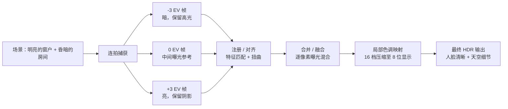
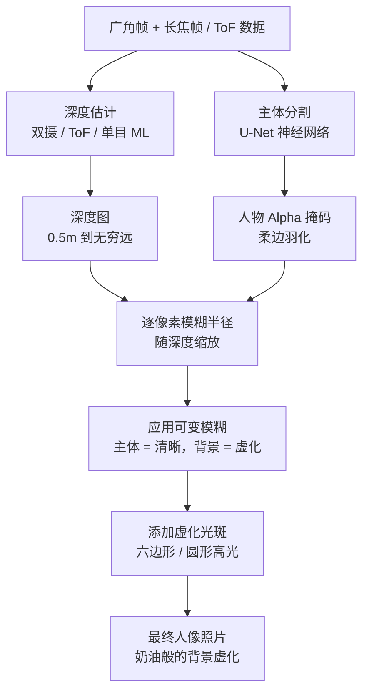
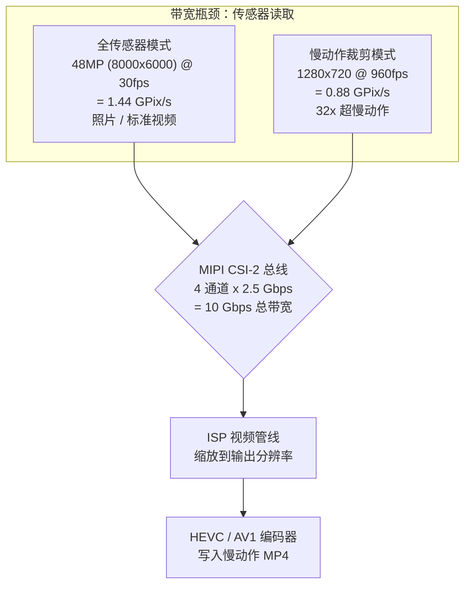
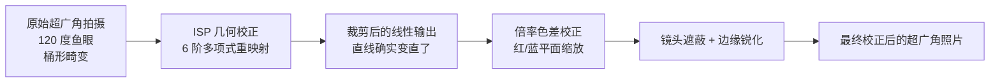
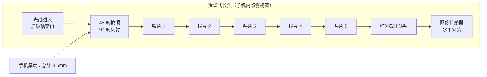
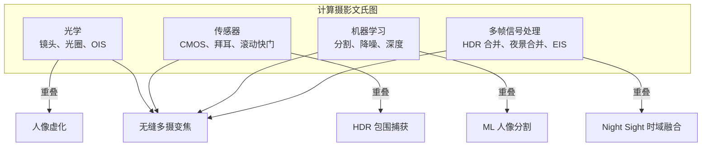

# 第 3 章：现代智能手机摄影

第 2 章介绍了硬件基础：镜头、传感器、ISP 管线和多摄像头模块。本章回答一个随之而来的问题：**现代相机应用究竟如何利用这些硬件制作出我在 Instagram 上看到的那些照片？**

2010 年的智能手机拍摄单次曝光，通过基础 ISP 处理，然后保存 JPEG。而 2026 年的智能手机在拍摄单张静态照片时，通常会捕获 5 到 15 个独立的帧，利用陀螺仪数据将其对齐到亚像素精度，使用多帧信号处理进行融合，通过神经网络进行语义分割或深度估计，最后将其色调映射为单张可分享的图像——所有这一切都在点击快门按钮的一瞬间完成。

本章是对现代智能手机摄影功能的专题巡礼。我们将解释每项功能在硬件 + 软件层面的工作原理，而无需涉及 Camera2 API 代码。目标是建立对现代相机系统能力的认知，以便在以后编写控制这些功能的代码时，了解其底层发生了什么。

## HDR：高动态范围多帧融合

**动态范围**是成像系统在不产生剪裁的情况下，同时记录场景中最亮和最暗部分的比例。得益于扫视适应，人眼一眼可以感知约 20 档动态范围（1,000,000:1 的对比度）。单次智能手机传感器曝光在基础 ISO 下可捕获约 10 到 12 档。这两个数字之间的差距就是 HDR 存在的原因。

假设你在室内拍摄一张照片，主体身后有一扇明亮的窗户。如果你针对人脸进行曝光（例如 1/30s，ISO 400），窗户就会过曝成纯白色——没有天空，没有云彩，没有任何细节。如果你针对窗户进行曝光（1/2000s，ISO 50），人脸就会变成剪影般的黑块。单次曝光都无法满足需求。

### 智能手机 HDR 如何工作

现代手机上的每个 HDR 系统都使用**多帧包围曝光**，然后进行计算融合。算法流程如下：

1. **包围式捕获**：相机以不同的曝光值 (EV) 快速连拍 3 到 10 帧。典型的一组可能包括 -3 EV（极短曝光，保留高光）、-1 EV、+1 EV 和 +3 EV（长曝光，捕获阴影）的帧。在连拍期间，传感器和 VCM 保持静止；仅电子快门时间发生变化。
2. **参考帧选择**：算法选取曝光适中且最清晰的一帧作为几何参考。
3. **图像注册 / 对齐**：每个非参考帧在计算上与参考帧对齐。算法使用 FAST 或 SIFT 等算法寻找特征点（角点、边缘），计算将每个帧的特征映射到参考帧上的仿射或单应变换，并相应地对像素进行扭曲（Warp）。任何因连拍期间微抖动而过于模糊的帧都会被彻底丢弃。
4. **融合**：对于最终图像中的每个像素位置，算法结合来自对齐帧的信息。欠曝像素贡献其清晰、未剪裁的高光数据；过曝像素贡献其低噪声的阴影数据；中间色调像素在所有帧中进行平均以降低散粒噪声。
5. **色调映射**：融合后的线性图像（现在可能包含 14 到 18 档可用的动态范围）通过复杂的局部色调映射算子，压缩成在标准 sRGB 显示器上看起来效果良好的 8 位或 10 位输出图像。

现实示例：Galaxy S26 Ultra 在默认的"场景优化 HDR"模式下，内部会发射 7 个包围帧，总捕获时间约为 0.2 秒。内置的手抖检测会丢弃 2 个模糊帧。剩余的 5 个帧经过对齐、融合和色调映射。在 Android 14+ 设备上，输出结果保存为 **JPEG_R Ultra HDR 文件**：一张标准的 JPEG 主图像（8 位 SDR），带有嵌入的增益图，支持 HDR 的查看器（Android 14 相册、Chrome 120+、Adobe Lightroom）可以使用它在 HDR10 或 Dolby Vision 显示器上重建完整的 10 位 HDR 亮度范围。

### HDR 的适用场景与局限性

HDR 在明暗对比强烈的静态场景中表现出色：风景、逆光人像、带窗户的房间、水上日落。当场景中的物体在包围连拍期间移动时（如飞鸟、挥舞的旗帜、眨眼的人、奔跑的孩子），它会失效——产生重影（Ghosting）伪影。现代 AI 驱动的 HDR 算法会检测并分割移动物体，仅针对这些像素混合参考帧，以避免经典的 HDR"重影"。

## 人像模式：通过深度估计实现虚化

人像模式营造出一种美学效果：主体的面部完美清晰，而背景则消融在奶油般模糊的虚化（**Bokeh**）中。传统相机通过大传感器、宽光圈和长焦距在光学上实现这一效果。智能手机则是通过计算实现的，因为 1/1.3 英寸传感器在 f/1.6 下自然产生的浅景深不足以达到这种效果。

### 智能手机深度估计的三种方法

现代人像系统使用三种独立的技术；许多手机结合了这三者。

**方法 1：双摄像头视差。** 这是最古老且几何上最稳健的方法。手机针对同一主体同时发射广角相机和长焦相机。由于两个相机在物理上相距 10 到 15 毫米（"基线"），它们从略微不同的水平位置观察主体。前景物体在两个视角之间的位置偏移量大于远景物体的偏移量。这种偏移被称为**视差 (Disparity)**。算法在两个校正后的图像上运行块匹配或半全局匹配 (SGM) 算法，为每个像素计算视差值。视差与深度成反比，因此视差图直接转换为逐像素深度图。

**方法 2：ToF / LiDAR 主动深度感测。** ToF（飞行时间）或 LiDAR 深度传感器向场景投射 30,000+ 个近红外激光点的结构化图案，然后测量反射光的往返时间（直接 ToF）或相位差（间接 ToF），以计算每个像素以米为单位的真实度量深度。ToF 即使在完全黑暗的环境和没有纹理的表面（白墙、天空）上也能产生准确、密集的深度图，而在这些场景中视差匹配会失效。现代人像系统通常使用 ToF 作为基础深度提示，并使用视差作为细化信号。

**方法 3：单目 ML 深度估计。** 对于单摄像头手机（或没有配对摄像头的自拍前置摄像头），神经网络从单个 RGB 图像估算深度。该模型在数百万张带有真实深度标签的图像上训练，学习人类判断深度的统计线索：相对大小、遮挡、线性透视、纹理梯度、离焦模糊和大气透视。Google 的 PortraitNet 和 Meta 的 DeepLabV3+ 是典型的架构。单目深度的度量精度低于双摄或 ToF，但足以产生看起来合理的虚化效果。

### 人像渲染管线

获得深度图后，后续步骤无论使用哪种深度估计方法都是相同的：

1. **主体分割**：一个独立的语义分割神经网络（通常是 U-Net 变体）在主 RGB 相机图像上运行，并生成一个柔和的 Alpha 掩码，识别哪些像素属于"人"对比"背景"。掩码在边缘处（特别是头发、眼镜和精细的前景细节周围）进行了羽化处理，以避免 2010 年代早期人像模式那种生硬的"纸娃娃"剪纸感。
2. **深度精炼**：将来自方法 1/2/3 的原始深度图与分割掩码相乘。背景像素保留其深度值；主体像素被锚定到单个焦平面深度。
3. **逐像素可变模糊**：每个背景像素根据其距离焦平面的距离线性缩放高斯模糊（或对于高端"光学模拟"模式，使用物理渲染的镜头内核卷积）的半径。5 米处的背景物体获得重度模糊；1.5 米处的背景物体获得轻微模糊。主体像素保持原样。
4. **仿光学光斑**：高端处理：模糊背景中的明亮镜面高光（路灯、反光、太阳）被渲染为特征性的镜片形状虚化六边形或圆形，而不是简单的模糊团块。这增加了模糊来自真实镜头光圈的错觉。

## 夜景模式：多帧时域融合

2018 年之前，不使用闪光灯的弱光智能手机摄影基本处于不可用状态。昏暗的酒吧或夜晚的城市街道会产生充满噪点、颗粒感和模糊的废片。随后 Google 在 Pixel 3 上发布了 **Night Sight**，一切都改变了。其核心思路反直觉：与其进行 1 秒钟的长曝光（这会因为手抖而产生无法挽回的模糊），不如拍摄 15 个非常短的 1/15 秒曝光（由于 OIS 开启，每个帧本身都很清晰），然后通过算法对齐并取平均值。总合成曝光时间仍为 1 秒，但单帧曝光时间短到手抖模糊不会累积。

### 夜景模式算法步骤

1. **连拍捕获**：相机捕获 8 到 15 个 RAW 帧。每帧使用适中的曝光时间（通常为 1/15s 到 1/8s）和适中的 ISO（800 到 3200）。单个帧有噪点但没有模糊。连拍总耗时 0.5 到 2 秒。
2. **陀螺仪辅助 EIS 对齐**：手机主 IMU 陀螺仪在连拍期间以 8,000 Hz 记录角速度。对于每一帧，计算其相对于参考帧的累积旋转和平移。随后，每个 RAW 帧在 NPU 上进行数字平移、旋转和微调缩放（电子防抖，EIS），达到亚像素精度，即使用户的手移动了几个全像素的距离，也能与参考帧完美套准。
3. **时域像素融合**：对于 12 个对齐帧中的每个像素位置，算法收集 12 个候选像素值。随后执行稳健的统计合并，而非简单的平均：识别并丢弃离群值（由热像素、宇宙射线袭击或穿过该点的汽车大灯引起）。对剩余的一致值取平均值，可降低高斯散粒噪点，其程度等于保留帧数的平方根。12 帧融合可将噪点降低 3.5 倍。
4. **空域降噪**：基于 CNN 的降噪器（专门在原始夜间图像上训练）消除任何剩余的高频噪点，同时保留真实的边缘和纹理。
5. **局部色调映射**：融合后的原始图像具有极高的动态范围。局部变化的色调映射算子（基于双边滤波或学习的 CNN 色调图）在不使城市灯光过曝的情况下提升阴影，增强暗区的色彩饱和度（否则看起来会褪色），生成最终看起来明亮干净而非昏暗模糊的 8 位图像。

三星的 "Nightography"、苹果的 "Night Mode"、小米的 "Night Mode 2.0" 和 OPPO 的 "Ultra Dark Mode" 基本都使用相同的算法架构。差异存在于确切的帧数、稳健合并统计量的选择、降噪器架构和色调映射风格，但这种经过陀螺仪对齐的多帧时域平均在行业内是通用的。

## 慢动作：高帧率裁剪捕获

慢动作视频通过以比标准 30 fps 播放速率更快的速率捕获视频帧，然后以正常的 30 fps 速度播放，从而拉长了时间。常见的倍率有：

- **120 fps 捕获 → 30 fps 播放 = 4 倍慢动作**。现实世界中 1 秒钟的事件变成 4 秒钟的视频。
- **240 fps → 30 fps = 8 倍慢动作**。
- **960 fps → 30 fps = 32 倍超慢动作**。水滴溅起、气球破裂或蜂鸟扇动翅膀变得清晰可见。

### 为什么 960 fps 需要传感器裁剪

高帧率捕获的瓶颈在于**传感器读取带宽**。图像传感器拥有有限数量的 MIPI CSI-2 通道，以固定的最高数据速率运行（通常为每通道 2.5 Gbps，4 通道 = 总计 10 Gbps）。传感器每秒只能输出这么多像素。

- 以 960 fps 读取完整的 48MP (8000×6000) 帧需要 48,000,000 × 960 = 每秒 460.8 亿个像素。这超过了任何 2026 年智能手机传感器实际读取带宽的 30 倍。
- 因此，要达到 960 fps，传感器必须仅读取其像素阵列的小型中心裁剪区域。960 fps 模式通常是 1280×720 (720p HD) 或有时是 1920×1080 (1080p FHD) 的裁剪。总像素带宽变得可控：1280×720×960 fps = 每秒 8.84 亿像素，即使采用每像素 10 位编码也能轻松塞进 10 Gbps。

实践中的数字：960 fps 捕获 × 现实时间 0.3 秒 = 288 个独立帧。以 30 fps 播放 = 9.6 秒流畅的慢动作视频。一些索尼 Xperia 和三星 Galaxy 旗舰手机通过仅在中心裁剪区域读取传感器的有限模数转换器 (ADC) 组，支持在 1080p 分辨率下进行短暂的 960 fps 连拍。

慢动作模式通常还采用交错 HDR 技术，其中传感器的交替行以不同时长曝光，以即使在 240 fps 或 960 fps 下也能保持高动态范围。

## 超广角：畸变校正与边缘质量

现代旗舰机上的超广角相机提供 10–18mm 的全画幅等效焦距和 100° 到 130° 的对角线视野。它开启了标准广角相机无法实现的构图可能性：波澜壮阔的风景、足不出户就能拍全整座大楼的建筑照、真正能容纳所有人的团体自拍，以及有趣的"近距离透视畸变"效果（靠近镜头的物体相对于背景显得异常巨大）。

然而，超广角焦距带来了三个特征性的光学缺陷，ISP 必须在照片可用之前对其进行校正：

1. **几何（桶形）畸变**：直线向外弯曲，就像鱼眼镜头的边缘。矩形门框的照片看起来会呈枕形或桶形。ISP 的几何畸变校正阶段（见第 2 章）使用专门针对该模块校准的 4 阶或 6 阶多项式镜头模型应用逐像素坐标重映射。校正必然会裁剪传感器阵列的外围 5–10%，因为重映射将这些外围像素推到了画布之外。
2. **倍率色差 (LCA)**：镜头对不同波长的光弯曲程度略有不同，因此同一轴外点的红、绿、蓝图像会落在略有不同的像素坐标上。结果是在靠近角落的高对比度物体上出现可见的色彩边缘（紫色/绿色边缘）。ISP 通过对红、蓝色彩平面应用相对于绿色略有不同的放大倍率来校正 LCA。
3. **暗角 / 角落软化**：角落像素接收到的光线显著少于中心像素（由于镜头的 cos⁴θ 自然衰减以及镜筒的机械遮挡），且镜头的光学 MTF（调制传递函数）在极端角度下较低，因此角落看起来很软。镜头遮蔽校正阶段应用径向对称的增益提升来平衡照明，并对角落应用比中心更激进的边缘感知锐化滤镜。

## 长焦：标准对比潜望式

长焦相机用于拍摄广角相机无法分辨的远距离主体。现代手机采用两种截然不同的长焦设计。

**标准长焦（2 倍到 3 倍光学变焦）：** 这是一个常规相机模块：镜筒垂直于手机后盖，直接位于图像传感器上方，与广角相机完全一样，但焦距更长。3 倍长焦约有 72mm 全画幅等效焦距。物理堆叠受限于手机厚度 (7–9mm)，因此镜头长度不能超过这个值。因此，常规长焦模块的实际上限约为 3 倍。

**潜望式长焦（5 倍到 10 倍光学变焦）：** 为了在不增加手机厚度的情况下获得更长的焦距，工程师使用棱镜将光路折射了 90°。光线穿过手机边缘或后玻璃的窗口，击中 45° 直角棱镜，侧向反射 90°，然后水平穿过与手机主板平行的 10–14mm 长的多镜片镜筒，最后落在侧向安装在 PCB 上的图像传感器上。棱镜本身安装在 2 轴 OIS  Jiménez 云台上，传感器有时也安装在独立的传感器位移 OIS 上，提供总计 4 轴或 5 轴的防抖——足以让手持拍摄远处建筑物标识上的文字也能保持清晰。

在物理摄像头之间的变焦边界（例如 2.9 倍仍从广角相机数字裁剪，而 3.1 倍使用 3 倍潜望长焦），HAL 会执行多摄像头融合技巧：在切换点前后约 ±0.2 倍范围内，它同时捕获两个摄像头并执行按变焦倍率加权的淡入淡出，这样用户在活动物理摄像头切换时永远不会看到明显的"跳动"。

## 微距：极端近距离摄影

微距摄影捕获小物体的极端近景：花瓣的纹理、昆虫的复眼、织物的纤维、饼干上的单个糖晶。

现代手机中存在两种微距策略：

**专用微距相机：** 预算型和中端手机通常配备一个小型的、低分辨率（2MP 到 5MP）专用微距模块，带有固定焦距的短焦镜头。该模块针对特定的最小对焦距离（通常为 2–4 cm）进行调优，尽管分辨率较低，但仍能产生令人惊讶的清晰微距图像。主要缺点是传感器很小，因此在明亮的日光以外的任何环境下画质都会急剧下降。

**超广角兼任微距：** 旗舰手机（Google Pixel、三星 S 系列 Ultra、iPhone Pro）不配备专用微距相机。相反，它们重新利用了超广角相机。超广角镜头短焦距 (13mm eq) 的特性使其具有非常短的最小对焦距离——通常距离主体仅 1 到 2 厘米。当用户点击"微距"模式或相机应用通过 ToF 传感器或相位检测 AF 测距仪检测到近距离物体时，应用会切换到超广角，将 VCM 驱动到最小对焦位置，应用额外的几何畸变校正（因为主体现在处于场曲极端位置，其多项式重映射与无穷远校准有显著差异），并裁剪超广角传感器的中心以生成最终的微距帧。大型 12MP–50MP 超广角传感器提供的微距画质比 5MP 专用模块好得多。

## 计算摄影：统一的哲学

上述功能——HDR、人像、夜景模式、慢动作、超广角校正、潜望变焦融合、微距——都共享一个统一的想法。**计算摄影**是一种哲学，认为相机传感器、ISP、陀螺仪/IMU、NPU（神经网络处理器）和多帧信号处理算法可以协同工作，创造出任何单镜头/传感器组合（无论镜头多么昂贵）都无法独立产生的图像。

经典的单反模型是：光线 → 镜头 → 传感器 → 存储。智能手机模型是：光线 → 多个镜头 → 多个传感器 → 陀螺仪/IMU → 多帧连拍捕获 → NPU 神经推理 → 逐像素决策融合 → 复杂的色调映射 → 存储。两者的起点和终点相同，但智能手机在中间插入了数十个额外的计算步骤，每个步骤都以光学手段无法实现的方式改进了最终结果。

在 Galaxy S26 Ultra 上从 0.5 倍无缝缩放到 10 倍是计算出来的：HAL 在五个变焦切换点混合了具有三个不同焦距的三个不同相机。挽救一张主体后的窗户不再过曝的逆光人像也是计算出来的：7 帧 HDR 融合。一张原本需要三脚架和 30 秒长曝光才能拍到的银河夜景也是计算出来的：12 帧陀螺仪对齐时域融合。本章描述的每一项功能都是计算摄影。

这是带入后续 Camera2 API 章节的最重要思想。Camera2 API 不仅仅是一个"拍张照"的工具。它是一个低级控制接口，让你的应用可以发射精确的多帧连拍、读取每帧的陀螺仪元数据、选择在哪个变焦倍率下发射哪个物理相机，并将帧流经设备上的神经网络——这些都是实现你自己的计算摄影功能的基石。

## 小结

在本章中，你学习了现代智能手机摄影功能背后的现实算法。HDR 使用 3–10 帧包围曝光、逐帧基于特征的对齐以及色调映射，以捕获传感器在单次曝光中无法看到的动态范围。人像模式通过双摄像头视差、ToF 激光测距或单目 ML 深度估计计算逐像素深度图，然后运行 U-Net 主体分割并应用随深度缩放的可变逐像素高斯模糊。夜景模式捕获 8–15 次短曝光，使用陀螺仪辅助的 EIS 进行对齐，应用稳健的时域像素融合将噪点降低 3.5 倍，并对结果进行局部色调映射。960 fps 的慢动作视频必须裁剪传感器，因为 MIPI 读取带宽是硬瓶颈。超广角照片在变为可见之前，要在 ISP 中进行几何畸变校正、倍率色差校正和角落遮蔽校正。潜望式长焦相机使用 45° 棱镜将光路折射 90°，在 8.5 毫米厚的手机中放入 10 倍光学镜头。你学习了计算摄影的定义：光学、传感器、机器学习和多帧信号处理的融合，以创造超出任何单镜头/传感器系统能力范围的图像。

## 下一章

第 4 章是动手实践章节。你将从源代码或 Google Play 安装 **Android Camera Parameters** 配套应用，在自己的手机上运行它，并检查自己的硬件究竟具备哪些能力。你将学习读取相机 ID 和朝向，检查每个摄像头的硬件级别（LEGACY / LIMITED / FULL / LEVEL_3），枚举支持的输出格式（JPEG, YUV_420_888, PRIVATE, RAW_SENSOR, JPEG_R Ultra HDR），查找最大慢动作 FPS 范围，探索变焦倍率以及手机物理摄像头之间的切换点，并检查主传感器是否支持 RAW 捕获——为你自己的设备记录下这些答案，因为这些答案决定了你自己的 Camera2 API 应用在该手机上能做和不能做的事情。
