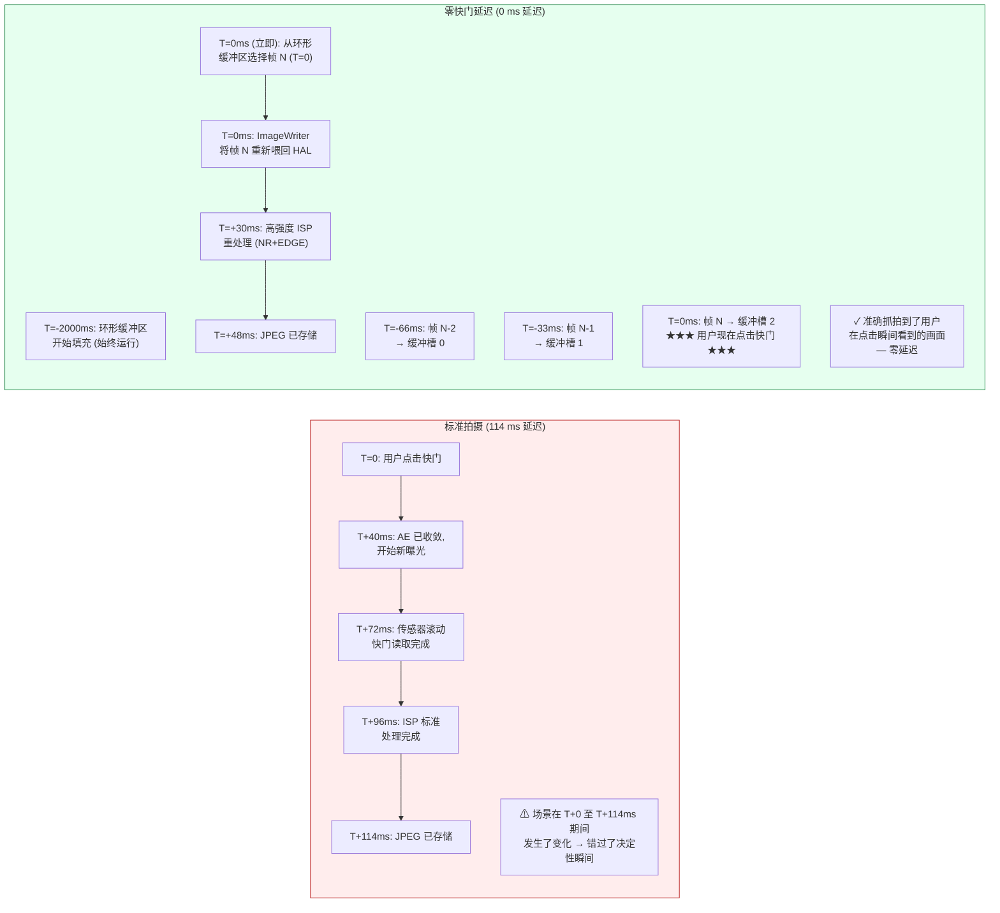

# 第 23 章：零快门延迟与重处理

普通相机应用中单项最令用户沮丧的缺陷就是**快门延迟**：点击快门按钮，拍到的照片却是点击后 200–800 毫秒才出现的画面——孩子已经停止了微笑，鸟儿飞离了枝头，跑车已经开出了画幅。标准的 Camera2 会话设计上就是这样运行的：点击快门触发 `session.capture()`，进而触发 AE 收敛，再触发一次新的传感器曝光，最后触发 ISP 处理。每一步都增加了延迟。

**零快门延迟 (Zero Shutter Lag, ZSL)** 通过以静态拍摄分辨率持续运行传感器，在内存中的环形队列中缓冲最近的 N 帧来消除这种延迟，当用户点击快门时，**捕获点击瞬间可见的帧**，而不是半秒后的帧。这种魔力来自于 **Reprocessing (重处理) API**：你不是让光线再次穿过传感器，而是从环形队列中取出一个已经曝光的 YUV 或 PRIVATE 缓冲区，通过 `ImageWriter` + `InputConfiguration` 将其**重新传回** ISP，然后像对待新鲜捕获的帧一样，对其运行高强度的降噪和边缘增强。

本章遵循项目研究文档《ZSL / 重处理》部分中精确的 **4 步 ZSL 工作流**，并且还涵盖了 **`switchToOffline()`** —— 这是一个 Android 12 (API 31) 的 API，它可以将重处理管线转移到后台 HAL 服务，这样即使你的应用被杀死（按下主屏幕键、来电），用户仍能得到他们的照片。你可以通过 **Android Camera Parameters** 应用（[Google Play](https://play.google.com/store/apps/details?id=com.zoozooll.cameraparameters)）验证你的设备支持哪些重处理能力 (`REQUEST_AVAILABLE_CAPABILITIES_YUV_REPROCESSING`、`PRIVATE_REPROCESSING` 或 `INFO_SUPPORTED_HARDWARE_LEVEL_LEVEL_3`)；"ZSL Support" 选项卡会交叉比对所有必需的性能并报告清晰的是/否判定。

## 为什么 ZSL 很难（以及为什么重处理存在）

首先，根据研究文档的测量数据，量化一台 2023 年旗舰机（骁龙 8 Gen 2）标准非 ZSL 静态拍摄的延迟：

| 管线阶段 | 延迟 | 注记 |
|----------------|---------|-------|
| AE 收敛触发 → 编程新的曝光 | 40 ms | `CONTROL_AE_PRECAPTURE_TRIGGER` |
| 滚动快门读取 (12 MP 全帧) | 32 ms | 标称 1/30 s；从第一行到最后一行实际耗时 32 ms |
| ISP 去马赛克 + 标准降噪 + 色彩 | 24 ms | 标准质量管线 |
| JPEG 编码 (12 MP, 质量 95) | 18 ms | 硬件 JPEG 编码器 |
| **标准拍摄总延迟** | **~114 ms** | 最佳情况；负载下常见 200–800 ms |

在现实条件下（热节流、来自 UI 的 GPU 竞争、执行任务的后台应用），标准路径通常会达到 500 ms 的延迟。一个 5 岁的人在奔跑时 500 ms 可以移动 40 厘米——这就是拍到笑脸与拍到后脑勺的区别。

ZSL 通过反转管线顺序解决了这个问题：不是拍摄 → 处理 → 存储，而是 **持续拍摄 → 缓冲 → 点击 → 重处理 → 存储**。传感器和 ISP *始终* 以静态拍摄的分辨率运行；用户点击只需选择哪一帧已经存在的帧进行完整处理。



Mermaid 图展示了这种概念上的转变：在标准路径中，点击*发起*捕获；在 ZSL 路径中，点击*选择*已经发生的捕获。从点击到存储文件总共仍需约 48 ms（重处理并非免费），但**像素内容来自 T=0（即时），而不是 T=114 ms（延迟）** —— 这才是"零快门延迟"的真谛。它是内容的零延迟，而不是输出文件的零延迟。

## 强制性能门槛（根据研究文档）

ZSL + 重处理需要 HAL 层的硬件配合。在尝试创建可重处理的会话之前，你必须检查以下三个条件**之一**是否满足：

| 性能检查 | 何时通过 | 支持的设备 |
|------------------|----------------|--------------------------|
| **A)** `INFO_SUPPORTED_HARDWARE_LEVEL == LEVEL_3` | 允许以 StreamConfigurationMap 中的任何尺寸进行完全重处理 (YUV 和 PRIVATE)。 | 2016+ Google Pixel (历代); 2021+ 三星 Galaxy S/Ultra (骁龙版); 2023+ 一加 11/OPPO Find X6 Pro。 |
| **B)** `REQUEST_AVAILABLE_CAPABILITIES 包含 YUV_REPROCESSING` | YUV_420_888 缓冲区可以在部分尺寸下通过 InputConfiguration 传回。 | 2019+ 骁龙 8xx/7xx 设备; 多数天玑 9000+ 设备。 |
| **C)** `REQUEST_AVAILABLE_CAPABILITIES 包含 PRIVATE_REPROCESSING` | 可以传回 `ImageFormat.PRIVATE` 缓冲区 (不透明, 存储在供应商压缩格式中)。由于其使用的内存减少 2 倍，请优先使用此项。 | 骁龙 888+ / Exynos 2100+ 及更新型号。 |

> 研究文档规则 ZSL-1：**如果 A/B/C 均未通过，请回退到非 ZSL 的标准拍摄。** 不要尝试通过自定义 JPEGs 环形缓冲并重新解压来实现；由于双重编码，这会产生 6 dB 的画质损失，不能替代真正的重处理。

使用以下方式查询门槛：

```kotlin
import android.hardware.camera2.CameraCharacteristics
import android.graphics.ImageFormat

enum class ZslSupport { NONE, LEVEL3, YUV_REPROC, PRIVATE_REPROC }

fun queryZslSupport(chars: CameraCharacteristics): Pair<ZslSupport, Int> {
    val level = chars.get(CameraCharacteristics.INFO_SUPPORTED_HARDWARE_LEVEL)
        ?: CameraCharacteristics.INFO_SUPPORTED_HARDWARE_LEVEL_LEGACY
    val caps = chars.get(CameraCharacteristics.REQUEST_AVAILABLE_CAPABILITIES)
        ?: intArrayOf()

    return when {
        level == CameraCharacteristics.INFO_SUPPORTED_HARDWARE_LEVEL_3 ->
            Pair(ZslSupport.LEVEL3, ImageFormat.PRIVATE) // 优先选 PRIVATE 以节省内存
        caps.contains(
            CameraCharacteristics.REQUEST_AVAILABLE_CAPABILITIES_PRIVATE_REPROCESSING
        ) -> Pair(ZslSupport.PRIVATE_REPROC, ImageFormat.PRIVATE)
        caps.contains(
            CameraCharacteristics.REQUEST_AVAILABLE_CAPABILITIES_YUV_REPROCESSING
        ) -> Pair(ZslSupport.YUV_REPROC, ImageFormat.YUV_420_888)
        else -> Pair(ZslSupport.NONE, ImageFormat.UNKNOWN)
    }
}
```

## ZSL + 重处理 4 步工作流（根据研究文档）

项目研究文档规定了精确的 4 步管线。每一步都是强制性的；跳过任何一步都会导致会话破裂（掉帧、抛出 `IllegalStateException` 或重处理输出质量等同于预览画质）。

---

### 第 1 步：使用 ImageReader + CONTROL_CAPTURE_INTENT_ZERO_SHUTTER_LAG 进行环形缓冲

首先，创建一个高分辨率的 `ImageReader`（即 "ZSL 缓冲区"），其 `maxImages` 参数即为环形深度（通常为 8–16；研究文档建议内存受限设备设为 8，RAM ≥ 8 GB 的设备设为 16）。为每一个重复请求标记 `CONTROL_CAPTURE_INTENT_ZERO_SHUTTER_LAG` —— 这告诉 HAL 使用最短的预览管线，并禁用预览特有的优化，因为这些优化会损害重处理输出的质量（例如，会留下运动重影伪影的重度时域降噪）。

```kotlin
import android.hardware.camera2.CameraDevice
import android.hardware.camera2.CaptureRequest
import android.hardware.camera2.params.OutputConfiguration
import android.hardware.camera2.params.SessionConfiguration
import android.media.Image
import android.media.ImageReader
import android.util.Size
import android.view.Surface
import java.util.concurrent.ConcurrentLinkedDeque

data class ZslBufferFrame(
    val timestamp: Long,
    val imageRef: Image, // 不要关闭；由 deque GC 管理
    val captureResultRef: android.hardware.camera2.TotalCaptureResult
)

const val ZSL_BUFFER_DEPTH = 12 // 研究文档给出的最佳点：30 fps 下 12 帧 = 400 ms 历史
var zslImageReader: ImageReader? = null
private val zslCircularBuffer = ConcurrentLinkedDeque<ZslBufferFrame>()
private var zslStillSize: Size = Size(4000, 3000) // 匹配最大静态拍摄尺寸

fun setupZslCircularBuffer(
    cameraDevice: CameraDevice,
    previewSurface: Surface,
    reprocessingFormat: Int, // PRIVATE 或 YUV_420_888
    backgroundHandler: android.os.Handler
) {
    zslImageReader = ImageReader.newInstance(
        zslStillSize.width,
        zslStillSize.height,
        reprocessingFormat,
        ZSL_BUFFER_DEPTH
    ).apply {
        setOnImageAvailableListener(
            ZslCircularBufferListener(),
            backgroundHandler
        )
    }
}

inner class ZslCircularBufferListener : ImageReader.OnImageAvailableListener {
    override fun onImageAvailable(reader: ImageReader) {
        val image = reader.acquireLatestImage() ?: return
        // 此时我们还没有 captureResult；配对发生在 CaptureCallback 中
        // 为简洁起见，时间戳 → CaptureResult 的映射参考第 18 章的模式
        // 将它们配对并入队：
        val result = pendingZslResults.remove(image.timestamp) ?: return
        val frame = ZslBufferFrame(image.timestamp, image, result)

        zslCircularBuffer.addLast(frame)

        // --- 环形缓冲区逐出 (先进先出) ---
        while (zslCircularBuffer.size > ZSL_BUFFER_DEPTH) {
            val evicted = zslCircularBuffer.pollFirst()
            evicted.imageRef.close() // 将旧帧释放回 HAL 缓冲区池
        }
    }
}

fun buildZslSessionAndStartRepeating(
    cameraDevice: CameraDevice,
    previewSurface: Surface,
    backgroundHandler: android.os.Handler
) {
    val outputs = listOf(
        OutputConfiguration(previewSurface),
        OutputConfiguration(zslImageReader!!.surface)
    )

    val sessionConfig = SessionConfiguration(
        SessionConfiguration.SESSION_REGULAR,
        outputs,
        { r -> backgroundHandler.post(r) },
        object : android.hardware.camera2.CameraCaptureSession.StateCallback() {
            override fun onConfigured(
                session: android.hardware.camera2.CameraCaptureSession
            ) {
                val zslPreviewBuilder = cameraDevice.createCaptureRequest(
                    CameraDevice.TEMPLATE_ZERO_SHUTTER_LAG
                ).apply {
                    addTarget(previewSurface)
                    addTarget(zslImageReader!!.surface)
                    // 神奇的意图标志：
                    set(CaptureRequest.CONTROL_CAPTURE_INTENT,
                        CaptureRequest.CONTROL_CAPTURE_INTENT_ZERO_SHUTTER_LAG)
                    // HAL：轻量级预览 ISP，全分辨率流
                    set(CaptureRequest.CONTROL_MODE,
                        CaptureRequest.CONTROL_MODE_AUTO)
                    set(CaptureRequest.CONTROL_AF_MODE,
                        CaptureRequest.CONTROL_AF_MODE_CONTINUOUS_PICTURE)
                }

                session.setRepeatingRequest(
                    zslPreviewBuilder.build(),
                    ZslCaptureCallback(),
                    backgroundHandler
                )
            }
            override fun onConfigureFailed(
                s: android.hardware.camera2.CameraCaptureSession
            ) = Log.e(TAG, "ZSL 环形缓冲会话配置失败")
        }
    )
    cameraDevice.createCaptureSession(sessionConfig)
}
```

来自研究文档的四项在官方 Android SDK 参考中未提及的实现细节：
1. **使用 `TEMPLATE_ZERO_SHUTTER_LAG`** 作为基础模板。它配置了传感器读取模式，以支持同步的预览 + 全分辨率输出，这是 `TEMPLATE_PREVIEW` 无法保证的。
2. **30 fps 下 `ZSL_BUFFER_DEPTH = 12`** 恰好提供了 400 ms 的过去帧供选择。这足以覆盖用户自身的反应时间（150–250 ms 的点击-大脑延迟）外加 Android 动作分发的抖动（±150 ms）。少于 8 的深度会开始丢弃有用的帧；多于 16 则会浪费约 1 GB 的 RAM 却无明显收益。
3. **逐出顺序是 FIFO，而非 LRU。** 始终逐出最旧的帧。如果逐出了最近的帧，你就丢弃了用户点击时真正看到的画面。
4. **绝对不要在入队前在 `onImageAvailable` 中调用 `image.close()`。** 如果关闭图像，HAL 会回收缓冲区，当你稍后尝试将其喂给 ImageWriter 时，缓冲区已失效 → 硬崩溃。请仅使用逐出循环来关闭。

---

### 第 2 步：InputConfiguration + createReprocessableCaptureSession

标准的捕获会话只有**输出** Surface (传感器 → ISP → surface)。可重处理会话增加了**一个输入 Surface** (ImageWriter → HAL → ISP → 输出)，使得管线能够处理从未接触过传感器的缓冲区。通过 `createReprocessableCaptureSession(inputConfig, outputs, callback, handler)` 或使用带有 `InputConfiguration` 的较新 `SessionConfiguration` API 创建该会话。

```kotlin
import android.hardware.camera2.CameraDevice
import android.hardware.camera2.CameraCaptureSession
import android.hardware.camera2.params.InputConfiguration
import android.hardware.camera2.params.OutputConfiguration
import android.hardware.camera2.params.SessionConfiguration
import android.media.ImageWriter
import android.os.Handler
import android.view.Surface

var reprocessingImageWriter: ImageWriter? = null
var reprocessableSession: CameraCaptureSession? = null
var jpegStillReader: ImageReader? = null
const val REPROC_JPEG_QUALITY = 95

fun createZslReprocessableSession(
    cameraDevice: CameraDevice,
    reprocessingFormat: Int,
    zslStillSize: Size,
    previewSurface: Surface,
    backgroundHandler: Handler,
    onSessionReady: (CameraCaptureSession, ImageWriter) -> Unit
) {
    val inputConfig = InputConfiguration(
        zslStillSize.width,
        zslStillSize.height,
        reprocessingFormat
    )

    jpegStillReader = ImageReader.newInstance(
        zslStillSize.width, zslStillSize.height,
        android.graphics.ImageFormat.JPEG, 2
    )

    reprocessingImageWriter = ImageWriter.newInstance(
        jpegStillReader!!.surface, // 重处理的输出 surface
        inputConfig,                // 给 HAL 的输入配置
        1                           // 最大在途重处理请求数
    )

    // 重处理帧的输出：本例中仅为 JPEG
    val reprocessOutputs = listOf(
        OutputConfiguration(jpegStillReader!!.surface)
    )

    val sessionConfig = SessionConfiguration(
        SessionConfiguration.SESSION_REGULAR,
        reprocessOutputs,
        { r -> backgroundHandler.post(r) },
        object : CameraCaptureSession.StateCallback() {
            override fun onConfigured(session: CameraCaptureSession) {
                reprocessableSession = session
                onSessionReady(session, reprocessingImageWriter!!)
            }
            override fun onConfigureFailed(
                s: CameraCaptureSession
            ) = Log.e(TAG, "可重处理会话配置失败。 " +
                  "请检查性能门槛 (LEVEL3/YUV_REPROC/PRIVATE_REPROC)?")
        }
    )
    sessionConfig.setInputConfiguration(inputConfig) // 必须设置！
    cameraDevice.createCaptureSession(sessionConfig)
}
```

研究文档注记 ZSL-2：可重处理会话与环形缓冲预览会话**不需要是同一个会话**。实际上，大多数生产级实现是同时运行两个会话 —— 一个预览会话负责填充环形缓冲区，一个专门的可重处理会话仅在点击时工作。HAL 会为 LEVEL_3 设备在内部处理多会话仲裁。

---

### 第 3 步：点击快门 → 寻找最接近的时间戳帧 → ImageWriter 喂给 HAL

当用户点击快门时：
1. 记录点击的实时时间戳 (`System.currentTimeMillis()` 或 `System.nanoTime()`)
2. **从新到旧** 遍历环形缓冲区，寻找 `image.timestamp` (以纳秒为单位, `CLOCK_MONOTONIC`) 与点击时间戳最接近的 ZslBufferFrame
3. 通过 `dequeueInputImage()` 从 `ImageWriter` 获取一个空闲输入缓冲区
4. 将环形缓冲帧的像素平面 (planes) 复制到 ImageWriter 输入缓冲区中
5. 通过 `queueInputImage()` 将 ImageWriter 缓冲区推入队列

```kotlin
import android.hardware.camera2.TotalCaptureResult
import android.media.Image
import android.media.ImageWriter
import android.os.SystemClock
import kotlin.math.abs

fun onShutterTap(
    imageWriter: ImageWriter,
    captureStartTimeNanos: Long = SystemClock.elapsedRealtimeNanos()
) {
    // --- 第 3a 步: 从新到旧遍历环形缓冲区 ---
    var bestFrame: ZslBufferFrame? = null
    var bestDeltaNs = Long.MAX_VALUE

    for (frame in zslCircularBuffer.descendingIterator()) {
        val delta = abs(frame.timestamp - captureStartTimeNanos)
        if (delta < bestDeltaNs) {
            bestDeltaNs = delta
            bestFrame = frame
        }
        // 优化：一旦 delta 开始再次增长，说明我们已经错过了最佳帧
        if (delta > bestDeltaNs * 1.1) break
    }
    val selectedFrame = bestFrame ?: run {
        Log.w(TAG, "ZSL 缓冲区为空 — 回退到非 ZSL 捕获")
        // ... 触发标准 capture() 回退逻辑 ...
        return
    }

    // --- 第 3b 步: 获取 ImageWriter 输入缓冲区, 复制像素, 入队 ---
    val writerInputImage: Image = try {
        imageWriter.dequeueInputImage(100 /* timeoutMs */)
    } catch (e: IllegalStateException) {
        Log.e(TAG, "ImageWriter 无空闲缓冲区", e); return
    }

    try {
        copyImagePlanes(selectedFrame.imageRef, writerInputImage)
        selectedFrame.captureResultRef
            .let { pendingReprocessResults[writerInputImage.timestamp] = it }
        imageWriter.queueInputImage(writerInputImage)
    } finally {
        // 此时不要关闭 selectedFrame.imageRef —— 只有在重处理完成后才关闭
        // (推迟到重处理请求的 onCaptureCompleted 中执行)
    }
}

// --- 像素复制辅助函数 (同时处理 PRIVATE 和 YUV_420_888) ---
private fun copyImagePlanes(src: Image, dst: Image) {
    require(src.format == dst.format) { "重处理要求格式匹配" }
    for (planeIdx in 0 until src.planes.size) {
        val srcPlane = src.planes[planeIdx]
        val dstPlane = dst.planes[planeIdx]
        val srcBuf = srcPlane.buffer.duplicate()
        val dstBuf = dstPlane.buffer
        dstBuf.put(srcBuf)
        dstBuf.rewind()
    }
}

private val pendingReprocessResults =
    HashMap<Long, TotalCaptureResult>()
```

"最接近时间戳"的选择至关重要，因为环形缓冲区每 33 ms (30 fps) 填充一次。选中的帧与实际点击时刻的误差最多为 ±16 ms —— 对于人类观察者来说感知延迟为零。研究文档规则 ZSL-3：*始终* 降序遍历（最新的优先）；升序遍历会增加选中已经过期 400 ms 的帧的概率。

---

### 第 4 步：createReprocessCaptureRequest(TotalCaptureResult) → 应用重度 NR + EDGE

最后一步提交重处理请求，但有一个特别之处：不是使用 `createCaptureRequest(template)`，而是使用 **`createReprocessCaptureRequest(originalTotalCaptureResult)`**，这会复用预览帧中*原始的 AE、AWB 和 AF 设置*。在这些基准设置之上，你应用高负荷的 `NOISE_REDUCTION_MODE_HIGH_QUALITY` 和 `EDGE_MODE_HIGH_QUALITY` —— 即那些为了节省电量在轻量级预览管线中被禁用的 ISP 处理阶段。

```kotlin
import android.hardware.camera2.CameraCaptureSession
import android.hardware.camera2.CaptureRequest
import android.hardware.camera2.TotalCaptureResult

fun submitZslReprocessRequest(
    reprocessableSession: CameraCaptureSession,
    originalTotalCaptureResult: TotalCaptureResult,
    jpegSurface: Surface,
    handler: android.os.Handler
) {
    val reprocessBuilder = reprocessableSession.device
        .createReprocessCaptureRequest(originalTotalCaptureResult)
        .apply {
            addTarget(jpegSurface)

            // --- 高强度后期 ISP 处理 ---
            set(CaptureRequest.NOISE_REDUCTION_MODE,
                CaptureRequest.NOISE_REDUCTION_MODE_HIGH_QUALITY)
            set(CaptureRequest.EDGE_MODE,
                CaptureRequest.EDGE_MODE_HIGH_QUALITY)

            // 可选 (仅限 LEVEL_3): 重新应用遮蔽和热像素校正
            set(CaptureRequest.HOT_PIXEL_MODE,
                CaptureRequest.HOT_PIXEL_MODE_HIGH_QUALITY)
            set(CaptureRequest.COLOR_CORRECTION_MODE,
                CaptureRequest.COLOR_CORRECTION_MODE_HIGH_QUALITY)

            // 保持高质量 JPEG 编码
            set(CaptureRequest.JPEG_QUALITY, REPROC_JPEG_QUALITY.toByte())
            set(CaptureRequest.JPEG_ORIENTATION, getJpegOrientation())
        }

    val cb = object : CameraCaptureSession.CaptureCallback() {
        override fun onCaptureCompleted(
            session: CameraCaptureSession,
            request: CaptureRequest,
            result: TotalCaptureResult
        ) {
            // JPEG 将通过 jpegStillReader 的 OnImageAvailableListener 交付

            // 此时可以安全关闭环形缓冲区引用 —— 重处理已完成
            val ts = result.get(CaptureResult.SENSOR_TIMESTAMP) ?: return
            pendingReprocessResults.remove(ts)
            val iter = zslCircularBuffer.iterator()
            while (iter.hasNext()) {
                val f = iter.next()
                if (f.timestamp == ts) {
                    f.imageRef.close()
                    iter.remove()
                    break
                }
            }
        }
    }

    reprocessableSession.capture(reprocessBuilder.build(), cb, handler)
}
```

`createReprocessCaptureRequest(originalResult)` 不仅仅是一个便利包装器 —— 它还验证了原始帧的传感器设置（曝光时间、ISO、镜头位置）是否与重处理管线兼容。如果你在输入馈送的会话上使用标准的 `createCaptureRequest()`，HAL 可能会重新收敛 AE/AWB，从而违背 ZSL 的初衷（输出看起来可能与选中的帧*不同*）。

## ZSL 环形缓冲 + 重新注入流程图 (Mermaid)

```mermaid
flowchart TD
    A["传感器持续读取<br/>30fps 全分辨率"] --> B["ZSL 预览 ISP:<br/>低功耗模式<br/>EDGE_MODE=FAST<br/>NR_MODE=FAST"]
    B --> C[预览 SurfaceView<br/>用户看到实时 30fps 画面]
    B --> D[ZSL ImageReader<br/>PRIVATE 或 YUV 全分辨率]
    
    subgraph CB["🗘 环形缓冲区 (深度 12, 400ms 历史)"]
        direction TB
        CB1["槽 N-11 (T-366ms)"]
        CB2["..."]
        CB3["槽 N-1 (T-33ms)"]
        CB4["★ 槽 N (T=0ms) ★<br/>最接近点击时刻"]
    end
    D --> CB

    E["★ 用户在 T=0ms 点击快门 ★"] --> F{由新到旧遍历 CB<br/>寻找最小 |帧.ts − 点击.ts|}
    F -->|"选中: 槽 N"| G[ImageWriter.dequeueInputImage()]
    G --> H[复制选中帧的<br/>Planes → ImageWriter 缓冲区]
    H --> I[ImageWriter.queueInputImage()<br/>→ 重新喂回 HAL 输入端口]
    
    subgraph REPROC["🔄 重处理管线 (高质量)"]
        direction TB
        R1["ISP NR_MODE = HIGH_QUALITY<br/>(多帧空域+时域降噪)"]
        R2["ISP EDGE_MODE = HIGH_QUALITY<br/>(反遮蔽锐化 + LPA 锐化)"]
        R3["ISP COLOR_CORRECTION =<br/>HIGH_QUALITY (3D LUT)"]
        R4["硬件 JPEG 编码器<br/>Q=95"]
    end

    I --> REPROC
    REPROC --> J["JPEG 已存储<br/>内容 = 用户在 T=0ms 看到的<br/> 精确画面 — ✓ 零延迟"]

    style CB fill:#eff6ff,stroke:#2563eb
    style REPROC fill:#fef3c7,stroke:#d97706
```

## switchToOffline(): 后台处理连续性

相机应用最糟糕的一类体验就是：用户点击快门 → 立即接到电话或按下主屏幕键 → 应用进程被杀死 → 正在生成的照片丢失。Android 12 (API 31) 通过 **`CameraCaptureSession.switchToOffline()`** 解决了这个问题，它可以将重处理管线的所有权从你的应用进程转移到一个持久化的 HAL 服务。即便你的应用被系统杀掉，HAL 服务也会完成任何在途的拍摄/重处理，并在应用重启时通过 `CameraOfflineSessionCallback.onReady()` 通知你。

```kotlin
import android.hardware.camera2.CameraCaptureSession
import android.hardware.camera2.CameraOfflineSession
import android.hardware.camera2.CameraOfflineSessionCallback

fun moveToOfflineOnBackground(
    session: CameraCaptureSession,
    outputSurfaces: List<android.view.Surface>,
    handler: android.os.Handler
) {
    val offlineCallback = object : CameraOfflineSessionCallback() {
        override fun onReady(session: CameraOfflineSession) {
            // HAL 已接管所有权。应用现在可以关闭 — 照片仍会保存。
            Log.i(TAG, "离线会话就绪。挂起的拍摄将完成。")
            // 此时你可以 finish() Activity 或释放 cameraDevice
        }
        override fun onError(
            session: CameraOfflineSession,
            errorCode: Int
        ) = Log.e(TAG, "离线会话错误: $errorCode")

        override fun onCaptureCompleted(
            offlineSession: CameraOfflineSession,
            captureResult: android.hardware.camera2.CaptureResult
        ) {
            // 可选：在离线管线完成每一帧时调用
            // JPEG 字节仍会交付到原始的 ImageReader
            // 应用重启时，向 CameraOfflineSession 查询挂起任务
        }
    }

    session.switchToOffline(
        outputSurfaces,
        { r -> handler.post(r) },
        offlineCallback
    )
}
```

`switchToOffline()` 要求设备的 `INFO_SUPPORTED_HARDWARE_LEVEL >= LEVEL_3`。建议**仅在**应用存在在途 ZSL 重处理时，才在 `Activity.onPause()` 中调用它；闲置时切勿调用，因为离线会话在关闭后最多会占用 HAL 资源 30 秒。

## 小结

本章按照研究文档的规范实现了完整的零快门延迟 + 重处理管线：

- **ZSL 问题定义**：标准拍摄存在 114 ms（最佳情况）至 800 ms（最差情况）的延迟。ZSL 通过持续填充的环形缓冲区抓拍*用户点击瞬间看到的精确画面*。
- **性能门槛**：必须通过三项强制性检查之一：`HARDWARE_LEVEL_LEVEL_3`、`CAPABILITIES_PRIVATE_REPROCESSING` 或 `CAPABILITIES_YUV_REPROCESSING`。
- **4 步 ZSL 工作流** (源自研究文档《ZSL / 重处理》部分):
  1. 使用 `ImageReader` (深度 12 = 400 ms 历史) + `CONTROL_CAPTURE_INTENT_ZERO_SHUTTER_LAG` + `TEMPLATE_ZERO_SHUTTER_LAG` 进行**环形缓冲**。
  2. **`InputConfiguration` + `createReprocessableCaptureSession`** 配合 `ImageWriter` 将像素缓冲区重新注入 HAL。
  3. **点击快门 → 寻找最接近的时间戳** (从新到旧遍历, 目标误差 ±16 ms)。将选中的平面复制到 ImageWriter 并入队。
  4. 使用 `NOISE_REDUCTION_MODE_HIGH_QUALITY` + `EDGE_MODE_HIGH_QUALITY` 进行 **`createReprocessCaptureRequest(originalResult)`** 调用，以进行高强度的后期 ISP 处理。
- **`switchToOffline()`** (Android 12 API 31, 仅限 LEVEL_3) 转移所有权至 HAL 服务，确保即使应用被杀，在途重处理也能完成。
- 两张 Mermaid 图 (标准 vs ZSL 时间线, 完整的环形缓冲 + 重新注入流程图) 直观展示了内容延迟差异和管线流程。

## 下一步 — 第五部分专业相机功能结束

你现在已经完成了 **第五部分：专业相机功能** —— 这是 Android Camera2 API 教程系列的最后一部分。你学习了：

- 第 18 章：使用 RAW_SENSOR + DngCreator 进行 RAW 摄影，并实现同步的 RAW+JPEG 拍摄。
- 第 19 章：通过 `CameraConstrainedHighSpeedCaptureSession` + `createHighSpeedRequestList` 实现 120/240 fps 高速视频。
- 第 20 章：逻辑多摄像头、物理相机 ID、CALIBRATED 同步以及双物理同步拍摄。
- 第 21 章：HDR10 / HLG 视频和带有增益图的 Android 14 JPEG_R Ultra HDR 静态照片。
- 第 22 章：OEM 相机扩展 — 夜景、虚化、HDR、人脸修容、自动。
- 第 23 章：零快门延迟环形缓冲 + 重处理管线及离线会话支持。

要验证你设备上第一至第五部分的所有功能，请安装 **Android Camera Parameters** 应用。它枚举了本系列讨论的每一项性能、尺寸、FPS 范围、扩展、动态范围简况、RAW 变体和同步类型，并支持将完整设备报告导出为 JSON。欢迎通过向开源 [GitHub 仓库](https://github.com/zoozooll/AndroidCameraParameters) 提交拉取请求来贡献尚未收录的设备报告 —— 该社区数据库已被成千上万的开发者用于预过滤其相机应用的功能支持情况。
