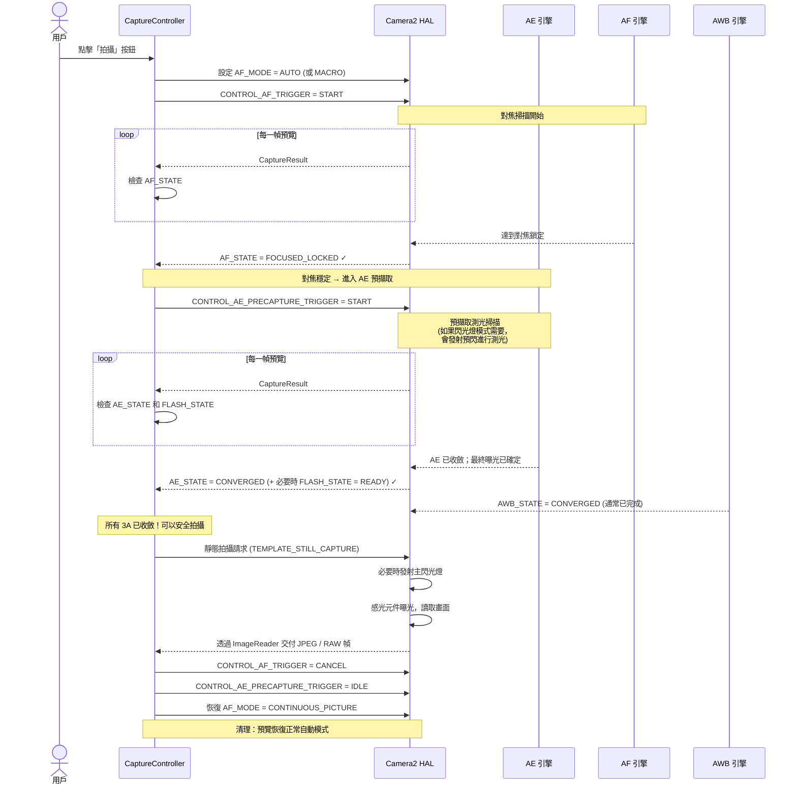
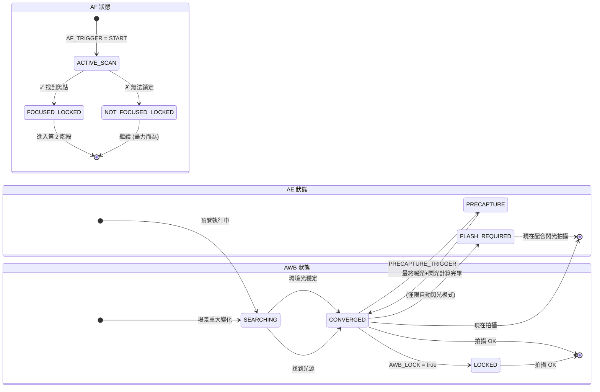

# 第 17 章：3A 管線

我們已經將 **AE**（自動曝光，第 13-14 章）、**AF**（自動對焦，第 15 章）和 **AWB**（自動白平衡，第 16 章）作為獨立的系統進行了研究。真實的攝影應用必須在每次按下快門之前協調這三者——而且*順序和時機*至關重要。

如果只是在用戶點擊快門按鈕時簡單地觸發 `capture()`，產生的結果會很不穩定：有時對焦準，有時不准；有時閃光燈亮，有時不亮；有時在 AWB 掃描途中拍攝會導致照片發綠。一個可靠的 3A 管線可以消除所有這些問題。

本章中的 3A 管線實現與 **Android Camera Parameters** 應用內部使用的流程以及 Android 相機架構研究文件中描述的專業 Camera2 開發序列完全一致。

---

## 3A 全程編排序列（概覽）

在深入研究每個子系統之前，讓我們先直觀地了解完整的狀態流。這是一個真實的生產環境序列，而非簡化版。



**每一步都是阻塞的。** 在 HAL 確認第 N 步所需的狀態之前，你不會移動到第 N+1 步。切勿跳過步驟——否則你發佈的應用會出現間歇性的對焦不實、錯誤的閃光曝光或帶藍/綠調的照片。

---

## AE（自動曝光）深度挖掘

AE 是三個 A 中最複雜的，因為它不僅包含快門+ISO，還包含**閃光燈測光**和**預擷取觸發**。

### AE 模式：CONTROL_AE_MODE

| 模式 | 行為 | 閃光燈支援 |
|------|----------|--------------|
| `OFF` | 完全手動（第 14 章涵蓋） | 無 |
| `ON` | 自動曝光，**禁用閃光燈**（永久關閉） | 無 |
| `ON_AUTO_FLASH` | 自動曝光，**自動閃光決策** — HAL 僅在弱光下閃光 | 自動（最常見的預設值） |
| `ON_ALWAYS_FLASH` | 自動曝光，**強制閃光**（用於逆光人像的補光） | 始終 |
| `ON_AUTO_FLASH_REDEYE` | 自動曝光 + 閃光 + 紅眼消除（發射預閃序列以收縮瞳孔） | 自動 + 紅眼消除 |
| `ON_EXTERNAL_FLASH` | 外部相機配件閃光燈 | 僅限外部（罕見） |

**普通相機應用的預設值**是 `ON_AUTO_FLASH`。用戶期望手機能「知道」何時該閃光。

### AE 狀態與預擷取觸發

與 AF 一樣，AE 透過 `CaptureResult.CONTROL_AE_STATE` 報告其狀態：

| 狀態 | 含義 |
|-------|---------|
| `INACTIVE` (0) | AE 已禁用或尚未啟動 |
| `SEARCHING` (1) | 正在積極搜索正確的曝光 |
| `CONVERGED` (2) | 曝光穩定。在閃光燈模式下，這意味著*環境*曝光已收斂，但預閃掃描尚未進行。 |
| `LOCKED` (3) | 透過 `CONTROL_AE_LOCK = true` 顯式鎖定曝光 |
| `FLASH_REQUIRED` (4) | 環境曝光已收斂，且 HAL 已判定**需要閃光**才能拍攝正確照片 |
| `PRECAPTURE` (5) | **關鍵狀態。** 預擷取掃描正在執行 — HAL 正在測光（如果需要閃光，則發射預閃脈衝）以計算最終拍攝的曝光 + 閃光功率。 |

### 為什麼預擷取觸發如此重要

在預覽幀上執行的 AE 引擎是*近似的*。預覽管線使用較小的緩衝區、較低位元的處理，且未考慮拍攝時主閃光燈發射帶來的巨量光線貢獻。

`CONTROL_AE_PRECAPTURE_TRIGGER = START` 告訴 HAL：

> 「我正要拍一張真正的靜態照片。停止近似計算。執行全精度的測光管線。如果我處於自動閃光模式，請發射一個或多個低功率預閃，測量反射，並為拍攝計算精確的最終快門/ISO/閃光功率。」

**跳過預擷取 = 閃光照片會隨機過曝或欠曝。** HAL 根本沒有機會即時針對閃光燈進行測光。

### AE 區域（點測光）

就像針對對焦的 `CONTROL_AF_REGIONS` 一樣，`CONTROL_AE_REGIONS` 指定了*場景中的哪個位置*進行測光。人像點擊對焦應當同時將該區域應用到 AE —— 讓面部獲得對焦優先權的同時也獲得曝光優先權，而不是針對明亮的天空背景進行測光。

```kotlin
// 為 AF 和 AE 區域使用相同的 MeteringRectangle 陣列
val focusWeightedRegions = arrayOf(userTapRegion)
builder.set(CaptureRequest.CONTROL_AF_REGIONS, focusWeightedRegions)
builder.set(CaptureRequest.CONTROL_AE_REGIONS, focusWeightedRegions)
```

**權重：** 每個 `MeteringRectangle` 都有一个 `weight` (0–1000)。權重越高的區域對測光的影響越大。「點測光」模式使用一個高權重矩形 (1000)。「矩陣 / 評價」測光使用分佈在畫面中的許多低權重矩形。

---

## AWB：三劍客中的沈默夥伴

AWB 通常很早就收斂並保持收斂——這就是為什麼它經常被忽略的原因。但它對色彩準確性的貢獻至關重要，當你準備拍攝時，它*仍可能*在搜尋中。

### AWB 狀態回顧

| AWB 狀態 | 拍攝決策 |
|-----------|------------------|
| `INACTIVE` (AWB_MODE = OFF) | 可以繼續（手動增益） |
| `SEARCHING` | **等待。** 色彩可能仍在變動。通常在場景重大變化後 < 500ms 內完成。 |
| `CONVERGED` | ✅ 完美 — 繼續 |
| `LOCKED` | ✅ 同樣完美 — 透過 `CONTROL_AWB_LOCK = true` 顯式鎖定 |

### 將 AWB 鎖定與 AE/AF 鎖定耦合

對於嚴謹的影棚/產品攝影，請在拍攝*前*鎖定所有三項：

```kotlin
// 在靜態拍攝請求中（不要提前——我們要鎖定最終收斂後的值）
builder.set(CaptureRequest.CONTROL_AWB_LOCK, true)
builder.set(CaptureRequest.CONTROL_AE_LOCK, true)
// AF 保持鎖定，因為我們早些時候觸發了它且尚未取消
```

這保證了主擷取所用的色彩/白平衡設定檔與最後一次預擷取測光幀所用的*完全一致*。

---

## 完整的生產級 3A 擷取控制器 (Kotlin)

現在讓我們將所有內容組裝成一個可複用的類別。此實現符合 Android 相機架構研究文件中關於 3A 控制管線的部分以及相關專業 Camera2 開發部落格推薦的模式。

```kotlin
class ThreeACaptureController(
    private val characteristics: CameraCharacteristics,
    private val captureSession: CameraCaptureSession,
    private val previewSurface: Surface,
    private val jpegReaderSurface: Surface,
    private val mainHandler: Handler
) {
    // ----------- 公共 API -----------
    interface CaptureListener {
        fun onCaptureStarted() {}
        fun onCaptureSuccess(jpegBytes: ByteArray)
        fun onCaptureError(reason: String)
    }

    /**
     * 編排完整的 3A 擷取序列：
     *   AF 觸發 → AF 已鎖定 → AE 預擷取 → AE 已收斂 → 靜態拍攝 → 清理
     */
    fun captureStillPhoto(
        aeMode: Int = CameraMetadata.CONTROL_AE_MODE_ON_AUTO_FLASH,
        listener: CaptureListener
    ) {
        this.listener = listener
        listener.onCaptureStarted()
        beginPhase1_AfTrigger(aeMode)
    }

    // ----------- 內部狀態 -----------
    private var listener: CaptureListener? = null
    private var timeoutRunnable: Runnable? = null
    private var phase: Int = 0
    private lateinit var currentAeMode: Int

    private val SESSION_TIMEOUT_MS = 3500L  // 入門手機可能需要長達約 3s

    // ---- 第 1 階段：觸發 AF，等待 FOCUSED_LOCKED ----
    private fun beginPhase1_AfTrigger(aeMode: Int) {
        currentAeMode = aeMode
        phase = 1

        val request = captureSession.device.createCaptureRequest(
            CameraDevice.TEMPLATE_PREVIEW
        ).apply {
            addTarget(previewSurface)

            set(CaptureRequest.CONTROL_AF_MODE,
                CameraMetadata.CONTROL_AF_MODE_AUTO)
            set(CaptureRequest.CONTROL_AE_MODE, aeMode)
            set(CaptureRequest.CONTROL_AWB_MODE,
                CameraMetadata.CONTROL_AWB_MODE_AUTO)

            // 發起單次 AF 掃描
            set(CaptureRequest.CONTROL_AF_TRIGGER,
                CameraMetadata.CONTROL_AF_TRIGGER_START)
        }

        startTimeout("AF 掃描")
        captureSession.setRepeatingRequest(request.build(), captureCallback, mainHandler)
    }

    // ---- 第 2 階段：AF 已鎖定。開始 AE 預擷取觸發 ----
    private fun beginPhase2_AePrecapture() {
        phase = 2
        val request = captureSession.device.createCaptureRequest(
            CameraDevice.TEMPLATE_PREVIEW
        ).apply {
            addTarget(previewSurface)

            // 保持 AF 鎖定 — 切勿取消 AF 觸發！
            set(CaptureRequest.CONTROL_AF_MODE,
                CameraMetadata.CONTROL_AF_MODE_AUTO)
            // AF_TRIGGER 保持在來自第 1 階段的 START 狀態

            set(CaptureRequest.CONTROL_AE_MODE, currentAeMode)

            // ---- 關鍵行：執行預擷取 ----
            set(CaptureRequest.CONTROL_AE_PRECAPTURE_TRIGGER,
                CameraMetadata.CONTROL_AE_PRECAPTURE_TRIGGER_START)

            set(CaptureRequest.CONTROL_AWB_MODE,
                CameraMetadata.CONTROL_AWB_MODE_AUTO)
        }

        restartTimeout("AE 預擷取")
        captureSession.setRepeatingRequest(request.build(), captureCallback, mainHandler)
    }

    // ---- 第 3 階段：AE 已收斂 + AWB 已收斂。發起真正的靜態拍攝。 ----
    private fun beginPhase3_StillCapture() {
        phase = 3
        cancelTimeout()

        val request = captureSession.device.createCaptureRequest(
            CameraDevice.TEMPLATE_STILL_CAPTURE
        ).apply {
            addTarget(previewSurface)
            addTarget(jpegReaderSurface)

            // 在擷取完成前保持 AF 鎖定
            set(CaptureRequest.CONTROL_AF_MODE,
                CameraMetadata.CONTROL_AF_MODE_AUTO)

            set(CaptureRequest.CONTROL_AE_MODE, currentAeMode)

            // 為靜態拍攝鎖定 AE 和 AWB，以防止最後時刻的畫面漂移
            set(CaptureRequest.CONTROL_AE_LOCK, true)
            set(CaptureRequest.CONTROL_AWB_LOCK, true)

            set(CaptureRequest.CONTROL_AWB_MODE,
                CameraMetadata.CONTROL_AWB_MODE_AUTO)

            set(CaptureRequest.JPEG_QUALITY, 95.toByte())
            // JPEG 朝向：使用螢幕旋轉以獲得正確的最終朝向
            val jpegOrient = computeJpegOrientation()
            set(CaptureRequest.JPEG_ORIENTATION, jpegOrient)
        }

        captureSession.capture(request.build(), object : CameraCaptureSession.CaptureCallback() {
            override fun onCaptureCompleted(
                session: CameraCaptureSession,
                request: CaptureRequest,
                result: TotalCaptureResult
            ) {
                super.onCaptureCompleted(session, request, result)
                // ImageReader 的 OnImageAvailableListener 將處理儲存位元組並回呼給監聽器
                // 現在進行清理：重置回正常的預覽模式
                resetToContinuousPreview()
            }
        }, mainHandler)
    }

    // ---- 清理：恢復正常的連續預覽 ----
    private fun resetToContinuousPreview() {
        phase = 0
        val request = captureSession.device.createCaptureRequest(
            CameraDevice.TEMPLATE_PREVIEW
        ).apply {
            addTarget(previewSurface)
            set(CaptureRequest.CONTROL_AF_MODE,
                CameraMetadata.CONTROL_AF_MODE_CONTINUOUS_PICTURE)
            set(CaptureRequest.CONTROL_AE_MODE, currentAeMode)
            set(CaptureRequest.CONTROL_AWB_MODE,
                CameraMetadata.CONTROL_AWB_MODE_AUTO)

            // 釋放所有鎖定並取消所有觸發器
            set(CaptureRequest.CONTROL_AF_TRIGGER,
                CameraMetadata.CONTROL_AF_TRIGGER_CANCEL)
            set(CaptureRequest.CONTROL_AE_PRECAPTURE_TRIGGER,
                CameraMetadata.CONTROL_AE_PRECAPTURE_TRIGGER_IDLE)
            set(CaptureRequest.CONTROL_AE_LOCK, false)
            set(CaptureRequest.CONTROL_AWB_LOCK, false)
        }
        captureSession.setRepeatingRequest(request.build(), null, mainHandler)
    }

    // ----------- 主回呼：透過狀態檢查驅動所有 3 個階段 -----------
    private val captureCallback = object : CameraCaptureSession.CaptureCallback() {
        override fun onCaptureCompleted(
            session: CameraCaptureSession,
            request: CaptureRequest,
            result: TotalCaptureResult
        ) {
            val afState = result.get(CaptureResult.CONTROL_AF_STATE)
            val aeState = result.get(CaptureResult.CONTROL_AE_STATE)
            val awbState = result.get(CaptureResult.CONTROL_AWB_STATE)

            when (phase) {
                1 -> {
                    // ---- 第 1 階段：等待 AF 鎖定 ----
                    when (afState) {
                        CaptureResult.CONTROL_AF_STATE_FOCUSED_LOCKED -> {
                            Log.d("3A", "✓ AF FOCUSED_LOCKED — 進入 AE 預擷取")
                            beginPhase2_AePrecapture()
                        }
                        CaptureResult.CONTROL_AF_STATE_NOT_FOCUSED_LOCKED -> {
                            Log.w("3A", "⚠ AF NOT_FOCUSED_LOCKED — 照常繼續 (可能會失焦)")
                            beginPhase2_AePrecapture()
                        }
                        // ACTIVE_SCAN / PASSIVE_SCAN → 繼續等待
                    }
                }
                2 -> {
                    // ---- 第 2 階段：等待預擷取後的 AE 收斂 ----
                    // 接受代表 「AE 已完成預擷取並準備好拍攝」 的狀態
                    val aeReady = (aeState == CaptureResult.CONTROL_AE_STATE_CONVERGED
                                || aeState == CaptureResult.CONTROL_AE_STATE_LOCKED
                                || aeState == CaptureResult.CONTROL_AE_STATE_FLASH_REQUIRED)
                    val awbReady = (awbState == CaptureResult.CONTROL_AWB_STATE_CONVERGED
                                 || awbState == CaptureResult.CONTROL_AWB_STATE_LOCKED
                                 || awbState == CaptureResult.CONTROL_AWB_STATE_INACTIVE)

                    if (aeReady && awbReady) {
                        Log.d("3A", "✓ AE=$aeState, AWB=$awbState — 發起拍攝")
                        beginPhase3_StillCapture()
                    }
                }
            }
        }
    }

    // ----------- 逾時保護：如果 HAL 永遠不收斂，絕不掛起 -----------
    private fun startTimeout(phaseName: String) {
        cancelTimeout()
        timeoutRunnable = Runnable {
            Log.w("3A", "⏱ 等待 $phaseName 逾時 — 盡力而為繼續進行")
            when (phase) {
                1 -> beginPhase2_AePrecapture()  // 以可能的最佳對焦繼續
                2 -> beginPhase3_StillCapture()  // 以可能的最佳曝光繼續
            }
        }
        mainHandler.postDelayed(timeoutRunnable!!, SESSION_TIMEOUT_MS)
    }
    private fun restartTimeout(phaseName: String) = startTimeout(phaseName)
    private fun cancelTimeout() {
        timeoutRunnable?.let { mainHandler.removeCallbacks(it) }
        timeoutRunnable = null
    }

    // ----------- 實用工具：基於螢幕旋轉糾正 JPEG 朝向 -----------
    private fun computeJpegOrientation(): Int {
        val sensorOrient = characteristics.get(
            CameraCharacteristics.SENSOR_ORIENTATION
        ) ?: 0
        // 與 Activity 中的 Display.rotation (0, 90, 180, 270) 結合
        // 典型實現：return (sensorOrient + displayRotationDegrees) % 360
        return sensorOrient  // 簡化的；需連接到你的螢幕旋轉
    }
}
```

### 如何使用該控制器

```kotlin
// 在你的相機 Fragment 的拍攝按鈕點擊監聽器內
val controller = ThreeACaptureController(
    characteristics = yourCameraCharacteristics,
    captureSession = yourActiveSession,
    previewSurface = previewView.surface,
    jpegReaderSurface = jpegImageReader.surface,
    mainHandler = yourCameraHandler
)

controller.captureStillPhoto(
    aeMode = CameraMetadata.CONTROL_AE_MODE_ON_AUTO_FLASH
) {
    override fun onCaptureSuccess(jpegBytes: ByteArray) {
        lifecycleScope.launch(Dispatchers.IO) {
            val file = File(requireContext().filesDir, "photo_${System.currentTimeMillis()}.jpg")
            file.writeBytes(jpegBytes)
            withContext(Dispatchers.Main) {
                Toast.makeText(requireContext(), "已儲存: ${file.name}", Toast.LENGTH_SHORT).show()
            }
        }
    }
    override fun onCaptureError(reason: String) {
        Toast.makeText(requireContext(), "拍攝失敗: $reason", Toast.LENGTH_LONG).show()
    }
}
```

### 與 ImageReader 配合使用

不要忘記在你的 JPEG `ImageReader` 上設定 `OnImageAvailableListener`，以便真正地將 `jpegBytes` 交付給監聽器。上述控制器假設你已經連接好了這一步：

```kotlin
// 在建立 ImageReader 時設定好此項 (參見拍攝章節)
jpegImageReader.setOnImageAvailableListener({ reader ->
    val image = reader.acquireLatestImage() ?: return@setOnImageAvailableListener
    image.use {
        val buffer = it.planes[0].buffer
        val bytes = ByteArray(buffer.remaining())
        buffer.get(bytes)
        // 交付位元組數據給你的 UI / 文件儲存程式
        lastCaptureListener?.onCaptureSuccess(bytes)
    }
}, mainHandler)
```

---

## 閃光燈處理的微妙之處

對於 `ON_AUTO_FLASH` / `ON_ALWAYS_FLASH` / `ON_AUTO_FLASH_REDEYE` 模式，預擷取觸發會發射預閃脈衝。兩個重要考慮因素：

1. **預閃脈衝的可視性：** 預閃是*真實的閃光* —— 用戶會在主閃光之前看到一個低亮度的閃光脈衝。大多數現代相機 UI 透過「快門按鈕動畫」或調暗預覽來隱藏這一點。

2. **`FLASH_STATE` 必須為 READY：** 除了 `AE_STATE = CONVERGED` 之外，還要在拍攝前驗證閃光模式下的 `CaptureResult.FLASH_STATE = FLASH_STATE_READY` (或 `FIRED`)。AE 有可能已收斂，但閃光燈充電電容仍在爬升。

```kotlin
// 在第 2 階段針對閃光燈模式的回呼中增強 aeReady 檢查：
val aeState = result.get(CaptureResult.CONTROL_AE_STATE)
val flashState = result.get(CaptureResult.FLASH_STATE)

val flashModeWantsFlash = (currentAeMode == CameraMetadata.CONTROL_AE_MODE_ON_ALWAYS_FLASH ||
                          (currentAeMode == CameraMetadata.CONTROL_AE_MODE_ON_AUTO_FLASH &&
                           aeState == CaptureResult.CONTROL_AE_STATE_FLASH_REQUIRED))

val aeReady = when {
    flashModeWantsFlash -> {
        // HAL 必須同時達到 AE 已收斂且閃光燈準備就緒可以發射
        (aeState == CaptureResult.CONTROL_AE_STATE_CONVERGED
         || aeState == CaptureResult.CONTROL_AE_STATE_FLASH_REQUIRED) &&
        (flashState == CaptureResult.FLASH_STATE_READY
         || flashState == CaptureResult.FLASH_STATE_FIRED)
    }
    else -> {
        // 無閃光模式：普通的 AE 收斂即可
        (aeState == CaptureResult.CONTROL_AE_STATE_CONVERGED
         || aeState == CaptureResult.CONTROL_AE_STATE_LOCKED)
    }
}
```

---

## 3A 狀態轉換機（總結圖）

為了在偵錯時快速參考，這裡是 AE、AF 和 AWB 的合併狀態圖，展示了成功拍攝期間的預期轉換。



全局控制器僅在所有三個子狀態同時達到最終的「拍攝 OK」狀態時，才會發起靜態拍攝。

---

## 3A 管線問題排查

| 症狀 | 根本原因 | 解決辦法 |
|---------|-----------|-----|
| 閃光照片隨機欠曝/過曝 | 跳過了 `AE_PRECAPTURE_TRIGGER = START` | 在任何閃光模式下，靜態拍攝前務必執行預擷取 |
| 每 5-10 張照片就有一張略微模糊 | 在達到 `FOCUSED_LOCKED` 之前就發起了拍攝 | 阻塞等待 AF 狀態 (我們的控制器已實現此功能) |
| 相機掛起數秒後崩潰 | 無逾時；HAL 永遠停留在 SEARCHING | 按範例所示添加 3500ms 逾時 + 盡力而為的回退機制 |
| 閃光燈亮了但照片仍是暗的 | 在 `FLASH_STATE = READY` 之前就發起了拍攝 | 電容正在充電；在 AE 就緒條件中增加 FLASH_STATE 檢查 |
| 逆光人物肖像欠曝 | AE 針對天空而非人臉進行了測光 | 將 `CONTROL_AE_REGIONS` 與點擊對焦的 `CONTROL_AF_REGIONS` 矩形耦合 |
| 連拍幀之間有 2° 的色調偏移 | 連拍拍攝前忘記設定 `AWB_LOCK = true` | 在第一個收斂幀上鎖定 AWB；並在整個連拍期間保持鎖定 |
| 入門手機上的拍攝序列明顯緩慢 | `TEMPLATE_STILL_CAPTURE` 啟動了冷管線 | 先用帶有相同 AE/AF 設定的啞 `TEMPLATE_PREVIEW` 預熱管線 |

---

## 小結

本章將曝光、對焦和白平衡統一到了單個、可靠的 **3A 拍攝管線** 中——這正是專業相機應用在每次按下快門時所用的精確序列：

1. **階段 1 (AF):** 設定 `AF_MODE = AUTO` + `AF_TRIGGER = START`。等待直到 `AF_STATE = FOCUSED_LOCKED`（或以 `NOT_FOCUSED_LOCKED` 為回退）。
2. **階段 2 (AE 預擷取):** 設定 `AE_PRECAPTURE_TRIGGER = START`。等待 `AE_STATE = CONVERGED` / `FLASH_REQUIRED` 且 `FLASH_STATE = READY`（若為閃光模式）。同時要求 `AWB_STATE = CONVERGED`。
3. **階段 3 (靜態拍攝):** 提交帶有 `AE_LOCK = true`, `AWB_LOCK = true` 的 `TEMPLATE_STILL_CAPTURE` 請求。
4. **階段 4 (清理):** 取消所有觸發器，釋放所有鎖定，恢復 `AF_MODE = CONTINUOUS_PICTURE`。

關鍵的支持概念：
- **AE 模式：** `ON_AUTO_FLASH` 是面向普通應用最合理的預設值。
- **AE 區域** = 點測光；在點擊對焦時始終與 AF 區域配對。
- **AWB 收斂很快**，但對於色彩關鍵的工作，務必阻塞等待 `CONVERGED` 或 `LOCKED`。
- **逾時是不可商榷的。** 廉價手機和弱光環境可能導致 AF/AE 掃描永不停止；務必在約 3.5s 後以盡力而為的方式回退繼續。

## 下一章

恭喜你完成了 3A 手動攝影模組。你現在已經達到了專業級別，了解如何控制：

- **曝光 (第 13-14 章):** 曝光三角、ISO + 快門、納秒轉換、手動覆蓋、長曝光、延時鎖定、包圍曝光
- **對焦 (第 15 章):** AF 模式、AF 狀態機、單次觸發與拍攝、手動對焦屈光度、超焦距預設、點擊對焦區域
- **色彩 (第 16 章):** 色溫、AWB 預設、手動 COLOR_CORRECTION_GAINS、3×3 CCM 變換、開爾文滑塊實現
- **編排 (第 17 章):** 帶有預擷取、防閃光 AE 收斂、逐階段逾時、鎖定/釋放清理的完整 3A 管線

你現在可以建構一個功能足以媲美 **Android Camera Parameters** 應用本身的完整專業模式相機應用了！

在接下來的章節中，我們將從擷取**控制**轉向擷取**畫質** —— 涵蓋 RAW 擷取、DNG 儲存、多幀處理、HDR，以及基於你現已掌握的 3A 管線建構的計算攝影技術。
