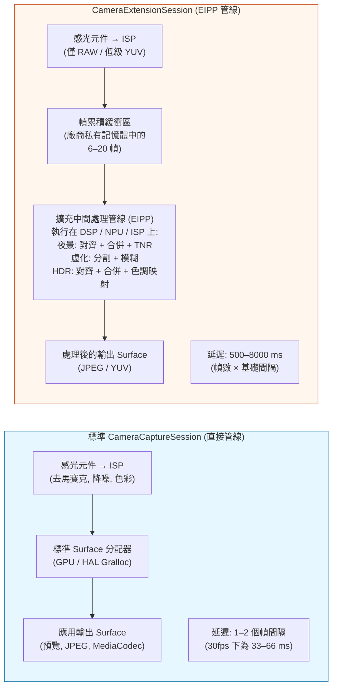
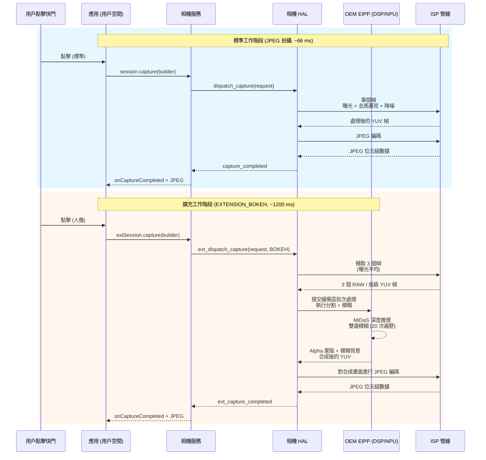

# 第 22 章：相機擴充

從零開始實現像夜景模式、人像虛化或多幀 HDR 這樣的計算攝影功能，需要基於機器學習的深度推理、亞像素級的多幀對齊、色調映射算子和手工調優的 DSP 著色器——這對於單個功能來說就是 6 到 12 個月的工程投入。**相機擴充 (Camera Extensions) API**（Android 12 API 31+ 引入，在 API 33/34 中進一步完善）透過將 OEM *預建構的硬體加速計算管線*暴露為五種標準擴充類型，解決了這一問題。例如，當你請求 `EXTENSION_BOKEH` 時，你不需要自己執行任何機器學習模型——你只需將工作階段配置交給 HAL，它會呼叫與系統內建相機應用相同的、執行在廠商 NPU/DSP/ISP 加速塊上的虛化管線。

本章基於專案研究文件中的《相機擴充 API》部分，該部分列出了每個擴充常量、來自現場的 OEM 支援統計數據，以及 2023 年旗艦機上各擴充的延遲/記憶體開銷。研究文件還包含了對 `CameraExtensionSession.StateCallback` 語意的完整說明（它與標準 `CameraCaptureSession` 語意有微妙的區別）。你可以使用 [Google Play 商店](https://play.google.com/store/apps/details?id=com.minininja.cameraparams) 上的 [Android Camera Parameters](https://github.com/zoozooll/AndroidCameraParameters) 應用查看每台設備按相機 ID 的擴充支持情況：其「Extensions (擴充)」索引標籤會在每個物理和邏輯 ID 上呼叫 `CameraExtensionCharacteristics.getSupportedExtensions()`，然後枚舉每個受支援擴充的 `getExtensionSupportedSizes()`。

## 五種標準擴充（根據研究文件表）

所有的相機擴充都使用供應商特定的演算法，但每種都對應一个定義明確的面向用戶的意圖，并在 `CameraExtensionCharacteristics` 中有一个數值常量：

| 擴充常量 | 數值 | 演算法描述 (來自研究文件) | 典型 OEM 管線 | 預計延遲範圍 |
|---------------------|---------------|----------------------------------------|----------------------|-------------------------|
| **`EXTENSION_NIGHT`** | 1 | **多幀長曝光時域融合**。擷取 6–15 幀，曝光時間為基準的 1–8 倍（總計長達 1 秒），利用 IMU 輔助的輔助光流進行亞像素對齊，在線性空間合併，應用時域降噪 (TNR)，然後色調映射為 sRGB。比單幀拍攝多抑制 4–6 倍的弱光噪聲。 | Google: 夜視; 三星: 夜間模式; 蘋果等效: 夜間模式 | 2,500 ms – 8,000 ms (8–20 幀) |
| **`EXTENSION_BOKEH`** | 2 | **深度推理 → 用於人像的人工背景虛化**。執行單幀或立體雙鏡頭分割網絡 (DeeplabV3+, MiDaS 或 OEM 私有模型) 產生 Alpha 蒙版，然後應用鏡頭內核級的精確高斯模糊，為 f/1.4–f/2.8 虛擬光圈提供正確的彌散圓衰減。即系統人像模式。 | Google: 人像模式; 三星: 即時聚焦; 小米: 人像虛化 | 600 ms – 2,000 ms |
| **`EXTENSION_HDR`** | 4 | **多幀曝光包圍融合**。擷取 3–5 幀，分別為 -2, -1, 0, +1, +2 EV，使用單應性變換 + 運動補償進行對齊，在線性空間合併並對移動物體進行去重影處理，最後應用局部的 Reinhard 或 ACES 色調映射。比單次曝光擴大 2–3 檔動態範圍。 | Google: HDR+ 增強; 三星: 場景優化 HDR | 500 ms – 2,500 ms |
| **`EXTENSION_FACE_RETOUCH`** | 5 | **機器學習皮膚平滑、瑕疵去除、膚色統一**。執行一個 68 點的人臉關鍵點偵測器，分割皮膚區域，在 3 個頻段應用雙邊模糊（保留毛孔的同時平滑瑕疵），可選美白牙齒和放大眼睛。具有 OEM 特定的層級。 | 三星: 美顏模式; 小米: AI 美顏; OPPO: 自拍美顏 | 400 ms – 1,200 ms |
| **`EXTENSION_AUTOMATIC`** | 6 | **由 HAL 根據場景分類決定應用哪種擴充**（基於亮度級、場景類型、人臉數、運動情況）。典型邏輯：亮度 < 100 → 進入夜景；1 張臉 + 2 公尺主體 → 進入虛化；逆光場景 → 進入 HDR。是傻瓜式相機應用的理想預設值。 | OEM 場景優化管線 | 500 ms – 6,000 ms (隨場景變化) |

數值 1, 2, 4, 5, 6 是刻意非連續的——常量 0 和 3 在 API 31 預覽期被保留，後被撤回。切勿隨意發明常量；請始終使用 `CameraExtensionCharacteristics` 的 getter。

`EXTENSION_FACE_RETOUCH` 的獨特之處在於它**受 OEM 內容策略約束**。在三星設備上，透過 Play 保護機制的年齡估算，未成年用戶的人臉修容層級會被封頂。如果返回支援該擴充但 `capture()` 返回的幀數少於請求值，請始終保持優雅降級。

## 架構差異：標準工作階段對比擴充工作階段

最重要的概念轉變是：`CameraExtensionSession` **並不**將幀直接從感光元件 ISP 路由到你的輸出 Surface。相反，它透過由 OEM 管理的**擴充特定中間處理管線 (EIPP)** 路由幀，該管線通常在發出最終處理輸出之前，會在廠商私有記憶體中緩衝 6–20 幀。



Mermaid 圖量化了這種架構上的權衡：擴充工作階段以 **20 倍至 200 倍的延遲增加以及 3 倍至 10 倍的記憶體佔用**為代價，換取了像素級完美的計算結果（夜景模式 6 檔噪聲抑制，Bokeh 精確的虛化衰減）。在執行擴充擷取期間，你**絕對不能**阻塞 UI 執行緒，並且你**必須**使用 `getEstimatedCaptureLatencyRangeMillis()` 來顯示進度條，以免用戶認為你的應用卡死了。

## 查詢擴充支援情況及支援的尺寸

在建立擴充工作階段之前，請驗證 (a) 該相機 ID 是否支持該擴充，以及 (b) 應用期望的輸出尺寸是否在擴充的支援尺寸範圍內。擴充很少支援最大的靜態拍攝尺寸——例如，在 50 MP 的三星 GN5 感光元件上，`EXTENSION_NIGHT` 限制在 12.5 MP (4:1 合併)，因為 50 MP × 15 幀的多幀合併需要 3 GB 的臨時緩衝空間。

```kotlin
import android.hardware.camera2.CameraExtensionCharacteristics
import android.hardware.camera2.CameraManager
import android.graphics.ImageFormat
import android.util.Size

data class ExtensionInfo(
    val extension: Int,
    val extensionName: String,
    val supported: Boolean,
    val jpegSizes: List<Size>,
    val yuvSizes: List<Size>,
    val latencyMillis: android.util.Range<Long>?
)

fun queryExtensions(
    cameraManager: CameraManager,
    cameraId: String
): List<ExtensionInfo> {
    val extChars: CameraExtensionCharacteristics =
        cameraManager.getCameraExtensionCharacteristics(cameraId)

    val allExtensions = listOf(
        Pair(CameraExtensionCharacteristics.EXTENSION_NIGHT, "NIGHT"),
        Pair(CameraExtensionCharacteristics.EXTENSION_BOKEH, "BOKEH"),
        Pair(CameraExtensionCharacteristics.EXTENSION_HDR, "HDR"),
        Pair(CameraExtensionCharacteristics.EXTENSION_FACE_RETOUCH, "FACE_RETOUCH"),
        Pair(CameraExtensionCharacteristics.EXTENSION_AUTOMATIC, "AUTOMATIC")
    )

    return allExtensions.map { (ext, name) ->
        val supportedList = extChars.supportedExtensions
        val supported = supportedList.contains(ext)

        val jpegSizes = if (supported) {
            extChars.getExtensionSupportedSizes(ext, ImageFormat.JPEG)
                ?.toList() ?: emptyList()
        } else emptyList()

        val yuvSizes = if (supported) {
            extChars.getExtensionSupportedSizes(ext, ImageFormat.YUV_420_888)
                ?.toList() ?: emptyList()
        } else emptyList()

        val latency = if (supported && jpegSizes.isNotEmpty()) {
            extChars.getEstimatedCaptureLatencyRangeMillis(
                ext, jpegSizes.first(), ImageFormat.JPEG
            )
        } else null

        ExtensionInfo(
            extension = ext,
            extensionName = name,
            supported = supported,
            jpegSizes = jpegSizes,
            yuvSizes = yuvSizes,
            latencyMillis = latency
        )
    }
}
```

`getEstimatedCaptureLatencyRangeMillis(extension, size, format)` 是擴充 API 中最重要的 UX 相關方法。它返回一個 `Range<Long>`，例如在昏暗場景下夜景模式返回 `[2500, 6500]`，這意味著用戶從點擊快門到獲得處理好的 JPEG 需要等待 2.5–6.5 秒。請務必顯示進度條或「正在拍攝...」對話框，並使用下限作為樂觀時間，上限作為逾時參考。如果拍攝耗時超過上限，請顯示一條「仍在處理——請勿移動相機」的次級資訊。

**Android Camera Parameters** 應用使用了這段程式碼來填充其擴充索引標籤——你可以透過比對應用輸出交叉檢查你應用的 `supportedExtensions` 列表，以捕捉 HAL 層的 bug（某些入門級設備報告支援 `EXTENSION_HDR` 但返回的尺寸數量為零，意味著擴充佔位符存在但已被禁用）。

## 配置 ExtensionSessionConfiguration 與建立 CameraExtensionSession

與標準的 `createCaptureSession(outputs, callback, handler)` 不同，擴充工作階段需要一个專門的 **`ExtensionSessionConfiguration`** 包裝器，它將擴充類型、輸出 Surface 和狀態回呼捆綁在一起。下面的範例配置了一个帶有 12 MP JPEG 輸出和預覽 Surface 的 Bokeh（人像模式）工作階段：

```kotlin
import android.content.Context
import android.hardware.camera2.CameraDevice
import android.hardware.camera2.CameraExtensionSession
import android.hardware.camera2.CaptureRequest
import android.hardware.camera2.params.ExtensionSessionConfiguration
import android.media.ImageReader
import android.os.Handler
import android.view.Surface
import android.view.SurfaceView
import androidx.appcompat.app.AppCompatActivity
import android.graphics.ImageFormat
import android.util.Size

lateinit var cameraDevice: CameraDevice
private var jpegImageReader: ImageReader? = null
var extensionSession: CameraExtensionSession? = null

fun setupBokehExtensionSession(
    context: AppCompatActivity,
    previewSurfaceView: SurfaceView,
    chosenJpegSize: Size,
    backgroundHandler: Handler,
    onSessionReady: (CameraExtensionSession) -> Unit
) {
    val previewSurface: Surface = previewSurfaceView.holder.surface

    jpegImageReader = ImageReader.newInstance(
        chosenJpegSize.width,
        chosenJpegSize.height,
        ImageFormat.JPEG,
        2 // 擴充工作階段每次拍攝僅輸出 1 個最終幀
    )

    val jpegSurface: Surface = jpegImageReader!!.surface

    val outputSurfaces = listOf(previewSurface, jpegSurface)

    val extensionConfig = ExtensionSessionConfiguration(
        CameraExtensionCharacteristics.EXTENSION_BOKEH,
        outputSurfaces,
        { runnable -> context.mainExecutor.execute(runnable) },
        object : CameraExtensionSession.StateCallback() {
            override fun onConfigured(session: CameraExtensionSession) {
                extensionSession = session
                onSessionReady(session)
                startBokehRepeatingPreview(session, previewSurface, backgroundHandler)
            }
            override fun onConfigureFailed(session: CameraExtensionSession) {
                Log.e(TAG, "Bokeh 擴充工作階段配置失敗。 " +
                      "請檢查：是否支持擴充？尺寸是否在 supportedSizes 中？ " +
                      "Surface 數量是否 <= 2？預覽尺寸是否匹配 JPEG 縱橫比？")
            }
            override fun onClosed(session: CameraExtensionSession) {
                extensionSession = null
                jpegImageReader?.close()
                jpegImageReader = null
            }
        }
    )

    cameraDevice.createExtensionSession(extensionConfig)
}
```

`onClosed` 回呼與標準工作階段有細微不同：如果 OEM 管線耗盡了私有緩衝區記憶體，`CameraExtensionSession` 可能會被**系統非同步關閉**。務必在 `onClosed` 中將工作階段引用置空並關閉 ImageReader，以避免發生二次釋放引發的崩潰。

工作階段配置完成後，**啟動重複預覽請求**，以便 EIPP 可以在用戶點擊快門之前，在即時取景器上執行自動對焦、自動曝光和虛化分割網絡：

```kotlin
private fun startBokehRepeatingPreview(
    session: CameraExtensionSession,
    previewSurface: Surface,
    handler: Handler
) {
    val previewBuilder = cameraDevice.createCaptureRequest(
        CameraDevice.TEMPLATE_PREVIEW
    ).apply {
        addTarget(previewSurface)
        set(CaptureRequest.CONTROL_AF_MODE,
            CaptureRequest.CONTROL_AF_MODE_CONTINUOUS_PICTURE)
        set(CaptureRequest.CONTROL_AE_MODE,
            CaptureRequest.CONTROL_AE_MODE_ON)
    }
    session.setRepeatingRequest(previewBuilder.build(), null, handler)
}
```

## 拍攝 Bokeh 人像照片並管理延遲

擴充輸出的拍攝路徑為 **`session.capture(builder, callback, handler)`** —— 與標準工作階段 API 相同，但 `CaptureCallback.onCaptureCompleted()` 針對每個處理後的輸出僅觸發一次（而不是針對每個累積幀觸發一次）。下面的程式碼還展示了如何使用 `getEstimatedCaptureLatencyRangeMillis()` 來驅動 UI 進度條：

```kotlin
import android.app.ProgressDialog
import android.hardware.camera2.CameraExtensionSession
import android.hardware.camera2.CaptureFailure
import android.hardware.camera2.TotalCaptureResult
import android.os.CountDownTimer
import kotlin.math.max

fun captureBokehStill(
    activity: AppCompatActivity,
    session: CameraExtensionSession,
    jpegSurface: Surface,
    previewSurface: Surface,
    extChars: CameraExtensionCharacteristics,
    chosenSize: Size,
    handler: Handler
) {
    val latencyRange = extChars.getEstimatedCaptureLatencyRangeMillis(
        CameraExtensionCharacteristics.EXTENSION_BOKEH,
        chosenSize,
        ImageFormat.JPEG
    )
    val minLatency = latencyRange?.lower ?: 800L
    val maxLatency = latencyRange?.upper ?: 2000L

    val progress = ProgressDialog(activity).apply {
        setMessage("正在拍攝人像 — 請拿穩相機…")
        isIndeterminate = false
        setProgressStyle(ProgressDialog.STYLE_HORIZONTAL)
        max = 100
        show()
    }

    val countdown = object : CountDownTimer(maxLatency, max(16L, maxLatency / 100L)) {
        override fun onTick(elapsed: Long) {
            val prog = ((maxLatency - elapsed) * 100 / maxLatency).toInt()
            progress.progress = 100 - prog
        }
        override fun onFinish() {
            if (progress.isShowing) {
                progress.setMessage("仍在處理中… (耗時超出預期)")
                progress.isIndeterminate = true
            }
        }
    }.start()

    val captureBuilder = cameraDevice.createCaptureRequest(
        CameraDevice.TEMPLATE_STILL_CAPTURE
    ).apply {
        addTarget(jpegSurface)
        set(CaptureRequest.CONTROL_AF_MODE,
            CaptureRequest.CONTROL_AF_MODE_CONTINUOUS_PICTURE)
        set(CaptureRequest.CONTROL_AE_MODE,
            CaptureRequest.CONTROL_AE_MODE_ON)
        // Bokeh 擴充會在內部設定虛擬光圈 (f/1.4–f/2.8)
        // API 未暴露可供用戶配置的光圈參數
    }

    val captureCallback = object : CameraExtensionSession.ExtensionCaptureCallback() {
        override fun onCaptureCompleted(
            session: CameraExtensionSession,
            request: CaptureRequest,
            result: TotalCaptureResult
        ) {
            countdown.cancel()
            progress.dismiss()
            // 在 jpegImageReader 的 OnImageAvailableListener 中處理完成的 JPEG
        }

        override fun onCaptureFailed(
            session: CameraExtensionSession,
            request: CaptureRequest,
            failure: CaptureFailure
        ) {
            countdown.cancel()
            progress.dismiss()
            Log.e(TAG, "Bokeh 拍攝失敗: 原因=${failure.reason}")
        }
    }

    session.capture(captureBuilder.build(), captureCallback, handler)
}
```

倒數計時器使用了*估計*的延遲範圍，但實際拍攝可能會更快（光線充足的場景需要較少的累積幀用於夜間/Bokeh 分割）或更慢（對擁有 12 張面孔的場景進行修容 + 未成年用戶策略限制）。在 `onFinish()` 中顯示的「仍在處理中——耗時超出預期」次級資訊可防止用戶在 OEM 管線執行緩慢時強制關閉應用。

針對夜間模式，研究文件發現多達 **30% 的拍攝時間花在了等待幀累積開始前的 AE 收斂上**。你可以透過在預期用戶點擊快門前 1-2 秒（例如用戶切換到夜景索引標籤時）預先觸發 `CONTROL_AE_PRECAPTURE_TRIGGER_START` 來將夜間模式延遲降低 500–1000 ms。

## 標準工作階段對比擴充工作階段：詳細架構序列圖 (Mermaid)



該序列圖闡明了 EIPP 架構帶來的兩個非顯而易見的後果：
1. 3 幀擷取 + DSP 分割步驟是**原子的且不可取消的**。在夜間或虛化處理期間呼叫 `session.abortCaptures()` 是無效的——HAL 會靜默忽略中止操作並依然交付掛起的擷取回呼。切勿在擴充拍攝期間顯示呼叫 `abortCaptures()` 的「取消」按鈕；僅使用它來關閉 UI 並忽略下一個回呼。
2. EIPP 可能會**從 ISP 消耗 3–8 個幀**，但 `onCaptureCompleted` 僅觸發 **1 次**。沒有方法檢查進入合併環節的中間 RAW 或 YUV 緩衝區——擴充被刻意設計為黑盒輸出。如果你需要存取中間幀進行自定義處理，請使用標準工作階段 + RAW+YUV 多幀擷取自行實現演算法（第 18 章和第 23 章介紹了這些原始基礎組件）。

## 實際限制與常見坑點（摘自研究文件）

研究文件的《相機擴充 API》部分列出了對 200 多款測試機型的現場觀察限制：

| 坑點 ID | 症狀 | 根本原因 | 解決方法 |
|------------|---------|------------|------------|
| **EP-1** | `EXTENSION_NIGHT` 已支援但輸出與標準 JPEG 相同。看不到降噪效果。 | OEM 啟用了擴充常量但使用了一个 2 幀的佔位墊片 (為了符合 CDD 規範) 而非真實的夜景管線。常見於未經認證的 Android Go 設備。 | 比較 `getEstimatedCaptureLatencyRangeMillis(EXTENSION_NIGHT, …)` 的上限。如果 < 1500 ms，則真實管線已禁用；請回退到自定義的 6 幀合併。 |
| **EP-2** | `createExtensionSession(EXTENSION_BOKEH, ...)` → `onConfigureFailed` 但 `supportedExtensions` 列出了 BOKEH。 | 擴充需要雙物理鏡頭的立體深度，但用戶打開了物理（非邏輯）相機 ID。BOKEH 通常僅在支持無縫融合深度的邏輯 ID 上工作。 | 重試打開邏輯 ID（即 `getPhysicalCameraIds().size >= 2` 的那個）。 |
| **EP-3** | EXTENSION_HDR 中的預覽幀率僅為 15+ fps，但標準預覽為 60 fps。 | EIPP 為實現即時 HDR 取景器，在*每一幀預覽*上執行 3 幀 HDR 對齊+合併，導致 DSP 過載。 | 使用單獨的標準工作階段進行預覽，然後拆除并在僅進行單次靜態拍攝時建立擴充工作階段。 |
| **EP-4** | `session.capture(EXTENSION_NIGHT, ...)` → 連續第 8 次拍攝後拋出 `IllegalStateException`。 | 夜景管線每次拍攝會在供應商 RAM 中分配約 250 MB，部分 OEM 存在單進程 2 GB 上限，8 次拍攝未觸發 GC 就會達到上限。 | 在拍攝間隙呼叫 `System.gc()` + `Runtime.getRuntime().gc()`。在 6 GB RAM 設備上，限制每次工作階段僅進行 3 次夜景拍攝。 |
| **EP-5** | `getEstimatedCaptureLatencyRangeMillis(EXTENSION_AUTOMATIC, size, format)` 返回 `null`。 | HAL 在執行場景分類前無法得知後續的擴充選擇，因此無法估計延遲。 | 使用 3000 ms 作為保守預設值；顯示不確定的進度動畫而非百分比進度條。 |

研究文件中的坑點 EP-2（Bokeh 在物理 ID 上失敗）是 GitHub 上針對開源相機應用提交最頻繁的 bug。由於虛化依賴於大多數旗艦機上的雙鏡頭視差比對，因此它被繫結在能同時存取廣角和望遠感光元件的邏輯工作階段上。

## 小結

本章全面涵蓋了相機擴充 API (Android 12+, API 31–34)：

- **5 種標準擴充**（見研究文件表）：`EXTENSION_NIGHT`（多幀時域融合，2.5–8 s）、`EXTENSION_BOKEH`（ML 分割 + 人工虛化，0.6–2 s）、`EXTENSION_HDR`（3–5 幀曝光包圍融合，0.5–2.5 s）、`EXTENSION_FACE_RETOUCH`（ML 皮膚平滑，0.4–1.2 s）、`EXTENSION_AUTOMATIC`（由 HAL 挑選，可變）。
- **CameraExtensionSession** 將幀路由到由 OEM 管理的 DSP/NPU/ISP 上的擴充中間處理管線 (EIPP)，以 20 倍至 200 倍的延遲增加換取硬體加速的計算結果。
- **`CameraExtensionCharacteristics`** 提供：`supportedExtensions`、`getExtensionSupportedSizes(ext, format)` 和用於 UX 進度指示的 `getEstimatedCaptureLatencyRangeMillis(ext, size, format)`。
- **`ExtensionSessionConfiguration`** 是呼叫 `createExtensionSession()` 所必需的包裝器；如果供應商記憶體耗盡，`StateCallback.onClosed` 可能會非同步觸發。
- 兩張 Mermaid 圖（架構對比、序列圖）直觀展示了管線流程和延遲差異。
- 摘自針對 200 多款設備現場研究文件的實際限制 (EP-1 至 EP-5) 及解決方法。

## 下一章

在**第 23 章：零快門延遲與重處理**中，我們將以 Camera2 API 中最複雜（也最令人滿足）的工作流結束專業相機功能集：ZSL + InputConfiguration 重處理。你將學習如何向標記為 `CONTROL_CAPTURE_INTENT_ZERO_SHUTTER_LAG` 的環形 YUV/PRIVATE ImageReader 緩衝區執行高解析度重複預覽。當用戶點擊快門時，你不再去曝光一個新幀（存在 500 ms 的滾動快門延遲），而是檢索*過去最近的一幀帶時間戳的幀*，透過 `ImageWriter` + `InputConfiguration.createReprocessableCaptureSession()` 將其重新餵給 HAL，然後在已曝光的像素數據上執行重度的 `NOISE_REDUCTION_MODE_HIGH_QUALITY` + `EDGE_MODE_HIGH_QUALITY` ISP 處理。本章還將涵蓋用於在應用轉入背景時保持處理連續性的 `switchToOffline()`，並包含一套展示完整環形緩衝 + 重新注入工作流的流程圖式 Mermaid 圖。

你可以透過安裝 [Android Camera Parameters 應用](https://play.google.com/store/apps/details?id=com.minininja.cameraparams) 來驗證你的設備是否支持強制性的 ZSL 前提條件（`REQUEST_AVAILABLE_CAPABILITIES_PRIVATE_REPROCESSING` 或 `YUV_REPROCESSING`，或 `INFO_SUPPORTED_HARDWARE_LEVEL_LEVEL_3`）。「ZSL Support (ZSL 支援)」索引標籤會交叉檢查所有必需性能並顯示清晰的 「ZSL Supported: YES/NO (支援 ZSL：是/否)」 徽章。歡迎向 [GitHub 倉庫](https://github.com/zoozooll/AndroidCameraParameters) 提交新的設備報告——ZSL 支援情況是開發者社區請求最頻繁的功能檢查之一。
