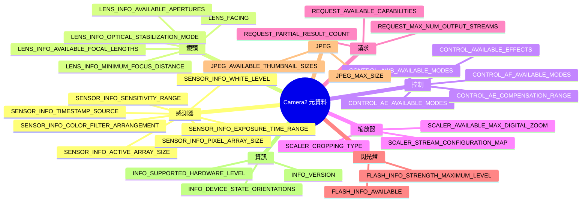

import Tabs from '@theme/Tabs';
import TabItem from '@theme/TabItem';

# 相機元資料百科全書

## 配套應用程式

在你自己的裝置上即時檢視本百科中每一個鍵 —— 安裝 Android Camera Parameters 應用程式:

- **GitHub(開源):** [github.com/zoozooll/AndroidCameraParameters](https://github.com/zoozooll/AndroidCameraParameters)
- **Google Play:** [play.google.com/store/apps/details?id=com.minininja.cameraparams](https://play.google.com/store/apps/details?id=com.minininja.cameraparams)

該應用程式是本頁每一個概念的活實作。下方每個元資料條目都會告訴你具體在哪個分頁和畫面顯示該值,以便你與手中真實裝置進行對照驗證。

---

## 元資料分類法



---

## 簡介

歡迎來到相機元資料百科全書,這是理解描述 Android 相機裝置每一項能力的 300+ 元資料鍵的權威參考。如果本系列之前的章節教的是 *如何* 操作 Camera2 —— 開啟工作階段、建構請求、串流傳輸 Surface —— 本百科教的是你的相機 *實際能做什麼*。你在 `CaptureRequest.Builder` 中啟用的每一個功能,都必須先與 `CameraCharacteristics` 校對。跳過這一步,你的應用程式就會在某一比例的裝置上崩潰,或者更糟,靜默地產生損壞的輸出。

本百科的存在,是因為 Camera2 元資料在官方 Android SDK 參考中的文件出了名的匱乏。文件告訴你每個鍵的型別(一個 `Range&lt;Int&gt;`、一個 `FloatArray` 等),卻很少告訴你 *語意*:實務中的「屈光度(diopter)」是什麼意思,為什麼 active array size 與 pixel array size 不同,或者在暴露手動 ISO 按鈕之前必須把哪些鍵組合在一起檢查。這裡的條目透過生產級程式碼、常見 OEM 坑,以及來自 Android Camera Parameters 資料庫中數千份裝置設定檔的真實裝置行為,彌合了這一鴻溝。

把本頁當作相機應用程式架構的查閱表。設計設定介面時,去 Control 章節;建構變焦 UI 時,去 Scaler;編寫 RAW 處理管線時,去 Sensor。每個條目都遵循同樣的六點結構,所以你可以直接跳到需要的程式碼而無需重新學習布局。手機上的配套應用程式隨後會驗證同樣的查詢能對三星、索尼、海思、聯發科和 Google Tensor 的真實晶片工作。

沒有任何裝置支援本百科中的每一個鍵。這正是全部要點。Camera2 開發的正確模式是:查詢鍵 → 對結果做空檢查 → 對 UI 做功能閘控 → 記錄兜底路徑。本頁給你查詢、檢查,以及跳過它就會踩到的坑。

---

## Camera2 元資料如何組織

Camera2 元資料存在於三個並列的類別層級中,全部以 `android.hardware.camera2.CameraMetadata` 為根。相機 *能* 做什麼的靜態描述位於 `CameraCharacteristics` 中 —— 你透過 `CameraManager.getCameraIdList()` 發現某個 camera ID 後,每個 ID 只查詢一次。每個請求中你 *想讓* 相機做什麼的描述位於 `CaptureRequest` 中 —— 你透過 `CaptureRequest.Builder.set()` 填充鍵。每幀中相機 *實際做了什麼* 的描述位於 `CaptureResult`(或其完整變體 `TotalCaptureResult`)中 —— 你從 `CameraCaptureSession.CaptureCallback.onCaptureCompleted()` 回呼裡讀取鍵。

三個層級中的所有鍵都繼承自 `CaptureResult.Key<T>`(或其兄弟 `CameraCharacteristics.Key<T>` 和 `CaptureRequest.Key<T>`),都是強型別欄位描述符。三個類別合計有超過 300 個公開鍵,加上透過 `CameraCharacteristics.get(CameraCharacteristics.REQUEST_AVAILABLE_SESSION_KEYS)` 在某些廠商擴充上可存取的額外 OEM 私有鍵。本百科中的分類遵循 HAL3 介面規範所用的概念分組:Sensor 描述成像器,Lens 描述光學元件,Control 描述 3A(自動曝光、自動對焦、自動白平衡)演算法,Scaler 描述裁剪與縮放管線,Request 描述跨切面能力旗標,Flash 描述手電筒/閃光燈 LED,JPEG 描述靜態影像編碼器,Info 描述相機封裝與 HAL 版本。

---

## 本百科的約定

下方每個元資料條目都嚴格包含六個章節:

1. **它是什麼?** 鍵、其型別和語意的 1–2 段定義。
2. **它為何存在?** 促使 Android 工程師暴露此鍵(而不是隱式派生該值)的設計動機。
3. **哪些裝置支援?** 此鍵變得有意義的最低硬體等級、能力旗標和 Android 版本。
4. **如何查詢?** 完整的、帶空安全的 Kotlin 程式碼片段,展示確切的 `characteristics.get()` 呼叫以及錯誤處理。
5. **如何在 Android Camera Parameters 中檢視?** 配套應用程式中能看到該值在裝置上呈現的確切分頁層級。
6. **常見坑。** 開發者遇到的一個或多個真實問題,通常涉及 OEM 碎片化、鍵之間隱藏的狀態耦合,或對單位的誤解。

程式碼片段使用道地的 Kotlin,帶有空安全運算子(`?.`)、Elvis 運算子(`?:`)以及用於兜底的 `run` 區塊。所有片段假定你已持有名為 `characteristics` 的 `CameraCharacteristics` 實例(透過 `cameraManager.getCameraCharacteristics(cameraId)` 取得)。產生使用者可見輸出的片段使用帶單位(屈光度、奈秒、EV 步進)的字串格式化,便於直接放進 `PreferenceScreen` 或 `TextView` 偵錯疊加層。

配套應用程式的參照總是使用同樣的模式:*分頁名 / 子分頁名*。例如 "Overview / Hardware Level" 表示:開啟應用程式,點擊底部導覽的 Overview 分頁,然後找 Hardware Level 卡片。如果某個鍵出現在多個畫面,我們先列出規範的主位置。

---

## Sensor 分類

### SENSOR_INFO_ACTIVE_ARRAY_SIZE

**1. 它是什麼?**

`SENSOR_INFO_ACTIVE_ARRAY_SIZE` 是一個 `android.graphics.Rect`,描述完整感測器晶粒(die)內活動成像區的像素座標。實務中這是能實際讀出並交付給輸出串流的最大像素矩形。該矩形始終軸向對齊,以 `(0,0)` 為完整像素陣列左上角的像素座標系表示。8K×6K 感測器的典型值形如 `Rect(0, 0, 8000, 6000)`;當感測器廠商在邊緣留下一圈非活動邊框(光學黑像素)時則形如 `Rect(120, 160, 3880, 2880)`。

你配置的每一個輸出串流 —— 無論是 JPEG、YUV_420_888、RAW 還是預覽 SurfaceTexture —— 最終都從這個活動區裁剪而來。當你請求一張 4:3 的 12MP JPEG,相機 ISP 把活動陣列裁剪到 4:3 寬高比並縮放。當你透過 `SCALER_CROP_REGION` 套用數位變焦時,該裁剪區本身就是相對活動陣列(而非像素陣列)裁剪的。

**2. 它為何存在?**

感測器晶粒總是含有比交付給 ISP 管線更多的物理光敏二極體。最外圈的行與列是「啞元」或「光學黑」像素,用於暗電流校準和鏡頭陰影校正 —— 不是真正的影像資料。沒有 `SENSOR_INFO_ACTIVE_ARRAY_SIZE`,開發者就無法知道該用哪個座標系來計算 `SCALER_CROP_REGION` 或基於人臉的裁剪追蹤。Camera1 時代完全隱藏了這一區別,導致數位變焦的數學在不同 OEM 間不一致。Camera2 顯式暴露它,使裁剪區可被像素級精確計算。

**3. 哪些裝置支援?**

所有 Camera2 裝置在所有硬體等級(LEGACY、LIMITED、FULL、LEVEL_3)都支援此鍵。它出現在每個 camera ID(包括外部 USB 相機)的 `CameraCharacteristics.getAvailableCaptureResultKeys()` 中。該矩形始終非空,其寬/高永不超過 `SENSOR_INFO_PIXEL_ARRAY_SIZE`。

**4. 如何查詢?**

```kotlin
val activeArray: Rect? = characteristics.get(
    CameraCharacteristics.SENSOR_INFO_ACTIVE_ARRAY_SIZE
)

activeArray?.let { rect ->
    val widthPx = rect.width()
    val heightPx = rect.height()
    val megapixels = (widthPx * heightPx) / 1_000_000.0
    Log.d(TAG, "活動陣列: ${widthPx}×${heightPx}px (%.1f MP)".format(megapixels))
    Log.d(TAG, "  Left=${rect.left}, Top=${rect.top}, Right=${rect.right}, Bottom=${rect.bottom}")
} ?: run {
    Log.w(TAG, "此裝置上活動陣列尺寸不可用")
}
```

**5. 如何在 Android Camera Parameters 中檢視?**

前往 **Sensor / Sensor Info**。活動陣列算繪為 "Sensor Geometry" 卡片的第二行,位於像素陣列尺寸下方。配套應用程式還把活動陣列矩形以視覺方式疊加在像素陣列的縮放表示上,讓你一眼看出物理晶粒中實際可用的部分。

**6. 常見坑**

最大的錯誤是查詢 `SENSOR_INFO_PIXEL_ARRAY_SIZE` 後期望 JPEG 輸出是該解析度。全尺寸靜態影像始終使用活動陣列尺寸,而非像素陣列。在典型的 50MP 三星 ISOCELL 感測器上,像素陣列可能是 8192×6144,而活動陣列是 8000×6000。如果你按像素陣列配置 50.3MP 緩衝區,會得到一張 48MP 影像,其餘像素被靜默丟棄;更糟的是在舊 HAL 裝置上會得到損壞的損壞的緩衝區。緩衝區尺寸永遠用 `activeArray.width() * activeArray.height()`,而非像素陣列乘積。第二個常見坑是使用活動陣列座標卻不帶偏移:當矩形 top/left 非零時,裁剪區數學必須加上該原點,否則變焦會偏向左上角漂移。

---

### SENSOR_INFO_PIXEL_ARRAY_SIZE

**1. 它是什麼?**

`SENSOR_INFO_PIXEL_ARRAY_SIZE` 是一個 `android.util.Size`,表示感測器晶粒上物理光敏二極體的總數,包括任何光學黑或啞元邊框像素。這就是「行銷像素」數:108MP 感測器對外標稱像素陣列尺寸為 12000×9000,無論實際交付給 ISP 管線多少像素。型別上它是簡單的 `Size`,帶 `.width` 與 `.height` 欄位。

與活動陣列的關係始終是:
- `pixelArray.width >= activeArray.width`
- `pixelArray.height >= activeArray.height`

差值通常在每條軸 100–400 像素,用於光學黑(OB)行和出廠鏡頭陰影校準。

**2. 它為何存在?**

RAW 拍攝管線需要完整像素尺寸以正確解析 RAW10/RAW12/RAW16 緩衝區,因為 RAW 格式(當 `SENSOR_INFO_PRE_CORRECTION_ACTIVE_ARRAY_SIZE` 不可用時)有時包含 OB 行。編寫自訂去馬賽克或暗幀相減程式碼的開發者,也需要知道每條邊框要剝除多少像素才能處理。面向消費端,行銷團隊和基準測試應用程式用像素陣列尺寸報告「真實」感測器解析度,繞開 OEM 的 ISP 裁剪。

**3. 哪些裝置支援?**

所有硬體等級都暴露此鍵。無能力旗標前置條件。支援 RAW 的的裝置(聲明 `REQUEST_AVAILABLE_CAPABILITIES_RAW` 的裝置)受 Camera2 CDD 要求,需將像素陣列尺寸報告至與物理感測器規格相差一行/列之內。

**4. 如何查詢?**

```kotlin
val pixelArray: Size? = characteristics.get(
    CameraCharacteristics.SENSOR_INFO_PIXEL_ARRAY_SIZE
)

pixelArray?.let { size ->
    val mp = (size.width * size.height) / 1_000_000.0
    Log.d(TAG, "像素陣列: ${size.width}×${size.height}px (%.1f MP 行銷值)".format(mp))
    
    characteristics.get(CameraCharacteristics.SENSOR_INFO_ACTIVE_ARRAY_SIZE)?.let { active ->
        val usablePct = (active.width() * active.height()).toDouble() /
                        (size.width * size.height).toDouble() * 100.0
        Log.d(TAG, "  %.1f%% 的像素可透過活動陣列交付".format(usablePct))
    }
} ?: run {
    Log.w(TAG, "像素陣列尺寸不可用")
}
```

**5. 如何在 Android Camera Parameters 中檢視?**

開啟 **Sensor / Sensor Info**,檢視 "Sensor Geometry" 卡片第一項,標籤為 "Pixel Array"。應用程式以 寬×高 算繪,括號中是行銷像素數(例如 "8192 × 6144 (50.3 MP)")。點擊該行會彈出對話框,以對比表展示像素陣列、活動陣列與 pre-correction active array。

**6. 常見坑**

把像素陣列與可交付 JPEG 尺寸混淆,在 Camera2 新手中幾乎人手一份。流程始終是:(1) 查詢 `SCALER_STREAM_CONFIGURATION_MAP.getOutputSizes(ImageFormat.JPEG)` 取得編碼器能產生的 *實際* 解析度,(2) 最大 JPEG 尺寸會等於(或是 `SENSOR_INFO_ACTIVE_ARRAY_SIZE` 的縮放裁剪),絕不是像素陣列。如果你寫程式碼用像素陣列尺寸算 4:3 裁剪,結果會比 ISP 實際能交付的略寬,相機裝置會靜默夾緊 —— 在人臉追蹤變焦中引入細微的像素漂移。第二,在聲明 `REQUEST_AVAILABLE_CAPABILITIES_PRIVATE_REPROCESSING` 的可重處理裝置上,重處理輸入尺寸使用像素陣列語意;用活動陣列做重處理會導致幀對齊錯誤。

---

### SENSOR_INFO_SENSITIVITY_RANGE

**1. 它是什麼?**

`SENSOR_INFO_SENSITIVITY_RANGE` 是一個 `android.util.Range&lt;Int&gt;`,指定感測器 *在原始讀出期間* 可套用的最小和最大 ISO(類比增益)值。單位是 ISO 算術值:100 是基礎 ISO(最乾淨、雜訊最低的影像),6400 或更高是高感光度模式(雜訊更大,相同 EV 下快門時間更短)。現代裝置的典型範圍:中端機 `[100, 6400]`;像素阱較大的旗艦感測器 `[50, 12800]` 或 `[32, 25600]`。

感光度在 ISP 管線中 *先於* 任何數位增益套用。這裡回傳的值對應你啟用手動控制後在 `CaptureRequest.SENSOR_SENSITIVITY` 中所設的值。

**2. 它為何存在?**

每個 CMOS 感測器都有物理最小增益等級(由讀出放大器決定)和最大等級(由類比訊號在削波或不可接受雜訊之前可被放大多少決定)。沒有顯式範圍,各 OEM 會用不同的隱式預設值。Camera2 暴露此範圍,使手動曝光 UI 滑桿有正確的最小/最大端點,並讓開發者能在提交給 capture session 之前 *先* 校驗手動 ISO 請求 —— 避免請求越界時 session 拋出含糊的 `IllegalArgumentException`。

**3. 哪些裝置支援?**

所有裝置均以 `Range&lt;Int&gt;` 暴露此鍵。但只有在裝置能力清單中聲明 `REQUEST_AVAILABLE_CAPABILITIES_MANUAL_SENSOR` 時,這些值才是 *可控制* 的。在缺少該旗標的 LIMITED 等級等級裝置上,範圍仍會回傳值(通常 `[100, 800]`),但在 CaptureRequest 中設定 `SENSOR_SENSITIVITY` 會被忽略 —— AE 演算法繼續做主。手動 ISO 的 UI 一定要基於 MANUAL_SENSOR 旗標閘控,而非基於範圍非空。

**4. 如何查詢?**

```kotlin
val sensitivityRange: Range<Int>? = characteristics.get(
    CameraCharacteristics.SENSOR_INFO_SENSITIVITY_RANGE
)

val capabilities: IntArray? = characteristics.get(
    CameraCharacteristics.REQUEST_AVAILABLE_CAPABILITIES
)
val hasManualSensor = capabilities?.contains(
    CameraCharacteristics.REQUEST_AVAILABLE_CAPABILITIES_MANUAL_SENSOR
) ?: false

sensitivityRange?.let { range ->
    Log.d(TAG, "感光度範圍: ISO ${range.lower} 至 ISO ${range.upper}")
    Log.d(TAG, "  手動 ISO 控制可用: $hasManualSensor")
    
    if (hasManualSensor) {
        val stopCount = log2(range.upper.toDouble() / range.lower.toDouble())
        Log.d(TAG, "  動態範圍: %.1f 檔".format(stopCount))
    } else {
        Log.w(TAG, "  警告: 範圍已報告但 MANUAL_SENSOR 旗標缺失。")
        Log.w(TAG, "  設定 SENSOR_SENSITIVITY 會被 AE 演算法忽略!")
    }
} ?: run {
    Log.w(TAG, "感光度範圍不可用")
}
```

**5. 如何在 Android Camera Parameters 中檢視?**

前往 **Sensor / Manual Sensor**,感光度範圍以第一張卡片的 "ISO Range" 呈現。在具備 MANUAL_SENSOR 能力的裝置上,範圍下方有滑塊預覽,指示手動 UI 暴露的範圍。在不支援手動的裝置上,應用程式明確把範圍標為 "Read Only",並顯示警告橫幅說明這些值僅供參考。

**6. 常見坑**

第一個坑:看到有效的感光度範圍就啟用手動 ISO 控件,卻不檢查 `MANUAL_SENSOR`。這會在開發者測試機(比如 Pixel 8,FULL 硬體等級)上工作,但滑桿在現場約 60% 的中端機上靜默無效。使用者看到 UI、拖動滑桿、看不到雜訊變化,然後留下一星差評。一定要兩個鍵一起檢查。

第二個坑:單位混淆。`SENSOR_SENSITIVITY` 用 ISO *算術值*,不是對數。一個 *線性* 從 100 到 6400 的滑桿會讓頂部 75% 的軌道感覺一樣(6400→3200 是一檔,3200→1600 又一檔,……,200→100 是最後一檔),而底部 25% 覆蓋 6 檔。正確的滑桿用對數刻度插值,使每 10% 軌道約等於一檔。

---

### SENSOR_INFO_EXPOSURE_TIME_RANGE

**1. 它是什麼?**

`SENSOR_INFO_EXPOSURE_TIME_RANGE` 是一個 `android.util.Range&lt;Long&gt;`,指定感測器對單幀曝光的最短和最長快門時長,以 **奈秒** 為單位。該範圍內的每個值都是啟用手動感測器控制時 `CaptureRequest.SENSOR_EXPOSURE_TIME` 的合法參數。中端裝置的典型範圍約從 `Range(1_000_000L, 1_000_000_000L)`(最短 1 毫秒、最長 1 秒),到具備專用夜景模式的旗艦 FULL 等級裝置 `Range(100_000L, 10_000_000_000L)`(0.1 毫秒至 10 秒)。少數 LEVEL_3 電影級外接相機可達 30 秒或更長。

奈秒與常用時間單位換算:
- 1 微秒 = 1,000 ns
- 1 毫秒 = 1,000,000 ns
- 1 秒 = 1,000,000,000 ns

**2. 它為何存在?**

Camera HAL 需要與上層有顯式的快門時長約定,原因有二。其一,長曝光與 `SENSOR_FRAME_DURATION` 的互動不直觀:如果你請求 5 秒曝光,最小幀時長會跳到 5 秒加感測器消隱,意味著預覽回呼 5 秒不到,UI 看起來卡死。其二,極短曝光(微秒級)與感測器的 rolling-shutter 傾斜互動;低於最小曝光時長時感測器讀出時序跟不上,輸出幀會出現損壞的掃描線。

**3. 哪些裝置支援?**

與感光度範圍一樣,此鍵在所有裝置上都存在,但只有當 `MANUAL_SENSOR` 在能力清單中時才 *可控制*。缺乏手動感測器支援的 LIMITED 裝置仍會報告一個合理的曝光範圍(通常 1 毫秒至 1/30 秒),以便 AE 時序分析工具推斷 AE 演算法行為,但手動設定會被忽略。完整手動控制需要範圍 *加上* 能力旗標兩者皆有。

**4. 如何查詢?**

```kotlin
fun Long.nanosToSeconds(): Double = this / 1_000_000_000.0
fun Long.nanosToMillis(): Double = this / 1_000_000.0
fun Double.secondsToNanos(): Long = (this * 1_000_000_000.0).toLong()

val exposureRange: Range<Long>? = characteristics.get(
    CameraCharacteristics.SENSOR_INFO_EXPOSURE_TIME_RANGE
)

val hasManualSensor = characteristics.get(
    CameraCharacteristics.REQUEST_AVAILABLE_CAPABILITIES
)?.contains(CameraCharacteristics.REQUEST_AVAILABLE_CAPABILITIES_MANUAL_SENSOR) ?: false

exposureRange?.let { range ->
    Log.d(TAG, "曝光時長範圍:")
    Log.d(TAG, "  最小: ${range.lower} ns = %.4f ms = %.7f s"
        .format(range.lower.nanosToMillis(), range.lower.nanosToSeconds()))
    Log.d(TAG, "  最大: ${range.upper} ns = %.2f ms = %.4f s"
        .format(range.upper.nanosToMillis(), range.upper.nanosToSeconds()))
    Log.d(TAG, "  手動快門控制可用: $hasManualSensor")
    
    val shutterSpeeds = listOf(
        0.001, 0.002, 0.004, 0.008, 0.016, 0.033,
        0.066, 0.125, 0.25, 0.5, 1.0, 2.0, 4.0, 8.0
    )
    val supportedSpeeds = shutterSpeeds.filter { s ->
        val ns = s.secondsToNanos()
        ns >= range.lower && ns <= range.upper
    }
    Log.d(TAG, "  支援的常用檔位: $supportedSpeeds 秒")
} ?: run {
    Log.w(TAG, "曝光時長範圍不可用")
}
```

**5. 如何在 Android Camera Parameters 中檢視?**

前往 **Sensor / Manual Sensor** 卡片,標題 "Exposure Range"。應用程式以三種方式展示數值:兩端點的原始奈秒、毫秒、秒。下方一條橫向時間線視覺化該範圍,常用快門檔位(1/1000 s 至 8 s)標為刻度,一眼可看出長曝光夜景是否可行。手動控制能力用綠色勾號(可控制)或紅色 "read-only" 標籤指示。

**6. 常見坑**

預覽卡死坑:開發者為弱光靜態拍攝設定 4 秒曝光,卻忘了同一個 `CaptureRequest` 會套用到 session 中的 *所有* Surface,包括預覽 `SurfaceTexture`。結果:4 秒內無預覽預覽幀到達,螢幕凍結,使用者以為應用程式崩潰。修復:為預覽 Surface 使用單幀 30 fps 的常規 repeating request,然後透過 `CaptureRequest.Builder.addTarget()` 把長曝光只套用到 JPEG/RAW Surface,以單獨的 `setRepeatingBurst` 或 `capture` 呼叫發起。

第二個坑是單位換算中的整數溢位。乘除 `1_000_000_000` 接近 32 位元整數極限。任何持有奈秒的變數一律用 `Long`(64 位元),並寫顯式輔助擴充函式(如上面的 `nanosToSeconds()`),以避免除法順序錯誤。1 秒曝光存為 Int 在約 2.1 秒處溢位,導致 HAL 收到負的曝光時長,在某些聯發科 HAL 上會崩潰 session 或靜默夾緊到最小值。

---

### SENSOR_INFO_WHITE_LEVEL

**1. 它是什麼?**

`SENSOR_INFO_WHITE_LEVEL` 是單個 `Int`,表示 RAW 感測器像素在削波前能達到的最大數模轉換器(ADC)碼值。對 RAW10 感測器(每通道每像素 10 位元),white level 通常為 1023(2¹⁰−1)。RAW12 通常 4095。RAW14 通常 16383。部分感測器略向下取整(如 RAW14 用 16300 而非 16383),為 HDR 高光或像素缺陷校正留餘量;具體值由工廠逐感測器校準。

這是每通道的飽和值。在該感測器的任一 RAW 幀中,任何達到(或超過)white level 的像素通道都代表過曝高光,無可恢復細節。

**2. 它為何存在?**

RAW 像素格式每通道使用相同位元深度。RAW10 緩衝區把每個像素存為 16 位元對齊整數,不熟悉 RAW 處理的開發者在正規化到浮點時自然會除以 65535(16 位元最大值)。這會產生偏暗、發灰且黑點扣除錯誤的影像。`SENSOR_INFO_WHITE_LEVEL` 給你正確的除數:把 RAW 像素除以 `WHITE_LEVEL - BLACK_LEVEL_PATTERN`(不是 65535)得到 0.0–1.0 線性光範圍。每個 RAW 感測器還有 `SENSOR_BLACK_LEVEL_PATTERN` 鍵,給出每通道零曝光偏移;兩者結合即得完整 RAW 到浮點的正規化曲線。

**3. 哪些裝置支援?**

任何在能力清單中聲明 `REQUEST_AVAILABLE_CAPABILITIES_RAW` 的裝置都要求此鍵 —— 即任何能透過 `ImageReader` 輸出 RAW10/RAW12/RAW16 緩衝區的相機。在非 RAW 裝置上該鍵可能仍存在(回傳與感測器原生位元深度匹配的標稱值),但無法讀取 RAW 像素,所以該鍵僅作資訊。

**4. 如何查詢?**

```kotlin
val whiteLevel: Int? = characteristics.get(
    CameraCharacteristics.SENSOR_INFO_WHITE_LEVEL
)

val blackLevelPattern: IntArray? = characteristics.get(
    CameraCharacteristics.SENSOR_BLACK_LEVEL_PATTERN
)

whiteLevel?.let { wl ->
    Log.d(TAG, "SENSOR_INFO_WHITE_LEVEL = $wl")
    
    val bits = ceil(log2(wl.toDouble() + 1.0)).toInt()
    Log.d(TAG, "  有效 RAW 位元深度: $bits 位元每通道")
    Log.d(TAG, "  最大 RAW 像素值(飽和): $wl")
    
    blackLevelPattern?.let { bl ->
        if (bl.size == 4) {
            Log.d(TAG, "  黑電平模式 (R, Gr, Gb, B) = [${bl[0]}, ${bl[1]}, ${bl[2]}, ${bl[3]}]")
            val avgBlack = (bl[0] + bl[1] + bl[2] + bl[3]) / 4.0
            val usableDnRange = wl - avgBlack
            val stops = log2(usableDnRange / avgBlack)
            Log.d(TAG, "  正規化除數: ${wl - avgBlack.toInt()}")
            Log.d(TAG, "  估算 RAW 動態範圍: %.1f 檔".format(stops))
        }
    } ?: run {
        Log.d(TAG, "  無黑電平模式。假設 0,直接用 $wl 正規化。")
    }
} ?: run {
    Log.w(TAG, "white level 不可用 —— 可能不支援 RAW 輸出")
}
```

**5. 如何在 Android Camera Parameters 中檢視?**

white level 在 **Sensor / Sensor Info** 的 "RAW Sensor Parameters" 卡片中,緊鄰 black level pattern 和 color filter arrangement。若 RAW 能力存在,配套應用程式用裝置自身的 white level 正確正規化水平漸層條做即時預覽,便於視覺對比正確正規化(使用此鍵)與常見的除以 65535 的錯誤 —— 錯誤版本明顯更暗。

**6. 常見坑**

用 65535 而非 white level 正規化,是 RAW 處理的通用第一錯誤。一張 RAW10 照片用 65535 正規化後亮度約為 1/64 —— 幾乎全黑。開發者會注意到並加 64× 增益補償,但這會引入帶狀瑕疵,因為把 10 位元資訊拉伸到 16 位元精度,壓縮了色調範圍。正確程式碼先減去黑電平,再除以(white level 減黑電平)。這給出正確曝光的線性光影像,可送入 gamma 與色調對映。

第二個坑:在部分 HDR 感測器上 white level 會 *逐幀* 變化,因為 staggered-HDR 讀出的長/短曝光間 ADC 增益變化。在 Android 13+ 裝置上,於每個 `onCaptureCompleted` 回呼中檢查 `CaptureResult.SENSOR_DYNAMIC_WHITE_LEVEL`;可用時用逐幀值,而非靜態 `CameraCharacteristics` 常數。在 HDR 感測器上靜態快取 white level 會讓短曝光幀高光削波。

---

### SENSOR_INFO_COLOR_FILTER_ARRANGEMENT

**1. 它是什麼?**

`SENSOR_INFO_COLOR_FILTER_ARRANGEMENT` 是一個 `Int` 列舉,描述感測器光敏二極體上方 Bayer 濾色陣列(CFA)的布局。CFA 是給每個像素每個像素賦予紅、綠、藍感色性的微观光學馬賽克(每個 2×2 區塊中有兩個綠像素)。可能取值:
- `SENSOR_INFO_COLOR_FILTER_ARRANGEMENT_RGGB` —— 最常見(頂行紅-綠,次行綠-藍)
- `SENSOR_INFO_COLOR_FILTER_ARRANGEMENT_GRBG` —— 綠-紅 / 藍-綠 變體
- `SENSOR_INFO_COLOR_FILTER_ARRANGEMENT_BGGR` —— 藍-綠 / 綠-紅 變體(索尼感測器常見)
- `SENSOR_INFO_COLOR_FILTER_ARRANGEMENT_GBRG` —— 綠-藍 / 紅-綠 變體
- `SENSOR_INFO_COLOR_FILTER_ARRANGEMENT_MONOCHROME` —— 無濾色片,純亮度感測器(紅外或專用夜視相機)

該排列描述活動陣列 (x=0, y=0) 左上像素。整個感測器表面每 2×2 區塊重複此模式。

**2. 它為何存在?**

RAW 感測器資料天然是單色的。必須套用去馬賽克演算法,透過插值每個像素缺失的兩個顏色通道來重建完整 RGB 影像。去馬賽克演算法 *必須* 知道每個物理位置是什麼顏色。若對 BGGR 感測器跑 RGGB 去馬賽克,會得到顏色反轉的影像:紅像素變藍,藍變紅,人眼立刻察覺膚色不對。去馬賽克品質也依賴 CFA —— AMaZE 或 LMMSE 等自適應演算法需要確切排列才能選對插值方向。

**3. 哪些裝置支援?**

所有 RAW 能力裝置必需。在不支援 RAW 輸出的裝置上該鍵可能仍存在(便於分析工具描述感測器構造),但沒有 *需要* 該值的程式碼路徑。透過 EXTERNAL 硬體等級接入的外接 USB 相機有時省略此鍵;你必須兜底為 `SENSOR_INFO_COLOR_FILTER_ARRANGEMENT_RGGB` 預設值,因為 USB UVC 相機幾乎都用 RGGB。

**4. 如何查詢?**

```kotlin
val cfa: Int? = characteristics.get(
    CameraCharacteristics.SENSOR_INFO_COLOR_FILTER_ARRANGEMENT
)

cfa?.let { arrangement ->
    val arrangementName = when (arrangement) {
        CameraCharacteristics.SENSOR_INFO_COLOR_FILTER_ARRANGEMENT_RGGB -> "RGGB"
        CameraCharacteristics.SENSOR_INFO_COLOR_FILTER_ARRANGEMENT_GRBG -> "GRBG"
        CameraCharacteristics.SENSOR_INFO_COLOR_FILTER_ARRANGEMENT_BGGR -> "BGGR"
        CameraCharacteristics.SENSOR_INFO_COLOR_FILTER_ARRANGEMENT_GBRG -> "GBRG"
        CameraCharacteristics.SENSOR_INFO_COLOR_FILTER_ARRANGEMENT_MONOCHROME -> "MONOCHROME"
        else -> "UNKNOWN (value=$arrangement)"
    }
    Log.d(TAG, "Color Filter Arrangement = $arrangementName")
    
    val isMono = arrangement == CameraCharacteristics
        .SENSOR_INFO_COLOR_FILTER_ARRANGEMENT_MONOCHROME
    
    Log.d(TAG, "  是否為單色感測器: $isMono")
    if (isMono) {
        Log.d(TAG, "  去馬賽克: 不需要。像素已是純亮度。")
        Log.d(TAG, "  提示: 跳過 de-Bayer 步驟。直接把 RAW 當灰階處理。")
    } else {
        Log.d(TAG, "  去馬賽克: 需要。在 RAW 解碼器中使用 CFA '$arrangementName'。")
        Log.d(TAG, "  像素 (0,0) 通道: " + when (arrangement) {
            CameraCharacteristics.SENSOR_INFO_COLOR_FILTER_ARRANGEMENT_RGGB -> "紅"
            CameraCharacteristics.SENSOR_INFO_COLOR_FILTER_ARRANGEMENT_GRBG -> "綠(紅行)"
            CameraCharacteristics.SENSOR_INFO_COLOR_FILTER_ARRANGEMENT_BGGR -> "藍"
            CameraCharacteristics.SENSOR_INFO_COLOR_FILTER_ARRANGEMENT_GBRG -> "綠(藍行)"
            else -> "?"
        })
    }
} ?: run {
    Log.w(TAG, "無 CFA 資訊。外接 USB / 舊裝置兜底為 RGGB。")
}
```

**5. 如何在 Android Camera Parameters 中檢視?**

開啟 **Sensor / Sensor Info**,在 RAW Sensor Parameters 卡片中檢視 "Color Filter Array" 行。應用程式按感測器報告的實際排列算繪 4×4 像素的馬賽克視覺化 —— 紅、綠、藍方塊按晶片看到的方式鋪排。單色感測器算繪為平面灰色網格,標籤 "NO CFA"。

**6. 常見坑**

硬編碼 RGGB 去馬賽克是硬失敗模式。市面每顆索尼 Exmor-RS 感測器都用 BGGR,所以硬編碼 RGGB 後,程式碼在你測試的三星 ISOCELL 手機上工作,卻在每台 Xperia、大多數 Pixel 以及所有執行 Android 的 iPhone(若真存在)上產生顏色反轉影像。修復很簡單:讀鍵並對去馬賽克分支。許多開源 RAW 庫(libraw、OpenImageIO)直接接受 CFA 列舉,把 Android CFA 值對映到庫常數並透傳即可。

第二個坑:`SENSOR_INFO_COLOR_FILTER_ARRANGEMENT` 描述活動陣列左上像素。若裁剪 RAW 緩衝區(比如提取 1000×1000 區域做人臉處理),CFA 模式會按 (crop.left mod 2, crop.top mod 2) *偏移*。向右裁 1 像素把 RGGB 變成 GRBG;右 1 下 1 把 RGGB 變成 BGGR。多數開發者忘了這點,用原始模式對裁剪區去馬賽克,產生高頻色彩摩爾紋,看起來像去馬賽克 bug,其實是座標 bug。修復:按裁剪奇偶性調整 CFA,或始終在偶數邊界裁剪。

---

## Lens 分類

### LENS_FACING

**1. 它是什麼?**

`LENS_FACING` 是一個 `Int` 列舉,描述相機模組相對於裝置螢幕的物理安裝方向。三個可能值:
- `LENS_FACING_BACK` —— 相機背向使用者(「主」相機,用於橫拍風景)
- `LENS_FACING_FRONT` —— 相機朝向使用者(自拍相機,始終裝在螢幕邊框或瀏海中)
- `LENS_FACING_EXTERNAL` —— USB 相機、HDMI 擷取卡或其他熱插拔、方向未知的相機

此鍵對每個 camera ID 是靜態的;在裝置生命週期中永不變(可摺疊裝置除外 —— 見 Info 章節的 `INFO_DEVICE_STATE_ORIENTATIONS`)。

**2. 它為何存在?**

facing 最直觀的影響在預覽變換。Android 要求後置相機預覽隨裝置方向旋轉,使用感測器的自然橫向方向加上 `SENSOR_ORIENTATION`;前置相機預覽還必須 **水平鏡像**,讓使用者像照鏡子一樣看自己。沒有 facing 鍵,每個應用程式都得用啟發式猜測哪顆是哪顆(第一 ID = 後,第二 = 前),這在 ID 0、1、2、3 全是後置的多攝裝置上會失效。

**3. 哪些裝置支援?**

每個裝置的每個 camera ID 都報告此鍵。透過 `CameraManager.getCameraIdList()` 列舉的合法 camera ID 不可能沒填 `LENS_FACING`。即便是 LEGACY 等級的 Camera1 包裝裝置也暴露它。外接 USB 相機預設得到 `LENS_FACING_EXTERNAL`。

**4. 如何查詢?**

```kotlin
val facing: Int? = characteristics.get(
    CameraCharacteristics.LENS_FACING
)

facing?.let { f ->
    val (name, emoji) = when (f) {
        CameraCharacteristics.LENS_FACING_BACK -> "Back" to "📷"
        CameraCharacteristics.LENS_FACING_FRONT -> "Front" to "🤳"
        CameraCharacteristics.LENS_FACING_EXTERNAL -> "External" to "🔌"
        else -> "Unknown ($f)" to "❓"
    }
    Log.d(TAG, "LENS_FACING = $name $emoji")
    
    val sensorOrientation = characteristics.get(
        CameraCharacteristics.SENSOR_ORIENTATION
    ) ?: 0
    
    Log.d(TAG, "  感測器方向(自然旋轉): $sensorOrientation°")
    
    val totalDisplayRotation = when (f) {
        CameraCharacteristics.LENS_FACING_FRONT -> {
            (sensorOrientation + displayRotation) % 360
            (360 - ((sensorOrientation + displayRotation) % 360)) % 360
        }
        CameraCharacteristics.LENS_FACING_BACK,
        CameraCharacteristics.LENS_FACING_EXTERNAL -> {
            (sensorOrientation + displayRotation) % 360
        }
        else -> displayRotation
    }
    Log.d(TAG, "  計算出的顯示旋轉: $totalDisplayRotation°")
    Log.d(TAG, "  前置相機: 必須水平鏡像預覽 TextureView/SurfaceView")
} ?: run {
    Log.e(TAG, "LENS_FACING 為 null —— 這在合法 camera ID 上不應發生")
}
```

**5. 如何在 Android Camera Parameters 中檢視?**

前往 **Overview / Cameras**。第一張卡片把每個 camera ID 列為一行,以緊湊形式顯示 facing、感測器方向、像素數和硬體等級。前置相機有 "🤳" 徽章,後置有 "📷",外接 USB 相機顯示 "🔌"。點擊任一行開啟詳細檢視,facing 是第一個元資料欄位。

**6. 常見坑**

自拍鏡像坑幾乎人手一份:開發者正確地為前置預覽 `TextureView` 做鏡像以獲得自然的「照鏡子」體驗,然後透過 `ImageReader` 拍 JPEG,疑惑照片 *沒* 鏡像。鏡像只是套用於預覽 Surface 的 **僅顯示變換**。實際感測器像素(因而 JPEG 位元組)從不被鏡像。使用者討厭這點:「我的自拍看起來反了!」修復是把水平翻轉寫入 JPEG 的 EXIF 方向標籤,用 `ExifInterface`。對前置相機把 `TAG_ORIENTATION` 設為 `ORIENTATION_FLIP_HORIZONTAL`。多數相簿應用程式尊重此旗標並以鏡像方式顯示照片;影像編輯器同理。若確需像素級翻轉輸出(用於上傳到忽略 EXIF 的伺服器),則用 `Canvas` 配合水平 `Matrix.preScale(-1f, 1f)` 在儲存前對 `Bitmap` 後處理。

第二個坑:帶螢幕下相機的摺疊裝置。同一個邏輯 camera ID 在展開時報告 `LENS_FACING_FRONT`,但預覽變換會因感測器方向變化而改變。見 Info 章節的 `INFO_DEVICE_STATE_ORIENTATIONS`。永遠不要把 `LENS_FACING` + `SENSOR_ORIENTATION` 作為靜態對快取 —— 裝置報告配置變化時兩者都要重新查詢。

---

### LENS_INFO_AVAILABLE_FOCAL_LENGTHS

**1. 它是什麼?**

`LENS_INFO_AVAILABLE_FOCAL_LENGTHS` 是一個 `FloatArray`,列出本相機透過物理鏡頭移動或多攝切換能產生的離散光學焦距(毫米)。單攝裝置報告單元素陣列如 `[4.2]`,表示 4.2 mm 定焦鏡頭。多攝邏輯裝置(同一 camera ID 由多顆物理感測器支撐)報告形如 `[1.7, 5.0, 12.0]` 的陣列,表示可選超廣角(1.7 mm)、廣角(5.0 mm)和潛望長焦(12.0 mm)。注意這是 **光學** 焦距,不是 35mm 等效行銷數值。要得到 35mm 等效,乘以 `LENS_INFO_AVAILABLE_FOCAL_LENGTHS[i] / SENSOR_INFO_PHYSICAL_SIZE.width`。

**2. 它為何存在?**

焦距是決定照片視角的基本屬性。Camera2 變焦子系統為多攝裝置重新設計,允許框架在使用者捏合變焦時 *無縫切換* 物理相機。不知道有哪些光學焦距可用,開發者就無法設計出能在光學變焦「甜點」(1×、3×、5×)處高亮的變焦 UI —— 那些位置框架用的是真實鏡頭、無數位裁剪。此鍵讓你在每個焦距處算繪帶視覺刻度的變焦條。

**3. 哪些裝置支援?**

所有硬體等級。單攝裝置總是單元素陣列。多攝能力(`REQUEST_AVAILABLE_CAPABILITIES_LOGICAL_MULTI_CAMERA`)與更長陣列相關,但非嚴格要求 —— 部分 OEM 透過 LEGACY 等級 Camera1 包裝暴露多焦距陣列。在合規裝置上陣列保證按升序排序。

**4. 如何查詢?**

```kotlin
val focalLengths: FloatArray? = characteristics.get(
    CameraCharacteristics.LENS_INFO_AVAILABLE_FOCAL_LENGTHS
)

val sensorSize: SizeF? = characteristics.get(
    CameraCharacteristics.SENSOR_INFO_PHYSICAL_SIZE
)

focalLengths?.let { fLengths ->
    Log.d(TAG, "光學焦距(${fLengths.size} 個離散值):")
    
    fLengths.sort()
    fLengths.forEachIndexed { index, mm ->
        Log.d(TAG, "  [$index] ${"%.2f".format(mm)}mm (光學)")
        
        sensorSize?.let { size ->
            val fullFrameDiagonalMm = 43.27
            val cropFactor = fullFrameDiagonalMm / hypot(size.width.toDouble(), size.height.toDouble())
            val equivalent35mm = mm * cropFactor
            val angleOfViewDeg = 2.0 * atan(size.width.toDouble() / (2.0 * mm.toDouble())) * 180.0 / Math.PI
            Log.d(TAG, "       35mm 等效: ${"%.1f".format(equivalent35mm)}mm | " +
                       "視角: ${"%.0f".format(angleOfViewDeg)}° | " +
                       "剪裁係數: ${"%.2f".format(cropFactor)}×")
        }
    }
    
    if (fLengths.size > 1) {
        val zoomRatios = fLengths.map { it / fLengths[0] }
        Log.d(TAG, "  光學變焦步進(相對最廣角): " +
                   zoomRatios.joinToString("×, ") { "%.1f".format(it) } + "×")
    }
} ?: run {
    Log.w(TAG, "可用焦距陣列不可用")
}
```

**5. 如何在 Android Camera Parameters 中檢視?**

開啟 **Lens / Lens Info**。焦距以 "Focal Lengths" 卡片呈現,顯示每個光學焦距及其 35mm 等效、視角和剪裁係數。在多攝邏輯裝置上,每個焦距有徽章說明它由哪個物理 camera ID 支撐,點擊會算繪視角錐的視覺表示(角度越寬,三角形圖越寬)。

**6. 常見坑**

焦距 vs. 對焦距離:Camera2 中最容易混淆的一對。`LENS_INFO_AVAILABLE_FOCAL_LENGTHS`(毫米)是 **鏡頭的光學屬性** —— 場景有多寬或多窄。`LENS_FOCUS_DISTANCE`(屈光度,1/m)是 **當前對焦位置** —— 相機對焦在多遠。設 `LENS_FOCAL_LENGTH` 在物理相機間切換;設 `LENS_FOCUS_DISTANCE` 移動單鏡頭內的對焦馬達。兩者正交獨立。開發者常建一個滑桿試圖同時控制兩者,結果離奇。

第二個坑:假設陣列已排序。在多數 FULL 等級裝置上是,但在小米和 Oppo 的某些 LEGACY 包裝上最廣鏡頭是最後一個元素而非第一個。計算變焦步進比之前一定先 `fLengths.sort()`。用錯元素算比會得到 0.25× 「變焦」,UI 無法正確顯示。

---

### LENS_INFO_MINIMUM_FOCUS_DISTANCE

**1. 它是什麼?**

`LENS_INFO_MINIMUM_FOCUS_DISTANCE` 是單個 `Float`,單位 **屈光度(D)**,定義為最近可對焦距離(米)的倒數。值 `10.0` 表示鏡頭能對焦近至 0.1 米(10 公分)的物體。值 `0.0` 表示鏡頭是定焦(「focus free」)—— 完全不能改變對焦距離,因為它對無窮遠最佳化。多數自拍相機、廉價手機相機和廣角前置相機是定焦。20D 或更高表示具備微距能力的模組,能對焦貼著鏡頭的物體。

屈光度在數學上便利,因為它們在透鏡方程式中線性:`1 / 距離 = 1 / 焦距 + 1 / 像距`。當你把 `CaptureRequest.LENS_FOCUS_DISTANCE` 設為某值,HAL 把它解釋為屈光度。

**2. 它為何存在?**

沒有最小對焦距離,就沒有程式設計方式判斷相機是否支援手動對焦。若在定焦相機(0.0 屈光度)上顯示手動對焦滑桿,滑桿移動對影像毫無改變 —— 讓使用者困惑。此鍵還定義 `LENS_FOCUS_DISTANCE` 請求參數的合法範圍:合法值始終跨 `[0.0, minimum_focus_distance]`(無窮遠到最近對焦)。拍微距時你確切知道影像變軟前能湊多近。

**3. 哪些裝置支援?**

所有裝置都暴露,但只有配合手動控制才有意義。`MANUAL_SENSOR` 能力旗標(同樣)決定設定 `LENS_FOCUS_DISTANCE` 是否真改變鏡頭。LIMITED 等級裝置可能報告 `LENS_INFO_MINIMUM_FOCUS_DISTANCE = 10.0`,但若缺 `MANUAL_SENSOR`,在 capture request 中寫 `LENS_FOCUS_DISTANCE` 會被 AF 系統靜默忽略。LEGACY 包裝裝置有時報告 `0.0`,即使物理模組 *能* 對焦 —— 這是已知的 LEGACY 包裝局限。

**4. 如何查詢?**

```kotlin
val minFocusDiopters: Float? = characteristics.get(
    CameraCharacteristics.LENS_INFO_MINIMUM_FOCUS_DISTANCE
)

val hasManualSensor = characteristics.get(
    CameraCharacteristics.REQUEST_AVAILABLE_CAPABILITIES
)?.contains(CameraCharacteristics.REQUEST_AVAILABLE_CAPABILITIES_MANUAL_SENSOR) ?: false

minFocusDiopters?.let { d ->
    Log.d(TAG, "LENS_INFO_MINIMUM_FOCUS_DISTANCE = %.2f D (屈光度)".format(d))
    
    val closestFocusMeters = if (d > 0.0f) (1.0 / d.toDouble()) else Double.POSITIVE_INFINITY
    val closestFocusCm = if (d > 0.0f) (100.0 / d.toDouble()) else Double.POSITIVE_INFINITY
    
    when {
        d == 0.0f -> {
            Log.d(TAG, "  鏡頭型別: 定焦(完全不能改變對焦)")
            Log.d(TAG, "  最近對焦: 實際為無窮遠(僅風景)")
            Log.d(TAG, "  UI 操作: 完全隱藏手動對焦滑桿。")
        }
        d < 2.0f -> {
            Log.d(TAG, "  鏡頭型別: 軟可對焦(最近對焦約 ${"%.0f".format(closestFocusCm)} cm)")
            Log.d(TAG, "  UI: 顯示滑桿,但使用者看不到多少變化。")
        }
        d >= 2.0f && d < 10.0f -> {
            Log.d(TAG, "  鏡頭型別: 標準對焦(最近約 ${"%.0f".format(closestFocusCm)} cm)")
        }
        d >= 10.0f && d < 20.0f -> {
            Log.d(TAG, "  鏡頭型別: 近攝能力(最近約 ${"%.0f".format(closestFocusCm)} cm)")
        }
        else -> {
            Log.d(TAG, "  鏡頭型別: 微距能力(最近 ${"%.1f".format(closestFocusCm)} cm!)")
        }
    }
    
    if (hasManualSensor) {
        Log.d(TAG, "  手動對焦: 可透過 CaptureRequest.LENS_FOCUS_DISTANCE 控制")
        Log.d(TAG, "  合法範圍: [0.0 (∞) → %.2f D (${"%.0f".format(closestFocusCm)} cm)]".format(d))
    } else {
        Log.w(TAG, "  警告: 鏡頭報告對焦範圍但 MANUAL_SENSOR 缺失。")
        Log.w(TAG, "  手動對焦滑手動對焦滑桿毫無作用。隱藏它。")
    }
} ?: run {
    Log.w(TAG, "最小對焦距離不可用")
}
```

**5. 如何在 Android Camera Parameters 中檢視?**

在 **Lens / Lens Info** 的 "Minimum Focus Distance" 處檢視。應用程式以三種方式算繪數值:原始屈光度、最近距離公分、最近距離英吋,讓你立刻判斷相機是否具備微距能力。若值為 0.0,紅色橫幅警告 "FIXED FOCUS — 手動對焦滑桿不可用"。應用程式內的手動對焦畫面先讀此鍵,當最小對焦為 0.0 或缺 MANUAL_SENSOR 時拒絕顯示滑桿。

**6. 常見坑**

第一:在 `minFocusDistance == 0.0f` 時顯示手動對焦滑桿。滑桿從 0.0 到 0.0 —— 單點。UI 上這是一個無操作軌道,QA 會作為 bug 提交。正確做法是同時檢查 `minFocusDistance > 0.0` 和 `MANUAL_SENSOR` 能力。任一不滿足就從設定面板移除或停用對焦滑桿。Compose 中:`if (minFocus > 0f && hasManualSensor) { ManualFocusSlider(...) }`。

第二個坑:滑桿上屈光度刻度反向。屈光度 *朝向* 相機增長(10 D = 10 cm,1 D = 1 m,0 D = ∞)。如果你天真地把 slider-left = 0.0、slider-right = minFocusDistance,「把滑桿拉右」對焦 *更近* 而非更遠,與使用者對「近 → 遠對焦」滑桿的預期相反。翻轉對映:滑桿位置 `p ∈ [0,1]` 應對映到 `focus = (1.0 - p) * minFocusDistance`,使 slider-left = 無窮遠,slider-right = 最近對焦。

---

### LENS_INFO_AVAILABLE_APERTURES

**1. 它是什麼?**

`LENS_INFO_AVAILABLE_APERTURES` 是一個 `FloatArray`,列出鏡頭能實現的離散光圈 f 值。f 值是 `焦距 / 光圈直徑` 的比值 —— 數字越小光圈越大(更多光、更淺景深),數字越大光圈越小(更少光、更深焦)。多數現代手機光圈固定:`[1.8]` 或 `[1.7]` 或 `[2.2]`,取決於鏡頭。少數高階裝置(三星 Galaxy S9–S23 Ultra、部分小米旗艦)有 *機械雙光圈* 光闌,在兩檔間物理切換,如 `[1.5, 2.4]`。

在 CDD 合規裝置上陣列按升序排序。

**2. 它為何存在?**

攝影的「曝光三角」是 ISO、快門速度和光圈。在固定光圈手機上,三角退化為兩個變數,因為光圈被鎖死。可用光圈陣列告訴開發者 ISO+SS+A 中的「A」到底真是第三個變數還是常數。給固定光圈相機顯示光圈滑桿的手動曝光 UI 是有 bug 的。

**3. 哪些裝置支援?**

所有裝置報告此支援?**

所有裝置報告此陣列。單元素陣列(固定光圈)主導市場。多數組只存在於帶物理雙光圈機構的高階裝置,約佔 2024 年活躍裝置的 &lt;1%。無能力旗標前置:若陣列多於一項,你可把 `CaptureRequest.LENS_APERTURE` 設為其中任一項,即可工作 —— 無需 MANUAL_SENSOR 檢查,因為機械光闌切換獨立於感測器增益/時序控制。

**4. 如何查詢?**

```kotlin
val apertures: FloatArray? = characteristics.get(
    CameraCharacteristics.LENS_INFO_AVAILABLE_APERTURES
)

apertures?.let { stops ->
    stops.sort()
    Log.d(TAG, "可用光圈: f/${stops.joinToString(", f/") { "%.1f".format(it) }}")
    
    when (stops.size) {
        0 -> {
            Log.e(TAG, "  錯誤: 空光圈陣列(HAL 違規)")
        }
        1 -> {
            val f = stops[0]
            Log.d(TAG, "  固定光圈 f/${"%.1f".format(f)}。")
            Log.d(TAG, "  曝光三角: 2 變數(僅 ISO + 快門速度)。")
            Log.d(TAG, "  UI: 隱藏光圈選擇器 / 停用按鈕。")
        }
        else -> {
            Log.d(TAG, "  可變光圈(${stops.size} 檔 —— 機械光闌!)")
            stops.forEachIndexed { i, f ->
                val lightGainedVersusSmallest = (stops.last() / f) * (stops.last() / f)
                Log.d(TAG, "    [$i] f/${"%.1f".format(f)} — 相對 f/${"%.1f".format(stops.last())} 進光 ${"%.1f".format(lightGainedVersusSmallest)}×")
            }
            Log.d(TAG, "  UI: 顯示光圈選擇器。透過 CaptureRequest.LENS_APERTURE 設定。")
        }
    }
} ?: run {
    Log.w(TAG, "可用光圈陣列不可用")
}
```

**5. 如何在 Android Camera Parameters 中檢視?**

前往 **Lens / Lens Info** —— 光圈以 "Aperture" 呈現,每個可用檔位一個藥丸形按鈕。在可變光圈裝置上,點擊每個按鈕即時切換光圈,預覽隨之變暗/變亮,可見真實景深變化。固定光圈裝置上藥丸呈灰色,tooltip 說明 "Fixed aperture — 不可控制"。

**6. 常見坑**

把光圈當作每台裝置都可控制的都可控制的參數。許多開發者從 DSLR 學曝光三角,假設手機三控件都存在。當他們在固定 f/1.8 相機上寫 `captureRequest.set(CaptureRequest.LENS_APERTURE, 2.8f)`,HAL 靜默忽略(好 HAL)或崩潰 session(差 LEGACY 包裝)。在暴露光圈 UI 前總是檢查 `apertures.size > 1`。兩隻手數得過來:少於 2 項 = 無選擇器。

第二個坑:把 f 值單位與線性亮度混淆。f 值是二次的。f/1.4 比 f/2.0 進光多 2×,比 f/2.8 進光多 4×。顯示光圈滑桿時,用陣列中的真實 f 值標籤,而非線性百分比,因為每一整檔視覺上讓影像亮度減半或加倍。

---

### LENS_INFO_OPTICAL_STABILIZATION_MODE

**1. 它是什麼?**

`LENS_INFO_OPTICAL_STABILIZATION_MODE`(注意:與列出模式陣列的 `LENS_INFO_AVAILABLE_OPTICAL_STABILIZATION` 配對)是一個 `IntArray`,列出硬體光學防手震(OIS)是否可用及 HAL 支援哪些模式。標準值:
- `LENS_OPTICAL_STABILIZATION_MODE_OFF` —— 無 OIS,所有防手震須在軟體(EIS)做
- `LENS_OPTICAL_STABILIZATION_MODE_ON` —— 標準靜態影像 OIS,陀螺儀讓鏡頭組上下左右移動零點幾毫米抵消手抖
- `LENS_OPTICAL_STABILIZATION_MODE_VIDEO_STABILIZATION` —— 為影片拍攝最佳化的 OIS 配置,帶匹配幀時序的濾波調校

CaptureRequest 中的配套鍵是 `LENS_OPTICAL_STABILIZATION_MODE`,從可用清單中選擇活動模式。

**2. 它為何存在?**

OIS 與軟體 EIS(電子防手震)是兩種獨立防手震技術,相互互動很重要。OIS 物理移動鏡頭,要求為 EIS 形變預留的裁剪餘量被調整。在 2019–2024 大多數 Android 裝置上,HAL 不允許 OIS 與 `CONTROL_VIDEO_STABILIZATION_MODE_ON` 同時啟用 —— 同時啟用會導致 HAL 衝突,因為 ISP 的 EIS 形變計算器期望靜態光路,而 OIS 馬達照常移動。

**3. 哪些裝置支援?**

所有裝置暴露可用模式陣列。陣列中存在 `ON` 表示真實 OIS 硬體。旗艦機、多數中端機和現代長焦/潛望鏡頭含 OIS。廉價機(300 美元以下)和自拍相機通常只有 `[OFF]`。OIS 與硬體等級無關:存在帶 OIS 的 LIMITED 裝置,也存在無 OIS 的 FULL 裝置。

**4. 如何查詢?**

```kotlin
val availableOisModes: IntArray? = characteristics.get(
    CameraCharacteristics.LENS_INFO_AVAILABLE_OPTICAL_STABILIZATION
)

availableOisModes?.let { modes ->
    val modeNames = modes.map { m ->
        when (m) {
            CameraCharacteristics.LENS_OPTICAL_STABILIZATION_MODE_OFF -> "OFF"
            CameraCharacteristics.LENS_OPTICAL_STABILIZATION_MODE_ON -> "ON"
            CameraCharacteristics.LENS_OPTICAL_STABILIZATION_MODE_VIDEO_STABILIZATION -> "VIDEO"
            else -> "UNKNOWN($m)"
        }
    }
    Log.d(TAG, "可用 OIS 模式: [${modeNames.joinToString(", ")}]")
    
    val hasOisHardware = modes.contains(
        CameraCharacteristics.LENS_OPTICAL_STABILIZATION_MODE_ON
    ) || modes.contains(
        CameraCharacteristics.LENS_OPTICAL_STABILIZATION_MODE_VIDEO_STABILIZATION
    )
    
    Log.d(TAG, "  存在 OIS 硬體: $hasOisHardware")
    
    characteristics.get(
        CameraCharacteristics.CONTROL_AVAILABLE_VIDEO_STABILIZATION_MODES
    )?.let { eisModes ->
        val hasEis = eisModes.contains(
            CameraCharacteristics.CONTROL_VIDEO_STABILIZATION_MODE_ON
        )
        Log.d(TAG, "  軟體 EIS 可用: $hasEis")
        
        if (hasOisHardware && hasEis) {
            Log.w(TAG, "  注意: 裝置同時聲稱支援 OIS + EIS。")
            Log.w(TAG, "  許多 HAL 只允許同時開一個 —— 同時啟用要測試。")
            Log.w(TAG, "  若同時啟用 session 建立失敗,擇其一。")
        }
    }
    
    val recommendedMode = when {
        modes.contains(CameraCharacteristics
            .LENS_OPTICAL_STABILIZATION_MODE_VIDEO_STABILIZATION) -> "VIDEO 配置"
        modes.contains(CameraCharacteristics
            .LENS_OPTICAL_STABILIZATION_MODE_ON) -> "ON"
        else -> "OFF(無 OIS 硬體)"
    }
    Log.d(TAG, "  錄影推薦的 OIS: $recommendedMode")
} ?: run {
    Log.w(TAG, "OIS 資訊不可用")
}
```

**5. 如何在 Android Camera Parameters 中檢視?**

前往 **Lens / Stabilization**。卡片以 "Available OIS Modes" 清單呈現,帶 ON/OFF 狀態指示。下方配套應用程式還顯示 EIS 模式及(若兩者都有的)警告橫幅,說明互斥風險。應用程式內預覽介面允許獨立切換 OIS 與 EIS,讓你立即看到同時啟用是否在裝置上導致 session 失敗。

**6. 常見坑**

互斥性:頭號問題是同時啟用 `LENS_OPTICAL_STABILIZATION_MODE = ON` 與 `CONTROL_VIDEO_STABILIZATION_MODE = ON`。在三星 Exynos 裝置上會靜默丟棄 OIS(防手震效果不如純 OIS)。在聯發科裝置上 CaptureSession 建立拋 `CameraAccessException` 無診斷資訊。在驍龍 8 Gen 1+ 裝置上能工作但預覽引入 1–2 幀抖動延遲,因為 EIS 形變要等 OIS 陀螺儀延遲。安全規則:選 OIS 或 EIS,絕不兩者。OIS 可用時優先(它在拍攝前糾正,保留更多光),鏡頭缺硬體時退而用 EIS。

第二個坑:影片最佳化 OIS vs. 靜態 OIS。許多旗艦把 `LENS_OPTICAL_STABILIZATION_MODE_VIDEO_STABILIZATION` 作為獨立模式放在陣列中。錄影時設 `ON` 會讓 OIS 用靜態影像陀螺濾波,對快速搖攝過度糾正,素材看起來「抖著粘在原地」。影片 capture session 用 VIDEO 專用模式,`ON` 只用於靜態。

---

## Control 分類

### CONTROL_AE_AVAILABLE_MODES

**1. 它是什麼?**

`CONTROL_AE_AVAILABLE_MODES` 是 `CONTROL_AE_MODE_*` 常數的 `IntArray`,描述 3A AE 演算法支援哪些自動曝光工作模式。標準值:
- `CONTROL_AE_MODE_OFF` —— AE 鎖定;曝光時長和 ISO 僅取自手動 `SENSOR_EXPOSURE_TIME` 與 `SENSOR_SENSITIVITY` 鍵。
- `CONTROL_AE_MODE_ON` —— 標準自動曝光;相機自動調整快門與增益。
- `CONTROL_AE_MODE_ON_AUTO_FLASH` —— AE + 弱光自動閃光。
- `CONTROL_AE_MODE_ON_ALWAYS_FLASH` —— AE + 強制閃光。
- `CONTROL_AE_MODE_ON_AUTO_FLASH_REDEYE` —— AE + 防紅眼預閃脈衝。
- `CONTROL_AE_MODE_ON_EXTERNAL_FLASH` —— AE 配置為離機閃光燈。

CaptureRequest 等價鍵 `CONTROL_AE_MODE` 每次請求選其中之一。

**2. 它為何存在?**

每個 AE 模式需要不同的 HAL 內部狀態。比如防紅眼模式需配置預閃序列(通常在主閃前 20–50 ms 三個 ~1/16 功率短脈衝)。外閃模式完全停用內建閃光測光,期待同步線訊號。若 HAL 不支援防紅眼(比如只有單閃驅動的廉價機),該模式必須不在可用清單中。要求 HAL 用不支援的模式會導致回退到 `ON`(好 HAL)或 session 崩潰(差 LEGACY 包裝)。

**3. 哪些裝置支援?**

所有硬體等級。任一合法 camera ID 上保證的最小集合是 `[OFF, ON]`。閃光相關模式僅在 `FLASH_INFO_AVAILABLE = true` 時存在。防紅眼即便在帶閃裝置上也可選;許多廉價 HAL 為省成本省略預閃脈衝電路。

**4. 如何查詢?**

```kotlin
val aeModes: IntArray? = characteristics.get(
    CameraCharacteristics.CONTROL_AE_AVAILABLE_MODES
)

aeModes?.let { modes ->
    val map = modes.map { m ->
        m to when (m) {
            CameraCharacteristics.CONTROL_AE_MODE_OFF -> "OFF(僅手動)"
            CameraCharacteristics.CONTROL_AE_MODE_ON -> "ON"
            CameraCharacteristics.CONTROL_AE_MODE_ON_AUTO_FLASH -> "ON_AUTO_FLASH"
            CameraCharacteristics.CONTROL_AE_MODE_ON_ALWAYS_FLASH -> "ON_ALWAYS_FLASH"
            CameraCharacteristics.CONTROL_AE_MODE_ON_AUTO_FLASH_REDEYE -> "ON_AUTO_FLASH_REDEYE"
            CameraCharacteristics.CONTROL_AE_MODE_ON_EXTERNAL_FLASH -> "ON_EXTERNAL_FLASH"
            else -> "UNKNOWN($m)"
        }
    }
    Log.d(TAG, "可用 AE 模式:")
    map.forEach { (v, s) -> Log.d(TAG, "  $v — $s") }
    
    val hasFlash = characteristics.get(CameraCharacteristics.FLASH_INFO_AVAILABLE)
        ?: false
    val hasAutoFlash = modes.contains(
        CameraCharacteristics.CONTROL_AE_MODE_ON_AUTO_FLASH
    )
    val hasRedeye = modes.contains(
        CameraCharacteristics.CONTROL_AE_MODE_ON_AUTO_FLASH_REDEYE
    )
    
    if (!hasAutoFlash && hasFlash) {
        Log.w(TAG, "  有閃光但缺 AUTO_FLASH 模式? " +
                   "兜底: ALWAYS_FLASH 或手動手電。")
    }
    if (hasRedeye) {
        Log.d(TAG, "  防紅眼: 透過預閃脈衝支援。")
    }
} ?: run {
    Log.w(TAG, "AE 模式清單不可用")
}
```

**5. 如何在 Android Camera Parameters 中檢視?**

在 **Control / 3A Modes** 的第一張卡片 "AE Modes"。每個可用模式算繪為可切換按鈕。點擊按鈕即把該模式即時套用到預覽 capture session,便於觀察行為變化 —— 比如指向人臉時點 RED_EYE 會觸發預覽幀可見的預閃序列。

**6. 常見坑**

雙重 OFF 坑:`CONTROL_AE_MODE_OFF` 單獨 **不會** 啟用手動曝光。每個開發者接觸 Camera2 第一週都會踩。存在一個全域「主控」鍵 `CONTROL_MODE`。若 `CONTROL_MODE` 仍是預設 `CONTROL_MODE_AUTO`,HAL 把各 3A 模式的 OFF 值理解為「別動自動行為」 —— 與你期望的恰恰相反。正確的手動曝光序列是:

```kotlin
builder.set(CaptureRequest.CONTROL_MODE, CaptureRequest.CONTROL_MODE_OFF)
builder.set(CaptureRequest.CONTROL_AE_MODE, CaptureRequest.CONTROL_AE_MODE_OFF)
builder.set(CaptureRequest.CONTROL_AF_MODE, CaptureRequest.CONTROL_AF_MODE_OFF)
builder.set(CaptureRequest.CONTROL_AWB_MODE, CaptureRequest.CONTROL_AWB_MODE_OFF)
builder.set(CaptureRequest.SENSOR_SENSITIVITY, iso)
builder.set(CaptureRequest.SENSOR_EXPOSURE_TIME, exposureNs)
```

`CONTROL_MODE` 與 `CONTROL_AE_MODE` 都必須 `OFF`。只設第二個會得到看似合法的請求(不拋例外),但 AE 繼續執行 —— 開發者盯著日誌不明白為何 ISO 仍在變,儘管顯式設定了。

---

### CONTROL_AF_AVAILABLE_MODES

**1. 它是什麼?**

`CONTROL_AF_AVAILABLE_MODES` 是一個 `IntArray`,列出所有支援的對焦工作模式。標準值:
- `CONTROL_AF_MODE_OFF` —— AF 停用;鏡頭對焦位置取自 `LENS_FOCUS_DISTANCE`(需 MANUAL_SENSOR)。
- `CONTROL_AF_MODE_AUTO` —— 單次 AF:用 `CONTROL_AF_TRIGGER = START` 觸發對焦,收斂後鎖定。
- `CONTROL_AF_MODE_MACRO` —— 單次 AF,搜尋演算法針對近距離(&lt;30 cm)最佳化。
- `CONTROL_AF_MODE_CONTINUOUS_PICTURE` —— 連續重對焦,激進,為靜態拍攝調校:快速 hunt,場景變化即重對焦。
- `CONTROL_AF_MODE_CONTINUOUS_VIDEO` —— 連續重對焦,緩慢平滑:透過逐步驅動鏡頭避免錄影中的「呼吸感」偽影。
- `CONTROL_AF_MODE_EDOF` —— 擴展景深:軟體後處理模擬從 ~30 cm 到無窮遠的清晰對焦,無物理鏡頭馬達移動。

**2. 它為何存在?**

不同使用情境需要根本不同的 AF 策略。影片無法容忍靜態連續 AF 的激進 hunting,因為每次對焦變化都會可見地形變影像(呼吸感)並在麥克風軌上產生可聞的馬達雜訊。微距場景需把搜尋範圍限制在近距離,因為搜尋完整 ∞→0.1m 範圍要 800 ms 或更久。EDOF 完全不需要鏡頭馬達。此鍵傳達 HAL 中實際編譯進了哪些演算法。

**3. 哪些裝置支援?**

所有硬體等級。最小集合:幾乎每台裝置含 `[AUTO, CONTINUOUS_PICTURE]`。`MACRO` 在定焦裝置上可選(當 `LENS_INFO_MINIMUM_FOCUS_DISTANCE = 0.0` 時 MACRO 通常被省略,因為 AF 反正不能近對焦)。`EDOF` 只出現在帶小感測器和後處理對焦的廉價機上。`CONTINUOUS_VIDEO` 出現在任何能透過 `MediaRecorder` 錄影的裝置上 —— 即幾乎所有。

**4. 如何查詢?**

```kotlin
val afModes: IntArray? = characteristics.get(
    CameraCharacteristics.CONTROL_AF_AVAILABLE_MODES
)

afModes?.let { modes ->
    Log.d(TAG, "可用 AF 模式:")
    modes.forEach { m ->
        val s = when (m) {
            CameraCharacteristics.CONTROL_AF_MODE_OFF -> "OFF(手動對焦位置)"
            CameraCharacteristics.CONTROL_AF_MODE_AUTO -> "AUTO(單次,觸發一次)"
            CameraCharacteristics.CONTROL_AF_MODE_MACRO -> "MACRO(單次,近距最佳化)"
            CameraCharacteristics.CONTROL_AF_MODE_CONTINUOUS_PICTURE -> "CONTINUOUS_PICTURE(快 hunt,靜態)"
            CameraCharacteristics.CONTROL_AF_MODE_CONTINUOUS_VIDEO -> "CONTINUOUS_VIDEO(平滑,無呼吸)"
            CameraCharacteristics.CONTROL_AF_MODE_EDOF -> "EDOF(軟體擴展景深,無馬達)"
            else -> "UNKNOWN($m)"
        }
        Log.d(TAG, "  $m — $s")
    }
    
    val hasContinuousVideo = modes.contains(
        CameraCharacteristics.CONTROL_AF_MODE_CONTINUOUS_VIDEO
    )
    val hasContinuousPicture = modes.contains(
        CameraCharacteristics.CONTROL_AF_MODE_CONTINUOUS_PICTURE
    )
    val hasEdof = modes.contains(CameraCharacteristics.CONTROL_AF_MODE_EDOF)
    
    if (hasEdof) {
        Log.w(TAG, "  存在 EDOF: AF 狀態機永遠報告 INACTIVE。")
        Log.w(TAG, "  不要在 EDOF 鏡頭上等 AF_STATE_FOCUSED_LOCKED。")
    }
    
    Log.d(TAG, "  錄影模式選擇器: " +
               if (hasContinuousVideo) "CONTINUOUS_VIDEO" else
               if (hasContinuousPicture) "CONTINUOUS_PICTURE(兜底)" else
               "AUTO(兜底)")
} ?: run {
    Log.w(TAG, "AF 模式清單不可用")
}
```

**5. 如何在 Android Camera Parameters 中檢視?**

開啟 **Control / 3A Modes**,檢視 "AF Modes" 卡片。每個可用模式是一個按鈕。配套應用程式在每個模式旁顯示即時 AF 狀態指示:在鏡頭前揮手時點 CONTINUOUS_PICTURE,狀態機循環 PASSIVE_SCAN → PASSIVE_FOCUSED;點 CONTINUOUS_VIDEO 時即便有場景運動,狀態機也僅每 ~2 秒遷移一次 —— 慢調校的可見證據。EDOF 模式顯示 tooltip 說明無馬達移動。

**6. 常見坑**

影片用 CONTINUOUS_PICTURE:這會讓素材隨每次重對焦「呼吸」,因為靜態模式調校把 AF 馬達在 ~80 ms 內驅到新位置。當鏡頭大光圈(f/1.8)時焦平面可見偏移,使用者感知為「抖動影片」。更糟的是,麥克風貼近鏡頭馬達的手機,錄音會擷取每幀馬達移動的微弱可聞「嘀嘀嘀」。任何 MediaRecorder/MediaCodec 輸出 Surface 都用 CONTINUOUS_VIDEO(或兜底用 AUTO 週期觸發)。

EDOF 是第二個坑:在 EDOF 裝置上 AF 狀態機 *永不遷移到 FOCUSED_LOCKED*。阻塞在 `CaptureResult.CONTROL_AF_STATE == CONTROL_AF_STATE_FOCUSED_LOCKED` 上的開發者會永遠等待一個永不到來的狀態。EDOF 用 `CONTROL_AF_STATE_INACTIVE` 作穩態,因為沒有物理馬達可鎖。開始靜態拍攝的正確模式是:若 `AF_MODE == EDOF` → 跳過 AF 觸發,立即拍發,立即拍攝。否則:觸發 AF,等 FOCUSED_LOCKED 或 NOT_FOCUSED_LOCKED,再拍。

---

### CONTROL_AWB_AVAILABLE_MODES

**1. 它是什麼?**

`CONTROL_AWB_AVAILABLE_MODES` 是一個 `IntArray`,列舉 AWB 演算法支援的自動白平衡與固定色溫模式。標準值:
- `CONTROL_AWB_MODE_OFF` —— AWB 停用;顏色校正取自 `COLOR_CORRECTION_TRANSFORM` 與 `COLOR_CORRECTION_GAINS`(手動控制需 MANUAL_POST_PROCESSING 能力,否則被忽略)。
- `CONTROL_AWB_MODE_AUTO` —— 連續 AWB 收斂;從影像統計估計場景色溫。
- `CONTROL_AWB_MODE_INCANDESCENT` —— 固定暖白平衡 ~2700K(鎢絲/室內燈泡)。
- `CONTROL_AWB_MODE_FLUORESCENT` —— 固定冷白螢光 ~4500K。
- `CONTROL_AWB_MODE_WARM_FLUORESCENT` —— 固定暖螢光 ~3000K。
- `CONTROL_AWB_MODE_DAYLIGHT` —— 固定日光 ~5500K。
- `CONTROL_AWB_MODE_CLOUDY_DAYLIGHT` —— 固定陰天日光 ~6500K。
- `CONTROL_AWB_MODE_TWILIGHT` —— 固定黃昏/黎明 ~4000K。
- `CONTROL_AWB_MODE_SHADE` —— 固定深蔭 ~7500K。

每個預設對應 ISP 顏色校正管線中套用的一組固定 RGB 增益。

**2. 它為何存在?**

AWB 預設解決「如何讓照片看起來像我眼睛所見」的問題,在可預測光線下。通用 `AUTO` 模式有時會決策錯誤:純紅色的牆讓 AWB 演算法以為場景被青光照亮,於是施加整體綠色偏。如果使用者明確在鎢絲燈下拍照,選 `INCANDESCENT` 告訴 HAL:「我已知光溫 —— 用為此光源校準的增益,別用自動估計器。」

**3. 哪些裝置支援?**

所有裝置。最小集合 `[OFF, AUTO]`。八個預設模式出現在約 70% 裝置上;其餘 30%(較舊裝置、某些 USB 相機)省略較稀有的 `WARM_FLUORESCENT` 或 `SHADE`。無閃光依賴:這些是獨立於光源的固定顏色校正值。

**4. 如何查詢?**

```kotlin
val awbModes: IntArray? = characteristics.get(
    CameraCharacteristics.CONTROL_AWB_AVAILABLE_MODES
)

awbModes?.let { modes ->
    val labelFor: (Int) -> Pair<String, Int> = { m ->
        when (m) {
            CameraCharacteristics.CONTROL_AWB_MODE_OFF -> "OFF(手動 CC 增益)" to 0
            CameraCharacteristics.CONTROL_AWB_MODE_AUTO -> "AUTO(連續估計)" to -1
            CameraCharacteristics.CONTROL_AWB_MODE_INCANDESCENT -> "INCANDESCENT(鎢絲)" to 2700
            CameraCharacteristics.CONTROL_AWB_MODE_FLUORESCENT -> "FLUORESCENT(冷白)" to 4500
            CameraCharacteristics.CONTROL_AWB_MODE_WARM_FLUORESCENT -> "WARM_FLUORESCENT" to 3000
            CameraCharacteristics.CONTROL_AWB_MODE_DAYLIGHT -> "DAYLIGHT" to 5500
            CameraCharacteristics.CONTROL_AWB_MODE_CLOUDY_DAYLIGHT -> "CLOUDY_DAYLIGHT" to 6500
            CameraCharacteristics.CONTROL_AWB_MODE_TWILIGHT -> "TWILIGHT" to 4000
            CameraCharacteristics.CONTROL_AWB_MODE_SHADE -> "SHADE" to 7500
            else -> "UNKNOWN($m)" to -1
        }
    }
    
    Log.d(TAG, "可用 AWB 模式:")
    modes.forEach { m ->
        val (s, k) = labelFor(m)
        val kelvinStr = if (k > 0) " ~${k}K" else if (k == 0) " (透過 MANUAL_POST_PROCESSING 手動 CTCC)" else ""
        Log.d(TAG, "  $m — $s$kelvinStr")
    }
    
    val presetCount = modes.count { it != CameraCharacteristics.CONTROL_AWB_MODE_OFF &&
                                     it != CameraCharacteristics.CONTROL_AWB_MODE_AUTO }
    Log.d(TAG, "  可用固定預設: $presetCount / 7 標準")
    
    val missing = listOf(
        CameraCharacteristics.CONTROL_AWB_MODE_INCANDESCENT,
        CameraCharacteristics.CONTROL_AWB_MODE_FLUORESCENT,
        CameraCharacteristics.CONTROL_AWB_MODE_WARM_FLUORESCENT,
        CameraCharacteristics.CONTROL_AWB_MODE_DAYLIGHT,
        CameraCharacteristics.CONTROL_AWB_MODE_CLOUDY_DAYLIGHT,
        CameraCharacteristics.CONTROL_AWB_MODE_TWILIGHT,
        CameraCharacteristics.CONTROL_AWB_MODE_SHADE
    ).filter { !modes.contains(it) }
    
    if (missing.isNotEmpty()) {
        Log.w(TAG, "  缺少的標準 AWB 預設: $missing")
        Log.w(TAG, "  UI: 只顯示存在的預設。不要硬編碼全部 8 個。")
    }
} ?: run {
    Log.w(TAG, "AWB 模式清單不可用")
}
```

**5. 如何在 Android Camera Parameters 中檢視?**

在 **Control / 3A Modes** 的 "AWB Modes" 卡片。每個預設是一個按鈕,帶一小塊色樣展示該預設的大致偏色。在室內光下從 AUTO 起步,然後點 INCANDESCENT,預覽立即變冷(橙色減少),因為預設去除了鎢絲燈橙色偏。日光下點 SHADE 讓預覽略變暖,因為預設補償蔭光的藍色偏。

**6. 常見坑**

假設預設溫度值跨 OEM 一致。Android CDD 不要求 `DAYLIGHT` 精確為 5500K;只要求預設「近似日光」。實務中:三星的 `DAYLIGHT` ~5200K(略暖),Google Pixel 的 `DAYLIGHT` ~5700K(略冷),一加的 `DAYLIGHT` ~5400K。若你建自訂顏色管線並依賴 DAYLIGHT 產生精確 5500K 增益,輸出顏色會隨裝置偏移 200–500K。要跨裝置精確顏色,用 `MANUAL_POST_PROCESSING` 能力並基於校準場景(X-Rite 色卡)手動設 `COLOR_CORRECTION_GAINS` + `COLOR_CORRECTION_TRANSFORM`。

無 MANUAL_POST_PROCESSING 的 AWB_MODE_OFF 是第二個坑。像 AE 一樣,全域主控至關重要。AWB 設 OFF 而 `CONTROL_MODE != OFF` 會產生 HAL 忽略 OFF 的請求。手動 AWB(自訂色溫)需 `CONTROL_MODE = OFF` *和* `MANUAL_POST_PROCESSING` 能力,而非僅 `MANUAL_SENSOR`。MANUAL_SENSOR 給 ISO/快門;MANUAL_POST_PROCESSING 給顏色增益和色調對映。

---

### CONTROL_AVAILABLE_EFFECTS

**1. 它是什麼?**

`CONTROL_AVAILABLE_EFFECTS` 是 `IntArray`,列出在 ISP 管線內套用的內建 OEM 濾鏡。標準效果值:
- `CONTROL_EFFECT_MODE_OFF` —— 無顏色效果(預設)。
- `CONTROL_EFFECT_MODE_MONO` —— 灰階/黑白。
- `CONTROL_EFFECT_MODE_NEGATIVE` —— 反色(膠片負片觀感)。
- `CONTROL_EFFECT_MODE_SOLARIZE` —— Sabattier 風格的部分反轉。
- `CONTROL_EFFECT_MODE_SEPIA` —— 棕調復古觀感。
- `CONTROL_EFFECT_MODE_POSTERIZE` —— 減少調色盤/色帶化。
- `CONTROL_EFFECT_MODE_WHITEBOARD` —— 為白板拍攝增強(提對比、去陰影)。
- `CONTROL_EFFECT_MODE_BLACKBOARD` —— 為深色粉筆板增強(提暗筆觸,部分 HAL 裁到板邊緣)。
- `CONTROL_EFFECT_MODE_AQUA` —— 增強藍色通道/水下觀感。

加上完全由廠商定義的 OEM 專有值(100+、101+ 等)。

**2. 它為何存在?**

內建 ISP 效果以全預覽解析度執行,零 CPU 開銷,因為它們由相機 ISP 內的硬體查找表實現。在 CPU/GPU 上透過 RenderScript 或 Vulkan 跑等效效果,4K 每幀 5–15 ms,擠佔幀預算。此鍵廣告 HAL 中烘焙了哪些 LUT。

**3. 哪些裝置支援?**

所有裝置至少列 `[OFF]`。中端和廉價機典型含 3–6 個效果(MONO、SEPIA、NEGATIVE,可能加 POSTERIZE)。旗艦三星和小米裝置提供 12+ 效果,包括透過廠商私有值(不在標準列舉)提供的「Vintage」「Blue Ice」「Provia」等 OEM 擴充。Pixel 裝置效果最少,多數代際僅提供 OFF 和 MONO。

**4. 如何查詢?**

```kotlin
val effects: IntArray? = characteristics.get(
    CameraCharacteristics.CONTROL_AVAILABLE_EFFECTS
)

effects?.let { effs ->
    val standardName = mapOf(
        CameraCharacteristics.CONTROL_EFFECT_MODE_OFF to "OFF(無效果)",
        CameraCharacteristics.CONTROL_EFFECT_MODE_MONO to "MONO(黑白)",
        CameraCharacteristics.CONTROL_EFFECT_MODE_NEGATIVE to "NEGATIVE(反色)",
        CameraCharacteristics.CONTROL_EFFECT_MODE_SOLARIZE to "SOLARIZE",
        CameraCharacteristics.CONTROL_EFFECT_MODE_SEPIA to "SEPIA",
        CameraCharacteristics.CONTROL_EFFECT_MODE_POSTERIZE to "POSTERIZE",
        CameraCharacteristics.CONTROL_EFFECT_MODE_WHITEBOARD to "WHITEBOARD",
        CameraCharacteristics.CONTROL_EFFECT_MODE_BLACKBOARD to "BLACKBOARD",
        CameraCharacteristics.CONTROL_EFFECT_MODE_AQUA to "AQUA"
    )
    
    Log.d(TAG, "可用 ISP 效果(${effs.size} 個模式):")
    effs.forEach { e ->
        val standard = standardName[e]
        if (standard != null) {
            Log.d(TAG, "  $e — $standard")
        } else {
            Log.d(TAG, "  $e — OEM_PRIVATE_EFFECT(廠商定義)")
        }
    }
    
    val oemCount = effs.count { it > CameraCharacteristics.CONTROL_EFFECT_MODE_AQUA }
    if (oemCount > 0) {
        Log.w(TAG, "  OEM 私有效果: $oemCount。行為跨裝置不可移植。")
        Log.w(TAG, "  三星上同數值效果 ≠ 小米上同數值視覺效果。")
    }
} ?: run {
    Log.w(TAG, "效果清單不可用")
}
```

**5. 如何在 Android Camera Parameters 中檢視?**

前往 **Control / Effects**。每個效果是一個小縮圖,顯示帶效果名的預覽色樣。點擊縮圖即時把效果套用到即時預覽 —— 快速切換可並排比較 MONO、SEPIA、AQUA。OEM 私有效果標為 "OEM [編號]",帶警告 tooltip 說明可能不可移植。效果藝廊下方有基準卡片,顯示開/關效果時的幀率,展示 ISP 效果相對 GPU 處理的零成本特性。

**6. 常見坑**

可移植性:內建效果是 Camera2 中 OEM 差異最大的特性。即便 *標準* MONO 模式視覺也不一致:三星 MONO 用紅通道加權亮度(`0.30R + 0.50G + 0.20B`)帶輕微 S 曲線;Pixel MONO 用 BT.709 加權(`0.2126R + 0.7152G + 0.0722B`)無 S 曲線。SEPIA 色調從 reddish-brown(LG)、純黃棕(索尼)到近冷棕(一加)不等。若應用程式核心視覺身份依賴特定濾鏡觀感,用固定係數的 GPU 著色器實作。把 ISP 效果留給:(1) 零成本預覽便利,或(2) 已 QA 測試裝置上的平台專平台專屬特性。絕不要在行銷中把效果標為「Sepia」,若跨裝置視覺輸出差異達 100ΔE。

第二個坑:效果 + 人臉偵測 + HDR 管線互動。在某些索尼和聯發科 HAL 上,啟用 SEPIA 或 NEGATIVE 效果會停用 HDR 處理(因為 ISP HDR 色調對映與 SEPIA LUT 共用同一硬體管線階段)。開發者啟用 HDR 與 SEPIA,拍一張,看不到 HDR 高光恢復。唯一修復是 HDR 啟用時把效果改到拍攝後處理。

---

### CONTROL_AE_COMPENSATION_RANGE

**1. 它是什麼?**

`CONTROL_AE_COMPENSATION_RANGE` 是一個 `android.util.Range&lt;Int&gt;`,指定你可傳給 `CaptureRequest.CONTROL_AE_EXPOSURE_COMPENSATION` 的最小和最大 EV 調整偏移。關鍵是,這些值 **是整數步進**,不是檔。每步對應 `CONTROL_AE_COMPENSATION_STEP`,後者是 `Rational`(分數)如 `Rational(1, 3)`(每步 0.333 EV)。組合:
- `範圍 = [-12, +12]`,`步進 = 1/3 EV` → 有效 EV 範圍 = -4 EV 到 +4 EV(1/3 檔增量)
- `範圍 = [-24, +24]`,`步進 = 1/2 EV` → 有效 EV 範圍 = -12 EV 到 +12 EV(1/2 檔增量)

補償值加到 AE 演算法本會選的曝光上,讓影像偏亮(+)或偏暗(−)。

**2. 它為何存在?**

AE 演算法做全域場景決策。當亮光佔畫面 10%(室內場景的窗戶),AE 會讓室內區域欠曝。使用者想「+1 EV」讓室內更亮,哪怕窗戶過曝。EV 補償是攝影師的標準控件 —— 每個 DSLR 都有 ± 撥盤。

**3. 哪些裝置支援?**

所有硬體等級,CDD 最低要求某步進下至少 ±3 EV 範圍。LIMITED 裝置典型提供 `[-12, +12]` 配 1/3 或 1/2 步進(±4 EV 或 ±6 EV 總量)。FULL 裝置提供 `[-24, +24]` 或更寬。無能力旗標要求 —— 只要範圍存在(始終存在),設 `CONTROL_AE_EXPOSURE_COMPENSATION` 就工作,與 MANUAL_SENSOR 無關。

**4. 如何查詢?**

```kotlin
val compensationRange: Range<Int>? = characteristics.get(
    CameraCharacteristics.CONTROL_AE_COMPENSATION_RANGE
)

val compensationStep: Rational? = characteristics.get(
    CameraCharacteristics.CONTROL_AE_COMPENSATION_STEP
)

compensationRange?.let { rng ->
    val step = compensationStep ?: Rational(1, 3)
    
    val stepValue = step.numerator.toDouble() / step.denominator.toDouble()
    val evMin = rng.lower * stepValue
    val evMax = rng.upper * stepValue
    
    Log.d(TAG, "CONTROL_AE_COMPENSATION_RANGE = [${rng.lower}, ${rng.upper}] (步進)")
    Log.d(TAG, "CONTROL_AE_COMPENSATION_STEP = ${step.numerator}/${step.denominator} = ${"%.4f".format(stepValue)} EV/步")
    Log.d(TAG, "  有效 EV 範圍: ${"%.1f".format(evMin)} EV — ${"%.1f".format(evMax)} EV")
    Log.d(TAG, "  總餘量: ${"%.1f".format(evMax - evMin)} EV")
    
    val discreteSteps = (rng.upper - rng.lower) + 1
    Log.d(TAG, "  離散位置: $discreteSteps (含 0)")
    
    val sliderPositions: List<Pair<Int, Double>> = (rng.lower..rng.upper step max(1, discreteSteps / 10))
        .map { stepIdx -> stepIdx to stepIdx * stepValue }
    
    Log.d(TAG, "  取樣滑桿位置(步進 → EV):")
    sliderPositions.take(11).forEach { (idx, ev) ->
        val marker = when {
            idx == rng.lower -> " (MIN)"
            idx == 0 -> " (ZERO/METERED)"
            idx == rng.upper -> " (MAX)"
            else -> ""
        }
        Log.d(TAG, "    步進=$idx → EV=${"%+.2f".format(ev)}$marker")
    }
} ?: run {
    Log.w(TAG, "AE 補償資訊不可用")
}
```

**5. 如何在 Android Camera Parameters 中檢視?**

前往 **Control / 3A Modes**,檢視 "Exposure Compensation" 卡片。卡片以雙向標籤顯示有效 EV 範圍(如「−4 EV 至 +4 EV」)、步進(如「1/3 EV 步進」)及一條即時可拖滑桿,對上例有 21 個離散刻度。拖動滑桿即時套用補償,預覽立即變亮或變暗。滑桿下方並排顯示原始整數步進值與有效 EV 值,可見步進到 EV 的乘法過程。

**6. 常見坑**

單位、單位、單位。頭號錯誤:把 `Range&lt;Int&gt;` 值直接當 *檔*。開發者看到 `[-12, +12]`,顯示標籤「−12 EV」到「+12 EV」的滑桿,而滑桿最大效果只有 +4 EV(因為步進是 1/3)。使用者抱怨:「為什麼 +12 EV 設定只有 +4 檔?」修復簡單:在格式化 EV 標籤前乘 `sliderInt × step.numerator / step.denominator`,把滑桿內部最大設為 `range.upper` 而非人類可讀檔數。UI 滑桿內部存整數步進,向使用者顯示換算後的 EV 值。

第二個坑:補償跨請求持久。與 ISO 或快門時長不同,AE 補償在多數 HAL 上是 3A 演算法內的黏滯狀態。若為某次靜態拍攝設補償 = +6 後忘了為下次拍攝重置 0,下一次預覽和拍攝都會亮 2 檔。一次性拍攝後總是把補償歸 0,或顯式在每個 repeating request 中設定,而非依賴 HAL 預設狀態。

## 縮放器分類

### SCALER_STREAM_CONFIGURATION_MAP

**1. 它是什麼?**

`SCALER_STREAM_CONFIGURATION_MAP` 是一個 `android.hardware.camera2.params.StreamConfigurationMap` 物件 —— 整個 Camera2 中用於發現支援的輸出的最重要資料結構。它包含:
- `getOutputSizes(int format)` —— `ImageFormat.JPEG`、`ImageFormat.YUV_420_888`、`ImageFormat.RAW_SENSOR` 等支援的解析度。
- `getOutputSizes(Class<T> klass)` —— `SurfaceTexture`(預覽)、`MediaRecorder`、`MediaCodec`、`RenderScript.Allocation` 支援的解析度。
- `getHighSpeedVideoSizes()` / `getHighSpeedVideoFpsRanges()` —— 受限高速影片(120 fps、240 fps 等)的解析度和幀率。
- `getValidOutputFormatsForInput()` —— `PRIVATE_REPROCESSING` 或 `YUV_REPROCESSING` 裝置上支援作為再處理輸入的格式。
- `getOutputMinFrameDuration(int format, Size size)` —— 此格式/尺寸對的最快可能幀間隔(奈秒),即 max fps = 1e9 / minFrameDuration。

此對映是「我可以配置哪些解析度」的權威來源;切勿在不先檢查對映的情況下使用硬編碼的 1920×1080 或 3840×2160 值。

**2. 它為何存在?**

Camera2 支援 8+ 種輸出格式 × 30+ 種可能的 Surface 類 × 廠商特定解析度。在 `StreamConfigurationMap` 出現之前(Camera1 時代),開發者必須為每種 Surface 類分別遍歷 `getSupportedPictureSizes()` / `getSupportedPreviewSizes()` 清單,並手動交叉匹配寬高比。統一對映透過為每個格式-Surface 對回傳 HAL 能驅動的精確解析度清單解決了這一問題。最小幀時長資料讓你能確定某裝置上 4K60 是否可行,或 4K30 是否是上限。

**3. 哪些裝置支援它?**

所有有效的 Camera2 裝置。LEGACY 級裝置透過包裝 Camera1 的 `Parameters.getSupported*Sizes()` 方法在內部產生對映,這偶爾會導致 LEGACY 怪異行為(報告了解析度但無法驅動,或反之)。FULL 級裝置保證對映中的每個尺寸在其列出的最小幀時長下確實可驅動。高速尺寸僅在具有 `CONSTRAINED_HIGH_SPEED_VIDEO` 能力的裝置上才會填充。

**4. 如何查詢它?**

```kotlin
val configMap: StreamConfigurationMap? = characteristics.get(
    CameraCharacteristics.SCALER_STREAM_CONFIGURATION_MAP
)

configMap?.let { map ->
    Log.d(TAG, "Stream Configuration Map summary:")
    
    // JPEG(靜態照片)
    val jpegSizes = map.getOutputSizes(ImageFormat.JPEG)?.sortedByDescending { it.width * it.height }
        ?: emptyArray()
    Log.d(TAG, "  JPEG still sizes (${jpegSizes.size}): " +
               if (jpegSizes.isNotEmpty())
                   "${jpegSizes.first().width}×${jpegSizes.first().height} (max) " +
                   "down to ${jpegSizes.last().width}×${jpegSizes.last().height}"
               else "none")
    
    // YUV_420_888(影像分析)
    val yuvSizes = map.getOutputSizes(ImageFormat.YUV_420_888)?.sortedByDescending { it.width * it.height }
        ?: emptyArray()
    Log.d(TAG, "  YUV_420_888 sizes (${yuvSizes.size}): " +
               if (yuvSizes.isNotEmpty()) "${yuvSizes.first()} (max)" else "none")
    
    // SurfaceTexture(預覽)
    val previewSizes = map.getOutputSizes(SurfaceTexture::class.java)
        ?.sortedByDescending { it.width * it.height } ?: emptyArray()
    Log.d(TAG, "  Preview (SurfaceTexture) sizes (${previewSizes.size}): " +
               if (previewSizes.isNotEmpty()) "${previewSizes.first()} (max)" else "none")
    
    // RAW10/RAW12(若支援)
    if (characteristics.get(CameraCharacteristics.REQUEST_AVAILABLE_CAPABILITIES)
            ?.contains(CameraCharacteristics.REQUEST_AVAILABLE_CAPABILITIES_RAW) == true) {
        val rawSizes = map.getOutputSizes(ImageFormat.RAW_SENSOR)
        Log.d(TAG, "  RAW_SENSOR sizes (${rawSizes?.size ?: 0}): ${rawSizes?.joinToString() ?: "none"}")
    }
    
    // 最大幀率
    jpegSizes.firstOrNull()?.let { maxJpeg ->
        val ns = map.getOutputMinFrameDuration(ImageFormat.JPEG, maxJpeg)
        val fps = 1_000_000_000.0 / ns.toDouble()
        Log.d(TAG, "  Max JPEG (${maxJpeg}): ${ns}ns/frame = ${"%.1f".format(fps)} fps ceiling")
    }
    
    previewSizes.firstOrNull { it.width <= 1920 && it.height <= 1080 }?.let { fhd ->
        val ns = map.getOutputMinFrameDuration(SurfaceTexture::class.java, fhd)
        Log.d(TAG, "  1080p preview min frame: ${ns}ns (${"%.0f".format(1e9 / ns)} fps max)")
    }
    
    // 高速影片
    val hsCaps = characteristics.get(
        CameraCharacteristics.REQUEST_AVAILABLE_CAPABILITIES
    )?.contains(
        CameraCharacteristics.REQUEST_AVAILABLE_CAPABILITIES_CONSTRAINED_HIGH_SPEED_VIDEO
    ) ?: false
    if (hsCaps) {
        val hsSizes = map.highSpeedVideoSizes
        val hsRanges = map.highSpeedVideoFpsRanges
        Log.d(TAG, "  High-speed video sizes: ${hsSizes?.joinToString() ?: "none"}")
        Log.d(TAG, "  High-speed FPS ranges: ${hsRanges?.joinToString() ?: "none"}")
    }
    
    // 寬高比匹配輔助演示
    val sensor = characteristics.get(CameraCharacteristics.SENSOR_INFO_ACTIVE_ARRAY_SIZE)!!
    val sensorAr = sensor.width().toDouble() / sensor.height().toDouble()
    val ratios = setOf(4.0/3.0, 16.0/9.0, 18.0/9.0, 1.0, 20.0/9.0, sensorAr)
    Log.d(TAG, "  Sensor aspect ratio: ${"%.3f".format(sensorAr)} (w:h)")
    Log.d(TAG, "  Common target ratios: 4:3=${"%.3f".format(4.0/3.0)}, " +
               "16:9=${"%.3f".format(16.0/9.0)}, 1:1=1.000")
} ?: run {
    Log.w(TAG, "Stream configuration map unavailable — this is a FATAL error")
}
```

**5. 如何在 Android Camera Parameters 中檢視?**

前往 **Streams / Formats**。該分頁以格式選擇器晶片條開啟(JPEG、YUV、RAW、Preview SurfaceTexture、MediaRecorder……)。選擇一種格式會按像素數降序算繪支援的解析度。每個解析度行顯示:像素尺寸、百萬像素數、寬高比徽章,以及由最小幀時長推導出的最大 FPS。點擊任意解析度會開啟詳細頁,顯示該特定格式-尺寸對的 `getOutputMinFrameDuration()`,以及一個「在預覽中嘗試此尺寸」按鈕,可即時將配套應用程式的預覽切換到所選解析度,以便你確認它確實可用。當能力存在時,Streams 分頁還有一個專用的 "High Speed" 子分頁用於 `getHighSpeedVideoSizes()`。

**6. 常見坑**

寬高比計算中的旋轉/方向。相機自然方向為橫向:`SENSOR_ORIENTATION = 90` 意味著感測器的像素行相對於裝置的直屏是豎向排列的。對 JPEG 的 `getOutputSizes()` 呼叫回傳 `3840×2160`(橫向),但在豎向的後置相機上,這對使用者表現為 2160×3840(豎向)。如果你的 UI 使用原始 `Size.width / Size.height` 值計算寬高比而不考慮 90°/270° 旋轉,你會把 16:9 和 9:16 顛倒,把 3840×2160 標為「寬屏」,而它本應匹配螢幕的 9:19.5 寬高比。正確程式碼:

```kotlin
fun Size.aspectRatioForDisplay(sensorOrientationDeg: Int): Double {
    val swapped = sensorOrientationDeg == 90 || sensorOrientationDeg == 270
    return if (swapped) height.toDouble() / width.toDouble()
           else width.toDouble() / height.toDouble()
}
```

第二個坑:LEGACY 包裝的 HAL 在 StreamConfigurationMap 中報告了 Camera1 實際無法驅動的尺寸。常見模式是 `LEGACY` 對映列出 4K JPEG,而 Camera1 能產生的最大值是 1080p。如果 `INFO_SUPPORTED_HARDWARE_LEVEL == LEGACY`,應對最大 JPEG 尺寸持懷疑態度;優先使用 `Parameters.getSupportedPictureSizes()`,或透過實際建立 `ImageReader` 並執行一次測試拍攝來驗證,然後再在 UI 中暴露它。

---

### SCALER_AVAILABLE_MAX_DIGITAL_ZOOM

**1. 它是什麼?**

`SCALER_AVAILABLE_MAX_DIGITAL_ZOOM` 是單個 `Float`,表示數位變焦允許的最大裁剪比率。值 `10.0f` 意味著你可以在每個維度上裁剪到活動陣列的 1/10(裁剪區域的寬度和高度不小於活動陣列寬度和高度的 1/10)。這是*純數位變焦* —— 是 ISP 裁剪 + 放大操作,固有地存在品質損失。例如,zoom = 2.0× 意味著:將活動陣列裁剪到 50% 寬 × 50% 高,然後使用 ISP 的縮放器區塊將其放大回輸出串流尺寸。

此鍵定義了 `CaptureRequest.SCALER_CROP_REGION` 矩形逆尺寸的有效範圍。

**2. 它為何存在?**

沒有明確的變焦最大比率,開發者會把活動陣列裁剪到任意尺寸。裁剪到 1 像素 × 1 像素並讓 HAL 放大到 4K 輸出在數學上合法,但產生的是 0.0 MP 的影像。HAL 使用最小尺寸限制(每個輸出 Surface 有最小輸出尺寸,通常每軸 ≥64 px),而 max-zoom 鍵將組合約束作為單個對開發者友好的比率傳達。

**3. 哪些裝置支援它?**

所有硬體等級。值始終 ≥ 1.0。LIMITED 裝置通常出廠最大變焦在 4× 到 8× 之間。FULL 裝置和具有 `LOGICAL_MULTI_CAMERA` 能力的裝置通常出廠時為 10×、20× 甚至 100× 最大數位變焦,以匹配行銷變焦規格。無能力旗標先決條件。

**4. 如何查詢它?**

```kotlin
val maxDigitalZoom: Float? = characteristics.get(
    CameraCharacteristics.SCALER_AVAILABLE_MAX_DIGITAL_ZOOM
)

maxDigitalZoom?.let { maxZoom ->
    Log.d(TAG, "SCALER_AVAILABLE_MAX_DIGITAL_ZOOM = ${"%.1f".format(maxZoom)}×")
    
    val active = characteristics.get(CameraCharacteristics.SENSOR_INFO_ACTIVE_ARRAY_SIZE)!!
    val activeW = active.width()
    val activeH = active.height()
    
    Log.d(TAG, "  Active array: ${activeW}×${activeH}")
    val minCropW = ceil(activeW / maxZoom).toInt()
    val minCropH = ceil(activeH / maxZoom).toInt()
    Log.d(TAG, "  Minimum crop region size at max zoom: ${minCropW}×${minCropH}px")
    
    val optical = characteristics.get(CameraCharacteristics.LENS_INFO_AVAILABLE_FOCAL_LENGTHS)
    if (optical != null && optical.size > 1) {
        val opticalMax = optical.last() / optical[0]
        Log.d(TAG, "  Optical zoom from multi-camera: ${"%.1f".format(opticalMax)}×")
        Log.d(TAG, "  'Marketing' zoom (optical × digital): " +
                   "${"%.1f".format(opticalMax)} × ${"%.1f".format(maxZoom)} = " +
                   "${"%.0f".format(opticalMax * maxZoom)}×")
    }
    
    val stepCount = 100
    Log.d(TAG, "  Slider zoom values (0 → $stepCount):")
    for (i in 0..stepCount step 25) {
        val zoom = 1.0 + (maxZoom - 1.0) * (i.toDouble() / stepCount.toDouble())
        Log.d(TAG, "    pos $i → zoom=${"%.2f".format(zoom)}×")
    }
} ?: run {
    Log.w(TAG, "Max digital zoom not available")
}
```

**5. 如何在 Android Camera Parameters 中檢視?**

導覽到 **Zoom / Crop Region**。標題為 "Maximum Digital Zoom" 的卡片顯示比率(如 "10.0×")以及一個可拖動、可雙指捏合直至恰好此最大值的可視裁剪矩形預覽。配套應用程式在變焦滑桿上繪製「品質梯度」:物理相機切換的變焦比率(基於焦距)被標記為品質過渡線;該線以下變焦是光學的(綠色),該線以上滑桿變為琥珀色(數位,品質下降)。你可以在預覽中並排視覺對比 1×、3× 光學和 10× 數位變焦。

**6. 常見坑**

把最大數位變焦當作「高品質變焦」。行銷材料宣傳「100× Space Zoom」,但此鍵告訴你的是*數位*變焦上限。48MP 活動陣列上 100× 變焦裁剪到大約 480×360 像素並放大 100× —— 結果只有不到 0.17 百萬像素的真實資訊,除了暗背景下的亮點光源(月亮、星星)外模糊得無法辨認。正確 UI:用顏色編碼標記滑桿上的變焦值。綠色區域 = 純光學變焦位置(在焦距最佳點切換物理相機)。黃色 = 小幅數位裁剪(1×–3× 光學相機基礎,仍然合理)。紅色 = 重度數位變焦(5×+),實際上只是行銷噱頭,在月亮以外的任何東西上都產生不可用的細節。

第二個坑:變焦數學符號錯誤。變焦比率 z 的裁剪矩形計算為:
```
cropWidth  = activeWidth  / z
cropHeight = activeHeight / z
```
常見錯誤是 `crop = size * z`,這會產生比活動陣列更大的裁剪矩形。HAL 隨後將裁剪鉗制到活動陣列,所以變焦在 z > 1 的值上看起來卡在 1×。始終用活動陣列尺寸**除以**變焦比率。

---

### SCALER_CROPPING_TYPE

**1. 它是什麼?**

`SCALER_CROPPING_TYPE` 是一個 `Int` 列舉,描述 HAL 如何驗證你在每個 CaptureRequest 中提交的 `SCALER_CROP_REGION` 矩形。兩個值:
- `SCALER_CROPPING_TYPE_CENTER_ONLY` —— 裁剪區域*始終置中*於活動陣列內,無論你提交什麼 (left, top)。HAL 忽略偏移並自動將裁剪置中。
- `SCALER_CROPPING_TYPE_FREEFORM` —— 裁剪區域可放置在活動陣列內任意位置,具有任意 (left, top),只要尺寸匹配變焦縮放即可。

這一區別對人臉追蹤變焦、運動體育取景以及任何希望裁剪偏離中心以跟隨移動主體的應用程式至關重要。

**2. 它為何存在?**

CENTER_ONLY 裁剪存在是因為它在硬體上便宜。ISP 縮放器每幀只需一次除法運算即可計算裁剪。自由裁剪向縮放器管線新增可程式設計偏移暫存器,這增加了 ISP 矽片的閘數。預算 SoC(MediaTek Helio G 系列、Snapdragon 4 系列)出廠配備 CENTER_ONLY 以節省成本。此鍵讓框架通告矽片上是哪種縮放器,以便應用程式可以優雅降級。

**3. 哪些裝置支援它?**

所有硬體等級。FULL 級裝置幾乎總是具有 FREEFORM,因為 CDD 強烈推薦它以符合 FULL 要求。LIMITED 裝置按 SoC 年代和成本大致 50/50 分為 FREEFORM 與 CENTER_ONLY。LEGACY 裝置始終報告 CENTER_ONLY(Camera1 API 從未有「移動裁剪偏移」的 API)。約 60% 的 2020–2024 活躍中端 Android 裝置出廠配備 CENTER_ONLY。

**4. 如何查詢它?**

```kotlin
val croppingType: Int? = characteristics.get(
    CameraCharacteristics.SCALER_CROPPING_TYPE
)

croppingType?.let { type ->
    val (name, free) = when (type) {
        CameraCharacteristics.SCALER_CROPPING_TYPE_CENTER_ONLY ->
            "CENTER_ONLY" to false
        CameraCharacteristics.SCALER_CROPPING_TYPE_FREEFORM ->
            "FREEFORM" to true
        else -> "UNKNOWN($type)" to false
    }
    Log.d(TAG, "SCALER_CROPPING_TYPE = $name")
    Log.d(TAG, "  SCALER_CROP_REGION offset honored? $free")
    
    if (free) {
        Log.d(TAG, "  Supported use cases:")
        Log.d(TAG, "    ✓ Face-tracking crop (move zoom region to face)")
        Log.d(TAG, "    ✓ Action framing (follow subject moving horizontally)")
        Log.d(TAG, "    ✓ Rule-of-thirds offset crop")
    } else {
        Log.w(TAG, "  CENTER_ONLY crop limitations:")
        Log.w(TAG, "    ✗ Face-tracking crop: HAL ignores offset, stays centered")
        Log.w(TAG, "    ✗ Subject-tracking zoom: will NOT follow movement")
        Log.w(TAG, "    ✗ Any non-centered crop rectangle")
        Log.w(TAG, "  UI: Disable 'track face' and 'follow subject' controls.")
    }
    
    characteristics.get(CameraCharacteristics.STATISTICS_INFO_AVAILABLE_FACE_DETECT_MODES)
        ?.let { faceModes ->
            val hasFace = faceModes.any { it > 0 }
            if (hasFace && !free) {
                Log.w(TAG, "  Face detection present but CENTER_ONLY crop: " +
                           "cannot move crop rectangle to detected face.")
                Log.w(TAG, "  Implement face track via UI post-crop + re-scale, not via CROP_REGION.")
            }
        }
} ?: run {
    Log.w(TAG, "Cropping type unavailable — assume CENTER_ONLY for safety")
}
```

**5. 如何在 Android Camera Parameters 中檢視?**

開啟 **Zoom / Crop Region**。畫面右上角顯示徽章:要麼是 "FREEFORM CROP"(綠色徽章,帶 "Arbitrary position OK"),要麼是 "CENTER ONLY"(琥珀色徽章,帶 "Fixed center position")。可拖動的裁剪矩形疊加層強制執行實際的 HAL 行為:如果型別是 CENTER_ONLY,拖動矩形會彈回中心並帶有動畫反彈,toast 解釋 "CENTER_ONLY: offset is ignored by the HAL."。如果是 FREEFORM,你可以將裁剪矩形拖到活動陣列邊界內的任意位置,即時預覽相應地重新裁剪。

**6. 常見坑**

在 CENTER_ONLY 裝置上實作人臉追蹤變焦。天真做法:在 (x=60% of frame, y=30%) 偵測到人臉,然後建構以這些座標為中心、變焦 2.0× 的 `SCALER_CROP_REGION`。結果:在 CENTER_ONLY HAL 上,HAL 丟棄偏移並將裁剪置中 —— 人臉出現在裁剪影像的相同 (60%, 30%) 位置,而不是被置中取景。使用者報告:「人臉追蹤毫無作用。」CENTER_ONLY 裝置上的正確回退是:(a) 透過 `CROP_REGION` 像往常一樣置中變焦,(b) 在串流**之後**作為 GPU 變換實作橫向人臉追蹤(裁剪 + 平移預覽紋理,並在拍攝後用 Bitmap region decode 裁剪 + 平移 JPEG 位元組)。這需要將完整串流保留在緩衝區中以供後裁剪,有記憶體成本。或者,在 CENTER_ONLY 裝置上完全停用人臉追蹤 UI。

---

## 請求分類

### REQUEST_AVAILABLE_CAPABILITIES

**1. 它是什麼?**

`REQUEST_AVAILABLE_CAPABILITIES` 是單個最重要的元資料鍵。它是一個 `IntArray`,包含描述 HAL 支援哪些高階功能的能力旗標。Camera2 中的每個高階功能都有匹配的旗標。最重要的旗標:

| Flag | 含義 |
|---|---|
| `BACKWARD_COMPATIBLE` | 預設基線;始終存在。 |
| `MANUAL_SENSOR` | 手動 ISO、曝光時長、幀時長、鏡頭對焦距離。 |
| `MANUAL_POST_PROCESSING` | 手動顏色校正增益/變換、色調對映曲線、鏡頭陰影、邊緣模式、降噪模式。 |
| `RAW` | `ImageReader` 輸出 `ImageFormat.RAW_SENSOR`(RAW10/12/16)。 |
| `PRIVATE_REPROCESSING` | 將 `PRIVATE` 格式 Image 作為輸入餵回工作階段,用於零快門延遲再處理。 |
| `YUV_REPROCESSING` | 將 `YUV_420_888` Image 作為輸入餵回工作階段。 |
| `DEPTH_OUTPUT` | 透過專用深度串流輸出 `DEPTH16` 或 `DEPTH_POINT_CLOUD` 緩衝區。 |
| `LOGICAL_MULTI_CAMERA` | 此 camera ID 由多個物理感測器支撐;HAL 可在變焦期間透明地在它們之間切換。 |
| `BURST_CAPTURE` | HAL 能在不丟幀的情況下每秒處理 ≥20 張全尺寸幀的連拍。 |
| `CONSTRAINED_HIGH_SPEED_VIDEO` | 透過受限高速工作階段進行 ≥120 fps 的高速錄製。 |
| `MOTION_TRACKING` | 相機能產生用於 AR 風格穩定輸出的運動追蹤幀。 |

應用程式中的每個功能閘控都應檢查此陣列。組合 `MANUAL_SENSOR + MANUAL_POST_PROCESSING` 定義了「專業模式」capable 裝置。

**2. 它為何存在?**

`INFO_SUPPORTED_HARDWARE_LEVEL` 將裝置分入粗略層級(LEGACY / LIMITED / FULL / LEVEL_3 / EXTERNAL)。但硬體等級是*累積的*且非細粒度的:FULL 意味著 MANUAL_SENSOR、RAW 和 BURST_CAPTURE —— 但 LIMITED 裝置可以有 MANUAL_SENSOR *但沒有* RAW,或 RAW 但沒有 BURST_CAPTURE。三星中端 A 系列 2023 裝置是 LIMITED + MANUAL_SENSOR + RAW(部分 FULL 功能集,沒有 BURST_CAPTURE 或完整色調對映控制)。沒有每能力旗標,開發者將不得不檢查硬體等級並失去對這些部分 LIMITED 功能的存取。能力陣列是細粒度開關。

**3. 哪些裝置支援它?**

每個硬體等級上的每個 camera ID。`BACKWARD_COMPATIBLE` 始終包含;陣列不可能為空。完整旗標清單隨每個 Android 版本增長:Android 11 新增了 ULTRA_HIGH_RESOLUTION_SENSOR 能力,Android 12 新增了 DYNAMIC_RANGE_TEN_BIT 等。舊裝置上不存在新旗標 —— 所以始終用 null 安全檢查 `.contains()`。

**4. 如何查詢它?**

```kotlin
val capabilities: IntArray? = characteristics.get(
    CameraCharacteristics.REQUEST_AVAILABLE_CAPABILITIES
)

capabilities?.let { caps ->
    fun has(c: Int) = caps.contains(c)
    
    val flagMap = mapOf(
        "BACKWARD_COMPATIBLE" to CameraCharacteristics
            .REQUEST_AVAILABLE_CAPABILITIES_BACKWARD_COMPATIBLE,
        "MANUAL_SENSOR" to CameraCharacteristics
            .REQUEST_AVAILABLE_CAPABILITIES_MANUAL_SENSOR,
        "MANUAL_POST_PROCESSING" to CameraCharacteristics
            .REQUEST_AVAILABLE_CAPABILITIES_MANUAL_POST_PROCESSING,
        "RAW" to CameraCharacteristics
            .REQUEST_AVAILABLE_CAPABILITIES_RAW,
        "PRIVATE_REPROCESSING" to CameraCharacteristics
            .REQUEST_AVAILABLE_CAPABILITIES_PRIVATE_REPROCESSING,
        "YUV_REPROCESSING" to CameraCharacteristics
            .REQUEST_AVAILABLE_CAPABILITIES_YUV_REPROCESSING,
        "DEPTH_OUTPUT" to CameraCharacteristics
            .REQUEST_AVAILABLE_CAPABILITIES_DEPTH_OUTPUT,
        "LOGICAL_MULTI_CAMERA" to CameraCharacteristics
            .REQUEST_AVAILABLE_CAPABILITIES_LOGICAL_MULTI_CAMERA,
        "BURST_CAPTURE" to CameraCharacteristics
            .REQUEST_AVAILABLE_CAPABILITIES_BURST_CAPTURE,
        "CONSTRAINED_HIGH_SPEED_VIDEO" to CameraCharacteristics
            .REQUEST_AVAILABLE_CAPABILITIES_CONSTRAINED_HIGH_SPEED_VIDEO,
        "MOTION_TRACKING" to CameraCharacteristics
            .REQUEST_AVAILABLE_CAPABILITIES_MOTION_TRACKING
    )
    
    Log.d(TAG, "REQUEST_AVAILABLE_CAPABILITIES (${caps.size} flags):")
    flagMap.entries.forEach { (name, id) ->
        val present = has(id)
        Log.d(TAG, "  ${if (present) "✓" else "✗"} $name")
    }
    
    val hwLevel = characteristics.get(
        CameraCharacteristics.INFO_SUPPORTED_HARDWARE_LEVEL
    )
    Log.d(TAG, "  Hardware level relationship:")
    Log.d(TAG, "    Hardware level reported: ${hwLevelToString(hwLevel)}")
    
    val impliedFull = has(CameraCharacteristics.REQUEST_AVAILABLE_CAPABILITIES_MANUAL_SENSOR)
            && has(CameraCharacteristics.REQUEST_AVAILABLE_CAPABILITIES_MANUAL_POST_PROCESSING)
            && has(CameraCharacteristics.REQUEST_AVAILABLE_CAPABILITIES_RAW)
            && has(CameraCharacteristics.REQUEST_AVAILABLE_CAPABILITIES_BURST_CAPTURE)
    Log.d(TAG, "    Implied FULL-level from caps: $impliedFull")
    
    // UI 閘控:基於 caps 顯示/隱藏整個畫面
    Log.d(TAG, "  UI feature gating recommendations:")
    Log.d(TAG, "    Manual ISO/SS button: ${has(CameraCharacteristics.REQUEST_AVAILABLE_CAPABILITIES_MANUAL_SENSOR)}")
    Log.d(TAG, "    Manual WB/tonemap:   ${has(CameraCharacteristics.REQUEST_AVAILABLE_CAPABILITIES_MANUAL_POST_PROCESSING)}")
    Log.d(TAG, "    RAW photo format:    ${has(CameraCharacteristics.REQUEST_AVAILABLE_CAPABILITIES_RAW)}")
    Log.d(TAG, "    Portrait (depth):    ${has(CameraCharacteristics.REQUEST_AVAILABLE_CAPABILITIES_DEPTH_OUTPUT)}")
    Log.d(TAG, "    Burst mode:          ${has(CameraCharacteristics.REQUEST_AVAILABLE_CAPABILITIES_BURST_CAPTURE)}")
    Log.d(TAG, "    Slow-mo 120+ fps:    ${has(CameraCharacteristics.REQUEST_AVAILABLE_CAPABILITIES_CONSTRAINED_HIGH_SPEED_VIDEO)}")
    Log.d(TAG, "    Multi-camera zoom:   ${has(CameraCharacteristics.REQUEST_AVAILABLE_CAPABILITIES_LOGICAL_MULTI_CAMERA)}")
} ?: run {
    Log.e(TAG, "Capability list missing — FATAL. Cannot gate features.")
}

private fun hwLevelToString(level: Int?): String = when (level) {
    CameraCharacteristics.INFO_SUPPORTED_HARDWARE_LEVEL_LEGACY -> "LEGACY"
    CameraCharacteristics.INFO_SUPPORTED_HARDWARE_LEVEL_LIMITED -> "LIMITED"
    CameraCharacteristics.INFO_SUPPORTED_HARDWARE_LEVEL_FULL -> "FULL"
    CameraCharacteristics.INFO_SUPPORTED_HARDWARE_LEVEL_3 -> "LEVEL_3"
    CameraCharacteristics.INFO_SUPPORTED_HARDWARE_LEVEL_EXTERNAL -> "EXTERNAL"
    else -> "UNKNOWN($level)"
}
```

**5. 如何在 Android Camera Parameters 中檢視?**

導覽到 **Overview / Hardware Level**。能力清單是此畫面上的第二張卡片,算繪為開/關開關網格(綠色 = 支援,灰色 = 不支援),帶短名稱和括號中的整數旗標值。點擊任何能力會開啟資訊對話框,準確解釋應用程式中哪些 UI 畫面受該旗標閘控,並附有這些畫面出現/消失的截圖。這是配套應用程式中的規範畫面,因為每個其他畫面的可見性都源自此卡片。硬體等級卡片就在其上方,顯示關係:"Full implies" 檢查清單顯示每個硬體桶預期有哪些旗標,突顯任何不匹配(例如,一個碰巧有 FULL 級能力旗標的 LIMITED 裝置)。

**6. 常見坑**

檢查硬體等級而非能力。反模式:`if (hwLevel == FULL) { showManualControls() }`。問題:約 25% 的 2021–2024 LIMITED 裝置(如 Samsung A53、A54、Xiaomi Redmi Note 12 Pro、Motorola Edge 30 Neo)出廠配備 MANUAL_SENSOR,即使其硬體等級是 LIMITED。反模式在這些裝置上無故隱藏手動 ISO —— 擁有能幹中端手機的使用者得到殘缺的功能。正確閘控*始終*基於能力:`if (caps.contains(MANUAL_SENSOR)) { showManualControls() }`。硬體等級僅用於日誌記錄,不用於功能閘控。

第二個坑:能力陣列隨 Android 版本增長。Android 13 上新增了新旗標 `ULTRA_HIGH_RESOLUTION_SENSOR`。如果你的應用程式用 targetSdk=33 編譯,並在執行 Android 11 的裝置上檢查 `caps.contains(ULTRA_HIGH_RESOLUTION_SENSOR)`,該旗標不在陣列中(它當時尚未定義)。`.contains()` 呼叫正確回傳 false —— 不會崩潰。但如果你使用帶完整列舉但沒有 `else` 分支的 `when` 語句,編譯器不會警告你。始終為未知的未來能力旗標包含 else 分支。

---

### REQUEST_PARTIAL_RESULT_COUNT

**1. 它是什麼?**

`REQUEST_PARTIAL_RESULT_COUNT` 是單個 `Int`,描述 HAL 每幀觸發多少個*部分* `CaptureResult` 回呼,以及幀末的最終 `TotalCaptureResult`。值 `1` 表示沒有部分結果 —— 只交付最終總結果。值大於 1(典型值:FULL 裝置上為 4、5、6 或 8)意味著 `onCaptureProgressed()` 被觸發 N-1 次,隨著 ISP 硬體完成每個管線階段,逐漸填充更多線階段,逐漸填充更多欄位。欄位以匹配 HAL3 管線的固定順序到達:AE 狀態 + 靈敏度在部分 1 中到達(早期從感測器時序暫存器讀取),AF 狀態 + 對焦距離在部分 3–4 中到達(鏡頭收斂後),AWB 狀態 + 顏色校正增益最後在部分 5 中到達,其他一切在 TotalCaptureResult 中一起到達。

**2. 它為何存在?**

低延遲回應。50MP 感測器上的全解析度靜態拍攝幀端到端需要 40–80 ms。如果 AE 演算法決定需要增加 ISO +2 檔以維持曝光目標,該決定在 10 ms 後(部分 1)就已知,但沒有部分結果的應用程式只能在 30–70 ms 後完整結果到達時才得知。那 60 ms 延遲使手動 UI 滑桿感覺「黏滯」。部分結果允許 UI 密集型應用程式(手動相機、電影攝影監視器取景器)比幀最終回呼更早地更新 AE 狀態指示器、峰值對焦疊加層和 AWB 色溫讀數。

**3. 哪些裝置支援它?**

所有裝置上都存在此鍵。值 1(無部分結果)在 LEGACY 和約 50% 的 LIMITED 裝置上典型。FULL 硬體等級按 CDD 要求至少 N ≥ 4。LEVEL_3 裝置通常提供 N = 8 或更多,具有更細粒度的階段報告。CDD 保證每幀回傳的部分結果數*恰好*為 N-1,後跟一個 TotalCaptureResult —— 絕不會有不同數量。

**4. 如何查詢它?**

```kotlin
val partialCount: Int? = characteristics.get(
    CameraCharacteristics.REQUEST_PARTIAL_RESULT_COUNT
)

partialCount?.let { count ->
    Log.d(TAG, "REQUEST_PARTIAL_RESULT_COUNT = $count")
    val numPartialCallbacks = count - 1
    when {
        count <= 1 -> {
            Log.w(TAG, "  No partial results available.")
            Log.w(TAG, "  All metadata available ONLY in TotalCaptureResult.")
            Log.w(TAG, "  UI implications:")
            Log.w(TAG, "    - AE state indicator lags by full frame latency (40-80ms)")
            Log.w(TAG, "    - Focus peaking overlay updates only after frame done")
            Log.w(TAG, "    - ISO/SS readout cannot be faster than capture pipeline")
        }
        count <= 3 -> {
            Log.d(TAG, "  Minimal partials: $numPartialCallbacks partial callbacks per frame")
            Log.d(TAG, "  AE state typically available mid-pipeline (partial 1-2)")
        }
        else -> {
            Log.d(TAG, "  Rich partials: $numPartialCallbacks partial callbacks per frame")
            Log.d(TAG, "  Typical arrival order (device-specific):")
            Log.d(TAG, "    Partial 1: SENSOR_SENSITIVITY, SENSOR_EXPOSURE_TIME, CONTROL_AE_STATE")
            Log.d(TAG, "    Partial 2: LENS_FOCUS_DISTANCE (pre-convergence estimate)")
            Log.d(TAG, "    Partial 3: CONTROL_AF_STATE, LENS_FOCUS_DISTANCE (final)")
            Log.d(TAG, "    Partial 4: STATISTICS_FACE_DETECT_MODE, face rectangles")
            Log.d(TAG, "    Partial 5: CONTROL_AWB_STATE, COLOR_CORRECTION_GAINS")
            Log.d(TAG, "    TotalCaptureResult: ALL FIELDS + JPEG/YUV bytes")
        }
    }
} ?: run {
    Log.w(TAG, "Partial result count unavailable — assume = 1 (no partials)")
}
```

**5. 如何在 Android Camera Parameters 中檢視?**

前往 **Request / Results**。第一張卡片是 "Partial Results",整數計數顯著顯示。下方的即時「每幀時序」圖為最後 8 幀的每一幀繪製水平時間線:左端是拍攝開始,右端是 TotalCaptureResult 到達,中間的點顯示每個部分回呼到達及其填充的鍵。如果 count = 1,每幀在最右端看到一個點;如果 count = 5,你看到 4 個均勻間隔的點加一個最終總結果點。點擊每個點會開啟彈出框,列出所選幀該部分中存在哪些鍵。

**6. 常見坑**

假設每個鍵在每個部分中都已填充。在 count = 5 的 FULL 裝置上,部分 1 僅包含 AE 相關鍵。如果你從部分 1 讀取 `CONTROL_AF_STATE`,值將為 `null`(鍵尚不存在)。正確模式是始終對每個鍵進行 null 安全存取並帶回退:在每個 `onCaptureProgressed()` 中,單獨檢查你需要的鍵,僅當它們非 null 時才更新 UI。幀末的 TotalCaptureResult 始終包含每個可用鍵,所以對你僅從部分結果收到*再次*從總結果更新 UI 欄位。如果你只從部分結果讀取而從不讀取總結果,某些 UI 欄位永遠不會填充。

第二個坑:假設部分 N 在不同裝置上具有相同的鍵。Pixel 8 在部分 3 中填充 AF 狀態,但 Samsung S24 在部分 2 中填充它。CDD 只保證「每個部分逐漸更多欄位」 —— 不是固定排序。基於部分索引切換的程式碼 `if (partial == 3) updateAfIndicator()` 在具有不同時間表的裝置上會失敗。正確程式碼基於鍵而非索引:`result[CaptureResult.CONTROL_AF_STATE]?.let { updateAfIndicator(it) }`。

---

### REQUEST_MAX_NUM_OUTPUT_STREAMS

**1. 它是什麼?**

`REQUEST_MAX_NUM_OUTPUT_STREAMS` 是一個 `IntArray`,恰好有 **3 個元素**,描述可在一個 `CameraCaptureSession` 中同時建立的每個*停滯類*輸出串流(Surface/ImageReader)的最大數量。停滯類有:

- **索引 0(RAW)** —— RAW-SENSOR 格式輸出串流(RAW10/12/16 ImageReader)的最大數量。這些消耗大量 ISP/CPHY 匯流排頻寬;在支援 RAW 的裝置上限制通常為 1,在不支援 RAW 的裝置上為 0。
- **索引 1(非停滯可處理)** —— 非停滯、可處理串流(YUV_420_888 ImageReader、PRIVATE 格式 Surface 如 SurfaceTexture/MediaRecorder/MediaCodec、RenderScript Allocation)的最大數量。這些通常限制為 3–5 個並發 Surface。
- **索引 2(停滯可處理)** —— *停滯*可處理串流(JPEG ImageReader、HEIC/JPEG_R 輸出)的最大數量。停滯格式在硬體中編碼,需要專用編碼器管線區塊;限制通常 JPEG 單獨為 1,或在 JPEG + YUV 之間共享編碼器容量時為 2。

如果你建立的 Surface 數量超過每索引限制,`createCaptureSession()` 呼叫會透過 `onConfigureFailed()` 回傳失敗。

**2. 它為何存在?**

相機工作階段中的每個輸出串流消耗硬體資源:MIPI-DPHY 頻寬、ISP 回寫管線連接埠、JPEG 編碼器佇列槽和 DRAM。單個相機工作階段嘗試同時輸出 RAW + 1080p 預覽 + 4K 影片 + 4K JPEG + 人臉分析 YUV + 機器學習管線 YUV 超出了除 LEVEL_3 裝置外所有裝置的相機匯流排物理頻寬。CDD 要求裝置預先發布明確的每停滯類限制,而不是讓每個裝置以不同方式失敗(有時靜默損壞,有時 2 分鐘後工作階段失敗)。

**3. 哪些裝置支援它?**

所有有效 Camera2 裝置。3 元素陣列契約是基礎 Camera2 規範的一部分。LEGACY 級裝置限制緊張:通常 `[0, 2, 1]` 表示無 RAW、最多 2 個非停滯(預覽 + YUV 分析)、最多 1 個 JPEG。FULL 裝置通常為 `[1, 4, 2]` 或 `[1, 5, 2]`。LEVEL_3 電影級晶片高達 `[2, 10, 3]`。

**4. 如何查詢它?**

```kotlin
val maxStreams: IntArray? = characteristics.get(
    CameraCharacteristics.REQUEST_MAX_NUM_OUTPUT_STREAMS
)

maxStreams?.let { max ->
    check(max.size == 3) { "Malformed max streams array: size=${max.size}" }
    
    val (maxRaw, maxProcessNoStall, maxProcessStall) = Triple(max[0], max[1], max[2])
    
    Log.d(TAG, "REQUEST_MAX_NUM_OUTPUT_STREAMS = [RAW=${max[0]}, PROC=${max[1]}, STALL=${max[2]}]")
    Log.d(TAG, "  RAW streams (RAW_SENSOR ImageReader):      $maxRaw simultaneous max")
    Log.d(TAG, "  Non-stalling (YUV_420/SurfaceTexture/etc): $maxProcessNoStall simultaneous max")
    Log.d(TAG, "  Stalling (JPEG/HEIC ImageReader):          $maxProcessStall simultaneous max")
    
    data class StreamPlan(
        val label: String, val format: Int, val stallClass: Int
    )
    
    val plannedStreams = mutableListOf(
        StreamPlan("Preview SurfaceTexture", -1, 1),
        StreamPlan("4K video MediaCodec", -1, 1),
        StreamPlan("Full-res JPEG ImageReader", ImageFormat.JPEG, 2),
        StreamPlan("ML analysis YUV ImageReader", ImageFormat.YUV_420_888, 1)
    )
    
    val counts = plannedStreams.groupingBy { it.stallClass }.eachCount()
    val rawNeeded = counts[0] ?: 0
    val procNeeded = counts[1] ?: 0
    val stallNeeded = counts[2] ?: 0
    
    Log.d(TAG, "  Proposed session stream count:")
    Log.d(TAG, "    RAW: needed=$rawNeeded / max=$maxRaw → ${if (rawNeeded <= maxRaw) "✓ OK" else "✗ OVER LIMIT"}")
    Log.d(TAG, "    PROC: needed=$procNeeded / max=$maxProcessNoStall → ${if (procNeeded <= maxProcessNoStall) "✓ OK" else "✗ OVER LIMIT"}")
    Log.d(TAG, "    STALL: needed=$stallNeeded / max=$maxProcessStall → ${if (stallNeeded <= maxProcessStall) "✓ OK" else "✗ OVER LIMIT"}")
    
    val sessionValid = rawNeeded <= maxRaw
            && procNeeded <= maxProcessNoStall
            && stallNeeded <= maxProcessStall
    
    if (!sessionValid) {
        Log.w(TAG, "  SESSION WOULD FAIL CONFIGURATION. Reduce stream count.")
        Log.w(TAG, "  Common fix: combine ML analysis + preview single YUV + GPU readback.")
    }
} ?: run {
    Log.w(TAG, "Max streams array unavailable — assume tight limits [0,2,1] (LEGACY baseline)")
}
```

**5. 如何在 Android Camera Parameters 中檢視?**

導覽到 **Streams / Limits**。第一張卡片將三元素陣列算繪為三個大數字磁磚:RAW(紅色)、NON-STALL(綠色)、STALL(藍色)。磁磚下方,應用程式顯示一個 "Session Builder" 沙盒,你可以點擊新增按鈕向假設工作階段新增 Surface(預覽、影片、JPEG、YUV 分析、RAW、人臉偵測),並即時檢視每個停滯類計數是否超過限制。超過限制的工作階段會顯示紅色橫幅,底部顯示 OK/FAIL 狀態。這是原型化多 Surface 工作階段配置的最快方式。

**6. 常見坑**

新增第二個 JPEG `ImageReader`。許多開發者為 1080p 縮圖新增一個 JPEG reader,為 48MP 全解析度新增第二個 JPEG reader。但 `JPEG` 是停滯格式,典型限制為 1。60% 的裝置上工作階段建立失敗。正確模式:使用*單個*全解析度 JPEG `ImageReader`,透過 `BitmapFactory` 用 `inSampleSize` 將全 JPEG 解碼為 1080×1080 縮圖,拍攝後產生縮圖。重新編碼縮圖的磁碟/CPU 成本與第二個編碼器管線的成本相比可忽略。

第二個坑:混淆停滯類。`MediaRecorder` Surface 是非停滯的(索引 1),即使 `MediaRecorder` 內部產生停滯的 H.264/H.265 輸出。停滯類分類計算 Surface 的*面向相機*一側,而非下游消費者。面向相機的 `MediaRecorder` 是 PRIVATE 格式且非停滯;只有 `JPEG`/`HEIC` `ImageReader` 消耗停滯編碼器槽。在建構串流計畫核算時,將 `MediaRecorder`、`MediaCodec`、`SurfaceTexture` 和 `SurfaceHolder` 全部視為類 1。僅將 `ImageFormat.JPEG`、`JPEG_R`、`HEIC` ImageReader 視為類 2。

---

## 閃光燈分類

### FLASH_INFO_AVAILABLE

**1. 它是什麼?**

`FLASH_INFO_AVAILABLE` 是單個 `Boolean`,指示相機模組是否物理焊接了閃光燈 LED(手電筒/頻閃)。`true` = 閃光燈硬體存在;`false` = 無閃光燈硬體。這是應用程式是否可以嘗試使用手電筒模式、閃光觸發或任何與閃光相關的 CaptureRequest 鍵的規範布林值。在多相機邏輯裝置上,每個物理相機可獨立有或無閃光燈:超廣角後置相機通常無閃光燈,主廣角有,長焦有時透過導光板共享廣角的閃光燈。

**2. 它為何存在?**

沒有此布林值,每次呼叫 `CaptureRequest.FLASH_MODE = TORCH` 或 `FLASH_MODE = SINGLE` 都需要用 try/catch 包裹 `CameraAccessException`。由於約 25% 的 camera ID 上沒有閃光燈(自拍相機、超廣角後置相機、USB 相機、摺疊螢幕下相機),靜態布林值比每次嘗試呼叫時的動態例外便宜得多、安全得多。

**3. 哪些裝置支援它?**

每個裝置上的所有 camera ID 都報告此布林值。無需能力旗標。LEGACY、LIMITED、FULL、LEVEL_3 和 EXTERNAL 裝置都有此鍵。USB 相機通常回傳 `false`,除非相機模組包含內建 LED 環。

**4. 如何查詢它?**

```kotlin
val flashAvailable: Boolean? = characteristics.get(
    CameraCharacteristics.FLASH_INFO_AVAILABLE
)

val hasFlash = flashAvailable == true
Log.d(TAG, "FLASH_INFO_AVAILABLE = $hasFlash")

if (hasFlash) {
    val availableModes = characteristics.get(
        CameraCharacteristics.FLASH_INFO_AVAILABLE_MODES
    ) ?: intArrayOf()
    val modeNames = availableModes.map { m ->
        when (m) {
            CameraCharacteristics.FLASH_MODE_OFF -> "OFF"
            CameraCharacteristics.FLASH_MODE_SINGLE -> "SINGLE"
            CameraCharacteristics.FLASH_MODE_TORCH -> "TORCH"
            else -> "UNKNOWN($m)"
        }
    }
    Log.d(TAG, "  Flash modes available: [${modeNames.joinToString(", ")}]")
    Log.d(TAG, "  UI: Show flash-mode icon + torch toggle.")
    
    val maxLevel = characteristics.get(
        CameraCharacteristics.FLASH_INFO_STRENGTH_MAXIMUM_LEVEL
    ) ?: 0
    Log.d(TAG, "  Variable torch strength levels (0=ON/OFF only): $maxLevel")
} else {
    Log.w(TAG, "  No flash hardware on this camera ID.")
    Log.w(TAG, "  UI: HIDE flash-mode selector, HIDE torch button entirely.")
    Log.w(TAG, "  Any call to set FLASH_MODE will throw CameraAccessException.")
}
```

**5. 如何在 Android Camera Parameters 中檢視?**

導覽到 **Flash / Info**。頂部卡片是 "Flash Available",帶簡單布林徽章:true 時綠色 "PRESENT",false 時紅色 "ABSENT"。下方,**Flash / Control** 分頁僅在布林值為 true 時啟用,顯示即時 TORCH 切換按鈕和閃光模式選擇器按鈕。如果 `FLASH_INFO_AVAILABLE = false`,Control 分頁顯示停用狀態和解釋卡片:"No flash LED — torch is not available on this camera."

**6. 常見坑**

首要:null 檢查 + 全域 true 假設。開發者寫 `val hasFlash = characteristics.get(FLASH_INFO_AVAILABLE)` 並忘了 ` ?: false`,所以變數是 `Boolean?` 而非 `Boolean`。將此可空值傳給 `if (hasFlash)` 在 Kotlin 中可行(自動轉換),但 `if (!hasFlash)` 是編譯錯誤,或更糟,在 `null` 值上 UI 程式碼中的 Elvis 運算子回退被跳過,手電筒按鈕被顯示。始終 `val hasFlash = characteristics.get(...) == true` 或 `val hasFlash = characteristics.get(...) ?: false`。第一種模式(精確 `== true`)更安全,因為它統一拒絕 null 和 false。

第二個坑:自拍相機 + 手電筒切換。使用者切換到前置相機,應用程式仍顯示手電筒按鈕。點擊它拋出 `CameraAccessException: setTorchMode failed: The camera device has no flash unit`。每次使用者切換相機時始終重新查詢 `FLASH_INFO_AVAILABLE` —— 不要快取上一個後置相機的值。每個 camera ID 有自己獨立的閃光燈硬體。正確的生命週期回呼是:在 `openCamera(cameraId)` 內 → 查詢 characteristics → 基於新相機的布林值設定閃光燈按鈕可見性,在使用者可與取景器互動之前。

---

### FLASH_INFO_STRENGTH_MAXIMUM_LEVEL

**1. 它是什麼?**

`FLASH_INFO_STRENGTH_MAXIMUM_LEVEL` 是單個 `Int`,描述線性手電筒和閃光燈控制的最大亮度等級,在 Android 13(API 級別 33)中引入。值 `0` 表示僅支援 ON/OFF 控制(透過 `FLASH_MODE_TORCH` / `FLASH_MODE_OFF` 的二進位手電筒)。值 `10` 表示 10 個線性亮度步進(0 = 關,1 = 10% 亮度,……,10 = 100% 亮度)。值 `100` 表示 100 個線性步進(每步 1%)。CaptureRequest 中對應的請求鍵是 `FLASH_STRENGTH_DEFAULT_LEVEL`,接受 0 到 MAX 之間的任意整數。

CaptureResult 中對應的請求鍵是 `FLASH_STATE` 結合每幀的 `FLASH_STRENGTH_LEVEL` 用於監視。

**2. 它為何存在?**

之前的 Android 版本僅提供二進位閃光燈控制。使用者想要用於近距離攝影(100% 功率下過曝)和影片錄製(可調補光)的手電筒調光器。OEM 多年來透過廠商私有元資料鍵在其預設相機應用中實作了可變手電筒功能。Android 13 標準化了 API,使同一滑桿在 Pixel、Samsung、Xiaomi 和 OnePlus 上都能工作。

**3. 哪些裝置支援它?**

所有執行 Android 13 或更高版本且 `FLASH_INFO_AVAILABLE = true` 的裝置。*有*閃光燈但執行 Android 12 或更早的裝置報告此鍵但值為 0(無調光器,僅 ON/OFF)。並非所有 Android 13 配備閃光的裝置在硬體上都有線性調光器:約 60% 的 2023 裝置出廠 MAX_LEVEL ≥ 1,其餘 40%(預算裝置)MAX_LEVEL = 0。

**4. 如何查詢它?**

```kotlin
val flashAvailable = characteristics.get(
    CameraCharacteristics.FLASH_INFO_AVAILABLE
) ?: false

val maxStrengthLevel: Int? = if (Build.VERSION.SDK_INT >= 33) {
    characteristics.get(
        CameraCharacteristics.FLASH_INFO_STRENGTH_MAXIMUM_LEVEL
    )
} else {
    Log.w(TAG, "Device is Android 12 or earlier — variable strength unsupported.")
    0
}

Log.d(TAG, "FLASH_INFO_STRENGTH_MAXIMUM_LEVEL = $maxStrengthLevel")

when {
    !flashAvailable -> {
        Log.w(TAG, "  No flash hardware. Strength irrelevant.")
    }
    maxStrengthLevel == null || maxStrengthLevel <= 0 -> {
        Log.d(TAG, "  Binary torch only: ON/OFF, no dimmer.")
        Log.d(TAG, "  Use FLASH_MODE_TORCH / FLASH_MODE_OFF for control.")
        Log.d(TAG, "  UI: Show torch ToggleButton, hide strength slider.")
    }
    else -> {
        Log.d(TAG, "  Linear torch dimmer: 0 (off) .. $maxStrengthLevel (max)")
        val pctPerStep = 100.0 / maxStrengthLevel
        Log.d(TAG, "  Step granularity: ${"%.1f".format(pctPerStep)}% per step")
        Log.d(TAG, "  Use CaptureRequest.FLASH_STRENGTH_DEFAULT_LEVEL = 0..$maxStrengthLevel")
        Log.d(TAG, "  UI: Show torch toggle + SeekBar with ${maxStrengthLevel + 1} notches.")
        
        val commonLevels = (0..100 step 25).mapNotNull { pct ->
            val level = (maxStrengthLevel * pct / 100.0).roundToInt()
            if (level in 0..maxStrengthLevel) level to pct else null
        }
        Log.d(TAG, "  Common preset levels: " +
                   commonLevels.joinToString { (l, p) -> "$l=${p}%" })
    }
}
```

**5. 如何在 Android Camera Parameters 中檢視?**

開啟 **Flash / Control**。強度等級在控制卡片頂部顯示為 "Max Level" 磁磚。當等級 > 0 時,手電筒切換下方會出現即時 `SeekBar`,標籤 "0% / 25% / 50% / 75% / 100%" 對映到整數值 0、max/4、max/2、3max/4、max。拖動滑桿會立即改變真實世界中的手電筒亮度,以便你驗證調光實際上是線性的(非線性驅動程式會在亮度上產生跳躍而非平滑漸變)。如果等級為 0,滑桿被隱藏,僅顯示 ON/OFF 切換。

**6. 常見坑**

在較舊 Android 版本上使用 `FLASH_STRENGTH_DEFAULT_LEVEL`。此鍵是 `@RequiresApi(33)`。如果你的 `minSdk` 是 28 或 30,在 Android 12 上呼叫 `builder.set(FLASH_STRENGTH_DEFAULT_LEVEL, 5)` 會在執行時拋出 `NoSuchFieldError`,因為該鍵不存在於該 SDK 的 CameraMetadata 類別中。正確程式碼用 `if (Build.VERSION.SDK_INT >= 33 && maxStrengthLevel > 0) { builder.set(...) }` 保護,*並且* `characteristics.get(...)` 對該鍵回傳非 null。切勿因為你設定了 `targetSdk=34` 就假設所有裝置都支援此鍵。

第二個坑:非線性調光。CDD 將等級描述為「線性感知亮度」,但某些預算裝置將 MAX_LEVEL = 10 對數對映到 PWM 佔空比:步進 1 = 0.1% 亮度,步進 2 = 0.5%,步進 10 = 100%。使用者感知滑桿下半部分為「無變化」,上半部分為「突然跳到全亮」。沒有元資料鍵描述亮度曲線;獲得線性感知輸出的唯一可靠方法是按裝置用測光儀測量,並為已知不良裝置提供按 OEM 的校正曲線,或接受某些 OEM 在線性契約上作弊。

---

## JPEG 分類

### JPEG_AVAILABLE_THUMBNAIL_SIZES

**1. 它是什麼?**

`JPEG_AVAILABLE_THUMBNAIL_SIZES` 是 `android.util.Size` 物件陣列,每個代表 JPEG 編碼器與全尺寸主影像一起寫入的內嵌 EXIF 縮圖的有效 `(width, height)` 解析度。當編碼器支援寫入*無*縮圖(零位元組,每個 JPEG 檔案節省約 30–50 KB)時,存在特殊哨兵值 `Size(0, 0)`。現代裝置上的標準尺寸通常為 `[0×0, 96×96, 160×120, 176×144, 256×144]`。對應的請求鍵是 `CaptureRequest.JPEG_THUMBNAIL_SIZE`,你必須設定為從此清單中的尺寸之一;按 CDD,任何其他尺寸是未定義行為。

**2. 它為何存在?**

相簿應用程式和影像檔案管理器使用 EXIF 縮圖算繪數千張照片的網格檢視,而無需解碼 12–48 MB 的全尺寸 JPEG。為 48×48 網格單元解碼 5000×5000 JPEG 代價過高(每張照片解碼時間約 200 ms,而每個縮圖 0.1 ms)。現代 SoC 上的硬體 JPEG 編碼器可以零 CPU 成本在硬體中內嵌縮圖,但編碼器的縮圖縮放器僅支援一小組固定尺寸 —— 通常是 2 的冪或 3GPP MMS 標準尺寸。

**3. 哪些裝置支援它?**

所有支援 JPEG 格式的裝置(實際上是現存每個 camera ID)。陣列始終至少包含兩個元素:`0×0` 哨兵加上至少一個真實縮圖尺寸。FULL 級裝置保證清單中的每個尺寸都確實可用。LEGACY 包裝器有時列出編碼器靜默拒絕的尺寸 —— 建議在 LEGACY 裝置上透過一次測試拍攝驗證。

**4. 如何查詢它?**

```kotlin
val thumbnailSizes: Array<Size>? = characteristics.get(
    CameraCharacteristics.JPEG_AVAILABLE_THUMBNAIL_SIZES
)

thumbnailSizes?.let { sizes ->
    Log.d(TAG, "JPEG_AVAILABLE_THUMBNAIL_SIZES (${sizes.size} options):")
    
    val noThumbnail = sizes.firstOrNull { it.width == 0 && it.height == 0 } != null
    Log.d(TAG, "  Disable thumbnail (0×0) supported? $noThumbnail")
    
    val realSizes = sizes.filter { it.width > 0 && it.height > 0 }
        .sortedByDescending { it.width * it.height }
    
    realSizes.forEach { size ->
        val mp = size.width * size.height / 1_000.0
        val ar = size.width.toDouble() / size.height.toDouble()
        val arLabel = when {
            abs(ar - 4.0/3.0) < 0.05 -> "4:3"
            abs(ar - 16.0/9.0) < 0.05 -> "16:9"
            abs(ar - 1.0) < 0.05 -> "1:1"
            else -> "%.2f".format(ar)
        }
        Log.d(TAG, "    ${size.width}×${size.height}px ($mp KB estimate, $arLabel)")
    }
    
    Log.d(TAG, "  Selection strategy:")
    val recommended = when {
        realSizes.isEmpty() -> Size(0, 0)
        else -> {
            val largest = realSizes.first()
            val wLimit = 512
            realSizes.firstOrNull { it.width <= wLimit } ?: largest
        }
    }
    Log.d(TAG, "  Recommended: ${recommended} (best balance of clarity vs. storage)")
    
    if (noThumbnail) {
        Log.d(TAG, "  Alternative: 0×0 if gallery thumbnails are not required (saves space)")
    }
} ?: run {
    Log.w(TAG, "Thumbnail sizes array unavailable — fallback to 160×120 or omit thumbnail")
}
```

**5. 如何在 Android Camera Parameters 中檢視?**

導覽到 **JPEG / Thumbnails**。整張卡片將每個支援的尺寸算繪為按實際寬高比縮放的小矩形預覽框,框內列印像素尺寸。點擊任何尺寸會以該縮圖尺寸執行真實靜態拍攝,然後顯示提取的 EXIF 縮圖與全尺寸影像並排,以便你視覺對比不同尺寸的縮圖品質。0×0 選項在底部顯示為停用外觀的 "No thumbnail" 行;點擊它執行拍攝並驗證 EXIF 不包含 0x0002-IFD0 縮圖標籤。

**6. 常見坑**

設定不在可用清單中的縮圖尺寸。開發者天真地請求 256×256 方形縮圖,因為它很好地適合其相簿網格。在 LEGACY 裝置上,編碼器靜默丟棄縮圖(無錯誤,EXIF 縮圖標籤為空)。在某些 Snapdragon 845/855 HAL 上,為縮圖設定非清單尺寸會導致*完整 JPEG* 輸出損壞:影像左邊緣有 16 像素黑條,或底部 10% 掃描線為純黑。修復簡單:始終從 `JPEG_AVAILABLE_THUMBNAIL_SIZES` 陣列中選取 Size。如果你確實需要伺服器上傳的 256×256 縮圖,將 `JPEG_THUMBNAIL_SIZE` 設定為最接近的支援尺寸(比如 `0×0` 表示無內嵌縮圖),然後在檔案關閉前用 `ExifInterface` 後處理儲存的 JPEG 位元組,透過 `setThumbnail()` 寫入自訂縮圖。

第二個坑:寬高比不匹配。縮圖尺寸必須與主影像寬高比緊密匹配,否則硬體縮放器用黑邊對縮圖進行信箱化。如果你的主影像是 4:3(4000×3000),縮圖是 16:9(256×144),結果是 256×144 縮圖,上下有 24 像素黑條,實際影像資料被壓縮到中間 96 像素。使用者報告「縮圖在我的相簿裡看起來被壓扁了」。修復是為*每次拍攝*選擇寬高比最接近主 JPEG 解析度寬高比的縮圖尺寸,而非一次性套用預設值。

---

### JPEG_MAX_SIZE

**1. 它是什麼?**

`JPEG_MAX_SIZE` 是單個 `Int`,表示此相機單個 JPEG 輸出緩衝區將佔用的最大*位元組數*。2024 旗艦的典型值:50–208 MP Bayer 感測器約 30–50 MB。12 MP 中端感測器通常報告約 12–16 MB。RAW-SENSOR 輸出不使用此鍵;RAW 緩衝區大小直接從 `pixelArray × bytesPerPixel` 計算。JPEG 編碼器保證在 `JPEG_QUALITY = 100` 下編碼的最大複雜度影像(顆粒狀、高細節、最壞情況熵)產生的位元組數不超過 `JPEG_MAX_SIZE`。

**2. 它為何存在?**

為 JPEG 拍攝直接 `ByteBuffer` 配置:某些高階應用程式預配置 ByteBuffer 池,透過 `ImageReader.attachBuffer()` 交給相機,而非讓框架按拍攝配置。這消除了連拍期間的 GC 暫停。在不知道最大緩衝區大小的情況下,開發者不得不猜測,要麼浪費記憶體(每個緩衝區配置 128 MB),要麼損壞資料(配置 8 MB 並得到 14 MB 高品質 JPEG 覆蓋緩衝區)。

**3. 哪些裝置支援它?**

所有硬體等級。FULL 級 CDD 要求值在實際最壞情況最大值的 10% 以內。LEGACY 裝置有時少報 `JPEG_MAX_SIZE`(100% 品質 12 MP JPEG 達到 10 MB 時報告 8 MB);LEGACY 上的緩衝區池應使用報告值的 125% 並加 2 MB 安全餘量。

**4. 如何查詢它?**

```kotlin
val jpegMaxBytes: Int? = characteristics.get(
    CameraCharacteristics.JPEG_MAX_SIZE
)

jpegMaxBytes?.let { maxBytes ->
    val maxMB = maxBytes / (1024.0 * 1024.0)
    Log.d(TAG, "JPEG_MAX_SIZE = $maxBytes bytes (${"%.1f".format(maxMB)} MB)")
    
    val largestJpegSize = characteristics.get(
        CameraCharacteristics.SCALER_STREAM_CONFIGURATION_MAP
    )?.getOutputSizes(ImageFormat.JPEG)?.firstOrNull()
    
    largestJpegSize?.let { size ->
        val pixels = size.width * size.height
        val bppMax = maxBytes.toDouble() / pixels.toDouble()
        Log.d(TAG, "  Largest JPEG size: ${size.width}×${size.height} = $pixels pixels")
        Log.d(TAG, "  Worst-case bytes per pixel: ${"%.3f".format(bppMax)} Bpp")
        Log.d(TAG, "  Rule of thumb: JPEG at quality 100 = ~1.5–3 Bpp, " +
                   "so max ${pixels * 2 / 1_000_000}–${pixels * 3 / 1_000_000} MB expected")
        
        when {
            bppMax < 1.0 -> {
                Log.w(TAG, "  WARNING: JPEG_MAX_SIZE < 1 Bpp. Encoder enforces " +
                           "low quality ceiling OR metadata is under-reported.")
            }
            bppMax > 5.0 -> {
                Log.w(TAG, "  WARNING: JPEG_MAX_SIZE > 5 Bpp. Buffer pool will " +
                           "over-allocate (HAL is being conservative).")
            }
        }
    }
    
    Log.d(TAG, "  Buffer pool sizing recommendation:")
    val burstCapacity = 20
    val poolBytesPerBuffer = (maxBytes * 1.10).toLong()  // 10% 安全餘量
    Log.d(TAG, "    Per buffer: $poolBytesPerBuffer bytes")
    Log.d(TAG, "    $burstCapacity-buffer burst pool total: " +
               "${poolBytesPerBuffer * burstCapacity / (1024.0 * 1024.0)} MB")
    
    if (Build.VERSION.SDK_INT < Build.VERSION_CODES.P) {
        Log.w(TAG, "  Legacy Android < 9: manual ByteBuffer pool via attachBuffer() " +
                   "is the only way to avoid GC during burst.")
    } else {
        Log.d(TAG, "  Android 9+: ImageReader allocates internally; use max size " +
                   "to calculate in-memory footprint.")
    }
} ?: run {
    Log.w(TAG, "JPEG_MAX_SIZE not available. Default to 32 MB safety.")
}
```

**5. 如何在 Android Camera Parameters 中檢視?**

導覽到 **JPEG / Encoder**。最大尺寸以位元組和兆位元組顯示為 "Max JPEG size"。配套應用程式執行即時基準測試:在品質 = 100 下拍攝 3 張 JPEG,在品質 = 50 下拍攝 3 張,在品質 = 25 下拍攝 3 張,並算繪柱狀圖顯示每張 JPEG 的實際位元組數,以及在 `JPEG_MAX_SIZE` 處的紅色虛線。這讓你視覺驗證所有拍攝尺寸都低於 HAL 報告的上限,並給出實際平均 JPEG 大小的粗略估計(對大多數真實世界場景通常為最大值的 40–60%)。

**6. 常見坑**

把 `JPEG_MAX_SIZE` 用作預設 `ImageReader` 最大尺寸參數。`ImageReader.newInstance(width, height, format, maxImages)` 建構函式接受影像數量,而非緩衝區位元組數。開發者讀取 `JPEG_MAX_SIZE = 16_000_000` 並錯誤呼叫 `ImageReader.newInstance(w, h, JPEG, 16_000_000)` —— 請求 1600 萬個 JPEG 緩衝區。結果要麼 `newInstance` 上 OOM,要麼框架側限制鉗制。正確:`ImageReader.newInstance(w, h, ImageFormat.JPEG, 5)` 預留 5 個影像槽。`JPEG_MAX_SIZE` 用於*如果*你自己預配置 `ByteBuffer` 物件時預計算總預期記憶體。

第二個坑:HEIC 格式使用不同鍵。在支援 `ImageFormat.HEIC` 的 Android 10+ 裝置上(Pixel 4+、Samsung One UI 2.0+),相同品質下 HEIC 輸出通常是 JPEG 大小的 20–40%。`JPEG_MAX_SIZE` 僅描述 JPEG;對於 HEIC,你必須配置 `JPEG_R` 或 `HEIC` ImageReader,並使用 `SCALER_STREAM_CONFIGURATION_MAP.getOutputSizes(ImageFormat.HEIC)` 尺寸結合 HEIC 特定的最壞情況 Bpp 估計(約 1.0 位元組每像素)。目前沒有元資料鍵報告每幀 HEIC 最大位元組數 —— 用複雜測試場景手動測量。

---

## 資訊分類

### INFO_SUPPORTED_HARDWARE_LEVEL

**1. 它是什麼?**

`INFO_SUPPORTED_HARDWARE_LEVEL` 是粗略層級分桶列舉。五個標準值:

- `INFO_SUPPORTED_HARDWARE_LEVEL_LEGACY` (2) —— Camera2 API 是舊 Camera1 HAL 的*包裝器*。無逐幀控制,限於 Camera1 時代功能。2020+ 活躍裝置的約 5%,大多數 2017 年前的手機。
- `INFO_SUPPORTED_HARDWARE_LEVEL_LIMITED` (0) —— 原生 Camera2 HAL,實作基礎功能集加*某些*高階功能(如 MANUAL_SENSOR 但無 MANUAL_POST_PROCESSING)。大多數 2017 年至今的中端手機。
- `INFO_SUPPORTED_HARDWARE_LEVEL_FULL` (1) —— 支援所有強制標準 Camera2 功能:MANUAL_SENSOR、MANUAL_POST_PROCESSING、RAW 輸出、BURST_CAPTURE ≥ 20 fps。通常是旗艦裝置。
- `INFO_SUPPORTED_HARDWARE_LEVEL_3` (3) —— 新增再處理輸入串流(YUV/PRIVATE → → ISP → 輸出)、聚焦深度增強、自訂色調對映曲線 ≥ 64 控制點。電影級 / Pixel Visual Core 裝置。
- `INFO_SUPPORTED_HARDWARE_LEVEL_EXTERNAL` (4) —— 外部 USB / HDMI 相機。功能集可變並動態協商;某些鍵在相機熱插拔時改變。

層級是*累積的*:LEVEL_3 ⊇ FULL ⊇ LIMITED ⊇ LEGACY 在功能上。

**2. 它為何存在?**

在 `INFO_SUPPORTED_HARDWARE_LEVEL` 於 Lollipop MR1 最終確定之前,開發者必須檢查 10+ 個獨立能力以獲得裝置分析的粗略層級。硬體等級提供了一個單數字桶,應用分析儀表板可使用("X% 的 DAU 是 LIMITED")。注意前面的警告:*功能閘控仍必須檢查單獨能力*,而非僅此桶。

**3. 哪些裝置支援它?**

每個 camera ID。2019 年後的裝置從不回傳 LEGACY。LIMITED 是 2020–2024 手機的中位硬體等級(約 65% 活躍裝置)。FULL 約佔 25%,LEVEL_3 約 5%,EXTERNAL 約 5%。

**4. 如何查詢它?**

```kotlin
val hwLevel: Int? = characteristics.get(
    CameraCharacteristics.INFO_SUPPORTED_HARDWARE_LEVEL
)

hwLevel?.let { level ->
    val name = when (level) {
        CameraCharacteristics.INFO_SUPPORTED_HARDWARE_LEVEL_LEGACY -> "LEGACY"
        CameraCharacteristics.INFO_SUPPORTED_HARDWARE_LEVEL_LIMITED -> "LIMITED"
        CameraCharacteristics.INFO_SUPPORTED_HARDWARE_LEVEL_FULL -> "FULL"
        CameraCharacteristics.INFO_SUPPORTED_HARDWARE_LEVEL_3 -> "LEVEL_3"
        CameraCharacteristics.INFO_SUPPORTED_HARDWARE_LEVEL_EXTERNAL -> "EXTERNAL"
        else -> "UNKNOWN($level)"
    }
    Log.d(TAG, "INFO_SUPPORTED_HARDWARE_LEVEL = $name")
    
    val caps = characteristics.get(
        CameraCharacteristics.REQUEST_AVAILABLE_CAPABILITIES
    ) ?: intArrayOf()
    fun has(c: Int) = caps.contains(c)
    
    Log.d(TAG, "  Feature tier summary:")
    when (level) {
        CameraCharacteristics.INFO_SUPPORTED_HARDWARE_LEVEL_LEGACY -> {
            Log.w(TAG, "    LEGACY: Camera1 wrapper. Avoid per-frame requests.")
            Log.w(TAG, "    Repeating requests may be batched. No manual controls.")
        }
        CameraCharacteristics.INFO_SUPPORTED_HARDWARE_LEVEL_LIMITED -> {
            Log.d(TAG, "    LIMITED: Native HAL. Check per-feature capabilities:")
            Log.d(TAG, "      MANUAL_SENSOR:        ${has(CameraCharacteristics.REQUEST_AVAILABLE_CAPABILITIES_MANUAL_SENSOR)}")
            Log.d(TAG, "      MANUAL_POST_PROC:     ${has(CameraCharacteristics.REQUEST_AVAILABLE_CAPABILITIES_MANUAL_POST_PROCESSING)}")
            Log.d(TAG, "      RAW:                  ${has(CameraCharacteristics.REQUEST_AVAILABLE_CAPABILITIES_RAW)}")
            Log.d(TAG, "      BURST:                ${has(CameraCharacteristics.REQUEST_AVAILABLE_CAPABILITIES_BURST_CAPTURE)}")
        }
        CameraCharacteristics.INFO_SUPPORTED_HARDWARE_LEVEL_FULL -> {
            Log.i(TAG, "    FULL: All standard features guaranteed.")
            Log.i(TAG, "      Manual sensor + post-processing + RAW + burst all REQUIRED.")
        }
        CameraCharacteristics.INFO_SUPPORTED_HARDWARE_LEVEL_3 -> {
            Log.i(TAG, "    LEVEL_3: FULL + YUV/PRIVATE reprocessing + depth + advanced tonemap.")
            Log.i(TAG, "      Zero-shutter-lag via reprocessing possible.")
        }
        CameraCharacteristics.INFO_SUPPORTED_HARDWARE_LEVEL_EXTERNAL -> {
            Log.w(TAG, "    EXTERNAL: USB/HDMI camera. Feature set is DYNAMIC.")
            Log.w(TAG, "      Re-query on hotplug. Some keys may change between connections.")
        }
    }
} ?: run {
    Log.e(TAG, "Hardware level missing — impossible on valid Camera2 device")
}
```

**5. 如何在 Android Camera Parameters 中檢視?**

導覽到 **Overview / Hardware level**。硬體等級算繪為頂部的大層級徽章並帶顏色代碼:LEGACY = 灰色,LIMITED = 琥珀色,FULL = 綠色,LEVEL_3 = 藍色,EXTERNAL = 紫色。徽章下方是層級-能力檢查清單,對比 CDD 為該層級*要求*哪些能力 vs. 裝置上*實際存在*哪些能力,突顯任何差異(例如,碰巧有 RAW 能力的 LIMITED 裝置被標記為 "LIMITED+")。

**6. 常見坑**

編寫需要 FULL 硬體等級才能執行的程式碼。這排除了約 70% 的活躍中端 LIMITED 裝置,這些裝置有 MANUAL_SENSOR 和 RAW 能力但沒有 BURST_CAPTURE 或完整色調對映控制。正確架構是:每個功能(手動 ISO、RAW、手動 WB)在能力陣列中有自己的單獨能力檢查。硬體等級僅用於分析:記錄它、顯示它,但從不 `if (hwLevel != FULL) return`。

LEGACY 裝置是第二個坑。在 LEGACY 上,整個 Camera2 API 是圍繞 Camera1 的模擬包裝器。逐幀 CaptureRequest 被批次處理 3–10 個一次;在連拍中為每幀設定不同 AE 補償值會批次套用它們,而非逐幀。任何連拍或逐幀動畫(平滑拉焦)必須有 LEGACY 回退路徑:後處理幀而非依賴逐幀 CaptureRequest 值。

---

### INFO_DEVICE_STATE_ORIENTATIONS

**1. 它是什麼?**

`INFO_DEVICE_STATE_ORIENTATIONS` 是一個 `IntArray`(在 Android 12,API 級別 31 中引入),列出當裝置摺疊、展開或以其他方式重新配置時,此 camera ID 可報告的所有*感測器方向值*。標準值為 `0`、`90`、`180`、`270` —— 與 `SENSOR_ORIENTATION` 中使用的度數相同。對於典型非摺於典型非摺疊手機,陣列對後置相機恰好包含一個元素 `[90]`,對前置相機 `[270]`(固定方向)。對於像 Pixel Fold 或 Galaxy Z Fold 這樣的摺疊屏,陣列為 `[90, 270]` 用於後屏自拍模式:當使用者合上摺疊並使用後屏作為取景器時,相機的有效感測器方向*翻轉*以匹配新的觀看方向。

配套的 `SENSOR_ORIENTATION` 鍵仍報告當前裝置摺疊狀態的當前方向。此鍵通告跨所有裝置狀態的*完整可能值集*,以便你可以預配置 UI 旋轉程式碼路徑。

**2. 它為何存在?**

在摺疊屏出現之前,`SENSOR_ORIENTATION` 保證是裝置生命週期的靜態常數。你在 `onCreate()` 中查詢一次並快取值。在摺疊屏上,同一物理相機感測器可面向兩個不同的邏輯方向(後置 = 背離大內屏,當使用者啟用「後屏自拍」時面向前),所以 `SENSOR_ORIENTATION` 在 90° 和 270° 之間動態變化。如果你的應用程式快取舊旋轉值且從不重新查詢,當使用者摺疊裝置時預覽旋轉 180°。`INFO_DEVICE_STATE_ORIENTATIONS` 鍵給你預先警告:「此相機的方向可能改變,這裡是可能的值。」

**3. 哪些裝置支援它?**

所有執行 Android 12 及更高版本的摺疊/翻蓋翻蓋裝置。執行 Android 12+ 的非摺疊裝置仍報告此鍵,但為單元素陣列(與 `SENSOR_ORIENTATION` 相同的值)。在 Android 12 之前的裝置上,鍵不存在(null),表示僅有一個靜態方向。無能力旗標先決條件。

**4. 如何查詢它?**

```kotlin
val currentOrientation: Int = characteristics.get(
    CameraCharacteristics.SENSOR_ORIENTATION
) ?: 0

val possibleOrientations: IntArray? = if (Build.VERSION.SDK_INT >= 31) {
    characteristics.get(
        CameraCharacteristics.INFO_DEVICE_STATE_ORIENTATIONS
    )
} else {
    Log.d(TAG, "Android < 12. Static orientation only.")
    intArrayOf(currentOrientation)
}

Log.d(TAG, "Current SENSOR_ORIENTATION = ${currentOrientation}°")
possibleOrientations?.let { orients ->
    Log.d(TAG, "INFO_DEVICE_STATE_ORIENTATIONS = [${orients.joinToString("°, ")}°]")
    
    val isFoldableCamera = orients.size > 1
    Log.d(TAG, "  Dynamic orientation (foldable/reconfigurable)? $isFoldableCamera")
    
    if (isFoldableCamera) {
        Log.w(TAG, "  WARNING: SENSOR_ORIENTATION is NOT STATIC.")
        Log.w(TAG, "  Register DeviceStateManager callback to re-query on fold.")
        Log.w(TAG, "  Never cache SENSOR_ORIENTATION as a val/const.")
    }
    
    orients.forEach { deg ->
        val displayRot = when (characteristics.get(CameraCharacteristics.LENS_FACING)) {
            CameraCharacteristics.LENS_FACING_FRONT ->
                (360 - ((deg + displayRotation) % 360)) % 360
            else -> (deg + displayRotation) % 360
        }
        Log.d(TAG, "    If sensor= ${deg}° → display rotation= ${displayRot}°")
    }
} ?: run {
    Log.d(TAG, "  Static orientation. Never changes. Cache value: ${currentOrientation}°")
}
```

**5. 如何在 Android Camera Parameters 中檢視?**

開啟 **Info / Device State**。卡片 "Supported Orientations" 將陣列顯示為多個方向羅盤圖形(每個顯示旋轉以匹配度數值的小手機剪影)。在摺疊裝置上,在應用程式開啟時物理摺疊裝置會導致 **Overview / Cameras** 卡片上的 `SENSOR_ORIENTATION` 值翻轉,Info 卡片用綠色邊框突顯當前啟用的可能方向。畫面右上角的小「摺疊狀態」指示器也即時更新(FOLDED / UNFOLDED / HALF-FOLDED / TENT)。

**6. 常見坑**

將 `SENSOR_ORIENTATION` 快取為頂層 `val`。經典程式碼模式:
```kotlin
private val sensorRotation = cameraManager
    .getCameraCharacteristics(camId)[SENSOR_ORIENTATION] ?: 90
```
這在非摺疊裝置上可行,在摺疊裝置上失效。展開 Pixel Fold 後旋轉翻轉,但你的 `val` 持有過時的 90° 值。預覽然後倒置,直到行程被殺死。修復:使用在 `DeviceStateManager.DeviceStateCallback`(Android 12 中新增)中更新的 `var`,或簡單地在每個 `onSurfaceTextureChanged()` 回呼內重新查詢 `characteristics[SENSOR_ORIENTATION]`。

第二個坑:用過時的 EXIF 方向標籤儲存 JPEG。EXIF 方向標籤必須匹配拍攝時的當前方向。如果你在工作階段開啟時計算一次 EXIF 標籤並在工作階段中途摺疊裝置,下一個 JPEG 有錯誤的 EXIF 方向並旋轉顯示。為每次拍攝從 `SENSOR_ORIENTATION` + `display.rotation` 重新計算 EXIF 標籤,而非每工作階段一次。

---

### INFO_VERSION

**1. 它是什麼?**

`INFO_VERSION` 是一個 `IntArray`,恰好 2 個元素,以 `[MAJOR, MINOR]` 形式報告 Camera HAL 實作版本。值 `[3, 2]` 表示 HAL 3.2。`[3, 5]` 表示 HAL 3.5。Camera HAL 規範版本大致與 Android 版本相關:HAL 3.2 隨 Android 9 出現,HAL 3.4 隨 Android 11,HAL 3.5 隨 Android 12,HAL 3.6 隨 Android 13,HAL 3.8+ 隨 Android 14。

每個後續 HAL 3.x 修訂新增額外強制元資料鍵並收緊行為保證。例如,HAL 3.2 要求正確 `SCALER_CROP_REGION` 的寬高比保持行為,之前是可選的。HAL 3.5 要求 staggered-HDR 感測器準確的 `SENSOR_DYNAMIC_WHITE_LEVEL`,HAL 3.8 新增強制 UHRS(Ultra-High Resolution Sensor)bayer 模式曝光控制。

**2. 它為何存在?**

針對已知 HAL 錯誤的變通路由。例如:所有執行 HAL 3.1 的裝置都有一個特定錯誤,在工作階段中提交多個 JPEG Surface 會導致 `onConfigFailed`,無論 `REQUEST_MAX_NUM_OUTPUT_STREAMS` 如何。與其發布受影響手機的巨大 `Build.MODEL` 黑名單,不如檢查 `INFO_VERSION < [3, 2]` 並全域套用變通。

**3. 哪些裝置支援它?**

所有執行 HAL 3.0 及更高版本的 Camera2 裝置(即從 Android 5.0 起的每個 LEGACY/LIMITED/FULL/LEVEL_3 裝置)。外部 USB 相機有時報告 `[1, 0]` 表示 UVC 1.0,`[1, 5]` 表示 UVC 1.5。

**4. 如何查詢它?**

```kotlin
val version: IntArray? = characteristics.get(
    CameraCharacteristics.INFO_VERSION
)

version?.let { v ->
    check(v.size == 2) { "Malformed INFO_VERSION array size=${v.size}" }
    val (major, minor) = v[0] to v[1]
    Log.d(TAG, "INFO_VERSION = HAL $major.$minor")
    
    val androidEquivalent = when {
        major == 3 && minor >= 8 -> "Android 14+ behavior"
        major == 3 && minor >= 6 -> "Android 13+ behavior"
        major == 3 && minor >= 5 -> "Android 12+ behavior"
        major == 3 && minor >= 4 -> "Android 11+ behavior"
        major == 3 && minor >= 2 -> "Android 9+ behavior"
        major == 3 && minor >= 0 -> "Android 5.0–8 behavior"
        else -> "UVC/other HAL spec"
    }
    Log.d(TAG, "  Corresponding Android guarantees: ~$androidEquivalent")
    
    data class Workaround(val halMin: Pair<Int, Int>, val label: String, val action: () -> Unit)
    
    val workarounds = listOfNotNull(
        if (major == 3 && minor < 2)
            Workaround(3 to 2, "HAL 3.1: multi-output JPEG bug") {
                Log.w(TAG, "  ENABLE workaround: single JPEG surface only")
            }
        else null,
        if (major == 3 && minor < 4)
            Workaround(3 to 4, "HAL 3.3: partial results not populated reliably") {
                Log.w(TAG, "  ENABLE workaround: ignore partials, use TotalCaptureResult only")
            }
        else null,
        if (major == 3 && minor < 5)
            Workaround(3 to 5, "HAL 3.4: dynamic white-level missing on HDR sensors") {
                Log.w(TAG, "  ENABLE workaround: use static SENSOR_WHITE_LEVEL always")
            }
        else null
    )
    
    if (workarounds.isNotEmpty()) {
        Log.w(TAG, "  Applying HAL workarounds (${workarounds.size} total):")
        workarounds.forEach { wa ->
            Log.w(TAG, "    ✓ < HAL ${wa.halMin.first}.${wa.halMin.second}: ${wa.label}")
            wa.action()
        }
    } else {
        Log.d(TAG, "  No HAL-version-specific workarounds needed.")
    }
} ?: run {
    Log.w(TAG, "INFO_VERSION not reported. Assume HAL 3.0 (oldest) — enable all workarounds.")
}
```

**5. 如何在 Android Camera Parameters 中檢視?**

導覽到 **Info / Version**。HAL 版本在頂部顯示為大的 "HAL 3.5" 藥丸。版本下方是 "Android Release Compatibility" 卡片,顯示哪個 Android 版本的保證大致匹配 HAL 版本。再下方是所有已知 HAL 變通的表格,帶其 HAL 最低版本、錯誤描述,以及顯示變通當前是否啟用的切換開關。點擊 HAL 行顯示該次修訂的 CDD 變更摘要(如 HAL 3.4 變更日誌:"Added mandatory LOGICAL_MULTI_CAMERA fused focal-length reporting")。

**6. 常見坑**

將 HAL 版本等同於 Android SDK 版本。在 Android 13 上發布的 Samsung A54 *可以*出廠配備 HAL 3.4(Android 11 時代保證),因為 CDD 不強制在所有更新 Android 版本上發布的裝置使用新 HAL 版本。反之,最初在 Android 10(HAL 3.5)上發布的 Pixel 4a 透過 Android 14 更新;更新後 HAL 版本保持 3.5,即使 SDK 版本是 34。對於 HAL 特定行為,始終檢查 HAL 鍵,從不 `Build.VERSION.SDK_INT`。

第二個坑:假設相同的 major.minor 值在不同供應商間意味著相同行為。Snapdragon 上的 HAL 3.4 意味著與 Exynos 上的 HAL 3.4 略有不同的保證合規 —— CDD 除了 "MUST" 項外還有 "SHOULD" 項,供應商挑選要實作哪些 "SHOULD" 項。偵錯每供應商問題時,結合 HAL 版本 + `Build.BRAND` + 硬體等級 + 能力來縮小變通啟用範圍。

---

## 擴展本參考

本百科涵蓋日常 Camera2 應用程式開發約 30 個最關鍵的元資料鍵。完整 `CameraCharacteristics` 類別僅在 `Characteristics.*` 家族中就包含超過 120 個鍵,加上 CaptureRequest 和 CaptureResult 中的另外 200+ 個。如果你想向本百科新增條目,請按以下步驟:

1. **從缺失分類中選取一個鍵。** 未來擴充的熱門候選包括:
   - **Statistics 分類:** `STATISTICS_INFO_AVAILABLE_FACE_DETECT_MODES`、`STATISTICS_INFO_MAX_FACE_COUNT`、`STATISTICS_INFO_HISTOGRAM_BUCKET_COUNT`、`STATISTICS_INFO_MAX_LENS_SHADING_MAP_SIZE`。
   - **Sync 分類:** `SYNC_MAX_LATENCY`(多相機的逐幀 vs. 多幀同步)、`SYNC_INFO_TYPE`(APPROXIMATE vs. CALIBRATED)。
   - **Depth 分類:** `DEPTH_DEPTH_IS_EXCLUSIVE`、`DEPTH_AVAILABLE_DEPTH_STREAM_CONFIGURATIONS`、`DEPTH_AVAILABLE_DEPTH_MIN_FRAME_DURATIONS`。
   - **Disting 分類(Android 14+):** `DISTORTION_CORRECTION_AVAILABLE_MODES`(用於超廣角鏡頭的幾何標定)。

2. **嚴格遵循 6 點結構。** 即使章節看似冗餘(如,需要能力旗標的鍵的「哪些裝置支援它」),保留所有六個章節,使每個條目有相同查閱節奏。

3. **向 Android Camera Parameters 儲存庫提交 PR。** 配套應用程式 [github.com/zoozooll/AndroidCameraParameters](https://github.com/zoozooll/AndroidCameraParameters) 為新增到本百科的每個鍵實作一個檢查器。每個新元資料條目必須包含匹配的應用程式檢查分頁(或對現有分頁的更新),以便「如何在 Android Camera Parameters 中檢視」章節對所有使用者保持準確。

4. **包含裝置測試的坑資料。** 「常見坑」章節是每個條目最高價值的部分。從至少兩個不同 OEM(如 Pixel + Samsung、Samsung + Xiaomi)擷取展示坑的截圖,然後描述行為差異。純粹基於 CDD 閱讀的坑(沒有實際裝置故障報告)用途有限。

5. **保持 Kotlin 程式碼片段 null 安全。** 每個 `characteristics.get()` 呼叫後必須跟 `?.let { ... } ?: run { ... }` 區塊或顯式回退。程式碼片段必須能針對 `compileSdk = 34` 編譯,目標 minSdk 為 21。使用較新鍵(Android 12+)的程式碼片段需要周圍的 `Build.VERSION.SDK_INT` 保護區塊。
