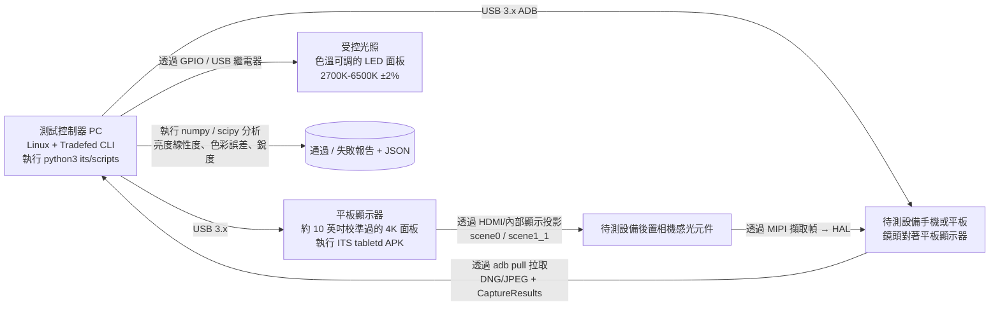

# 第 27 章：相機測試

## 摘要

你建構了一個相機應用。它在你的 Pixel 上工作正常。在你的 Galaxy 上也工作正常。那麼，它在那個售價 99 美元、帶有 `LEGACY` HAL 的 Android Go 設備上能跑通嗎？該設備的供應商可能錯誤地實現了 `CONTROL_AF_TRIGGER_START`，並以*微秒*而非納秒為單位返回每一個 `SENSOR_EXPOSURE_TIME`。

相機軟體的測試是一個由兩部分組成的問題：**HAL 層的 OEM 驗證**（即 Google *強制*要求每個製造商在設備搭載 Google Play 出貨前必須通過的測試）和**應用層的 CI 測試**（你在不要求物理相機硬體的情況下針對自己的程式碼執行的測試）。本章涵蓋了這兩個方面。首先，你將學習相機 ITS（影像測試套件，CTS 的一部分）在物理測試架上究竟驗證了什麼：串流組合枚舉、物理場景亮度線性度以及感光元件/陀螺儀時間戳融合。然後，你將學習如何針對 `CameraManager`/`CameraDevice`/`CaptureSession` 使用 Mockito mock 編寫你自己的插樁測試，以便你的整個相機堆疊能在無頭 CI 伺服器上執行，外加一個斷言你的程式碼在 `LEGACY` 硬體上優雅降級而非崩潰的參數化測試模式。

請使用 **Android Camera Parameters** ([Google Play](https://play.google.com/store/apps/details?id=com.minininja.cameraparams), [GitHub](https://github.com/zoozooll/AndroidCameraParameters)) 作為參考工具，來檢查你的測試應當斷言的精確能力 —— 它表面化了 ITS 同樣會在真實測試架上驗證的每一個 `CameraCharacteristics` 鍵。

---

## 第一部分：OEM 如何驗證相機 —— 相機 ITS 和 CTS

在設備搭載 Google 行動服務 (GMS) 出貨之前，它必須通過 Android 相容性測試套件 (CTS)。相機 CTS 分為兩半：透過 `Tradefed` 執行的程序化 CTS 測試，以及需要帶有自動化支架的物理測試實驗室的相機 ITS（影像測試套件）。

### 測試類別

```mermaid
graph TB
    subgraph CTS[Android CTS — 相機部分]
        direction TB
        CTS_API[API 測試<br/>— CameraCharacteristics 鍵值<br/>— isSessionConfigurationSupported<br/>— 所有用例均能正確枚舉]
        CTS_FLOW[流程測試<br/>— 打開 → 關閉<br/>— 打開 → 工作階段 → 拍攝 → 關閉<br/>— 快速打開/關閉壓力測試]
        CTS_V[CTS 驗證程序<br/>設備上手動測試<br/>— 預覽流暢度<br/>— 拍攝品質<br/>— 多相機切換]
    end
    subgraph ITS[相機 ITS — 影像測試套件]
        direction TB
        ITS_COMBI[test_feature_combination<br/>串流排列組合 × FPS × HDR<br/>數千次呼叫<br/>isSessionConfigurationSupported]
        ITS_SCENE[物理場景測試<br/>scene0 (均勻灰色)<br/>scene1_1 (色彩檢查圖)<br/>自動化平板顯示 → 待測設備]
        ITS_FUSION[感光元件融合測試<br/>陀螺儀時間戳必須與<br/>CaptureResult 中的 SENSOR_TIMESTAMP<br/>對齊，誤差 ±1ms]
        ITS_3A[3A 收斂測試<br/>AE/AF/AWB 必須在標準光照下<br/>的 N 幀內收斂]
        ITS_HDR[HDR / Ultra HDR 測試<br/>JPEG_R 增益圖有效性<br/>動態範圍測量]
    end
    CTS --> SHIP[(全部通過方可出貨)]
    ITS --> SHIP

    style ITS_COMBI fill:#d9e6f2
    style ITS_SCENE fill:#d9f2e6
    style ITS_FUSION fill:#f2d9e6
    style CTS_API fill:#fff3cd
    style CTS_V fill:#fff3cd
```

圖表中的所有內容都是必選的。如果哪怕只有一個測試在單個相機 ID 上失敗，設備就不能出貨。這就是為什麼理解 ITS 對你的應用有幫助：它保證了任何 HAL 都不能跌落的底線，並且準確記錄了你可以依賴的行為。

### 相機 ITS 測試架架構

一個真實的相機 ITS 實驗室看起來是這樣的：



關鍵細節在於*閉環*。測試控制器準確知道它命令平板顯示器顯示什麼像素值（例如強度為 50%、具有精確已知的 6500K 色溫的均勻灰色），然後從數值上驗證待測設備相機的輸出 —— 包括 JPEG/DNG 中的像素亮度*以及* `CaptureResult` 中報告的 `SENSOR_EXPOSURE_TIME` × `SENSOR_SENSITIVITY` —— 是否在允許的公差範圍內與物理輸入比對。

#### `test_feature_combination`：枚舉大考

執行時間最長的單個 ITS 測試是 `test_feature_combination`。它會枚舉來自 `SCALER_STREAM_CONFIGURATION_MAP` 的每一個合法串流尺寸、每種格式 (`PRIV`, `YUV`, `JPEG`, `RAW_SENSOR`, `JPEG_R`, `DEPTH`)、來自 `CONTROL_AE_AVAILABLE_TARGET_FPS_RANGES` 的每個 FPS 範圍、每種輸出 Surface *數量*組合（1 輸出、2 輸出、3 輸出的工作階段配置）以及每個 HDR 模式標記 —— 然後對生成的 SessionConfiguration 呼叫 `isSessionConfigurationSupported`，為每個受支援的配置擷取一幀，並斷言該幀沒有損壞。組合總數在每個相機 ID 上通常達到 30,000–100,000 個。

對於作為應用開發者的你來說，結論很簡單：**如果在通過 CTS 的設備上 `isSessionConfigurationSupported` 返回 `true`，那麼該串流組合在雙向上都確實有效。** 如果返回 `false`，則不要嘗試。在回退到較小尺寸之前，請先依賴此呼叫。這正是 CameraX 在其解析度選擇器內部使用的同款查詢。

#### 物理場景測試：曝光的線性度

Scene0 和 scene1_1 測試驗證了相機的*報告*曝光數學運算與其*實測*像素輸出是否比對。測試架將已知亮度 `L` 的均勻灰場 (scene0) 投影到待測設備上。然後，它在整個可用範圍內命令掃描 N 個不同的 `(SENSOR_EXPOSURE_TIME, SENSOR_SENSITIVITY)` 對，為每一對擷取一个 DNG 幀，並計算感光元件活動陣列上的算術平均像素值 `Y`。

斷言是嚴格線性的：

```
Y_i / (EXPOSURE_TIME_i × SENSITIVITY_i) = 常數 ± 公差
```

對*所有*擷取的配對均適用。如果乘積翻倍，像素亮度必須翻倍。如果減半，亮度必須減半。在中間色調中任何超過約 1% 的偏差都會導致測試失敗。

這對你很重要的原因：它是你的手動曝光滑塊（第 14 章）在符合 CTS 標準的設備上產生數學上可預測結果的保證。如果你的應用為 +1 EV 步長計算了「下一組 ISO/曝光對」，輸出影像確實會亮一檔。在不符合 CTS 標準的設備上（進口的水貨手機、沒有 CTS 的自定義 ROM），此保證不成立，你的手動曝光 UI 看起來會像是壞掉了。

#### `sensor_fusion`：感光元件融合測試

EIS（電子防手震）和 AR 追蹤的生死取決於此項測試。在待測設備錄製影片的同時，測試控制器透過電動雲台物理性地旋轉手機，旋轉速度已知。與此同時，它透過 `SensorManager` 以 400Hz+ 的頻率輪詢待測設備的陀螺儀感光元件，並以 30/60fps 的頻率輪詢相機的 `CaptureResult.SENSOR_TIMESTAMP`。

通過條件：每個陀螺儀時間戳和每一幀的 `SENSOR_TIMESTAMP` 必須處於完全相同的 `CLOCK_MONOTONIC` 時基中，且在相機採樣時間插值得到的陀螺儀樣本必須在 ±0.1 rad/s 和 ±1ms 的公差內與雲台的指令角速度比對。

如果此項測試失敗，說明 HAL 的時間戳源有誤 —— 通常是它將 `CLOCK_REALTIME`（牆上時間，在 NTP 同步期間會跳變）與 `CLOCK_MONOTONIC`（穩定的、單調遞增的時間）混淆了。Google 會拒絕該設備。對你而言，這意味著你可以在任何經過 GMS 認證的設備上，直接將 `CaptureResult.SENSOR_TIMESTAMP` 饋送到 ARCore 的相機影像更新呼叫中，而無需應用任何自定義時間戳偏移。

### CTS 驗證程序：手動用戶測試

並非所有內容都能自動化。CTS 驗證程序是一個由人工 QA 測試員使用的設備端 APK，用於主觀測試：

- **預覽流暢度：** 搖晃設備 30 秒；測試員給出 1–5 分的感知流暢度評分。（客觀遙測數據也會透過 Choreographer 的 dumpsys 獲取。）
- **拍攝品質：** 在標準光照下拍攝 5 張標準場景的照片；測試員將其與黃金參考設備進行對比。
- **多相機變焦轉換：** 在 0.5×–10× 的連續變焦過程中，物理相機切換之間不得有可見的跳變、故障或黑幀。
- **HDR/JPEG_R 品質：** 將 SDR 和 HDR 的並排拍攝效果與已知的良好參考影像進行比對。

這些雖然是主觀的，但標準是公開的。如果你的應用有類似的 UX 目標（平滑的變焦過渡、HDR 拍攝），你可以在內部 QA 實驗室中使用同樣的 scene0/scene1_1 平板測試架複製這些測試流程。

---

## 第二部分：測試你自己的應用 —— 插樁與 Mocking

OEM 測試驗證 HAL。你需要驗證*你的*程式碼。開發團隊常犯的一個典型錯誤是要求 CI 伺服器上必須有一台帶有可用相機的真實手機。其實沒必要。透過 Mockito 的 `mock()` + `ArgumentCaptor`，Camera2 的每一個類別 —— `CameraManager`、`CameraDevice`、`CameraCaptureSession`、`CaptureResult` —— 都是介面或可以乾淨 mock 的非 final 類別。你可以在完全沒有相機硬體的無頭 Linux x86 模擬器上的 CI 環境中執行整個相機管線。

### 範例 1：擷取一個「幀」並驗證 CaptureResult 包含預期的 EXPOSURE_TIME（使用 Mockito 的 AndroidTest）

```kotlin
// app/src/androidTest/java/com/example/camera/CameraCaptureTest.kt
@RunWith(AndroidJUnit4::class)
@SmallTest
class CameraCaptureTest {

    @Test
    fun captureRequest_containsManualExposureTime_andResultEchoesIt() = runTest {
        // ---- 準備 (Arrange) ----
        val mockCameraManager = mock<CameraManager>()
        val mockCameraDevice = mock<CameraDevice>()
        val mockSession = mock<CameraCaptureSession>()
        val mockSurface = mock<Surface>()
        val testHandler = Handler(Looper.getMainLooper())

        val expectedExposureNs = 16_666_666L // 1/60 s
        val expectedIso = 400

        // 擷取傳遞給 openCamera 的 StateCallback
        val deviceCallbackCaptor =
            argumentCaptor<CameraDevice.StateCallback>()
        whenever(mockCameraManager.openCamera(
            anyString(), deviceCallbackCaptor.capture(), any()
        )).thenAnswer { /* 無操作；我們手動觸發回呼 */ }

        // 擷取工作階段狀態回呼
        val sessionCallbackCaptor =
            argumentCaptor<CameraCaptureSession.StateCallback>()
        whenever(mockCameraDevice.createCaptureSession(
            anyList<Surface>(),
            sessionCallbackCaptor.capture(),
            any()
        )).thenAnswer { /* 無操作 */ }

        // 擷取傳遞給 capture() 的 CaptureCallback
        val captureCallbackCaptor =
            argumentCaptor<CameraCaptureSession.CaptureCallback>()
        whenever(mockSession.capture(
            any(), captureCallbackCaptor.capture(), any()
        )).thenReturn(1)

        // 使用你的包裝類別建構被測相機
        val cameraWrapper = YourCameraWrapper(mockCameraManager, testHandler)

        // ---- 動作 (Act): 觸發 打開 → 配置 → 拍攝 鏈條 ----
        cameraWrapper.open("0")
        // (在 YourCameraWrapper.open() 內部呼叫了 
        //  mockCameraManager.openCamera，它擷取了回呼。)
        // 模擬 HAL 返回成功：
        deviceCallbackCaptor.lastValue.onOpened(mockCameraDevice)

        cameraWrapper.createSession(listOf(mockSurface))
        sessionCallbackCaptor.lastValue.onConfigured(mockSession)

        val requestBuilder: CaptureRequest.Builder =
            mockCameraDevice.createCaptureRequest(CameraDevice.TEMPLATE_STILL_CAPTURE)
        // (你的包裝類別在此處應用手動設定)
        requestBuilder.set(CaptureRequest.CONTROL_MODE,
                           CaptureRequest.CONTROL_MODE_OFF)
        requestBuilder.set(CaptureRequest.SENSOR_EXPOSURE_TIME,
                           expectedExposureNs)
        requestBuilder.set(CaptureRequest.SENSOR_SENSITIVITY,
                           expectedIso)

        val resultDeferred = async { cameraWrapper.capture(requestBuilder.build()) }

        // ---- 斷言 1 (Assert): 發送到 HAL 的 CaptureRequest 具有正確的鍵 ----
        val sentRequest: CaptureRequest = captureArg(mockSession, 0) {
            capture(any(), any(), any())
        }
        assertThat(sentRequest[CaptureRequest.SENSOR_EXPOSURE_TIME])
            .isEqualTo(expectedExposureNs)
        assertThat(sentRequest[CaptureRequest.SENSOR_SENSITIVITY])
            .isEqualTo(expectedIso)

        // ---- 動作 2: 模擬 HAL 返回一個 CaptureResult ----
        val mockResult = mock<TotalCaptureResult>().apply {
            whenever(get(CaptureResult.SENSOR_EXPOSURE_TIME))
                .thenReturn(expectedExposureNs)
            whenever(get(CaptureResult.SENSOR_SENSITIVITY))
                .thenReturn(expectedIso)
            whenever(frameNumber).thenReturn(1L)
        }
        captureCallbackCaptor.lastValue
            .onCaptureCompleted(mockSession, sentRequest, mockResult)

        // ---- 斷言 2: 包裝類別返回的擷取結果呼應了曝光值 ----
        val actual = resultDeferred.await()
        assertThat(actual.exposureTimeNanos).isEqualTo(expectedExposureNs)
        assertThat(actual.iso).isEqualTo(expectedIso)
    }
}
```

模式始終如一：
1. `argumentCaptor` 抓取本應發往 HAL 的回呼。
2. 呼叫你的包裝類別。
3. *假裝 HAL 響應了*，手動觸發回呼的成功方法。
4. 對輸入（你的包裝類別發送給 HAL 的內容）和輸出（你的包裝類別交還給呼叫者的內容）同時進行斷言。

這能跑在沒有相機的模擬器上。不需要硬體。沒有來自光照的干擾。執行 10,000 次就會產生同樣的 10,000 次通過。

### 範例 2：參數化測試 —— LEGACY 設備必須優雅降級，絕不崩潰

每一個生產級相機應用都必須能執行在 `LEGACY` HAL 上。最常見的 bug 是在 `LEGACY` 設備上呼叫 `CaptureRequest.CONTROL_MODE_OFF`：HAL 會忽略它，但你的包裝類別會將產生的 `CaptureResult.CONTROL_AE_STATE == SEARCHING` 解釋為瞬時故障並嘗試在一個無限循環中重啟 AE，最終導致 ANR。

請針對每個 `INFO_SUPPORTED_HARDWARE_LEVEL` 進行參數化測試：

```kotlin
@RunWith(Parameterized::class)
class HardwareLevelGracefulDegradationTest(
    private val hardwareLevel: Int,
    private val hardwareLevelName: String
) {
    companion object {
        @JvmStatic
        @Parameterized.Parameters(name = "{1}")
        fun data() = listOf(
            arrayOf(CameraCharacteristics.INFO_SUPPORTED_HARDWARE_LEVEL_LEGACY,
                    "LEGACY"),
            arrayOf(CameraCharacteristics.INFO_SUPPORTED_HARDWARE_LEVEL_LIMITED,
                    "LIMITED"),
            arrayOf(CameraCharacteristics.INFO_SUPPORTED_HARDWARE_LEVEL_FULL,
                    "FULL"),
            arrayOf(CameraCharacteristics.INFO_SUPPORTED_HARDWARE_LEVEL_3,
                    "LEVEL_3"),
        )
    }

    @Test
    fun requestManualExposure_onAnyHardwareLevel_doesNotCrash_orHang() = runTest {
        val mockCameraManager = mock<CameraManager>()
        val mockChars = mock<CameraCharacteristics>()
        whenever(mockChars.get<Int>(
            CameraCharacteristics.INFO_SUPPORTED_HARDWARE_LEVEL
        )).thenReturn(hardwareLevel)
        whenever(mockCameraManager.getCameraCharacteristics("0"))
            .thenReturn(mockChars)

        val wrapper = YourCameraWrapper(mockCameraManager, testHandler)
        wrapper.open("0")
        // ... (省略之前的工作階段設定樣板程式碼)

        val job = launch {
            wrapper.setManualExposure(iso = 400, exposureNs = 8_000_000L)
        }

        // 不得掛起 — 即使在 LEGACY 上也必須在逾時內完成
        withTimeoutOrNull(2_000) { job.join() }
            ?: fail("setManualExposure 在 $hardwareLevelName 硬體上掛起了")

        // 沒有洩漏到未捕獲狀態的異常
        assertThat(job.isCancelled).isFalse()
    }
}
```

針對每個新 build 執行此測試。它只需 400ms。它能捕捉到那一類 `LEGACY` HAL 掛起問題，否則此類問題幾個月後才會出現在 Play 控制台的崩潰報告中。

### 真實硬體上的 AndroidTest：對 EXPOSURE_TIME 準確性的壓力測試

對於針對少量真機機隊的每晚執行，編寫一個簡短的 AndroidTest，打開*真實*相機，擷取一個 RAW 幀，並斷言 `CaptureResult.SENSOR_EXPOSURE_TIME` 在請求值的 5% 範圍內。這可以防止特定 OS build 上的 HAL 退化：

```kotlin
@RunWith(AndroidJUnit4::class)
@RequiresDevice
@LargeTest
class RealHardwareCaptureSanityTest {

    @Test
    fun realCapture_exposureTimeIsWithin5PercentOfRequested() = runTest {
        val context = InstrumentationRegistry.getInstrumentation().context
        val camManager = context.getSystemService(Context.CAMERA_SERVICE)
            as CameraManager
        val chars = camManager.getCameraCharacteristics("0")
        assumeTrue(
            "手動曝光需要 FULL 或 LEVEL_3",
            chars[CameraCharacteristics.INFO_SUPPORTED_HARDWARE_LEVEL] in
            setOf(
                CameraCharacteristics.INFO_SUPPORTED_HARDWARE_LEVEL_FULL,
                CameraCharacteristics.INFO_SUPPORTED_HARDWARE_LEVEL_3,
            )
        )

        // ... 打開相機，建立 ImageReader (PRIVATE 或 YUV) 工作階段，使用
        // 第 26 章協程包裝器擷取一个具有已知曝光的手動幀 ...

        val requestedNs = 10_000_000L // 1/100s
        val result: TotalCaptureResult =
            cameraWrapper.captureManualExposure(requestedNs, iso = 200)

        val actualNs = result[CaptureResult.SENSOR_EXPOSURE_TIME]!!
        val tolerancePct = abs(actualNs - requestedNs) * 100.0 / requestedNs
        assertThat(tolerancePct)
            .withFailMessage(
                "請求了 %d ns, 實際得到 %d ns (%$.1f%% 偏差 >5%%)",
                requestedNs, actualNs, tolerancePct
            )
            .isLessThan(5.0)
    }
}
```

這類測試天生是不穩定的 —— 它依賴於真實硬體。但它能捕捉到廠商 OTA 更新中會悄悄破壞旗艦設備上手動曝光功能的那一類問題。在你的 5–10 台設備的小型機隊上每晚執行一次；這樣的訊號價值值得忍受其噪聲。

---

## 小結

相機測試分為 OEM 驗證和應用驗證。OEM 必須通過 CTS 和相機 ITS，這是一个需要物理設備的測試套件，強制要求支持串流組合（透過數千次 `isSessionConfigurationSupported` 呼叫）、曝光 × 靈敏度平面上的亮度線性度，以及用於 EIS 和 AR 的感光元件/陀螺儀時間戳對齊。應用透過插樁進行測試：Mockito 用於 mock 每一个 Camera2 類別，`ArgumentCaptor` 抓取 HAL 回呼，你手動觸發它們，並在不接觸真實硬體的情況下同時斷言請求和結果 —— 從而實現在無頭模擬器上的 CI 執行。針對每一個 `INFO_SUPPORTED_HARDWARE_LEVEL`（特別是 `LEGACY`）對你的包裝類別進行參數化測試以保證優雅降級，並執行一套少量的 `@RequiresDevice @LargeTest` 壓力擷取測試針對真實機隊，以捕捉 OTA 導致的退化。

## 下一章

你已經從 Kotlin 到原生 NDK 掌握了 Camera2 的公共 API，並用協程將其包裝並經過了測試驗證。但當你呼叫 `CameraManager.openCamera` 時，*底層* 到底發生了什麼？什麼是 HAL3？Binder IPC 邊界到底在哪？Android 15 (API 35) 的 `CameraDeviceSetup` 如何透過解耦性能查詢與感光元件供電來改變架構？第 28 章是架構的大結局：從應用程式碼到鏡筒內 VCM 音圈馬達的完整堆疊解析。
