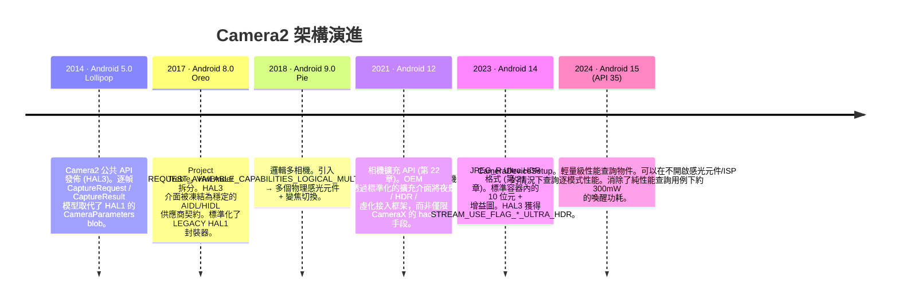
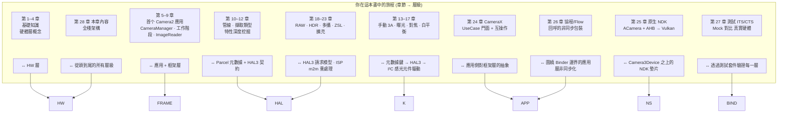

# 第 28 章：Camera2 架構

## 摘要

這是你應得的一章。在第 1-27 章中，你使用了 `CameraManager`、`CameraCharacteristics`、`CaptureRequest`、`CaptureResult`、`CameraCaptureSession`、`ImageReader`、CameraX、NDK 原生堆疊、協程包裝器以及測試 Mock。你已經熟悉了每一個公共 API 表面。現在，我們將按順序剝開每一個抽象層，從你寫的 Kotlin 程式碼行開始，一直到穿越感光元件與 SoC 之間 MIPI CSI-2 總線的每一個電子，再到微調鏡組 10 微米的音圈馬達，以及與感光元件的滾動快門以微秒級步調同步脈衝的閃光燈 LED 控制器。

到本章結束時，你將能夠觀察任何一個 `CaptureRequest` 並逐層映射出它的去向：誰翻譯了它，誰驗證了它，誰最終在矽片上執行了它。你還將理解 Android 15 (API 35) 的 `CameraDeviceSetup` 抽象，它是長達十年的架構趨勢的一个縮影：逐步將*性能查詢*與*硬體供電狀態*解耦，以便應用可以在不消耗感光元件和 ISP 開啟所需的約 300mW 電量的情況下探測相機。

若要檢查任何真實設備的精確性能並將其與處描述的架構層進行交叉參考，請安裝 **Android Camera Parameters** ([Google Play](https://play.google.com/store/apps/details?id=com.minininja.cameraparams), [GitHub](https://github.com/zoozooll/AndroidCameraParameters))。它讀取了下層暴露給公共 API 的每一个 `CameraCharacteristics` 鍵。

---

## 全堆疊分層圖

這是整本書中最重要的一張圖。從這裡向下的每一層都是真實的程式碼，在 Android 開源專案 (AOSP) 中有真實的路徑、真實的歸屬以及真實的 Binder 或函式呼叫邊界。我們將從上到下梳理每一層，然後展示過去十年中該堆疊的演進，最後將你的學習旅程映射到這些層級上。

```mermaid
graph TB
    subgraph APP["應用層 (你的程式碼)"]
        direction TB
        A1["Kotlin / Java / C++ NDK<br/>cameraManager.openCamera(id, cb, handler)<br/>session.capture(request, cb, handler)<br/>captureResult.get(SENSOR_EXPOSURE_TIME)"]
    end
    subgraph FRAME["Java/Kotlin 框架層 — android.hardware.camera2.*"]
        direction TB
        F1["CameraManager · CameraCharacteristics<br/>CaptureRequest.Builder · CaptureResult<br/>CameraDevice · CameraCaptureSession"]
        F2["CameraBinderWrapper (AOSP frameworks/base)<br/>將 Java 物件轉換為 AIDL Binder parcel"]
    end
    subgraph BIND["IPC 層 — Binder / HwBinder"]
        direction TB
        B1["AIDL ICameraService (AOSP)<br/>框架 ↔ CameraService"]
        B2["HIDL / AIDL HAL Binder (Treble)<br/>CameraService ↔ 供應商 HAL"]
    end
    subgraph NS["原生 Mediaserver 層 (system/bin/cameraserver)"]
        direction TB
        N1["CameraService (frameworks/av/services/camera/)"]
        N2["Camera3Device<br/>frameworks/av/services/camera/libcameraservice/device3/<br/>— 驗證請求 vs 工作階段輸出<br/>— 建構 camera3_capture_request_t<br/>— 解析 camera3_capture_result_t"]
        N3["CameraProviderManager (frameworks/av)<br/>枚舉供應商 HAL 實現"]
    end
    subgraph HAL["供應商 HAL 層 (OEM / SoC 程式碼)"]
        direction TB
        H1["HAL3 介面: camera3_device_t<br/>— process_capture_request()<br/>— process_capture_result()<br/>— flush()"]
        H2["HAL1 封裝器 (Legacy)<br/>camera2compat::Camera2Compat<br/>針對硬體層級低於 LIMITED 的設備<br/>將 HAL3 請求翻譯為 HAL1 CameraParameters"]
        H3["供應商實現<br/>高通 QCamera2 · 聯發科 CamHAL · 三星 Exynos Camera HAL"]
    end
    subgraph K["內核層 (Linux)"]
        direction TB
        K1["/dev/videoX — V4L2 影片擷取驅動<br/>VIDIOC_S_FMT · VIDIOC_REQBUFS · VIDIOC_QBUF / DQBUF"]
        K2["ISP 驅動 (高通 CAMSS / 聯發科 ISP 驅動)<br/>記憶體到記憶體處理 V4L2 m2m 節點"]
        K3["感光元件子設備驅動<br/>透過 I2C 寫入模式 / 曝光 / 增益 / VCM"]
        K4["MIPI CSI-2 接收驅動 (SoC)<br/>通道配置、LP/HS 轉換、ECC/CRC 校驗"]
    end
    subgraph HW["物理硬體層"]
        direction TB
        HW1["鏡頭組件<br/>VCM 音圈馬達 (I2C)<br/>移動鏡組以實現對焦 / OIS"]
        HW2["相機感光元件像素陣列<br/>CMOS 感光元件 (索尼 IMX / 三星 ISOCELL / 豪威)<br/>曝光 → 讀取 → A/D 轉換"]
        HW3["MIPI CSI-2 物理總線<br/>2/4/8 對差分對，每通道 1.5 – 2.5 Gbps"]
        HW4["ISP 影像訊號處理器 (在 SoC 上)<br/>硬體實現去馬賽克 · 降噪 · 銳化 · HDR 合併 · 人臉偵測"]
        HW5["閃光燈 LED 控制器 (I2C)<br/>氙氣閃光燈或 LED 電流沈<br/>同步至感光元件 EXRST 引腳"]
    end

    APP -->|函式呼叫| FRAME
    FRAME -->|AIDL parcel| BIND
    BIND -->|HwBinder| NS
    NS -->|HAL3 AIDL/HIDL| HAL
    HAL -->|ioctl() 系統呼叫| K
    K -->|I2C 寫入 + MIPI 通道訊號 + ISP 命令佇列| HW

    style APP fill:#e6d9f2
    style FRAME fill:#d9e6f2
    style BIND fill:#fff3cd,stroke:#ffc107,stroke-width:2px
    style NS fill:#d9f2e6
    style HAL fill:#f2d9e6
    style K fill:#e6d9e6
    style HW fill:#f2e6d9,stroke:#d4a373,stroke-width:2px
```

現在按從上到下的順序看。

---

## 第 1 層 — 應用層 (你的程式碼)

這是你寫的程式碼。`cameraManager.openCamera(id, stateCallback, cameraHandler)`。你對此爛熟於心。但有兩個事實你可能尚未內化：
- 你發出的每一个 `CaptureRequest.Builder.set(key, value)` 呼叫，都會向一個 parcelable 結構附加一個*帶標籤的元數據條目*，該結構準確鏡像了 `system/media/camera/include/system/camera_metadata.h` 中的 `camera_metadata_t` C 結構體。你的 Kotlin `CaptureRequest` 與 HAL 的請求之間不存在魔法轉換 —— 它們具有相同的二進制元數據格式，只是用了不同的語言繫結包裝。
- 你發出的每一个 `CaptureResult.get(key)` 呼叫，讀出的都是 HAL 寫入響應緩衝區的原始位元組。如果某个 HAL 在特定的 OTA 版本中錯誤報告了曝光時間，你的應用讀到的就是那个錯誤的數值。框架層在 HAL 之上没有任何糾錯機制。這就是為什麼第 27 章的真實硬體壓力測試必不可少的原因。

---

## 第 2 層 — Java/Kotlin 框架層 (`android.hardware.camera2.*`)

框架層 (AOSP `frameworks/base/core/java/android/hardware/camera2/`) 只做兩件事：
1. 暴露你所呼叫的公共 API 表面 (`CameraManager`、`CameraDevice` 等)。
2. 在 `CaptureRequest` / `CaptureResult` 的 Java 物件與其在 Binder 通信中的 parcelable 表示之間進行翻譯。

它不在 HAL 之上強制執行任何策略，不重寫元數據，也不「修補」請求。它是一个輕量級的翻譯層，外加對設備啟動時從每個相機 ID 獲取的不可變 `CameraCharacteristics` blob 的快取。

Binder 邊界位於 `CameraManager` → `ICameraService` AIDL 中，即下一層。

---

## 第 3 層 — IPC 層: Binder / HwBinder (Treble)

這是 Project Treble (Android 8.0, 2017) 鎖定的關鍵架構契約。涉及兩個 Binder 域：

| Binder 域 | 連接 | 協定 | 誰負責強制執行 ABI 穩定性 |
|-------------------|-------------------------------------------------------|-----------------|---------------------------------|
| `/dev/binder` | 框架 ↔ cameraserver (system_server 側) | AIDL | 平台 (同一分區建構) |
| `/dev/hwbinder` | cameraserver ↔ 供應商相機 HAL | HIDL / AIDL HAL | Treble (穩定的供應商介面)|

在 Treble 之前，HAL 是一个直接被 `dlopen` 到 `cameraserver` 進程中的 `.so` 文件。OEM 的每一次 OTA 都必須同時重新建構相機*和*框架。Treble 的 HwBinder 拆分意味著供應商 HAL 是其自己的進程、自己的分區、擁有自己的 3 年安全更新時間線，且它與 `cameraserver` 之間的契約在設備壽命週期內是版本化且凍結的。對於應用開發者來說，這是 Camera2 API 行為在不同 OTA 之間可預測的首要原因：如果 HAL 介面發生改變，就無法通過 Treble 合規性測試。

LEGACY HAL1 封裝器活在此邊界之下，位於供應商 HAL 進程內部，因此除透過 `INFO_SUPPORTED_HARDWARE_LEVEL_LEGACY` 外，它對應用層是不可見的。

---

## 第 4 層 — 原生 Mediaserver 層: `CameraService` / `Camera3Device`

`/system/bin/cameraserver` 是一个在啟動時由 `init.rc` 開啟的原生守護進程。它始終執行，擁有設備上每一个已打開的相機，並且是決定哪個應用獲得相機存取權的唯一仲裁者（前台應用獲勝；其餘應用會被斷開連接）。

其最重要的兩個類別：

1. **`CameraService`** (`frameworks/av/services/camera/libcameraservice/CameraService.cpp`):
   - 向框架暴露 `ICameraService` AIDL 介面。
   - 為每一次 binder 呼叫強制執行 `android.permission.CAMERA` 權限檢查（没有權限的應用發出的呼叫會在進入 HAL 前被 `cameraserver` 拒絕）。
   - 處理並行打開的仲裁（兩個應用請求同一个相機 → 處於最前台的 Activity 獲得權限；背景應用收到 `onDisconnected`）。
   - 管理用於枚舉供應商 HAL 模組的 `CameraProviderManager`。

2. **`Camera3Device`** (`frameworks/av/services/camera/libcameraservice/device3/Camera3Device.cpp`):
   - 管線的核心。
   - 驗證擷取請求中的每一个輸出 Surface 是否確實屬於工作階段配置的輸出集。（這就是框架拋出 `IllegalArgumentException: Surface not in configured outputs` 的地方。）
   - 將你發來的 Parceled `CaptureRequest` 打包進 HAL3 的 `camera3_capture_request_t` 結構體。
   - 透過 `process_capture_request(request)` 將請求逐一流式輸入 HAL。
   - 從 HAL 接收 `camera3_capture_result_t`，將元數據 + fence 封裝並*回傳* Binder 鏈條，直到你的 `CaptureCallback.onCaptureCompleted`。
   - 為你處理 `flush()`、錯誤路徑、`notify()` 快門與錯誤回呼，以及用於 EGL/Vulkan 互操作的輸出緩衝區釋放 fence。

`Camera3Device` 約有 15,000 行 C++ 程式碼，是整個堆疊中經過最嚴格測試的部分（第 27 章的 CTS 測試正是從框架側直接針對 `Camera3Device` 行為進行的）。如果你讀到過 bug 報告說「这个請求鍵在 Camera2 NDK 下有效但在 Java 版下無效」，這種差異幾乎總是源於 `Camera3Device` 內部缺失的驗證或轉換路徑。

---

## 第 5 層 — 供應商 HAL 層: HAL3 (`camera3_device_t`)

這是 OEM 差異化的真正所在。每個 SoC 供應商都提供其自己的 HAL3 實現：

| 供應商 | HAL 代號 | AOSP 介面 |
|--------------|-------------------------------------------|----------------------------------------------|
| 高通 | QCamera2 / QCamera3 (mm-camera 程式碼庫) | `camera3_device_t` + `vendor.qti.hardware.camera*` 擴充 |
| 聯發科 | CamHAL (mtkcam) | 同樣的 `camera3_device_t` + 聯發科擴充 |
| 三星 | Exynos Camera HAL | 同樣的 `camera3_device_t` + 三星擴充 |
| Google Tensor| Google Camera HAL (Pixel 系列) | 同樣的 `camera3_device_t` + 用於夜視 / 計算 RAW 的 Google 自定義邏輯 |

HAL3 契約（定義在 `hardware/libhardware/include/hardware/camera3.h`）對一个已打開的設備只有四項核心操作：

```cpp
// 簡化的 HAL3 契約 — 這就是全部介面
typedef struct camera3_device {
    hw_device_t common;

    int (*configure_streams)(
        const struct camera3_device *,
        camera3_stream_configuration_t *stream_list
    );

    int (*process_capture_request)(
        const struct camera3_device *,
        camera3_capture_request_t *request
    );

    void (*get_metadata_vendor_tag_ops)(...);

    int (*flush)(const struct camera3_device *);

    void (*dump)(...);
} camera3_device_t;
```

HAL 接收請求，產出結果和輸出緩衝區。僅此而已。請求/響應模型是 HAL3 的標誌 —— HAL1 曾是一个單一的 `CameraParameters` 字串 blob (`"preview-size=1920x1080;picture-size=..."`)，整個行業都因其缺乏逐幀控制能力而對其深惡痛絕。正是 HAL3 的請求/響應模型*實現*了你在本書中使用過的每一項進階功能：逐幀手動曝光、RAW 擷取、多相機物理串流、重處理、ZSL 輸入 Surface。這些在 HAL1 下都是不可能實現的。

### LEGACY HAL1 封裝器

`INFO_SUPPORTED_HARDWARE_LEVEL_LEGACY` 意味著供應商*依然*只提供了一个 HAL1 `.so` 文件，設備使用 AOSP 的 `camera2compat::Camera2Compat` 墊片將 HAL3 的請求/響應呼叫翻譯回舊的 `CameraParameters` blob + `startPreview()`/`takePicture()` HAL1 進入點。這種翻譯層正是第 24 章警告你 `CONTROL_MODE_OFF` 在 `LEGACY` 設備上靜默無效的原因 —— HAL1 沒有可以與之對應翻譯的逐幀 `CONTROL_MODE` 概念。該墊片會直接丟棄該元數據條目。

---

## 第 6 層 — 內核層: V4L2 + MIPI CSI-2 + 感光元件驅動

HAL3 進程僅透過設備節點上的 `ioctl()` 系統呼叫與 Linux 內核互動。處理單幀需要四類內核驅動程式協作：

1. **MIPI CSI-2 接收驅動** (`/dev/v4l-subdevX`): 配置 PHY 通道數和數據速率，處理差分對上的低功耗到高速切換，驗證數據包 ECC/CRC，並透過 DMA 將接收到的像素行存入 ISP 的輸入環形緩衝區。你永遠不會從用戶空間接觸到此驅動。CSI-2 CRC 錯誤對你而言表現為損壞的輸出緩衝區，並帶有匹配的 `camera3_stream_buffer_t.status == BUFFER_ERROR`。

2. **感光元件子設備驅動** (`/dev/v4l-subdevY`, 透過 I2C 控制):
   - 透過 I2C (一種緩慢的、約 100KHz 的帶外總線) 寫入感光元件暫存器，這就是為什麼即使是 `HARDWARE_LEVEL_3` 設備，曝光更改和模式切換也有約 2-3 幀延遲的原因。
   - 設定曝光時間 (逐幀滾動快門開始/停止)、類比增益、數位增益、解析度、合併 (binning) 模式。
   - 透過將電流導入音圈的 I2C DAC 來控制 VCM 對焦 (見 HW 層)。
   - 透過感光元件側的 EXRST 輸出引腳控制閃光燈同步，閃光燈控制器會監聽該引腳。

3. **V4L2 影片擷取節點** (`/dev/video0` 等): HAL 呼叫 `VIDIOC_REQBUFS` 來分配由 gralloc 支持的緩衝區 (正是你在第 25 章匯入 Vulkan 的同一類 `AHardwareBuffer` 句柄)，然後在循環中呼叫 `VIDIOC_QBUF` (將緩衝區入隊)。隨著幀從 CSI-2 接收器 + ISP 到達，HAL 呼叫 `VIDIOC_DQBUF` (將緩衝區出隊) 並將其作為 `camera3_stream_buffer_t` 發送給 `Camera3Device`。

4. **ISP 記憶體到記憶體驅動** (`/dev/videoN m2m` 節點): 獨立於擷取路徑，HAL 將重處理輸入緩衝區 (用於 ZSL, 第 23 章) 排入 ISP m2m 佇列，以便對先前擷取的 RAW 幀執行去馬賽克、去噪、HDR 合併或人臉偵測。結果會作為處理後的 JPEG/YUV/PRIVATE 輸出緩衝區輸出。

---

## 第 7 層 — 物理硬體層

最後，是電子。以上每一層都是在 SoC 上執行的程式碼。硬體層才是光子轉換為電子並被處理的地方：

```mermaid
graph LR
    LENS["鏡組<br/>玻璃元件<br/>~10–20mm 焦距"] --> VCM["VCM 音圈馬達<br/>I2C DAC → 線圈電流 →<br/>鏡組位移 ±50 µm<br/>對焦 + OIS 防手震"]
    VCM --> SENSOR[CMOS 感光元件像素陣列<br/>索尼 IMX / 三星 ISOCELL<br/>~12MP – 200MP<br/>滾動快門: 逐行讀取<br/>全域快門 (罕見) 用於工業感光元件]
    SENSOR -->|A/D 轉換後的 10/12/14 位元拜耳數據| CSI[MIPI CSI-2 PHY<br/>2/4/8 對<br/>總頻寬高達 20 Gbps]
    CSI -->|SoC 內部互連| ISP[ISP — 位於 SoC 晶片上<br/>去馬賽克 · CCM · 降噪 · 3A 統計 · HDR 合併<br/>通常具備 1 TOPS+ 的人臉/分割 DNN 能力]
    ISP -->|Gralloc 緩衝區 → DRAM| CPU[CPU / GPU<br/>你的應用進程讀取它們]
    FLASH["閃光燈 LED / 氙氣燈<br/>I2C 閃光燈控制器<br/>閃光同步至感光元件 EXRST"] --> SENSOR
```

每個物理子系統：
- **鏡頭與 VCM**: 鏡組 10µm 的移動即為 AF 的一步。OIS (光學防手震) 為 VCM 增加了閉環陀螺儀回饋，每秒微調鏡組 500–5000 次以抵消手抖。內核驅動寫入 I²C DAC 值；你的應用透過 `LENS_FOCUS_DISTANCE` 和 `LENS_OPTICAL_STABILIZATION_MODE` 元數據鍵對其進行控制。
- **感光元件像素陣列**: 光電二極體累積與入射光子數成正比的電荷。讀取方式是滾動快門 (逐行自上而下)，這就是為什麼你在第 14 章的 AE 滑塊有 2–3 幀延遲的原因 —— 第 N 幀的曝光是在第 N-1 幀讀取期間編程的。
- **MIPI CSI-2 總線**: 差分對高達 2.5Gbps/通道 × 8 通道 = 20Gbps 原始頻寬。足以應對 60fps 4K 12 位元拜耳數據。數據包錯誤會觸發硬體級的 CRC 重傳，但損壞的幀會以 `BUFFER_ERROR` 的形式傳達給你。
- **ISP**: 幕後英雄。其去馬賽克 + 降噪 + 銳化硬體執行速度超過 10 億像素/秒，免去了 CPU 處理之苦。在現代 Tensor / 驍龍 SoC 上，它還在 CPU 看到幀之前，在感光元件內部執行用於場景分割、人臉偵測和 HDR 合併的 DNN 加速器。
- **閃光燈控制器**: 閃光脈衝必須*精確地*在它要照亮的那一幀的滾動快門曝光窗口內發射。`CaptureResult` 中的 `FLASH_STATE_FIRED` 位元確認了對齊情況；對齊不良會導致幀曝光不全。

---

## 架構演進：隨 Android 版本迭代的 Camera2

Camera2 並非一日建成。每隔 2–3 個 Android 版本就會增加一个新的架構原語，為開發者解鎖真實的功能：



每個版本的趨勢都很明顯：**解耦 (decoupling)**。
- Android 8 將 HAL 與框架解耦 (Treble)。
- Android 9 將邏輯相機 ID 與物理感光元件解耦。
- Android 12 將 OEM 擴充與應用程式碼解耦。
- Android 14 將 HDR 編碼與 RAW 管線解耦。
- **Android 15 的 `CameraDeviceSetup` 將性能查詢與硬體供電解耦。**

### 焦點：Android 15 `CameraDeviceSetup` — 架構解耦的實踐

`CameraDeviceSetup` (Android 15, API 35) 是這一趨勢最純粹的例子。在 API 35 之前，如果應用想知道「是否支援同時開啟 4K@60 串流和 YUV_420_888 分析？」，呼叫 `isSessionConfigurationSupported` 的唯一方法是透過由 `CameraManager.getCameraCharacteristics(id)` 獲取的 `CameraCharacteristics` 實例。在內部，這強制 HAL 為感光元件供電 (≈250–350mW) 並開啟 ISP 數毫秒，僅僅是為了讀取一張在設備壽命期內實際上是靜態的性能表。對於電池受限的應用，這在任何「起飛前功能檢查」 UX 中都是不可接受的。

`CameraDeviceSetup` 透過提供一个輕量級的、不消耗電量的表示來解決了这个问题：

```kotlin
// 需要 API 35+
val setup: CameraDeviceSetup = cameraManager.getCameraDeviceSetup(cameraId)
val supported: Boolean = setup.isSessionConfigurationSupported(sessionConfig)
// getCameraDeviceSetup() 不會開啟感光元件或 ISP
// 結果可以在設備的整個執行期間進行快取
```

從架構上講，性能表現在存在於供應商分區中一个預先獲取的、經過簽名且與分區無關的 blob 中，而 `getCameraDeviceSetup` 透過一个獨立的 HwBinder 呼叫來讀取它，完全跳過了 `Camera3Device` 的上電序列。這是未來十年的方向：*每一個*可以靜態回答的 API 最終都會有一个無功耗的輕量級副本。預計 `CameraDeviceSetup` 將在 Android 16+ 中獲得越來越多的性能查詢功能。

---

## 讀者旅程與架構層級的映射

最後，將你在這本書中的旅程映射到架構層級上。每一章都對應一个特定的層級或介面邊界：



透過最後閱讀這一章，你已經將架構與實踐相結合。你不是在第一天抽象地學習 HAL3 並掙扎著將其映射到真實程式碼中，而是透過 27 章的*實踐*學習：打開 → 配置 → 擷取 → 結果，然後拉開幕簾，看看到底是谁在響應其中的每一次呼叫。

---

## 小結

Camera2 是一个七層堆疊：應用層 → 框架層 (Java/Kotlin `android.hardware.camera2.*`) → Binder/HwBinder IPC 層 → 原生 `CameraService` + `Camera3Device` 層 → 供應商 HAL3 層 (`camera3_device_t`, 帶有一个 LEGACY HAL1 封裝器) → V4L2 內核驅動層 (MIPI CSI-2, 感光元件, 擷取, ISP m2m) → 物理硬體層 (鏡頭/VCM, 感光元件, MIPI 總線, ISP, 閃光燈控制器)。Project Treble 透過 HwBinder 鎖定了 HAL 契約，確保了長期穩定性。十年來的架構趨勢是漸進式的解耦，最終體現在 Android 15 的 `CameraDeviceSetup` 上，它可以不給感光元件供電就查詢性能。你現在已經將每一項功能 —— 從第 14 章的手動 ISO 到第 23 章的 ZSL，再到第 25 章的原生 Vulkan 零拷貝 —— 映射到了執行它的精確層級上。

## 下一步：第七部分 — 相機元數據百科全書

《第六部分：現代 Android 相機開發》到此結束。最後的疆域是針對你在所有 28 章中一直使用的每一个 `CameraCharacteristics`、`CaptureRequest` 和 `CaptureResult` 元數據鍵的詳細百科全書式參考。第七部分即是元數據百科全書：SENSOR, LENS, CONTROL, SCALER, REQUEST —— 每一个標籤都有定義、解釋、查詢方法，且經過真實設備的交叉驗證，並經由 **Android Camera Parameters** 應用驗證。當你需要準確了解 `SCALER_CROPPING_TYPE` 的含義、哪些設備支持 `REQUEST_AVAILABLE_CAPABILITIES_OFFLINE_PROCESSING` 或者某个特定鍵在真實的 `LEGACY` HAL 上到底表現如何時，請翻閱它。
