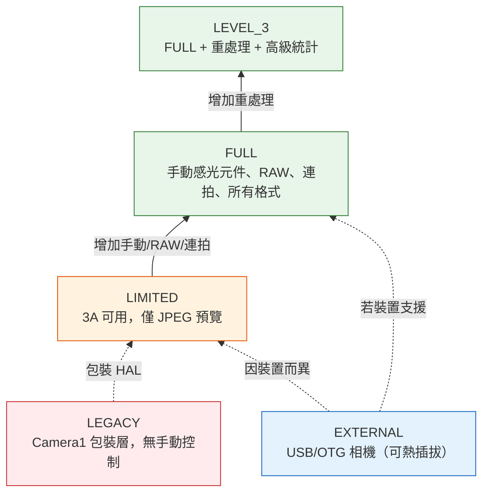
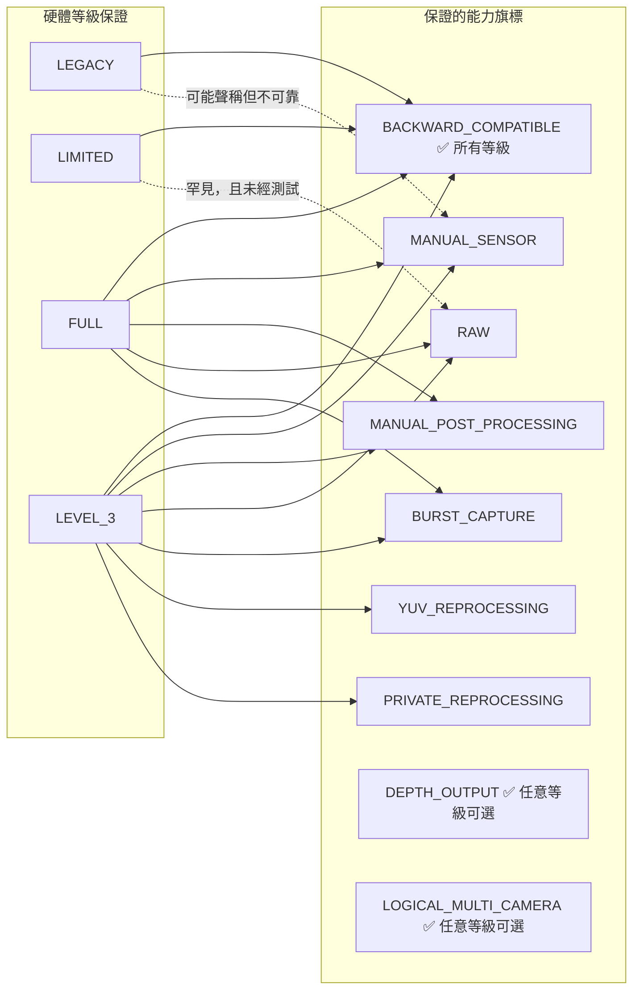
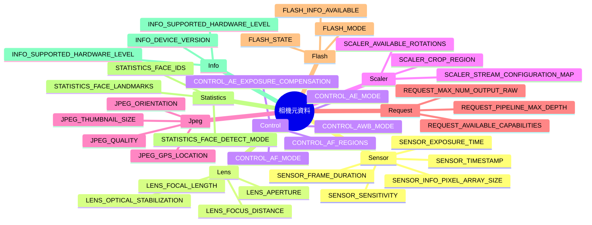

## 12.1 你口袋裡的規格表

在你呼叫 `openCamera()` 之前，在你建構 `CaptureRequest` 之前，在你設定工作階段之前 —— 就有了 `CameraCharacteristics`。它是一個不可變、無需通電即可查詢的視窗，能讓你了解一台相機*能做的一切*。可以把它想像成相機的規格表，以結構化、可查詢的物件形式呈現。

`CameraCharacteristics` 是你編寫能在 Android 的 10,000+ 裝置型號上正常運作的應用時最重要的工具。你不能假設手動 ISO 可用。你不能假設 RAW 可用。你甚至不能假設相機支援 1080p 預覽 —— 除非你查詢 `CameraCharacteristics`。

在[第 6 章](discovering-cameras.md)中我們觸及了基礎知識：鏡頭朝向、感光元件尺寸、焦距。在本次深入解析中，我們走得更遠：
- 五個**硬體等級**（LEGACY → LIMITED → FULL → LEVEL_3 → EXTERNAL）以及每個等級所保證的內容
- 十多個**能力旗標**（`MANUAL_SENSOR`、`RAW`、`DEPTH_OUTPUT` 等）以及哪些硬體等級提供它們
- 元資料鍵如何按子系統（`android.sensor.*`、`android.lens.*`、`android.control.*`、...）**分層組織**
- 如何編寫一個**全面的執行時能力查詢**並帶有優雅降級

Android Camera Parameters 應用（[GitHub](https://github.com/zoozooll/AndroidCameraParameters)、[Play Store](https://play.google.com/store/apps/details?id=com.minininja.cameraparams)）本質上就是一個加強版的 `CameraCharacteristics` 瀏覽器。開啟它選擇任意相機，你就能精確看到我們在本章討論的鍵，按類別組織，帶有人類可讀的標籤和即時值呈現。

## 12.2 CameraCharacteristics 究竟是什麼

正式地說，`CameraCharacteristics` 是：

- **不可變** —— 一旦從 `CameraManager.getCameraCharacteristics(id)` 取得，該物件永不改變（有一個已記錄的例外：API 32+ 上折疊螢幕的 `SENSOR_ORIENTATION`）。
- **無需通電** —— 查詢它**不會**給感光元件或 ISP 通電。你可以在第一個 Activity 的 `onCreate()` 中呼叫它，而不會影響電池。
- **每相機獨立** —— 每個邏輯相機 ID 都有自己獨立的 `CameraCharacteristics` 物件。
- **型別安全且基於鍵** —— 透過 `<Key<T>> get(Key<T> key)` 存取資料，每個鍵都有已記錄的型別（Int、Long、Float、Rect、Array 等）。

你只需一次呼叫即可取得它：

```kotlin
val cameraManager = getSystemService(CAMERA_SERVICE) as CameraManager
val cameraIdList = cameraManager.cameraIdList  // 例如 ["0", "1", "2", "3"]

for (id in cameraIdList) {
    val characteristics: CameraCharacteristics = cameraManager.getCameraCharacteristics(id)
    // 盡情查詢 —— 不消耗感光元件電量！
}
```

在 Android 15（API 35）上，你可以使用 `CameraManager.getCameraDeviceSetup(id)` 進行輕量級的工作階段設定查詢，而無需開啟相機（詳見[第 28 章](camera2-architecture.md)關於 `CameraDeviceSetup` 的內容）。

## 12.3 硬體等級：INFO_SUPPORTED_HARDWARE_LEVEL

最重要的 `CameraCharacteristics` 鍵就是 **`INFO_SUPPORTED_HARDWARE_LEVEL`**。它定義了相機 HAL 的整個層級，並（廣泛地）告訴你哪些功能可以保證運作。共有五個硬體等級：

### 五個硬體等級

| 等級 | 常數 | 典型裝置 | 實際含義 |
|-------|----------|----------------|---------------------------|
| **LEGACY** | `INFO_SUPPORTED_HARDWARE_LEVEL_LEGACY` | 2015 年前的入門裝置、非常舊的晶片組 | Camera2 API 是舊 `android.hardware.Camera` API 的包裝層。沒有逐幀控制，沒有手動設定，RAW 不可用，連拍不可靠。把這些裝置當作"帶有 Camera2 語法的 Camera1 時代裝置"對待。 |
| **LIMITED** | `INFO_SUPPORTED_HARDWARE_LEVEL_LIMITED` | 入門手機（Android Go、入門級 SoC 如聯發科 Helio、驍龍 4xx） | 原生 Camera2 HAL 但僅支援部分功能。3A（AF/AE/AWB）可用。預覽 + JPEG 可用。但**沒有**手動感光元件控制，**沒有** RAW，**沒有**保證的連拍，**沒有** YUV 重處理。這是 Android 的"基礎功能"相機等級。 |
| **FULL** | `INFO_SUPPORTED_HARDWARE_LEVEL_FULL` | 中階和旗艦手機（驍龍 6xx/7xx/8xx、Exynos 中階+、Dimensity 7xxx+） | "專業相機"等級。保證 MANUAL_SENSOR、MANUAL_POST_PROCESSING、BURST_CAPTURE、逐幀設定、30fps 全解析度、RAW、所有輸出格式、可預測的流水線深度。任何嚴肅相機應用都需要的等級。 |
| **LEVEL_3** | `INFO_SUPPORTED_HARDWARE_LEVEL_3` | 具備高級 ISP 的高端旗艦（驍龍 8 Gen 1+、Pixel 6+、Exynos 2xxx+） | FULL + 額外能力：YUV 重處理（輸入流支援、離線重處理）、私有重處理、高級統計資訊、硬體 JPEG + RAW 同時以最大解析度輸出。ZSL 配合 RAW 輸出所必需。 |
| **EXTERNAL** | `INFO_SUPPORTED_HARDWARE_LEVEL_EXTERNAL` | USB 相機、透過 OTG 連接的網路攝影機 | 外接相機 HAL。行為表現類似 LIMITED 或 FULL，取決於 USB 裝置。關鍵注意事項：相機可隨時熱插拔/斷開，因此需監聽 `ACTION_CAMERA_DEVICE_STATE_CHANGED`。 |



:::important
硬體等級是一種**保證**，而非盡力而為的旗標。如果裝置報告為 FULL，Google 的 CTS（相容性測試套件）已驗證每一項 FULL 級功能都能運作。如果裝置報告為 LIMITED，你無法依賴任何 FULL 級功能 —— 即使它在某一特定 LIMITED 裝置上碰巧能用，在另一台裝置上也會失效。
:::

### 在執行時檢查硬體等級

```kotlin
val hardwareLevel = characteristics.get(CameraCharacteristics.INFO_SUPPORTED_HARDWARE_LEVEL)

when (hardwareLevel) {
    CameraCharacteristics.INFO_SUPPORTED_HARDWARE_LEVEL_LEGACY -> {
        Log.w("CamCaps", "LEGACY 硬體 —— 手動/RAW 已停用。降級為基礎 JPEG。")
        disableManualControls()
        disableRawCapture()
    }
    CameraCharacteristics.INFO_SUPPORTED_HARDWARE_LEVEL_LIMITED -> {
        Log.i("CamCaps", "LIMITED 硬體 —— 僅基礎拍照 + 預覽。")
        disableManualControls()
        disableRawCapture()
        disableBurstCapture()
    }
    CameraCharacteristics.INFO_SUPPORTED_HARDWARE_LEVEL_FULL -> {
        Log.i("CamCaps", "FULL 硬體 —— 啟用手動控制、RAW 和連拍。")
        enableManualControls()
        enableRawCapture()
        enableBurstCapture()
    }
    CameraCharacteristics.INFO_SUPPORTED_HARDWARE_LEVEL_3 -> {
        Log.i("CamCaps", "LEVEL_3 硬體 —— FULL + 重處理 + ZSL + 高級統計。")
        enableManualControls()
        enableRawCapture()
        enableBurstCapture()
        enableReprocessing()
        enableZeroShutterLag()
    }
    CameraCharacteristics.INFO_SUPPORTED_HARDWARE_LEVEL_EXTERNAL -> {
        Log.i("CamCaps", "EXTERNAL 相機 —— 可能是 LIMITED 或 FULL；註冊斷開監聽器。")
        registerHotplugListener()
        // 動態探測能力，而非假設
    }
    else -> {
        Log.w("CamCaps", "未知硬體等級 $hardwareLevel —— 為安全起見假定為 LIMITED。")
        safeDefaultFeatures()
    }
}
```

## 12.4 能力：REQUEST_AVAILABLE_CAPABILITIES

硬體等級是一個*粗略*的分層。對於細粒度的功能偵測，Camera2 暴露了 `REQUEST_AVAILABLE_CAPABILITIES` —— 一個能力旗標的 `IntArray`。每個旗標描述相機能做的一件具體事情。

硬體等級與能力之間的正式關係：



### 能力旗標詳解

| 旗標常數 | 含義 | 硬體等級保證 | 實際影響 |
|--------------|---------|--------------------------|----------------------|
| `BACKWARD_COMPATIBLE` | 相機實現了基線 Camera2 API | **全部 5 個等級**（LEGACY–EXTERNAL） | 如果缺失，相機裝置對你的應用實際上無法使用。 |
| `MANUAL_SENSOR` | 應用可手動控制 `SENSOR_EXPOSURE_TIME`、`SENSOR_SENSITIVITY`、`SENSOR_FRAME_DURATION`、`LENS_FOCUS_DISTANCE`、`LENS_APERTURE` | 在 **FULL** 和 **LEVEL_3** 上保證 | 專業模式及手動相機 UI 需要此項。沒有它，所有手動 ISO/曝光滑桿都必須隱藏。 |
| `MANUAL_POST_PROCESSING` | 應用可手動控制 ISP 階段：降噪、邊緣增強、色調曲線、色彩校正增益、色彩校正變換 | 在 **FULL** 和 **LEVEL_3** 上保證 | 自訂"底片外觀"LUT、透過增益實現手動白平衡、銳利度/模糊控制所需要。 |
| `RAW` | 感光元件透過 `ImageFormat.RAW_SENSOR`、`RAW10` 或 `RAW12` 輸出 RAW Bayer 資料 | 在 **FULL** 和 **LEVEL_3** 上保證 | DNG 拍攝、RAW 轉 JPEG 編輯流水線、計算攝影均始於此。 |
| `PRIVATE_REPROCESSING` | 相機支援 `InputSurface` + 將 HAL 私有格式影像離線重處理為 JPEG/YUV | 在 **LEVEL_3** 上保證。FULL 上罕見。 | 啟用零快門延遲（ZSL）：環形緩衝過去幀，將最近一幀重處理為高品質靜態圖。 |
| `YUV_REPROCESSING` | 相機支援 `InputSurface` + 將應用提供的 YUV_420_888 影像重新送回 ISP 進行重處理 | 在 **LEVEL_3** 上保證 | 啟用"對錄製影片套用電影 LUT"或"後期重新對焦人像景深"流水線。 |
| `DEPTH_OUTPUT` | 相機可輸出深度圖（`DEPTH16` / `DEPTH_POINT_CLOUD` 格式） | **任意**等級**可選**。顯式檢查陣列。 | 人像模式散景、AR 測量、3D 掃描。常與 `LOGICAL_MULTI_CAMERA` 配對（雙物理相機用於立體深度）。 |
| `LOGICAL_MULTI_CAMERA` | 此邏輯相機由 2 個及以上物理感光元件支撐（例如超廣角 + 廣角 + 長焦） | **任意**等級**可選**。通常僅旗艦。 | 啟用無縫光學變焦（見[第 20 章](multi-camera.md)）。你可以查詢 `LOGICAL_MULTI_CAMERA_PHYSICAL_IDS` 取得物理相機 ID。 |
| `BURST_CAPTURE` | `captureBurst()` 在全解析度下處理 > 1 幀時不會掉幀 | 在 **FULL** 和 **LEVEL_3** 上保證 | 沒有它，連拍可能會卡頓、掉幀或靜默失敗。包圍曝光/對焦需要此項。 |
| `CONSTRAINED_HIGH_SPEED_VIDEO` | 支援 `createHighSpeedRequestList()` + 高速影片（120fps、240fps） | **FULL/LEVEL_3 上可選**。LIMITED 上罕見。 | 慢動作錄製（見[第 19 章](high-speed-video.md)）。 |
| `MOTION_TRACKING` | 相機能以高幀率低延遲追蹤物件/人臉 | 可選（罕見）。在 Pixel 及部分旗艦上存在。 | AR 運動追蹤、體育自動對焦。 |
| `LOGICAL_MULTI_CAMERA_SYNC` | 邏輯裝置中的多個物理相機可捕獲同步幀 | 可選。真正的同步多感光元件捕獲所必需。 | 同時使用多個鏡頭的計算攝影（例如融合變焦）。 |

### 在執行時查詢所有能力

```kotlin
val capabilities = characteristics.get(
    CameraCharacteristics.REQUEST_AVAILABLE_CAPABILITIES
) ?: intArrayOf()

fun hasCapability(cap: Int): Boolean = capabilities.contains(cap)

val supportsManualSensor = hasCapability(
    CameraCharacteristics.REQUEST_AVAILABLE_CAPABILITIES_MANUAL_SENSOR
)
val supportsRaw = hasCapability(
    CameraCharacteristics.REQUEST_AVAILABLE_CAPABILITIES_RAW
)
val supportsBurst = hasCapability(
    CameraCharacteristics.REQUEST_AVAILABLE_CAPABILITIES_BURST_CAPTURE
)
val supportsDepth = hasCapability(
    CameraCharacteristics.REQUEST_AVAILABLE_CAPABILITIES_DEPTH_OUTPUT
)
val supportsLogicalMultiCam = hasCapability(
    CameraCharacteristics.REQUEST_AVAILABLE_CAPABILITIES_LOGICAL_MULTI_CAMERA
)
val supportsHighSpeed = hasCapability(
    CameraCharacteristics.REQUEST_AVAILABLE_CAPABILITIES_CONSTRAINED_HIGH_SPEED_VIDEO
)
val supportsYuvReprocessing = hasCapability(
    CameraCharacteristics.REQUEST_AVAILABLE_CAPABILITIES_YUV_REPROCESSING
)
val supportsPrivateReprocessing = hasCapability(
    CameraCharacteristics.REQUEST_AVAILABLE_CAPABILITIES_PRIVATE_REPROCESSING
)

// 建構人類可讀的報告
val capabilityReport = buildString {
    appendLine("=== 相機能力報告 ===")
    appendLine("BACKWARD_COMPATIBLE:     ${hasCapability(
        CameraCharacteristics.REQUEST_AVAILABLE_CAPABILITIES_BACKWARD_COMPATIBLE
    )}")
    appendLine("MANUAL_SENSOR:           $supportsManualSensor")
    appendLine("MANUAL_POST_PROCESSING:  ${hasCapability(
        CameraCharacteristics.REQUEST_AVAILABLE_CAPABILITIES_MANUAL_POST_PROCESSING
    )}")
    appendLine("RAW:                     $supportsRaw")
    appendLine("BURST_CAPTURE:           $supportsBurst")
    appendLine("YUV_REPROCESSING:        $supportsYuvReprocessing")
    appendLine("PRIVATE_REPROCESSING:    $supportsPrivateReprocessing")
    appendLine("DEPTH_OUTPUT:            $supportsDepth")
    appendLine("LOGICAL_MULTI_CAMERA:    $supportsLogicalMultiCam")
    appendLine("CONSTRAINED_HIGH_SPEED:  $supportsHighSpeed")
}

Log.i("CamCaps", capabilityReport)

// 現在據此控制你的 UI 功能
manualIsoSlider.isEnabled = supportsManualSensor
manualExposureSlider.isEnabled = supportsManualSensor
rawCaptureToggle.isEnabled = supportsRaw
burstCaptureButton.isEnabled = supportsBurst
depthPortraitMode.isEnabled = supportsDepth
zoomSwitcher.isEnabled = supportsLogicalMultiCam
slowMoButton.isEnabled = supportsHighSpeed
zslMode.isEnabled = supportsPrivateReprocessing  // LEVEL_3
```

:::tip
Android Camera Parameters 應用在相機摘要檢視的 **Capabilities** 卡片中將此查詢呈現為帶顏色編碼的核取方塊。綠色 = 支援，灰色 = 不支援。你可以並排比較多個相機，查看超廣角的能力與主相機有何不同。
:::

## 12.5 元資料組織：android.* 命名空間

`CameraCharacteristics`、`CaptureRequest` 和 `CaptureResult` 中的每個鍵都遵循分層命名慣例：`android.<子系統>.<參數>`。以點分隔的元件按它們控制的硬體/軟體子系統對相關設定進行分組。

### 子系統類別

| 子系統前綴 | Kotlin 元資料類別 | 覆蓋範圍 |
|-----------------|----------------------|---------------|
| `android.sensor.*` | `CameraCharacteristics.SensorInfo*`、`CaptureRequest.SENSOR_*`、`CaptureResult.SENSOR_*` | 感光元件讀出：曝光時間、ISO 感光度、幀時長、時間戳記、像素陣列、有效陣列、捲簾快門方向、測試圖案模式 |
| `android.lens.*` | `LensInfo*`、`Lens.*` | 光學：對焦距離、光圈、焦距、光學防手震（OIS）、濾鏡密度（ND）、對焦範圍、可用光圈 |
| `android.control.*` | `Control*` | 3A 演算法：自動曝光（AE）模式/狀態/目標/區域、自動對焦（AF）模式/狀態/觸發/區域、自動白平衡（AWB）模式/狀態/區域、抗閃爍、場景模式、效果模式、影片防手震（EIS） |
| `android.scaler.*` | `Scaler.*` | 輸出流水線設定：裁剪區域（數位變焦）、旋轉、流設定映射（輸出格式、尺寸、時長）、可用最小幀時長 |
| `android.jpeg.*` | `Jpeg*` | JPEG 編碼：品質、方向、GPS 座標、縮圖尺寸、縮圖品質 |
| `android.request.*` | `Request*` | 流水線級能力：可用能力陣列、流水線最大深度、最大輸出 raw/proc 數、元資料物件鍵、可用範本清單 |
| `android.flash.*` | `FlashInfo*`、`Flash*` | 閃光燈單元：可用性、充電狀態、色溫、最大亮度、模式（關/單次/手電筒） |
| `android.statistics.*` | `Statistics*` | ISP 統計輸出：人臉偵測、人臉 ID、人臉特徵點、人臉評分、直方圖、銳利度圖、鏡頭陰影圖、熱畫素圖 |
| `android.info.*` | `Info*` | 靜態相機資訊：支援的硬體等級、裝置版本、支援的硬體等級、可用人臉偵測模式、可用降噪模式 |
| `android.black.*` | `BlackLevel*` | 黑電平鎖定、黑電平圖案（固定圖案雜訊校正） |
| `android.colorCorrection.*` | `ColorCorrection*` | 色彩流水線：變換矩陣、色彩校正增益（R、G、B 通道）、像差校正模式 |
| `android.tonemap.*` | `Tonemap*` | 色調映射：色調曲線（自訂伽瑪）、色調映射模式、對比度、飽和度 |
| `android.edge.*` | `Edge*` | 邊緣增強/銳化：模式、強度 |
| `android.noiseReduction.*` | `NoiseReduction*` | 降噪：模式、強度、時域降噪強度 |
| `android.shading.*` | `Shading*` | 鏡頭陰影/暗角校正：模式、強度 |
| `android.hotPixel.*` | `HotPixel*` | 熱畫素校正：模式、熱畫素圖 |
| `android.distortionCorrection.*` | `DistortionCorrection*` | 鏡頭幾何畸變校正：模式 |
| `android.depth.*` | `Depth*` | 深度輸出：深度獨佔、最大深度樣本、深度格式 |
| `android.logicalMultiCamera.*` | `LogicalMultiCamera*` | 邏輯多相機：物理相機 ID、物理感光元件同步 |



### 關於鍵可用性的說明

並非每個鍵都在每個裝置上存在。如果你在不支援的鍵上呼叫 `get(KEY)`，你會得到 `null` —— 這就是你在本書中隨處可見 `?: 0` 或 `?.let` 模式的原因。

安全模式是：**在讀取鍵之前檢查它是否存在**，或者使用 Kotlin 的空安全提供預設值。

```kotlin
// 帶降級預設值的安全存取
val exposureTimeNs: Long = characteristics.get(
    CameraCharacteristics.SENSOR_INFO_EXPOSURE_TIME_RANGE
)?.upper ?: 1_000_000L  // 若鍵缺失則預設最大 1ms

// 若鍵存在則進行可選處理
characteristics.get(CameraCharacteristics.LENS_INFO_AVAILABLE_APERTURES)?.let { apertures ->
    Log.d("CamCaps", "裝置支援 ${apertures.size} 個光圈：${apertures.contentToString()}")
    buildApertureSelector(apertures)
} ?: run {
    Log.d("CamCaps", "此裝置無可變光圈")
    hideApertureControl()
}
```

## 12.6 完整的執行時能力查詢（生產級）

將所有內容整合起來，下面是一個可直接放入任何 Camera2 應用的生產級能力查詢。它結合了硬體等級、能力旗標和單個鍵檢查：

```kotlin
data class CameraCapabilityProfile(
    val cameraId: String,
    val lensFacing: Int,
    val hardwareLevel: Int,
    val hardwareLevelName: String,
    val supportsManualSensor: Boolean,
    val supportsManualPostProcessing: Boolean,
    val supportsRaw: Boolean,
    val supportsBurst: Boolean,
    val supportsDepth: Boolean,
    val supportsLogicalMultiCam: Boolean,
    val supportsHighSpeedVideo: Boolean,
    val supportsYuvReprocessing: Boolean,
    val supportsPrivateReprocessing: Boolean,
    val maxBurstRaw: Int,
    val maxBurstProcessed: Int,
    val pipelineMaxDepth: Int,
    val availableFocalLengths: FloatArray?,
    val availableApertures: FloatArray?,
    val minFocusDistanceDiopters: Float?,
    val maxDigitalZoom: Float?
)

fun buildCapabilityProfile(
    cameraManager: CameraManager,
    cameraId: String
): CameraCapabilityProfile {
    val c = cameraManager.getCameraCharacteristics(cameraId)

    val hwLevel = c.get(CameraCharacteristics.INFO_SUPPORTED_HARDWARE_LEVEL)
        ?: CameraCharacteristics.INFO_SUPPORTED_HARDWARE_LEVEL_LEGACY

    val hwLevelName = when (hwLevel) {
        CameraCharacteristics.INFO_SUPPORTED_HARDWARE_LEVEL_LEGACY -> "LEGACY"
        CameraCharacteristics.INFO_SUPPORTED_HARDWARE_LEVEL_LIMITED -> "LIMITED"
        CameraCharacteristics.INFO_SUPPORTED_HARDWARE_LEVEL_FULL -> "FULL"
        CameraCharacteristics.INFO_SUPPORTED_HARDWARE_LEVEL_3 -> "LEVEL_3"
        CameraCharacteristics.INFO_SUPPORTED_HARDWARE_LEVEL_EXTERNAL -> "EXTERNAL"
        else -> "UNKNOWN($hwLevel)"
    }

    val caps = c.get(CameraCharacteristics.REQUEST_AVAILABLE_CAPABILITIES) ?: intArrayOf()
    fun has(cap: Int) = caps.contains(cap)

    // 硬體等級提供能力保證，但為安全起見檢查旗標
    val atLeastFull = hwLevel == CameraCharacteristics.INFO_SUPPORTED_HARDWARE_LEVEL_FULL ||
                      hwLevel == CameraCharacteristics.INFO_SUPPORTED_HARDWARE_LEVEL_3

    return CameraCapabilityProfile(
        cameraId = cameraId,
        lensFacing = c.get(CameraCharacteristics.LENS_FACING)
            ?: CameraCharacteristics.LENS_FACING_BACK,
        hardwareLevel = hwLevel,
        hardwareLevelName = hwLevelName,

        // 使用旗標檢查 + 硬體等級保證降級，以確保安全
        supportsManualSensor = has(
            CameraCharacteristics.REQUEST_AVAILABLE_CAPABILITIES_MANUAL_SENSOR
        ) || atLeastFull,
        supportsManualPostProcessing = has(
            CameraCharacteristics.REQUEST_AVAILABLE_CAPABILITIES_MANUAL_POST_PROCESSING
        ) || atLeastFull,
        supportsRaw = has(
            CameraCharacteristics.REQUEST_AVAILABLE_CAPABILITIES_RAW
        ) || atLeastFull,
        supportsBurst = has(
            CameraCharacteristics.REQUEST_AVAILABLE_CAPABILITIES_BURST_CAPTURE
        ) || atLeastFull,
        supportsDepth = has(
            CameraCharacteristics.REQUEST_AVAILABLE_CAPABILITIES_DEPTH_OUTPUT
        ),
        supportsLogicalMultiCam = has(
            CameraCharacteristics.REQUEST_AVAILABLE_CAPABILITIES_LOGICAL_MULTI_CAMERA
        ),
        supportsHighSpeedVideo = has(
            CameraCharacteristics.REQUEST_AVAILABLE_CAPABILITIES_CONSTRAINED_HIGH_SPEED_VIDEO
        ),
        supportsYuvReprocessing = has(
            CameraCharacteristics.REQUEST_AVAILABLE_CAPABILITIES_YUV_REPROCESSING
        ),
        supportsPrivateReprocessing = has(
            CameraCharacteristics.REQUEST_AVAILABLE_CAPABILITIES_PRIVATE_REPROCESSING
        ),

        maxBurstRaw = c.get(CameraCharacteristics.REQUEST_MAX_NUM_OUTPUT_RAW) ?: 1,
        maxBurstProcessed = c.get(CameraCharacteristics.REQUEST_MAX_NUM_OUTPUT_PROC) ?: 1,
        pipelineMaxDepth = c.get(CameraCharacteristics.REQUEST_PIPELINE_MAX_DEPTH) ?: 1,

        availableFocalLengths = c.get(CameraCharacteristics.LENS_INFO_AVAILABLE_FOCAL_LENGTHS),
        availableApertures = c.get(CameraCharacteristics.LENS_INFO_AVAILABLE_APERTURES),
        minFocusDistanceDiopters = c.get(CameraCharacteristics.LENS_INFO_MINIMUM_FOCUS_DISTANCE),
        maxDigitalZoom = c.get(CameraCharacteristics.SCALER_AVAILABLE_MAX_DIGITAL_ZOOM)
    )
}

// 用法：
val profile = buildCapabilityProfile(cameraManager, "0")
Log.d("CamCaps", "相機 0 設定檔：${profile.hardwareLevelName}, " +
    "Manual=${profile.supportsManualSensor}, RAW=${profile.supportsRaw}, " +
    "Burst=${profile.supportsBurst}, Depth=${profile.supportsDepth}, " +
    "Zoom=${profile.maxDigitalZoom}x")
```

## 12.7 在 Android Camera Parameters 應用中視覺化

Android Camera Parameters 應用（[GitHub](https://github.com/zoozooll/AndroidCameraParameters)、[Play Store](https://play.google.com/store/apps/details?id=com.minininja.cameraparams)）是本章的理想伴侶。它將原始的 `CameraCharacteristics` 鍵值對轉換為可瀏覽的 UI：

- **摘要卡片** —— 硬體等級（帶顏色編碼徽章：紅色=LEGACY、橙色=LIMITED、綠色=FULL、青色=LEVEL_3、藍色=EXTERNAL）、鏡頭朝向、感光元件解析度、焦距
- **能力卡片** —— 每個 `REQUEST_AVAILABLE_CAPABILITIES` 旗標的勾選清單，存在則為綠色
- **類別分頁** —— 完全按 `android.*` 子系統組織：Sensor、Lens、Control、Scaler、Jpeg、Flash、Statistics、Info、Request
- **原始 JSON 分頁** —— 完整的序列化 `CameraCharacteristics` 物件，可複製/貼上到錯誤報告中
- **比較模式** —— 在相機（0、1、2、3）之間滑動，查看硬體等級和能力在不同鏡頭間的差異

## 12.8 總結

| 概念 | 關鍵要點 |
|---------|-------------|
| **硬體等級** | 5 個分層：LEGACY（包裝層）→ LIMITED（基線）→ FULL（專業 + 手動/RAW）→ LEVEL_3（FULL + 重處理）→ EXTERNAL（USB）。FULL 是任何嚴肅相機工作的最低要求。經 CTS 驗證的保證。 |
| **能力旗標** | 透過 `REQUEST_AVAILABLE_CAPABILITIES` 進行細粒度功能偵測。關鍵旗標：`MANUAL_SENSOR`、`MANUAL_POST_PROCESSING`、`RAW`、`BURST_CAPTURE`、`DEPTH_OUTPUT`、`LOGICAL_MULTI_CAMERA`、`PRIVATE_REPROCESSING`、`YUV_REPROCESSING`、`CONSTRAINED_HIGH_SPEED_VIDEO`。 |
| **等級 → 能力映射** | FULL 保證 MANUAL_SENSOR、MANUAL_POST_PROCESSING、RAW、BURST。LEVEL_3 增加 YUV/PRIVATE_REPROCESSING。DEPTH 和 LOGICAL_MULTI_CAMERA 在所有等級可選。 |
| **元資料命名空間** | 鍵組織為 `android.<子系統>.<參數>`。主要子系統：sensor、lens、control、scaler、jpeg、request、flash、statistics、info。每個子系統都有靜態資訊（CameraCharacteristics）、請求輸入（CaptureRequest）和結果輸出（CaptureResult）。 |
| **安全查詢** | 始終為 `get()` 提供空安全預設值 —— 許多鍵是可選的。使用硬體等級作為粗略門控，能力旗標作為精細門控，單個鍵存在性用於逐裝置調校。 |

## 下一步

既然你已經理解了相機能做什麼（特性）以及如何控制它（流水線 + 捕獲類型），你就具備了第四部分的完整基礎。

在**第 13 章：手動相機 ISO 和曝光**中，你將學習使用 `MANUAL_SENSOR` 能力手動控制 `SENSOR_EXPOSURE_TIME` 和 `SENSOR_SENSITIVITY` —— 實現帶即時預覽、曝光補償和曝光三角權衡的專業模式曝光滑桿。
