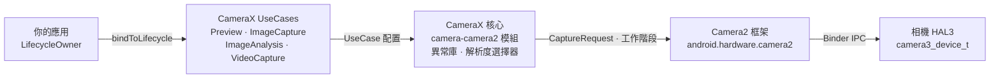

# 第 24 章：CameraX

## 摘要

當你讀到本章時，你已經掌握了原生的 Camera2 API：手動打開 `CameraDevice` 實例、構造 `CaptureRequest.Builder` 對象、管理 `CameraCaptureSession` 生命週期、應對三種不同的回呼類型，並小心翼翼地在每種邊緣情況下釋放所有資源。你已經歷練有成。現在我們要退後一步問：如果 80% 的樣板程式碼可以消失呢？

CameraX 是 Google 推出的 Jetpack 庫，它以生命週期感知、宣告式、用例驅動的 API 封裝了 Camera2。它並不是要取代 Camera2 —— 它底層就是 Camera2。它取代的是數百行工作階段配置程式碼、設備特定的異常處理以及手動的生命週期簿記。在本章中，你將學習 CameraX 的架構，理解 `UseCase`（用例）模型，了解如何透過 `Camera2Interop` 將原生的 Camera2 參數*注入*到 CameraX 中，並帶走一份準確決定何時選擇 CameraX 以及何時必須下沈到 Camera2 的決策表。

若想在決定針對哪一層進行開發前檢查你自己設備上的每一項相機性能，請安裝來自 [Google Play](https://play.google.com/store/apps/details?id=com.minininja.cameraparams) 的 **Android Camera Parameters**，或造訪 [github.com/zoozooll/AndroidCameraParameters](https://github.com/zoozooll/AndroidCameraParameters) 查看源碼。

---

## CameraX 架構

CameraX 以五個 Jetpack 組件的形式發佈：`camera-core`、`camera-camera2`、`camera-lifecycle`、`camera-view` 和 `camera-extensions`。其架構核心是 `UseCase` 模型 —— 你思考的不再是 Surface 和工作階段，而是*你希望相機做什麼*。

### UseCase 模型

共有四個規範的用例，你可以同時將它們的任意子集繫結到生命週期：

| UseCase (用例) | 用途 |
|------------------|----------------------------------------------------------------|
| `Preview` | 將幀串流傳輸到 `PreviewView` 或 `Surface`。類似於設定針對 `SurfaceTexture` 的重複請求。 |
| `ImageAnalysis` | 在背景執行緒將 `ImageProxy` 幀串流傳輸到你的分析器。取代了手動建立 `YUV_420_888` 格式的 `ImageReader` 並將其監聽器連接到重複請求的操作。 |
| `ImageCapture` | 單次或連拍照片拍攝。為你處理擷取請求、`ImageReader` 管道、旋轉和 EXIF。 |
| `VideoCapture` | 自 1.1 版本起合併入 CameraX；封裝了具有正確的暫停/恢復語意和音訊路由的 `MediaRecorder` 或 `ParcelFileDescriptor` 管線。 |

同時繫結所有四個用例是完全合法的 —— CameraX 會在內部針對 `SCALER_STREAM_CONFIGURATION_MAP` 解析串流組合，並代表你呼叫 `isSessionConfigurationSupported`，如果你的精確組合不被支援，它會自動回退到較低解析度。這是最大的優勢之一：你再也不用花三個小時去發現測試矩陣中的某台 2019 年三星中階機不支援同時開啟 `4:3 PRIV + 16:9 JPEG_MAX`。CameraX 能讓它直接跑通。

### ProcessCameraProvider 與生命週期感知

繫結點是 `ProcessCameraProvider`，這是由你的應用程序進程擁有的單例。核心程式碼如下：

```kotlin
val cameraProviderFuture = ProcessCameraProvider.getInstance(context)
cameraProviderFuture.addListener({
    val cameraProvider = cameraProviderFuture.get()
    val camera: Camera = cameraProvider.bindToLifecycle(
        lifecycleOwner,
        cameraSelector,
        preview,
        imageCapture,
        imageAnalysis
    )
}, ContextCompat.getMainExecutor(context))
```

僅此而已。沒有 `openCamera` 的回呼地獄，沒有 `StateCallback`，沒有工作階段配置回呼，也沒有拆除工作。當 `lifecycleOwner`（你的 `Fragment` 或 `Activity`）達到 `ON_STOP` 時，CameraX 會關閉 `CameraDevice`。在 `ON_DESTROY` 時，它會拆除工作階段並釋放每個 Surface。你在第 7 章中苦苦追查的資源洩漏根本不會發生 —— 生命週期契約強制執行了這一切。

### CameraX 在內部封裝了 Camera2

在內部，CameraX 就是 Camera2。`camera-camera2` 組件包含了 `Camera2Camera`、`Camera2CameraCaptureResult` 和 `Camera2RequestProcessor`，它們都會將你的高級 UseCase 宣告轉換為你在前 23 章中手寫的精確的 `CameraManager.openCamera`、`createCaptureSession` 和 `setRepeatingRequest` 呼叫。特定供應商的變通方案被編碼在庫內部的按設備分類的 XML 文件中 —— 這就是著名的「CameraX 異常行為資料庫 (quirk database)」。

完整的架構如下所示：



按從左到右的箭頭觀察：你的應用宣告*想要什麼*（用例），CameraX 解析*如何獲取*（Surface 尺寸、工作階段配置、異常處理），然後發出與你手寫完全相同的 Camera2 呼叫。附加值在於中間的兩個框 —— 數十萬行由 Google 編寫的你無需重複編寫的設備相容程式碼。

---

## Camera2Interop：向 CameraX 注入 Camera2 參數

CameraX 在 80% 的場景下都非常出色。但你，親愛的讀者，是一位 Camera2 大師。你知道 `CONTROL_AE_MODE_OFF` 意味著什麼。你了解 `SENSOR_SENSITIVITY` 與 `CONTROL_AE_EXPOSURE_COMPENSATION` 之間的區別。當產品規範要求「即使用戶在使用 CameraX 時也要能將 ISO 鎖定在 400 且曝光鎖定在 1/60s」時，你不需要用原生 Camera2 重寫整個功能。你只需要求助於 `Camera2Interop`。

### Extender (擴充器) 模式

每個 `UseCase.Builder` 都有一個匹配的 `Camera2Interop.Extender`。在 `build()` *之前* 呼叫它，可以在工作階段層級或逐請求層級注入原生的 Camera2 鍵：

| 方法 | Camera2 等效操作 |
|------------------------------------------------|----------------------------------------------|
| `extender.setCaptureRequestOption(key, value)` | `CaptureRequest.Builder.set(key, value)` |
| `extender.setSessionOption(key, value)` | 工作階段初始化參數 (較少用到) |

擴充器是累加式的：對於你沒有覆蓋的每一個鍵，CameraX 仍會設定其自己的預設值。如果你僅設定了 `SENSOR_SENSITIVITY`，CameraX 仍會處理 AF、AWB、旋轉和元數據。

### 現實範例：在 CameraX 中手動設定 ISO 和曝光

這裡是一個完整的 `ImageCapture` 建構器，它將相機鎖定為手動 AE，ISO 固定為 400，快門時間為 1/60 秒，然後拍攝一張照片：

```kotlin
val iso = 400
val exposureTimeNanos = 1_000_000_000L / 60 // 1/60 秒

val imageCapture = ImageCapture.Builder()
    .setTargetResolution(Size(4032, 3024))
    .setCaptureMode(ImageCapture.CAPTURE_MODE_MAXIMIZE_QUALITY)
    .apply {
        val interop = Camera2Interop.Extender(this)
        interop.setCaptureRequestOption(
            CaptureRequest.CONTROL_AE_MODE,
            CaptureRequest.CONTROL_AE_MODE_OFF
        )
        interop.setCaptureRequestOption(
            CaptureRequest.CONTROL_AE_LOCK,
            false
        )
        interop.setCaptureRequestOption(
            CaptureRequest.SENSOR_SENSITIVITY,
            iso
        )
        interop.setCaptureRequestOption(
            CaptureRequest.SENSOR_EXPOSURE_TIME,
            exposureTimeNanos
        )
        interop.setCaptureRequestOption(
            CaptureRequest.CONTROL_MODE,
            CaptureRequest.CONTROL_MODE_OFF
        )
    }
    .build()

cameraProvider.bindToLifecycle(
    viewLifecycleOwner,
    CameraSelector.DEFAULT_BACK_CAMERA,
    preview,
    imageCapture
)

// 稍後，觸發拍攝：
imageCapture.takePicture(
    ContextCompat.getMainExecutor(context),
    object : ImageCapture.OnImageCapturedCallback() {
        override fun onCaptureSuccess(imageProxy: ImageProxy) {
            // imageProxy 包含了經過手動曝光的幀
            imageProxy.close()
        }

        override fun onError(exception: ImageCaptureException) {
            Log.e(TAG, "拍攝失敗: ${exception.imageCaptureError}", exception)
        }
    }
)
```

**關鍵警告：** 設定 `CONTROL_MODE_OFF` 會禁用*所有* 3A。如果你只想鎖定曝光但仍希望執行 AF 和 AWB，請僅設定 `CONTROL_AE_MODE_OFF`（或 `CONTROL_AE_LOCK = true`），並保持 `CONTROL_MODE` 為預設值 (`CONTROL_MODE_AUTO`)。CameraX 會預設設定你未觸及的每一個鍵。

是的 —— 你也可以對 `Preview.Builder` 和 `ImageAnalysis.Builder` 進行同樣的操作，以實現重複的手動串流。擴充器適用於在該 UseCase 生命週期內發出的每一個重複請求或單次請求。

### 讀回 Camera2 結果

另一個方向 —— 從 CameraX 回呼中提取 `TotalCaptureResult` —— 透過 `Camera2CameraCaptureResult` 同樣可以直接實現：

```kotlin
imageCapture.takePicture(
    executor,
    object : ImageCapture.OnImageCapturedCallback() {
        override fun onCaptureSuccess(imageProxy: ImageProxy) {
            val camera2Result = imageProxy.imageInfo
                .cameraCaptureResult as? Camera2CameraCaptureResult
            val totalResult: TotalCaptureResult? = camera2Result?.captureResult
            val actualIso = totalResult?.get(CaptureResult.SENSOR_SENSITIVITY)
            Log.d(TAG, "感光元件上的實際 ISO: $actualIso")
            imageProxy.close()
        }
    }
)
```

這可以讓你驗證你的注入參數是否真的傳到了感光元件。請使用 **Android Camera Parameters** 交叉檢查你的設備宣告的 `SENSOR_INFO_SENSITIVITY_RANGE` —— 如果你注入的 ISO 超出了該範圍，CameraX 會靜默將其夾斷（或者由 HAL 執行），而讀回結果是了解這一點的唯一方法。

---

## 選擇 CameraX 還是 Camera2

最難的架構問題不是「如何使用 CameraX？」，而是「我到底該不該用 CameraX？」 這裡有一份從真實生產工作中提煉出來的決策框架。

### 決策流程圖

```mermaid
flowchart TD
    A["開始"] --> B{是否需要 RAW 擷取、<br/>ZSL 重處理、<br/>多相機物理串流、<br/>大於 60fps 的高速模式？}
    B -->|是| D[使用原生 Camera2]
    B -->|否| C{是否需要每個物理相機的<br/>逐幀 CaptureRequest 模板、<br/>自定義工作階段拓撲<br/>(輸入重處理 Surface)、<br/>或離線工作階段？}
    C -->|是| D
    C -->|否| E{是否僅需基礎預覽+照片<br/>+影片+分析，<br/>以及廣泛的設備相容性？}
    E -->|是| F[使用 CameraX]
    E -->|否| G{CameraX 異常庫是否覆蓋了<br/>你的目標設備集？<br/>透過 Android Camera Parameters 驗證}
    G -->|是| F
    G -->|否| D
```

### 決策表

| 場景 | CameraX | 原生 Camera2 |
|-----------------------------------------------------------------------|:-------:|:-----------:|
| Instagram 風格的預覽 + 一鍵拍照 + 影片 | ✅ | ⛔ |
| 無需自定義幀參數的二維碼 / 條碼 / ML Kit 人臉偵測 | ✅ | ⛔ |
| 帶有固定 ISO + 快門的手動曝光 (Camera2Interop 已涵蓋) | ✅ | ⚠️ |
| 重寫 OEM 演算法的自定義 3A 狀態機 | ⛔ | ✅ |
| `RAW_SENSOR` / `RAW_PRIVATE` / DNG 專業攝影 | ⛔ | ✅ |
| 帶有重處理輸入 Surface 的零快門延遲 (第 23 章) | ⛔ | ✅ |
| 邏輯多相機物理串流存取 (第 20 章) | ⛔ | ✅ |
| 透過受限高速工作階段實現的 120/240fps 高速模式 | ⛔ | ✅ |
| 透過 OEM 擴充實現的相機擴充 (夜景 / 虛化 / HDR) | ✅ | ✅ |
| 具有早期啟動 EVS 遷移需求的汽車後視相機 | ⛔ | ✅ (NDK) |
| 跨設備相容性是第一大非功能性需求 | ✅ | ⚠️ |

中間地帶 (⚠️) 是需要權衡判斷的地方。透過 `Camera2Interop` 進行的手動曝光控制在 `HARDWARE_LEVEL_FULL` 設備上執行可靠，但在 `LEGACY` 設備上會靜默失效，因為 `LEGACY` HAL 會完全忽略 `CONTROL_MODE_OFF`。在你的測試機隊上執行 **Android Camera Parameters**，檢查每台設備的 `INFO_SUPPORTED_HARDWARE_LEVEL`，如果你的機隊中有 20% 是 `LEGACY`，那麼要么退到原生 Camera2 並提供回退路徑，要么接受手動控制在這些設備上無效的事實。

### 基礎 CameraX 預覽 + ImageCapture 設定 (完整版)

作為參考，這裡是一個完整的最小化設定，它取代了你在第 6-9 章中手寫的約 300 行原生 Camera2 程式碼。

```kotlin
class CameraXFragment : Fragment() {

    private lateinit var viewBinding: FragmentCameraXBinding
    private lateinit var imageCapture: ImageCapture

    override fun onViewCreated(view: View, savedInstanceState: Bundle?) {
        super.onViewCreated(view, savedInstanceState)
        viewBinding = FragmentCameraXBinding.bind(view)

        val cameraProviderFuture = ProcessCameraProvider.getInstance(requireContext())
        cameraProviderFuture.addListener({
            val cameraProvider = cameraProviderFuture.get()
            bindCameraUseCases(cameraProvider)
        }, ContextCompat.getMainExecutor(requireContext()))
    }

    private fun bindCameraUseCases(cameraProvider: ProcessCameraProvider) {
        val preview = Preview.Builder().build().also {
            it.setSurfaceProvider(viewBinding.previewView.surfaceProvider)
        }

        imageCapture = ImageCapture.Builder()
            .setCaptureMode(ImageCapture.CAPTURE_MODE_MINIMIZE_LATENCY)
            .setTargetRotation(viewBinding.previewView.display.rotation)
            .build()

        val cameraSelector = CameraSelector.Builder()
            .requireLensFacing(CameraSelector.LENS_FACING_BACK)
            .build()

        cameraProvider.unbindAll()
        try {
            cameraProvider.bindToLifecycle(
                viewLifecycleOwner,
                cameraSelector,
                preview,
                imageCapture
            )
        } catch (exc: Exception) {
            Log.e(TAG, "UseCase 繫結失敗", exc)
        }
    }

    private fun takePhoto() {
        val photoFile = File(
            outputDirectory,
            "PHOTO_${System.currentTimeMillis()}.jpg"
        )
        val outputOptions = ImageCapture.OutputFileOptions
            .Builder(photoFile)
            .build()

        imageCapture.takePicture(
            outputOptions,
            ContextCompat.getMainExecutor(requireContext()),
            object : ImageCapture.OnImageSavedCallback {
                override fun onImageSaved(output: ImageCapture.OutputFileResults) {
                    val savedUri = Uri.fromFile(photoFile)
                    Toast.makeText(requireContext(),
                        "已儲存: $savedUri", Toast.LENGTH_SHORT).show()
                }
                override fun onError(exc: ImageCaptureException) {
                    Log.e(TAG, "照片拍攝失敗: ${exc.message}", exc)
                }
            }
        )
    }

    companion object {
        private const val TAG = "CameraXFragment"
    }
}
```

這就是全部的預覽 + 拍照管線。請注意，這裡完全沒有 `HandlerThread`、`CameraDevice.StateCallback`、`CameraCaptureSession.StateCallback`、`ImageReader.OnImageAvailableListener` 或手動的 `close()` 呼叫。CameraX 處理了其中的每一個環節。

---

## 小結

CameraX 是 Camera2 的生命週期感知、用例驅動的門面，由 Google 的跨設備異常資料庫提供支持。其架構層次為：你的應用 → UseCases → CameraX 核心 → Camera2 → HAL，而 `ProcessCameraProvider.bindToLifecycle()` 呼叫取代了數百行手動設定程式碼。對於 CameraX 未在 UseCase 層級暴露的 20% 的參數，`Camera2Interop.Extender` 可以注入原生的 `CaptureRequest` 鍵並讀回原生的 `TotalCaptureResult` 數值。決定何時使用它的標準非常明確：除非你的功能明確需要 RAW、ZSL、物理多相機串流、高速影片或 CameraX 解析器無法表達的自定義工作階段拓撲，否則 CameraX 就是預設選擇。

## 下一章

CameraX 仍然是執行在 Binder 邊界之上的 Java/Kotlin (Dalvik/ART) 程式碼。如果即使這樣的開銷對於你的 AR 引擎的 16ms 幀預算來說也太大了怎麼辦？在第 25 章中，我們完全跨過 JNI 線，使用 NDK 的原生相機堆疊直接從 C++ 打開相機，並將幀作為 Vulkan 紋理進行零拷貝繫結。
