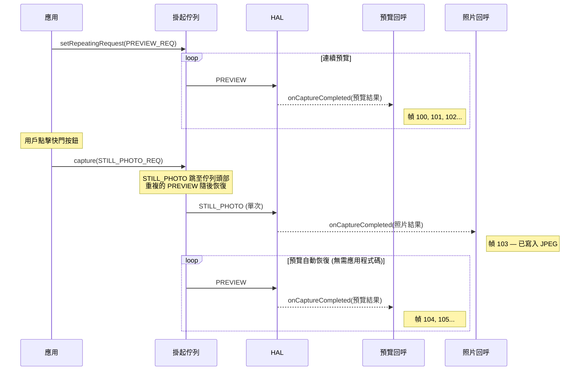
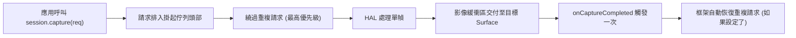
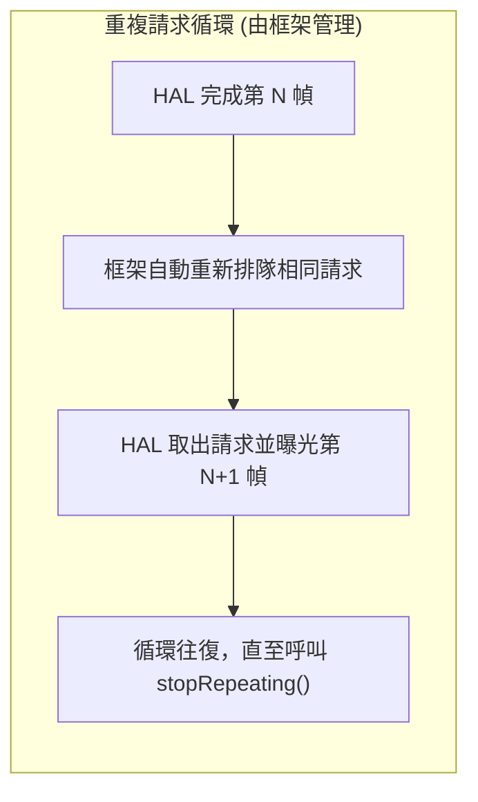
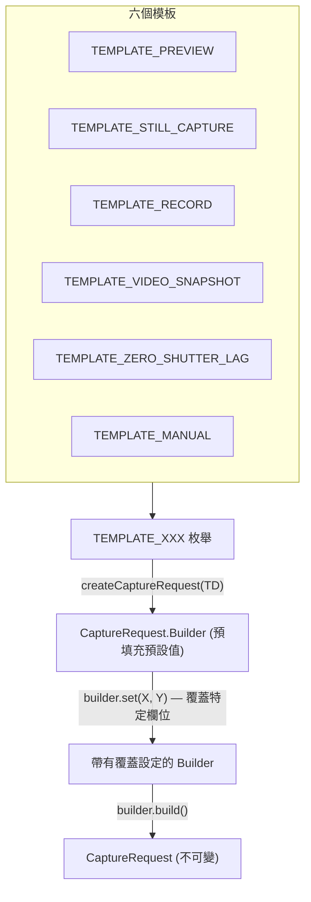

## 11.1 饋送管線的三種方式

在[第 10 章](the-camera2-pipeline.md)中，你已經看到了請求如何流經 Camera2 管線：從掛起佇列到在途佇列，到 HAL，再到你的回呼和輸出 Surface。但是，*如何提交*這些請求至關重要。Camera2 提供了三種提交機制，每種機制的行為都有根本不同：

1. **單次 (One-shot)** (`capture()`) — 執行一次單個請求
2. **連拍 (Burst)** (`captureBurst()`) — 連續執行一組請求，中間無間隔
3. **重複 (Repeating)** (`setRepeatingRequest()`) — 永久（或直到被中斷）連續執行同一個請求

除了這三種提交模式外，框架還提供了六個**擷取模板**，它們為常見用例（預覽、靜態擷取、影片錄製、零快門延遲、手動控制等）預先填充了 `CaptureRequest.Builder` 的合理預設值。

本章結束時，你將準確了解何時使用每種擷取類型和模板——包括為什麼預覽始終使用重複請求，為什麼連拍是實現曝光包圍的唯一方法，以及為什麼即使在預覽執行時靜態照片也使用單次請求。

**Android Camera Parameters** 應用（[GitHub](https://github.com/zoozooll/AndroidCameraParameters)，[Play 商店](https://play.google.com/store/apps/details?id=com.minininja.cameraparams)）在 **Capture Demo (擷取演示)** 索引標籤中演示了所有三種擷取類型。在 「Preview (Repeating)」、「Single Photo (One-Shot)」 和 「Burst (3 Frames)」 模式之間切換，即可在你自己的設備上即時觀察回呼行為和時序差異。

## 11.2 單次：capture()

最簡單的提交模式是透過 `CameraCaptureSession.capture()` 進行的**單次擷取 (one-shot capture)**。它正如其名：向管線提交一個 `CaptureRequest`，執行且僅執行一次。

```kotlin
// 單次：擷取單個靜態幀至 JPEG ImageReader
fun captureStillPhoto() {
    val builder = cameraDevice.createCaptureRequest(CameraDevice.TEMPLATE_STILL_CAPTURE)
    builder.addTarget(jpegReader.surface)
    builder.set(CaptureRequest.JPEG_QUALITY, 100)
    builder.set(CaptureRequest.CONTROL_AF_MODE, CaptureRequest.CONTROL_AF_MODE_CONTINUOUS_PICTURE)
    builder.set(CaptureRequest.CONTROL_AE_MODE, CaptureRequest.CONTROL_AE_MODE_ON)

    val request = builder.build()

    captureSession.capture(request, object : CameraCaptureSession.CaptureCallback() {
        override fun onCaptureCompleted(
            session: CameraCaptureSession,
            request: CaptureRequest,
            result: TotalCaptureResult
        ) {
            super.onCaptureCompleted(session, request, result)
            Log.d("Capture", "單次照片完成。幀號 #${result.frameNumber}")
        }
    }, backgroundHandler)
}
```

### 何時使用單次模式

| 用例 | 為什麼用單次？ |
|----------|--------------|
| 單次靜態照片 | 每點擊一次快門執行一次 |
| 單次 AF/AE 觸發 | 針對一次點擊對焦事件發射 `CONTROL_AF_TRIGGER_START` |
| 影片期間抓拍 | 在重複影片請求活動期間抓取一幀高解析度幀 |
| 擷取單幀 RAW | 針對一張照片同時擷取 RAW + JPEG |

### 單次擷取如何與重複預覽互動

Camera2 中的一個關鍵設計模式是：**預覽作為重複請求執行，而靜態照片作為單次請求注入**。正如我们在第 10 章的佇列模型中所討論的，單次請求會跳到掛起佇列中重複請求的前面，因此它會立即執行。單次請求完成後，框架會自動恢復重複的預覽請求——你無需重新提交。



:::tip
這種自動恢復行為是整合在 Camera2 框架中的。在單次擷取後，你永遠不需要手動「重新啟動預覽」——框架會為你重新排隊重複請求。
:::

### 單次執行流程



## 11.3 連拍：captureBurst()

`capture()` 提交一個請求，而 `captureBurst()` 提交一個 **`List<CaptureRequest>`**，並保證列表中所有的 N 幀**連續且按順序執行，中間不會穿插來自其他源（包括重複請求）的幀**。

這種原子、無間隙的保證使得連拍擷取對於以下場景至關重要：

- **曝光包圍 (Exposure bracketing)** — 在 ±1EV、±2EV 處擷取 3-5 幀，然後將其合併為 HDR
- **對焦包圍 (Focus bracketing)** — 掃描對焦距離，然後進行景深合成
- **動作 / 運動捕捉** — 拍攝 10-30 幀快速移動的主體，然後挑選最清晰的一幀
- **慢動作影片 (高速)** — `createHighSpeedRequestList()` + 受限高速連拍
- **3A 收斂採樣** — 觸發 AF/AE，然後連拍直至收斂

```kotlin
// 連拍：3 幀曝光包圍 (-2EV, 0EV, +2EV)
fun captureExposureBracket() {
    val baseIso = 100
    val baseExposure = 10_000_000L  // 10ms = "0EV" 基准

    val burstList: MutableList<CaptureRequest> = mutableListOf()

    // 幀 0: -2EV (4x 短曝光 = 更暗)
    burstList += cameraDevice.createCaptureRequest(CameraDevice.TEMPLATE_STILL_CAPTURE).apply {
        addTarget(jpegReader.surface)
        set(CaptureRequest.SENSOR_SENSITIVITY, baseIso)
        set(CaptureRequest.SENSOR_EXPOSURE_TIME, baseExposure / 4)
        set(CaptureRequest.CONTROL_AE_MODE, CaptureRequest.CONTROL_AE_MODE_OFF)
    }.build()

    // 幀 1: 0EV (正確曝光)
    burstList += cameraDevice.createCaptureRequest(CameraDevice.TEMPLATE_STILL_CAPTURE).apply {
        addTarget(jpegReader.surface)
        set(CaptureRequest.SENSOR_SENSITIVITY, baseIso)
        set(CaptureRequest.SENSOR_EXPOSURE_TIME, baseExposure)
        set(CaptureRequest.CONTROL_AE_MODE, CaptureRequest.CONTROL_AE_MODE_OFF)
    }.build()

    // 幀 2: +2EV (4x 長曝光 = 更亮)
    burstList += cameraDevice.createCaptureRequest(CameraDevice.TEMPLATE_STILL_CAPTURE).apply {
        addTarget(jpegReader.surface)
        set(CaptureRequest.SENSOR_SENSITIVITY, baseIso)
        set(CaptureRequest.SENSOR_EXPOSURE_TIME, baseExposure * 4)
        set(CaptureRequest.CONTROL_AE_MODE, CaptureRequest.CONTROL_AE_MODE_OFF)
    }.build()

    captureSession.captureBurst(burstList, object : CameraCaptureSession.CaptureCallback() {
        private var completedCount = 0

        override fun onCaptureCompleted(
            session: CameraCaptureSession,
            request: CaptureRequest,
            result: TotalCaptureResult
        ) {
            super.onCaptureCompleted(session, request, result)
            completedCount++
            Log.d("Burst", "連拍幀 $completedCount/${burstList.size} 完成。幀號 #${result.frameNumber}")

            if (completedCount == burstList.size) {
                Log.d("Burst", "所有 ${burstList.size} 個包圍幀已擷取！")
                // TODO: 合併 HDR、對焦堆疊，或讓用戶挑選最好的一幀
            }
        }
    }, backgroundHandler)
}
```

### 連續性保證的運作

連拍的關鍵屬性在於**整個列表是原子排隊的**——即使 `setRepeatingRequest()` 處於活動狀態，N 個連拍幀也會在重複請求恢復之前背靠背全部執行。重複請求不會穿插在連拍幀之間。

```mermaid
flowchart TB
    subgraph QueueBefore ["連拍提交前"]
        direction LR
        R1["PREVIEW (重複)"] --> R2["PREVIEW (重複)"] --> R3["PREVIEW (重複)"]
    end

    subgraph Arrow ["應用呼叫 captureBurst([B1,B2,B3])"]
        style Arrow fill:#fff3e0
    end

    subgraph QueueAfter ["連拍提交後 (原子入隊)"]
        direction LR
        B1["連拍幀 1"] --> B2["連拍幀 2"] --> B3["連拍幀 3"] --> R4["PREVIEW (重複) 恢復"] --> R5["PREVIEW"]
    end

    QueueBefore --> Arrow --> QueueAfter

    Note over B1,B3: 預覽幀不會從中間溜進來！
```

### 連拍大小限制

單次 `captureBurst()` 呼叫中可以提交的最大連拍大小由以下因素決定：
- `CameraCharacteristics.REQUEST_MAX_NUM_OUTPUT_RAW` — 針對 RAW 輸出
- `CameraCharacteristics.REQUEST_MAX_NUM_OUTPUT_PROC` — 針對處理後的（YUV/JPEG）輸出
- 實際硬體頻寬（4K 連拍會比 1080p 連拍更短）

對於典型的 FULL 設備，10-50 幀的處理後 JPEG 連拍通常沒有問題。RAW 連拍可能受限於感光元件和記憶體，限制在 5-10 幀。

### 用於慢動作的高速連拍

對於慢動作影片，Camera2 提供了 `CameraDevice.createHighSpeedRequestList()`，它將一個普通的 `CaptureRequest` 轉換為適合高速、受限擷取影片（例如 120fps 或 240fps）的連拍請求列表。這需要與 `CameraCaptureSession.captureBurst()` 配合使用，且需要具備 `CONSTRAINED_HIGH_SPEED_VIDEO` 功能：

```kotlin
// 連拍：高速慢動作 (120fps)
fun captureHighSpeedSlowMo() {
    val capabilities = characteristics.get(CameraCharacteristics.REQUEST_AVAILABLE_CAPABILITIES)
    val supportsHighSpeed = capabilities?.contains(
        CameraCharacteristics.REQUEST_AVAILABLE_CAPABILITIES_CONSTRAINED_HIGH_SPEED_VIDEO
    ) ?: false

    if (!supportsHighSpeed) {
        Log.w("HighSpeed", "設備不支援受限的高速影片")
        return
    }

    // 建構一個基礎請求 (目標指向 MediaRecorder Surface)
    val baseBuilder = cameraDevice.createCaptureRequest(CameraDevice.TEMPLATE_RECORD)
    baseBuilder.addTarget(mediaRecorderSurface)
    val baseRequest = baseBuilder.build()

    // 展開為高速連拍列表 — 框架針對 120fps 進行了優化
    val highSpeedBurst = cameraDevice.createHighSpeedRequestList(listOf(baseRequest))

    // 透過 captureBurst 提交優化的連拍列表
    captureSession.captureBurst(highSpeedBurst, highSpeedCallback, backgroundHandler)
}
```

## 11.4 重複：setRepeatingRequest()

Camera2 的主力是**重複請求 (repeating request)**，透過 `CameraCaptureSession.setRepeatingRequest()` 提交。它不是執行一次，而是框架在每一幀之後永遠（直到被中斷）自動重新排隊*同一個請求*，從而以硬體的原生幀率產生連續的幀串流。

```kotlin
// 重複：啟動相機預覽 (30fps 連續串流)
fun startPreview() {
    val builder = cameraDevice.createCaptureRequest(CameraDevice.TEMPLATE_PREVIEW)
    builder.addTarget(previewSurface)
    builder.set(CaptureRequest.CONTROL_AF_MODE, CaptureRequest.CONTROL_AF_MODE_CONTINUOUS_PICTURE)
    builder.set(CaptureRequest.CONTROL_AE_MODE, CaptureRequest.CONTROL_AE_MODE_ON)
    builder.set(CaptureRequest.CONTROL_AWB_MODE, CaptureRequest.CONTROL_AWB_MODE_AUTO)

    val repeatingRequest = builder.build()

    captureSession.setRepeatingRequest(
        repeatingRequest,
        object : CameraCaptureSession.CaptureCallback() {
            private var frameCount = 0
            private var lastFpsLogMs = 0L

            override fun onCaptureCompleted(
                session: CameraCaptureSession,
                request: CaptureRequest,
                result: TotalCaptureResult
            ) {
                super.onCaptureCompleted(session, request, result)
                frameCount++
                val now = System.currentTimeMillis()
                if (now - lastFpsLogMs > 1000) {
                    Log.d("Preview", "預覽 FPS: $frameCount")
                    frameCount = 0
                    lastFpsLogMs = now
                }
            }
        },
        backgroundHandler
    )
}
```

### 為什麼預覽*必須*使用重複請求

如果你嘗試使用每秒呼叫 30 次 `capture()` 的定時器來實現 30fps 預覽，你會：
1. 每 33ms 重新提交相同的請求，浪費 CPU
2. 如果你的定時器延遲，會產生漂移
3. 如果單次回呼發生阻塞，會出現幀間隙
4. 會與框架的佇列管理發生衝突

重複請求完全在框架/HAL 內部處理。每一幀完成後，HAL 會自動排程下一次曝光——無需應用執行緒參與。這以零應用 CPU 開銷產生平滑、無間隙的預覽。



### 停止重複請求

要停止重複串流，呼叫 `stopRepeating()`。這會從佇列中移除重複請求，但不會重新整理已經在途的幀。呼叫 `abortCaptures()` 可強制重新整理所有請求（並針對在途幀觸發帶有 `REASON_FLUSHED` 的 `onCaptureFailed`）。

```kotlin
// 暫時暫停預覽
fun pausePreview() {
    captureSession.stopRepeating()
    Log.d("Preview", "重複已停止。在途幀仍會完成。")
}

// 緊急停止 — 立即丟棄所有擷取
fun emergencyStopAllCaptures() {
    captureSession.stopRepeating()
    captureSession.abortCaptures()
    // 所有在途幀將以 REASON_FLUSHED 失敗
}
```

### 重複請求也用於影片錄製

除了預覽外，重複請求還用於**影片錄製**（針對 `MediaRecorder` 或 `MediaCodec` 的 `Surface`）和**持續影像分析**（針對用於人臉偵測、機器學習推理等的低解析度 YUV `ImageReader`）。

模式始終相同：設定一次，讓它流動，當你想要更改設定時更新請求參數（例如，透過在新的重複請求中更新裁剪區域來在串流中途更改數位變焦）。

```kotlin
// 重複：在預覽/影片期間即時更新變焦層級
fun updateDigitalZoom(cropRegion: Rect) {
    val builder = cameraDevice.createCaptureRequest(CameraDevice.TEMPLATE_PREVIEW)
    builder.addTarget(previewSurface)
    builder.addTarget(mediaRecorderSurface)
    builder.set(CaptureRequest.SCALER_CROP_REGION, cropRegion)
    builder.set(CaptureRequest.CONTROL_AF_MODE, CaptureRequest.CONTROL_AF_MODE_CONTINUOUS_PICTURE)

    // 使用新請求替換舊的重複請求 (相同目標, 新裁剪區域)
    captureSession.setRepeatingRequest(builder.build(), currentCallback, backgroundHandler)
    Log.d("Zoom", "重複請求已更新，裁剪區域為 ${cropRegion.width()}x${cropRegion.height()}")
}
```

## 11.5 擷取模板

每個 `CaptureRequest.Builder` 都從一個**模板 (template)** 開始：你呼叫 `cameraDevice.createCaptureRequest(TEMPLATE_XXX)`，框架會針對該用例用硬體優化的預設值填充建構器。然後你只需覆蓋你需要的特定設定。

模板之所以存在，是因為手機的相機管線有數十個旋鈕（降噪強度、邊緣增強、色調曲線、抗條紋模式、幀率範圍……）。模板設定了合理的基準，因此你不必從頭開始配置每一個。



### 六個模板：預配置內容及使用時機

| 模板 | 用例 | 關鍵預配置設定 |
|----------|----------|---------------------------|
| `TEMPLATE_PREVIEW` | 即時取景器 / 預覽 | 低延遲優先，3A (AF/AE/AWB) 為連續自動模式，適度的降噪/銳化，高幀率 (30fps)。犧牲微小畫質以換取流暢度。 |
| `TEMPLATE_STILL_CAPTURE` | 單次拍攝照片 | 最高質量優先，AF 為圖片模式，完整降噪/銳化，高質量 JPEG 編碼。為了提升那一幀的畫質可能會降低幀率。 |
| `TEMPLATE_RECORD` | 影片錄製 | 穩定的幀率（匹配 MediaRecorder 輸出），連續對焦，音影片同步時間戳，啟用抗條紋，中等降噪——針對運動 + 壓縮進行了調優。 |
| `TEMPLATE_VIDEO_SNAPSHOT` | 影片錄製期間的高清靜態圖 | 類似於 STILL_CAPTURE 但保留了影片幀設定——在不停止影片錄製串流的情況下抓取一張高清照片。 |
| `TEMPLATE_ZERO_SHUTTER_LAG` | ZSL 靜態拍攝 (第 14 章) | 建構一個近期幀的環形緩衝區。當點擊快門時，返回一幀*過去*的幀以實現零黑屏。需要連拍能力和私有重處理支援。 |
| `TEMPLATE_MANUAL` | 手動 / 專業控制 | 預設情況下所有 3A 模式均設定為 OFF，以便你可以手動設定感光元件曝光、ISO、鏡頭焦距和色彩校正增益而無需干擾。作為專業相機 UI 的基準。 |

```kotlin
// 模板範例 — 查看從各個模板開始會發生什麼

// TEMPLATE_PREVIEW — 平滑，低延遲
val previewBuilder = cameraDevice.createCaptureRequest(CameraDevice.TEMPLATE_PREVIEW)
val previewRequest = previewBuilder.build()
Log.d("Template", "PREVIEW AF_MODE = ${previewRequest.get(CaptureRequest.CONTROL_AF_MODE)}")
// ^ 通常為 CONTROL_AF_MODE_CONTINUOUS_PICTURE (始終在重新對焦)

// TEMPLATE_STILL_CAPTURE — 每幀最高畫質
val stillBuilder = cameraDevice.createCaptureRequest(CameraDevice.TEMPLATE_STILL_CAPTURE)
val stillRequest = stillBuilder.build()
Log.d("Template", "STILL_CAPTURE JPEG_QUALITY = ${stillRequest.get(CaptureRequest.JPEG_QUALITY)}")
// ^ 通常為 100 (最高質量編碼)

// TEMPLATE_MANUAL — 禁用所有自動控制
val manualBuilder = cameraDevice.createCaptureRequest(CameraDevice.TEMPLATE_MANUAL)
val manualRequest = manualBuilder.build()
Log.d("Template", "MANUAL AE_MODE = ${manualRequest.get(CaptureRequest.CONTROL_AE_MODE)}")
Log.d("Template", "MANUAL AF_MODE = ${manualRequest.get(CaptureRequest.CONTROL_AF_MODE)}")
Log.d("Template", "MANUAL AWB_MODE = ${manualRequest.get(CaptureRequest.CONTROL_AWB_MODE)}")
// ^ 通常為 AE_MODE_OFF, AF_MODE_OFF, AWB_MODE_OFF — 從一開始就是手動的
```

:::tip
始終從模板開始並覆蓋特定欄位。相比於從空模板建立請求（這甚至是不可能的——每一個 `createCaptureRequest` 都需要模板），從 `TEMPLATE_PREVIEW` 開始然後覆蓋 2-3 個設定（例如用於變焦的裁剪區域、用於曝光補償的 AE 目標偏差）出錯的可能性要小得多。
:::

## 11.6 三種擷取類型對比

| 維度 | 單次 `capture()` | 連拍 `captureBurst()` | 重複 `setRepeatingRequest()` |
|-----------|---------------------|----------------------|---------------------------------|
| **執行** | 單個請求執行一次 | N 個請求列表連續執行 | 同一個請求每幀執行 (自動重新入隊) |
| **優先級** | 最高 — 跳至掛起佇列頭部 | 高 — 所有 N 幀原子地插入頭部 | 最低 — 單次/連拍會在其前面插隊，隨後恢復重複 |
| **中斷** | 中斷重複請求；完成後恢復重複 | 中斷重複請求；整個連拍完成後恢復 | 被任何單次或連拍請求搶佔；之後自動恢復 |
| **佇列行為** | 單個請求排隊 | N 個請求連續排隊 (無間隙) | 每個週期重新排隊一個概念請求 |
| **典型用途** | 單張照片、單次 AF 觸發、閃光燈照片 | 曝光包圍、對焦堆疊、動作連拍、慢動作、HDR | 預覽、影片錄製、持續 ML 分析、即時人臉偵測 |
| **結果回呼** | `onCaptureCompleted` 觸發且僅觸發一次 | `onCaptureCompleted` 觸發 N 次 (每連拍一幀一次) | `onCaptureCompleted` 針對每一幀持續觸發 (每秒 30-60 次) |

```mermaid
quadrantChart
    title 擷取類型使用模式
    x-axis ["低幀數", "高幀數"]
    y-axis ["單一配置", "變化的逐幀配置"]
    quadrant-1 ["連拍：曝光 / 對焦包圍"]
    quadrant-2 ["連拍：高速慢動作"]
    quadrant-3 ["單次：靜態照片"]
    quadrant-4 ["重複：預覽 + 影片"]
    "單張 JPEG 擷取": [0.15, 0.2]
    "點擊對焦觸發": [0.1, 0.15]
    "3 幀 HDR 包圍": [0.4, 0.75]
    "7 幀對焦堆疊": [0.45, 0.8]
    "120fps 慢動作 2秒": [0.85, 0.25]
    "CameraFinder 預覽 30fps": [0.9, 0.1]
    "4K 影片錄製": [0.88, 0.18]
```

## 11.7 在 Android Camera Parameters 應用中查看擷取類型

打開 **Android Camera Parameters** 應用（[GitHub](https://github.com/zoozooll/AndroidCameraParameters)，[Play 商店](https://play.google.com/store/apps/details?id=com.minininja.cameraparams)）並導覽到 **Capture Demo (擷取演示)** 索引標籤。該應用並列展示了所有三種擷取類型：

- 點擊 **Start Preview** 以呼叫 `setRepeatingRequest(TEMPLATE_PREVIEW)` 並查看即時的 `CaptureCallback` 日誌（幀 1, 2, 3, ... 大約每 33ms 滾動一次）
- 在預覽執行時點擊 **Take Photo** 以注入一個 `capture(TEMPLATE_STILL_CAPTURE)` 單次請求。你會看到回呼計數針對高質量幀短暫暫停，隨後隨著重複請求的自動恢復而無縫繼續。
- 點擊 **Burst 5 Frames** 以呼叫 `captureBurst(List<CaptureRequest(5)>)`。觀察到在預覽滾動繼續之前，恰好有 5 幀背靠背完成——證明了連續性保證。

你還可以在 **Raw JSON** 索引標籤中檢查 `REQUEST_MAX_NUM_OUTPUT_RAW` 和 `REQUEST_MAX_NUM_OUTPUT_PROC`，以查看你設備的連拍大小限制。

## 11.8 小結

| 概念 | 關鍵要點 |
|---------|-------------|
| **單次 `capture()`** | 單個請求，執行一次，優先級最高。用於靜態照片、AF 觸發。完成後自動恢復重複請求。 |
| **連拍 `captureBurst()`** | `List<CaptureRequest>` 連續執行，無穿插。用於包圍、動作、慢動作。整個列表原子地跳過佇列。 |
| **重複 `setRepeatingRequest()`** | 一个請求串流式連續執行。框架自動重新排隊。用於預覽、影片、分析。優先級最低。 |
| **模板** | 六個基準模板為 Builder 填充預設值。從 TEMPLATE_PREVIEW/STILL_CAPTURE/RECORD/ZSL/MANUAL 開始，僅覆蓋你需要的内容。 |
| **中斷規則** | 單次和連拍*總是*搶佔重複請求。重複請求之後自動恢復。連拍幀永遠不會被拆散。 |

## 下一章

在[第 12 章：CameraCharacteristics 深度挖掘](cameracharacteristics-deep-dive.md)中，我們將挖掘在打開相機之前，描述*相機究竟能做什麼*的靜態元數據對象。我們將分解硬體層級（LEGACY → LIMITED → FULL → LEVEL_3 → EXTERNAL）、性能標記系統（MANUAL_SENSOR、RAW、DEPTH_OUTPUT 等），以及如何在執行時查詢所有這些內容，以編寫可在 10,000 多種 Android 設備型號上執行的應用。
