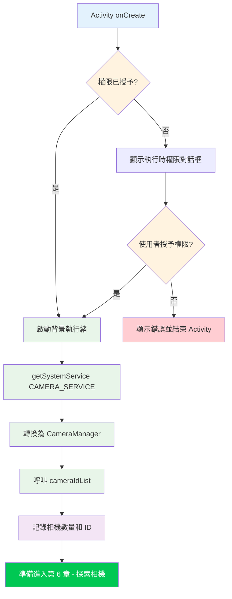

歡迎來到 Camera2 教學系列的實作部分。在前面的章節中，你學習了手機相機硬體以及 Camera2 API 的理論基礎。現在該捲起袖子寫真正的程式碼了。到本章結束時，你將擁有一個可運作的 Android 專案，能夠成功初始化 Camera2 API 並存取 CameraManager 服務——這是你在列舉相機、開啟裝置或顯示預覽之前必須完成的關鍵第一步。

如果你想看到本系列中將建置的所有內容的正式範例，可以在 [GitHub](https://github.com/zoozooll/AndroidCameraParameters) 和 [Google Play](https://play.google.com/store/apps/details?id=com.minininja.cameraparams) 上查看 **Android Camera Parameters** 應用程式。它展示了進階 Camera2 用法，包括完整的 CameraCharacteristics 列舉、手動擷取控制以及多相機支援。

## 為什麼要從專案建置開始？

在你撰寫任何一行 Camera2 程式碼之前，應用程式必須正確設定。Camera2 是一個低階層、對效能敏感的 API，在搭建階段偷工減料會導致莫名的崩潰、ANR（Application Not Responding，應用程式無回應）或永遠無法到達的影格。一個正確的 Camera2 專案建置有三大支柱：

1. **權限** — Android 框架在安裝時（資訊清單）和執行時（使用者同意）兩個層面限制相機存取。
2. **執行緒架構** — Camera2 回呼絕不能阻塞主執行緒；我們需要一個專用的背景執行緒。
3. **View 設定** — 如果你打算使用 TextureView 進行預覽（推薦做法），必須啟用硬體加速。

讓我們系統地逐一處理。

## 第 1 步：建立新的 Android Studio 專案

啟動 Android Studio 並建立一個新專案。對於本教學系列，我們推薦：

- **範本**：Empty Activity（最簡單的起點）
- **語言**：Kotlin（Android 開發的現代標準；本系列所有範例都使用 Kotlin）
- **最低 SDK**：API 21（Lollipop）——這是原生支援 Camera2 的第一個 SDK 層級。如果你需要透過 OTG 支援外部 USB 相機，請目標 API 23 或更高。如果你需要為照片儲存提供 Scoped Storage 支援（第 9 章），則需要 API 29+，但我們會在那裡處理回溯相容性。
- **建置設定語言**：Kotlin DSL 或 Groovy——兩者都可以；我們的範例與建置系統無關。

專案生成後，開啟模組層級的 `build.gradle`（或 `build.gradle.kts`）檔案。預設的 Empty Activity 範本包含了你所需的大部分相依項目，但請確保至少有以下內容：

```kotlin
dependencies {
    implementation("androidx.core:core-ktx:1.12.0")
    implementation("androidx.appcompat:appcompat:1.6.1")
    implementation("com.google.android.material:material:1.11.0")
    implementation("androidx.constraintlayout:constraintlayout:2.1.4")
    // Camera2 是 Android 框架的一部分，因此基礎 API 不需要任何額外相依項目。
    // androidx.camera.camera2 僅用於 CameraX 互通。
}
```

:::tip
你**不需要**加入任何外部 Camera2 相依項目。整個 `android.hardware.camera2` 套件都是 Android 框架的一部分。Jetpack CameraX 程式庫是建置在 Camera2 之上的獨立高階抽象；本教學中我們**直接使用原生 Camera2 API**。
:::

## 第 2 步：在 AndroidManifest.xml 中宣告權限

每個相機應用程式都必須在 `AndroidManifest.xml` 中宣告 `CAMERA` 權限。這會告訴 Google Play 商店你的應用程式使用相機硬體，並啟用 Android 6.0（API 23）及以上的執行時權限對話框。

開啟 `app/src/main/AndroidManifest.xml`，將以下元素加入為**根 `<manifest>` 標籤的子元素**（不要放在 `<application>` 內部）：

```xml
<?xml version="1.0" encoding="utf-8"?>
<manifest xmlns:android="http://schemas.android.com/apk/res/android"
    xmlns:tools="http://schemas.android.com/tools">

    <!-- ✅ 相機權限宣告 -->
    <uses-permission android:name="android.permission.CAMERA" />

    <!-- 可選的功能宣告（用於 Google Play 過濾） -->
    <uses-feature
        android:name="android.hardware.camera"
        android:required="true" />
    <uses-feature
        android:name="android.hardware.camera.autofocus"
        android:required="false" />

    <application
        android:allowBackup="true"
        ...>
        <activity
            android:name=".MainActivity"
            android:exported="true"
            android:hardwareAccelerated="true">
            ...
        </activity>
    </application>
</manifest>
```

讓我們拆解其中重要的部分：

### `<uses-permission android:name="android.permission.CAMERA" />`

這是核心權限。沒有它，任何對相機服務的呼叫都會拋出 `SecurityException`。在 API 22 及以下，使用者在安裝時授予此權限；在 API 23+，你還必須在執行時請求（稍後講解）。

### `<uses-feature android:name="android.hardware.camera" android:required="true" />`

此宣告告訴 Google Play 將你的應用程式過濾到至少有一個相機的裝置上。如果你的應用程式可以在沒有相機的情況下運作（例如，一個可選拍攝功能的相簿應用程式），請將 `android:required="false"`。如果你完全不宣告此項，Google Play 會假設相機**不是**必需的，這可能會把你的應用程式安裝到沒有相機的裝置上。

### `<activity>` 上的 `android:hardwareAccelerated="true"`

這對 TextureView 預覽渲染**至關重要**。TextureView 使用 GPU 合成管線來高效顯示相機影格。如果在 Activity 或 Application 層級未啟用硬體加速，TextureView 會靜默無法渲染或顯示黑屏。現代 Android 中整個應用程式的預設值是 `true`，但在任何承載 TextureView 的 Activity 上明確宣告是一個良好的實踐。

## 第 3 步：執行時權限請求

在 Android 6.0（Marshmallow，API 23）及更高版本中，在資訊清單中宣告權限只是事情的一半。你還必須使用 Activity Compat 程式庫在執行時**明確向使用者請求權限**。標準模式是：

1. 用 `ContextCompat.checkSelfPermission` 檢查權限是否已授予。
2. 如果已授予，繼續相機初始化。
3. 如果未授予，呼叫 `ActivityCompat.requestPermissions` 顯示系統對話框。
4. 在 `onRequestPermissionsResult` 中處理結果。

下面是 `MainActivity.kt` 中完整的權限流程：

```kotlin
package com.example.camera2tutorial

import android.Manifest
import android.content.pm.PackageManager
import android.os.Bundle
import android.widget.Toast
import androidx.appcompat.app.AppCompatActivity
import androidx.core.app.ActivityCompat
import androidx.core.content.ContextCompat

class MainActivity : AppCompatActivity() {

    override fun onCreate(savedInstanceState: Bundle?) {
        super.onCreate(savedInstanceState)
        setContentView(R.layout.activity_main)

        if (allPermissionsGranted()) {
            initializeCamera()
        } else {
            ActivityCompat.requestPermissions(
                this,
                REQUIRED_PERMISSIONS,
                REQUEST_CODE_PERMISSIONS
            )
        }
    }

    private fun allPermissionsGranted() = REQUIRED_PERMISSIONS.all {
        ContextCompat.checkSelfPermission(baseContext, it) == PackageManager.PERMISSION_GRANTED
    }

    override fun onRequestPermissionsResult(
        requestCode: Int,
        permissions: Array<out String>,
        grantResults: IntArray
    ) {
        super.onRequestPermissionsResult(requestCode, permissions, grantResults)
        if (requestCode == REQUEST_CODE_PERMISSIONS) {
            if (allPermissionsGranted()) {
                initializeCamera()
            } else {
                Toast.makeText(
                    this,
                    "需要相機權限才能使用此應用程式。",
                    Toast.LENGTH_LONG
                ).show()
                finish()
            }
        }
    }

    private fun initializeCamera() {
        // TODO: 我們將在下面的章節中實作此方法。
        // CameraManager 的設定將在這裡進行。
        // 目前，僅記錄成功。
        android.util.Log.d(TAG, "Permissions granted. Ready to initialize camera.")
    }

    companion object {
        private const val TAG = "Camera2Tutorial"
        private const val REQUEST_CODE_PERMISSIONS = 10
        private val REQUIRED_PERMISSIONS = arrayOf(Manifest.permission.CAMERA)
    }
}
```

### 為什麼 `allPermissionsGranted()` 使用陣列模式

雖然我們目前只需要 `CAMERA` 權限，但定義一個 `REQUIRED_PERMISSIONS` 陣列使得日後加入額外權限變得輕而易舉（例如用於傳統照片儲存的 `WRITE_EXTERNAL_STORAGE`，或用於影片的 `RECORD_AUDIO`）。`all { ... }` 函式會檢查陣列中的**每一個**權限是否都已授予，然後才繼續。

## 第 4 步：背景執行緒（HandlerThread）

這是初學者 Camera2 程式碼中最常被遺漏的細節，它會導致**隨機、難以重現的 bug**。讓我們先理解為什麼 Camera2 需要背景執行緒，然後再正確實作它。

### 為什麼 Camera2 絕不能在主執行緒上執行

Android 主（UI）執行緒負責：
- 以 60-120 FPS 繪製 UI
- 處理使用者觸控事件
- 分發生命週期回呼
- 預設執行所有 Activity/Fragment 程式碼

Camera2 API 同步地傳遞幾個關鍵回呼：
- `CameraDevice.StateCallback` —— 當相機開啟、斷開或出錯時
- `CameraCaptureSession.StateCallback` —— 當擷取工作階段設定完成時
- `CameraCaptureSession.CaptureCallback` —— 每一影格（高達每秒 60+ 次！）

如果這些回呼在主執行緒上執行，會發生兩種災難性的事情：

1. **卡頓和掉影格**：如果處理一個回呼甚至需要 10ms，就會跳過一個 60FPS 的影格，使用者會看到卡頓。
2. **死結和 ANR**：某些 Camera2 方法（如 `close()`）是同步的並等待回呼。如果回呼必須在呼叫 `close()` 的同一執行緒上執行，就會產生死結。

解決方案是一個**專用的背景執行緒**，擁有自己的 Looper，透過 `HandlerThread` 實作。

### 正確實作 HandlerThread

背景執行緒的生命週期必須與相機操作的生命週期匹配。當 Activity 啟動/恢復時我們啟動執行緒，當 Activity 停止/暫停時我們退出執行緒。

```kotlin
package com.example.camera2tutorial

import android.Manifest
import android.content.Context
import android.content.pm.PackageManager
import android.hardware.camera2.CameraManager
import android.os.Bundle
import android.os.Handler
import android.os.HandlerThread
import android.util.Log
import android.widget.Toast
import androidx.appcompat.app.AppCompatActivity
import androidx.core.app.ActivityCompat
import androidx.core.content.ContextCompat

class MainActivity : AppCompatActivity() {

    // --- 背景執行緒元件 ---
    private lateinit var backgroundThread: HandlerThread
    private lateinit var backgroundHandler: Handler

    override fun onCreate(savedInstanceState: Bundle?) {
        super.onCreate(savedInstanceState)
        setContentView(R.layout.activity_main)

        if (allPermissionsGranted()) {
            initializeCamera()
        } else {
            ActivityCompat.requestPermissions(
                this,
                REQUIRED_PERMISSIONS,
                REQUEST_CODE_PERMISSIONS
            )
        }
    }

    override fun onResume() {
        super.onResume()
        startBackgroundThread()
        // 如果在應用程式處於背景時授予了權限，則重新初始化
        if (allPermissionsGranted() && this::cameraManager.isInitialized) {
            // (cameraManager 在下面宣告)
        }
    }

    override fun onPause() {
        stopBackgroundThread()
        super.onPause()
    }

    private fun startBackgroundThread() {
        backgroundThread = HandlerThread("Camera2Background").apply {
            start()
        }
        backgroundHandler = Handler(backgroundThread.looper)
        Log.d(TAG, "Background thread started: ${backgroundThread.name}")
    }

    private fun stopBackgroundThread() {
        backgroundThread.quitSafely()
        try {
            backgroundThread.join(1000) // 最多等待 1 秒進行清理
            Log.d(TAG, "Background thread stopped cleanly")
        } catch (e: InterruptedException) {
            Log.e(TAG, "Interrupted while joining background thread", e)
        }
    }

    // --- CameraManager 初始化 ---
    private lateinit var cameraManager: CameraManager

    private fun initializeCamera() {
        cameraManager = getSystemService(Context.CAMERA_SERVICE) as CameraManager

        val cameraIdList = cameraManager.cameraIdList
        Log.d(TAG, "Successfully accessed CameraManager. Found ${cameraIdList.size} camera(s).")
        cameraIdList.forEachIndexed { index, cameraId ->
            Log.d(TAG, "Camera $index: ID = $cameraId")
        }

        Toast.makeText(
            this,
            "CameraManager initialized! Found ${cameraIdList.size} camera(s).",
            Toast.LENGTH_LONG
        ).show()
    }

    // --- 權限處理（同上） ---
    private fun allPermissionsGranted() = REQUIRED_PERMISSIONS.all {
        ContextCompat.checkSelfPermission(baseContext, it) == PackageManager.PERMISSION_GRANTED
    }

    override fun onRequestPermissionsResult(
        requestCode: Int,
        permissions: Array<out String>,
        grantResults: IntArray
    ) {
        super.onRequestPermissionsResult(requestCode, permissions, grantResults)
        if (requestCode == REQUEST_CODE_PERMISSIONS) {
            if (allPermissionsGranted()) {
                initializeCamera()
            } else {
                Toast.makeText(
                    this,
                    "需要相機權限才能使用此應用程式。",
                    Toast.LENGTH_LONG
                ).show()
                finish()
            }
        }
    }

    companion object {
        private const val TAG = "Camera2Tutorial"
        private const val REQUEST_CODE_PERMISSIONS = 10
        private val REQUIRED_PERMISSIONS = arrayOf(Manifest.permission.CAMERA)
    }
}
```

### 關鍵執行緒模式解析

1. **`onResume()` 中的 `startBackgroundThread()`**：每次 Activity 進入前景時，我們都會建立一個全新的 `HandlerThread`，啟動它，並建立一個綁定到該執行緒 `Looper` 的 `Handler`。此 Handler 將傳遞給所有接受 Handler 的 Camera2 回呼方法（`openCamera`、`createCaptureSession` 等）。

2. **`onPause()` 中的 `stopBackgroundThread()`**：在 Activity 進入背景之前，我們在執行緒上呼叫 `quitSafely()`。這告訴 Looper 在當前訊息處理完後停止處理新訊息（與 `quit()` 不同，後者會丟棄待處理的訊息）。然後我們呼叫 `join(1000)` 最多阻塞主執行緒一秒鐘，等待背景執行緒完成清理。這可以防止資源洩漏。

3. **為什麼用 `HandlerThread` 而不是 `CoroutineDispatcher`？** Camera2 比 Kotlin Coroutines 早出現了好幾年，其回呼系統從根本上來說是基於 Handler/Looper 的。雖然你可以在高階程式碼中使用 `Dispatchers.Default.asExecutor()` 或將回呼包裝在 `suspendCoroutine` 中，但底層的 Camera2 API 仍然需要一個 Looper 執行緒來接收回呼。直接使用 `HandlerThread` 是官方 Android 範例中規範的、有文件記錄的方法。

## 第 5 步：完整的初始化流程（綜合）

現在讓我們看看應用程式啟動時必須發生的事件完整序列。順序至關重要：權限 → 執行緒 → CameraManager。如果你顛倒任何步驟，程式碼會崩潰或行為不一致。



上面的流程圖說明了為什麼每個步驟都存在：

- **權限閘道**：整個相機子系統都受到保護；在使用者授予同意之前我們無法繼續。
- **執行緒先於 CameraManager**：雖然 `getSystemService()` 本身是執行緒安全的，但我們希望在執行任何回呼驅動的 Camera2 操作（下一章開始）之前，背景執行緒已經執行。
- **CameraManager → cameraIdList**：呼叫 `cameraIdList` 是驗證 CameraManager 是否運作的最廉價方式。如果此呼叫成功且不拋出例外，那麼你的資訊清單宣告、執行時權限和服務繫結都是正確的。

## 綜合起來：執行並驗證

至此，你已經有了一個完整、可運作的 Camera2 專案，它：
1. 建立一個具有正確 SDK 目標的 Android 專案。
2. 在資訊清單中宣告 CAMERA 權限。
3. 在執行時請求權限，處理接受和拒絕兩種路徑。
4. 在 `onResume` 中啟動專用的 HandlerThread，並在 `onPause` 中乾淨地停止它。
5. 檢索 `CAMERA_SERVICE` 系統服務並將其轉換為 `CameraManager`。
6. 呼叫 `cameraIdList` 並記錄相機數量及其 ID。

### 執行時你應該看到的內容

1. 首次啟動時，Android 顯示權限對話框：*"允許 Camera2Tutorial 拍攝照片和錄製影片？"*
2. 點擊**允許**。
3. 出現一個 Toast：*"CameraManager initialized! Found X camera(s)."*
4. 在 Logcat 中（按 `Camera2Tutorial` 過濾），你應該看到類似以下條目：
   ```
   D/Camera2Tutorial: Background thread started: Camera2Background
   D/Camera2Tutorial: Successfully accessed CameraManager. Found 4 camera(s).
   D/Camera2Tutorial: Camera 0: ID = 0
   D/Camera2Tutorial: Camera 1: ID = 1
   D/Camera2Tutorial: Camera 2: ID = 2
   D/Camera2Tutorial: Camera 3: ID = 3
   ```
5. 當你按下 Home 鍵或導航離開時，Logcat 顯示：
   ```
   D/Camera2Tutorial: Background thread stopped cleanly
   ```

如果你看到這些日誌，**恭喜你**！你已經成功建置了 Camera2 應用程式的基礎。目前還沒有相機預覽——那是在第 8 章——但管線是正確的。如果你收到 `SecurityException`，請仔細檢查你是否接受了權限對話框。如果 `cameraIdList` 傳回空陣列，裝置可能沒有相機（在手機上不太可能）或權限被拒絕。

## 常見建置問題排查

### `SecurityException: Lacking privileges to access camera service`

這意味著執行時權限未被授予。檢查以下內容：
- 你在資訊清單中加入了 `<uses-permission android:name="android.permission.CAMERA" />`。
- 你使用正確的請求碼呼叫了 `ActivityCompat.requestPermissions`。
- 使用者在對話框上點擊了**允許**。
- 如果你在實體裝置上測試，請前往設定 → 應用程式 → 你的應用程式 → 權限，並確保相機已啟用。

### `backgroundHandler` 上的 `NullPointerException`

這發生在你嘗試在 `startBackgroundThread()` 執行之前使用 `backgroundHandler` 時。確保所有接受 Handler 的 Camera2 操作只在 `onResume` 被呼叫且執行緒執行後才執行。在我們的程式碼中，`initializeCamera()` 從 `onCreate` 呼叫，但它只同步使用 CameraManager；需要 `backgroundHandler` 的回呼將在後續章節中加入，並正確地閘控在 `onResume` 上。

### `TextureView` 在後續章節中顯示黑屏

如果你跳到前面並立即加入 TextureView，請確保在資訊清單中的 Activity 上設定了 `android:hardwareAccelerated="true"`。還要確保 TextureView 已附加到視圖階層並在你的版面配置 XML 中可見。

## 摘要

在本章中，你建置了 Android Camera2 應用程式的完整鷹架。你學習了：

1. **專案結構**：如何使用 Empty Activity 範本建立新的 Android Studio 專案，目標 API 21+，使用 Kotlin，並驗證不需要外部 Camera2 相依項目。
2. **資訊清單設定**：`CAMERA` 權限宣告、用於 Google Play 過濾的 `uses-feature` 標籤，以及用於 TextureView 渲染的 Activity 上的 `hardwareAccelerated="true"`。
3. **執行時權限**：使用 `ContextCompat.checkSelfPermission` 和 `ActivityCompat.requestPermissions` 的完整檢查 → 請求 → 結果循環，並處理接受和拒絕兩種路徑。
4. **背景執行緒**：為什麼 Camera2 回呼不能在主執行緒上執行，以及如何實作一個具有正確生命週期管理的 `HandlerThread` + `Handler` 對，在 `onResume` 中呼叫 `startBackgroundThread()`，在 `onPause` 中呼叫 `stopBackgroundThread()` 配合 `quitSafely()` + `join()`。
5. **CameraManager 初始化**：檢索 `CAMERA_SERVICE` 系統服務，轉換為 `CameraManager`，呼叫 `cameraIdList` 驗證服務是否運作，並記錄發現的相機 ID。

本章中的程式碼是後續所有內容的基礎。Android Camera Parameters 應用程式（[GitHub](https://github.com/zoozooll/AndroidCameraParameters)、[Google Play](https://play.google.com/store/apps/details?id=com.minininja.cameraparams)）正是使用了這些模式——針對不同的工作負載使用多個 `HandlerThread`、仔細的權限檢查以及穩健的生命週期管理。

## 接下來

既然 `CameraManager` 已成功初始化並且我們有了相機 ID 清單，下一步就是**查詢每個相機的能力**。在**第 6 章：探索相機**中，你將：

- 學習相機 ID 字串代表什麼（以及為什麼你絕不應該對它們進行硬編碼假設）。
- 使用 `LENS_FACING` 區分前置、後置和外部（USB OTG）相機。
- 查詢每個相機的硬體層級（`INFO_SUPPORTED_HARDWARE_LEVEL`）以確定它是 LEGACY、LIMITED、FULL 還是 LEVEL_3。
- 使用 `CameraCharacteristics` 遍歷裝置上的每個相機並記錄其屬性。

到第 6 章結束時，你將擁有一個可運作的相機列舉工具，可以從裝置中提取真實的 Camera2 中繼資料——你已經可以用它來比較不同手機的相機硬體了！
