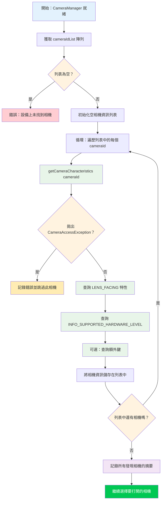

在第 5 章中，你成功初始化了 `CameraManager` 並檢索到了相機 ID 列表——但像 `"0"` 或 `"2"` 這樣的字串並沒有告訴你那個鏡頭到底**是什麼**。它是超廣角後置鏡頭嗎？是自拍鏡頭嗎？還是透過 OTG 連接的外部 USB 網路攝影機？本章將教你如何使用 `CameraCharacteristics` 來回答這些問題，它是描述相機設備每一項能力的元數據容器。

如需查看相機枚舉和特性檢查的生產級參考實現，請查看 [GitHub](https://github.com/zoozooll/AndroidCameraParameters) 或 [Google Play](https://play.google.com/store/apps/details?id=com.minininja.cameraparams) 上的 **Android Camera Parameters** 應用。它遍歷了設備上每個鏡頭的 `CameraCharacteristics` 中的每個鍵，並在一個可搜尋、可過濾的 UI 中展示結果——這正是你在偵錯特定硬體的 Camera2 問題時想要的工具。

## 理解相機 ID

在深入了解特性之前，我們需要解決新 Camera2 開發者最容易困惑的一個根本問題：**數字相機 ID 字串到底意味著什麼？**

當你呼叫 `cameraManager.cameraIdList` 時，你會得到一個 `Array<String>`——例如：`["0", "1", "2", "3", "4"]`。我們很容易**傾向於**硬編碼一些假設，例如：
- `"0"` = 後置廣角相機
- `"1"` = 前置相機
- `"2"` = 望遠相機

**永遠不要這樣做。** ID 與物理相機的映射關係是：
1. **設備特定**：Pixel 8 可能會將 ID `"1"` 用於前置相機，而三星 Galaxy S24 可能會使用 ID `"3"`。
2. **版本特定**：OEM 的 OTA 更新可能會在設備發貨後更改 ID 列表。
3. **重建特定**：一些多相機邏輯設備（在後面的第三部分章節中介紹）會根據模式動態顯示或隱藏底層的物理相機。

**唯一**正確的方法是**查詢每個 ID 的特性**，並根據你關心的屬性（鏡頭朝向、硬體層級、焦距範圍等）選擇相機。這是編寫良好的 Camera2 應用的做法，也是我們在這裡要實現的模式。

## 相機發現流程

發現相機的整體演算法表面上很簡單，但在錯誤處理方面有一些重要的邊緣情況。讓我們先透過流程圖看看這個過程，然後在程式碼中實現它。



流程圖中的關鍵點：
1. **始終處理空 ID 列表**：在手機上很少見，但在 Android TV、無螢幕設備或未設定虛擬相機的模擬器上很常見。
2. **始終將 `getCameraCharacteristics` 封裝在 try/catch 中**：相機可能會在枚舉過程中斷開連接（特別是外部 USB 相機），或者嚴格的設備策略可能會限制某些相機。
3. **完全迭代後再選擇**：先收集所有候選設備，然後根據你的標準選擇最好的一個。不要打開你發現的第一個「好」相機——你可能會錯過更好的。

## 認識 CameraCharacteristics

`CameraCharacteristics` 是一个不可變的、唯讀的鍵值對映射，描述了相機的硬體級性能。它包含數百個鍵，涵蓋了從鏡頭焦距到感光元件像素陣列尺寸，再到支援的輸出格式等所有內容。

你可以透過以下方式獲取特性對象：
```kotlin
val characteristics: CameraCharacteristics =
    cameraManager.getCameraCharacteristics(cameraId)
```

並透過通用的 `get` 方法查詢單個鍵：
```kotlin
val lensFacing: Int? = characteristics.get(CameraCharacteristics.LENS_FACING)
```

返回類型是可空的（在此例中為 `Int?`），因為某些鍵是可選的，可能並不存在於所有設備上。實際上，我們在本章查詢的鍵（`LENS_FACING` 和 `INFO_SUPPORTED_HARDWARE_LEVEL`）可以保證存在於每個有效的相機上，但進行防禦性的空處理仍然是良好的習慣。

:::note
本章特意只涵蓋了 `LENS_FACING` 和 `INFO_SUPPORTED_HARDWARE_LEVEL`。`CameraCharacteristics` 更深層的內部結構（感光元件特性、輸出配置、可用功能）是第三部分第 10 章《CameraCharacteristics 百科全書》的主題。我們現在專注於挑選相機進行打開所需的最少資訊。
:::

## 關鍵鍵 1：LENS_FACING — 前置、後置或外部

幾乎每個相機應用首先需要知道的就是鏡頭指向哪個方向。Camera2 定義了三個常量：

| 常量 | 值 | 含義 | 典型用例 |
|---|---|---|---|
| `LENS_FACING_BACK` | `0` | 相機位於設備背面，背對用戶 | 拍照、風景影片、AR |
| `LENS_FACING_FRONT` | `1` | 相機位於設備正面，面向用戶 | 自拍、視訊通話 |
| `LENS_FACING_EXTERNAL` | `2` | 相機在設備外部（例如 USB OTG 網路攝影機） | 外部配件、特種相機 |

以下是如何將原始整數轉換為人類可讀字串的方法：

```kotlin
fun lensFacingToString(facing: Int?): String = when (facing) {
    CameraCharacteristics.LENS_FACING_BACK -> "後置 (LENS_FACING_BACK)"
    CameraCharacteristics.LENS_FACING_FRONT -> "前置 (LENS_FACING_FRONT)"
    CameraCharacteristics.LENS_FACING_EXTERNAL -> "外部 / USB OTG (LENS_FACING_EXTERNAL)"
    null -> "未知 (null)"
    else -> "未知 (值=$facing)"
}
```

### 特殊情況：外部相機 (USB OTG)

`LENS_FACING_EXTERNAL` 是在 API 23 (Marshmallow) 中添加的。在打開外部相機之前，請考慮：

1. **USB 主機特性宣告**：如果你的應用專門針對外部相機，請在清單中添加 `<uses-feature android:name="android.hardware.usb.host" />`。如果應用也支持內建相機，請設定 `required="false"`。
2. **外部設備的權限**：在許多設備上，存取 USB 相機僅需要 `CAMERA` 權限。但是，某些 USB 網路攝影機晶片組需要透過 `UsbManager.requestPermission()` 進行額外的 USB 主機權限確認。如果你想在插入相機時自動偵測，請處理 `UsbManager.ACTION_USB_DEVICE_ATTACHED` 廣播。
3. **硬體層級**：外部相機幾乎總是報告 `INFO_SUPPORTED_HARDWARE_LEVEL_EXTERNAL`（見下文），這意味著它們的功能集受 USB 影片類 (UVC) 驅動程序的限制。不要指望從通用網路攝影機獲得手動控制或 RAW 輸出。

在連接了 USB 網路攝影機的手機上，`cameraIdList` 可能會返回類似 `["0", "1", "100"]` 的結果，其中 `"100"` 是動態分配的外部相機 ID。外部相機 ID 通常是較大的數字，並且在重啟或重新插拔後**不**穩定。

## 關鍵鍵 2：INFO_SUPPORTED_HARDWARE_LEVEL — 這個相機能做什麼？

硬體層級是 Camera2 中最重要的功能分類。它告訴你相機硬體和 HAL（硬體抽象層）是實現了完整的 Camera2 管線，還是在舊版 Camera API 基礎上使用了遺留相容性封裝器。共有五個值：

| 層級 | 值 | 含義 | 現實中的設備 |
|---|---|---|---|
| `LEGACY` | `2` | 遺留 HAL 模式。相機透過墊片執行在舊版 Camera API 之上。功能非常受限，無手動控制，無 RAW。 | 廉價手機、2015 年前的設備、許多模擬器 |
| `LIMITED` | `0` | 受限的 HAL3 支援。支援基礎拍攝、基礎 3A（自動曝光、自動對焦、自動白平衡），但缺少進階功能。 | 中階手機、旗艦設備上的一些前置相機 |
| `FULL` | `1` | 完整的 HAL3 支援。支援手動感光元件控制、逐幀設定、RAW 輸出、重處理。 | 旗艦手機主攝/後置、Pixel 系列主攝 |
| `LEVEL_3` | `3` | 擴充的 HAL3 支援。增加 YUV 重處理、多幀輸入、高幀率解析度配置。 | 最新的旗艦機、Pixel 6+ 主攝 |
| `EXTERNAL` | `4` | 外部相機 (USB/OTG)。功能受限，UVC 類設備。 | USB 網路攝影機、HDMI 擷取棒 |

理解這個層級結構的一个好方法是將其視為功能階梯：

```
LEGACY → LIMITED → FULL → LEVEL_3
          ↑
       EXTERNAL (針對 USB 相機的平行分支)
```

每一步都建立在前一步的基礎上：`FULL` 包含 `LIMITED` 中的所有內容，`LEVEL_3` 包含 `FULL` 中的所有內容。編寫功能檢測程式碼時，請從最高層級向下檢查——如果一个相機是 `LEVEL_3`，你自動知道它也支持 `FULL` 功能。

以下是將層級轉換為描述的輔助函式：

```kotlin
fun hardwareLevelToString(level: Int?): String = when (level) {
    CameraMetadata.INFO_SUPPORTED_HARDWARE_LEVEL_LEGACY ->
        "LEGACY (舊版 Camera API 相容模式 — 手動控制受限)"
    CameraMetadata.INFO_SUPPORTED_HARDWARE_LEVEL_LIMITED ->
        "LIMITED (基礎 HAL3 — 標準照片/影片)"
    CameraMetadata.INFO_SUPPORTED_HARDWARE_LEVEL_FULL ->
        "FULL (完整 HAL3 — 手動控制 + RAW)"
    CameraMetadata.INFO_SUPPORTED_HARDWARE_LEVEL_3 ->
        "LEVEL_3 (擴充 HAL3 — 重處理 + 多幀)"
    CameraMetadata.INFO_SUPPORTED_HARDWARE_LEVEL_EXTERNAL ->
        "EXTERNAL (USB/OTG 相機 — UVC 類)"
    null -> "未知 (null)"
    else -> "未知 (值=$level)"
}
```

:::tip
如果你想編寫僅在性能較強的硬體上執行的程式碼，請對基礎拍攝使用 `>= LIMITED`，對手動控制使用 `>= FULL`，對重處理管線使用 `>= LEVEL_3`。永遠不要假設相機是 FULL 或更高版本——務必進行檢查。Google Play 上的 **Android Camera Parameters** 應用為每個相機顯示顯眼的硬體層級徽章，以便你快速查看每台設備支持的內容。
:::

## 完整的 Kotlin 程式碼：相機發現工具

現在讓我們將所有內容合併到一个有效的實現中。我們將使用 `discoverAndLogCameras()` 方法擴充第 5 章中的 `MainActivity.kt`，該方法遍歷所有相機，查詢每個鏡頭的 `LENS_FACING` 和 `INFO_SUPPORTED_HARDWARE_LEVEL`，並將結果記錄到 Logcat。

```kotlin
package com.example.camera2tutorial

import android.Manifest
import android.content.Context
import android.content.pm.PackageManager
import android.hardware.camera2.CameraAccessException
import android.hardware.camera2.CameraCharacteristics
import android.hardware.camera2.CameraManager
import android.hardware.camera2.CameraMetadata
import android.os.Bundle
import android.os.Handler
import android.os.HandlerThread
import android.util.Log
import android.widget.Toast
import androidx.appcompat.app.AppCompatActivity
import androidx.core.app.ActivityCompat
import androidx.core.content.ContextCompat

class MainActivity : AppCompatActivity() {

    private lateinit var backgroundThread: HandlerThread
    private lateinit var backgroundHandler: Handler
    private lateinit var cameraManager: CameraManager

    override fun onCreate(savedInstanceState: Bundle?) {
        super.onCreate(savedInstanceState)
        setContentView(R.layout.activity_main)

        if (allPermissionsGranted()) {
            initializeCameraManager()
        } else {
            ActivityCompat.requestPermissions(
                this,
                REQUIRED_PERMISSIONS,
                REQUEST_CODE_PERMISSIONS
            )
        }
    }

    override fun onResume() {
        super.onResume()
        startBackgroundThread()
    }

    override fun onPause() {
        stopBackgroundThread()
        super.onPause()
    }

    private fun startBackgroundThread() {
        backgroundThread = HandlerThread("Camera2Background").apply { start() }
        backgroundHandler = Handler(backgroundThread.looper)
    }

    private fun stopBackgroundThread() {
        backgroundThread.quitSafely()
        try {
            backgroundThread.join(1000)
        } catch (e: InterruptedException) {
            Log.e(TAG, "連接背景執行緒時被中斷", e)
        }
    }

    private fun initializeCameraManager() {
        cameraManager = getSystemService(Context.CAMERA_SERVICE) as CameraManager
        discoverAndLogCameras()
    }

    // -------------------------------------------------------------------------
    // 📸 第 6 章新增內容：相機發現與特性查詢
    // -------------------------------------------------------------------------
    data class CameraInfo(
        val id: String,
        val lensFacing: Int?,
        val hardwareLevel: Int?
    ) {
        fun description(): String = buildString {
            append("相機 ID: $id | ")
            append("朝向: ${lensFacingToString(lensFacing)} | ")
            append("硬體層級: ${hardwareLevelToString(hardwareLevel)}")
        }
    }

    private fun discoverAndLogCameras() {
        val cameraIdList: Array<String> = try {
            cameraManager.cameraIdList
        } catch (e: CameraAccessException) {
            Log.e(TAG, "獲取相機 ID 列表失敗", e)
            Toast.makeText(this, "相機服務不可用", Toast.LENGTH_LONG).show()
            return
        }

        if (cameraIdList.isEmpty()) {
            Log.w(TAG, "在此設備上未找到相機")
            Toast.makeText(this, "無可用相機", Toast.LENGTH_LONG).show()
            return
        }

        val discoveredCameras = mutableListOf<CameraInfo>()
        Log.i(TAG, "═══════════════════════════════════════════")
        Log.i(TAG, "開始相機發現 (共有 ${cameraIdList.size} 個鏡頭)")
        Log.i(TAG, "═══════════════════════════════════════════")

        for ((index, cameraId) in cameraIdList.withIndex()) {
            try {
                val characteristics = cameraManager.getCameraCharacteristics(cameraId)

                val lensFacing = characteristics.get(CameraCharacteristics.LENS_FACING)
                val hardwareLevel =
                    characteristics.get(CameraCharacteristics.INFO_SUPPORTED_HARDWARE_LEVEL)

                val info = CameraInfo(cameraId, lensFacing, hardwareLevel)
                discoveredCameras.add(info)

                Log.i(TAG, "── 相機 $index ──")
                Log.i(TAG, info.description())

            } catch (e: CameraAccessException) {
                Log.e(TAG, "存取相機 $cameraId 的特性失敗", e)
            } catch (e: IllegalArgumentException) {
                Log.e(TAG, "無效的相機 ID: $cameraId", e)
            }
        }

        Log.i(TAG, "═══════════════════════════════════════════")
        Log.i(TAG, "發現完成。成功枚舉 ${discoveredCameras.size} 個鏡頭。")

        // 按朝向分組並彙總
        val byFacing = discoveredCameras.groupBy { it.lensFacing }
        Log.i(TAG, "  後置相機:    ${byFacing[CameraCharacteristics.LENS_FACING_BACK]?.size ?: 0}")
        Log.i(TAG, "  前置相機:    ${byFacing[CameraCharacteristics.LENS_FACING_FRONT]?.size ?: 0}")
        Log.i(TAG, "  外部/OTG 相機: ${byFacing[CameraCharacteristics.LENS_FACING_EXTERNAL]?.size ?: 0}")

        // 按硬體層級分組並彙總
        val byLevel = discoveredCameras.groupBy { it.hardwareLevel }
        Log.i(TAG, "  LEGACY 層級:  ${byLevel[CameraMetadata.INFO_SUPPORTED_HARDWARE_LEVEL_LEGACY]?.size ?: 0}")
        Log.i(TAG, "  LIMITED 層級: ${byLevel[CameraMetadata.INFO_SUPPORTED_HARDWARE_LEVEL_LIMITED]?.size ?: 0}")
        Log.i(TAG, "  FULL 層級:    ${byLevel[CameraMetadata.INFO_SUPPORTED_HARDWARE_LEVEL_FULL]?.size ?: 0}")
        Log.i(TAG, "  LEVEL_3 層級: ${byLevel[CameraMetadata.INFO_SUPPORTED_HARDWARE_LEVEL_3]?.size ?: 0}")
        Log.i(TAG, "  EXTERNAL 層級: ${byLevel[CameraMetadata.INFO_SUPPORTED_HARDWARE_LEVEL_EXTERNAL]?.size ?: 0}")
        Log.i(TAG, "═══════════════════════════════════════════")

        val summary = buildString {
            append("發現 ${discoveredCameras.size} 個鏡頭！\n")
            append("後置: ${byFacing[CameraCharacteristics.LENS_FACING_BACK]?.size ?: 0} • ")
            append("前置: ${byFacing[CameraCharacteristics.LENS_FACING_FRONT]?.size ?: 0} • ")
            append("外部: ${byFacing[CameraCharacteristics.LENS_FACING_EXTERNAL]?.size ?: 0}")
        }

        Toast.makeText(this, summary, Toast.LENGTH_LONG).show()

        // 儲存供後續章節使用（選擇要打開的相機）
        this.discoveredCameras = discoveredCameras
    }

    private var discoveredCameras: List<CameraInfo> = emptyList()

    // 輔助函式：獲取「預設」後置相機 ID（我們找到的第一個後置相機）
    fun getDefaultBackCameraId(): String? =
        discoveredCameras.firstOrNull {
            it.lensFacing == CameraCharacteristics.LENS_FACING_BACK
        }?.id

    // 輔助函式：獲取「預設」前置相機 ID
    fun getDefaultFrontCameraId(): String? =
        discoveredCameras.firstOrNull {
            it.lensFacing == CameraCharacteristics.LENS_FACING_FRONT
        }?.id

    companion object {
        private const val TAG = "Camera2Tutorial"
        private const val REQUEST_CODE_PERMISSIONS = 10
        private val REQUIRED_PERMISSIONS = arrayOf(Manifest.permission.CAMERA)

        fun lensFacingToString(facing: Int?): String = when (facing) {
            CameraCharacteristics.LENS_FACING_BACK -> "後置"
            CameraCharacteristics.LENS_FACING_FRONT -> "前置"
            CameraCharacteristics.LENS_FACING_EXTERNAL -> "外部/USB"
            null -> "未知(null)"
            else -> "未知($facing)"
        }

        fun hardwareLevelToString(level: Int?): String = when (level) {
            CameraMetadata.INFO_SUPPORTED_HARDWARE_LEVEL_LEGACY -> "LEGACY"
            CameraMetadata.INFO_SUPPORTED_HARDWARE_LEVEL_LIMITED -> "LIMITED"
            CameraMetadata.INFO_SUPPORTED_HARDWARE_LEVEL_FULL -> "FULL"
            CameraMetadata.INFO_SUPPORTED_HARDWARE_LEVEL_3 -> "LEVEL_3"
            CameraMetadata.INFO_SUPPORTED_HARDWARE_LEVEL_EXTERNAL -> "EXTERNAL"
            null -> "未知(null)"
            else -> "未知($level)"
        }
    }

    private fun allPermissionsGranted() = REQUIRED_PERMISSIONS.all {
        ContextCompat.checkSelfPermission(baseContext, it) == PackageManager.PERMISSION_GRANTED
    }

    override fun onRequestPermissionsResult(
        requestCode: Int,
        permissions: Array<out String>,
        grantResults: IntArray
    ) {
        super.onRequestPermissionsResult(requestCode, permissions, grantResults)
        if (requestCode == REQUEST_CODE_PERMISSIONS) {
            if (allPermissionsGranted()) {
                initializeCameraManager()
            } else {
                Toast.makeText(
                    this,
                    "需要相機權限才能使用此應用。",
                    Toast.LENGTH_LONG
                ).show()
                finish()
            }
        }
    }
}
```

### 程式碼中的關鍵模式

1. **`data class CameraInfo`**：我們不傳遞原始元組，而是將關心的屬性封裝在一個類型化的數據類別中。這使程式碼更具可讀性且易於擴充（以後只需添加 `focalLengths` 等新欄位即可，無需更改呼叫點）。

2. **循環內的 `CameraAccessException` try/catch**：如果一個相機失敗（例如，外部相機在枚舉途中被拔掉），循環仍會繼續，其餘相機仍能被發現。一个相機的失敗絕不能破壞整個枚舉過程。

3. **雙重 `groupBy` 彙總**：透過朝向和硬體層級對相機進行分組，然後對每組進行計數，可以立即了解設備相機拓撲的概況。這種模式直接取自 **Android Camera Parameters** 應用的概覽螢幕。

4. **`getDefaultBackCameraId()` 和 `getDefaultFrontCameraId()`**：這些輔助函式展示了選擇相機的正確方法——查詢特性，而不是硬編碼 ID `"0"` 或 `"1"`。我們將在第 7 章真正打開相機時使用這些輔助函式。

## 預期的 Logcat 輸出

當你在真實設備（例如具有 4 個以上鏡頭的現代旗艦機）上執行此程式時，按 `Camera2Tutorial` 過濾的 Logcat 輸出應類似於：

```
I/Camera2Tutorial: ═══════════════════════════════════════════
I/Camera2Tutorial: 開始相機發現 (共有 5 個鏡頭)
I/Camera2Tutorial: ═══════════════════════════════════════════
I/Camera2Tutorial: ── 相機 0 ──
I/Camera2Tutorial: 相機 ID: 0 | 朝向: 後置 | 硬體層級: LEVEL_3
I/Camera2Tutorial: ── 相機 1 ──
I/Camera2Tutorial: 相機 ID: 1 | 朝向: 前置 | 硬體層級: FULL
I/Camera2Tutorial: ── 相機 2 ──
I/Camera2Tutorial: 相機 ID: 2 | 朝向: 後置 | 硬體層級: LIMITED
I/Camera2Tutorial: ── 相機 3 ──
I/Camera2Tutorial: 相機 ID: 3 | 朝向: 後置 | 硬體層級: LIMITED
I/Camera2Tutorial: ── 相機 4 ──
I/Camera2Tutorial: 相機 ID: 4 | 朝向: 後置 | 硬體層級: LIMITED
I/Camera2Tutorial: ═══════════════════════════════════════════
I/Camera2Tutorial: 發現完成。成功枚舉 5 個鏡頭。
I/Camera2Tutorial:   後置相機:    4
I/Camera2Tutorial:   前置相機:    1
I/Camera2Tutorial:   外部/OTG 相機: 0
I/Camera2Tutorial:   LEGACY 層級:  0
I/Camera2Tutorial:   LIMITED 層級: 3
I/Camera2Tutorial:   FULL 層級:    1
I/Camera2Tutorial:   LEVEL_3 層級: 1
I/Camera2Tutorial:   EXTERNAL 層級: 0
I/Camera2Tutorial: ═══════════════════════════════════════════
```

在此範例輸出中：
- **相機 0** (LEVEL_3, 後置)：主廣角後置鏡頭，畫質最高的拍攝者。
- **相機 1** (FULL, 前置)：前置自拍鏡頭，FULL 層級，支援手動控制。
- **相機 2, 3, 4** (LIMITED, 後置)：超廣角、望遠，以及可能的深度或微距感測器——均為 LIMITED 層級，意味著它們支援基礎拍攝但不具備完整的手動控制能力（即使在旗艦機上，輔助後置鏡頭也極其常見這種情況）。

## 相機發現問題排查

### 在模擬器上 `cameraIdList` 返回空陣列

大多數 Android 模擬器都帶有模擬的後置和前置相機，但必須在 AVD (Android Virtual Device) 設定中啟用。打開 AVD 管理員，編輯你的虛擬設備，轉到 **Advanced Settings**，並將 **Back camera** 和 **Front camera** 設定為 `Emulated`（使用主機的網路攝影機）或 `VirtualScene`（渲染虛構的 3D 場景）。然後冷啟動模擬器。

### 本應具有 FULL 支援的手機上所有相機都報告為 LEGACY

這發生在兩種場景下：
1. **你使用的是帶有舊相機 HAL 的自定義 ROM 或 root 設備**：OEM 没有實現 HAL3，因此即使感光元件硬體有能力，也使用了相容性墊片。
2. **你使用的是工作資料或受管理設備**：一些 MDM（行動設備管理）策略會限制相機功能，相機服務可能會向工作資料中的應用報告降級的層級。

安裝 **Android Camera Parameters** 應用進行交叉參考。如果該應用也顯示 LEGACY，則是設備級的限制，而不是你程式碼中的 bug。

### 外部 USB 相機未出現在列表中

首先，驗證你的 USB OTG 轉接器是否工作：插上 USB 滑鼠，看它是否能移動游標。如果硬體工作正常，請驗證：
- 設備執行的是 API 23+（Marshmallow 中增加了外部相機支援）。
- 網路攝影機符合 USB 影片類 (UVC) 標準。大多數消費級網路攝影機都符合，但特殊的工業相機可能需要自定義驅動程序。
- 某些設備在電池電量低於一定水平時會禁用 USB 主機模式。給設備充電後再試。

## 小結

在本章中，你將無意義的相機 ID 字串陣列轉化為了關於設備相機硬體的可操作資訊。你學習了：

1. **相機 ID 語意**：為什麼永遠不應硬編碼關於 ID 與相機映射的假設，以及 ID 如何隨設備、OTA 和重啟而變化。
2. **CameraCharacteristics 基礎**：如何透過 `cameraManager.getCameraCharacteristics(cameraId)` 獲取特性對象，並使用通用的 `get` 方法查詢單個鍵。
3. **LENS_FACING**：三種可能的鏡頭方向（`LENS_FACING_BACK`、`LENS_FACING_FRONT`、`LENS_FACING_EXTERNAL`），並深入探討了 USB OTG 外部相機的要求（USB 主機特性、動態 ID、UVC 限制）。
4. **INFO_SUPPORTED_HARDWARE_LEVEL**：五級功能階梯（LEGACY → LIMITED → FULL → LEVEL_3，外加針對 USB 相機的 EXTERNAL），每一級在功能支援方面的保證，以及如何根據所需的最低層級編寫功能門控程式碼。
5. **穩健的相機發現**：完整的 `discoverAndLogCameras()` 實現，包含針對每個鏡頭的 try/catch、`CameraInfo` 數據類別、人類可讀的描述字串、按朝向和硬體層級的彙總摘要，以及選擇預設後置/前置相機的輔助函式。

你現在已經讓真實的 Camera2 元數據在你的應用中流動。這是一个重要的里程碑——你在這裡編寫的枚舉程式碼可以在你以後建構的每一个 Camera2 專案中重複使用。

## 下一章

選定相機後（透過 `getDefaultBackCameraId()`），是時候真正啟動它並與硬體對話了。在**第 7 章：打開相機**中，你將：

- 學習 `CameraDevice` 代表什麼（與物理相機的活動、已打開的連接）。
- 實現 `CameraDevice.StateCallback`，包含針對 `onOpened`、`onDisconnected` 和 `onError` 的處理程式。
- 理解同步 `onPause` 和 `onResume` 的打開、重新打開和關閉相機的生命週期規則。
- 處理每一个常見的 `CameraAccessException` 錯誤代碼：`CAMERA_IN_USE`、`MAX_CAMERAS_IN_USE`、`CAMERA_DISABLED` 和 `CAMERA_ERROR`。
- 使用 `Semaphore` 防止並行打開操作，並使用 `tryAcquire` 逾時以確保死鎖安全。

到第 7 章結束時，你的程式碼將持有一个活動的、已打開的 `CameraDevice` 對象——這是建立擷取工作階段並最終顯示相機預覽的前提。
