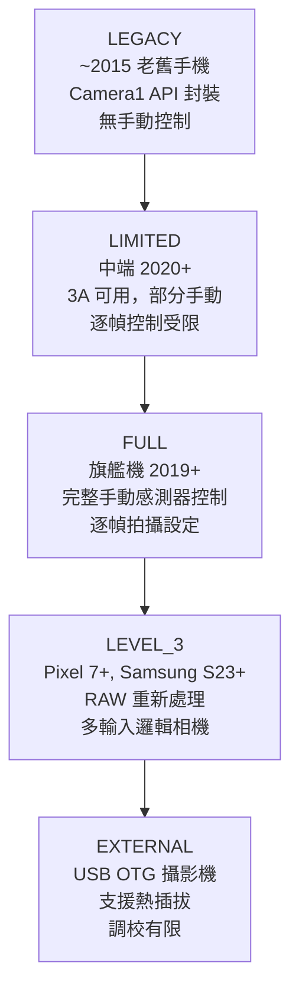
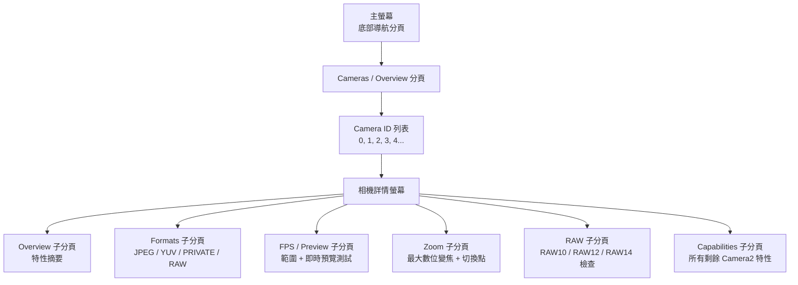

# 第 4 章：探索你自己的手機

這裡是你的應用變得重要的地方。第 2 章和第 3 章讓你對相機硬體和現代計算攝影特性有了理論上的理解。本章是動手實踐且針對特定裝置的。你將在自己的手機上安裝 **Android Camera Parameters** 配套應用，啟動它，並系統地檢查你的硬體能做什麼和不能做什麼——並在過程中記錄答案。

你在本章發現的資訊並非學術趣聞。Camera2 API 以按裝置、按相機的方式暴露能力。某個在你個人 Pixel 10 上完美工作的特性，可能會在 2023 年中端三星 A 系列上靜默失敗（或退化為無操作，甚至更糟，崩潰），因為該裝置的 HAL 根本沒有實現所需能力。在本系列第 II 部分編寫任何一行 Camera2 API 程式碼之前，你必須知道自己測試裝置的能力。

在本章結束時，你將為你的特定手機記錄下：完整的 Camera ID 列表及其朝向和硬體級別；每個相機支援的輸出格式；最大 JPEG 解析度；最高慢動作 FPS 範圍；最大數位變焦以及實體相機變焦切換閾值；以及你的主相機是否支援 RAW 輸出。

## 安裝 Android Camera Parameters 應用

提供兩種安裝選項。選擇你喜歡的任意一種。

### 選項 A — 從原始碼建構

如果你是一名 Android 開發者並且已經安裝了 Android Studio，此選項讓你能夠瀏覽配套應用的原始碼（見本章最後一節），甚至修改它以檢查你感興趣的其他 Camera2 特性。

1. 複製 GitHub 儲存庫：
   `https://github.com/zoozooll/AndroidCameraParameters`
2. 在 Android Studio Iguana (2023.2.1) 或更新版本中開啟專案。Gradle 同步將自動完成；該專案目標為 Android SDK 34 (Android 14)，`minSdkVersion` 為 21 (Android 5.0 Lollipop)，因此基本上可以在你可能擁有的任何手機上執行。
3. 在手機上啟用 USB 偵錯。前往 **設定 → 關於手機 → 版本號碼**，連續點擊版本號碼條目 7 次。將出現一個提示「您現在處於開發者模式」。返回主設定介面，進入 **開發者選項**，並開啟 **USB 偵錯**。
4. 透過 USB-C 線纜將手機連接到電腦。在手機上，接受「允許來自此電腦的 USB 偵錯嗎？」提示，並勾選「永遠允許來自此電腦」以避免日後再次出現該對話框。
5. 從 Android Studio 頂部的下拉選單中選擇 **app** Run Configuration（預設的 Run Configuration 通常名為 `app`）。確保已連接的手機作為目標裝置出現在裝置下拉選單中。
6. 點擊綠色的 **Run** 按鈕（三角形播放圖示）或按 **Shift + F10**。Android Studio 將編譯應用，透過 ADB 將 APK 安裝到你的手機上，並自動啟動它。

### 選項 B — 從 Google Play 安裝

如果你只是想執行應用而不編譯它，或者想在多個終端使用者裝置上測試其行為而無需為每台裝置配置 ADB，請使用 Play Store 版本。

在 Android 手機上開啟 Google Play Store 並造訪：

`https://play.google.com/store/apps/details?id=com.minininja.cameraparams`

點擊 **Install**。該應用是免費的，不包含廣告、沒有應用內購買，也沒有追蹤器。它只需要 `CAMERA` 權限（用於查詢相機特性並開啟預覽 Surface）和可選的 `RECORD_AUDIO` 權限（在目前建構中從未使用，但為將來的影片錄製測試 Activity 保留）。`ACCESS_FINE_LOCATION` 權限是可選的，僅當你想在預覽分頁中為範例拍攝打上 GPS 元資料標記時才會請求。

安裝完成後啟動應用。首次啟動時，在系統權限對話框出現時授予 **Camera** 權限。沒有此權限應用將無法工作，因為 Android 的安全模型要求即使是 *查詢* 相機特性也需要執行時權限授予——如果沒有授予 `CAMERA` 權限，你甚至無法列舉 Camera ID。

## Camera ID

查看應用主螢幕。底部第一個（也是預設的）分頁標記為 **Cameras**（根據你執行的建構變體，有時稱為 **Overview**）。此分頁頂部的標題為 **All Camera IDs**。

Android 裝置上的每一個獨立相機——每一個後置相機、前置相機、任何邏輯多相機融合裝置，以及任何外部 USB OTG 攝影機——都被分配一個唯一的字串識別碼，稱為 **Camera ID**。Camera ID 幾乎總是簡單的十進位整數：`"0"`、`"1"`、`"2"`、`"3"`，在相機較多的裝置上有時會有 `"4"`、`"5"`。在少數裝置上（某些外部攝影機和模擬器的假相機），你可能會看到類似 `"camera@0"` 或 `"0@external"` 的 Camera ID，但純整數是迄今為止最常見的格式。

All Camera IDs 列表中的每一行顯示三條資訊，從左到右：

1. Camera ID 號本身，顯示為一個大號加粗的晶片。
2. **LENS_FACING** 方向：`BACK`（後置相機，背向螢幕）、`FRONT`（自拍相機，朝向使用者）或 `EXTERNAL`（USB 攝影機 / OTG 相機）之一。
3. 該相機的 **Hardware Level**：一個彩色晶片，顯示 `LEGACY`、`LIMITED`、`FULL`、`LEVEL_3` 或 `EXTERNAL`。這直接對應到本系列第 1 章描述的 Camera2 API 的 `INFO_SUPPORTED_HARDWARE_LEVEL` 特性。

作為一個具體範例，Galaxy S26 Ultra 通常報告 **5 個 Camera ID**：

- **ID 0**：BACK（後置廣角 / 主 24mm 相機），Hardware Level = **FULL**
- **ID 1**：FRONT（自拍相機），Hardware Level = **LIMITED**
- **ID 2**：BACK（後置超廣角 0.5× 相機），Hardware Level = **FULL**
- **ID 3**：BACK（後置 5× 潛望長焦相機），Hardware Level = **FULL**
- **ID 4**：BACK（邏輯多相機 ID，代表 ID 0 + 2 + 3 的融合組合，由 HAL 管理以實現無縫變焦），Hardware Level = **FULL**

中端手機（例如 Samsung A54 5G）可能只報告 3 個 Camera ID：後置廣角、後置超廣角和前置。2016 年代的入門手機可能只報告 2 個：後置和前置。

**針對你裝置的任務：** 記錄下你的手機報告的完整 Camera ID 列表。對於每個 ID，記錄其 LENS_FACING（Back / Front / External）及其 Hardware Level 晶片顏色/標籤。統計相機總數。如果你看到某個 Camera ID 的用途不明顯（例如，一個額外的後置 ID，與手機背面任何明顯的鏡頭凸起都不對應），請留意——這些通常是 ToF 深度感測器、微距相機或邏輯多相機融合裝置。

## Hardware Levels

本系列第 1 章介紹了五個 Camera2 Hardware Level，按能力從低到高排序：**LEGACY → LIMITED → FULL → LEVEL_3 → EXTERNAL**。本節回顧該層次結構，然後要求你使用應用檢查每個相機的級別。

每個級別都新增了能力和更嚴格的效能保證：

- **LEGACY**：Camera2 API 作為已棄用的 `android.hardware.Camera` (Camera1) API 之上的薄薄一層封裝實現。幾乎沒有功能能可靠工作——沒有手動曝光，沒有逐幀控制，沒有 RAW 支援。在 2026 年你可以安全地忽略 LEGACY 裝置；基本上沒有仍在使用的手機還報告此級別。
- **LIMITED**：中端手機和所有層級手機前置相機最常見的 Hardware Level。3A（自動曝光、自動對焦、自動白平衡）演算法執行正確，基本 YUV 和 JPEG 輸出可用，但大多數手動感測器控制不可用（在 AE 下限以下沒有手動快門速度，沒有手動增益控制，逐幀拍攝設定更新延遲不快於 3-5 幀）。
- **FULL**：旗艦機的黃金標準級別。每個 Camera2 API 特性都保證可用：對每個獨立幀的感測器曝光時間和類比增益的完整手動控制，保證幀率被尊重，以 30+ fps 進行每幀不同設定的連拍，YUV 重新處理，基本 DNG RAW 輸出。如果你手機上的主後置相機報告 FULL，你可以實現本教程系列中的每個特性。
- **LEVEL_3**：最高級別，於 2022/2023 年隨 Pixel 7 和 Samsung S23 系列引入。新增了保證的 RAW 重新處理輸入流（你可以將先前拍攝的 DNG 饋送回 ISP 並以不同的色調對應或顏色矩陣重新執行流水線）、多解析度 YUV 輸出流，以及保證的邏輯多相機融合支援。
- **EXTERNAL**：用於透過 USB-C 插入的 USB OTG 攝影機和 HDMI 擷取卡。API 介面相同，但不存在工廠校準資料（沒有 OTP 儲存的鏡頭陰影圖，沒有按模組的顏色校正矩陣），因此 EXTERNAL 相機的質量參差不齊。

**如何在應用中檢查：** 點擊列表中任何 Camera ID 旁邊的 **Hardware Level** 晶片。將彈出一個底部表單對話框，顯示該相機的完整 `INFO_SUPPORTED_HARDWARE_LEVEL` 描述，以及一個項目符號列表，列出在該級別保證（或不保證）的關鍵特性。

**針對你裝置的任務：** 對於你的主後置相機（通常是 ID 0），確認它報告的 Hardware Level。對於你的前置相機，確認其級別。然後問自己這個問題，並在繼續閱讀之前思考答案：**為什麼前置相機幾乎普遍報告 LIMITED 而不是 FULL？**

答案是前置相機通常是成本較低、較簡單的感測器。3A 演算法在它們上面執行可靠（畢竟自拍需要自動曝光和自動白平衡才能產生可接受的輸出），但手動感測器控制對自拍來說不是產品優先級。沒有人願意為 13MP 自拍相機上的手動 1/1000s 快門速度付額外費用。因此，HAL 廠商針對自拍使用情境最佳化其 LIMITED 級別實現，從不進行通過 FULL 級別 Camera2 CTS（相容性測試套件）測試所需的額外測試和驗證。

## 可用相機：朝向

Android 為 `LENS_FACING` 相機特性定義了三個可能的值。應用在 Cameras 分頁頂部提供了一個過濾器切換欄，用於在它們之間切換：**All · Back · Front · External**。

- **BACK**：手機背面的相機，背向螢幕。任何後置超廣角、廣角、長焦、潛望、微距或 ToF 感測器都報告 `LENS_FACING_BACK`。這是你的應用在 90% 的情況下會使用的相機。
- **FRONT**：自拍相機，當螢幕朝向使用者時指向使用者。請注意，前置相機的預覽影像通常會被預設相機應用水平鏡像（左右翻轉）以匹配使用者在鏡子中看到的样子，但寫入 JPEG 檔案的實際像素資料不會被鏡像，除非你的應用明確這樣做。
- **EXTERNAL**：透過 USB-C 連接的 USB OTG 攝影機、USB 內視鏡、USB HDMI 擷取卡或其他熱插拔視訊輸入裝置。Camera2 API 最被低估的特性之一是 EXTERNAL 相機透過 *與內部相機完全相同的程式碼路徑* 暴露。只要手機的 USB-C 連接埠在主機模式下支援 USB Video Class (UVC) gadget 模式，編寫良好的 Camera2 應用將自動列舉並使用 USB 攝影機，無需任何 USB 專用程式碼。

**針對你裝置的任務：** 使用過濾器切換在 Back、Front 和 External 之間切換。統計每個類別中有多少相機。你的手機現在是否列出了任何 EXTERNAL 相機？幾乎可以肯定沒有——除非你插入了 USB 攝影機。如果你碰巧擁有 USB 攝影機或 USB 內視鏡，現在透過 USB-C OTG 轉接器將其插入手機，並點擊應用右上角選單中的 **Refresh** 按鈕。你應該會看到一個新的 Camera ID 出現，其 LENS_FACING = EXTERNAL。開啟該外部相機的 Preview 分頁——如果一切正常，你將看到來自攝影機的即時預覽，使用的是 30 秒前開啟內部後置相機完全相同的 Camera2 API 程式碼路徑。

## 支援的輸出格式

每個 Camera2 相機裝置都公布一個支援的 **輸出格式** 列表，並且對於每種格式，列出支援解析度/尺寸對的列表。Camera2 API 將拒絕任何嘗試目標相機未公布的格式/尺寸組合的拍攝請求。

應用在相機詳情螢幕中暴露此資訊。要到達那裡，在 Cameras 分頁中點擊任何 Camera ID 行。你將進入一個詳情螢幕，其中有多個可滑動的子分頁：**Overview · Formats · FPS · Zoom · RAW · Capabilities**。滑動（或點擊分頁欄）到 **Formats** 分頁。

Android SDK 中有數十個可能的 `ImageFormat` 常數，但這 **5 種格式** 佔了真實世界 Camera2 應用使用量的 99%。應用在 Formats 分頁頂部列出它們，並附有通俗語言描述：

1. **JPEG**：你透過電子郵件傳送、發布到社群媒體或透過訊息分享的普通處理過的照片。8-bit YCbCr 4:2:0 顏色，ISP 處理過（應用了第 2 章的全部 8 個階段），有損 DCT 壓縮。檔案大小較小。這是預設和最常見的靜態拍攝輸出。
2. **YUV_420_888**：用於裝置上處理的通用未壓縮格式。8-bit Y（亮度）平面加上 8-bit Cb 和 Cr（色度）平面，水平方向 2:1 下取樣。用於人臉偵測、QR 碼掃描、條碼掃描、機器學習推論（TensorFlow Lite、PyTorch Mobile）、重新編碼為 JPEG 之前的自訂影像處理，以及作為 MediaCodec 視訊編碼器的輸入用於影片錄製。
3. **PRIVATE**：專用於高速預覽到顯示的不透明零拷貝格式。實際像素布局是廠商專有且對應用隱藏的（因此稱為「private」）。PRIVATE Surface（通常是 `SurfaceView`、`TextureView` 或帶 `PRIV` 使用標誌的 `ImageReader`）跳過所有 CPU 可存取的拷貝，直接從 ISP 輸出到顯示合成器。這是唯一能保證在現代旗艦機上實現 60 fps 或 120 fps 全解析度預覽的格式。
4. **RAW_SENSOR**：在任何 ISP 階段執行之前直接來自感測器的未處理 Bayer 馬賽克資料。位深因感測器而異：RAW10（每樣本 10 位）、RAW12（12 位）或 RAW14（14 位）。寫入 DNG（Digital Negative）檔案，用於在 Adobe Lightroom、Capture One 或 Darktable 中進行桌面後期處理。只有 Hardware Level FULL 或更高級別的相機才支援 RAW 輸出；LIMITED 和 LEGACY 相機從不支援。
5. **JPEG_R**：Ultra HDR 格式，在 Android 14 中引入。一個標準 8-bit JPEG 主影像（與每個檢視器向後相容）加上一個內嵌的 10-bit 增益圖，支援 HDR 的檢視器（Android 14 系統相簿、Chrome 120+、Adobe Lightroom 7+、Apple iOS 18 照片）可以在 HDR10 或 Dolby Vision 顯示器上重建完整的 10-bit HDR 亮度範圍。只有 2023+ 旗艦手機支援 JPEG_R 輸出。

**針對你裝置的任務：** 在應用中點擊你的主後置相機（ID 0），滑動到 **Formats** 分頁。應用顯示該相機支援的每種輸出格式，並在每種格式下，列出從最大（頂部）到最小（底部）排序的每個支援的解析度。記錄下：

- 上面列出的 5 種格式（JPEG、YUV_420_888、PRIVATE、RAW_SENSOR、JPEG_R）中，你的主相機存在哪些？
- **最大 JPEG 解析度**是多少？這幾乎總是接近（但不一定完全等於）感測器的有效陣列像素尺寸。一個 48MP 感測器可能會列出 8000×6000（48MP 全解析度）、4000×3000（12MP 合併）、1920×1080（2MP）和 1280×720（1MP）作為 JPEG 尺寸。
- 是否存在 RAW_SENSOR？如果是，注意你的手機支援 DNG RAW 拍攝；我們將在第 18 章使用此能力。
- 是否存在 JPEG_R (Ultra HDR)？這告訴你你的裝置 ISP 是否能夠輸出增益圖 HDR 靜態照片。

對你的前置相機以及（如果存在）超廣角和長焦後置相機重複此練習。

## FPS（每秒幀數）範圍

在相機詳情螢幕滑動到 **FPS / Preview** 分頁。Camera2 API 不會將相機的「最大 FPS」作為單個數字報告。相反，每個相機報告一個 **FPS 範圍** 列表，每個範圍寫為 `[minimum_fps, maximum_fps]`。相機 HAL 保證，如果你的應用使用該 FPS 範圍配置工作階段，感測器的自動曝光演算法將選擇一個曝光時間，使實際幀率保持在這兩個界限之間。

你在現代手機上會看到的典型條目：

- `[15, 30]`：普通自適應預覽。在非常黑暗的場景中曝光時間變長時，AE 演算法可以自由地將幀率降到 15 fps。這是幾乎所有靜態相機預覽使用情境的預設值。
- `[30, 30]`：固定 30 fps。AE 永遠不會超過 1/30 秒的曝光時間；如果場景太暗，則改為提升類比增益。用於標準 30 fps 影片錄製。
- `[60, 60]`：固定 60 fps。用於遊戲相機使用情境或 60 fps 影片錄製的流暢預覽。要求感測器具有足夠快的滾動讀出以維持每秒 60 個完整幀。
- `[120, 120]`：固定 120 fps，用於 4× 慢動作影片拍攝。通常僅在降低解析度（1080p 或更低）時可用。
- `[240, 240]`：固定 240 fps，用於 8× 慢動作影片。幾乎總是僅在 720p 解析度下可用。
- `[960, 960]`：固定 960 fps，用於 32× 超慢動作。極其罕見；只有少數 Sony Xperia 和頂級 Samsung Galaxy 旗艦支援此功能，且僅在 720p 下進行非常短（0.2-0.3 秒）的預錄製連拍。

應用在可滾動列表中顯示每個支援的 FPS 範圍。列表下方是一個預覽測試卡：點擊 **Start 60fps Preview Test**，應用將開啟一個固定 60fps 的預覽流，並在角落顯示一個執行的 FPS 計數器，以便你可以驗證 60fps 在你的裝置上是否真正可實現。

**針對你裝置的任務：** 對於你的主後置相機，記錄下支援的 FPS 範圍完整列表。回答這些問題：

- 是否存在 `[60, 60]`？你的手機支援流暢的 60fps 預覽。
- 是否存在 `[120, 120]`？你的手機支援 4× 慢動作。
- 是否存在 `[240, 240]`？你的手機支援 8× 慢動作。
- 是否存在 `[960, 960]`？如果是，你的手機是頂級旗艦——享受超慢動作吧！

現在比較你的前置相機的列表。前置相機的 FPS 列表幾乎總是更短：它很少有 240fps 或 960fps 條目，有時甚至缺少 60fps。

## 變焦範圍和相機切換點

在相機詳情螢幕滑動到 **Zoom** 分頁。此分頁暴露相機的變焦能力。

你將看到的第一個數字標記為 **SCALER_AVAILABLE_MAX_DIGITAL_ZOOM**。這是一個浮點值，如 `10.0` 或 `20.0` 或 `100.0`，代表 HAL 為此相機支援的 *數位* 變焦最大比率。值 10.0 意味著你可以裁剪感測器像素中心 1/10（線性地——寬度的 1/10 和高度的 1/10 = 總像素數的 1%），仍能獲得有效的輸出流。請注意，超過約 2× 的數位變焦會產生明顯柔和、像素化的輸出；三星旗艦上的行銷「100× Space Zoom」是 10× 光學（潛望）× 10× 數位，在 100× 時影像基本上只是感測器像素的 1% 經過 AI 銳化放大。

對於 **邏輯多相機裝置**（例如，Galaxy S26 Ultra Camera ID 4，融合了廣角、超廣角和潛望長焦），Zoom 分頁還顯示 **光學變焦比率** 和 HAL 管理的相機切換點的圖表。以下是 Galaxy S26 Ultra 的代表性範例：

- **0.5×**：活動相機 = 超廣角（ID 2）。低於 0.7× 時，輸出 100% 來自超廣角感測器。
- **0.7× → 0.9×**：融合區。HAL 同時拍攝超廣角和廣角相機，對齊它們，並交叉淡入淡出輸出。使用者看不到跳躍。
- **1.0×（預設）**：活動相機 = 廣角 / 主相機（ID 0）。這是 80% 日常照片使用的相機。
- **1.1× → 2.9×**：廣角感測器的數位裁剪。隨著變焦增加，質量逐漸下降。
- **2.9× → 3.1×**：融合區。HAL 從數位裁剪的廣角交叉淡入淡出到原生 3× 潛望長焦感測器。
- **3.0×**：活動相機 = 3× 長焦（如果存在），或潛望裁剪的起點。
- **5.0× → 9.9×**：5× 潛望感測器（ID 3）的數位裁剪。
- **10.0×**：原生 10× 潛望輸出（如果潛望支援）。
- **10.1× → 30.0×**：10× 潛望輸出的數位裁剪。在 30× 時，你看到的是原始感測器區域的 1/900 放大——行銷上令人印象深刻，但對大多數用途來說在攝影上沒有用處。

應用對此有一個互動式測試。返回相機詳情螢幕的 **Preview** 分頁。你將看到一個即時相機預覽和螢幕底部的變焦比率滑桿。

**針對你裝置的任務：** 在 Preview Surface 上執行緩慢、穩定的捏合變焦手勢，或將變焦滑桿從其最小（左側）平滑拖動到最大（右側）位置。觀察變焦比率數字標籤。當你經過特定閾值（0.5×、1.0×、3.0×、5.0×、10.0×）時，你會注意到預覽影像在視野、清晰度以及有時色調上短暫「跳躍」——這些跳躍是 HAL 在邏輯多相機裝置後面切換活動實體相機。記錄下你觀察到的變焦切換點。這些特定閾值是作為 Camera2 API 開發者的你，如果想要最大影像質量而不是 HAL 管理的數位裁剪時，將在各個獨立實體相機 ID 之間切換拍攝請求的比率。

## RAW 支援

返回 **Formats** 分頁。在分頁欄右上角是一個過濾器切換：**All / Processed / RAW**。點擊 **RAW** 將格式列表過濾為僅 RAW 格式。

如果此相機支援 RAW_SENSOR，應用將列出所有可用的 RAW 變體。2026 年 Android 上最常見的 RAW 位深：

- **RAW10**：每樣本 10 位。在中端手機和旗艦機的超廣角/長焦相機上最常見。每個 Bayer 通道 1,024 個不同級別。
- **RAW12**：每樣本 12 位。旗艦機主廣角相機的預設值。每通道 4,096 個級別。出色的編輯空間。
- **RAW14**：每樣本 14 位。非常罕見；僅在專業級手機上，如 Sony Xperia Pro-I 或 Xiaomi 13 Ultra 的 1 英吋感測器。每通道 16,384 個級別。匹配許多 APS-C DSLR 的編輯寬容度。
- **RAW_SENSOR**：對應到裝置預設 RAW 位深的通用權杖。你總是可以請求 `RAW_SENSOR` 格式，HAL 會為你替換適當的位深變體。

從 `RAW_SENSOR` 流輸出的 DNG 檔案還內嵌了按模組的工廠校準資料：顏色濾波陣列圖案、將感測器原生 RGB 對應到 D65 光源 XYZ 的顏色矩陣、中性色點、每通道的黑電平和每通道的白電平。所有這些元資料都是桌面 RAW 編輯器解釋原本無法解釋的 Bayer 馬賽克資料所必需的。

**針對你裝置的任務：** 你的主後置相機是否存在 RAW_SENSOR？如果是，列出了哪些位深變體？記錄下答案。在本系列的第 18 章，你將學習如何開啟 RAW 輸出流、拍攝 DNG 檔案，並將其以正確的 EXIF 和元資料寫入你的應用儲存。如果不支援 RAW（對於前置相機和中端 LIMITED 裝置很常見），那麼在你自己的 Camera2 應用中將無法在該相機上進行 RAW 拍攝，你應該設計你的應用以在能力缺失時優雅地隱藏「Shoot RAW」 UI 選項。

## 原始碼

**Android Camera Parameters** 配套應用是 100% 開源的。GitHub 儲存庫位於：

`https://github.com/zoozooll/AndroidCameraParameters`

如果你選擇了選項 A 並從原始碼建構了應用，你已經在機器上有了程式碼。如果你從 Google Play 安裝，你可以隨時複製儲存庫以查看應用如何查詢你剛檢查的每個值。瀏覽原始碼，你會發現：

- 應用如何使用 `CameraManager.getCameraIdList()` 列舉所有 Camera ID。
- 它如何讀取 `CameraCharacteristics.LENS_FACING` 和 `INFO_SUPPORTED_HARDWARE_LEVEL` 來填充主 Cameras 分頁上的晶片。
- 它如何查詢 `SCALER_STREAM_CONFIGURATION_MAP` 來列舉每個支援的格式和解析度，以及如何為 Formats 和 RAW 分頁過濾結果列表。
- 它如何讀取 `CONTROL_AE_AVAILABLE_TARGET_FPS_RANGES` 來構建 FPS 範圍列表。
- 它如何查詢 `SCALER_AVAILABLE_MAX_DIGITAL_ZOOM` 和 `SCALER_AVAILABLE_ZOOM_RATIOS` 來構建變焦切換點圖表和互動式預覽變焦滑桿。

應用顯示的每個值都是從你自己的 Camera2 API 程式碼從第 5 章開始將查詢的同一個 `CameraCharacteristics` 映射中讀取的。配套應用實際上是本教程系列第 II 部分前幾章的視覺化參考實現。

## 總結

在這個動手章節中，你將自己的 Android 手機上安裝了 Android Camera Parameters 配套應用（透過從 GitHub 原始碼 `https://github.com/zoozooll/AndroidCameraParameters` 編譯，或從 Google Play 安裝 `https://play.google.com/store/apps/details?id=com.minininja.cameraparams`）。你列舉了裝置上的每個 Camera ID，並記錄了每個的 LENS_FACING（Back / Front / External）及其 Hardware Level（LEGACY → LIMITED → FULL → LEVEL_3 → EXTERNAL），並了解了為什麼前置相機幾乎總是報告 LIMITED 而不是 FULL。你使用朝向過濾器查看 Back、Front 和 External 相機的細分，並且（如果你手邊有 USB 攝影機）驗證了 Camera2 API 透過與內部相機完全相同的程式碼路徑列舉 USB OTG 相機。你檢查了每個相機支援的輸出格式（JPEG、YUV_420_888、PRIVATE、RAW_SENSOR、JPEG_R Ultra HDR），並記錄了最大 JPEG 解析度以及是否支援 RAW 和 Ultra HDR。你列舉了每個相機的 FPS 範圍，並了解了你的手機可以拍攝哪些慢動作速度。你探索了變焦滑桿，並確定了在捏合變焦期間活動實體相機變化的 HAL 管理切換點。最後，你確認了你的主相機是否支援 RAW_SENSOR 輸出以及以何種位深，並被邀請瀏覽配套應用的開源程式碼，以確切了解這些值如何從 Camera2 API 讀取。

## 下一步

本系列的第 I 部分現已完成。你有了硬體基礎（第 2 章）、計算攝影特性詞彙（第 3 章）以及你自己手機的特定裝置能力圖（第 4 章）。第 II 部分從第 5 章開始，包含你的第一段 Camera2 API 程式碼：開啟 `CameraManager`、以程式設計方式列舉 `CameraCharacteristics`、開啟 `CameraDevice`、建立 `CaptureSession`，並向 `TextureView` 發出你的第一個重複預覽請求——一個用 100 行 Kotlin 從頭編寫的螢幕上即時相機預覽。
