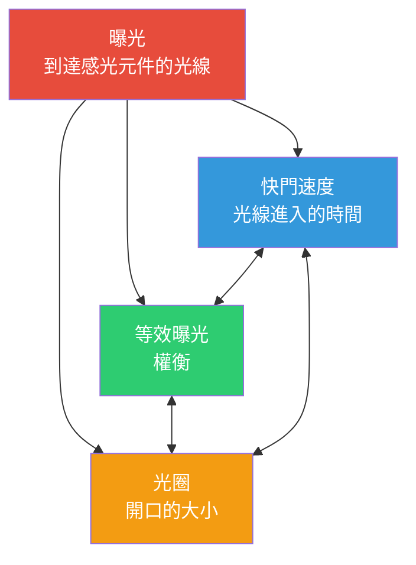

# 第 13 章：曝光

## 曝光三角：三個旋鈕，一個目標

當你用智慧型手機拍照時，你實際上是在捕捉光線。到達感光元件的光線**量**決定了你的照片是太暗（欠曝）、太亮（過曝）還是恰到好處（曝光正確）。三個基本控制項管理著這一點——它們共同構成了**曝光三角**。



**核心思想：** 三角形的每個角都控制光線，但每個角也都會引入一種*創意權衡*。你可以透過三個設定的不同組合實現*相同* 的總曝光量——但每種組合都會為你的照片帶來不同的*觀感*。

在我們在下一章深入探討 Android Camera2 API 的細節之前，讓我們先為每個元素建立穩固的直觀基礎。

---

## ISO：感光元件靈敏度（增益控制）

在底片時代，**ISO** 描述的是*底片對光線的敏感度*——ISO 100 底片較「慢」，需要明亮的光線，而 ISO 800 底片較「快」，可以在室內拍攝。

**在數位攝影（包括智慧型手機相機）中，ISO 是感光元件增益 / 電子放大。** 當你將 ISO 值加倍時，你實際上是將應用於感光元件類比訊號的放大倍數加倍，然後再將其數位化。

### ISO 的工作原理

想像感光元件的像素井正在收集光子（光粒子）。在曝光期結束後：

1. 每個像素將累積的光子轉換為微小的電荷
2. **類比增益放大器**將該訊號乘以與你的 ISO 設定相對應的係數
3. 放大後的訊號被轉換為數位訊號 (ADC)
4. 數位處理隨後進行進一步處理（降噪、色調映射）

**ISO 100 = 基礎 / 最低增益。** 訊號放大倍數最低，因此：
- 照片*乾淨*，數位噪聲（噪點）最少
- 動態範圍（可記錄的最亮和最暗色調之間的差異）最高
- 色彩最準確

**ISO 3200 = 高增益。** 訊號被放大 32 倍：
- 你可以在更暗的場景中拍攝，而無需增加快門時間
- 但你會得到*可見的噪聲*（彩色斑點、亮度噪點）
- 動態範圍和色彩準確度顯著下降

### 典型智慧型手機 ISO 範圍

| ISO 範圍 | 特徵 | 用例 |
|-----------|---------------|----------|
| 50–200 | 基礎 ISO，影像最乾淨 | 明亮的日光，影棚照明 |
| 200–800 | 中等增益，輕微噪聲 | 陰天，背陰處 |
| 800–3200 | 可見噪聲，仍可用 | 室內照明，黃昏 |
| 3200–12800+ | 重度噪聲 / 應用重度降噪 | 夜景，暗光活動 |

> **智慧型手機現實註記：** 旗艦手機通常在較高的 ISO 值下應用重度計算降噪（供應商特定的「夜間模式」處理）。當你稍後在 Camera2 中禁用自動管線時，你將*失去*許多這些 OEM 優化——這是我們將在第 14 章回歸的一個關鍵警告。

---

## 快門速度（曝光時間）

**快門速度**簡單來說就是*感光元件暴露在光線下的時間長短*。在傳統相機中，機械快門會物理性地開啟和關閉。在智慧型手機中，它幾乎總是**電子快門**——感光元件被重置，允許收集光線一段時間（精確時長），然後讀取數據。

快門速度以**秒**為單位，通常表示為分數：

| 快門速度 | 它的作用 | 典型用途 |
|--------------|-------------|-------------|
| 1/2000s – 1/1000s | 極短曝光，凍結所有動作 | 運動、鳥類、快速行駛的車輛 |
| 1/500s – 1/250s | 凍結典型的人類動作 | 走動的人、玩耍的孩子 |
| 1/125s – 1/60s | 配合防手震的「安全」手持速度 | 穩健手持拍攝的一般攝影 |
| 1/30s – 1/15s | 可見輕微運動模糊，需要三腳架 | 創意動態，弱光 |
| 1s – 30s | 長曝光，重度運動模糊 | 瀑布、星軌、滑順的水面 |
| 30s+ | 超長曝光（專業） | 天文攝影、光繪 |

### 運動模糊效果

除了「獲得足夠光線」之外，有兩個理由讓你刻意選擇特定的快門速度：

1. **凍結動作：** 以 1/1000s 拍攝飛行中的鳥，每一根羽毛都清晰可見，因為鳥在曝光期間移動的距離幾乎為零。

2. **創造運動模糊：** 以 2 秒拍攝瀑布，移動的水流會呈現出平滑、滑順的白色痕跡——因為在感光元件曝光期間，每一滴水都經過了感光元件上的許多像素。

把它想像成一種長曝光繪畫：*任何在快門開啟期間移動的東西都會變成條紋。*

**對於影片很重要：** 拍攝 30fps 影片時，每一幀的曝光時間*最多*約為 1/30s。電影製作人遵循 **180° 快門法則**：將快門速度設定為幀率的兩倍 → 對於 30fps 影片，設定為 1/60s。這能提供自然的、「電影感」的運動模糊，既不會太生硬也不會太模糊。

---

## 光圈

**光圈**是鏡頭內部光線通過的開口大小。它以 **f 值** (f-stops) 來衡量 (f/1.4, f/2.0, f/2.8, f/4.0, f/5.6, f/8.0 等) —— 這是一個*反直覺的刻度，數字越小 = 開口越寬*。

```
  f/1.4     f/2.0     f/2.8     f/4.0     f/5.6     f/8.0
█████████████████████████████████████████████████████████
█████████████████                              █████████
███████████████                                  ███████
█████████████                                    ██████
████████████                                      █████
███████████                                      ██████
```

**每檔光線減半：** 從 f/1.4 → f/2.0 → f/2.8 → f/4.0 移動，每一步都會使開口面積*減半*，因此通過的總光線減少一半。這就是每步減暗一「檔」。

### 光圈權衡（創意與實踐）

1. **景深 (DoF)：** 大光圈 (f/1.8) = *淺*景深 —— 只有窄窄的一層平面在焦點內；之前/之後的任何東西都會模糊（虛化/焦外）。小光圈 (f/8) = *深*景深 —— 從前景到背景的一切都是清晰的。

2. **集光能力：** f/1.4 比 f/2.8 多收集 4 倍的光線。這就是為什麼「大光圈鏡頭」（寬最大光圈）在弱光拍攝中備受青睞的原因。

3. **繞射：** 在極小的光圈 (f/11+) 下，光波會繞過光圈葉片彎曲，使影像略微變軟。這在智慧型手機上通常無關緊要。

### 智慧型手機現狀檢查

大多數智慧型手機擁有**固定光圈鏡頭** —— 你無法更改 f 值。廉價手機可能是 f/2.4–f/2.8；旗艦機通常達到 f/1.4–f/1.8。[Android Camera Parameters 應用](https://play.google.com/store/apps/details?id=com.minininja.cameraparams)讓你可以在 `CameraCharacteristics` 中檢查鏡頭的固定光圈。

少數高階手機（例如三星 Galaxy S23 Ultra、索尼 Xperia 系列）提供*雙光圈*機制，可以在兩個檔位（例如 f/1.5 和 f/2.4）之間機械切換。在 Camera2 中，查詢 `LENS_INFO_AVAILABLE_APERTURES` 看看你的設備是否支援多種光圈。

**實踐啟示：** 對於大多數 Android Camera2 開發，光圈是*固定的*，因此你僅透過 **ISO + 快門速度**控制曝光。兩個旋鈕而不是三個 —— 這實際上簡化了事情！

---

## EV：曝光值（對數刻度）

當攝影師說「調整一檔」時，他們的意思是**將總光量加倍或減半**。為了使基於「檔」的思維更加精確，行業標準化了**曝光值 (EV)**。

**EV 0** 被定義為產生標準參考亮度的曝光組合：**1 秒曝光，f/1.0 光圈，ISO 100**。

每 **+1 EV 將光量加倍**（更亮）。每 **−1 EV 將光量減半**（更暗）：

| EV 變化 | 含義 |
|-----------|---------|
| +3 EV | 8 倍光量 (2³) |
| +2 EV | 4 倍光量 |
| +1 EV | 2 倍光量 |
| 0 EV | 參考：1s @ f/1.0 ISO 100 |
| −1 EV | ½ 光量 |
| −2 EV | ¼ 光量 |
| −3 EV | ⅛ 光量 |

美妙之處在於：**任何總和為相同 EV 值的 ISO + 快門 + 光圈組合，都會產生相同的總曝光量**。這就是連接三角形三個角的*等效曝光*原則。

### EV 與 ISO/快門組合

在固定光圈的情況下，EV 方程式大大簡化。對於光圈為 f/1.8 的智慧型手機：

| 場景 | 典型 EV | ISO 100 快門 | ISO 400 快門 | ISO 1600 快門 |
|-------|-----------|----------------|-----------------|------------------|
| 明亮的陽光沙灘 | 15 | 1/4000s | 1/1000s | 1/250s |
| 陰天 / 多雲 | 12 | 1/500s | 1/125s | 1/30s |
| 明亮的室內辦公室 | 8 | 1/30s | 1/8s | 1/2s |
| 夜間的起居室 | 4 | 2s | 0.5s | 1/8s |
| 星空夜景 | −2 | 30s | 8s | 2s |

### 著名的陽光 16 法則

在矩陣測光和複雜的自動曝光演算法出現之前，攝影師依靠一種經驗法則，在沒有測光錶的情況下鎖定日光下的曝光：

> **在晴天，將光圈設定為 f/16，快門速度設定為 1/ISO 秒。**

| 陽光 16 (f/16) | f/1.8 等效 (智慧型手機) |
|-----------------|----------------------------------|
| ISO 100, 1/100s, f/16 → EV 15 | ISO 100, 1/4000s, f/1.8 → EV 15 ✓ |
| ISO 200, 1/200s, f/16 → EV 15 | ISO 200, 1/8000s, f/1.8 → EV 15 ✓ |

計算結果吻合：f/1.8 比 f/16 寬約 **6⅓ 檔**。每一檔加倍？不 —— 每一檔*光線面積*加倍。2^(6.33) ≈ 80 倍光量。因此快門速度必須快 80 倍來補償：1/100s ÷ 80 ≈ 1/8000s (在 ISO 200 下)。對於實地拍攝來說足夠接近了。

---

## 欠曝 / 正確 / 過曝的觀感

讓我們心理對比一下同一場景（例如，一個人在戶外，身後是天空）的三種拍攝效果：

**欠曝 (−2 EV)：** 主體太暗。陰影被*壓死*成純黑，沒有細節。在直方圖中，所有數據都堆積在左側（暗部）。天空看起來可能不錯，但人看起來像個剪影。你*可以*嘗試在後期處理中「提亮」欠曝的原始數據，但陰影會露出嚴重的噪聲，因為你在放大一個微弱的訊號。

**曝光正確 (0 EV)：** 中間調顯示出正常的質感。人的臉上有可見的皮膚細節、衣服褶皺、眼睛高光。直方圖數據分佈在整個範圍內，兩端沒有硬剪裁。在動態範圍有限的手機上，這可能意味著*一些*明亮的天空高光會剪裁成白色（沒有藍色細節） —— 這是一個相對於讓主體欠曝的經典權衡。

**過曝 (+2 EV)：** 高光*溢出*成純白，無法恢復。天空是一個均勻的白色平面；明亮的襯衫鈕扣和鏡面反射被剪裁。人的皮膚看起來可能很討喜（很亮），但你永久失去了所有高光細節。不像欠曝的陰影（你通常可以用噪聲來部分恢復），*溢出的高光永遠消失了* —— 那些像素中根本沒有數據。

**攝影師的信條：** *寧欠勿過 (Expose for the highlights, recover the shadows)。* 在 RAW 拍攝中（我們稍後會介紹），這一點尤為強大，因為 14 位 RAW 儲存了足夠的陰影細節，可以拉升 +2 EV 或更多而不會產生毀滅性的噪聲。

---

## 現實世界 EV 參考表

記住幾個里程碑式的 EV 值可以讓你在任何地方估算曝光：

| 場景 | 典型 EV (在 ISO 100 下) | 大致快門 @ f/1.8, ISO 400 |
|-------|------------------------|--------------------------------|
| 直射陽光下的雪景 | 16 | 1/4000s |
| 陽光沙灘，晴朗的一天 | 15 | 1/2000s |
| 典型的晴天 | 14 | 1/1000s |
| 陰天 / 多雲 | 12 | 1/250s |
| 濃雲 / 下雨 | 11 | 1/125s |
| 開闊陰影處（人在陰影中，背景被日光照亮） | 9 | 1/30s |
| 日落 / 黃金時段 | 7 | 1/8s |
| 明亮的室內辦公室 | 8 | 1/15s |
| 家中起居室，僅靠燈光 | 4 | 1/2s |
| 昏暗的餐廳內部 | 2 | 2s |
| 夜間的城市街道（霓虹燈） | 1 | 4s |
| 夜間風景，遠處的城市燈光 | −2 | 30s |
| 月光下的風景（滿月） | −3 | 1 分鐘 |
| 星空，無月亮 | −6 | 8 分鐘 |

你可以針對你手機自動曝光實際選擇的數值來驗證這些近似值。啟動 [Android Camera Parameters 應用](https://github.com/zoozooll/AndroidCameraParameters)，進入即時預覽，並觀察當你從陽光明媚處走到暗室時 `SENSOR_EXPOSURE_TIME` 和 `SENSOR_SENSITIVITY` 的變化 —— 你會看到映射到此表的真實數值。

---

## 綜合：等效曝光

假設你想要*相同的總曝光量* (EV 12 = 陰天，f/1.8 智慧型手機)。以下是產生相同感光元件亮度的三個有效組合：

| 組合 | ISO | 快門速度 | 觀感與質感 |
|-------------|-----|---------------|-------------|
| 乾淨且銳利 | 100 | 1/500s | 噪聲最少，對動作的凍結最清晰 |
| 折衷方案 | 400 | 1/125s | 輕微噪聲，良好的平衡 |
| 平滑運動 | 1600 | 1/30s | 可見噪聲；移動主體會有輕微模糊 |

三者都落在相同的 EV。三者*看起來同樣亮*。但*質感*（噪聲噪點）和*運動刻畫*是完全不同的。**這就是曝光的藝術。**

### 如果我兩者都需要呢？

這就是計算攝影大放異彩的地方。手機處於「夜間模式」時不是拍攝*一張* 2 秒的照片 —— 它擷取了*幾十張* 1/60s 的幀（在每一張中凍結動作），然後透過計算進行對齊和平均。結果在大約獲得長曝光集光能力的同時，沒有運動模糊的懲罰。

一旦你理解了 Camera2 層級的手動曝光，你就可以自己實現類似的技术。

---

## 小結

在本章中，我們涵蓋了*攝影基礎知識*，而沒有觸及任何一行 Android 程式碼：

- **曝光三角：** 快門速度（時間）、ISO（感光元件增益）和光圈（開口大小）結合起來控制總光量。每一個都有創意權衡。
- **數位攝影中的 ISO** = 類比感光元件增益。低 ISO = 乾淨，高 ISO = 噪點。智慧型手機通常支援帶有 OEM 降噪的 ISO 100–6400+。
- **快門速度** 是曝光時間（秒）。快速快門 (1/1000s) 凍結動作；慢速快門 (1s+) 創造運動模糊。180° 快門法則適用於影片。
- **光圈** 是由 f 值控制的鏡頭開口。大多數智慧型手機光圈固定，因此我們僅依靠 ISO + 快門。
- **EV (曝光值)** 是對數檔位刻度，每個 ±1 步長使光量加倍/減半。EV 0 = 1s @ f/1.0 ISO 100。
- **陽光 16 法則** 和 EV 參考表讓你無需測光即可估算曝光。
- **正確曝光** 平衡了中間調細節，避免壓死陰影和溢出高光。RAW 保留了恢復空間。

## 下一章

在**第 14 章：Camera2 中的手動曝光**中，我們將把這套概念模型轉換為具體的 Camera2 API 呼叫。你將學習：

- 如何禁用自動曝光管線 (`CONTROL_MODE = OFF`, `CONTROL_AE_MODE = OFF`)
- 如何將 ISO 值映射到 `SENSOR_SENSITIVITY`
- 如何在人類可讀的秒 ↔ 納秒之間轉換 `SENSOR_EXPOSURE_TIME`
- 完整的 Kotlin 程式碼，用於固定間隔拍攝曝光、夜間長曝光和 3 張連拍的曝光包圍序列
- 關於關閉 3A 時 OEM 降噪會被禁用的關鍵警告

準備好你的思考帽 —— 程式碼部分馬上開始。
