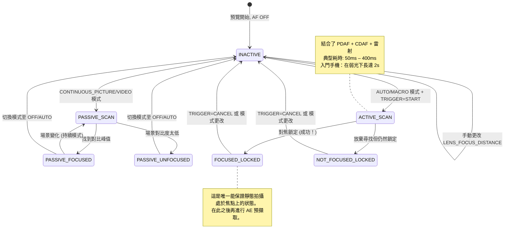

# 第 15 章：對焦

曝光控制亮度。**對焦則控制清晰度。** 曝光完美但對焦模糊的照片是一張廢片。在本章中，你將學習智慧型手機對焦系統的工作原理，如何透過 Camera2 可靠地驅動自動對焦 (AF)，以及如何使用 `LENS_FOCUS_DISTANCE` 實現滑順的手動對焦滑塊。

**Android Camera Parameters** 應用在「對焦」面板中演示了所有這些內容——你可以即時觀察 AF 狀態機的轉換，並拖動手動對焦滑塊觀察鏡頭從無窮遠推向最近對焦距離。

---

## 現代智慧型手機中的自動對焦 (AF)

在深入探討 API 細節之前，讓我們先了解智慧型手機使用的三種物理對焦機制。

### 1. 對比偵測對焦 (CDAF) — 被動掃描

軟體技術：分析影像幀，尋找最大邊緣對比度（邊緣清晰 = 空間頻率最高），並移動鏡頭直到找到對比峰值。

- **優點：** 適用於任何相機硬體（無需特殊像素）
- **缺點：** 慢。鏡頭必須在整個對焦範圍內來回*拉風箱 (hunt)*。Camera2 狀態映射中的 "AF SCANNING" 等標記即對應於此。

### 2. 相位偵測對焦 (PDAF) — 主動掃描

感光元件上的特殊光電二極體被一分為二。左右兩半之間的相位差可以直接測量鏡頭必須移動的*距離和方向*——無需拉風箱。現在的旗艦手機使用全像素雙核對焦 (Dual-Pixel PDAF)，其中*每一個*像素都參與相位偵測。

- **優點：** 極快（在光線充足的情況下 < 100ms 鎖定）；在影片中表現可靠
- **缺點：** 在弱光下表現吃力（光子不足以可靠計算相位），且有最近對焦距離限制

### 3. 雷射對焦 / ToF 對焦 (主動) — 測距儀

一個專用的硬體模組發射紅外線雷射脈衝，計時反射，並直接向 ISP 報告主體距離。在中高階手機上非常常見。

- **優點：** 在任何目標上都能實現極速鎖定，即使在全黑環境下也是如此（只要目標反射紅外線）
- **缺點：** 有效範圍有限（最大約 50cm–5m），在玻璃或紅外線透明物體上會失效

真實的手機結合了**這三者**：PDAF 用於快速粗調，CDAF 用於精調，雷射對焦用於弱光或近距離場景。Camera2 將這個統一的管線暴露為一個單一的抽象狀態機。

---

## AF 模式：CONTROL_AF_MODE

Camera2 在 `CameraMetadata` 中定義了以下 AF 模式：

| 模式 (CONTROL_AF_MODE_*) | 行為 | 用例 |
|-------------------------|----------|----------|
| `OFF` | 完全沒有 AF。你手動設定 `LENS_FOCUS_DISTANCE`。 | 手動對焦、景深合成、天文攝影（鎖定無窮遠） |
| `AUTO` | 單次 AF。在發送 `CONTROL_AF_TRIGGER = START` 之前不做任何操作，然後掃描一次並鎖定。 | 經典的傻瓜式靜態攝影 |
| `MACRO` | 與 AUTO 相同，但偏向於近距離主體偵測。 | 近攝、文件掃描、「美食模式」 |
| `CONTINUOUS_PICTURE` | 持續重新對焦，但**在觸發靜態拍攝時會暫停重新對焦**，以避免在拍攝瞬間焦點發生偏移。 | 靜態攝影預設值 |
| `CONTINUOUS_VIDEO` | 持續重新對焦——從不暫停。可能會有可見的拉風箱過程，但能保持影片清晰。 | 影片錄製、視訊聊天 |
| `EDOF` | 增強型景深 (Extended Depth of Field)：軟體/韌體模擬的深焦。無物理鏡頭移動。 | 無移動鏡頭執行器的廉價設備 |

**兩個關鍵注意點：**

1. `EDOF` 設備（廉價手機、前置自拍鏡頭）具有*固定*的焦平面。你永遠不會從它們那裡得到 `FOCUSED_LOCKED` 狀態——你最多只能得到 `PASSIVE_SCAN` → `PASSIVE_FOCUSED` → `INACTIVE`。**Android Camera Parameters** 應用會針對這些相機顯式顯示 "Fixed Focus (固定對焦)"。

2. `CONTINUOUS_*` 模式在空閒後會返回 `INACTIVE`，而不是保持鎖定。不要在持續模式下期待 `FOCUSED_LOCKED` —— 那僅適用於 `AUTO`/`MACRO` 配合顯式觸發的情況。

---

## AF 狀態機

Camera2 透過 `CaptureResult.CONTROL_AF_STATE` 報告 AF 狀態。理解這些狀態對於實現可靠的靜態擷取序列至關重要。



狀態參考表：

| CONTROL_AF_STATE | 含義 | 下一步操作 |
|------------------|---------|-------------|
| `INACTIVE` (0) | AF 已關閉、空閒或持續模式目前未掃描 | 若處於 AUTO 模式：發送 TRIGGER_START |
| `PASSIVE_SCAN` (1) | 持續模式正在進行被動掃描 | 等待；暫不觸發靜態擷取 |
| `PASSIVE_FOCUSED` (2) | 持續模式找到焦點，但未鎖定（可能漂移） | 在 CONTINUOUS_PICTURE 模式下可以安全觸發拍攝（會自動鎖定） |
| `ACTIVE_SCAN` (3) | 顯式觸發啟動了一次掃描 | 只能等待... |
| `NOT_FOCUSED_LOCKED` (4) | 未能找到焦點，但鏡頭仍被鎖定 | 提示用戶；可選重試或照常拍攝 |
| `FOCUSED_LOCKED` (5) | **成功。** 找到焦點且硬體已鎖定。 | 立即進行 AE 預擷取觸發 |
| `PASSIVE_UNFOCUSED` (6) | 持續模式無法鎖定，仍在掃描 | 改善光照或更換目標 |

**靜態攝影不可逾越的規則：** *絕對不要*在看到 `FOCUSED_LOCKED` 之前提交靜態拍攝（尤其是使用閃光燈時！）。跳過這一步，你的應用就會間歇性地拍出模糊的照片。

---

## 對焦距離：屈光度，而非公尺

這是第二個讓 Camera2 開發者栽跟頭的「坑」（第一個是納秒級的快門）：

**`LENS_FOCUS_DISTANCE` 使用的是屈光度 (D)，而不是公尺。** 屈光度是焦距的*數學倒數*：

```
對焦距離 (公尺) = 1.0 / 屈光度
屈光度 = 1.0 / 對焦距離 (公尺)
```

| 屈光度 (LENS_FOCUS_DISTANCE) | 物理對焦距離 |
|--------------------------------|-------------------------|
| **0.0** | **無窮遠** (∞) — 星星, 遠山 |
| 0.1 | 10 公尺 |
| 0.25 | 4 公尺 |
| 0.5 | 2 公尺 |
| 1.0 | 1 公尺 |
| 2.0 | 0.5 公尺 (50 cm) |
| 5.0 | 0.2 公尺 (20 cm) |
| 10.0 | 0.1 公尺 (10 cm) |
| 20.0 | 0.05 公尺 (5 cm) |

為什麼要用屈光度？因為鏡頭執行器的移動與*光學倍率*呈線性關係，而非物理距離。從 0.0D 到 20.0D 的對焦掃描對應於均勻的鏡頭移動，而從 10m 到 5cm 的「公尺」級掃描則是高度非線性的。

### 查詢最小對焦距離

每隻鏡頭都有最近對焦距離（你不能讓鏡頭對焦在緊貼著玻璃的物體上）。查詢該值：

```kotlin
// 此鏡頭可用的最大屈光度值
val maxDiopters = characteristics.get(
    CameraCharacteristics.LENS_INFO_MINIMUM_FOCUS_DISTANCE
) ?: 0.0f // 0.0f = 固定對焦 EDOF 鏡頭 (完全沒有對焦控制！)

if (maxDiopters == 0.0f) {
    Log.w("Focus", "這是一個固定對焦鏡頭。手動 AF 已禁用。")
} else {
    // 有效的屈光度範圍是 [0.0f .. maxDiopters]
    Log.d("Focus", "對焦範圍: 0.0D (無窮遠) → $maxDiopters D (最近對焦 ${1/maxDiopters}m)")
}
```

典型數值：
- 廉價手機後置鏡頭：~10D (10 cm 最近對焦)
- 旗艦機廣角鏡頭：~15–25D (4–7 cm 最近對焦)
- 微距鏡頭：~30–50D (2–3 cm 最近對焦)
- 前置自拍鏡頭：通常為 0.0D (固定對焦, EDOF)

### 超焦距 (概念)

風景攝影師喜歡這個：將焦點設定為**超焦距**，從該距離的一半到無窮遠的所有景物都是「可以接受的清晰」。在光圈為 f/1.8 且使用標準廣角鏡頭的手機上，超焦距大約為 0.5–1.0 公尺。

**智慧型手機的經驗法則：** 將 `LENS_FOCUS_DISTANCE = 2.0D` (50 cm 對焦距離) 設為大多數廣角手機鏡頭的近似超焦距。這非常適合那些不想等待 AF 的風景和街頭攝影。

```kotlin
// 設定超焦距「全清」預設
const val HYPERFOCAL_DIOPTERS_APPROX = 2.0f

fun setHyperfocal(builder: CaptureRequest.Builder, characteristics: CameraCharacteristics) {
    val maxD = characteristics.get(
        CameraCharacteristics.LENS_INFO_MINIMUM_FOCUS_DISTANCE
    ) ?: 0.0f
    val diopters = min(HYPERFOCAL_DIOPTERS_APPROX, maxD.takeIf { it > 0 } ?: 0.0f)
    builder.set(CaptureRequest.CONTROL_AF_MODE, CameraMetadata.CONTROL_AF_MODE_OFF)
    builder.set(CaptureRequest.LENS_FOCUS_DISTANCE, diopters)
}
```

想要為你的特定鏡頭計算精確的超焦距？你還需要 `LENS_INFO_AVAILABLE_FOCAL_LENGTHS` (以 mm 為單位的焦距) 和感光元件的物理像素間距。對於 95% 的智慧型手機用例，2.0D 已經足夠接近了。

---

## 完整範例 1：單次 AF 觸發並拍攝

這是 `AUTO` / `MACRO` 模式下靜態攝影最基礎的流程。它也是第 17 章 3A 編排中將要複用的精確序列。

**目標：** 用戶點擊「拍照」 → 驅動 AF 進入鎖定對焦 → 一旦鎖定，提交靜態拍攝。

```kotlin
class AutoFocusCaptureHelper(
    private val characteristics: CameraCharacteristics,
    private val captureSession: CameraCaptureSession,
    private val previewSurface: Surface,
    private val jpegReaderSurface: Surface
) {
    private var afTriggered = false
    private var capturePlanned = false

    fun triggerAutoFocusAndCapture(onCaptureComplete: () -> Unit) {
        // ---- 第 1 步：建構帶有顯式 AF 觸發的重複請求 ----
        val triggerRequest = captureSession.device.createCaptureRequest(
            CameraDevice.TEMPLATE_PREVIEW
        ).apply {
            addTarget(previewSurface)

            // 使用 AUTO 模式以保證最終達到 LOCKED 狀態
            set(CaptureRequest.CONTROL_AF_MODE,
                CameraMetadata.CONTROL_AF_MODE_AUTO)

            // 立即發起一次性 AF 觸發
            set(CaptureRequest.CONTROL_AF_TRIGGER,
                CameraMetadata.CONTROL_AF_TRIGGER_START)
        }

        afTriggered = true
        capturePlanned = true

        // ---- 第 2 步：訂閱我們的狀態追蹤回呼 ----
        captureSession.setRepeatingRequest(
            triggerRequest.build(),
            object : CameraCaptureSession.CaptureCallback() {
                override fun onCaptureCompleted(
                    session: CameraCaptureSession,
                    request: CaptureRequest,
                    result: TotalCaptureResult
                ) {
                    val afState = result.get(CaptureResult.CONTROL_AF_STATE)
                        ?: return
                    Log.d("AF", "AF 狀態: $afState")

                    when (afState) {
                        // --- 成功路徑 ---
                        CaptureResult.CONTROL_AF_STATE_FOCUSED_LOCKED -> {
                            if (capturePlanned) {
                                capturePlanned = false
                                submitStillCapture()
                                onCaptureComplete()
                            }
                        }
                        // --- 失敗路徑：無法鎖定，但我們照常嘗試 ---
                        CaptureResult.CONTROL_AF_STATE_NOT_FOCUSED_LOCKED -> {
                            Log.w("AF", "AF 無法鎖定 — 照常拍攝 (可能會模糊)")
                            if (capturePlanned) {
                                capturePlanned = false
                                submitStillCapture()
                                onCaptureComplete()
                            }
                        }
                        // --- 正在掃描：忽略 ---
                        CaptureResult.CONTROL_AF_STATE_ACTIVE_SCAN,
                        CaptureResult.CONTROL_AF_STATE_PASSIVE_SCAN -> {
                            // 仍在工作中，暫不執行任何操作
                        }
                    }
                }
            },
            null // 在目前執行緒的處理程式上執行
        )
    }

    private fun submitStillCapture() {
        val stillRequest = captureSession.device.createCaptureRequest(
            CameraDevice.TEMPLATE_STILL_CAPTURE
        ).apply {
            addTarget(previewSurface)
            addTarget(jpegReaderSurface)

            // 為這張靜態圖保持 AF 鎖定 — 先不要釋放觸發器
            set(CaptureRequest.CONTROL_AF_MODE,
                CameraMetadata.CONTROL_AF_MODE_AUTO)
            // 保持 AF_TRIGGER 現狀 (START 狀態會保留直到我們顯式 CANCEL)

            set(CaptureRequest.JPEG_QUALITY, 95.toByte())
        }

        captureSession.capture(
            stillRequest.build(),
            object : CameraCaptureSession.CaptureCallback() {
                override fun onCaptureCompleted(
                    session: CameraCaptureSession,
                    request: CaptureRequest,
                    result: TotalCaptureResult
                ) {
                    // 照片已擷取 — 現在釋放 AF 鎖定，返回持續對焦
                    resetFocusToContinuous()
                }
            },
            null
        )
    }

    private fun resetFocusToContinuous() {
        val resumePreview = captureSession.device.createCaptureRequest(
            CameraDevice.TEMPLATE_PREVIEW
        ).apply {
            addTarget(previewSurface)
            set(CaptureRequest.CONTROL_AF_MODE,
                CameraMetadata.CONTROL_AF_MODE_CONTINUOUS_PICTURE)
            set(CaptureRequest.CONTROL_AF_TRIGGER,
                CameraMetadata.CONTROL_AF_TRIGGER_CANCEL)
        }
        afTriggered = false
        captureSession.setRepeatingRequest(resumePreview.build(), null, null)
    }
}
```

**關鍵細節：** 你必須在靜態擷取完成*之後*再取消觸發器——而不是在此之前。如果取消得太早，鏡頭會在拍攝期間解鎖，導致照片變模糊。

**逾時保障（未顯示）：** 真實的應用會在 AF 掃描上添加一个 2–3 秒的逾時。如果 `ACTIVE_SCAN` 執行 3 秒仍未達到 `FOCUSED_LOCKED`，請取消並向用戶顯示「點擊高對比度區域進行對焦」的提示。

---

## 完整範例 2：手動對焦 SeekBar 滑塊

這就是你在專業相機應用中看到的用戶級手動對焦功能。使用 SeekBar 平滑映射 0.0D → maxD 的物理對焦範圍。

### 佈局 (res/layout/fragment_manual_focus.xml)

```xml
<LinearLayout
    xmlns:android="http://schemas.android.com/apk/res/android"
    android:layout_width="match_parent"
    android:layout_height="wrap_content"
    android:orientation="vertical"
    android:padding="16dp">

    <TextView
        android:id="@+id/tvFocusLabel"
        android:layout_width="match_parent"
        android:layout_height="wrap_content"
        android:text="焦點: ∞ (無窮遠)"
        android:textSize="14sp"/>

    <SeekBar
        android:id="@+id/seekFocus"
        android:layout_width="match_parent"
        android:layout_height="wrap_content"
        android:max="1000"/>
</LinearLayout>
```

### Kotlin: Fragment / Activity 代碼連接

```kotlin
class ManualFocusController(
    private val seekBar: SeekBar,
    private val labelView: TextView,
    private val characteristics: CameraCharacteristics,
    private val captureSessionProvider: () -> CameraCaptureSession?,
    private val previewSurface: Surface
) {
    // 滑塊使用 1000 個整數步長以實現亞屈光度精度
    private val sliderSteps = 1000
    private val maxDiopters = characteristics.get(
        CameraCharacteristics.LENS_INFO_MINIMUM_FOCUS_DISTANCE
    ) ?: 0.0f

    private var currentDiopters = 0.0f

    init {
        if (maxDiopters == 0.0f) {
            seekBar.isEnabled = false
            labelView.text = "固定對焦 (不支援手動對焦)"
        } else {
            bindSeekBar()
            applyFocus(0.0f) // 從無窮遠開始
        }
    }

    private fun bindSeekBar() {
        // 轉換滑塊整數 [0..1000] ↔ 屈光度 [0.0 .. maxDiopters]
        seekBar.setOnSeekBarChangeListener(object : SeekBar.OnSeekBarChangeListener {
            private var lastUpdate = 0L

            override fun onProgressChanged(seekBar: SeekBar, progress: Int, fromUser: Boolean) {
                if (!fromUser) return

                // 節流至約 30fps (33ms) — 避免過多的請求導致 HAL 過載
                val now = SystemClock.elapsedRealtime()
                if (now - lastUpdate < 33L) return
                lastUpdate = now

                val diopters = progress.toFloat() / sliderSteps.toFloat() * maxDiopters
                applyFocus(diopters)
            }
            override fun onStartTrackingTouch(seekBar: SeekBar) {
                // 用戶開始拖動時立即切換到全手動對焦模式
                switchToManualMode()
            }
            override fun onStopTrackingTouch(seekBar: SeekBar) {
                // 應用最終的精確值以消除節流誤差
                val diopters = seekBar.progress.toFloat() / sliderSteps.toFloat() * maxDiopters
                applyFocus(diopters, force = true)
            }
        })
    }

    private fun switchToManualMode() {
        // CONTROL_AF_MODE_OFF 禁用對焦馬達自動驅動
        val session = captureSessionProvider() ?: return
        val request = session.device.createCaptureRequest(
            CameraDevice.TEMPLATE_PREVIEW
        ).apply {
            addTarget(previewSurface)
            set(CaptureRequest.CONTROL_AF_MODE, CameraMetadata.CONTROL_AF_MODE_OFF)
            set(CaptureRequest.CONTROL_MODE, CameraMetadata.CONTROL_MODE_USE_SCENE_MODE)
        }
        session.setRepeatingRequest(request.build(), null, null)
    }

    fun applyFocus(diopters: Float, force: Boolean = false) {
        currentDiopters = diopters.coerceIn(0.0f, maxDiopters)

        // 更新標籤: < 0.1D 顯示 "∞", 否則顯示 "X.Y m"
        labelView.text = when {
            currentDiopters < 0.1f -> "焦點: ∞ (無窮遠)"
            else -> {
                val meters = 1.0f / currentDiopters
                String.format("焦點: %.1f D  (%.2f m)", currentDiopters, meters)
            }
        }

        // 建構並提交帶有新對焦距離的重複請求
        val session = captureSessionProvider() ?: return
        val request = session.device.createCaptureRequest(
            CameraDevice.TEMPLATE_PREVIEW
        ).apply {
            addTarget(previewSurface)
            set(CaptureRequest.CONTROL_AF_MODE, CameraMetadata.CONTROL_AF_MODE_OFF)
            set(CaptureRequest.LENS_FOCUS_DISTANCE, currentDiopters)
        }

        // 使用 setRepeatingRequest 使每一幀預覽都遵循新的焦距
        session.setRepeatingRequest(request.build(), null, null)
    }

    // --- 預設輔助函式 ---
    fun setInfinity() { seekBar.progress = 0; applyFocus(0.0f, true) }
    fun setHyperfocalApprox() {
        val d = min(2.0f, maxDiopters)
        seekBar.progress = (d / maxDiopters * sliderSteps).toInt()
        switchToManualMode()
        applyFocus(d, true)
    }
    fun setNearest() { seekBar.progress = sliderSteps; applyFocus(maxDiopters, true) }
}
```

**關鍵實現細節：**

1. **節流 (Throttle)。** SeekBar 的 `onProgressChanged` 觸發頻率高達 200Hz。每發生一次事件都提交一次 `setRepeatingRequest` 會導致 HAL 工作過載，產生延遲。33ms 的節流將更新頻率限制在約 30fps —— 對於鏡頭馬達的物理運動速度來說這已經足夠平滑了。

2. **盡早切換至 CONTROL_AF_MODE_OFF。** 如果你處於 `CONTINUOUS_PICTURE` 模式下直接設定 `LENS_FOCUS_DISTANCE` 而不禁用 AF，AF 演算法會*反擊*你——在一幀之後就焦點彈回到它認為正確的位置。必須先在 `onStartTrackingTouch` 中進行切換。

3. **透過 `setRepeatingRequest` 更新**，而不是單次的 `capture()`。手動對焦需要應用到*每一幀*預覽中，直到用戶再次移動滑塊。

4. **鬆開時強制應用。** 節流會跳過中間位置；當用戶抬起手指時，應用滑塊的最終精確值。

---

## 對焦區域 (點擊對焦)

現代相機應用允許你*點擊取景器*來選擇對焦目標。Camera2 透過 `CONTROL_AF_REGIONS` 實現這一點——它是一個包含權重矩形的列表（在活動陣列座標系中）。

```kotlin
// 將取景器 (x,y) 點擊轉換為 CameraCharacteristics 感光元件座標區域
fun createTapFocusRegion(viewfinderWidth: Int, viewfinderHeight: Int,
                         tapX: Float, tapY: Float,
                         characteristics: CameraCharacteristics): MeteringRectangle {
    val activeArray = characteristics.get(
        CameraCharacteristics.SENSOR_INFO_ACTIVE_ARRAY_SIZE
    )!!
    // 將點擊座標在每個軸上歸一化至 [0..1]
    val nx = tapX / viewfinderWidth.toFloat()
    val ny = tapY / viewfinderHeight.toFloat()
    // 映射至感光元件活動陣列，建立一個以點擊位置為中心的 200×200 區域
    val cx = (nx * activeArray.width()).toInt()
    val cy = (ny * activeArray.height()).toInt()
    val rSize = 200
    return MeteringRectangle(
        max(0, cx - rSize/2), max(0, cy - rSize/2),
        rSize, rSize,
        MeteringRectangle.METERING_WEIGHT_MAX
    )
}

// 將區域附加至請求建構器
fun applyTapFocus(builder: CaptureRequest.Builder, region: MeteringRectangle) {
    builder.set(CaptureRequest.CONTROL_AF_REGIONS, arrayOf(region))
    builder.set(CaptureRequest.CONTROL_AE_REGIONS, arrayOf(region)) // 同時耦合 AE 測光點！
    builder.set(CaptureRequest.CONTROL_AF_TRIGGER,
        CameraMetadata.CONTROL_AF_TRIGGER_CANCEL) // 取消先前的鎖定
    builder.set(CaptureRequest.CONTROL_AF_TRIGGER,
        CameraMetadata.CONTROL_AF_TRIGGER_START)  // 在新區域觸發掃描
}
```

**專業建議：** 始終將 `CONTROL_AE_REGIONS` 與 `CONTROL_AF_REGIONS` 配對。用戶點擊人臉是因為他們希望該人臉*既*在焦點內*又*曝光正確——而不是焦點在臉上，卻針對其背後明亮的天空進行了測光。

---

## 對焦問題排查

| 症狀 | 根本原因 | 解決辦法 |
|---------|-----------|-----|
| AF 狀態永遠停留在 ACTIVE_SCAN | 低對比度場景（白牆、純淨藍天）或硬體故障 | 在約 3s 後逾時；提示用戶；回退到超焦距預設 |
| 手動對焦滑塊無效 | 忘記將 `CONTROL_AF_MODE` 設定為 OFF → AF 正在干擾你 | 在 onStartTrackingTouch 中呼叫 `switchToManualMode()` |
| 儘管顯示 FOCUSED_LOCKED，靜態拍攝仍模糊 | 在靜態擷取完成*之前*取消了 AF 觸發器 | 僅在*靜態*請求的 `onCaptureCompleted` 中執行取消 |
| 前置鏡頭忽略對焦命令 | 固定對焦 EDOF 鏡頭 (`MINIMUM_FOCUS_DISTANCE == 0`) | 優雅降級：針對該相機禁用對焦 UI |
| 影片 AF 頻繁「拉風箱」 | 錄製影片時使用了 `CONTINUOUS_PICTURE` 而非 `CONTINUOUS_VIDEO` | 在 MediaRecorder 啟動時將模式切換為 CONTINUOUS_VIDEO |

---

## 小結

Camera2 中的對焦是一個你必須顯式驅動的狀態機，而非「設定並忘掉」的參數：

- **AF 硬體：** 智慧型手機結合了對比偵測對焦、相位偵測對焦 (Dual-Pixel) 和雷射對焦，以實現快速可靠的鎖定。
- **模式：** `AUTO`（單次，鎖定）、`CONTINUOUS_PICTURE`（持續重對焦，拍攝時暫停）、`CONTINUOUS_VIDEO`（始終重對焦）、`MACRO`、`OFF`（手動）。EDOF 鏡頭沒有移動對焦件。
- **狀態：** 在進行高價值靜態拍攝前，請等待 `FOCUSED_LOCKED`（而不只是 `PASSIVE_FOCUSED`）。
- **屈光度：** `LENS_FOCUS_DISTANCE` 使用焦距的倒數 (0.0D = ∞, 10D = 10 cm)。範圍是 `[0.0 .. LENS_INFO_MINIMUM_FOCUS_DISTANCE]`。
- **單次 AF 拍攝：** `TRIGGER = START` → 等待 `FOCUSED_LOCKED` → 提交靜態拍攝 → 然後執行 `CANCEL`。
- **手動對焦滑塊：** 具有 1000 個步長的 SeekBar，節流至 30fps；必須先切換到 `AF_MODE_OFF` 模式，以免自動演算法干擾你的手動設定。
- **點擊對焦使用感光元件活動陣列座標下的 `CONTROL_AF_REGIONS`**。配合 `AE_REGIONS` 使用可獲得專業級效果。

## 下一章

亮度 ✓ 清晰度 ✓。現在讓我們來修正**色彩**。在**第 16 章：白平衡與色彩**中，我們將涵蓋：

- 自動白平衡 (AWB) 及其 7 個預設模式 (從 Incandescent 到 Shade)
- 使用 `COLOR_CORRECTION_GAINS` (4 通道 R/G/B/G) 和 `COLOR_CORRECTION_TRANSFORM` (3×3 RGB 矩陣) 進行手動色彩校正
- 色溫概念 (從 2000K 燭光到 10000K 陰影) 及其與白平衡的對應關係
- 暖色調「日落效果」預設以及全手動 AWB off 模式的 Kotlin 代碼

色彩是手動控制三部曲的最後一環。
