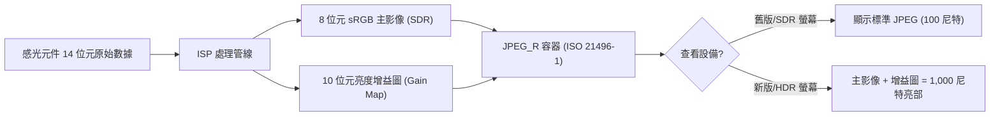

# 第 21 章：HDR 與 Ultra HDR

傳統的數位影像一直被限制在 8 位元標準動態範圍 (SDR) 內：sRGB 色彩空間、100 尼特峰值亮度以及約 6 檔的可用對比度。現代手機感光元件卻能擷取 14 檔以上的動態範圍。直到最近，這些多餘的資訊都必須在 ISP（影像訊號處理器）中透過調低高光來「擠壓」進 8 位元 JPEG。Android 13 (API 33) 透過 **DynamicRangeProfiles** 引入了原生的 10 位元 HDR 影片支援，而 Android 14 (API 34) 則引入了革命性的 **JPEG_R (Ultra HDR)** 格式用於靜態照片。透過這些 API，你的應用可以產生能在現代 1,000+ 尼特螢幕上呈現極致亮度和深邃陰影的照片和影片。

本章實現了專案研究文件中《10 位元 HDR 與 Ultra HDR》部分的規格說明，包括 HLG 相容性、HDR10 靜態元數據注入以及 JPEG_R 增益圖 (gain map) 的生命週期。你可以使用 [Android Camera Parameters](https://github.com/zoozooll/AndroidCameraParameters) 應用（[Google Play](https://play.google.com/store/apps/details?id=com.minininja.cameraparams)）即時偵測每台設備的 HDR 性能：其 HDR 儀表板列出了支援的 `DynamicRangeProfiles`（如 `HDR10`、`HDR10_PLUS`、`HLG`），並根據 Android 14 CDD 15 級性能標準驗證 JPEG_R 的合規性。

## SDR vs HDR：不僅僅是「更亮」

理解 HDR 需要區分兩個物理概念：**位元深度 (Bit Depth)** 和 **傳遞函數 (Transfer Function)**。

- **Bit Depth**：SDR 使用每通道 8 位元（256 級）。HDR 使用 10 位元（1,024 級），消除了日落或純色背景中常見的色彩斷層（banding）。
- **Transfer Function (EOTF)**：SDR 使用伽馬曲線 (Gamma 2.2)。HDR 使用 **HLG (Hybrid Log-Gamma)** 或 **PQ (Perceptual Quantizer)**。HLG 是向後相容的（在 SDR 螢幕上看起來正常）；PQ（用於 HDR10）是非向後相容的，但在 HDR 螢幕上能實現更高的對比度。

| 規格 | SDR (sRGB) | HLG | HDR10 (PQ) | Ultra HDR (JPEG_R) |
|------|------------|-----|------------|--------------------|
| **位元深度** | 8 位元 | 10 位元 | 10 位元 | 8 位元 SDR + 10 位元增益圖 |
| **色彩空間** | Rec.709 | Rec.2020 | Rec.2020 | sRGB / Display P3 |
| **峰值亮度** | 100 尼特 | 1,000+ 尼特 | 4,000+ 尼特 | 視顯示器而定 |
| **相容性** | 通用 | SDR 相容 | 需要 HDR10 解碼器 | 標準 JPEG 相容 |

## 第 1 步：查詢 10 位元 HDR 性能

要錄製 10 位元影片或預覽，相機必須在 `REQUEST_AVAILABLE_CAPABILITIES` 中宣告支援 **`DYNAMIC_RANGE_TEN_BIT`**。

```kotlin
import android.hardware.camera2.CameraCharacteristics
import android.hardware.camera2.params.DynamicRangeProfiles

fun queryHdrProfiles(chars: CameraCharacteristics) {
    val profiles: DynamicRangeProfiles? = chars.get(
        CameraCharacteristics.REQUEST_AVAILABLE_DYNAMIC_RANGE_PROFILES
    )
    
    if (profiles == null) {
        Log.d("HDR", "此設備不支援 10 位元 HDR")
        return
    }

    val supported = profiles.supportedProfiles
    Log.d("HDR", "支援的 HDR 簡況: ${supported.joinToString()}")

    // 檢查具體格式
    val hasHlg = supported.contains(DynamicRangeProfiles.HLG)
    val hasHdr10 = supported.contains(DynamicRangeProfiles.HDR10)
    val hasHdr10Plus = supported.contains(DynamicRangeProfiles.HDR10_PLUS)
}
```

:::note
**HLG** 是最通用的格式，因為它不需要複雜的元數據，且可以在大多數社交媒體應用上直接分享。**HDR10+** 需要 HAL 進行逐幀元數據產生。
:::

## 第 2 步：配置 10 位元輸出 Surface

在 Camera2 中，如果你想得到 10 位元輸出，必須在建立工作階段之前，透過 **`OutputConfiguration.setDynamicRangeProfile()`** 將該 Surface 的簡況設定為 10 位元模式。

```kotlin
import android.hardware.camera2.params.OutputConfiguration
import android.hardware.camera2.params.SessionConfiguration

fun create10BitSession(
    cameraDevice: CameraDevice,
    previewSurface: Surface,
    recordSurface: Surface,
    handler: Handler
) {
    // 1. 針對預覽 Surface 配置 10 位元
    val previewConfig = OutputConfiguration(previewSurface).apply {
        dynamicRangeProfile = DynamicRangeProfiles.HLG
    }
    
    // 2. 針對錄製 Surface 配置 10 位元
    val recordConfig = OutputConfiguration(recordSurface).apply {
        dynamicRangeProfile = DynamicRangeProfiles.HLG
    }

    val sessionConfig = SessionConfiguration(
        SessionConfiguration.SESSION_REGULAR,
        listOf(previewConfig, recordConfig),
        { runnable -> handler.post(runnable) },
        object : CameraCaptureSession.StateCallback() {
            override fun onConfigured(session: CameraCaptureSession) {
                // 此時管線將以 10 位元 Rec.2020 模式執行
                startHdrPreview(session, previewSurface)
            }
            override fun onConfigureFailed(s: CameraCaptureSession) = Unit
        }
    )

    cameraDevice.createCaptureSession(sessionConfig)
}
```

## 第 3 步：Android 14 Ultra HDR (JPEG_R)

JPEG_R 是目前行動端照片的最佳方案。它產生的是一个 **.jpg** 文件，內部包含一个標準的 8 位元 sRGB 影像（用於舊設備）和一个隱藏的 **10 位元增益圖 (Gain Map)**（用於新設備）。當在 Android 14+ 相簿中查看時，系統會根據螢幕的 HDR 性能，使用增益圖將高光部分的亮度「拉升」到極致。

### 配置 JPEG_R 擷取

這不需要特殊的工作階段，只需要一个支援該格式的 `ImageReader`：

```kotlin
import android.graphics.ImageFormat

// 檢查是否支援 JPEG_R 格式 (API 34+)
val map = characteristics.get(CameraCharacteristics.SCALER_STREAM_CONFIGURATION_MAP)
val supportsUltraHdr = map?.getOutputSizes(ImageFormat.JPEG_R)?.isNotEmpty() ?: false

if (supportsUltraHdr) {
    val ultraHdrReader = ImageReader.newInstance(
        width, height, ImageFormat.JPEG_R, 2
    )
    
    // 在擷取請求中添加目標
    val captureBuilder = cameraDevice.createCaptureRequest(
        CameraDevice.TEMPLATE_STILL_CAPTURE
    ).apply {
        addTarget(ultraHdrReader.surface)
        // JPEG_R 會自動產生增益圖，無需手動干預 ISP
    }
}
```

## JPEG_R 增益圖原理 (Mermaid)



## HDR 錄製的性能與溫控

錄製 10 位元影片會顯著增加 ISP 和記憶體控制器的負載：
- **頻寬**：10 位元數據的總位元量比 8 位元多 25%。
- **溫控**：在 4K@60 HDR 模式下，入門級手機可能會在 5-10 分鐘內觸發熱保護。
- **儲存**：必須使用 HEVC (H.265) 編碼器，因為 AVC (H.264) 在 Android 上通常不支援 10 位元簡況。

## 小結

本章涵蓋了現代 Android HDR 體系結構的兩大支柱：

- **DynamicRangeProfiles**：用於 10 位元影片，核心是 `HLG`（相容性好）和 `HDR10`（對比度高）。
- **JPEG_R (Ultra HDR)**：用於靜態照片，在標準 JPEG 中嵌入 10 位元增益圖，實現完美的高光回放。
- **配置要點**：透過 `OutputConfiguration.setDynamicRangeProfile()` 為每個輸出開啟 10 位元模式。
- **光照要求**：HDR 依賴於感光元件擷取的多餘動態範圍，在極暗環境下 HDR 效果並不明顯，但在日落、海灘等高光比場景中效果驚人。

## 下一章

在第 22 章中，我們將學習如何利用 OEM 的專有演算法：**相機擴充 (Camera Extensions)**。你將了解如何呼叫廠商內建的夜景模式 (Night)、人像模式 (Bokeh) 和 HDR 融合，這些功能通常比直接使用 `TEMPLATE_STILL_CAPTURE` 能提供更好的畫質。

你可以透過 **Android Camera Parameters** 應用驗證你手機的 HDR 設定檔支持情況，看看它是否符合 Android 14 旗艦級的 Ultra HDR 標準。
