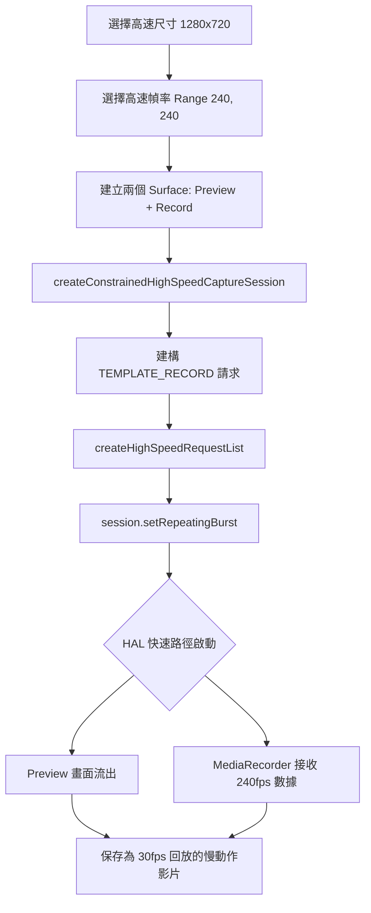

# 第 19 章：高速影片

慢動作影片一直是旗艦手機的招牌功能。它能揭示肉眼看不清的瞬間：氣球爆炸的一瞬、水滴濺起的波紋，或者是運動員飛躍的姿態。在 Android Camera2 API 中，實現 120 fps（4 倍慢動作）或 240 fps（8 倍慢動作）不僅僅是設定一個較高的幀率。它需要一種特殊的工作階段類型：**CameraConstrainedHighSpeedCaptureSession**。這種模式會解鎖硬體加速的擷取路徑，繞過標準的預覽處理，以維持極高的像素頻寬。

本章將介紹如何偵測高速影片支援、配置受限工作階段，以及最重要的——如何使用 `createHighSpeedRequestList` 滿足 HAL 的連拍要求。你可以在 **Android Camera Parameters** 應用（[GitHub](https://github.com/zoozooll/AndroidCameraParameters) / [Google Play](https://play.google.com/store/apps/details?id=com.minininja.cameraparams)）的 「High Speed」 索引標籤中查看你手機支持的所有高速尺寸和 FPS 組合。

## 為什麼高速影片需要「受限工作階段」？

在標準 `CameraCaptureSession` 中，ISP 每一幀都要處理大量的後期工作：降噪、邊緣增強、面部偵測。當你嘗試以每秒 240 幀的速度執行 1080p 畫面時，總像素量高達每秒 5 億像素。對於大多數行動 ISP 來說，在執行完整 3A 和後處理的同時維持這一頻寬是不可能的。

`CameraConstrainedHighSpeedCaptureSession` 透過強加**三項關鍵限制**來解決这个问题：

1. **輸出目標受限**：最多只能有兩個 Surface：一個預覽 Surface 和一个影片錄製 Surface（MediaRecorder/MediaCodec）。不能添加 ImageReader 進行分析或拍照。
2. **尺寸受限**：只能使用 `StreamConfigurationMap.getHighSpeedVideoSizes()` 返回的特定解析度。通常這些尺寸比最大拍照尺寸小（例如 1080p 或 720p）。
3. **設定受限**：你無法控制單幀曝光或 ISO。為了維持幀率，HAL 會接管一切，通常會將 AE/AF/AWB 強制鎖定為特定的自動模式。

作為交換，HAL 會啟用一條「快速路徑」，直接將原始像素串流送到硬體編碼器，從而實現流暢、無掉幀的高速採集。

## 第 1 步：偵測高速影片支援

並非所有支援 Camera2 的手機都能做高速影片。你必須顯式檢查功能標記。

```kotlin
fun supportsHighSpeed(characteristics: CameraCharacteristics): Boolean {
    val caps = characteristics.get(
        CameraCharacteristics.REQUEST_AVAILABLE_CAPABILITIES
    ) ?: return false
    
    return caps.contains(
        CameraCharacteristics.REQUEST_AVAILABLE_CAPABILITIES_CONSTRAINED_HIGH_SPEED_VIDEO
    )
}
```

即使此標記為 `true`，也只有部分尺寸支援高速。你需要查詢 `StreamConfigurationMap`：

```kotlin
val map = characteristics.get(
    CameraCharacteristics.SCALER_STREAM_CONFIGURATION_MAP
) ?: return

// 獲取支援高速影片的所有尺寸 (例如 1920x1080, 1280x720)
val hsSizes = map.highSpeedVideoSizes

for (size in hsSizes) {
    // 獲取該尺寸支援的 FPS 範圍 (例如 [120, 120], [240, 240])
    val fpsRanges = map.getHighSpeedVideoFpsRangesFor(size)
    Log.d("HighSpeed", "尺寸 $size 支援幀率: ${fpsRanges.contentToString()}")
}
```

:::tip
大多數設備在 1080p 下支援 120 fps，而在 720p 下才支援 240 fps。極少數頂級旗艦（如索尼 Xperia 1 系列）可在 4K 下實現 120 fps。**Android Camera Parameters** 應用可以為你列出每種組合的精確上限。
:::

## 第 2 步：建立受限高速工作階段

建立工作階段的過程與之前類似，但要呼叫不同的方法：`createConstrainedHighSpeedCaptureSession()`。

```kotlin
private var highSpeedSession: CameraConstrainedHighSpeedCaptureSession? = null

fun startHighSpeedSession(
    device: CameraDevice,
    previewSurface: Surface,
    recordSurface: Surface,
    handler: Handler
) {
    val surfaces = listOf(previewSurface, recordSurface)
    
    // 注意：在 API 28+ 建議使用 SessionConfiguration，
    // 但此處展示的是通用的回呼方式
    device.createConstrainedHighSpeedCaptureSession(
        surfaces,
        object : CameraCaptureSession.StateCallback() {
            override fun onConfigured(session: CameraCaptureSession) {
                // 強制轉換為受限子類別
                highSpeedSession = session as CameraConstrainedHighSpeedCaptureSession
                startHighSpeedStreaming(previewSurface, recordSurface, handler)
            }
            
            override fun onConfigureFailed(session: CameraCaptureSession) {
                Log.e("HighSpeed", "配置高速工作階段失敗")
            }
        },
        handler
    )
}
```

## 第 3 步：使用 `createHighSpeedRequestList`

這是最關鍵的一步。在高速模式下，HAL 需要一次性接收多個重複的請求（一組連拍），以便它能在硬體底層預排程幀。**你不能只呼叫 `setRepeatingRequest()`。**

你必須使用 `createHighSpeedRequestList(request)`。這個方法會將你的單個請求擴充為一個經過優化的列表（通常是包含 4 或 8 個請求的列表）。

```kotlin
private fun startHighSpeedStreaming(
    previewSurface: Surface,
    recordSurface: Surface,
    handler: Handler
) {
    val session = highSpeedSession ?: return
    
    // 1. 建構一個基礎的高速擷取請求
    val requestBuilder = session.device.createCaptureRequest(
        CameraDevice.TEMPLATE_RECORD
    ).apply {
        addTarget(previewSurface)
        addTarget(recordSurface)
        
        // 設定你之前查詢到的 FPS 範圍，例如 Range(240, 240)
        set(CaptureRequest.CONTROL_AE_TARGET_FPS_RANGE, Range(240, 240))
    }
    
    // 2. ⭐ 將單個請求轉換為高速請求列表
    // 框架會自動根據硬體需求決定列表長度
    val highSpeedRequestList = session.createHighSpeedRequestList(requestBuilder.build())
    
    // 3. ⭐ 提交重複的請求列表
    session.setRepeatingBurst(
        highSpeedRequestList,
        null, // 通常不需要逐幀回呼
        handler
    )
    
    Log.d("HighSpeed", "240 fps 高速流已啟動")
}
```

### 為什麼用 `setRepeatingBurst`？

在高速硬體中，每一幀的曝光時間極短（240 fps 下每幀只有約 4.1ms）。為了防止掉幀，HAL 需要知道接下來一組幀的配置是完全一樣的。`setRepeatingBurst` 配合 `createHighSpeedRequestList` 提供這種原子性的保證。如果直接發送單個請求，由於 Android 框架與 HAL 之間的 Binder 通信開銷，很難穩定維持 240 fps 的頻率。

## 第 4 步：影片錄製注意事項

高速影片採集通常配合 `MediaRecorder` 使用。

1. **設定目標 FPS**：在 `MediaRecorder` 中，即使你以 240 fps 擷取，你通常希望以 30 fps **回放**。這意味著 `setVideoFrameRate(240)` 會產生一段執行速度只有正常 1/8 的慢動作影片。
2. **頻寬**：1080p @ 240 fps 的原始位元率非常高。確保設定一個足夠高的位元率，例如 `setVideoEncodingBitRate(50_000_000)` (50 Mbps)。
3. **光照**：這是最容易失敗的地方。在 240 fps 下，快門速度必須快於 1/240 秒。這意味著你需要的進光量是普通 30 fps 影片（1/30s 快門）的 **8 倍**。在室內燈光下嘗試 240 fps 通常會得到漆黑一片且充滿噪點的影片。**請在陽光充足的室外進行測試。**

## 高速管線流程圖 (Mermaid)



## 常見問題排查

| 症狀 | 原因 | 解決方法 |
|---------|-----------|-----|
| `onConfigureFailed` 觸發 | 嘗試使用了不支援的尺寸或添加了超過 2 個 Surface | 僅使用 `getHighSpeedVideoSizes()` 中的尺寸，且只保留預覽 + 錄製 Surface |
| 畫面非常暗 | 快門速度太快，進光量不足 | 增加環境光照（在室外拍攝）或回退到 120 fps |
| 畫面出現頻閃 | 室內日光燈頻率 (50/60Hz) 與 240 fps 採樣不匹配 | 在自然光下拍攝，或嘗試設定 `CONTROL_AE_ANTIBANDING_MODE` |
| `setRepeatingBurst` 報錯 | 未使用 `createHighSpeedRequestList` 生成列表 | 必須將單請求透過該方法轉換為 List |

## 小結

高速影片開發的核心在於**受限 (Constrained)**：

- **受限功能**：必須具備 `CONSTRAINED_HIGH_SPEED_VIDEO` 性能。
- **受限輸出**：最多 2 個 Surface，必須是 `getHighSpeedVideoSizes()` 列表中的尺寸。
- **受限 API**：使用 `createConstrainedHighSpeedCaptureSession` 和 `createHighSpeedRequestList`。
- **光照要求**：幀率越高，對環境光照的要求就越苛刻。

## 下一章

在第 20 章中，我們將探索現代手機的多相機架構：**邏輯多相機 (Logical Multi-Camera)**。你將學習如何透過一個邏輯 ID 存取多個物理感光元件，如何實現無縫變焦，以及如何同時從廣角和望遠鏡頭獲取同步的影像流，用於深度計算或多攝融合。

你可以透過 **Android Camera Parameters** 應用驗證你設備的硬體能力，看看它是否支持受限的高速模式以及最大支持的解析度和幀率。
