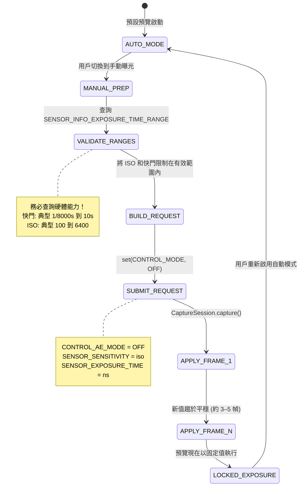

# 第 14 章：Camera2 中的手動曝光

掌握了第 13 章的攝影理論後，現在是將概念轉換為程式碼的時候了。在本章中，你將學習如何**完全接管**相機的自動曝光 (AE) 系統，並使用 Camera2 API 手動設定 ISO 和快門速度。

**Android Camera Parameters** 應用演示了本章中的所有技術——你可以切換到應用中的 Manual (手動) 模式，並調整 ISO 和 Shutter (快門) 滑塊以即時查看結果。

---

## 大開關：從 AUTO 到 MANUAL

預設情況下，你提交的每一个 `CaptureRequest` 都在相機內建的 3A 自動管線（自動曝光、自動對焦、自動白平衡）下執行。要進入手動模式，你必須**顯式禁用**該管線。

有兩個層級的覆蓋：

| 層級 | 設定 | 發生什麼 |
|-------|---------|-------------|
| 1. 僅禁用 AE | `CONTROL_AE_MODE = OFF` | ISO + 快門變為手動；AF 和 AWB 仍自動執行 |
| 2. 禁用整個 3A | `CONTROL_MODE = OFF` | **所有** 3A 演算法停止；每個 3A 參數必須手動設定 |

為了獲得可靠的手動曝光，請**兩者**都設定。在某些設備上，僅禁用 `CONTROL_AE_MODE` 仍會留下 OEM 後處理在幕後進行「輔助」。將 `CONTROL_MODE = OFF` 是最乾淨、最可預測的路徑。



**轉換延遲：** 當你提交一个手動擷取請求時，新的 ISO/快門值不會出現在*下一幀*。CMOS 感光元件存在管線延遲——*目前*幀已經在使用舊設定進行曝光。預計會有 **3-5 幀的轉換期**，然後數值才會趨於平穩。**Android Camera Parameters** 應用在報告「已鎖定」之前，會顯式等待 `CaptureResult` 以確認請求值與應用值比對。

---

## Camera2 API 中的手動控制

### SENSOR_SENSITIVITY (ISO)

Camera2 將 ISO 表示為 `CaptureRequest.SENSOR_SENSITIVITY` —— 一个直接映射到 ISO 算術刻度的整數。在大多數設備上，這是一个 1:1 的映射：

| 攝影師的 ISO | SENSOR_SENSITIVITY 值 |
|-------------------|--------------------------|
| 100 | 100 |
| 400 | 400 |
| 3200 | 3200 |
| 6400 | 6400 |

**務必查詢有效範圍。** 不要硬編碼數值：

```kotlin
val sensorSensitivityRange = characteristics.get(
    CameraCharacteristics.SENSOR_INFO_SENSITIVITY_RANGE
)
val minIso = sensorSensitivityRange?.lower ?: 100
val maxIso = sensorSensitivityRange?.upper ?: 6400
```

一些超高階手機報告的範圍如 50–12800，而廉價設備可能將你限制在 100–3200。超出範圍的值會被 HAL 夾斷 —— 這違背了你手動控制的目的。

### SENSOR_EXPOSURE_TIME (以納秒為單位的快門速度)

這是困擾每一个 Camera2 新開發者的第一个「坑」：**快門速度以納秒 (ns) 儲存，而不是秒。** 人類考慮的是 1/60s；而 HAL 考慮的是 16666666 ns。

兩者之間的轉換是簡單的算術：

```kotlin
// 秒 → 納秒 (乘以 1,000,000,000)
fun secondsToNs(seconds: Double): Long = (seconds * 1_000_000_000.0).toLong()

// 納秒 → 秒 (用於用戶顯示)
fun nsToSeconds(ns: Long): Double = ns.toDouble() / 1_000_000_000.0

// 用戶友好的字串格式化程序 (例如 "1/60s" 或 "2.5s")
fun formatShutter(ns: Long): String {
    val seconds = nsToSeconds(ns)
    return when {
        seconds >= 1.0 -> String.format("%.1fs", seconds)
        else -> {
            val fraction = (1.0 / seconds).toInt()
            "1/${fraction}s"
        }
    }
}
```

**供參考的常見轉換：**

| 人類習慣的快門速度 | 納秒 (ns) |
|--------------|-------------------|
| 1/8000s | 125,000 |
| 1/1000s | 1,000,000 |
| 1/500s | 2,000,000 |
| 1/120s (24fps 180° 法則) | 8,333,333 |
| 1/60s | 16,666,666 |
| 1/30s | 33,333,333 |
| 1/15s | 66,666,666 |
| 1s | 1,000,000,000 |
| 2s | 2,000,000,000 |
| 10s | 10,000,000,000 |
| 30s | 30,000,000,000 |

**同樣，查詢硬體範圍：**

```kotlin
val exposureTimeRange = characteristics.get(
    CameraCharacteristics.SENSOR_INFO_EXPOSURE_TIME_RANGE
)
val minShutterNs = exposureTimeRange?.lower ?: 1_000_000L   // 1/1000s 下限
val maxShutterNs = exposureTimeRange?.upper ?: 10_000_000_000L  // 10s 上限
```

在支援超長曝光的設備上（例如，某些索尼 Xperia 和 Google Pixel 機型），`SENSOR_INFO_EXPOSURE_TIME_RANGE.upper` 可以超過 30,000,000,000 ns (30s)。請遵守此限制 —— 超出最大值的請求會被靜默夾斷。

---

## ⚠️ 至關重要：手動模式下的畫質下降

**這是本章最重要的警告。** 請不要跳過。

當你設定 `CONTROL_MODE = OFF`（完全手動覆蓋）時，你不只是禁用了 AE/AF/AWB *演算法* —— 在幾乎所有的 Android 設備上，你也**禁用了通常在 3A 管線內執行的 OEM 專有計算後處理**。

具體而言，根據 HAL3 的研究分析顯示，禁用 3A 通常會關閉：

| 處理步驟 | AUTO (自動) 模式 | MANUAL (手動) 模式 (CONTROL_MODE = OFF) |
|-----------------|-----------|-----------------------------------|
| 多幀降噪 | ✓ 激活 — 降噪後的輸出 | ✗ 關閉 — 可見原始感光元件噪聲 |
| 自適應色調映射 / HDR 合成 | ✓ 激活 — 恢復高光 + 陰影 | ✗ 關閉 — 僅單幀曲線 |
| 局部對比度增強 (MiraVision 等) | ✓ 視場景而異 | ✗ 平坦的通用曲線 |
| 人臉測光 / 場景偵測 | ✓ 根據人臉權重進行曝光 | ✗ 被忽略 |
| 鏡頭遮蔽 / 暗角校正 | ✓ 每鏡頭校準 | ✗ 通常減少或關閉 |

**結果：** 在手動模式下以 ISO 3200 和 1/15s 拍攝的照片，看起來會比在 AUTO 模式下以 HAL 選擇的*完全相同*的 ISO 和快門拍攝的照片*明顯更差*（噪聲更多，對比度更平淡）。

**你能做些什麼？** 兩個現實的選擇：

1. **自己進行後處理。** 既然你禁用了 OEM 處理，你可以在自己的處理管線中應用你自己的去噪（例如，OpenCV 雙邊濾波、MediaPipe 降噪器或自定義訓練的 CNN）。RAW 拍攝（見後續章節）+ 自定義 RAW 顯影可以提供最大的藝術控制。

2. **使用手動 AE 覆蓋而非 CONTROL_MODE = OFF。** 如果你只需要*鎖定*特定值，同時保持 OEM 處理開啟，請嘗試將 `CONTROL_AE_MODE = ON` 但在逐請求的基礎上固定 `SENSOR_SENSITIVITY` 和 `SENSOR_EXPOSURE_TIME`。對此混合模式的支援視設備而定 —— 請徹底測試。

**Android Camera Parameters** 應用在 Manual 面板中有一個切換開關，可以在這兩種方法之間切換，並讓你在直觀地比較畫質差異。

---

## 完整範例 1：延時攝影的鎖定曝光

手動曝光的一個經典用例是**延時攝影 (timelapse photography)**。在 AUTO 模式下，相機會隨著雲層移動或光線變化，在幀與幀之間進行微妙的曝光調整。產生的影片閃爍嚴重。鎖定 ISO + 快門可以消除這種情況。

**目標：** ISO 100，1/60s (16,666,666 ns) — 每一幀都鎖定。

```kotlin
class TimelapseManualExposure(
    private val characteristics: CameraCharacteristics,
    private val captureSession: CameraCaptureSession,
    private val imageReaderSurface: Surface,
    private val previewSurface: Surface
) {
    companion object {
        private const val TARGET_ISO = 100
        private const val TARGET_SHUTTER_NS = 16_666_666L // 1/60s
    }

    fun captureTimelapseFrame(frameCallback: ImageReader.OnImageAvailableListener) {
        try {
            // ---- 第 1 步：驗證請求的值是否在硬體範圍內 ----
            val isoRange = characteristics.get(
                CameraCharacteristics.SENSOR_INFO_SENSITIVITY_RANGE
            )
            val shutterRange = characteristics.get(
                CameraCharacteristics.SENSOR_INFO_EXPOSURE_TIME_RANGE
            )

            val clampedIso = isoRange?.let {
                TARGET_ISO.coerceIn(it.lower, it.upper)
            } ?: TARGET_ISO

            val clampedShutter = shutterRange?.let {
                TARGET_SHUTTER_NS.coerceIn(it.lower, it.upper)
            } ?: TARGET_SHUTTER_NS

            // ---- 第 2 步：建構手動曝光的 CaptureRequest ----
            val requestBuilder = captureSession.device.createCaptureRequest(
                CameraDevice.TEMPLATE_STILL_CAPTURE
            ).apply {
                addTarget(previewSurface)
                addTarget(imageReaderSurface)

                // --- 關鍵行：禁用 3A 並固定數值 ---
                set(CaptureRequest.CONTROL_MODE, CameraMetadata.CONTROL_MODE_OFF)
                set(CaptureRequest.CONTROL_AE_MODE, CameraMetadata.CONTROL_AE_MODE_OFF)
                set(CaptureRequest.SENSOR_SENSITIVITY, clampedIso)
                set(CaptureRequest.SENSOR_EXPOSURE_TIME, clampedShutter)

                // 可選：將 AWB 固定在 Daylight 模式，以獲得一致的色彩
                set(CaptureRequest.CONTROL_AWB_MODE, CameraMetadata.CONTROL_AWB_MODE_DAYLIGHT)

                // 靜態拍攝 JPEG 質量
                set(CaptureRequest.JPEG_QUALITY, 95.toByte())
            }

            // ---- 第 3 步：提交靜態擷取 ----
            captureSession.capture(
                requestBuilder.build(),
                object : CameraCaptureSession.CaptureCallback() {
                    override fun onCaptureCompleted(
                        session: CameraCaptureSession,
                        request: CaptureRequest,
                        result: TotalCaptureResult
                    ) {
                        // 驗證 HAL 實際上應用了我們的值（它可能會夾斷！）
                        val appliedIso = result.get(CaptureResult.SENSOR_SENSITIVITY)
                        val appliedShutter = result.get(CaptureResult.SENSOR_EXPOSURE_TIME)
                        Log.d("Timelapse", "應用值: ISO=$appliedIso, 快門=${formatShutter(appliedShutter!!)}")
                    }
                },
                null // 在目前執行緒的 Handler 上執行
            )

        } catch (e: CameraAccessException) {
            Log.e("Timelapse", "手動擷取失敗", e)
        }
    }
}
```

**關鍵點：**

- 始終針對硬體範圍使用 `coerceIn()`。如果一台廉價手機的最小 ISO 是 120，你對 100 的請求就會靜默變成 120。`onCaptureCompleted()` 會確認*實際*應用了什麼值。
- 對於延時攝影，每隔 N 秒提交一次此請求（例如，每 5 秒拍攝一次，以在 30fps 輸出下獲得 300 倍的加速）。
- 固定 `CONTROL_AWB_MODE_DAYLIGHT` 是可選的，但在延時攝影中強烈推薦 —— 否則即使曝光被鎖定，AWB 在幀與幀之間仍可能微妙地漂移白平衡。

---

## 完整範例 2：夜景攝影的長曝光

**目標：** ISO 3200，2 秒 (2,000,000,000 ns) — 滑順的水面，明亮的星空。

**關鍵硬體要求：** 設備必須支援 `SENSOR_INFO_EXPOSURE_TIME_RANGE.upper >= 2,000,000,000 ns`。許多中階手機上限約為 1/8s 到 1s。

```kotlin
class NightLongExposure(
    private val characteristics: CameraCharacteristics,
    private val captureSession: CameraCaptureSession,
    private val previewSurface: Surface,
    private val jpegReaderSurface: Surface,
    private val rawReaderSurface: Surface? // 可選 RAW 擷取
) {
    fun shootLongExposure(onPhotoSaved: (path: String) -> Unit) {
        val shutterNs = 2_000_000_000L  // 2 秒
        val targetIso = 3200

        // --- 驗證硬體是否具備此能力 ---
        val shutterRange = characteristics.get(
            CameraCharacteristics.SENSOR_INFO_EXPOSURE_TIME_RANGE
        )
        if (shutterRange == null || shutterRange.upper < shutterNs) {
            throw UnsupportedOperationException(
                "設備不支援 2s 曝光。最大支援 = " +
                "${shutterRange?.upper?.let { nsToSeconds(it) } ?: "未知"}s"
            )
        }

        val requestBuilder = captureSession.device.createCaptureRequest(
            CameraDevice.TEMPLATE_STILL_CAPTURE
        ).apply {
            addTarget(previewSurface)
            addTarget(jpegReaderSurface)
            // 如果你之前配置了支援 RAW 的 OutputConfiguration：
            rawReaderSurface?.let { addTarget(it) }

            // 手動曝光覆蓋
            set(CaptureRequest.CONTROL_MODE, CameraMetadata.CONTROL_MODE_OFF)
            set(CaptureRequest.CONTROL_AE_MODE, CameraMetadata.CONTROL_AE_MODE_OFF)
            set(CaptureRequest.SENSOR_SENSITIVITY, targetIso)
            set(CaptureRequest.SENSOR_EXPOSURE_TIME, shutterNs)

            // --- 長曝光的關鍵點 ---
            // 禁用光學/數位影片防手震（長於 1s 時會發生衝突）
            set(CaptureRequest.LENS_OPTICAL_STABILIZATION_MODE,
                CameraMetadata.LENS_OPTICAL_STABILIZATION_MODE_OFF)
            // 長曝光拍攝不開啟閃光燈
            set(CaptureRequest.CONTROL_AE_MODE, CameraMetadata.CONTROL_AE_MODE_OFF)
        }

        captureSession.capture(
            requestBuilder.build(),
            object : CameraCaptureSession.CaptureCallback() {
                override fun onCaptureStarted(
                    session: CameraCaptureSession,
                    request: CaptureRequest,
                    timestamp: Long,
                    frameNumber: Long
                ) {
                    super.onCaptureStarted(session, request, timestamp, frameNumber)
                    // 通知 UI: "曝光開始 — 保持 2 秒鐘不動"
                    Log.d("LongExposure", "曝光開始於時間戳 $timestamp")
                }

                override fun onCaptureCompleted(
                    session: CameraCaptureSession,
                    request: CaptureRequest,
                    result: TotalCaptureResult
                ) {
                    // ImageReader.OnImageAvailableListener 會單獨觸發以儲存 JPEG
                    Log.d("LongExposure", "長曝光擷取完成")
                }
            },
            null
        )
    }
}
```

**長曝光技巧：**

1. **關閉 OIS。** 多數鏡頭的全光學防手震會嘗試在曝光*期間*補償手抖。對於 >0.5s 的曝光，OIS 執行器會飽和並導致可見的漂移。請關閉它並使用三腳架。

2. **做好凍結準備。** 在執行 2 秒曝光時，相機不會輸出預覽幀。你的 UI 應當顯示一個明確的「正在曝光...」指示器。

3. **RAW 效果更好。** 高 ISO (3200) + 長曝光會產生熱噪聲（感光元件發熱）。儲存一張 RAW 幀，並使用桌面端 RAW 顯影工具進行幀平均 —— 或者透過平均 8 張 0.25s 的幀而非單張 2s 的幀來實現你自己的多幀長曝光（這樣可以大幅減少熱噪聲）。

---

## 完整範例 3：3 幀曝光包圍

**目標：** 相同的 ISO，3 種不同的曝光：−1 EV、0 EV、+1 EV。用戶稍後將其合併為 HDR 照片。

從第 13 章我們知道，每一个 EV 步長都會使光量加倍/減半。在 ISO 固定單情況下，每一个 EV 步長 = 將快門速度乘以/除以 2。

```kotlin
class ExposureBracketing(
    private val characteristics: CameraCharacteristics,
    private val captureSession: CameraCaptureSession,
    private val previewSurface: Surface,
    private val jpegReaderSurface: Surface
) {
    data class BracketFrame(
        val label: String,
        val evShift: Double,  // -1.0, 0.0, +1.0
        val shutterNs: Long,
        val iso: Int
    )

    fun captureBracketSeries(baseIso: Int, baseShutterNs: Long) {
        val isoRange = characteristics.get(
            CameraCharacteristics.SENSOR_INFO_SENSITIVITY_RANGE
        )
        val shutterRange = characteristics.get(
            CameraCharacteristics.SENSOR_INFO_EXPOSURE_TIME_RANGE
        )

        // 建構包圍計劃：將快門乘以 2^(evStep)
        val frames = listOf(-1.0, 0.0, +1.0).map { ev ->
            val multiplier = Math.pow(2.0, ev)
            val rawShutter = (baseShutterNs.toDouble() * multiplier).toLong()
            val clampedShutter = shutterRange?.let {
                rawShutter.coerceIn(it.lower, it.upper)
            } ?: rawShutter
            val clampedIso = isoRange?.let {
                baseIso.coerceIn(it.lower, it.upper)
            } ?: baseIso
            BracketFrame("EV${if (ev > 0) "+" else ""}${ev.toInt()}", ev, clampedShutter, clampedIso)
        }

        Log.d("Bracket", "計劃: ${frames.map { "${it.label} ISO${it.iso} ${formatShutter(it.shutterNs)}" }}")

        // 使用 captureBurst() 將每一幀作為一個連拍提交，以確保原子性
        val requestList = frames.map { frame ->
            captureSession.device.createCaptureRequest(
                CameraDevice.TEMPLATE_STILL_CAPTURE
            ).apply {
                addTarget(previewSurface)
                addTarget(jpegReaderSurface)

                set(CaptureRequest.CONTROL_MODE, CameraMetadata.CONTROL_MODE_OFF)
                set(CaptureRequest.CONTROL_AE_MODE, CameraMetadata.CONTROL_AE_MODE_OFF)
                set(CaptureRequest.SENSOR_SENSITIVITY, frame.iso)
                set(CaptureRequest.SENSOR_EXPOSURE_TIME, frame.shutterNs)

                // 為每個請求貼上標籤，以便我們在回呼中區分各個幀
                setTag(frame.label)
            }.build()
        }

        captureSession.captureBurst(
            requestList,
            object : CameraCaptureSession.CaptureCallback() {
                override fun onCaptureCompleted(
                    session: CameraCaptureSession,
                    request: CaptureRequest,
                    result: TotalCaptureResult
                ) {
                    val tag = request.tag as? String ?: "?"
                    Log.d("Bracket", "$tag 已完成 — 準備進行 HDR 合併")
                }
            },
            null
        )
    }
}
```

**為什麼使用 `captureBurst()` 而非三個獨立的 `capture()` 呼叫？** `captureBurst()` 原子地提交整個列表。HAL 保證中間不會插入其他預覽幀，對焦/白平衡狀態也不會在幀與幀之間發生漂移。

**想要 5 幀或 7 幀包圍？** 只需修改 `listOf(-2.0, -1.0, 0.0, +1.0, +2.0)` —— 數學計算會隨之縮放。許多專業的 HDR 應用拍攝 9 幀包圍，用於極端動態範圍場景。

**合併步驟：** 一旦獲得三個 JPEG（或 RAW）幀，你可以使用以下方式合併它們：
- Android 透過 `CameraExtensionSession` 內建的 HDR 管線（見 HDR 章節）
- 第三方庫如 OpenCV 的 `createMergeDebevec()` / `createMergeRobertson()`，用於真正的曝光融合
- Google 的 Photo Sphere HDR 庫

---

## 常見失敗排查

| 問題 | 可能原因 | 解決辦法 |
|---------|-------------|-----|
| 手動數值似乎被忽略，看起來仍是自動模式 | `CONTROL_MODE` 未設定為 OFF，或者數值被夾斷 | 將 CONTROL_MODE 和 CONTROL_AE_MODE 均設定為 OFF；在 `onCaptureCompleted()` 中驗證實際應用的值 |
| 2s 長曝光請求立即報錯 | 設備不支援 2s 曝光 | 檢查 `SENSOR_INFO_EXPOSURE_TIME_RANGE.upper`；減少曝光時間或改用提升 ISO 代替 |
| 切換手動模式時預覽卡頓或延遲 | 呼叫了太多次 `setRepeatingRequest()` | 使用經過節流的滑塊監聽器（每 30–50 ms）；僅更新重複請求，而非靜態擷取 |
| 在 ISO 100 2s 拍攝的長曝光照片全黑 | 場景實際需要比 ISO 100 下更多的光線 | 提高 ISO 或延長快門；2s ISO 100 是 EV 0 基準，並非真正的「夜間亮度」 |
| 相同 ISO 下的手動拍攝比自動拍攝噪點更多 | CONTROL_MODE = OFF 禁用了 OEM 降噪 | 預期行為！見「手動模式下的畫質下降」一節。進行後處理，或透過 AE_LOCK 使用部分手動模式 |

---

## 小結

你現在已經掌握了從 Camera2 HAL 手中奪取曝光控制權的工具：

- 使用 `CONTROL_MODE = OFF` + `CONTROL_AE_MODE = OFF` **禁用 3A 管線**以進行全手動控制
- **將 ISO 映射到 `SENSOR_SENSITIVITY`** (多數硬體上為 1:1 映射；務必查詢範圍)
- **將秒 ↔ 納秒映射**到 `SENSOR_EXPOSURE_TIME`，使用簡單的 10⁹ 轉換
- **延時鎖定：** 每一幀重複固定的 ISO 100 + 1/60s = 零閃爍
- **夜間長曝光：** 禁用 OIS 的情況下使用 ISO 3200 + 2s = 明亮平滑的夜景（在支援的硬體上）
- **曝光包圍：** 透過 `captureBurst()` 拍攝 ISO 相同、快門 ×0.5 / ×1 / ×2 的序列 = 準備好合併的 HDR 輸入
- **⚠️ 手動畫質權衡：** 禁用 3A 會關閉 OEM 降噪和色調映射 —— 在相同 ISO 下，手動照片往往看起來比自動照片*更差*。請做好後處理計劃。

## 下一章

曝光控制*亮度*。**對焦控制銳度。** 在**第 15 章：對焦**中，我們將介紹：

- 自動對焦 (AF) 狀態和模式 —— 被動掃描的工作原理，連續圖片 vs 影片的區別
- 使用屈光度單位的 `LENS_FOCUS_DISTANCE` 進行手動對焦 (0.0 = 無窮遠, 10D = 0.1m)
- 用於單次 AF 觸發並擷取序列的 Kotlin 程式碼，以及手動對焦 SeekBar 滑塊
- AF 狀態機 —— `CONTROL_AF_STATE_FOCUSED_LOCKED` 究竟何時觸發，以及如何等待它

模糊到此為止。（雙關語，很冷，但我很認真。）
