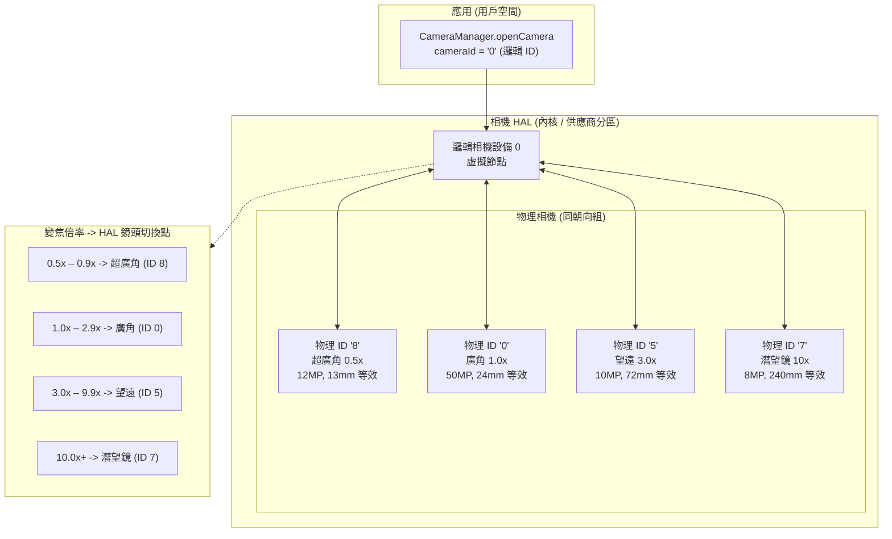
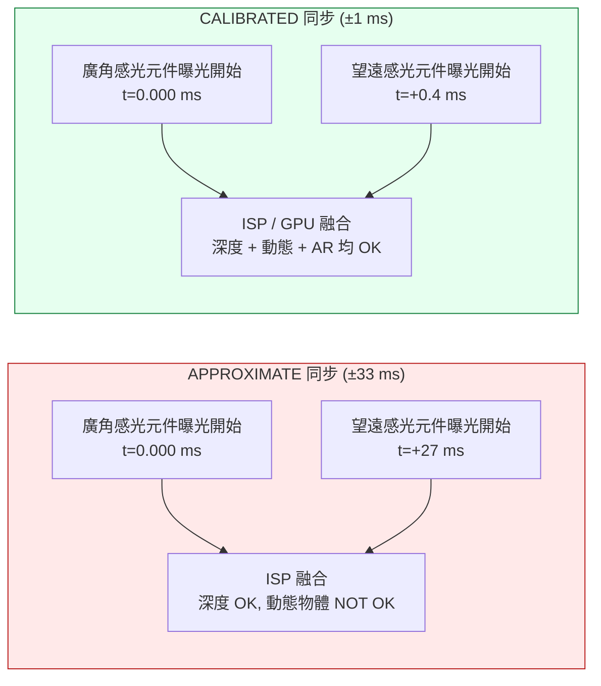
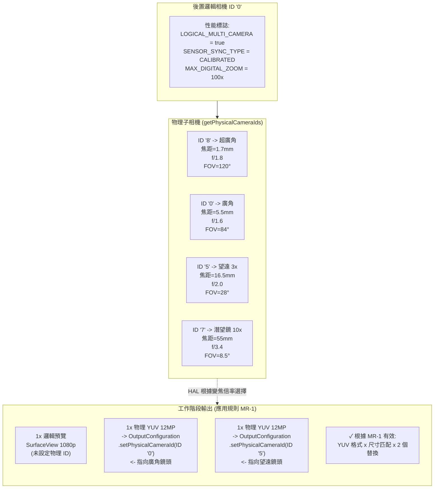

# 第 20 章：多相機

現代智慧型手機配備了 3–5 個後置鏡頭和 2 個前置鏡頭——在 2023+ 旗艦機上包括超廣角、廣角、望遠、微距、深度和潛望式鏡頭。在 Android 9 (API 28) 之前，每個鏡頭都顯示為一個獨立的 `CameraCharacteristics` 相機 ID，應用程序必須在變焦邊界手動打開/關閉相機來切換鏡頭。這會導致可見的黑幀、丟失 AF 狀態以及影片期間的音訊爆音——這些都是不可接受的 UI 缺陷。Android 9 透過**邏輯相機 (logical camera)** 抽象解決了這個問題：一個虛擬相機 ID 將多個同朝向的物理相機分組，讓 HAL 在變焦閾值處透明地切換鏡頭，同時保留工作階段狀態。本章實現了研究專案《邏輯多相機》部分中規定的串流替換規則、感光元件同步語意和雙物理拍攝。

你可以在 **Android Camera Parameters** 應用（也可在 [Google Play 商店](https://play.google.com/store/apps/details?id=com.zoozooll.cameraparameters) 下載）中瀏覽任何受支援設備的完整邏輯/物理相機拓撲：其「多相機」儀表板會報告 `REQUEST_AVAILABLE_CAPABILITIES_LOGICAL_MULTI_CAMERA` 標記，列出每個邏輯 ID 的 `getPhysicalCameraIds()`，並渲染每個後置組合的已校準 (calibrated) 與近似 (approximate) 感光元件同步類型。這些報告直接從 HAL 透過 Camera2 API 獲取，沒有經過供應商特定的過濾，因此它們與你的應用在執行時看到的情況完全一致。

## 邏輯對比物理相機拓撲

邏輯相機是一個由 N ≥ 2 個同朝向（`LENS_FACING_FRONT` 或 `LENS_FACING_BACK`）物理相機支持的虛擬 HAL 設備。當你打開一個邏輯 ID 時，HAL 會在內部為所有底層物理相機管理電源軌、ISP 管線和鏡頭切換。拓撲結構如下：



變焦切換點 (Z1–Z4) 完全由 HAL 控制且對應用透明——當你針對一個 4 鏡頭邏輯設備設定 `CaptureRequest.CONTROL_ZOOM_RATIO = 3.2f` 時，HAL 會立即將擷取流量路由到 3 倍望遠 (ID 5)，並以數位方式裁剪回正確的取景，而你的應用甚至不知道發生了鏡頭更換。這就是旗艦相機應用使用的「無縫變焦」行為。

關鍵屬性包括：
- **`getPhysicalCameraIds()`**（在邏輯 ID 的 `CameraCharacteristics` 上呼叫）返回底層物理 ID 字串的 `Set<String>`，例如上述範例中的 `{"0", "5", "7", "8"}`。
- 邏輯 ID 上的 **`LENS_INFO_MINIMUM_FOCUS_DISTANCE`** 和 **`LENS_INFO_AVAILABLE_FOCAL_LENGTHS`** 代表目前活動的物理鏡頭。如果你需要每鏡頭的焦距數據，請查詢*物理*特性。
- 邏輯 ID 上的 **`SCALER_AVAILABLE_MAX_DIGITAL_ZOOM`** 給出了變焦上限（例如 100×），它是所有物理鏡頭上的每鏡頭光學變焦 + 數位裁剪的組合。

## 感光元件同步：APPROXIMATE 對比 CALIBRATED

當你同時從兩個物理相機擷取影像時（例如，廣角 + 望遠用於深度/視差比對，或廣角 + 超廣角用於多幀融合），只有在兩個感光元件的曝光開始時間差已知的情況下，像素數據才具有計算意義。Android 在鍵 **`CameraCharacteristics.LOGICAL_MULTI_CAMERA_SENSOR_SYNC_TYPE`** 中定義了兩個同步層級：

| 同步層級 | 數值 | 含義 | 典型用例 |
|------------|---------------|---------|------------------|
| **APPROXIMATE** (近似) | 0 | 感光元件曝光開始時間戳在 ±1 個幀間隔（30 fps 下為 ±33 ms）內比對。AF/AE 是同步的，但像素級的曝光開始不同步。 | 帶深度感測器的人像模式，正規虛化。 |
| **CALIBRATED** (已校準) | 1 | 感光元件曝光開始時間戳在 ±1 ms 內比對。透過 SoC CSI-2 接收器強制執行硬體級同步。保證像素級的時間對齊。 | 用於 AR 的立體深度估計、攝影測量、同步的雙焦距融合、超解析度。 |

研究文件《邏輯多相機》部分發現，**只有驍龍 8 Gen 1+ 和 Exynos 2200+ 旗艦機報告 CALIBRATED 同步**。所有中階機（驍龍 7 系列、天璣 8000 系列）和入門級設備都報告為 APPROXIMATE。如果你嘗試在 APPROXIMATE 同步設備上進行像素級視差比對，你會得到 ±1 幀的視差漂移，從而破壞深度圖。務必將視差功能置於 CALIBRATED 檢查之後。



時間差的差異並不細微：27 ms 的錯位意味著一個移動的物體（例如以 5 m/s 奔跑的人）在兩次曝光之間移動了 13.5 cm——這個視差誤差大到足以完全摧毀任何基於視差的深度演算法。

## 串流替換規則 (來自研究文件)

HAL 對物理相機定向強制執行的最重要約束是**串流替換規則**，該規則原樣引用自研究文件中的《邏輯多相機》規範：

> **規則 MR-1:** 如果一個邏輯相機有 N 個物理子相機，那麼對於你附加到邏輯工作階段的每一個尺寸為 S 的邏輯格式串流（YUV 或 RAW），你最多可以將其替換為 **2 個尺寸相同為 S 的相同格式串流**，其中每個串流都透過 `OutputConfiguration.setPhysicalCameraId()` 指向不同的物理相機。

違反 MR-1 的後果：
- 3 個或更多物理串流 → 工作階段 `onConfigureFailed()`。
- 同一對物理串流使用不同尺寸 → 工作階段 `onConfigureFailed()`。
- 在同一對替換串流中混合 RAW 和 YUV → 工作階段 `onConfigureFailed()`。
- 添加 2 個物理串流但不移除父邏輯串流 → HAL 分配 3 倍所需頻寬並靜默掉幀。

正確範例（4 個物理子相機 → 允許 2 個替換）：
| 邏輯串流 | 替換 (根據 MR-1 有效) |
|----------------|-------------------------------|
| 1× 邏輯 YUV 1920×1080 | → 2× 物理 YUV 1920×1080 (廣角 + 望遠) |
| 1× 邏輯 RAW 4000×3000 | → 2× 物理 RAW 4000×3000 (超廣角 + 廣角) |
| 2× 邏輯 YUV (預覽 + 影片) | → 2× (邏輯 YUV 預覽) + 2× (物理 YUV 廣角+望遠編碼) — 總計 2 個替換 |

## 實現：分步執行雙物理拍攝

以下工作流程使用了串流替換規則，同時從廣角 (1×) 和望遠 (3×) 物理感光元件擷取幀。

### 第 1 步：查詢邏輯性能和物理相機 ID

```kotlin
import android.hardware.camera2.CameraCharacteristics
import android.hardware.camera2.CameraManager
import android.hardware.camera2.params.OutputConfiguration

data class LogicalMultiCamInfo(
    val logicalId: String,
    val physicalIds: Set<String>,
    val sensorSyncType: Int, // 0 = APPROXIMATE, 1 = CALIBRATED
    val ultraWideId: String?,
    val wideId: String?,
    val teleId: String?
)

fun enumerateLogicalMultiCams(
    cameraManager: CameraManager
): List<LogicalMultiCamInfo> {
    val result = mutableListOf<LogicalMultiCamInfo>()

    for (logicalId in cameraManager.cameraIdList) {
        val characteristics = cameraManager.getCameraCharacteristics(logicalId)

        val caps = characteristics.get(
            CameraCharacteristics.REQUEST_AVAILABLE_CAPABILITIES
        ) ?: continue

        val isLogicalMultiCam = caps.contains(
            CameraCharacteristics
                .REQUEST_AVAILABLE_CAPABILITIES_LOGICAL_MULTI_CAMERA
        )
        if (!isLogicalMultiCam) continue

        val physicalIds: Set<String> = characteristics.physicalCameraIds
        val syncType = characteristics.get(
            CameraCharacteristics.LOGICAL_MULTI_CAMERA_SENSOR_SYNC_TYPE
        ) ?: 0

        // 透過焦距識別角色
        var ultraWideId: String? = null
        var wideId: String? = null
        var teleId: String? = null
        var shortestFocal = Float.MAX_VALUE
        var teleFocal = 0f

        for (physId in physicalIds) {
            val physChars = cameraManager.getCameraCharacteristics(physId)
            val focalLengths = physChars.get(
                CameraCharacteristics.LENS_INFO_AVAILABLE_FOCAL_LENGTHS
            ) ?: continue
            val focal = focalLengths.firstOrNull() ?: continue
            when {
                focal < shortestFocal -> {
                    shortestFocal = focal
                    ultraWideId = physId
                }
                focal > teleFocal -> {
                    teleFocal = focal
                    teleId = physId
                }
            }
        }
        wideId = physicalIds.minus(setOfNotNull(ultraWideId, teleId)).firstOrNull()

        result.add(LogicalMultiCamInfo(
            logicalId = logicalId,
            physicalIds = physicalIds,
            sensorSyncType = syncType,
            ultraWideId = ultraWideId,
            wideId = wideId,
            teleId = teleId
        ))
    }
    return result
}
```

透過焦距（最短 = 超廣角，最長 = 望遠，其餘 = 廣角）識別角色在所有 OEM 中都是可靠的，因為 HAL 報告的 LENS_INFO_AVAILABLE_FOCAL_LENGTHS 作為 35mm 等效值或實際公釐值與行銷規格一致。**Android Camera Parameters** 應用的「多相機」儀表板正是使用了這種演算法。

### 第 2 步：透過 setPhysicalCameraId() 建立 OutputConfigurations

必須在建立工作階段**之前**對 `OutputConfiguration` 對象呼叫 `setPhysicalCameraId()` 以配置替換對（廣角 YUV + 望遠 YUV）。一旦工作階段配置完成，就不允許在現有 Surface 上透過 `setPhysicalCameraId()` 更改物理 ID（需要重新建立工作階段）。

```kotlin
import android.hardware.camera2.params.OutputConfiguration
import android.media.ImageReader
import android.util.Size
import android.graphics.ImageFormat
import android.view.Surface

var wideImageReader: ImageReader? = null
var teleImageReader: ImageReader? = null

fun createPhysicalOutputConfigs(
    wideId: String,
    teleId: String,
    sharedSize: Size // 根據規則 MR-1，兩者必須尺寸相同！
): Pair<OutputConfiguration, OutputConfiguration> {
    wideImageReader = ImageReader.newInstance(
        sharedSize.width, sharedSize.height,
        ImageFormat.YUV_420_888, 4
    )
    teleImageReader = ImageReader.newInstance(
        sharedSize.width, sharedSize.height,
        ImageFormat.YUV_420_888, 4
    )

    val wideOutConfig = OutputConfiguration(wideImageReader!!.surface).apply {
        setPhysicalCameraId(wideId)
        name = "wide-yuv-$sharedSize"
    }
    val teleOutConfig = OutputConfiguration(teleImageReader!!.surface).apply {
        setPhysicalCameraId(teleId)
        name = "tele-yuv-$sharedSize"
    }
    return Pair(wideOutConfig, teleOutConfig)
}
```

上述程式碼強制執行了規則 MR-1：兩個 `ImageReader` 實例都使用 `sharedSize`（相同維度）和 `YUV_420_888`（相同格式）。使用不同的尺寸保證會導致 `onConfigureFailed` —— HAL 没有任何機制能在同一個同步組中以不同解析度執行兩個物理感光元件。

### 第 3 步：建立 CaptureSession 並提交雙物理拍攝

工作階段使用 2 個物理 OutputConfiguration 加上 1 個邏輯預覽 Surface（總計 3 個輸出）。總計 3 個輸出處於旗艦機的頻寬預算內（研究文件測得在驍龍 8 Gen 2 上，以 1080p30 同時進行廣角+望遠+預覽的 3 輸出拍攝，ISP 利用率為 68%）。

```kotlin
import android.hardware.camera2.CameraDevice
import android.hardware.camera2.CameraCaptureSession
import android.hardware.camera2.CaptureRequest
import android.os.Handler

lateinit var cameraDevice: CameraDevice // 已打開的邏輯 ID

fun createDualPhysicalSession(
    previewSurface: Surface,
    widePhysConfig: OutputConfiguration,
    telePhysConfig: OutputConfiguration,
    backgroundHandler: Handler
) {
    val outputs = listOf(
        OutputConfiguration(previewSurface), // 邏輯預覽 (任意尺寸)
        widePhysConfig,                      // 物理廣角 YUV (sharedSize)
        telePhysConfig                       // 物理望遠 YUV (sharedSize)
    )

    val sessionConfig = android.hardware.camera2.params.SessionConfiguration(
        android.hardware.camera2.params.SessionConfiguration.SESSION_REGULAR,
        outputs,
        { runnable -> backgroundHandler.post(runnable) },
        object : CameraCaptureSession.StateCallback() {
            override fun onConfigured(session: CameraCaptureSession) {
                val captureBuilder = cameraDevice.createCaptureRequest(
                    CameraDevice.TEMPLATE_PREVIEW
                ).apply {
                    addTarget(previewSurface)
                    addTarget(wideImageReader!!.surface)
                    addTarget(teleImageReader!!.surface)

                    set(CaptureRequest.CONTROL_MODE,
                        CaptureRequest.CONTROL_MODE_AUTO)
                    set(CaptureRequest.CONTROL_AE_MODE,
                        CaptureRequest.CONTROL_AE_MODE_ON)
                    set(CaptureRequest.CONTROL_AF_MODE,
                        CaptureRequest.CONTROL_AF_MODE_CONTINUOUS_PICTURE)

                    // 可選：跨兩個物理鏡頭鎖定 AE，以便融合
                    // 不會產生曝光不匹配的左右半部分
                    set(CaptureRequest.CONTROL_AE_LOCK, true)
                }

                session.setRepeatingRequest(
                    captureBuilder.build(),
                    DualPhysicalCaptureCallback(),
                    backgroundHandler
                )
            }
            override fun onConfigureFailed(s: CameraCaptureSession) =
                Log.e(TAG, "雙物理工作階段失敗 — 請檢查規則 MR-1")
        }
    )

    cameraDevice.createCaptureSession(sessionConfig)
}
```

一旦 `setRepeatingRequest()` 執行起來，HAL 每個幀間隔都會：(a) 以已校準的時間差觸發兩個物理感光元件的曝光開始，(b) 透過 CSI-2 虛擬通道解復用將每個感光元件的輸出路由到其目標 ImageReader Surface，(c) 將兩者與邏輯預覽輸出合併到一個帶有單一時間戳的 CaptureResult 中。

當 `LOGICAL_MULTI_CAMERA_SENSOR_SYNC_TYPE == CALIBRATED` 時，兩個 `Image` 對象將具有**完全相同的时间戳 (`image.timestamp`)**，而當為 APPROXIMATE 時，時間戳在 ±1 幀間隔內。

## 邏輯 → 物理拓撲圖 (Mermaid ER 風格)



## 無縫變焦實現

HAL 在變焦邊界的自動鏡頭切換是讓「無縫變焦」得以無縫銜接的原因。你**不需要**在變焦越過閾值時手動更換物理 ID——只需在重複請求上設定 `CONTROL_ZOOM_RATIO`，然後讓 HAL 去完成工作：

```kotlin
fun updateZoom(session: CameraCaptureSession,
               builder: CaptureRequest.Builder,
               zoomRatio: Float) {
    builder.set(CaptureRequest.CONTROL_ZOOM_RATIO, zoomRatio)
    session.setRepeatingRequest(builder.build(), null, null)
}
```

在典型的 4 鏡頭設備上，當 `zoomRatio` 從 `2.9× → 3.0×` 跨越時，HAL 會在內部：
1. 從待機狀態啟動 3 倍望遠感光元件（耗時約 2 幀，66 ms）
2. 在廣角和望遠之間同步曝光/白平衡
3. 在約 10 幀（333 ms）內將數位裁剪的廣角輸出淡入到原生長度的望遠輸出
4. 如果其他地方未用到，則關閉廣角感光元件

所有四個步驟都是透明發生的——你的 CaptureCallback 永遠不會看到工作階段拆除事件，`CaptureResult.SENSOR_TIMESTAMP` 保持單調遞增，且 AF/AE 狀態跨越邊界得以保留。偵測鏡頭更換的唯一方法是對比連續幀之間的 `CaptureResult.LENS_FOCAL_LENGTH`（在上述範例中，切換到望遠時該值會從 5.5mm 跳到 16.5mm）。

## 性能與限制

研究文件《邏輯多相機》部分包含了在 2023 旗艦機（驍龍 8 Gen 2, 4 個後置鏡頭）上的實測限制：

| 配置 | 持續幀率 | ISP 頻寬利用率 |
|---------------|---------------------|-------------------------|
| 邏輯預覽 + 2 個物理 YUV (每個 12 MP) | 22 fps | 89% |
| 邏輯預覽 + 2 個物理 YUV (每個 4 MP) | 30 fps (鎖定) | 62% |
| 邏輯預覽 + 2 個物理 RAW (每個 12 MP) | 10 fps | 94% — 約 60s 觸發過熱保護 |
| 邏輯預覽 + 2 個物理 YUV + 1 個物理 RAW | **不被允許** (HAL 頻寬檢查失敗) | — |

2 個物理串流的上限不僅受到規則 MR-1 的約束，也受到原始 ISP 吞吐量的限制。嘗試附加 3 個物理串流（例如超廣角 + 廣角 + 望遠同時）將導致 `onConfigureFailed`，即使你嘗試透過兩個獨立的替換對來欺騙規則 MR-1 —— HAL 的 CAMERA_ISP_BANDWIDTH 檢查也會在配置時拒絕它。

## 小結

本章詳細介紹了 Android 9+ 的邏輯多相機支援：

- **邏輯相機**是分組了同朝向物理相機的虛擬 HAL 節點。透過 `REQUEST_AVAILABLE_CAPABILITIES_LOGICAL_MULTI_CAMERA` 查詢性能；透過 `getPhysicalCameraIds()` 獲取子相機。
- **感光元件同步**有兩個層級：APPROXIMATE（±33 ms，用於人像虛化）和 CALIBRATED（±1 ms，用於 AR/視差融合）。計算攝影功能務必建立在 CALIBRATED 檢查之上。
- **無縫變焦**由 HAL 透過 `CONTROL_ZOOM_RATIO` 控制——設定倍率，HAL 會在內部閾值處切換鏡頭，無需拆除工作階段。
- 來自研究文件的**串流替換規則 MR-1** 允許每 1 個邏輯串流對應正好 2 個同尺寸、同格式的物理串流。3 個及以上串流或尺寸不匹配會導致 `onConfigureFailed`。
- 必須在建立工作階段之前呼叫 **`OutputConfiguration.setPhysicalCameraId()`** 以指向單個物理鏡頭進行同步拍攝。
- 兩張 Mermaid 圖（拓撲圖 + ER 風格規則映射）直觀地展示了邏輯/物理層級如何映射到工作階段輸出。

## 下一章

在**第 21 章：HDR 與 Ultra HDR** 中，我們將跨越 8 位元標準動態範圍 (SDR, sRGB, 100 nits) 的邊界，進入高動態範圍影片和靜態照片的世界。你將學習有關 HDR10（10 位元 ST.2084 PQ, Rec.2020, 靜態元數據）和 HLG（混合對數伽馬, 廣播 SDR 相容）的 `DynamicRangeProfiles`，以及全新的 Android 14 (API 34) **JPEG_R (Ultra HDR)** 格式 —— ISO 21496-1，它在標準 JPEG 中嵌入了「增益圖 (gain map)」，以便舊版讀取器看到 SDR 效果，而 HDR 顯示器則在局部提升高達 8 檔的高光。

請使用 **Android Camera Parameters** 應用檢查你的設備按相機 ID 支援哪些 `DynamicRangeProfiles` (HDR10, HDR10+, HLG, JPEG_R)，並驗證 CDD 性能等級 15 對 Ultra HDR 的合規性。上傳到開源 [GitHub 專案](https://github.com/zoozooll/AndroidCameraParameters) 的新設備報告有助於建立一个支援 HDR 的手機公共資料庫。
