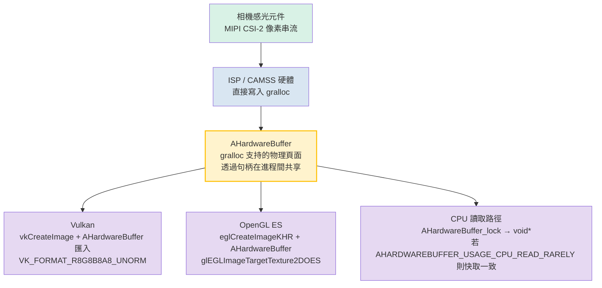

# 第 25 章：原生相機開發

## 摘要

第 1-24 章在代管程式碼中執行：Kotlin 或 Java 在 ART 上執行，針對每一个 `CaptureRequest` 都要跨越一次 Binder IPC 邊界，並且要么分配幀的 `ByteBuffer` 副本，要么接受由 `SurfaceTexture` 調解的紋理串流帶來的開銷。對於社交相機類應用，這已經足夠了。但對於 AR 引擎、即時電腦視覺管線、車載倒車影像，或者是每一幀預算僅 16ms 的 3D 引擎來說，這還遠遠不夠。

原生相機開發使用 NDK 的 `<camera/NdkCameraManager.h>` 和 `<android/hardware_buffer.h>` 標頭文件，將整個相機的打開/配置/擷取循環移動到 C/C++ 中。直接的回報是熱路徑上的零 JNI 開銷，以及至關重要的一點：能夠將 gralloc 分配的 `AHardwareBuffer` 物件直接包裝為 Vulkan `VkImage` 或 OpenGL `EGLImage` 目標，而無需在感光元件輸出與 GPU 紋理採樣之間進行任何位元組的記憶體拷貝。

**Android Camera Parameters** 可幫助你驗證目標設備是否提供了可預測的低級原生操作所需的 `INFO_SUPPORTED_HARDWARE_LEVEL_FULL` 或 `LEVEL_3` 保證。可從 [Google Play](https://play.google.com/store/apps/details?id=com.minininja.cameraparams) 下載，或在 [github.com/zoozooll/AndroidCameraParameters](https://github.com/zoozooll/AndroidCameraParameters) 查看源碼。

---

## 為什麼要進行原生開發？

在深入研究 C++ 之前，讓我們準確界定原生開發能帶給你什麼，以及它何時能證明其複雜性是值得的。

### 選擇原生開發的理由

1. **關鍵路徑上的零 JNI 開銷。** 60fps 管線每幀只有 16.67ms。單次跨越 ART/C 邊界的 JNI `CallVoidMethod` 呼叫在微基準測試中約為 0.5–2µs，但真正的成本在於*每幀*的呼叫、執行緒切換、JNI 局部引用記帳以及代管 `Image` 代理帶來的 GC 壓力。如果有四個相機同時為一個 AR 工作階段供串流，僅在語言邊界的切換上就會耗費 1 毫秒的預算。原生開發消除了這一點。

2. **透過 `AHardwareBuffer` 直接擁有記憶體。** 在代管程式碼中，`Image.getPlanes()[0].getBuffer()` 返回的是 gralloc 記憶體的一個*視圖* `ByteBuffer`；讀取它會強制執行 CPU 快取失效，並且對於 `PRIVATE` 等格式通常涉及內部拷貝。在原生程式碼中，`AHardwareBuffer` 就是 gralloc 句柄本身，GPU 可以原位將其繫結為紋理記憶體。

3. **AR/3D 引擎整合。** Unity、Unreal、Ogre 以及各種自研引擎使用 C++ 編寫是有充分理由的。在渲染循環的 C++ 程式碼內部執行相機，消除了 「ART + JNI + 渲染執行緒」 這一由三個進程組成的糾結團塊。

4. **汽車 EVS (外部顯示系統) 遷移。** 在 Android 10 之前，汽車倒車鏡頭使用帶有獨立 HAL 的舊版 `EVS` 堆疊。2020–2024 年間的 OEM 遷移將 EVS 收斂到了標準的 Camera2 NDK API 上，為 `AID_AUTOMOTIVE_EVS_UID = 1071` 保留了在啟動早期（甚至在 `system_server` 的 CameraService 執行之前）存取硬體的權限。如果你的程式碼針對汽車領域，原生開發是不可逾越的選擇。

### 反對原生開發的理由

- 偵錯更困難。`ACameraDevice` 回呼中的崩潰會產生 tombstone (墓碑) 追蹤資訊，而不是清晰的 Kotlin 堆疊追蹤。
- 生命週期管理完全手動。`ACameraManager` *不是* 生命週期感知的；在 Surface 銷毀時忘記執行 `ACameraCaptureSession_stopRepeating()` + `ACameraDevice_close()` 會導致相機資源洩漏，並可能在重啟前阻塞其他應用。
- 較少的設備變通方案。CameraX 的異常行為資料庫在 NDK 領域並不存在；你繼承的是 HAL 的原始表現。
- 没有 `DngCreator`，没有 `ExifInterface` 輔助程式，没有 `CameraCharacteristics` 便捷存取器 —— 你需要透過 `ACameraMetadata_getConstEntry` 自己解析元數據標籤。

決策很簡單：如果你無法在代管程式碼中滿足幀預算，或者你需要 EVS 級別的啟動時相機存取權限，請選擇原生。否則，請留在代管端。

---

## ACameraManager：對應於 Java CameraManager 的 NDK 實現

`<camera/NdkCameraManager.h>`、`<camera/NdkCameraDevice.h>` 和 `<camera/NdkCaptureRequest.h>` 中的 NDK 相機 API 表面幾乎與你熟悉的 Java API 一一對應。每個 Java 類別都有對應的原生結構體和一組空閒函式：

| Java 類別 | NDK 句柄 / 函式前綴 |
|-------------------------------|-------------------------------------------------------|
| `CameraManager` | `ACameraManager` · `ACameraManager_*` |
| `CameraCharacteristics` | `ACameraMetadata` · `ACameraMetadata_*` |
| `CameraDevice` | `ACameraDevice` · `ACameraDevice_*` |
| `CaptureRequest.Builder` | `ACaptureRequest` · `ACaptureRequest_setEntry_*` |
| `CameraCaptureSession` | `ACameraCaptureSession` · `ACameraCaptureSession_*` |
| `TotalCaptureResult` | `ACameraCaptureResult` · `ACaptureResult` |
| `ImageReader` | `AImageReader` (來自 `<media/NdkImageReader.h>`) |

生命週期完全相同：枚舉相機 → 讀取特性 → 打開 → 建立輸出 Surface → 建立工作階段 → 設定重複請求 → 按相反順序拆除。

### 範例 1：枚舉相機、讀取特性、打開設備 (C++)

```cpp
#include <camera/NdkCameraManager.h>
#include <camera/NdkCameraDevice.h>
#include <camera/NdkCameraMetadata.h>
#include <android/log.h>

#define LOG_TAG "NativeCam"
#define LOGI(...) __android_log_print(ANDROID_LOG_INFO, LOG_TAG, __VA_ARGS__)
#define LOGE(...) __android_log_print(ANDROID_LOG_ERROR, LOG_TAG, __VA_ARGS__)

static ACameraManager* g_cameraManager = nullptr;
static ACameraDevice* g_cameraDevice = nullptr;

void onDeviceDisconnected(void* ctx, ACameraDevice* dev) {
    LOGI("相機設備已斷開連接");
}

void onDeviceError(void* ctx, ACameraDevice* dev, int err) {
    LOGE("相機設備錯誤: %d", err);
}

static ACameraDevice_stateCallbacks g_deviceCallbacks = {
    .context = nullptr,
    .onDisconnected = onDeviceDisconnected,
    .onError = onDeviceError,
};

bool enumerateAndOpenBackCamera() {
    g_cameraManager = ACameraManager_create();
    if (!g_cameraManager) {
        LOGE("建立 ACameraManager 失敗");
        return false;
    }

    ACameraIdList* cameraIdList = nullptr;
    camera_status_t status = ACameraManager_getCameraIdList(
        g_cameraManager, &cameraIdList);
    if (status != ACAMERA_OK) {
        LOGE("getCameraIdList 失敗: %d", status);
        return false;
    }

    const char* chosenId = nullptr;

    for (int i = 0; i < cameraIdList->numCameras; ++i) {
        const char* id = cameraIdList->cameraIds[i];
        ACameraMetadata* chars = nullptr;
        status = ACameraManager_getCameraCharacteristics(
            g_cameraManager, id, &chars);
        if (status != ACAMERA_OK) continue;

        ACameraMetadata_const_entry lensFacingEntry{};
        status = ACameraMetadata_getConstEntry(
            chars,
            ACAMERA_LENS_FACING,
            &lensFacingEntry);

        uint8_t facing = 0;
        if (status == ACAMERA_OK && lensFacingEntry.count > 0) {
            facing = lensFacingEntry.data.u8[0];
        }

        if (facing == ACAMERA_LENS_FACING_BACK) {
            chosenId = id;
            // 同時查詢硬體層級以進行性能檢查：
            ACameraMetadata_const_entry hwEntry{};
            if (ACameraMetadata_getConstEntry(
                    chars, ACAMERA_INFO_SUPPORTED_HARDWARE_LEVEL,
                    &hwEntry) == ACAMERA_OK && hwEntry.count > 0) {
                LOGI("後置相機 %s 硬體層級 = %d (期待 %d=FULL %d=LEVEL3)",
                     id, hwEntry.data.u8[0],
                     (int)ACAMERA_INFO_SUPPORTED_HARDWARE_LEVEL_FULL,
                     (int)ACAMERA_INFO_SUPPORTED_HARDWARE_LEVEL_3);
            }
            ACameraMetadata_free(chars);
            break;
        }
        ACameraMetadata_free(chars);
    }

    ACameraManager_deleteCameraIdList(cameraIdList);

    if (!chosenId) {
        LOGE("未找到後置相機");
        return false;
    }

    status = ACameraManager_openCamera(
        g_cameraManager, chosenId,
        &g_deviceCallbacks,
        &g_cameraDevice);

    if (status != ACAMERA_OK) {
        LOGE("openCamera 失敗: %d", status);
        return false;
    }

    LOGI("成功打開相機 %s", chosenId);
    return true;
}
```

請注意，這裡没有異常機制。每個函式都返回 `camera_status_t`，你*必須*檢查每一个返回值。`ACAMERA_OK = 0`；任何非零值都是特定的失敗代碼（`ACAMERA_ERROR_CAMERA_IN_USE`、`ACAMERA_ERROR_CAMERA_DISCONNECTED` 等）。没有 `CameraAccessException` 可捕捉 —— 如果你忽略了返回值，函式只是靜默地將輸出指標保留為 `nullptr`，而你會在三行程式碼後發生崩潰。

### 建立擷取工作階段並設定重複請求

一旦設備打開，其模式就鏡像了 Java 的工作階段建立。為每個 Surface 建立一个 `ACameraOutputTarget`，將它們打包進一個 `ACaptureSessionOutputContainer`，然後呼叫 `ACameraDevice_createCaptureSession()`。對於重複請求，從模板建構一个 `ACaptureRequest`，添加你的輸出目標，並呼叫 `ACameraCaptureSession_setRepeatingRequest()`。回呼結構體（`ACameraCaptureSession_stateCallbacks`、`ACameraCaptureSession_captureCallbacks`）在工作階段建立時註冊，與它們的 Java 對應項完全比對。

---

## AHardwareBuffer：零拷貝的關鍵路徑

這是進行原生開發的真實理由。`AHardwareBuffer`（定義在 `<android/hardware_buffer.h>` 中）是 gralloc 分配記憶體的 NDK 句柄 —— 也就是相機 HAL 寫入感光元件像素的同一塊記憶體。當你向 `ACameraDevice_createCaptureSession` 饋送一个由 `AHardwareBuffer` 支持的 Surface，隨後將同一个 `AHardwareBuffer` 匯入到 Vulkan 或 OpenGL 中時，你就實現了真正的零拷貝：



`AHardwareBuffer` 節點是關鍵：它是相機 HAL 寫入端點、GPU 紋理採樣器以及（可選的）CPU 共享的單一分配單元。没有 memcpy，没有 `glTexImage2D` 上傳，没有 `ByteBuffer.wrap()` —— GPU 紋理實際上指向了相機剛剛寫入的同一个物理 DRAM 頁面。

對於 4K 串流上的 AR 60fps 管線，這相當於每秒約 200ms 的頻寬節省（4K × 60fps × 4 位元組 = 約 4.7 GB/s 的節省），也是平滑體驗與卡頓體驗之間的分水嶺。

### 範例 2：從 AHardwareBuffer 到 Vulkan VkImage 的逐步實現 (C++)

```cpp
#include <android/hardware_buffer.h>
#include <vulkan/vulkan.h>
#include <vulkan/vulkan_android.h>

VkImage createVkImageFromAHardwareBuffer(
    VkDevice device,
    AHardwareBuffer* aBuffer,
    VkFormat format,
    uint32_t width,
    uint32_t height) {

    // 第 1 步：填充 AndroidHardwareBufferProperties2KHR
    VkAndroidHardwareBufferPropertiesANDROID ahbProps{};
    ahbProps.sType = VK_STRUCTURE_TYPE_ANDROID_HARDWARE_BUFFER_PROPERTIES_ANDROID;
    VkResult res = vkGetAndroidHardwareBufferPropertiesANDROID(
        device, aBuffer, &ahbProps);
    if (res != VK_SUCCESS) {
        LOGE("vkGetAndroidHardwareBufferPropertiesANDROID 失敗: %d", res);
        return VK_NULL_HANDLE;
    }

    // 第 2 步：描述影像匯入 (不是分配)
    VkExternalMemoryImageCreateInfo externalInfo{};
    externalInfo.sType = VK_STRUCTURE_TYPE_EXTERNAL_MEMORY_IMAGE_CREATE_INFO;
    externalInfo.handleTypes =
        VK_EXTERNAL_MEMORY_HANDLE_TYPE_ANDROID_HARDWARE_BUFFER_BIT_ANDROID;

    VkImageCreateInfo imgInfo{};
    imgInfo.sType = VK_STRUCTURE_TYPE_IMAGE_CREATE_INFO;
    imgInfo.pNext = &externalInfo;
    imgInfo.imageType = VK_IMAGE_TYPE_2D;
    imgInfo.format = format;             // 例如 VK_FORMAT_R8G8B8A8_UNORM
    imgInfo.extent = { width, height, 1 };
    imgInfo.mipLevels = 1;
    imgInfo.arrayLayers = 1;
    imgInfo.samples = VK_SAMPLE_COUNT_1_BIT;
    imgInfo.tiling = VK_IMAGE_TILING_OPTIMAL;
    imgInfo.usage = VK_IMAGE_USAGE_SAMPLED_BIT |
                    VK_IMAGE_USAGE_TRANSFER_DST_BIT;
    imgInfo.sharingMode = VK_SHARING_MODE_EXCLUSIVE;
    imgInfo.initialLayout = VK_IMAGE_LAYOUT_UNDEFINED;

    VkImage image = VK_NULL_HANDLE;
    res = vkCreateImage(device, &imgInfo, nullptr, &image);
    if (res != VK_SUCCESS) {
        LOGE("vkCreateImage 失敗: %d", res);
        return VK_NULL_HANDLE;
    }

    // 第 3 步：分配匯入 AHB 的 VkDeviceMemory (不分配新記憶體)
    VkMemoryRequirements memReqs{};
    vkGetImageMemoryRequirements(device, image, &memReqs);

    VkImportAndroidHardwareBufferInfoANDROID importInfo{};
    importInfo.sType =
        VK_STRUCTURE_TYPE_IMPORT_ANDROID_HARDWARE_BUFFER_INFO_ANDROID;
    importInfo.buffer = aBuffer;

    VkMemoryDedicatedAllocateInfo dedicatedInfo{};
    dedicatedInfo.sType = VK_STRUCTURE_TYPE_MEMORY_DEDICATED_ALLOCATE_INFO;
    dedicatedInfo.pNext = &importInfo;
    dedicatedInfo.image = image;

    VkMemoryAllocateInfo allocInfo{};
    allocInfo.sType = VK_STRUCTURE_TYPE_MEMORY_ALLOCATE_INFO;
    allocInfo.pNext = &dedicatedInfo;
    allocInfo.allocationSize = memReqs.size;
    allocInfo.memoryTypeIndex = ahbProps.memoryTypeBits
        // memoryTypeIndex 必須從 memReqs.memoryTypeBits
        // 與 ahbProps.memoryTypeBits 的交集中選擇。此處省略細節。
        ;

    VkDeviceMemory mem = VK_NULL_HANDLE;
    res = vkAllocateMemory(device, &allocInfo, nullptr, &mem);
    if (res != VK_SUCCESS) {
        LOGE("vkAllocateMemory 匯入失敗: %d", res);
        vkDestroyImage(device, image, nullptr);
        return VK_NULL_HANDLE;
    }

    // 第 4 步：將匯入的記憶體繫結到 VkImage
    vkBindImageMemory(device, image, mem, 0);

    // 第 5 步：透過命令緩衝區轉換到 SHADER_READ_ONLY_OPTIMAL 佈局
    // (省略 —— 針對 VK_IMAGE_LAYOUT_UNDEFINED 
    // → VK_IMAGE_LAYOUT_SHADER_READ_ONLY_OPTIMAL 的標準影像記憶體屏障)

    LOGI("成功將 AHardwareBuffer 匯入為 VkImage %p", image);
    return image;
}
```

大多數新手最容易產生困惑的是第 3 步：帶有 `VK_STRUCTURE_TYPE_IMPORT_ANDROID_HARDWARE_BUFFER_INFO_ANDROID` 的 `vkAllocateMemory` 呼叫**並不**進行分配。它將現有的 `AHardwareBuffer` 註冊為 `VkDeviceMemory` 物件。這些位元組已在相機生產者建立 Surface 時由 gralloc 分配；Vulkan 只是在將其納入其記憶體模型。

OpenGL ES 路徑與之類似但更短：`eglCreateImageKHR(..., EGL_NATIVE_BUFFER_ANDROID, aBuffer, ...)` → `glEGLImageTargetTexture2DOES(GL_TEXTURE_2D, eglImage)`。只需一次呼叫即可進行採樣。

---

## OpenGL 與 Vulkan 互操作總結

兩種路徑都可行。如何選擇：

| 考量因素 | OpenGL ES 3.x + EGLImage | Vulkan 1.1+ + AHB 匯入 |
|-----------------------|----------------------------------------------|----------------------------------------------|
| 複雜度 | 設定較短，流程較簡 | 樣板程式碼較多，顯式同步 |
| 同步 | 隱式；驅動程序插入屏障 | 顯式；你需要編寫管線屏障 + 訊號量 |
| 多佇列/多執行緒 | 繫結到每個執行緒的單個 EGLContext | 一等公民的多佇列傳輸 |
| 汽車/AR 認證 | 在多數 EVS 目標上經過認證 | 新的 AR 執行階段越來越多地要求此項 |

如果你正在整合到現有引擎中，引擎會為你做出選擇。如果你是白手起家並追求極致性能，Vulkan 是未來。如果你想要最少的程式碼，透過 EGLImage 的 OpenGL ES 仍是務實的選擇，且在每一台帶相機的設備上都有提供。

---

## 汽車 EVS 背景：向 Camera2 NDK 遷移

為了完整起見，這裡記錄一下研究筆記中引用的汽車領域遷移路徑。在 Android 9 之前，車載倒車鏡頭使用獨立的 `EVS` HAL (`android.hardware.automotive.evs@1.0`)，它有自己的枚舉和串流管線。從 Android 10 開始，並在 Android 12+ 的新 IVI 系統中成為強制要求，EVS 管理器被重新實現*在標準的相機 HAL3 + NDK 相機堆疊之上*，並使用新的保留 UID `AID_AUTOMOTIVE_EVS_UID = 1071`。該 UID 甚至在 `system_server` 的 `CameraService` 初始化之前，就能在 `early-boot` 階段獲得 `CAMERA` 權限組存取權。

實際上，如果你正在編寫汽車倒車鏡頭程式碼：
1. 你的進程以 UID 1071 執行。
2. 你使用的正是本章中的原生 API (`ACameraManager_openCamera`、`AImageReader`、`AHardwareBuffer` → Vulkan 匯入)。
3. 你必須能夠在冷啟動後的 2 秒內打開、配置並輸出一幀畫面 (FMVSS 111 法規要求)。這就是 EVS 堆疊要求原生開發的原因 —— ART 啟動的每一毫秒都是你消耗不起的。

EVS 向 Camera2 NDK 的遷移是過去五年中 Android 相機生態系統最重大的內部重構之一，這也是為什麼 NDK 相機 API 從 Android 10 起獲得了如此沈重的投入。如果你閱讀本章是為了發佈車載相機產品，那麼你使用的正是 Google 汽車合規性測試所規定的程式碼路徑。

---

## 範例 3 (Kotlin JNI 橋接存根)

為了完整起見，這裡提供一个呼叫上述 C++ 程式碼的極簡 Kotlin JNI 進入點：

```kotlin
// NativeBridge.kt
class NativeBridge {

    external fun enumerateAndOpenBackCameraNative(): Boolean

    companion object {
        init {
            System.loadLibrary("native_camera")
        }
    }
}
```

```cpp
// native_camera.cpp JNI 導出
extern "C" JNIEXPORT jboolean JNICALL
Java_com_example_NativeBridge_enumerateAndOpenBackCameraNative(
    JNIEnv* /*env*/, jobject /*thiz*/) {
    return static_cast<jboolean>(enumerateAndOpenBackCamera() ? JNI_TRUE : JNI_FALSE);
}
```

在 `build.gradle` 中：

```kotlin
android {
    defaultConfig {
        ndk { abiFilters += listOf("arm64-v8a", "armeabi-v7a", "x86_64") }
    }
    externalNativeBuild {
        cmake { path = file("src/main/cpp/CMakeLists.txt") }
    }
}
```

以及相應的 `CMakeLists.txt` 鏈接 `-lcamera2ndk`、`-lmediandk`、`-landroid` 和 `-lvulkan`。

---

## 小結

原生相機開發犧牲了代管程式碼的易用性，以換取極致的性能和對硬體的直接掌控。`ACameraManager` 及其配套結構體與 Java Camera2 API 一一對應，只是改用了 C 風格的錯誤返回和手動生命週期。真正的價值在於 `AHardwareBuffer` —— 這一 gralloc 句柄讓你能將相機 HAL 的輸出直接饋送到 Vulkan `VkImage` 或 OpenGL `EGLImage` 紋理中，而無需任何記憶體拷貝，從而在 60fps AR 管線中節省每秒數 GB 的 DRAM 頻寬。對於汽車領域，由於 2 秒啟動幀要求以及 `AID_AUTOMOTIVE_EVS_UID` 的早期硬體存取，EVS 向 NDK 的遷移使得原生開發成為必選項。在使用原生實現之前，請使用 **Android Camera Parameters** 驗證你的目標設備是否具備 `INFO_SUPPORTED_HARDWARE_LEVEL_FULL` 或更好的性能。

## 下一章

無論是在 Kotlin 還是在 C++ 中，Camera2 本質上都是一个非同步 API：`StateCallbacks`、`CaptureCallbacks`、`AvailabilityCallbacks` 都在背景執行緒觸發。第 26 章將利用 Kotlin 協程和 Flow 來馴服這種混亂，將你在早期章節中編寫的、支離破碎的回調地獄轉換為整潔、線性且響應式的管線。
