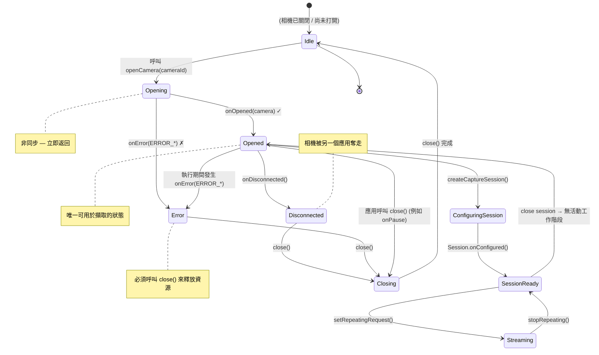

你已經枚舉了設備上的所有相機（第 6 章），並確定了你想要使用的那一個——通常是硬體層級最高的後置鏡頭。下一步是**打開**該相機：建立與相機硬體的主動、低級連接，以便你可以配置擷取工作階段並提交請求。打開相機是一個「破釜沈舟」的時刻，你的應用從此從相機元數據的被動觀察者轉換為真實硬體的主動控制者。

如果你想查看生產級的相機打開/關閉生命週期程式碼，請研究 [GitHub](https://github.com/zoozooll/AndroidCameraParameters) 上的 **Android Camera Parameters** 應用。其 `Camera2Controller` 類別封裝了整個 `CameraDevice` 生命週期管理，包括錯誤恢復、重試邏輯和同步清理。[Google Play](https://play.google.com/store/apps/details?id=com.minininja.cameraparams) 版本的該應用已安裝在數百個不同 OEM 的數千台設備上，因此它處理的邊緣情況是經過現實世界考驗的。

## 什麼是 CameraDevice？

`CameraDevice` 是 Camera2 類別，代表**與設備上特定物理（或邏輯）相機的活動、已打開的連接**。在相機打開之前，你只能讀取其特性；一旦打開，你可以：
- 建立 `CameraCaptureSession`（第 8 章）
- 提交 `CaptureRequest`（第 8 章和第 9 章）
- 在幀到達時讀取動態 `CaptureResult` 元數據
- 重新整理掛起的請求、中止擷取並關閉設備

`CameraDevice` 有兩個關鍵屬性：

1. **它是單用戶資源。** 一次只能有一个應用（在你的應用內部，只能有一个 `CameraDevice` 實例）保持特定的相機開啟。如果優先級更高的應用（如帶有影片的來電）需要相機，你的應用將被強制斷開連接。
2. **它具有嚴格的、回呼驅動的生命週期。** 你不能用構造函數實例化 `CameraDevice`。獲取它的唯一方法是透過 `CameraManager.openCamera()`，它透過 `StateCallback` 非同步交付實例。你必須尊重每一個狀態轉換回呼。

`CameraManager`、相機 ID 與產生的 `CameraDevice` 之間的關係是：

```
CameraManager.openCamera("0", callback, handler)
    │
    ├── 非同步呼叫 → 立即返回
    │
    └───── 在背景執行緒（透過 Handler） ────→ StateCallback.onOpened(cameraDevice)
                                                          │
                                                          ▼
                                                  現在你可以使用 cameraDevice 來：
                                                  • createCaptureSession(...)
                                                  • createCaptureRequest(...)
```

## StateCallback：CameraDevice 的生命週期機

`CameraDevice.StateCallback` 是一个抽象類別，包含三個你**必須**實現的方法。每個已打開的相機最終都會觸發至少一個此類回呼（或者是 `onOpened` 隨後是 `onDisconnected`/`onError`，或者是打開失敗時直接觸發 `onError`）。在 `onOpened` 觸發之前，相機不能用於擷取。

### 三個 StateCallback 方法

| 方法 | 呼叫時機 | 該做什麼 |
|---|---|---|
| `onOpened(camera: CameraDevice)` | 相機已成功打開並可以使用。 | 在屬性中儲存 `camera` 引用。繼續配置擷取工作階段（第 8 章）。如果你獲取了訊號量許可，請釋放它。 |
| `onDisconnected(camera: CameraDevice)` | 相機從你的應用中被奪走（例如，另一个優先級更高的應用打開了它，用戶切換到了一個急需相機的行動前台應用，或者設備策略禁用了它）。 | 立即呼叫 `camera.close()`。將你儲存的引用置空。在你的應用重新回到前台（此時 `onResume` 將重試）之前，無法重新打開相機。 |
| `onError(camera: CameraDevice, error: Int)` | 在打開期間或相機活動期間發生了致命錯誤。`error` 參數是下面描述的 `ERROR_*` 常量之一。 | 呼叫 `camera.close()`。將引用置空。根據錯誤代碼，向用戶顯示錯誤訊息或使用指數退避策略進行重試。始終釋放訊號量。 |

### `onError` 錯誤代碼

`onError` 中的 `error` 整數映射到五個常量（定義在 `CameraDevice.StateCallback` 中）：

| 常量 | 值 | 含義 | 恢復方式 |
|---|---|---|---|
| `ERROR_CAMERA_IN_USE` | `1` | 相機已被另一個應用或系統相機服務打開。 | 無法自動恢復；等待用戶返回你的應用執行 `onResume` 時重試。 |
| `ERROR_MAX_CAMERAS_IN_USE` | `2` | 設備對同時打開的相機數量有限制；你嘗試打開此相機時已超過限制（在多攝旗艦機上常見）。 | 關閉你可能持有的其他已打開的 `CameraDevice`，然後重試。在有硬體限制的設備上，通常一次只能打開 2–3 個相機。 |
| `ERROR_CAMERA_DISABLED` | `3` | 設備策略（MDM、家長控制、自助服務模式）已禁用所有相機。 | 向用戶顯示永久性錯誤消息。在策略更改之前，重試没有任何幫助。 |
| `ERROR_CAMERA_DEVICE` | `4` | 相機硬體/韌體遇到不可恢復的錯誤。 | 關閉設備。通知用戶。在某些設備上重試可能會有幫助（針對瞬時韌體故障），因此進行一兩次帶有延遲的重試是合理的。 |
| `ERROR_CAMERA_SERVICE` | `5` | 全系統相機服務本身已崩潰。這是平台級的故障，不是你應用的錯。 | 關閉並將所有內容置空。通常相機服務會在幾秒鐘內自動重啟；你可以在延遲後重試或等待下一次 `onResume`。 |

下面的狀態圖捕捉了 `CameraDevice` 從你呼叫 `openCamera()` 到你（或系統）關閉它的每一個有效轉換：



狀態圖中的重要啟示：

1. **Opened 是唯一的執行狀態。** 在 `onOpened` 觸發之前以及任何錯誤/斷開連接之後，`CameraDevice` 引用必須被視為不可用。
2. **在每個終結狀態進行 Close。** 無論你是遇到 `onError`、`onDisconnected`，還是僅僅決定在 `onPause` 中主動關閉，**始終呼叫 `close()`**。未能關閉相機會導致洩漏，從而阻止**任何**應用（包括你的應用）重新打開它，直到進程結束或系統服務重啟。
3. **onError 是終結性的。** 發生 `onError` 後，該特定的 `CameraDevice` 實例即告作廢。不要嘗試恢復它；關閉它，如果你認為錯誤是暫時的，再嘗試執行一次全新的 `openCamera()`。

## 與 Activity onPause/onResume 的生命週期整合

Android Activity 生命週期與 `CameraDevice` 生命週期內在關聯。相機硬體是共享的、高能耗資源；系統會激進地終止在背景持有相機的應用。規範規則如下：

### 何時打開相機 (onResume)

在 `onResume` 中（在啟動背景執行緒之後，如第 5 章所述）：
1. 驗證權限是否仍被授予（應用在背景時，用戶可能在設定中撤銷了權限）。
2. 如果 `CameraDevice` 已經打開，你就可以開始了。
3. 如果沒有打開的 `CameraDevice`，使用你在第 6 章中選擇的 ID 呼叫 `openCamera()`。

### 何時關閉相機 (onPause)

在 `onPause` 中（在停止背景執行緒之前）：
1. 如果重複請求處於活動狀態（預覽正在執行——第 8 章），使用 `cameraCaptureSession.stopRepeating()` 停止它。
2. 如果存在打開的擷取工作階段，使用 `cameraCaptureSession.close()` 關閉它。
3. 使用 `cameraDevice.close()` 關閉 `CameraDevice` 本身。
4. 將三個引用（工作階段、設備和掛起的請求建構器）全部置空。
5. 然後（且僅在此之後）停止背景執行緒。

如果你顛倒了其中的任何步驟（例如，在關閉相機**之前**停止執行緒），`close()` 需要執行的回呼將無處執行，你會在 Logcat 中看到死鎖、ANR 或 `Handler ... sending message to a Handler on a dead thread` 警告。

## 使用訊號量 (Semaphore) 進行並行控制

即使是經驗豐富的 Camera2 開發者也會被一個微妙的競態條件絆倒：**如果用戶快速在應用間切換，導致在前一個 open 的非同步回呼觸發之前再次呼叫 `openCamera()` 怎麼辦？**

你最終會對同一個相機發起兩個並行的打開嘗試。系統相機服務可能會處理一个並以 `ERROR_CAMERA_IN_USE` 拒絕另一个，或者可能在打開中途斷開第一個——無論哪種情況，你的回呼程式碼都必須處理過時的引用和重複關閉的 bug。

解決方法是使用一個初始化為 1 個許可的 **`Semaphore`**（二進制鎖/互斥鎖）：

- 在呼叫 `openCamera()` 之前，獲取許可。如果獲取逾時，則跳過此次打開嘗試（前一次嘗試仍在進行中）。
- 在**每一個終結回呼**（`onOpened`、`onDisconnected`、`onError`）中，釋放許可。
- 在 `onPause` 中，關閉相機後，如果持有許可，則防禦性地再次釋放許可。

`Semaphore.tryAcquire(timeout, unit)` 是正確的方法：它最多阻塞 `timeout` 毫秒，如果無法獲得許可則返回 `false`。切勿在主執行緒上使用不帶逾時的阻塞式 `acquire()`——它會導致 ANR。

## 處理 CameraAccessException

`CameraManager.openCamera()` 會拋出受檢異常 `CameraAccessException`。與透過 `StateCallback.onError` 交付的錯誤代碼（這些是打開後的錯誤）不同，這些異常發生在 **CameraDevice 對象甚至還不存在之前的打開嘗試期間**。四個最常見的原因代碼：

| 原因 (來自 `e.reason`) | 含義 |
|---|---|
| `CAMERA_IN_USE` (`4`) | 與回呼版本相同——另一個應用持有相機。 |
| `MAX_CAMERAS_IN_USE` (`5`) | 達到硬體相機限制。 |
| `CAMERA_DISABLED` (`1`) | 策略禁用（MDM / 工作資料）。 |
| `CAMERA_ERROR` (`3`) | 打開期間的通用硬體故障。 |

務必將 `openCamera()` 封裝在對 `CameraAccessException` 以及 `IllegalArgumentException` 的 try/catch 中（以防相機 ID 在第 6 章的枚舉和現在之間失效——例如外部 USB 鏡頭被拔掉）。

## 完整的 Kotlin 程式碼：打開相機

以下是整合並了本章所有內容的完整 `MainActivity` 程式碼。我們使用 `openCamera()` 方法、完整的 `StateCallback`、基於 `Semaphore` 的並行控制、Activity 生命週期整合以及詳盡的錯誤處理來擴充第 6 章的程式碼庫。

```kotlin
package com.example.camera2tutorial

import android.Manifest
import android.content.Context
import android.content.pm.PackageManager
import android.hardware.camera2.CameraAccessException
import android.hardware.camera2.CameraCharacteristics
import android.hardware.camera2.CameraDevice
import android.hardware.camera2.CameraManager
import android.hardware.camera2.CameraMetadata
import android.os.Bundle
import android.os.Handler
import android.os.HandlerThread
import android.util.Log
import android.widget.Toast
import androidx.appcompat.app.AppCompatActivity
import androidx.core.app.ActivityCompat
import androidx.core.content.ContextCompat
import java.util.concurrent.Semaphore
import java.util.concurrent.TimeUnit

class MainActivity : AppCompatActivity() {

    private lateinit var backgroundThread: HandlerThread
    private lateinit var backgroundHandler: Handler
    private lateinit var cameraManager: CameraManager

    // 防止多個並行的相機打開操作
    private val cameraOpenCloseLock = Semaphore(1)

    // 活動的已打開相機設備（可空）
    private var cameraDevice: CameraDevice? = null

    // 選定的相機 ID（來自第 6 章的發現步驟）
    private var selectedCameraId: String? = null

    override fun onCreate(savedInstanceState: Bundle?) {
        super.onCreate(savedInstanceState)
        setContentView(R.layout.activity_main)

        if (allPermissionsGranted()) {
            initializeCameraManager()
        } else {
            ActivityCompat.requestPermissions(
                this,
                REQUIRED_PERMISSIONS,
                REQUEST_CODE_PERMISSIONS
            )
        }
    }

    override fun onResume() {
        super.onResume()
        startBackgroundThread()

        if (allPermissionsGranted()) {
            if (!this::cameraManager.isInitialized) {
                initializeCameraManager()
            }
            // 權限 OK 但相機尚未打開 → 現在打開它
            if (cameraDevice == null && selectedCameraId != null) {
                openCamera(selectedCameraId!!)
            }
        } else {
            // 應用處於背景時用戶撤銷了權限
            ActivityCompat.requestPermissions(
                this,
                REQUIRED_PERMISSIONS,
                REQUEST_CODE_PERMISSIONS
            )
        }
    }

    override fun onPause() {
        closeCamera()
        stopBackgroundThread()
        super.onPause()
    }

    private fun startBackgroundThread() {
        backgroundThread = HandlerThread("Camera2Background").apply { start() }
        backgroundHandler = Handler(backgroundThread.looper)
    }

    private fun stopBackgroundThread() {
        backgroundThread.quitSafely()
        try {
            backgroundThread.join(1000)
        } catch (e: InterruptedException) {
            Log.e(TAG, "連接背景執行緒時被中斷", e)
        }
    }

    private fun initializeCameraManager() {
        cameraManager = getSystemService(Context.CAMERA_SERVICE) as CameraManager
        discoverCamerasAndSelectDefault()
    }

    // ----------------- 第 6 章（簡略版）：發現 + 選擇 -----------------
    data class CameraInfo(val id: String, val lensFacing: Int?, val hardwareLevel: Int?)

    private fun discoverCamerasAndSelectDefault() {
        val cameraIds = try { cameraManager.cameraIdList } catch (_: CameraAccessException) { emptyArray() }
        val discovered = mutableListOf<CameraInfo>()
        for (id in cameraIds) {
            val chars = try { cameraManager.getCameraCharacteristics(id) } catch (_: Exception) { continue }
            discovered += CameraInfo(
                id,
                chars.get(CameraCharacteristics.LENS_FACING),
                chars.get(CameraCharacteristics.INFO_SUPPORTED_HARDWARE_LEVEL)
            )
        }
        // 優先選擇硬體層級最高的後置鏡頭
        val backCandidates = discovered.filter { it.lensFacing == CameraCharacteristics.LENS_FACING_BACK }
            .sortedByDescending { it.hardwareLevel ?: -1 } // LEVEL_3 > FULL > LIMITED > LEGACY
        val frontCandidates = discovered.filter { it.lensFacing == CameraCharacteristics.LENS_FACING_FRONT }
            .sortedByDescending { it.hardwareLevel ?: -1 }

        selectedCameraId = (backCandidates + frontCandidates).firstOrNull()?.id
        Log.d(TAG, "選定待打開的相機: ID=$selectedCameraId")

        // 首次啟動時，如果執行緒已就緒則立即打開
        if (selectedCameraId != null && this::backgroundHandler.isInitialized) {
            openCamera(selectedCameraId!!)
        }
    }

    // -------------------------------------------------------------------------
    // 🎯 第 7 章新增內容：openCamera() + StateCallback + closeCamera()
    // -------------------------------------------------------------------------
    private val stateCallback = object : CameraDevice.StateCallback() {

        override fun onOpened(camera: CameraDevice) {
            // 在 openCamera() 中獲取了許可；現在打開成功，釋放它
            cameraOpenCloseLock.release()
            cameraDevice = camera
            Log.d(TAG, "✅ 相機打開成功: ID=${camera.id}")
            Toast.makeText(
                this@MainActivity,
                "相機 ${camera.id} 打開成功！",
                Toast.LENGTH_SHORT
            ).show()

            // TODO 第 8 章：在這裡我們將建立一個用於預覽的 CameraCaptureSession。
            // 目前，先慶祝打開成功 — 我們擁有一个活動的 CameraDevice！
        }

        override fun onDisconnected(camera: CameraDevice) {
            cameraOpenCloseLock.release()
            Log.w(TAG, "⚠️ 相機斷開連接（被另一个應用奪走）: ID=${camera.id}")
            cameraDevice?.close()
            cameraDevice = null
        }

        override fun onError(camera: CameraDevice, error: Int) {
            cameraOpenCloseLock.release()
            Log.e(TAG, "❌ 相機 ID=${camera.id} 發生錯誤。代碼=$error (${errorCodeToString(error)})")

            cameraDevice?.close()
            cameraDevice = null

            // 根據錯誤類型向用戶顯示資訊
            val userMsg = when (error) {
                ERROR_CAMERA_IN_USE ->
                    "相機正被另一个應用使用。請關閉其他相機應用後重試。"
                ERROR_MAX_CAMERAS_IN_USE ->
                    "打開的相機過多。此設備限制了同時執行的相機數量。"
                ERROR_CAMERA_DISABLED ->
                    "由於設備策略（家長控制、工作資料等），相機已被禁用。"
                ERROR_CAMERA_DEVICE ->
                    "發生了相機硬體錯誤。如果此問題持續存在，請嘗試重啟設備。"
                ERROR_CAMERA_SERVICE ->
                    "系統相機服務崩潰。請稍後重試。"
                else ->
                    "發生了未知的相機錯誤 (代碼=$error)。"
            }
            Toast.makeText(this@MainActivity, userMsg, Toast.LENGTH_LONG).show()
        }
    }

    private fun openCamera(cameraId: String) {
        if (ContextCompat.checkSelfPermission(this, Manifest.permission.CAMERA)
            != PackageManager.PERMISSION_GRANTED
        ) {
            Log.w(TAG, "跳過 openCamera：未授予 CAMERA 權限")
            return
        }

        // ----- 獲取帶有逾時（2.5 秒）的訊號量，以避免阻塞 -----
        val acquired = try {
            cameraOpenCloseLock.tryAcquire(2500, TimeUnit.MILLISECONDS)
        } catch (e: InterruptedException) {
            Log.e(TAG, "等待獲取相機打開鎖時被中斷", e)
            false
        }
        if (!acquired) {
            Log.e(TAG, "等待相機打開鎖逾時 — 另一个打開/關閉操作正在進行中")
            Toast.makeText(this, "相機忙。請重試。", Toast.LENGTH_SHORT).show()
            return
        }

        try {
            Log.d(TAG, "正在請求打開相機 ID=$cameraId")
            cameraManager.openCamera(
                cameraId,        // 打開哪個相機
                stateCallback,   // 生命週期回呼 (onOpened, onDisconnected, onError)
                backgroundHandler// 回呼執行的執行緒/Looper (絕非主執行緒！)
            )
        } catch (e: CameraAccessException) {
            Log.e(TAG, "openCamera 期間發生 CameraAccessException。原因=${e.reason}", e)
            cameraOpenCloseLock.release() // 如果 openCamera() 拋出異常，不要持有許可
            val msg = when (e.reason) {
                CameraAccessException.CAMERA_IN_USE -> "相機正被另一个應用使用。"
                CameraAccessException.MAX_CAMERAS_IN_USE -> "目前打開的相機過多。"
                CameraAccessException.CAMERA_DISABLED -> "相機已被設備策略禁用。"
                CameraAccessException.CAMERA_ERROR -> "打開期間發生相機硬體錯誤。"
                else -> "未知的 CameraAccessException (原因=${e.reason})"
            }
            Toast.makeText(this, msg, Toast.LENGTH_LONG).show()
        } catch (e: IllegalArgumentException) {
            Log.e(TAG, "無效的相機 ID: $cameraId", e)
            cameraOpenCloseLock.release()
            Toast.makeText(this, "請求的相機已不存在。", Toast.LENGTH_LONG).show()
        } catch (e: SecurityException) {
            Log.e(TAG, "SecurityException — 呼叫途中相機權限被撤銷？", e)
            cameraOpenCloseLock.release()
        }
    }

    private fun closeCamera() {
        try {
            // 阻塞直到我們獲得許可（關閉操作應始終贏得競爭）
            cameraOpenCloseLock.acquire()

            // 第 8 章 TODO：如果存在擷取工作階段，先關閉它
            // captureSession?.close()
            // captureSession = null

            cameraDevice?.close()
            cameraDevice = null
            Log.d(TAG, "🔒 相機已關閉，所有資源已釋放")
        } catch (e: InterruptedException) {
            Log.e(TAG, "關閉相機時被中斷", e)
        } finally {
            cameraOpenCloseLock.release() // 始終釋放，即使關閉操作拋出異常
        }
    }

    // -------------------------------------------------------------------------
    // 輔助函式與權限管道
    // -------------------------------------------------------------------------
    private fun errorCodeToString(error: Int): String = when (error) {
        CameraDevice.StateCallback.ERROR_CAMERA_IN_USE -> "ERROR_CAMERA_IN_USE"
        CameraDevice.StateCallback.ERROR_MAX_CAMERAS_IN_USE -> "ERROR_MAX_CAMERAS_IN_USE"
        CameraDevice.StateCallback.ERROR_CAMERA_DISABLED -> "ERROR_CAMERA_DISABLED"
        CameraDevice.StateCallback.ERROR_CAMERA_DEVICE -> "ERROR_CAMERA_DEVICE"
        CameraDevice.StateCallback.ERROR_CAMERA_SERVICE -> "ERROR_CAMERA_SERVICE"
        else -> "UNKNOWN_ERROR"
    }

    companion object {
        private const val TAG = "Camera2Tutorial"
        private const val REQUEST_CODE_PERMISSIONS = 10
        private val REQUIRED_PERMISSIONS = arrayOf(Manifest.permission.CAMERA)
    }

    private fun allPermissionsGranted() = REQUIRED_PERMISSIONS.all {
        ContextCompat.checkSelfPermission(baseContext, it) == PackageManager.PERMISSION_GRANTED
    }

    override fun onRequestPermissionsResult(
        requestCode: Int,
        permissions: Array<out String>,
        grantResults: IntArray
    ) {
        super.onRequestPermissionsResult(requestCode, permissions, grantResults)
        if (requestCode == REQUEST_CODE_PERMISSIONS) {
            if (allPermissionsGranted()) {
                initializeCameraManager()
            } else {
                Toast.makeText(
                    this,
                    "需要相機權限才能使用此應用。",
                    Toast.LENGTH_LONG
                ).show()
                finish()
            }
        }
    }
}
```

### 深入了解訊號量邏輯

上述程式碼中的 `Semaphore(1)` 模式防止了三類特定的 bug：

1. **重複打開競爭 (onResume + onCreate 同時觸發 openCamera)**：只有一个會獲得許可；另一个會逾時並乾淨地退出。
2. **打開 vs 關閉競爭 (用戶在打開途中按主螢幕鍵)**：`onPause` 中的 `closeCamera()` 會阻塞在 `acquire()` 上（無逾時——允許關閉操作一直等待），直到進行中的打開操作成功或逾時。隨後許可在 finally 塊中被重新釋放。
3. **錯誤路徑中遺忘的許可洩漏**：從 `openCamera()` 出來的每一條路徑（透過 `onOpened` 的成功路徑、透過 `onError` 的錯誤路徑、異常捕捉塊）都會釋放許可。如果任何路徑遺忘了，下一次 `openCamera` 將永久逾時——`closeCamera` finally 塊中的防禦性釋放就是安全網。

### 為什麼將 `backgroundHandler` 傳遞給 `openCamera`

`CameraManager.openCamera()` 的第三個參數是可選的 `Handler`，它指定了哪個執行緒的 `Looper` 應當執行 `StateCallback`。傳遞 `null` 意味著使用主執行緒的處理程式——這正是我們在第 5 章中警告過的。透過傳遞 `backgroundHandler`，我們確保：
- `onOpened`、`onDisconnected` 和 `onError` 全都在專用的 `Camera2Background` 執行緒上執行。
- 我們從 `onOpened` 內部發起的任何繁重工作（如第 8 章中的 `createCaptureSession`）也都在主執行緒之外執行，從而防止 UI 卡頓。

## 驗證：執行時可以期待什麼

當你在物理設備上執行第 7 章的程式碼時：

1. **首次啟動（授予權限後）**：
   - Logcat 顯示 `選定待打開的相機: ID=0` → `正在請求打開相機 ID=0` → 短暫暫停 → `✅ 相機打開成功: ID=0`。
   - 一个 Toast 確認：*「相機 0 打開成功！」*
   - 此時，相機硬體處於活動狀態。如果你拿著手機，幾秒鐘後你可能會感覺到相機模組輕微發熱（它已通電但尚未產生畫面）。

2. **按下主螢幕鍵（將應用置於背景）**：
   - `onPause` 觸發 → Logcat 中出現 `🔒 相機已關閉，所有資源已釋放`。
   - 相機已被乾淨地關閉。系統現在可以將其交給另一个應用。

3. **返回應用**：
   - `onResume` 觸發 → 執行緒啟動 → 再次呼叫 `openCamera` → 再次顯示 `✅ 相機打開成功`。
   - 這種往返（打開 → 關閉 → 打開）必須是瞬間完成且可靠的。快速測試 10 次以上以確保没有 ANR。

4. **壓力測試：應用執行時打開另一个相機應用**：
   - 當你的應用顯示 「相機已打開」 的 Toast 時，按主螢幕鍵，啟動內建相機應用，然後返回你的應用。
   - 當你離開應用時，你的 `closeCamera()` 乾淨地執行。如果內建相機在你嘗試返回時保持開啟狀態，你將看到 `onDisconnected` 或 `ERROR_CAMERA_IN_USE` —— 這些是**正確且符合預期的行為**，不是 bug。你的應用優雅地處理了它們。

**Android Camera Parameters** 應用的發佈版本在每個主流設備系列上都會循環執行 1,000 次連續的 `open/close` 自動化 ANR 測試；這裡描述的 `Semaphore(1)` + `tryAcquire` 模式正是通過這些測試且没有發生任何 ANR 或死鎖的原因。

## 常見打開失敗排查

### 每次嘗試都觸發帶有 `ERROR_CAMERA_IN_USE` 的 `onError`

最常見的情況是：
- 你正在使用 AVD 相機設定為 `Webcam0` 的模擬器，並且另一个桌面應用（Zoom、Teams、OBS、內建相機應用）正在使用筆記型電腦的網路攝影機。請關閉所有桌面網路攝影機使用者並重試。
- 你的應用在之前的安裝週期中遺留了洩漏的 `CameraDevice`。卸載/重裝應用（這會殺掉進程）或重啟設備。
- 某些自定義 ROM 存在已知 bug，系統相機服務持有洩漏的引用；只有重啟設備才能修復。

### 每次 `openCamera` 時 `tryAcquire` 都逾時

這意味著許可從未被釋放。審計每一條路徑：
1. `openCamera` 中的每個 `catch` 塊都釋放許可了嗎？
2. 所有三個回呼（`onOpened`、`onDisconnected`、`onError`）都釋放了嗎？
3. `closeCamera` 的 `finally` 塊釋放了嗎？

在每個 `acquire`/`release` 呼叫前後立即添加 `Log.d` 行，配合 `cameraOpenCloseLock.availablePermits` 來觀察許可計數。相機關閉時計數應始終為 `1`，打開正在進行時為 `0`。

### onPause 後出現 `Handler sending message to a Handler on a dead thread`

當你**先於** `closeCamera()` 呼叫 `stopBackgroundThread()` 時會發生這種情況。按照上述程式碼的正確順序，`closeCamera()` 首先執行（此時執行緒仍然存活），然後是 `stopBackgroundThread()`. 如果你的程式碼顛倒了，請調換回來。

## 小結

在本章中，你邁出了關鍵的一步：為相機硬體通電並持有一个活動的、已打開的 `CameraDevice` 對象。你學到了：

1. **CameraDevice 代表什麼**：與特定相機硬體單元的活動連接，擁有向其提交擷取請求的專有權。
2. **StateCallback 及其三個方法**：`onOpened`（相機可用）、`onDisconnected`（相機被搶佔——立即關閉）、`onError`（致命錯誤——關閉並針對 5 個錯誤代碼中的每一個顯示適當的用戶訊息）。
3. **Activity 生命週期整合**：何時打開（`onResume`，執行緒啟動後，權限重新檢查後）以及何時關閉（`onPause`，執行緒停止前，關閉工作階段 → 關閉設備 → 置空引用 → 停止執行緒）的規範規則。
4. **訊號量並行控制**：帶有 `tryAcquire(2500ms)` 的 `Semaphore(1)` 如何防止重複打開競爭、打開 vs 關閉競爭以及許可洩漏；許可如何在每一個終結路徑（回呼 + catch + 關閉的 finally）中釋放。
5. **CameraAccessException 處理**：四種異常原因（`CAMERA_IN_USE`、`MAX_CAMERAS_IN_USE`、`CAMERA_DISABLED`、`CAMERA_ERROR`）以及如何用通俗語言向用戶呈現每一種。

`openCamera()` + `StateCallback` + `closeCamera()` 三位一體是每個生產級 Camera2 應用的支柱。掌握了這個模式，Camera2 最難的執行部分就掌握在手中了。

## 下一章

已打開的 `CameraDevice` 是看到相機所見畫面的必要但不充分條件。為了在螢幕上真正渲染像素，我們需要將畫面饋送到顯示 Surface。在**第 8 章：顯示相機預覽**中，你將：

- 理解 `Surface` 作為影像目標緩衝區佇列的概念。
- 設定帶有 `SurfaceTextureListener` 的 `TextureView` 以建立顯示 Surface。
- 在 `configureTransform` 中使用 `Matrix` 數學運算來修復預覽縱橫比並糾正感光元件方向。
- 建構 `TEMPLATE_PREVIEW` 類型的 `CaptureRequest.Builder`，將 TextureView 的 `Surface` 添加為目標，並建立 `CameraCaptureSession`。
- 在工作階段的 `onConfigured` 回呼中呼叫 `setRepeatingRequest` 以啟動連續的預覽幀。

到第 8 章結束時，你終於能在螢幕上看到即時相機預覽了——這是對第 5–7 章所有基礎工作的豐厚回報！
