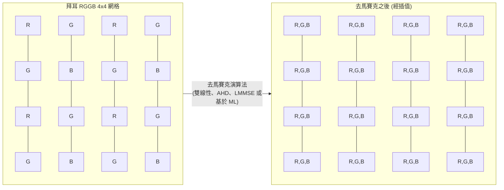
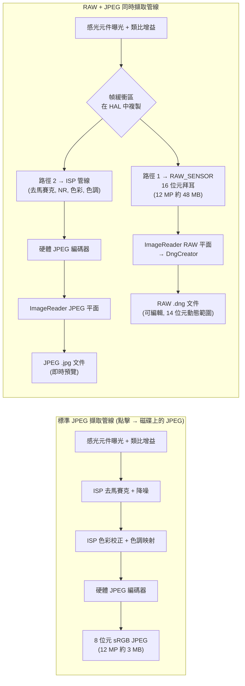

---     
sidebar_position: 18
title: "第 18 章：RAW 攝影"
description: "在 Android Camera2 API 中掌握 RAW_SENSOR 格式、使用 DngCreator 建立 DNG 文件、拜耳模式以及同時進行的 RAW+JPEG 擷取"
keywords: [Android Camera2, RAW 攝影, RAW_SENSOR, DngCreator, DNG, 拜耳模式, RGGB, JPEG_R, 相機元數據]
---

# 第 18 章：RAW 攝影

專業的行動攝影要求的不僅僅是 Android 的 ISP（影像訊號處理器）預設產生的處理後的 JPEG。當你擷取 JPEG 時，感光元件的原始數據已經過過濾、插值、色彩校正、降噪和色調映射——這破壞了攝影師賴以生存的大部分後期空間。Camera2 API 讓你能夠直接存取 **RAW_SENSOR** 格式：來自感光元件的、未經 ISP 干擾的 16 位元原始拜耳模式數據。結合 **DngCreator**，Android 框架提供了產生符合標準的 Adobe DNG（數位負片）文件所需的一切，這些文件可以直接在 Lightroom、Capture One、Photoshop 及所有專業 RAW 編輯器中打開。

本章建立在專案內部參考文件 *RAW / DngCreator* 章節的研究基礎之上，並擴充了你可以直接插入到自己應用中的實際程式碼。你可以在 **Android Camera Parameters** 應用中查看每台受支援設備的這些性能枚舉——該應用也可在 [Google Play 商店](https://play.google.com/store/apps/details?id=com.zoozooll.cameraparameters) 下載——它會報告最大的 RAW 尺寸、可用的 RAW 變體（RAW10, RAW12, RAW14）以及每個相機 ID 的 DngCreator 元數據是否填充完整。

## 為什麼選擇 RAW？ISP 處理的代價

在深入 API 細節之前，準確理解 ISP 在產生 JPEG 時到底做了什麼，以及為什麼要繞過它，是至關重要的。一個典型的智慧型手機 ISP 管線會按順序執行以下階段：

1. **黑電平鉗位 (Black level clamping)** — 減去感光元件的暗電流基準
2. **鏡頭遮蔽校正 (Lens shading correction)** — 使用逐像素增益圖消除暗角
3. **去馬賽克 (Demosaicing)** — 將每像素只有一種顏色的拜耳網格插值為完整的 RGB 影像
4. **降噪 (Noise reduction)** — 應用空間/時域濾波，這會在擦除噪聲的同時抹去精細細節
5. **色彩校正 (Color correction)** — 應用 3×3 矩陣將感光元件色彩空間映射到 sRGB
6. **伽馬 / 色調映射 (Gamma / tone mapping)** — 將場景線性的 14 檔動態範圍壓縮成非線性的 8 位元曲線
7. **邊緣增強 (Edge enhancement)** — 進行銳化以補償光學低通濾波器
8. **JPEG 壓縮** — 應用有損色度抽樣（通常是 4:2:0）和量化

這種管線的問題在於每個階段都是**不可逆的**，且是針對消費者*預覽*而非專業*後期*而調優的。JPEG 將高光限制在 100:1 的對比度，並將感光元件的 14 位元動態範圍包裹進 8 位元中——因此當你在後期拉升 2 檔陰影時，你得到的是斷層而非細節。RAW 保留了完整的線性感光元件輸出，支援 4–6 檔的陰影/高光恢復，以及不會引入色彩偽影的自定義白平衡偏移。

```mermaid
flowchart TD
    subgraph ISP["ISP 處理管線 (JPEG 路徑)"]
        S1[感光元件 RAW 數據] --> S2[黑電平鉗位]
        S2 --> S3[鏡頭遮蔽校正]
        S3 --> S4[去馬賽克]
        S4 --> S5[降噪]
        S5 --> S6[色彩校正]
        S6 --> S7[伽馬 / 色調映射]
        S7 --> S8[邊緣增強]
        S8 --> S9[JPEG 壓縮]
        S9 --> S10["8 位元 sRGB JPEG<br/>(≈6 檔可用動態範圍)"]
    end

    subgraph RAW["RAW 路徑 (無 ISP 處理)"]
        R1[感光元件 RAW 數據] --> R2["16 位元線性拜耳模式<br/>(10–14 檔可用動態範圍)"]
        R2 --> R3["DngCreator 寫入<br/>元數據 + 像素數據"]
        R3 --> R4[".dng 文件<br/>可在 Lightroom/PS 中編輯"]
    end
```



透過上圖視覺化對比兩條路徑：JPEG 路徑在每一步都會剔除數據，而 RAW 路徑保留了完整的感光元件載荷。代價是 RAW 文件**無法直接顯示**——它們需要單獨的渲染傳遞（Lightroom 中的「顯影」步驟）來解釋拜耳網格並轉換為 sRGB 或 Rec.2020 等色彩空間。

## 拜耳色彩濾波器陣列 (CFA)

RAW 數據不是 RGB。感光元件上的每個光敏點僅記錄**一種顏色**——紅、綠或藍——因為矽光電二極體本身是色盲的，只能測量光子計數（亮度）。為了重構顏色，製造商在感光元件上沉積了**色彩濾波器陣列 (CFA)**，由此產生的單通道網格以其發明者命名：拜耳模式 (Bayer pattern)。

Android 設備中存在四種常見的 CFA 佈局，由左上角 2×2 瓦片的順序標識：

| 模式 | 瓦片佈局 | 典型用例 |
|---------|-------------|------------------|
| **RGGB** | `R G / G B` | 多數智慧型手機 (三星, 索尼 Exmor RS 預設) |
| **BGGR** | `B G / G R` | 某些小米/一加設備中的索尼 IMX 感光元件 |
| **GRBG** | `G R / B G` | 某些豪威 (OmniVision) 感光元件 |
| **GBRG** | `G B / R G` | 罕見；見於某些摩托羅拉中階設備 |

拜耳網格最顯著的特徵是 **50% 的像素是綠色**，而紅色和藍色各佔 25%。這不是任意的選擇——人眼的視覺亮度響應在綠色波長（約 555 nm）處達到峰值，因此將兩倍的樣本分配給綠色可以最大限度地提高感知銳度和噪聲性能。任何產生的 JPEG 中的亮度通道約有 60% 衍生自綠色光敏點，因此綠色採樣密度直接轉換為解析出的細節。



上面的去馬賽克圖塊 (P11–P44) 展示了每個像素是如何重建的：一個 `R` 光敏點透過插值使用其鄰居的 `G` 和 `B` 值，反之亦然。這種插值是 JPEG 管線中導致影像變軟的最大來源——也正是為什麼你想在後期製作中自己完成這一步的原因。現代 AI 去馬賽克（如 Lightroom 的 AI 增強、Topaz DeNoise AI 等）可以提供比智慧型手機即時硬體 ISP 更銳利的結果。

## RAW_SENSOR 格式及其壓縮變體 (RAW10 / RAW12 / RAW14)

Android 規範的 RAW 格式識別碼是 `ImageFormat.RAW_SENSOR`，它在 `Image.getPlanes()` 返回的 `Plane` 中枚舉為每像素 16 位元的緩衝區。然而，*有效*位元深度是設備相關的，並透過 `CameraCharacteristics.SENSOR_INFO_BIT_DEPTH` 報告——超出感光元件實際 ADC 解析度的高位會被補零。

大多數當今的智慧型手機使用三種壓縮 RAW 變體之一，它們透過 `StreamConfigurationMap.getOutputSizes()` 暴露，並帶有專門的格式常量：

| 格式常量 | 位元/樣本 | 儲存佈局 | 典型感光元件世代 |
|-----------------|-------------|----------------|---------------------------|
| `RAW10`         | 10          | 壓縮：每 5 個位元組儲存 4 個樣本 (MSB 對齊) | 中階 2019–2022 感光元件 (如 IMX586, IMX682) |
| `RAW12`         | 12          | 壓縮：每 3 個位元組儲存 2 個樣本 | 旗艦 2021–2024 (如 IMX800, IMX989 一英吋級) |
| `RAW14`         | 14          | 16 位元補齊 (MSB 對齊) | 專業級 / 一英吋以上感光元件 (帶 DOL-HDR 的 IMX989) |

壓縮格式是**你必須使用具有像素步長意識的 `Buffer.getByte()` / `Buffer.getShort()`**，而不是將 RAW 緩衝區視為扁平的 short[] 陣列的原因——RAW10 和 RAW12 的樣本會跨越位元組邊界，需要位元偏移才能提取。如果你直接傳遞 `Image` 對象，`DngCreator` 會透明地處理所有這些壓縮/解壓，這也是推薦的方法。

## DNG：Adobe 數位負片標準 1.4

為什麼要編寫 `.dng` 文件而不是像 `.arw` (索尼) 或 `.cr3` (佳能) 這樣的專有格式？因為 **DNG 是唯一的通用 RAW 格式**，由 ISO 12234-2 發佈，並被所有專業照片工具鏈接受。DNG v1.4（Android 針對的版本）規定了：

- 相容 TIFF/EP 的容器（小端序 IFD 結構）
- 用於拜耳模式 (CFA)、黑電平和色彩矩陣的強制性 TIFF 標籤
- 用於雙光源設定檔的可選 `ColorMatrix2` / `CalibrationIlluminant2`
- 用於逐像素平場校正的可選鏡頭遮蔽圖 (標籤 0xC618)
- 用於 OEM 特定校準數據的可選 「makernotes」 IFD

沒有這些元數據，RAW 緩衝區只是一個無標籤的數位網格——沒有 RAW 編輯器能正確渲染它。Android 的 `android.hardware.camera2` 包中的 `DngCreator` 類別專門用於從 `CameraCharacteristics` 和 `CaptureResult` 中**自動填充所有必需的 DNG 1.4 元數據**，這意味著你的應用不需要為每台設備附帶感光元件校準數據。

`DngCreator` 寫入具體的元數據欄位包括：

| DNG 標籤 | 來源 | 用途 |
|---------|--------|---------|
| **BlackLevel** (SENSOR_BLACK_LEVEL_PATTERN) | `CameraCharacteristics` | 4 元素的逐通道暗電流基準 |
| **ColorMatrix1 / ColorMatrix2** (SENSOR_COLOR_TRANSFORM1 / 2) | `CameraCharacteristics` | 在光源 A (D65) 下將感光元件 RGB → XYZ 的 3×3 矩陣映射 |
| **CalibrationIlluminant1 / 2** | `CameraCharacteristics` | 標準光源枚舉 (17 = 標準 A, 21 = D65) |
| **ForwardMatrix1 / ForwardMatrix2** (SENSOR_FORWARD_MATRIX1 / 2) | `CameraCharacteristics` | XYZ → 感光元件 RGB 的逆變換 |
| **NeutralColorPoint** (SENSOR_NEUTRAL_COLOR_POINT) | `CameraCharacteristics` | 原生白平衡 (r/g, b/g 比率) |
| **LensShadingMap** (STATISTICS_LENS_SHADING_MAP) | `CaptureResult` | 用於消除暗角的 4 通道逐通道增益網格 |
| **CFA Pattern 2** | `CameraCharacteristics.SENSOR_INFO_COLOR_FILTER_ARRANGEMENT` | 拜耳切片編碼 |
| **BaselineExposure** | `SENSOR_REFERENCE_ILLUMINANT1` | 渲染時應用的預設曝光偏移 |

此列表直接摘自專案研究文件中的 *RAW / DngCreator* 規範。如果 Camera2 API 將其中任何欄位報告為 `null`，`DngCreator` 仍將產生有效的 DNG，但產生的文件在後期可能需要手動校準。你可以使用 **Android Camera Parameters** 應用檢查每個相機 ID 填充了哪些欄位。

## 設定同時進行的 RAW + JPEG 擷取

RAW 擷取的正確工作流程是**在單個 `CaptureRequest` 中使用多個輸出目標**——這保證了 RAW 緩衝區和 JPEG 來自*完全相同的幀*（相同的時間戳，相同的感光元件曝光），這對於大多數攝影師期望的 RAW+JPEG 備份工作流至關重要。嘗試兩次連續擷取會在曝光、AF 和 AWB 方面引入幀間差異。

### 第 1 步：查詢性能和最大 RAW 尺寸

```kotlin
import android.hardware.camera2.CameraCharacteristics
import android.hardware.camera2.params.StreamConfigurationMap
import android.util.Size
import android.graphics.ImageFormat

fun getRawCapabilities(cameraId: String,
                       characteristics: CameraCharacteristics): Pair<Boolean, Size?> {
    val caps = characteristics.get(
        CameraCharacteristics.REQUEST_AVAILABLE_CAPABILITIES
    ) ?: intArrayOf()
    val supportsRaw = caps.contains(
        CameraCharacteristics.REQUEST_AVAILABLE_CAPABILITIES_RAW
    )
    if (!supportsRaw) return Pair(false, null)

    val configMap: StreamConfigurationMap? =
        characteristics.get(CameraCharacteristics.SCALER_STREAM_CONFIGURATION_MAP)

    val rawSizes = configMap?.getOutputSizes(ImageFormat.RAW_SENSOR)
        ?: emptyArray()
    val maxRawSize = rawSizes.maxByOrNull { it.width * it.height }

    return Pair(true, maxRawSize)
}
```

`REQUEST_AVAILABLE_CAPABILITIES_RAW` 是強制性的門檻——如果未設定，HAL 將拒絕任何 RAW_SENSOR 輸出，且嘗試建立具有該格式的 `ImageReader` 將拋出 `IllegalArgumentException`。**Android Camera Parameters** 應用在其主儀表板上按相機 ID 列出了此項性能。

### 第 2 步：建立雙 ImageReader (RAW + JPEG)

```kotlin
import android.media.ImageReader
import android.graphics.ImageFormat

private var rawImageReader: ImageReader? = null
private var jpegImageReader: ImageReader? = null

fun setupDualImageReaders(rawSize: Size, jpegSize: Size) {
    rawImageReader = ImageReader.newInstance(
        rawSize.width,
        rawSize.height,
        ImageFormat.RAW_SENSOR,
        5 // 獲取緩衝區深度：>= 2, 5 為連拍預留空間
    ).apply {
        setOnImageAvailableListener(
            OnRawImageAvailableListener(),
            backgroundHandler
        )
    }

    jpegImageReader = ImageReader.newInstance(
        jpegSize.width,
        jpegSize.height,
        ImageFormat.JPEG,
        2
    ).apply {
        setOnImageAvailableListener(
            OnJpegImageAvailableListener(),
            backgroundHandler
        )
    }
}
```

RAW 的 `maxImages` 緩衝區深度應該更大 (5)，因為 RAW 緩衝區是 JPEG 頻寬的 2–4 倍，且 HAL 可能在磁碟寫入器趕上之前交付 2–3 幀。RAW 緩衝區空間耗盡會導致靜默掉幀且沒有錯誤回呼。

### 第 3 步：建立包含兩個 Surface 的 CaptureSession 並發出多目標擷取

```kotlin
import android.hardware.camera2.CameraDevice
import android.hardware.camera2.CaptureRequest
import android.view.Surface

lateinit var cameraDevice: CameraDevice

fun createCaptureSessionAndCapture(
    rawSurface: Surface,
    jpegSurface: Surface,
    previewSurface: Surface
) {
    val outputSurfaces = listOf(previewSurface, rawSurface, jpegSurface)

    cameraDevice.createCaptureSession(
        outputSurfaces,
        object : CameraCaptureSession.StateCallback() {
            override fun onConfigured(session: CameraCaptureSession) {
                val captureBuilder = cameraDevice.createCaptureRequest(
                    CameraDevice.TEMPLATE_STILL_CAPTURE
                ).apply {
                    addTarget(previewSurface)
                    addTarget(rawSurface)
                    addTarget(jpegSurface)

                    set(CaptureRequest.CONTROL_AF_MODE,
                        CaptureRequest.CONTROL_AF_MODE_CONTINUOUS_PICTURE)
                    set(CaptureRequest.CONTROL_AE_MODE,
                        CaptureRequest.CONTROL_AE_MODE_ON)
                    set(CaptureRequest.CONTROL_AWB_MODE,
                        CaptureRequest.CONTROL_AWB_MODE_OFF) // 在 RAW 模式下鎖面白平衡！
                }

                session.capture(
                    captureBuilder.build(),
                    RawCaptureCallback(),
                    backgroundHandler
                )
            }
            override fun onConfigureFailed(session: CameraCaptureSession) = Unit
        },
        backgroundHandler
    )
}
```

這裡有三個細節是不可逾越的：

1. **RAW 擷取必須鎖定 AWB (`CONTROL_AWB_MODE_OFF`)。** 如果開啟 AWB，HAL 會在連拍中途應用 RGB 增益漸變，這意味著每個 RAW 幀都有不同的原生白平衡——這破壞了 RAW 編輯器應用統一設定檔的能力。請改用 `CaptureResult.SENSOR_NEUTRAL_COLOR_POINT` 在後期推導正確的白平衡。

2. **使用 `TEMPLATE_STILL_CAPTURE`** 作為基礎模板。它將感光元件配置為最高質量的讀取模式，並禁用了 HAL 可能會注入的針對預覽的降噪。

3. **所有三個目標（預覽、RAW、JPEG）都在一個 `CaptureRequest` 中。** HAL 保證了時間上的一致交付。

### 第 4 步：使用 DngCreator 寫入 DNG 文件

`OnImageAvailableListener` 回呼接收 `Image` 對象，從中可以直接存取 RAW 像素數據。將 `Image` **和**匹配的 `CaptureResult` 連同用於打開相機的原始 `CameraCharacteristics` 一起傳遞給 `DngCreator` —— 為了正確填充所有 DNG 1.4 元數據，這一組合是必需的。

```kotlin
import android.hardware.camera2.CameraCharacteristics
import android.hardware.camera2.CaptureResult
import android.hardware.camera2.DngCreator
import android.media.Image
import java.io.File
import java.io.FileOutputStream
import java.io.IOException

inner class OnRawImageAvailableListener : ImageReader.OnImageAvailableListener {
    private val pendingDngWrites =
        HashMap<Long, CaptureResult>() // 時間戳 → CaptureResult

    fun registerCaptureResult(timestamp: Long, result: CaptureResult) {
        pendingDngWrites[timestamp] = result
    }

    override fun onImageAvailable(reader: ImageReader) {
        var image: Image? = null
        try {
            image = reader.acquireLatestImage() ?: return
            val timestamp = image.timestamp

            val captureResult = pendingDngWrites.remove(timestamp) ?: return
            val characteristics = latestCameraCharacteristics ?: return

            val dngFile = File(
                getExternalFilesDir(null),
                "RAW_${System.currentTimeMillis()}.dng"
            )

            FileOutputStream(dngFile).use { fos ->
                val dngCreator = DngCreator(characteristics, captureResult)
                dngCreator.writeByteBuffer(
                    fos,
                    image.width,
                    image.height,
                    image.planes[0].buffer,
                    0 // 填充，對於 RAW_SENSOR 始終為 0
                )
            }

        } catch (e: IOException) {
            Log.e(TAG, "寫入 DNG 文件失敗", e)
        } catch (e: IllegalStateException) {
            Log.e(TAG, "DngCreator 拒絕元數據 (缺少必填欄位)", e)
        } finally {
            image?.close() // 關鍵：絕對不要洩漏 Image 引用
        }
    }
}
```

`DngCreator` 構造函數恰好接收兩個參數：
- **`CameraCharacteristics`** — 靜態、逐相機的欄位（黑電平、色彩矩陣、CFA 模式、中性色點、光源 1 和 2）
- **`CaptureResult`** — 逐幀、動態的欄位（感光元件曝光、ISO、鏡頭遮蔽圖、AF 鏡頭位置）

如果其中任何一個為 `null`，或者缺少必填的元數據欄位（例如某些廉價設備對 `SENSOR_COLOR_TRANSFORM1` 報告 `null`），構造函數將在構造時（而非 `writeByteBuffer` 時）拋出 `IllegalArgumentException`。這就是為什麼 **Android Camera Parameters** 應用顯式報告每個 DNG 相關欄位的原因：開發者可以預先過濾設備，以避免在 HAL 實現不完整的設備上發生崩潰。

`pendingDngWrites` 時間戳映射解決了一個真實的並行問題：`CaptureResult.CaptureCallback.onCaptureCompleted()` 的觸發時機可能**早於或晚於** `OnImageAvailableListener.onImageAvailable()` (取決於 HAL)。透過 `image.timestamp` == `CaptureResult.SENSOR_TIMESTAMP` 進行比對，可以保證正確的元數據與正確的像素緩衝區配對。

## 處理管線對比 (詳細 Mermaid 圖)



此圖的關鍵啟示在於**幀複製節點 G**：HAL 從感光元件讀取一幀，然後將未經修改的副本路由到 RAW 輸出，同時將*同一*副本饋入 ISP 進行 JPEG 編碼。這保證了幀的一致性，且無需使感光元件讀取頻寬翻倍。

## 性能考量與實踐限制

將 12–48 MB 的 DNG 文件寫入快閃記憶體需要可測量的時間：
- UFS 3.1 儲存：~250 MB/s 順序寫入 → 12 MP DNG (~48 MB) 耗時約 190 ms
- eMMC 5.1 儲存：~120 MB/s 順序寫入 → 同一文件耗時約 400 ms

這意味著你**不能在 UI 執行緒上阻塞 DNG 寫入** — 務必在背景執行緒/Handler 上執行 `writeByteBuffer`，並務必在 `finally` 塊中關閉 `Image` 以避免 HAL 緩衝區匱乏。

另一个重要限制：並不是所有設備都支援在同一工作階段中同時使用 RAW + JPEG，即使設定了 `CAPABILITIES_RAW` 也是如此。正確的驗證方法是使用包含兩個 Surface 的列表呼叫 `StreamConfigurationMap.isOutputSupportedFor(surfaceList)`。如果返回 `false`，則回退到僅 RAW 的工作階段。

## 小結

本章涵蓋了 Android Camera2 中完整的端到端 RAW 攝影工作流程：

- **RAW_SENSOR 格式**提供來自感光元件的未經處理的 16 位元拜耳網格，繞過了每一個 ISP 處理階段。
- **拜耳模式** (RGGB, BGGR, GRBG, GBRG) 為綠色分配了 50% 的光敏點，用於針對人眼視覺優化的亮度採樣。
- **壓縮變體** — RAW10, RAW12, RAW14 — 以原生 ADC 位元深度儲存樣本；DngCreator 會透明地解壓它們。
- **DNG v1.4** 是通用的 RAW 容器。`DngCreator(characteristics, result).writeByteBuffer(...)` 填充了所有必需的元數據：黑電平、色彩矩陣、鏡頭遮蔽圖、中性色點以及校準光源 1 和 2。
- **多目標 CaptureRequest** 將同一幀路由到 RAW 和 JPEG ImageReader，保證了 RAW+JPEG 工作流中的幀一致性。
- 由於回呼觸發順序取決於 HAL，因此需要在 `CaptureResult` 和 `Image` 之間進行**時間戳比對**。

## 下一章

在下一章中，我們將從靜態攝影轉向影片：**第 19 章：高速影片**，我們將使用 `CameraConstrainedHighSpeedCaptureSession` 實現 120 fps（4 倍慢動作）和 240 fps（8 倍慢動作）拍攝。你將了解為什麼高速工作階段需要 `createHighSpeedRequestList` 而非單獨的 CaptureRequest，以及 HAL 的專用高速管線如何繞過正常預覽路徑，交付原本會令 CPU 不堪重負的幀率。

你可以透過安裝 **Android Camera Parameters** 應用來驗證你設備的 RAW 性能、最大 RAW 尺寸以及 DngCreator 元數據的完整性 —— 並向開源 [GitHub 倉庫](https://github.com/zoozooll/AndroidCameraParameters) 提交設備報告，幫助其他開發者了解哪些設備支援專業的 RAW 工作流。
