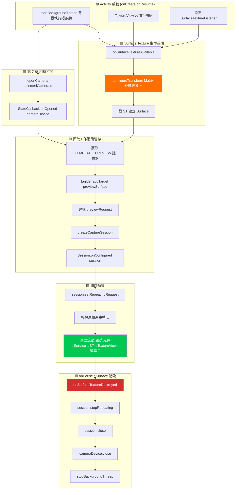

這是你一直期待的章節。在經過三章的架構搭建（權限、執行緒、CameraManager、枚舉、打開/關閉生命週期）後，你終於要**在 Android 設備螢幕上看到即時渲染的相機輸出了**。預覽是相機應用的核心——它是用戶在點擊快門前觀察畫面、檢查對焦和驗證曝光的窗口。做得好，它就是流暢響應的相機體驗；做得不好，應用就會顯得卡頓且難以使用。

如需查看處理數百種設備邊緣情況的參考預覽實現，請參閱 **Android Camera Parameters** 應用（[GitHub](https://github.com/zoozooll/AndroidCameraParameters) / [Google Play](https://play.google.com/store/apps/details?id=com.minininja.cameraparams)）中的預覽螢幕。其預覽管線包括感知朝向的變換、多解析度輸出 Surface 和平滑的幀率節流——所有這些都建立在我們在此處涵蓋的基礎組件之上。

## 預覽管線：組件概覽

在深入程式碼之前，讓我們先梳理一下單幀預覽從相機感光元件到手機螢幕的邏輯旅程。每一幀都會經過五層：

```
相機感光元件 → CameraDevice 管線 → Surface (BufferQueue) → SurfaceTexture → TextureView → 顯示器
```

每一層都扮演著特定的、不可替代的角色。跳過或忽略其中任何一層都會導致黑屏、縱橫比失調或畫面撕裂。讓我們定義每一个組件：

### 1. Surface — 影像目標緩衝區

`Surface` 是 Camera2 API 對**處理後影像幀目標**的通用概念。在底層，Surface 包裝了一个 Android `BufferQueue`：一个由系統合成器 (SurfaceFlinger) 管理的圖形緩衝區環形佇列（通常深度為 3–5 個緩衝區）。當 Camera2 向 Surface 「渲染一幀」時，它從佇列中取出一个空緩衝區，填入像素數據，然後將其放回佇列供消費者使用。

任何能消耗圖形緩衝區的組件都可以暴露一个 `Surface`。最常見的消費者包括：
- **SurfaceTexture** → 饋送給 `TextureView`（用於螢幕預覽——本章內容）
- **MediaRecorder/MediaCodec 的 Surface** → 影片編碼（本系列不涵蓋）
- **ImageReader Surface** → 供 CPU 存取的用於 JPEG/RAW 拍攝的 `Image` 物件（第 9 章）

### 2. SurfaceTexture — GPU 到 GPU 的橋樑

`SurfaceTexture` 是一个魔法類別，它將原始的相機幀串流轉換為 GPU 可以採樣並渲染的紋理。它是 Surface 的 BufferQueue 的消費者端，但它並不將緩衝區交給 CPU，而是將其轉換為 OpenGL ES `GL_TEXTURE_EXTERNAL_OES` 紋理。這使得 `TextureView` 可以使用標準 GPU 渲染將相機幀合成到視圖層級中——無需 CPU 拷貝，因此輕而易舉地實現 60+ FPS 的預覽。

你可以透過以下方式獲取 `SurfaceTexture` 的 `Surface`：
```kotlin
val surface = Surface(surfaceTexture)
```

### 3. TextureView — 螢幕上的視窗

`TextureView` 是一个 `View` 子類別，可以顯示 `SurfaceTexture` 的內容。它是舊版 `SurfaceView` 的現代繼承者，是 Camera2 預覽的推薦選擇，原因有三：
- 它的行為類似於正常的 View（可以進行動畫處理、變換、透明混合、放置在可滾動容器中）。
- 它不強制 Activity 使用透明視窗（不像 SurfaceView 會在視圖層級中打一个「洞」）。
- 它的 `SurfaceTextureListener` 提供了精確的生命週期回呼，告知 Surface 何時建立、銷毀或調整大小。

為了透過回呼存取底層的 SurfaceTexture，`TextureView` 暴露了 `setSurfaceTextureListener()`，包含四個回呼：
- `onSurfaceTextureAvailable(surfaceTexture, width, height)` — Surface 已準備好接收幀（在視圖佈局完成後觸發一次）。
- `onSurfaceTextureSizeChanged(surfaceTexture, width, height)` — Surface 尺寸發生變化（例如設備旋轉）。
- `onSurfaceTextureDestroyed(surfaceTexture)` — 即將被銷毀；我們必須在此返回前停止預覽。
- `onSurfaceTextureUpdated(surfaceTexture)` — **每一新幀**都會觸發（可用於驅動人臉追蹤覆蓋層等）。

### 4. CameraCaptureSession — 已配置的管線

在 `CameraDevice` 產生任何幀之前，你必須建立一个 `CameraCaptureSession`。工作階段是**相機管線將寫入的所有輸出 Surface 的配置**。你可以將其視為對相機 ISP（影像訊號處理器）進行「接管」，將其輸出路由到一个或多個接收器。對於僅預覽模式，工作階段只有一个 Surface（TextureView 的）。當我們要在第 9 章添加照片拍攝時，工作階段將有兩個 Surface：預覽 + `ImageReader`。

關鍵規則：
- 工作階段透過 `CameraDevice.createCaptureSession(outputSurfaces, stateCallback, handler)` 建立。
- 工作階段僅在 `StateCallback.onConfigured(session)` 觸發**後**才可用。
- 一个 `CameraDevice` **一次只能有一个活動工作階段**。建立新工作階段會關閉前一个。
- 工作階段在其生命週期內擁有*所有*輸出；添加新 Surface（例如突然決定錄製影片）需要拆除舊工作階段並建立一个包含所有 Surface（預覽 + 錄製器）的新工作階段。

### 5. 重複擷取請求 (TEMPLATE_PREVIEW)

配置好工作階段後，連續預覽是如何實現的？Camera2 是一个請求驅動的 API——每一幀都是提交給工作階段的一个 `CaptureRequest`。對於預覽，我們提交**一个請求並將其標記為重複 (repeating)**：相機硬體將不斷重複執行該請求（使用相同的感光元件設定、目標和 3A 狀態），以管線允許的最快速度（通常 30–120 FPS）產生畫面。

透過以下方式提交重複請求：
```kotlin
session.setRepeatingRequest(previewRequest, captureCallback, backgroundHandler)
```

預覽模板是 `CameraDevice.TEMPLATE_PREVIEW`。Camera2 提供了幾種預建構模板，它們會根據用例適當地配置數百個低級參數（曝光、幀率範圍、3A 模式、降噪等）。對於預覽，`TEMPLATE_PREVIEW` 針對**低延遲和平滑幀率**進行了優化，即使這意味著與 `TEMPLATE_STILL_CAPTURE`（第 9 章用於照片）相比，感光元件的動態範圍會略有降低。

## 端到端預覽流程圖

下面的流程圖顯示了所有這些組件是如何連接的。閱讀程式碼時請仔細對照——每個方塊都對應一个真實的函式呼叫。



橙色高亮方塊 (`configureTransform`) 和綠色高亮方塊 (即時預覽) 是兩個最關鍵的步驟。跳過 `configureTransform`，你的預覽將被拉伸、旋轉或擠壓。如果正確連接了其他所有部分但未能呼叫 `setRepeatingRequest`，螢幕將保持黑色且不會記錄任何錯誤。

## 第 1 步：將 TextureView 添加到佈局 XML

首先，建立或更新 `app/src/main/res/layout/activity_main.xml` 以包含全螢幕 `TextureView`。我們還將添加一个 `TextView` 覆蓋層作為狀態指示器，以便我們可以看到預覽尺寸。

```xml
<?xml version="1.0" encoding="utf-8"?>
<FrameLayout xmlns:android="http://schemas.android.com/apk/res/android"
    xmlns:tools="http://schemas.android.com/tools"
    android:layout_width="match_parent"
    android:layout_height="match_parent">

    <TextureView
        android:id="@+id/textureView"
        android:layout_width="match_parent"
        android:layout_height="match_parent"
        android:layout_gravity="center" />

    <TextView
        android:id="@+id/statusTextView"
        android:layout_width="wrap_content"
        android:layout_height="wrap_content"
        android:layout_gravity="top|center_horizontal"
        android:layout_marginTop="16dp"
        android:background="#80000000"
        android:padding="8dp"
        android:textColor="#FFFFFFFF"
        android:textSize="12sp"
        tools:text="正在初始化相機..." />

</FrameLayout>
```

為什麼要用 `FrameLayout` 作為根視圖？因為預覽是一个全螢幕層，而 `FrameLayout` 會按 Z 軸順序堆疊子視圖（後添加的子視圖繪在頂部）。稍後我們將添加一个快門按鈕覆蓋層。`TextureView` 在兩個維度上都使用 `match_parent`——但別擔心，我們稍後會使用 `configureTransform` 進行正確的黑邊填充處理（letterboxing），這樣即使視圖填滿螢幕，像素本身也永遠不會被拉伸。

## 第 2 步：configureTransform — 正確預覽縱橫比的秘訣

如果你什麼都不做，只是將畫面傳輸到全螢幕 TextureView，預覽將會被**拉伸**。為什麼？因為相機感光元件具有固定的縱橫比（靜態拍攝幾乎總是 4:3，影片模式有時是 16:9），而手機螢幕具有不同的縱橫比（現代旗艦機通常約為 20:9）。如果相機輸出 4032×3024 (4:3) 的預覽幀，而 TextureView 將其拉伸到 1080×2400 (20:9)，人臉看起來就會又瘦又長。

解決方案是 **`configureTransform(viewWidth: Int, viewHeight: Int)`**：一个計算 `Matrix`（旋轉 + 中心裁剪縮放）並將其應用於 TextureView 的方法。該矩陣做三件事：
1. 根據設備相對於相機感光元件自然方向旋轉的角度，**旋轉**影像。
2. **縮放**影像，使其在保持縱橫比同時填滿整個 TextureView（中心裁剪風格，或者如果你願意，也可以留黑邊）。
3. **重新居中**縮放/旋轉後的影像，使其位於視圖正中。

這是官方 Android Camera2 範例中最常被複製的函式——每個開發者都需要它，而且很容易出錯。以下是標準版本：

```kotlin
/**
 * 配置 `textureView` 所需的 Matrix 變換。
 * 此方法應在確定相機預覽尺寸且 `textureView` 尺寸固定後呼叫。
 *
 * @param viewWidth  `textureView` 的寬度
 * @param viewHeight `textureView` 的高度
 * @param previewSize 相機選定的預覽尺寸 (width, height)
 * @param sensorOrientationDegrees 相機的 SENSOR_ORIENTATION 特性
 * @param deviceDisplayRotationDegrees 螢幕相對於自然方向的旋轉角度 (0/90/180/270)
 */
private fun configureTransform(
    viewWidth: Int,
    viewHeight: Int,
    previewSize: android.util.Size,
    sensorOrientationDegrees: Int,
    deviceDisplayRotationDegrees: Int
) {
    val rotation = when (deviceDisplayRotationDegrees) {
        android.view.Surface.ROTATION_0 -> 0
        android.view.Surface.ROTATION_90 -> 90
        android.view.Surface.ROTATION_180 -> 180
        android.view.Surface.ROTATION_270 -> 270
        else -> return
    }

    val matrix = android.graphics.Matrix()
    val viewRect = android.graphics.RectF(0f, 0f, viewWidth.toFloat(), viewHeight.toFloat())
    val bufferRect = android.graphics.RectF(
        0f,
        0f,
        previewSize.height.toFloat(),
        previewSize.width.toFloat()
    )
    val centerX = viewRect.centerX()
    val centerY = viewRect.centerY()

    // 第 1 步：考慮設備相對於感光元件方向的旋轉
    if (Surface.ROTATION_90 == rotation || Surface.ROTATION_270 == rotation) {
        bufferRect.offset(centerX - bufferRect.centerX(), centerY - bufferRect.centerY())
        matrix.setRectToRect(viewRect, bufferRect, android.graphics.Matrix.ScaleToFit.FILL)
        val scale = maxOf(
            viewHeight.toFloat() / previewSize.height,
            viewWidth.toFloat() / previewSize.width
        )
        matrix.postScale(scale, scale, centerX, centerY)
        matrix.postRotate(
            (90 * (rotation - 2)).toFloat(),
            centerX,
            centerY
        )
    } else if (Surface.ROTATION_180 == rotation) {
        matrix.postRotate(180f, centerX, centerY)
    }

    // 第 2 步：還要考慮感光元件相對於設備的安裝方式
    val relativeRotation = (sensorOrientationDegrees - rotation + 360) % 360
    if (relativeRotation != 0) {
        matrix.postRotate(relativeRotation.toFloat(), centerX, centerY)
    }

    textureView.setTransform(matrix)
}
```

一个關鍵細節：`previewSize` 是相機的輸出尺寸，按**感光元件方向**報告為 (width, height)。TextureView 的維度按**顯示方向**計算。使用交換了寬/高的 RectF 技巧（`bufferRect` 使用 `previewSize.height` 作為寬度，反之亦然）解決了這種感光元件與顯示器座標的翻轉。

你需要兩項 CameraCharacteristics 資訊來呼叫此方法：
- `SENSOR_ORIENTATION` — 感光元件相對於設備自然方向旋轉的角度。對於後置相機，這幾乎總是 90°。對於前置相機，通常是 270°（以便影像正確鏡像）。在發現階段為每個相機讀取一次。
- 螢幕旋轉角度 — 來自 `(getSystemService(Context.WINDOW_SERVICE) as WindowManager).defaultDisplay.rotation`（在較新的 API 上使用 `display?.rotation`）。

## 第 3 步：從 SCALER_STREAM_CONFIGURATION_MAP 中選擇預覽尺寸

在編寫 `configureTransform` 或建立工作階段之前，我們需要知道相機可以輸出什麼預覽尺寸。對於每個相機，`CameraCharacteristics.SCALER_STREAM_CONFIGURATION_MAP` 會返回一个 `StreamConfigurationMap`，其中包含相機可以產出的所有有效（格式，尺寸）對。對於 `SurfaceTexture` 上的預覽，我們針對類別 `SurfaceTexture::class.java` 查詢輸出尺寸：

```kotlin
private fun chooseOptimalPreviewSize(
    characteristics: CameraCharacteristics,
    maxWidth: Int,
    maxHeight: Int,
    targetAspectRatio: Double
): android.util.Size {
    val map = characteristics.get(CameraCharacteristics.SCALER_STREAM_CONFIGURATION_MAP)
        ?: throw IllegalStateException("無可用串流配置映射")

    // SurfaceTexture 輸出（預覽類別）支援的所有尺寸
    val choices = map.getOutputSizes(SurfaceTexture::class.java).toList()

    // 優先選擇匹配縱橫比的尺寸，然後是符合最大維度的尺寸，
    // 最後在剩餘尺寸中挑選最大的（畫質最好的）。
    val acceptable = choices.filter {
        it.width <= maxWidth
            && it.height <= maxHeight
            && Math.abs(it.width.toDouble() / it.height - targetAspectRatio) < 0.02
    }

    val chosen = acceptable.ifEmpty { choices }
        .maxByOrNull { it.width * it.height }!!

    Log.d(TAG, "選定的預覽尺寸: ${chosen.width}x${chosen.height} " +
        "(來自 ${choices.size} 個選項, 最大允許尺寸=${maxWidth}x${maxHeight})")
    return chosen
}
```

常識性的預設參數：`maxWidth = 1920`, `maxHeight = 1080`, `targetAspectRatio = textureView.width.toDouble() / textureView.height`。預覽 Surface 不需要 4K——1080p 足以在手機螢幕上取景，耗電更少，並能保持較低的管線延遲。

## 第 4 步：第 8 章完整程式碼 — 即時預覽

以下是整合了本章所有部分的完整 `MainActivity.kt`：基於佈局的 `TextureView`、`SurfaceTextureListener`、尺寸選擇、`configureTransform`、`CameraCaptureSession` 建立，以及最重要的 `setRepeatingRequest(TEMPLATE_PREVIEW)`。

```kotlin
package com.example.camera2tutorial

import android.Manifest
import android.content.Context
import android.content.pm.PackageManager
import android.graphics.Matrix
import android.graphics.RectF
import android.graphics.SurfaceTexture
import android.hardware.camera2.CameraAccessException
import android.hardware.camera2.CameraCharacteristics
import android.hardware.camera2.CameraCaptureSession
import android.hardware.camera2.CameraDevice
import android.hardware.camera2.CameraManager
import android.hardware.camera2.CaptureRequest
import android.hardware.camera2.params.StreamConfigurationMap
import android.os.Bundle
import android.os.Handler
import android.os.HandlerThread
import android.util.Log
import android.util.Size
import android.view.Surface
import android.view.TextureView
import android.view.WindowManager
import android.widget.TextView
import android.widget.Toast
import androidx.appcompat.app.AppCompatActivity
import androidx.core.app.ActivityCompat
import androidx.core.content.ContextCompat
import java.util.Collections
import java.util.concurrent.Semaphore
import java.util.concurrent.TimeUnit
import kotlin.math.max
import kotlin.math.min

class MainActivity : AppCompatActivity() {

    // UI
    private lateinit var textureView: TextureView
    private lateinit var statusTextView: TextView

    // 執行緒
    private lateinit var backgroundThread: HandlerThread
    private lateinit var backgroundHandler: Handler

    // 相機
    private lateinit var cameraManager: CameraManager
    private var cameraDevice: CameraDevice? = null
    private var captureSession: CameraCaptureSession? = null
    private var previewRequestBuilder: CaptureRequest.Builder? = null
    private var previewRequest: CaptureRequest? = null
    private var selectedCameraId: String? = null
    private var sensorOrientation = 0
    private lateinit var previewSize: Size

    private val cameraOpenCloseLock = Semaphore(1)

    // ------------------------- 生命週期 -------------------------
    override fun onCreate(savedInstanceState: Bundle?) {
        super.onCreate(savedInstanceState)
        setContentView(R.layout.activity_main)

        textureView = findViewById(R.id.textureView)
        statusTextView = findViewById(R.id.statusTextView)
        statusTextView.text = "正在等待 TextureView 佈局..."

        if (allPermissionsGranted()) {
            initializeCameraManager()
        } else {
            ActivityCompat.requestPermissions(
                this, REQUIRED_PERMISSIONS, REQUEST_CODE_PERMISSIONS
            )
        }
    }

    override fun onResume() {
        super.onResume()
        startBackgroundThread()

        if (allPermissionsGranted()) {
            if (!this::cameraManager.isInitialized) initializeCameraManager()
            // 如果 texture view 已經可用，現在就打開相機並建立工作階段
            if (textureView.isAvailable) {
                openCameraAndStartPreview(textureView.width, textureView.height)
            }
        } else {
            ActivityCompat.requestPermissions(
                this, REQUIRED_PERMISSIONS, REQUEST_CODE_PERMISSIONS
            )
        }
    }

    override fun onPause() {
        closeCameraAndPreview()
        stopBackgroundThread()
        super.onPause()
    }

    private fun startBackgroundThread() {
        backgroundThread = HandlerThread("Camera2Background").apply { start() }
        backgroundHandler = Handler(backgroundThread.looper)
    }

    private fun stopBackgroundThread() {
        backgroundThread.quitSafely()
        try { backgroundThread.join(1000) } catch (_: InterruptedException) {}
    }

    // ------------------------- 第 6 章簡略版：發現 -------------------------
    data class CameraInfo(val id: String, val facing: Int?, val hwLevel: Int?, val chars: CameraCharacteristics)

    private fun initializeCameraManager() {
        cameraManager = getSystemService(Context.CAMERA_SERVICE) as CameraManager
        val discovered = mutableListOf<CameraInfo>()
        for (id in cameraManager.cameraIdList) {
            val chars = try { cameraManager.getCameraCharacteristics(id) } catch (_: Exception) { continue }
            discovered += CameraInfo(
                id,
                chars.get(CameraCharacteristics.LENS_FACING),
                chars.get(CameraCharacteristics.INFO_SUPPORTED_HARDWARE_LEVEL),
                chars
            )
        }
        val chosen = discovered
            .sortedWith(
                compareByDescending<CameraInfo> { it.facing == CameraCharacteristics.LENS_FACING_BACK }
                    .thenByDescending { it.hwLevel ?: -1 }
            )
            .first()
        selectedCameraId = chosen.id
        sensorOrientation = chosen.chars.get(CameraCharacteristics.SENSOR_ORIENTATION) ?: 90

        Log.d(TAG, "選定的相機 ID=$selectedCameraId, sensorOrientation=$sensorOrientation°")

        // 掛接 SurfaceTexture 監聽器 — 它將觸發實際的預覽啟動
        textureView.surfaceTextureListener = object : TextureView.SurfaceTextureListener {
            override fun onSurfaceTextureAvailable(st: SurfaceTexture, width: Int, height: Int) {
                Log.d(TAG, "✅ SurfaceTexture 可用: ${width}x$height")
                statusTextView.text = "SurfaceTexture 已就緒 — 正在打開相機..."
                openCameraAndStartPreview(width, height)
            }
            override fun onSurfaceTextureSizeChanged(st: SurfaceTexture, w: Int, h: Int) {
                if (this@MainActivity::previewSize.isInitialized) {
                    configureTransform(w, h)
                }
            }
            override fun onSurfaceTextureDestroyed(st: SurfaceTexture): Boolean {
                Log.d(TAG, "⛔ SurfaceTexture 已銷毀")
                return true
            }
            override fun onSurfaceTextureUpdated(st: SurfaceTexture) {
                // 每一幀都會被呼叫。此處工作應保持 <1ms。如果需要可以計算幀數以得出 FPS。
            }
        }
    }

    // ------------------------- 第 7 章簡略版：openCamera -------------------------
    private val deviceStateCallback = object : CameraDevice.StateCallback() {
        override fun onOpened(camera: CameraDevice) {
            cameraOpenCloseLock.release()
            cameraDevice = camera
            Log.d(TAG, "✅ 相機 ${camera.id} 已打開 → 正在建立擷取工作階段")
            statusTextView.text = "相機已打開 — 正在建立擷取工作階段..."

            // ⬇️ 第 8 章：相機已打開且 SurfaceTexture 可用，
            // 我們現在建立擷取工作階段
            createCaptureSession()
        }
        override fun onDisconnected(camera: CameraDevice) {
            cameraOpenCloseLock.release()
            cameraDevice?.close()
            cameraDevice = null
            Log.w(TAG, "相機 ${camera.id} 已斷開連接")
        }
        override fun onError(camera: CameraDevice, error: Int) {
            cameraOpenCloseLock.release()
            cameraDevice?.close()
            cameraDevice = null
            val msg = when (error) {
                ERROR_CAMERA_IN_USE -> "相機正被另一个應用使用"
                else -> "相機錯誤 $error"
            }
            Toast.makeText(this@MainActivity, msg, Toast.LENGTH_LONG).show()
        }
    }

    // ------------------------- 🎯 第 8 章：預覽管線 -------------------------
    private fun openCameraAndStartPreview(viewWidth: Int, viewHeight: Int) {
        val camId = selectedCameraId ?: return
        if (ContextCompat.checkSelfPermission(this, Manifest.permission.CAMERA)
            != PackageManager.PERMISSION_GRANTED) return
        if (!cameraOpenCloseLock.tryAcquire(2500, TimeUnit.MILLISECONDS)) {
            Toast.makeText(this, "相機鎖定逾時", Toast.LENGTH_SHORT).show()
            return
        }

        // 1) 在打開工作階段之前確定預覽尺寸
        val chars = cameraManager.getCameraCharacteristics(camId)
        previewSize = chooseOptimalPreviewSize(chars, viewWidth, viewHeight)

        // 2) 向 TextureView 應用縱橫比校正變換
        configureTransform(viewWidth, viewHeight)

        // 3) 配置 SurfaceTexture 緩衝區尺寸，以比對選定的預覽尺寸
        textureView.surfaceTexture!!.setDefaultBufferSize(previewSize.width, previewSize.height)

        statusTextView.text = "預覽尺寸: ${previewSize.width}×${previewSize.height}"

        // 4) 打開相機 — 工作階段建立將在 onOpened → createCaptureSession() 中繼續
        try {
            cameraManager.openCamera(camId, deviceStateCallback, backgroundHandler)
        } catch (e: CameraAccessException) {
            cameraOpenCloseLock.release()
            Toast.makeText(this, "無法打開相機: ${e.reason}", Toast.LENGTH_LONG).show()
        }
    }

    /**
     * 建立一個唯一的輸出 Surface 是 TextureView 預覽 Surface 的 CameraCaptureSession。
     * 然後建構一个 TEMPLATE_PREVIEW 請求並開始重複。
     */
    private fun createCaptureSession() {
        val camera = cameraDevice ?: return
        val texture = textureView.surfaceTexture ?: return

        val previewSurface = Surface(texture)
        val outputSurfaces = Collections.singletonList(previewSurface)

        try {
            // 一次性建構 TEMPLATE_PREVIEW CaptureRequest.Builder
            previewRequestBuilder =
                camera.createCaptureRequest(CameraDevice.TEMPLATE_PREVIEW).apply {
                    addTarget(previewSurface)
                }

            // 建立擷取工作階段
            camera.createCaptureSession(
                outputSurfaces,
                object : CameraCaptureSession.StateCallback() {
                    override fun onConfigured(session: CameraCaptureSession) {
                        captureSession = session
                        previewRequest = previewRequestBuilder!!.build()
                        Log.d(TAG, "✅ CaptureSession 已配置 → 正在啟動重複預覽")
                        statusTextView.text = "🎥 即時預覽: ${previewSize.width}×${previewSize.height}"

                        // ⭐ 啟動預覽的神奇一行：
                        session.setRepeatingRequest(
                            previewRequest!!,
                            null,  // 預覽不需要每幀元數據，故 CaptureCallback 為 null
                            backgroundHandler
                        )
                    }

                    override fun onConfigureFailed(session: CameraCaptureSession) {
                        Log.e(TAG, "❌ CaptureSession 配置失敗")
                        Toast.makeText(
                            this@MainActivity,
                            "擷取工作階段失敗 — 預覽不可用",
                            Toast.LENGTH_LONG
                        ).show()
                    }

                    override fun onClosed(session: CameraCaptureSession) {
                        // 可選：對稱清理掛鉤
                        if (captureSession === session) captureSession = null
                    }
                },
                backgroundHandler
            )
        } catch (e: CameraAccessException) {
            Log.e(TAG, "createCaptureSession 拋出了 CameraAccessException", e)
        } catch (e: IllegalStateException) {
            Log.e(TAG, "建立工作階段時相機已關閉", e)
        }
    }

    /**
     * 選擇與視圖縱橫比相匹配且符合給定最大維度的最大預覽尺寸。
     */
    private fun chooseOptimalPreviewSize(
        characteristics: CameraCharacteristics,
        viewWidth: Int,
        viewHeight: Int
    ): Size {
        val map: StreamConfigurationMap =
            characteristics.get(CameraCharacteristics.SCALER_STREAM_CONFIGURATION_MAP)
                ?: throw IllegalStateException("StreamConfigurationMap 不可用")

        val viewAspect = max(viewWidth, viewHeight).toDouble() / min(viewWidth, viewHeight)
        val choices = map.getOutputSizes(SurfaceTexture::class.java).toList()

        // 預覽的合理上限 — 不需要 4K 預覽串流
        val maxPreviewPixels = 1920 * 1080

        val aspectMatches = choices.filter {
            val szAspect = max(it.width, it.height).toDouble() / min(it.width, it.height)
            kotlin.math.abs(szAspect - viewAspect) < 0.02
                && (it.width * it.height) <= maxPreviewPixels * 2
        }

        val final = aspectMatches.ifEmpty { choices }
            .sortedByDescending { it.width * it.height }
            .first()

        Log.d(TAG, "預覽尺寸選擇: ${final.width}×${final.height} " +
            "(來自 ${choices.size} 個選項, 目標縱橫比=%.2f)".format(viewAspect))
        return final
    }

    /**
     * 向 TextureView 應用 Matrix，以便預覽像素以正確的縱橫比（不拉伸）和正確的朝向（不旋轉）進行渲染。
     */
    private fun configureTransform(viewWidth: Int, viewHeight: Int) {
        if (!this::previewSize.isInitialized) return
        val rotation = (getSystemService(Context.WINDOW_SERVICE) as WindowManager)
            .defaultDisplay.rotation
        val matrix = Matrix()
        val viewRect = RectF(0f, 0f, viewWidth.toFloat(), viewHeight.toFloat())
        val bufferRect = RectF(
            0f, 0f,
            previewSize.height.toFloat(),
            previewSize.width.toFloat()
        )
        val cx = viewRect.centerX()
        val cy = viewRect.centerY()
        bufferRect.offset(cx - bufferRect.centerX(), cy - bufferRect.centerY())
        matrix.setRectToRect(viewRect, bufferRect, Matrix.ScaleToFit.FILL)
        val scale = max(
            viewHeight.toFloat() / previewSize.height,
            viewWidth.toFloat() / previewSize.width
        )
        matrix.postScale(scale, scale, cx, cy)
        val rotationDegrees = when (rotation) {
            Surface.ROTATION_0 -> sensorOrientation
            Surface.ROTATION_90 -> 0
            Surface.ROTATION_180 -> 360 - sensorOrientation
            Surface.ROTATION_270 -> 180
            else -> 0
        }
        matrix.postRotate(rotationDegrees.toFloat(), cx, cy)
        textureView.setTransform(matrix)
        Log.d(TAG, "已應用 configureTransform (旋轉角度=$rotationDegrees°, 縮放倍率=%.2f)".format(scale))
    }

    // ------------------------- 拆除 -------------------------
    private fun closeCameraAndPreview() {
        try {
            cameraOpenCloseLock.acquire()

            captureSession?.apply {
                try {
                    stopRepeating()
                    abortCaptures()
                } catch (_: CameraAccessException) {}
                close()
            }
            captureSession = null

            cameraDevice?.close()
            cameraDevice = null

            Log.d(TAG, "🔒 預覽和相機已完全拆除")
        } catch (_: InterruptedException) {
        } finally {
            cameraOpenCloseLock.release()
        }
    }

    // ------------------------- 樣板程式碼 -------------------------
    companion object {
        private const val TAG = "Camera2Tutorial"
        private const val REQUEST_CODE_PERMISSIONS = 10
        private val REQUIRED_PERMISSIONS = arrayOf(Manifest.permission.CAMERA)
    }

    private fun allPermissionsGranted() = REQUIRED_PERMISSIONS.all {
        ContextCompat.checkSelfPermission(baseContext, it) == PackageManager.PERMISSION_GRANTED
    }

    override fun onRequestPermissionsResult(
        requestCode: Int, permissions: Array<out String>, grantResults: IntArray
    ) {
        super.onRequestPermissionsResult(requestCode, permissions, grantResults)
        if (requestCode == REQUEST_CODE_PERMISSIONS) {
            if (allPermissionsGranted()) {
                initializeCameraManager()
            } else {
                Toast.makeText(this, "需要相機權限", Toast.LENGTH_LONG).show()
                finish()
            }
        }
    }
}
```

### 真正啟動預覽的 5 行程式碼

在 350 多行基礎程式碼中，上述程式碼中僅有的**五個連續語句**負責真正將畫面呈現到螢幕上：

```kotlin
// 行 A：建構一個針對預覽 Surface 的 TEMPLATE_PREVIEW 請求
previewRequestBuilder = camera.createCaptureRequest(CameraDevice.TEMPLATE_PREVIEW).apply {
    addTarget(previewSurface)
}

// 行 B：建立以預覽 Surface 為輸出的擷取工作階段
camera.createCaptureSession(outputSurfaces, object : CameraCaptureSession.StateCallback() {
    override fun onConfigured(session: CameraCaptureSession) {
        // 行 C：從建構器建構不可變的 CaptureRequest
        previewRequest = previewRequestBuilder!!.build()
        // 行 D：⭐ 啟動連續重複的預覽幀串流
        session.setRepeatingRequest(previewRequest!!, null, backgroundHandler)
    }
}, backgroundHandler)
```

跳過 `addTarget(previewSurface)`，工作階段將不知道將畫面發送到哪裡，導致黑屏。跳過 `setRepeatingRequest`，相機將等待一个永遠不會到來的擷取——同樣會黑屏。搞錯建構器模板（使用 `TEMPLATE_STILL_CAPTURE` 而非 `TEMPLATE_PREVIEW`），預覽畫面將以 5 FPS 的低速產生。這五行（外加用於校正縱橫比的 `configureTransform`）必須全部正確。

## 驗證：成功後的表現

當你在物理設備上執行第 8 章的應用時，你應該觀察到以下行為，將其作為一系列檢查點：

1. **閃屏 (0s)**：狀態顯示 *「正在等待 TextureView 佈局...」* —— 視圖正在被加載填充。
2. **SurfaceTexture 就緒 (~0.1s)**：狀態更新為 *「SurfaceTexture 已就緒 — 正在打開相機...」*。`onSurfaceTextureAvailable` 回呼已觸發。
3. **相機已打開 (~0.5s)**：狀態更改為 *「相機已打開 — 正在建立擷取工作階段...」*。Logcat 顯示了 `previewSize` 選擇行和 `configureTransform applied` 行。
4. **工作階段已配置 (~0.7s)**：狀態更改為 **🎥 即時預覽: 1920×1080**，並且**你在螢幕上看到了相機影像**！畫面流暢 (30–60 FPS)，朝向正確，縱橫比看起來很自然（人臉没有被拉伸）。
5. **按下主螢幕鍵 / 將應用置於背景**：Logcat 顯示 `🔒 預覽和相機已完全拆除`。當你返回時，預覽會立即恢復。
6. **將設備旋轉至橫向**：`onSurfaceTextureSizeChanged` 觸發，`configureTransform` 以新維度重新執行，預覽在橫向模式下正確地重新居中，且没有發生故障。

如果你没有看到預覽影像，請系統地檢查上述五個啟動行，並確認在建立工作階段之前在 `SurfaceTexture` 上呼叫了 `setDefaultBufferSize`。這一步 (`textureView.surfaceTexture!!.setDefaultBufferSize(previewSize.width, previewSize.height)`) 是一个**無聲失敗點**：如果漏掉它，某些設備會交付全黑畫面且没有任何錯誤訊息。

## 預覽問題排查

### 黑屏，Logcat 中無錯誤

這是第 8 章中最常見也最令人沮喪的 bug。請按順序檢查：

1. **是否呼叫了 `setDefaultBufferSize`？** 它必須使用與工作階段所用的相同的 `previewSize.width/height`，且必須在工作階段建立之前呼叫。
2. **是否執行了 `addTarget(previewSurface)`？** 在 `.build()` 之前記錄 `previewRequestBuilder` 上的目標列表。
3. **`setRepeatingRequest` 是否真的觸發了？** 添加一个 `CaptureCallback`（將 `null` 替換為記錄 `onCaptureStarted` 的回呼），看看是否正在產生幀。如果 `onCaptureStarted` 從未觸發，則說明工作階段從未進入活動狀態——回溯檢查 `onConfigured` 與 `onConfigureFailed`。
4. **Activity 上是否設定了 `hardwareAccelerated="true"`？**（第 2 章的要求。）如果未設定，TextureView 將靜默地不進行渲染。

### 預覽倒置或旋轉了 90°

你的 `configureTransform` 函式不正確。在 `configureTransform` 內部為 `rotationDegrees` 添加偵錯日誌，並與 `sensorOrientation` 進行比較。一个常見的 bug 是：感光元件旋轉和設備旋轉的應用順序不對。對於 Pixel 系列，後置感光元件相對於自然方向旋轉了 90°；在某些三星設備上，它們旋轉了 270°。請始終讀取 `SENSOR_ORIENTATION` 而不是硬編碼。

### 預覽顯得拉伸（人臉又瘦又長或又扁又寬）

這意味著 `configureTransform` 執行了但没有正確縮放。記錄 `viewAspect`、最終選定的 `previewSize` 縱橫比以及 `scale` 變數。`scale` 應當 >1.0（中心裁剪）或 &lt;1.0（留黑邊）。如果 `scale` 正好是 1.0 且縱橫比不匹配，則說明你在拉伸像素以填充視圖。

### 預覽幀率過低（感覺像是 5–10 FPS）

檢查兩件事：
1. **所用模板**：`TEMPLATE_STILL_CAPTURE` 以靜態拍攝幀率（較低）執行。你必須使用 `TEMPLATE_PREVIEW`。
2. **預覽尺寸**：`chooseOptimalPreviewSize` 是否選擇了 4K (3840×2160) 預覽？這大約是 1080p 像素量的 8 倍，會拖慢入門級設備的幀率。請參考上述程式碼添加 `maxPreviewPixels` 上限。

## 小結

本章是對所有基礎架構工作的回報。你現在擁有了一个可以工作的相機預覽應用。你學到了：

1. **預覽管線的五個組件**：`Surface`（緩衝區佇列）、`SurfaceTexture` (GPU 紋理轉換)、`TextureView`（螢幕顯示）、`CameraCaptureSession`（將所有輸出連接在一起）以及重複的 `TEMPLATE_PREVIEW` 類型的 `CaptureRequest`（連續幀產生）。
2. **TextureView + SurfaceTextureListener**：如何透過 XML 佈局設定全螢幕 TextureView，掛接 `onSurfaceTextureAvailable` 以獲知 GPU Surface 何時就緒，並為執行時的尺寸調整/重新定向連接 `onSurfaceTextureSizeChanged`。
3. **預覽尺寸選擇**：如何讀取 `SCALER_STREAM_CONFIGURATION_MAP`，查詢 `getOutputSizes(SurfaceTexture::class.java)`，並在保持 1080p 上限以確保低延遲和低功耗的前提下，選擇與視圖縱橫比最匹配的最大尺寸。
4. **configureTransform**：標準的縱橫比校正矩陣，用於旋轉預覽幀以比對設備朝向，並進行中心裁剪縮放以防拉伸。以及為什麼在緩衝區 Rect 和視圖 Rect 之間交換寬/高。
5. **CameraCaptureSession + setRepeatingRequest**：建構 `TEMPLATE_PREVIEW` 請求建構器，執行 `addTarget(previewSurface)`，建立工作階段，並在 `onConfigured` 中呼叫 `session.setRepeatingRequest()` —— 真正開啟畫面串流的那一行程式碼。

[Google Play](https://play.google.com/store/apps/details?id=com.minininja.cameraparams) 上的 **Android Camera Parameters** 應用使用了完全相同的預覽管線。其覆蓋層系統（顯示逐幀 3A 狀態、ISO、曝光時間、鏡頭位置）是建立在你作為 `null` 傳遞的 CaptureCallback 參數之上的——預覽幀持續流動，而我們在不中斷串流的情況下監聽元數據。

## 下一章

即時預覽是一个驚豔的演示，但在你能拍攝並儲存照片之前，它還不能被稱為相機**應用**。在**第 9 章：拍照**中，我們將：

1. 引入 JPEG 格式的 `ImageReader`，它是供 CPU 存取的高品質靜態幀接收器。
2. 學習如何設定 JPEG 壓縮品質並管理 `maxImages` 緩衝區佇列深度。
3. 走通預擷取 AE（自動曝光）觸發流程：停止重複 → 開啟預擷取 AE 觸發 → 等待 AE 收斂 → 擷取靜態影像 → 儲存位元組數據 → 解鎖 AE → 恢復重複。
4. 在 Android 10+ 上透過 `MediaStore` 實現相容分區儲存（Scoped Storage）的照片儲存，在舊版本上透過直接的 `FileOutputStream` 實現，並始終記得 `.close()` 掉 `Image` 以避免緩衝區匱乏。
5. 添加帶有逐次擷取狀態追蹤的 `CaptureCallback` 鏈，以確保預擷取等待正確無誤。

到第 9 章結束時，你的教程專案將成為一个**實用的、真正的相機應用程式**：點擊按鈕，聽到快門聲，然後在設備的 Pictures 文件夾中找到你的 JPEG 照片。到那時，你可以將輸出畫質與 **Android Camera Parameters** 應用（[GitHub](https://github.com/zoozooll/AndroidCameraParameters)）進行橫向對比，看看手動控制能帶來多大差異！
