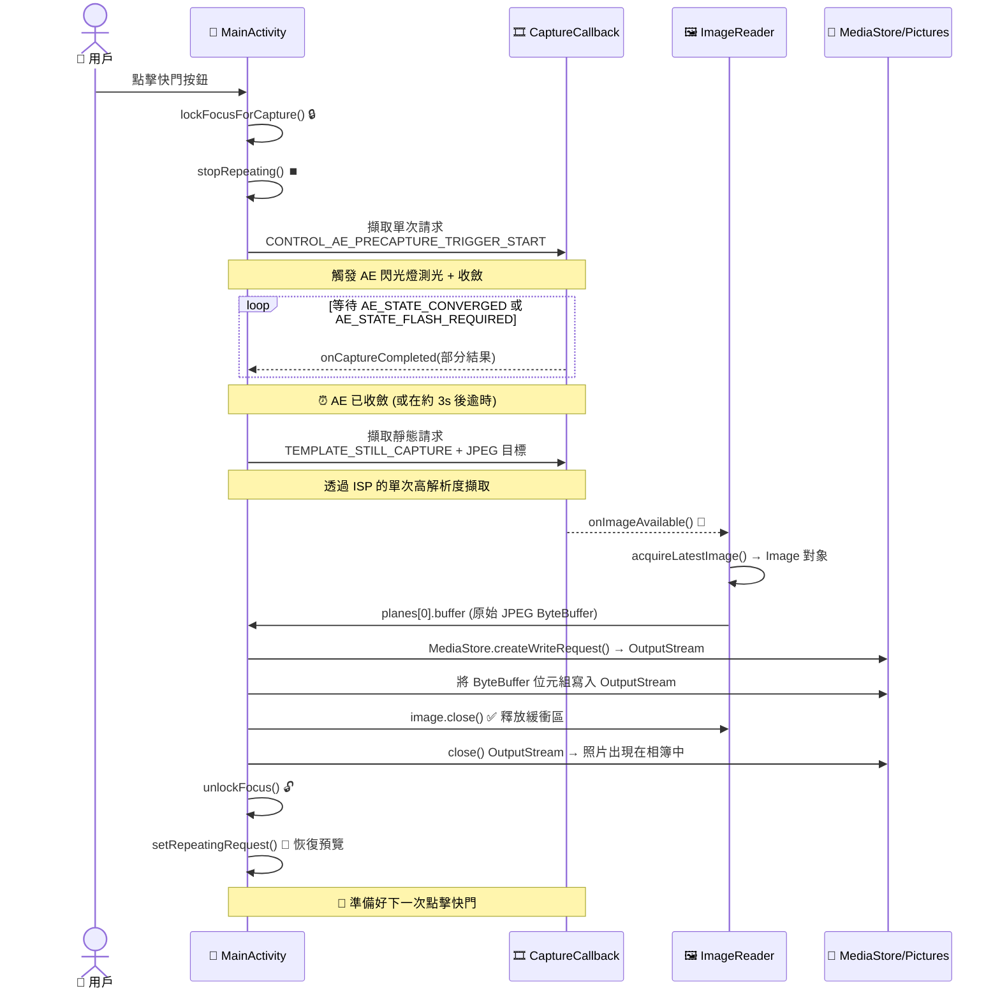

恭喜你完成了第二部分的最後一章！如果你從第 5 章開始一直關注本系列，那麼你的應用現在已經具備了：權限處理、專用背景執行緒、使用 `CameraCharacteristics` 的相機枚舉、透過 `Semaphore` 實現的穩健的打開/關閉生命週期管理，以及透過 `TextureView` 渲染的平滑、朝向正確的即時預覽。還差什麼？**點擊按鈕並保留照片的能力**。這就是本章要交付的內容。

到本章結束時，你的教程專案將成為一個真正可用的相機應用程序：點擊快門，應用會短暫凍結預覽（這是為了重新整理管線），透過適當的自動曝光收斂擷取一張靜態影像，將其儲存到設備的公共 Pictures 目錄中（帶有正確的 EXIF 朝向元數據），然後預覽自動恢復。你可以隨後在 Google 相簿或 **Android Camera Parameters** 應用（[GitHub](https://github.com/zoozooll/AndroidCameraParameters)，[Google Play](https://play.google.com/store/apps/details?id=com.minininja.cameraparams)）中打開照片，以檢查 EXIF 數據、解析度和質量。

**Android Camera Parameters** 應用的手動拍攝模式使用了比我們在本章中建構的管線更高級的版本：它執行帶有逐幀自定義 ISO、曝光時間和鏡頭位置的多幀連拍擷取——但這一切都建立在你將在此處學到的 `ImageReader` + `CaptureCallback` 基礎之上。

## 為什麼拍照比預覽更複雜

乍一看，「擷取一幀」聽起來很容易——我們已經有每秒 60 幀的預覽串流經工作階段，為什麼不能直接抓取一幀？答案是預覽幀和靜態幀是根本不同的輸出：

1. **解析度差異**：預覽約為 1–2 MP (1080p)。而靜態照片應當使用感光元件的**最大**解析度（在現代旗艦機上通常為 50+ MP）。在手機可以提供 50 MP 畫質時，你肯定不想要一張 2 MP 的照片。
2. **曝光差異**：`TEMPLATE_PREVIEW` 針對低延遲幀率進行了優化。`TEMPLATE_STILL_CAPTURE` 則針對動態範圍、降噪和色彩準確性進行了優化——靜態幀需要管線能提供的最高質量 ISP 處理。
3. **3A 收斂**：在拍照之前，相機的自動曝光 (AE) 演算法需要被告知「我們要拍一張靜態照片了——鎖定目前場景，收斂曝光、白平衡和對焦，並根據需要閃光」。這就是**預擷取觸發 (precapture trigger)** 序列。跳過這一步會導致照片相對於預覽顯示的畫面出現過曝或欠曝。
4. **儲存與分區儲存**：預覽幀永遠不會被持久化。而照片幀必須作為有效的 JPEG 文件寫入磁碟，由 MediaStore 索引以便圖庫應用可見，且在 Android 10+ 上必須使用分區儲存 (Scoped Storage) API（不能直接向 `/sdcard/DCIM/` 進行任意的 `File` 寫入）。

靜態拍攝是一個**多階段非同步狀態機**，而不是單次呼叫。下面的序列圖展示了你必須實現的準確順序和時機。請勿跳過任何步驟。



預擷取觸發的時機至關重要：它必須在靜態擷取之前發送，並且你必須等待 AE 收斂（或達到逾時）後才能觸發靜態拍攝。如果你跳過等待，照片將使用預覽的曝光設定，而預覽設定可能是為了高幀率而非照片質量而調整的。

## 認識 ImageReader：供 CPU 存取的幀接收器

在第 8 章中，我們將預覽幀饋送到 `SurfaceTexture`（GPU 接收器）。對於靜態拍攝，我們需要一個供 CPU 存取的接收器，以便我們可以將 JPEG 位元組寫入磁碟。這個接收器就是 `ImageReader`。

透過以下方式構造 `ImageReader`：
```kotlin
val imageReader = ImageReader.newInstance(
    width,           // 靜態幀的像素寬度 (來自 characteristics 的最大靜態尺寸)
    height,          // 靜態幀的像素高度
    ImageFormat.JPEG,// 格式 — 照片用 JPEG, DNG RAW 用 RAW_SENSOR, 處理用 YUV_420_888
    maxImages        // 佇列中要分配的緩衝區數量 (通常為 2–5)
)
```

四個參數詳解：

1. **width/height**：使用相機從 `SCALER_STREAM_CONFIGURATION_MAP.getOutputSizes(ImageFormat.JPEG)` 中獲取的最大 JPEG 尺寸。始終選擇最大尺寸以獲得最高質量的照片。
2. **ImageFormat.JPEG**：影像訊號處理器 (ISP) 會在交付幀之前執行完整的 JPEG 編碼管線（哈夫曼編碼、量化、EXIF 嵌入、JFIF 文件頭）。`Image.planes[0].buffer` 是一個**完整的、有效的 JPEG 文件**——無需重新編碼；你可以直接將這些位元組寫入磁碟。
3. **maxImages**：內部 `BufferQueue` 的深度。JPEG 緩衝區很大（每個 5–20 MB）。對於典型的照片拍攝，將其設定為 **2**（一個在途中 + 一个備用）。設定得更高會浪費 RAM；設定得太低（為 **1**）且忘記 `close()` 掉 Image 會導致永久的擷取死鎖（佇列再也無法取出空緩衝區進行使用了了）。

`ImageReader` 暴露了兩個關鍵的 API 表面：
- **`imageReader.surface`**：返回一個 `Surface`，可以將其作為目標添加到 CaptureRequest 中，並包含在 `CameraCaptureSession` 的輸出 Surface 列表中。
- **`imageReader.setOnImageAvailableListener(listener, handler)`**：註冊一個回呼，該回呼在交付給此 reader 的**每一新幀**上觸發。在此回呼內部，你呼叫 `acquireLatestImage()`（或 `acquireNextImage()`）來獲取 `Image` 對象。

### ⚠️ 關鍵規則：始終關閉 Image

如果你呼叫了 `acquireLatestImage()` 但**沒有**呼叫 `image.close()`，該緩衝區將從池中**永久移除**。一旦洩漏了 `maxImages` 個緩衝區，`OnImageAvailableListener` 將永遠停止觸發（佇列沒有可用的空緩衝區，因此沒有新幀能到達）。請務必使用 try/finally 塊：

```kotlin
val image = imageReader.acquireLatestImage()
try {
    // 在此處使用影像位元組
} finally {
    image.close() // 始終執行。無一例外。
}
```

這是第 9 章中最常見的 bug：拍照能成功一次，然後就再也不起作用了，除非重啟應用。

## 預擷取 AE 狀態機

Camera2 的 3A（自動曝光 / 自動對焦 / 自動白平衡）系統是一個由 `CONTROL_AE_PRECAPTURE_TRIGGER` 請求鍵驅動的逐幀狀態機。流程如下：

1. **停止重複預覽**：`captureSession.stopRepeating()`。我們不希望預覽幀干擾靜態拍攝管線。
2. **發送預擷取觸發**：建構一個將 `CONTROL_AE_PRECAPTURE_TRIGGER` 設定為 `START` 的單次 `CaptureRequest`。使用 `captureSession.capture()` 提交它（不是 `setRepeatingRequest` —— 這是一個單次命令，不是持續性的）。
3. **等待收斂**：在預擷取觸發（及後續幀）的 `CaptureCallback.onCaptureCompleted()` 中，檢查 `CaptureResult.CONTROL_AE_STATE`。我們在等待以下狀態之一：
   - `CONTROL_AE_STATE_CONVERGED` ✓（AE 滿意，場景測光正確）
   - `CONTROL_AE_STATE_FLASH_REQUIRED` ✓（AE 判定需要閃光，且閃光燈已就緒）
   - `CONTROL_AE_STATE_LOCKED` ✓（如果用戶之前手動鎖定了 AE）
   - 觸發 3000ms 逾時 ✗（安全閥——一些有問題的設備永遠不會發出收斂訊號）。
4. **觸發靜態拍攝**：建構一個針對 `ImageReader` 的 Surface 的 `TEMPLATE_STILL_CAPTURE` 請求。使用 `captureSession.capture()` 提交它。
5. **影像到達**：`OnImageAvailableListener.onImageAvailable()` 觸發 → 獲取 JPEG 位元組 → 儲存到磁碟。
6. **解鎖並恢復**：建構一個取消 AE 觸發 (`CONTROL_AE_PRECAPTURE_TRIGGER_CANCEL`) 的請求，為 AF/AWB 呼叫 `unlockFocus()`，然後呼叫 `setRepeatingRequest(previewRequest, ...)` 重新啟動預覽。

上述 6 個步驟中的每一步都對應於我們程式碼中定義的 `CaptureStateMachine` 枚舉中的一个狀態。

## 分區儲存與 MediaStore (Android 10+)

從 Android 10 (API 29) 開始，應用不能再使用 `java.io.File` API 向共享的 `/sdcard/Pictures` 目錄寫入任意文件——這樣做會拋出 `FileNotFoundException` 並提示 「Permission denied」，即使你持有 `WRITE_EXTERNAL_STORAGE` 權限也是如此。正確的、面向未來的做法是使用 `MediaStore` 內容提供者：

1. **準備 `ContentValues` 束**：MIME 類型 (`image/jpeg`)、相對路徑 (`Pictures/Camera2Tutorial/` —— 系統會在需要時建立目錄)、顯示名稱（帶時間戳）。
2. **插入掛起行**：`contentResolver.insert(MediaStore.Images.Media.EXTERNAL_CONTENT_URI, values)` 返回一個 `Uri`。
3. **打開指向該 Uri 的 OutputStream**：`contentResolver.openOutputStream(uri)` 為你提供一個由 `ParcelFileDescriptor` 支持的流。
4. **寫入位元組並關閉**：將來自 `ImageReader` 的 JPEG ByteBuffer 直接複製到 OutputStream 中。
5. **使文件對圖庫應用可見**：可選——如果你使用了掛起寫入模式，請在 values 中添加 `IS_PENDING=0`（我們將使用更簡單的 `IS_PENDING=1` 然後更新的方法，以獲得最大相容性）。

在 API 28 及更低版本上，我們回退到傳統的 `File(Environment.getExternalStoragePublicDirectory(Environment.DIRECTORY_PICTURES), ...)` 路徑並使用直接的 `FileOutputStream`，這仍然有效，因為應用的是舊版儲存模型。

## 第 9 章完整程式碼 — 照片擷取

以下是整合了上述所有內容的完整 `MainActivity.kt`：`ImageReader`、6 狀態預擷取 AE 狀態機、快門按鈕、`MediaStore`/舊版儲存，以及對兩個工作階段 Surface（預覽 + jpeg）的拆除。我們還更新了快門按鈕的佈局 XML。

### 更新後的佈局 (activity_main.xml)

```xml
<?xml version="1.0" encoding="utf-8"?>
<FrameLayout xmlns:android="http://schemas.android.com/apk/res/android"
    xmlns:tools="http://schemas.android.com/tools"
    xmlns:app="http://schemas.android.com/apk/res-auto"
    android:layout_width="match_parent"
    android:layout_height="match_parent">

    <TextureView
        android:id="@+id/textureView"
        android:layout_width="match_parent"
        android:layout_height="match_parent"
        android:layout_gravity="center" />

    <TextView
        android:id="@+id/statusTextView"
        android:layout_width="wrap_content"
        android:layout_height="wrap_content"
        android:layout_gravity="top|center_horizontal"
        android:layout_marginTop="16dp"
        android:background="#80000000"
        android:padding="8dp"
        android:textColor="#FFFFFFFF"
        android:textSize="12sp"
        tools:text="正在初始化..." />

    <com.google.android.material.floatingactionbutton.FloatingActionButton
        android:id="@+id/shutterButton"
        android:layout_width="wrap_content"
        android:layout_height="wrap_content"
        android:layout_gravity="bottom|center_horizontal"
        android:layout_marginBottom="48dp"
        android:contentDescription="拍照"
        android:src="@android:drawable/ic_menu_camera"
        app:fabSize="normal" />

</FrameLayout>
```

如果你沒有 Material Components，請將 FAB 替換為帶有 `layout_gravity="bottom|center_horizontal"` 的 `Button`。

### 完整的 Kotlin Activity

```kotlin
package com.example.camera2tutorial

import android.Manifest
import android.content.ContentValues
import android.content.Context
import android.content.pm.PackageManager
import android.graphics.ImageFormat
import android.graphics.Matrix
import android.graphics.RectF
import android.graphics.SurfaceTexture
import android.hardware.camera2.CameraAccessException
import android.hardware.camera2.CameraCharacteristics
import android.hardware.camera2.CameraCaptureSession
import android.hardware.camera2.CameraDevice
import android.hardware.camera2.CameraManager
import android.hardware.camera2.CaptureRequest
import android.hardware.camera2.CaptureResult
import android.hardware.camera2.TotalCaptureResult
import android.hardware.camera2.params.StreamConfigurationMap
import android.media.Image
import android.media.ImageReader
import android.os.Build
import android.os.Bundle
import android.os.Environment
import android.os.Handler
import android.os.HandlerThread
import android.provider.MediaStore
import android.util.Log
import android.util.Size
import android.view.Surface
import android.view.TextureView
import android.view.View
import android.view.WindowManager
import android.widget.TextView
import android.widget.Toast
import androidx.appcompat.app.AppCompatActivity
import androidx.core.app.ActivityCompat
import androidx.core.content.ContextCompat
import com.google.android.material.floatingactionbutton.FloatingActionButton
import java.io.File
import java.io.FileOutputStream
import java.io.OutputStream
import java.text.SimpleDateFormat
import java.util.Collections
import java.util.Date
import java.util.Locale
import java.util.concurrent.Semaphore
import java.util.concurrent.TimeUnit
import kotlin.math.max
import kotlin.math.min

class MainActivity : AppCompatActivity() {

    // UI
    private lateinit var textureView: TextureView
    private lateinit var statusTextView: TextView
    private lateinit var shutterButton: FloatingActionButton

    // 執行緒
    private lateinit var backgroundThread: HandlerThread
    private lateinit var backgroundHandler: Handler

    // 相機管線狀態
    private lateinit var cameraManager: CameraManager
    private var cameraDevice: CameraDevice? = null
    private var captureSession: CameraCaptureSession? = null
    private var previewRequestBuilder: CaptureRequest.Builder? = null
    private var previewRequest: CaptureRequest? = null
    private var selectedCameraId: String? = null
    private var sensorOrientation = 0
    private var jpegOrientation = 0
    private lateinit var previewSize: Size
    private lateinit var jpegSize: Size

    // 🆕 靜態拍攝接收器
    private lateinit var imageReader: ImageReader

    // 並行
    private val cameraOpenCloseLock = Semaphore(1)

    // 🆕 擷取狀態機
    private enum class CaptureState {
        IDLE,                 // 預覽正常執行
        WAITING_AE_PRECAPTURE, // 已觸發 AE 預擷取，等待收斂
        WAITING_AF_LOCK,      // (可選) 如果我們也添加了 AF 觸發
        WAITING_STILL_CAPTURE,// 已提交靜態擷取，等待 ImageReader
        PICTURE_SAVED         // 照片已儲存，準備返回 IDLE
    }
    private var captureState: CaptureState = CaptureState.IDLE
    private val precaptureTimeoutHandler: Handler by lazy { Handler(mainLooper) }
    private val precaptureTimeoutRunnable = Runnable {
        if (captureState == CaptureState.WAITING_AE_PRECAPTURE) {
            Log.w(TAG, "⏰ 預擷取 AE 逾時 — 仍繼續進行靜態拍攝")
            captureStillPicture()
        }
    }

    // -------------------------------------------------------------------------
    // 生命週期 + UI 掛接
    // -------------------------------------------------------------------------
    override fun onCreate(savedInstanceState: Bundle?) {
        super.onCreate(savedInstanceState)
        setContentView(R.layout.activity_main)

        textureView = findViewById(R.id.textureView)
        statusTextView = findViewById(R.id.statusTextView)
        shutterButton = findViewById(R.id.shutterButton)
        statusTextView.text = "正在初始化..."

        shutterButton.setOnClickListener { takePicture() }

        if (allPermissionsGranted()) {
            initializeCameraManager()
        } else {
            val allPerms = REQUIRED_PERMISSIONS + WRITE_EXTERNAL_IF_NEEDED
            ActivityCompat.requestPermissions(this, allPerms, REQUEST_CODE_PERMISSIONS)
        }
    }

    override fun onResume() {
        super.onResume()
        startBackgroundThread()
        if (allPermissionsGranted()) {
            if (!this::cameraManager.isInitialized) initializeCameraManager()
            if (textureView.isAvailable) openCameraAndStartSession(textureView.width, textureView.height)
        }
    }

    override fun onPause() {
        closeEverything()
        stopBackgroundThread()
        super.onPause()
    }

    private fun startBackgroundThread() {
        backgroundThread = HandlerThread("Camera2Background").apply { start() }
        backgroundHandler = Handler(backgroundThread.looper)
    }

    private fun stopBackgroundThread() {
        backgroundThread.quitSafely()
        try { backgroundThread.join(1000) } catch (_: InterruptedException) {}
    }

    // -------------------------------------------------------------------------
    // 第 6 章簡略版：相機發現
    // -------------------------------------------------------------------------
    data class CamInfo(val id: String, val facing: Int?, val hw: Int?, val chars: CameraCharacteristics)

    private fun initializeCameraManager() {
        cameraManager = getSystemService(Context.CAMERA_SERVICE) as CameraManager
        val cams = mutableListOf<CamInfo>()
        for (id in cameraManager.cameraIdList) {
            val chars = try { cameraManager.getCameraCharacteristics(id) } catch (_: Exception) { continue }
            cams += CamInfo(
                id,
                chars[CameraCharacteristics.LENS_FACING],
                chars[CameraCharacteristics.INFO_SUPPORTED_HARDWARE_LEVEL],
                chars
            )
        }
        val best = cams.sortedWith(
            compareByDescending<CamInfo> { it.facing == CameraCharacteristics.LENS_FACING_BACK }
                .thenByDescending { it.hw ?: -1 }).first()
        selectedCameraId = best.id
        sensorOrientation = best.chars[CameraCharacteristics.SENSOR_ORIENTATION] ?: 90

        textureView.surfaceTextureListener = object : TextureView.SurfaceTextureListener {
            override fun onSurfaceTextureAvailable(s: SurfaceTexture, w: Int, h: Int) {
                openCameraAndStartSession(w, h)
            }
            override fun onSurfaceTextureSizeChanged(s: SurfaceTexture, w: Int, h: Int) {
                if (this@MainActivity::previewSize.isInitialized) configureTransform(w, h)
            }
            override fun onSurfaceTextureDestroyed(s: SurfaceTexture): Boolean = true
            override fun onSurfaceTextureUpdated(s: SurfaceTexture) {}
        }
    }

    // -------------------------------------------------------------------------
    // 第 7 章簡略版：openCamera
    // -------------------------------------------------------------------------
    private val deviceCallback = object : CameraDevice.StateCallback() {
        override fun onOpened(cam: CameraDevice) {
            cameraOpenCloseLock.release()
            cameraDevice = cam
            createCaptureSession()
        }
        override fun onDisconnected(cam: CameraDevice) {
            cameraOpenCloseLock.release()
            cameraDevice?.close(); cameraDevice = null
        }
        override fun onError(cam: CameraDevice, err: Int) {
            cameraOpenCloseLock.release()
            cameraDevice?.close(); cameraDevice = null
            Toast.makeText(this@MainActivity, "相機錯誤 $err", Toast.LENGTH_LONG).show()
        }
    }

    // -------------------------------------------------------------------------
    // 工作階段建立 (現在包含 2 個 surface：預覽 + jpeg)
    // -------------------------------------------------------------------------
    private fun openCameraAndStartSession(vw: Int, vh: Int) {
        val camId = selectedCameraId ?: return
        if (checkSelfPermission(Manifest.permission.CAMERA) != PackageManager.PERMISSION_GRANTED) return
        if (!cameraOpenCloseLock.tryAcquire(2500, TimeUnit.MILLISECONDS)) {
            Toast.makeText(this, "相機鎖定逾時", Toast.LENGTH_SHORT).show(); return
        }
        val chars = cameraManager.getCameraCharacteristics(camId)

        // 預覽尺寸
        previewSize = choosePreviewSize(chars, vw, vh)
        // 🆕 靜態 JPEG 尺寸 (為了最佳畫質選擇可用的最大尺寸)
        jpegSize = chooseMaxJpegSize(chars)

        // JPEG 朝向標籤 = 經設備旋轉後的感光元件朝向
        jpegOrientation = computeJpegOrientation()

        // 🆕 建立 ImageReader: width=jpegW, height=jpegH, 格式=JPEG, 2 個緩衝區
        imageReader = ImageReader.newInstance(
            jpegSize.width,
            jpegSize.height,
            ImageFormat.JPEG,
            2
        )
        // 🆕 掛接 JPEG 幀可用監聽器
        imageReader.setOnImageAvailableListener(onJpegAvailableListener, backgroundHandler)

        configureTransform(vw, vh)
        textureView.surfaceTexture!!.setDefaultBufferSize(previewSize.width, previewSize.height)
        statusTextView.text = "工作階段: 預覽 ${previewSize} • JPEG ${jpegSize}"

        try { cameraManager.openCamera(camId, deviceCallback, backgroundHandler) }
        catch (e: CameraAccessException) { cameraOpenCloseLock.release() }
    }

    private fun createCaptureSession() {
        val cam = cameraDevice ?: return
        val st = textureView.surfaceTexture ?: return
        val previewSurface = Surface(st)
        val jpegSurface = imageReader.surface
        val outputs = listOf(previewSurface, jpegSurface)

        previewRequestBuilder =
            cam.createCaptureRequest(CameraDevice.TEMPLATE_PREVIEW).apply { addTarget(previewSurface) }

        cam.createCaptureSession(outputs, object : CameraCaptureSession.StateCallback() {
            override fun onConfigured(session: CameraCaptureSession) {
                captureSession = session
                previewRequest = previewRequestBuilder!!.build()
                captureState = CaptureState.IDLE
                shutterButton.isEnabled = true
                statusTextView.text = "🎥 預覽 — 點擊快門拍照"
                session.setRepeatingRequest(previewRequest!!, captureCallback, backgroundHandler)
            }
            override fun onConfigureFailed(session: CameraCaptureSession) {
                Toast.makeText(this@MainActivity, "工作階段失敗", Toast.LENGTH_LONG).show()
            }
        }, backgroundHandler)
    }

    // -------------------------------------------------------------------------
    // 🆕 CaptureCallback + takePicture 狀態機
    // -------------------------------------------------------------------------
    private val captureCallback = object : CameraCaptureSession.CaptureCallback() {
        override fun onCaptureStarted(
            session: CameraCaptureSession,
            request: CaptureRequest,
            timestamp: Long,
            frameNumber: Long
        ) {}

        override fun onCaptureProgressed(
            session: CameraCaptureSession,
            request: CaptureRequest,
            partialResult: CaptureResult
        ) {
            process(partialResult)
        }

        override fun onCaptureCompleted(
            session: CameraCaptureSession,
            request: CaptureRequest,
            result: TotalCaptureResult
        ) {
            process(result)
        }

        /**
         * 在每一部分或完整幀上被呼叫。
         * 當我們在等待 AE 預擷取收斂時，在此處檢查 AE_STATE。
         */
        private fun process(result: CaptureResult) {
            when (captureState) {
                CaptureState.WAITING_AE_PRECAPTURE -> {
                    val aeState = result[CaptureResult.CONTROL_AE_STATE]
                    Log.d(TAG, "AE_STATE = $aeState")
                    if (aeState == null) return
                    when (aeState) {
                        CaptureResult.CONTROL_AE_STATE_CONVERGED,
                        CaptureResult.CONTROL_AE_STATE_FLASH_REQUIRED,
                        CaptureResult.CONTROL_AE_STATE_LOCKED -> {
                            // ✅ AE 已就緒 — 取消逾時並觸發靜態擷取
                            precaptureTimeoutHandler.removeCallbacks(precaptureTimeoutRunnable)
                            captureStillPicture()
                        }
                        // 否則 → CONTROL_AE_STATE_PRECAPTURE / SEARCHING / INACTIVE → 繼續等待
                    }
                }
                else -> { /* 在 IDLE 或其他狀態下無需進行狀態追蹤 */ }
            }
        }
    }

    /** 快門點擊公共入口。 */
    fun takePicture() {
        if (cameraDevice == null || captureSession == null) return
        if (captureState != CaptureState.IDLE) {
            Log.d(TAG, "⚠️ 擷取正在進行中 — 忽略重複快門點擊")
            return
        }
        shutterButton.isEnabled = false
        statusTextView.text = "📸 正在鎖定曝光..."
        lockFocusAndFirePrecaptureTrigger()
    }

    /**
     * 第 1–3 步：停止重複預覽，提交 AE 預擷取觸發，啟動 3s 逾時。
     * captureCallback.process() 方法監視 AE_STATE 并在收斂時呼叫 captureStillPicture()。
     */
    private fun lockFocusAndFirePrecaptureTrigger() {
        val session = captureSession ?: return
        try {
            captureState = CaptureState.WAITING_AE_PRECAPTURE

            // 建構一個與預覽相同但帶有 AE 預擷取觸發 = START 的請求
            previewRequestBuilder?.apply {
                set(
                    CaptureRequest.CONTROL_AE_PRECAPTURE_TRIGGER,
                    CaptureRequest.CONTROL_AE_PRECAPTURE_TRIGGER_START
                )
            }

            // 暫停連續預覽幀 — 使用 capture() 發送單個觸發幀
            session.stopRepeating()
            session.capture(previewRequestBuilder!!.build(), captureCallback, backgroundHandler)

            // 安全閥逾時 (3 秒): 一些設備永遠不會發出 AE 收斂訊號
            precaptureTimeoutHandler.postDelayed(precaptureTimeoutRunnable, 3000)

        } catch (e: CameraAccessException) {
            Log.e(TAG, "預擷取觸發失敗", e)
            unlockFocusAndResumePreview()
        }
    }

    /**
     * 第 4 步：AE 已收斂 (或逾時)。發送針對 ImageReader surface 的單個 TEMPLATE_STILL_CAPTURE 請求
     * → JPEG 位元組透過 onJpegAvailableListener 到達。
     */
    private fun captureStillPicture() {
        val cam = cameraDevice ?: return
        val session = captureSession ?: return
        captureState = CaptureState.WAITING_STILL_CAPTURE
        statusTextView.text = "📷 正在擷取照片..."

        try {
            // 🆕 使用 TEMPLATE_STILL_CAPTURE — 最高質量的 ISP 管線
            val stillBuilder = cam.createCaptureRequest(CameraDevice.TEMPLATE_STILL_CAPTURE)
            stillBuilder.addTarget(imageReader.surface)
            stillBuilder.set(CaptureRequest.JPEG_ORIENTATION, jpegOrientation)
            stillBuilder.set(CaptureRequest.JPEG_QUALITY, 95.toByte()) // 1–100 質量

            val stillCallback = object : CameraCaptureSession.CaptureCallback() {
                override fun onCaptureCompleted(
                    s: CameraCaptureSession,
                    req: CaptureRequest,
                    res: TotalCaptureResult
                ) {
                    Log.d(TAG, "📨 靜態擷取元數據已交付")
                    // 注意：實際的 JPEG 位元組是透過 onJpegAvailableListener 到達的，而不是在這裡。
                }
            }

            session.stopRepeating()
            session.capture(stillBuilder.build(), stillCallback, backgroundHandler)

        } catch (e: CameraAccessException) {
            Log.e(TAG, "靜態擷取失敗", e)
            unlockFocusAndResumePreview()
        }
    }

    /**
     * 第 5 步：ImageReader 中的 JPEG 位元組可用。獲取最新 Image，將其位元組寫入 MediaStore (或舊版 File)，
     * 關閉 IMAGE，然後恢復預覽。
     */
    private val onJpegAvailableListener = ImageReader.OnImageAvailableListener { reader ->
        var image: Image? = null
        try {
            image = reader.acquireLatestImage()
            if (image == null) {
                Log.w(TAG, "acquireLatestImage 返回 null — 緩衝區丟棄")
                return@OnImageAvailableListener
            }
            val buffer = image.planes[0].buffer
            val bytes = ByteArray(buffer.remaining())
            buffer.get(bytes)

            val savedUri = savePhotoToStorage(bytes)
            captureState = CaptureState.PICTURE_SAVED

            // 切換到主執行緒進行 UI 更新 / 顯示 Toast
            runOnUiThread {
                shutterButton.isEnabled = true
                if (savedUri != null) {
                    statusTextView.text = "✅ 已儲存！Uri=$savedUri"
                    Toast.makeText(
                        this@MainActivity,
                        "照片已儲存: $savedUri",
                        Toast.LENGTH_LONG
                    ).show()
                } else {
                    statusTextView.text = "❌ 儲存失敗"
                    Toast.makeText(
                        this@MainActivity,
                        "照片儲存失敗 — 檢查 Logcat",
                        Toast.LENGTH_LONG
                    ).show()
                }
            }
        } catch (e: Exception) {
            Log.e(TAG, "onJpegAvailable 錯誤", e)
        } finally {
            image?.close() // ✅ 始終關閉 IMAGE — 無一例外！
        }

        // 第 6 步：無論儲存成功還是失敗，都要恢復預覽
        runOnUiThread { unlockFocusAndResumePreview() }
    }

    /**
     * 第 6 步：取消 AE 預擷取觸發，清除對焦鎖定，重新開始重複預覽。
     */
    private fun unlockFocusAndResumePreview() {
        val session = captureSession ?: return
        try {
            previewRequestBuilder?.apply {
                set(
                    CaptureRequest.CONTROL_AF_TRIGGER,
                    CaptureRequest.CONTROL_AF_TRIGGER_CANCEL
                )
                set(
                    CaptureRequest.CONTROL_AE_PRECAPTURE_TRIGGER,
                    CaptureRequest.CONTROL_AE_PRECAPTURE_TRIGGER_CANCEL
                )
            }
            session.capture(previewRequestBuilder!!.build(), captureCallback, backgroundHandler)

            captureState = CaptureState.IDLE
            precaptureTimeoutHandler.removeCallbacks(precaptureTimeoutRunnable)
            session.setRepeatingRequest(previewRequest!!, captureCallback, backgroundHandler)

            if (statusTextView.text.startsWith("📸") ||
                statusTextView.text.startsWith("📷")) {
                statusTextView.text = "🎥 預覽 — 點擊快門拍照"
            }
        } catch (e: CameraAccessException) {
            Log.e(TAG, "靜態擷取後恢復預覽失敗", e)
        }
    }

    // -------------------------------------------------------------------------
    // 🆕 savePhotoToStorage: MediaStore (API 29+) + 舊版 File (API 28+)
    // -------------------------------------------------------------------------
    private fun savePhotoToStorage(jpegBytes: ByteArray): android.net.Uri? {
        val timestamp = SimpleDateFormat("yyyyMMdd_HHmmss", Locale.US).format(Date())
        val displayName = "IMG_Camera2Tutorial_$timestamp"
        val relativeDir = "${Environment.DIRECTORY_PICTURES}/Camera2Tutorial"

        return if (Build.VERSION.SDK_INT >= Build.VERSION_CODES.Q) {
            // ✅ 透過 MediaStore 進行分區儲存 (無需 WRITE_EXTERNAL_STORAGE 權限！)
            val values = ContentValues().apply {
                put(MediaStore.Images.Media.DISPLAY_NAME, "$displayName.jpg")
                put(MediaStore.Images.Media.MIME_TYPE, "image/jpeg")
                put(MediaStore.Images.Media.RELATIVE_PATH, relativeDir)
                put(MediaStore.Images.Media.IS_PENDING, 1) // 寫入時標記為掛起
            }
            val resolver = contentResolver
            val uri = resolver.insert(MediaStore.Images.Media.EXTERNAL_CONTENT_URI, values)
                ?: return null
            try {
                resolver.openOutputStream(uri)?.use { os -> os.write(jpegBytes) }
                // 清除 PENDING 標記，以便圖庫應用現在可以看到它
                values.clear()
                values.put(MediaStore.Images.Media.IS_PENDING, 0)
                resolver.update(uri, values, null, null)
                Log.d(TAG, "✅ MediaStore 已儲存: $uri")
                uri
            } catch (e: Exception) {
                Log.e(TAG, "MediaStore 寫入失敗", e)
                resolver.delete(uri, null, null) // 清理寫了一半的掛起文件
                null
            }
        } else {
            // 🕰️ 舊版路徑：直接將文件寫入公共 Pictures 目錄
            val dir = File(Environment.getExternalStoragePublicDirectory(Environment.DIRECTORY_PICTURES), "Camera2Tutorial")
            if (!dir.exists()) dir.mkdirs()
            val file = File(dir, "$displayName.jpg")
            try {
                FileOutputStream(file).use { os -> os.write(jpegBytes) }
                // 索引文件，以便圖庫應用立即發現它
                val values = ContentValues().apply {
                    put(MediaStore.Images.Media.DATA, file.absolutePath)
                    put(MediaStore.Images.Media.MIME_TYPE, "image/jpeg")
                    put(MediaStore.Images.Media.DISPLAY_NAME, displayName)
                }
                contentResolver.insert(MediaStore.Images.Media.EXTERNAL_CONTENT_URI, values)
                android.net.Uri.fromFile(file)
            } catch (e: Exception) {
                Log.e(TAG, "舊版文件寫入失敗", e)
                null
            }
        }
    }

    // -------------------------------------------------------------------------
    // 尺寸 + 朝向輔助函式
    // -------------------------------------------------------------------------
    private fun choosePreviewSize(chars: CameraCharacteristics, vw: Int, vh: Int): Size {
        val map = chars[CameraCharacteristics.SCALER_STREAM_CONFIGURATION_MAP]!!
        val viewAspect = max(vw, vh).toDouble() / min(vw, vh)
        val choices = map.getOutputSizes(SurfaceTexture::class.java).toList()
        val matches = choices.filter {
            val a = max(it.width, it.height).toDouble() / min(it.width, it.height)
            kotlin.math.abs(a - viewAspect) < 0.02 && (it.width * it.height) <= 1920 * 1080 * 2
        }
        return (matches.ifEmpty { choices }).maxByOrNull { it.width * it.height }!!
    }

    private fun chooseMaxJpegSize(chars: CameraCharacteristics): Size {
        val map = chars[CameraCharacteristics.SCALER_STREAM_CONFIGURATION_MAP]!!
        val choices = map.getOutputSizes(ImageFormat.JPEG).toList()
        val max = choices.maxByOrNull { it.width * it.height }!!
        Log.d(TAG, "選定的最大 JPEG 尺寸: ${max.width}×${max.height} " +
            "(來自 ${choices.size} 個尺寸)")
        return max
    }

    private fun computeJpegOrientation(): Int {
        val deviceRotation = (getSystemService(Context.WINDOW_SERVICE) as WindowManager)
            .defaultDisplay.rotation
        val facing = try {
            selectedCameraId?.let {
                cameraManager.getCameraCharacteristics(it)[CameraCharacteristics.LENS_FACING]
            }
        } catch (_: Exception) { CameraCharacteristics.LENS_FACING_BACK }
        val frontFacing = facing == CameraCharacteristics.LENS_FACING_FRONT

        return when (deviceRotation) {
            Surface.ROTATION_0 -> if (frontFacing) (360 - sensorOrientation) % 360 else sensorOrientation
            Surface.ROTATION_90 -> if (frontFacing) (360 - (sensorOrientation + 270) % 360) % 360 else (sensorOrientation + 270) % 360
            Surface.ROTATION_180 -> if (frontFacing) (360 - (sensorOrientation + 180) % 360) % 360 else (sensorOrientation + 180) % 360
            Surface.ROTATION_270 -> if (frontFacing) (360 - (sensorOrientation + 90) % 360) % 360 else (sensorOrientation + 90) % 360
            else -> 0
        }
    }

    private fun configureTransform(vw: Int, vh: Int) {
        val rotation = (getSystemService(Context.WINDOW_SERVICE) as WindowManager).defaultDisplay.rotation
        val matrix = Matrix()
        val vr = RectF(0f, 0f, vw.toFloat(), vh.toFloat())
        val br = RectF(0f, 0f, previewSize.height.toFloat(), previewSize.width.toFloat())
        val cx = vr.centerX(); val cy = vr.centerY()
        br.offset(cx - br.centerX(), cy - br.centerY())
        matrix.setRectToRect(vr, br, Matrix.ScaleToFit.FILL)
        val scale = max(vh.toFloat() / previewSize.height, vw.toFloat() / previewSize.width)
        matrix.postScale(scale, scale, cx, cy)
        val rot = when (rotation) {
            Surface.ROTATION_0 -> sensorOrientation
            Surface.ROTATION_90 -> 0
            Surface.ROTATION_180 -> 360 - sensorOrientation
            Surface.ROTATION_270 -> 180
            else -> 0
        }
        matrix.postRotate(rot.toFloat(), cx, cy)
        textureView.setTransform(matrix)
    }

    // -------------------------------------------------------------------------
    // 拆除
    // -------------------------------------------------------------------------
    private fun closeEverything() {
        try {
            cameraOpenCloseLock.acquire()
            precaptureTimeoutHandler.removeCallbacks(precaptureTimeoutRunnable)
            captureSession?.apply {
                try { stopRepeating(); abortCaptures() } catch (_: CameraAccessException) {}
                close()
            }
            captureSession = null
            cameraDevice?.close(); cameraDevice = null
            if (this::imageReader.isInitialized) {
                imageReader.close() // 重要 — 釋放 JPEG BufferQueue 記憶體
            }
        } catch (_: InterruptedException) {
        } finally {
            cameraOpenCloseLock.release()
        }
    }

    // -------------------------------------------------------------------------
    // 權限樣板程式碼
    // -------------------------------------------------------------------------
    companion object {
        private const val TAG = "Camera2Tutorial"
        private const val REQUEST_CODE_PERMISSIONS = 10
        private val REQUIRED_PERMISSIONS = arrayOf(Manifest.permission.CAMERA)
        // pre-Q 在舊版文件儲存路徑下僅需要 WRITE_EXTERNAL_STORAGE 權限
        private val WRITE_EXTERNAL_IF_NEEDED =
            if (Build.VERSION.SDK_INT < Build.VERSION_CODES.Q)
                arrayOf(Manifest.permission.WRITE_EXTERNAL_STORAGE)
            else
                emptyArray()
    }

    private fun allPermissionsGranted(): Boolean {
        val need = REQUIRED_PERMISSIONS + WRITE_EXTERNAL_IF_NEEDED
        return need.all { ContextCompat.checkSelfPermission(baseContext, it) == PackageManager.PERMISSION_GRANTED }
    }

    override fun onRequestPermissionsResult(
        requestCode: Int, permissions: Array<out String>, grantResults: IntArray
    ) {
        super.onRequestPermissionsResult(requestCode, permissions, grantResults)
        if (requestCode == REQUEST_CODE_PERMISSIONS) {
            if (allPermissionsGranted()) {
                initializeCameraManager()
            } else {
                Toast.makeText(this, "需要權限", Toast.LENGTH_LONG).show()
                finish()
            }
        }
    }
}
```

### 解讀擷取狀態機

遵循 `takePicture()` → `lockFocusAndFirePrecaptureTrigger()` → (AE 已收斂或逾時) → `captureStillPicture()` → `onJpegAvailableListener` → `unlockFocusAndResumePreview()` 呼叫鏈。每一步的轉換都受 `captureState` 控制。重複的點擊將被忽略（`takePicture()` 頂部的 `if (captureState != IDLE) return` 檢查）。

關鍵的具體細節：
- **`JPEG_ORIENTATION`**：在靜態擷取請求中設定。圖庫應用讀取 JPEG 文件頭中的 EXIF 朝向標籤，以旋轉顯示的照片。沒有此標籤，即使像素數據正確，橫向照片也會顯示為側向。
- **`JPEG_QUALITY = 95`**：質量與文件大小之間的良好平衡。100 在理論上是無損的，但會產生大 2–3 倍的文件，視覺提升微乎其微；80 在精細紋理中會產生可見的壓縮偽影。
- **`IS_PENDING=1 → 0` 模式 (API 29+)**：告訴 MediaStore 「在寫入完成之前，不要讓照片編輯器、圖庫應用或 MTP 主機看到此文件」。防止正在進行的 `OutputStream` 寫入導致損壞的半成品文件出現在 Google 相簿中。務必清除此標記。

## 驗證：執行照片擷取流程

在真實的 Android 設備上安裝並啟動第 9 章的應用（模擬器相機的 AE 狀態機比較奇怪，不具代表性）。驗證以下每一個檢查點行為：

1. **預覽如常執行**。狀態顯示 *🎥 預覽 — 點擊快門拍照*。快門 FAB 可見且可點擊。
2. **點擊快門**。狀態變為 *📸 正在鎖定曝光...* → *📷 正在擷取照片...* → *✅ 已儲存！Uri=content://media/external/images/media/12345*。
3. **預覽短暫凍結**（約 0.3–1.0 秒），期間 AE 收斂且靜態幀正在被處理。然後預覽再次啟動。這種短暫凍結是正確且符合預期的行為。
4. **打開設備的圖庫 / 相簿應用**。導覽到 **Pictures → Camera2Tutorial** 相簿。你應該能看到拍攝照片的縮圖。打開它——它應該是全解析度的（例如 50 MP 感光元件對應 8160×6120），朝向正確且曝光正常。
5. **在 Android Camera Parameters 應用的 EXIF 查看器中打開照片**（[Google Play](https://play.google.com/store/apps/details?id=com.minininja.cameraparams)）。檢查 EXIF 朝向標籤是否與拍攝時的設備旋轉比對，JPEG 質量 = 95，且解析度與工作階段啟動時記錄的 `jpegSize` 比對。
6. **快速點擊快門 10 次以上**。`captureState != IDLE` 防禦機制應當在擷取週期內吞掉重複的點擊；最後你應該擁有與完成的擷取週期數量完全一致的已儲存照片。

### Logcat 輸出參考

成功的擷取會產生大致按此順序排列的 Logcat 條目：
```
D/Camera2Tutorial: 選定的最大 JPEG 尺寸: 8160×6120 (來自 9 個尺寸)
D/Camera2Tutorial: 📸 正在鎖定曝光...
D/Camera2Tutorial: AE_STATE = CONTROL_AE_STATE_SEARCHING
D/Camera2Tutorial: AE_STATE = CONTROL_AE_STATE_SEARCHING
D/Camera2Tutorial: AE_STATE = CONTROL_AE_STATE_CONVERGED
D/Camera2Tutorial: 📷 正在擷取照片...
D/Camera2Tutorial: 📨 靜態擷取元數據已交付
D/Camera2Tutorial: ✅ MediaStore 已儲存: content://media/external/images/media/9876
D/Camera2Tutorial: 🎥 預覽 — 點擊快門拍照
```

## 擷取失敗排查

### captureStillPicture() 從未觸發 (卡在"正在鎖定曝光...")

3 秒逾時最終應當觸發並繼續——如果連逾時都沒觸發，說明 `precaptureTimeoutRunnable` 從未被投遞。仔細檢查 `lockFocusAndFirePrecaptureTrigger()` 是否呼叫了 `precaptureTimeoutHandler.postDelayed(precaptureTimeoutRunnable, 3000)`。如果每次都觸發逾時，但 `AE_STATE` 看起來從未收斂，你可能使用的是帶有損壞的 AE 狀態報告的 LEGACY 層級相機。在這種情況下，添加一个檢查：如果硬體層級是 LEGACY，跳過預擷取觸發，直接從 `takePicture()` 跳轉到 `captureStillPicture()`。

### 拍照成功一次，但後續所有擷取都無法產生 onImageAvailable

由於忘記呼叫 `image.close()`，你導致了 `Image` 洩漏。`maxImages = 2` 的池子已耗盡，除非殺掉應用進程，否則無法交付新幀。驗證 `onJpegAvailableListener` 中的 `finally { image?.close() }` 塊。作為偵錯輔助，可以記錄 `imageReader.acquireLatestImage()` 返回 null 的情況——這是緩衝區洩漏的明顯跡象。

### 圖庫中的照片顯示為側向

你的 `computeJpegOrientation()` 返回值有誤。在所有 4 種設備方向（縱向、左橫向、反向橫向、反向縱向）下對後置和前置鏡頭分別進行測試。前置鏡頭需要翻轉（鏡像）朝向，因為按照慣例，`LENS_FACING_FRONT` 感光元件是鏡像的。

### MediaStore 在 API 29+ 上拋出 SecurityException

你忘記從 API 29+ 的權限列表中移除 `WRITE_EXTERNAL_STORAGE` 且你使用的設備設定了 `requestLegacyExternalStorage=false`。在 API 29+ 上，`WRITE_EXTERNAL_STORAGE` **不授予任何權限** —— 只有 MediaStore Uri 才有效。`WRITE_EXTERNAL_IF_NEEDED` 輔助函式在 Q+ 上正確地忽略了該權限。

## 小結

第二部分圓滿結束：你的教程應用現在是一個**功能齊全的相機應用程序**。你實現了：

1. **ImageReader** 作為供 CPU 存取的 JPEG 接收器：正確的寬/高 (最大 JPEG 尺寸)、`ImageFormat.JPEG`、`maxImages = 2` 的緩衝區計數、`OnImageAvailableListener` 註冊，以及**始終在 finally 塊中關閉 Image** 以防止緩衝區永久匱乏的不變規則。
2. **6 狀態擷取狀態機**：`IDLE → WAITING_AE_PRECAPTURE → (收斂/逾時) → WAITING_STILL_CAPTURE → PICTURE_SAVED → 回到 IDLE`，受重複點擊抑制和針對損壞的 AE 狀態報告設備的 3 秒安全閥逾時保護。
3. **預擷取 AE 觸發流程**：`stopRepeating → session.capture(CONTROL_AE_PRECAPTURE_TRIGGER_START) → 在 CaptureCallback 中處理 AE_STATE 直到 CONVERGED/FLASH_REQUIRED/LOCKED → 發起靜態拍攝`。
4. **TEMPLATE_STILL_CAPTURE + 質量設定**：基於感光元件朝向 + 設備旋轉設定 `JPEG_ORIENTATION` EXIF 標籤（前置鏡頭正確鏡像），`JPEG_QUALITY = 95`。
5. **面向未來的照片儲存**：Android 10+ 採用分區儲存的 `MediaStore.Images.Media.EXTERNAL_CONTENT_URI` + `RELATIVE_PATH` + `IS_PENDING=1→0` 模式，Android 9 及以下版本回退到 `Environment.DIRECTORY_PICTURES` 的舊版 `FileOutputStream` 路徑，外加立即進行的 MediaStore 索引，以便圖庫應用能立刻看到新文件。
6. **對稱拆除**：`closeEverything()` 會停止重複、中止擷取、關閉工作階段、關閉設備、關閉 `ImageReader`（關鍵在於釋放 2× 20 MB 的 JPEG 緩衝區），所有操作均在 `Semaphore(1)` 臨界區內進行。

本章中的程式碼構成了任何嚴謹的 Camera2 靜態攝影應用的基礎。[GitHub](https://github.com/zoozooll/AndroidCameraParameters) 上的 **Android Camera Parameters** 應用將此狀態機擴充了 10 多個額外狀態，用於 AF 觸發、AWB 鎖定、多幀連拍擷取、RAW (DNG) 輸出以及 JPEG 旁路、手動逐幀 ISO/曝光時間覆蓋——但其中每一項功能都是對你現在已經完全理解的同一個 `ImageReader` + `CaptureCallback` + 狀態機模式的增量補充。

## 下一章（展望第三部分）

**第二部分：你的第一個 Camera2 應用**到此結束。在五章中，你建構了一個具有權限處理、執行緒化、相機枚舉、打開/關閉生命週期、預覽渲染和 JPEG 靜態擷取功能的生產級骨架應用。如果你就此止步並發佈這段程式碼，你已經擁有了一個比 Play 商店中許多應用更好的相機應用。

但 Camera2 API 的真正威力在於接下來的內容。**第三部分 (第 10–12 章)** 將深入探討專業相機應用所需的內部機制：
- **第 10 章：CameraCharacteristics 百科全書** —— 每個鍵系列 (SENSOR, LENS, SCALER, STATISTICS, CONTROL, INFO, REQUEST, SYNC)，它們的含義，以及如何圍繞它們設計功能標記。
- **第 11 章：Camera2 管線與 HAL3 架構** —— P1、P2 與 P3 節點、重處理、`CaptureRequest`/`CaptureResult` 鍵的對等性、同步框架，以及 `TEMPLATE_*` 在底層到底配置了什麼。
- **第 12 章：擷取類型、連拍與深入 3A** —— 重複 vs 單次 vs 連拍、ZSL 重處理佇列、AF/AE/AWB 狀態機轉換、手動控制 (`LENS_FOCUS_DISTANCE`, `SENSOR_SENSITIVITY`/`SENSOR_EXPOSURE_TIME`) 以及 `CONTROL_CAPTURE_INTENT` 分類學。

在此之前，請嘗試用你第 9 章的應用拍些照片。探索光線複雜的場景（明亮的窗戶 + 昏暗的室內），看看預擷取 AE 觸發如何相對於預覽調整曝光。對比 `JPEG_QUALITY = 50` vs `95` vs `100` 的文件大小。將 `chooseMaxJpegSize` 換成 4K 尺寸，觀察速度差異。內化這些材料的最佳方式是觀察每個參數帶來的現實後果。恭喜你建構了你的第一台 Camera2 相機——這是你應得的。
