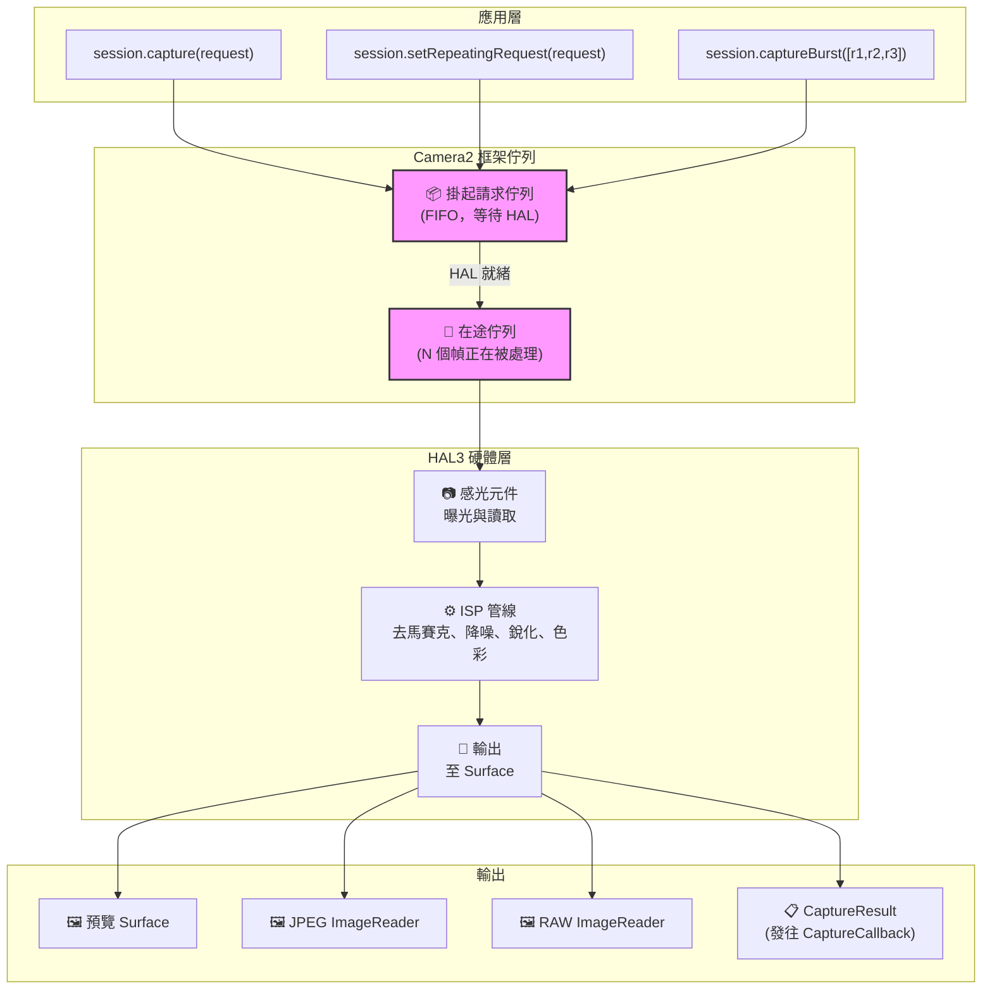
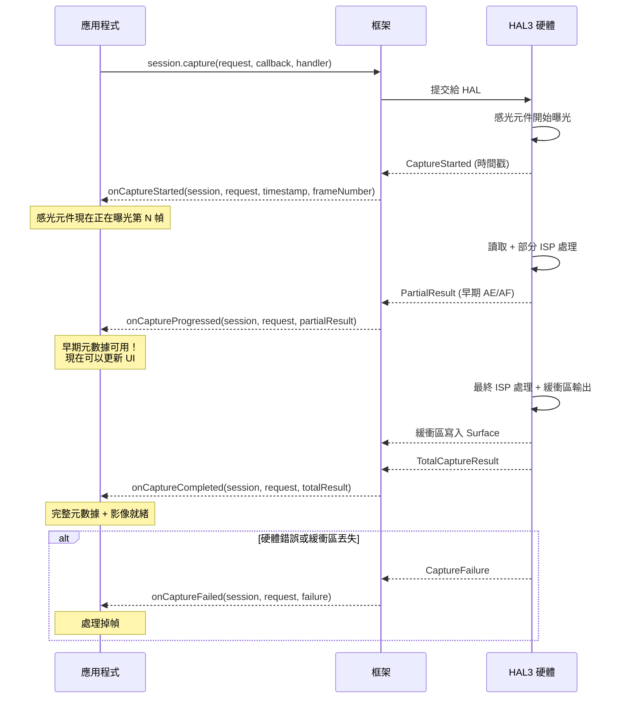
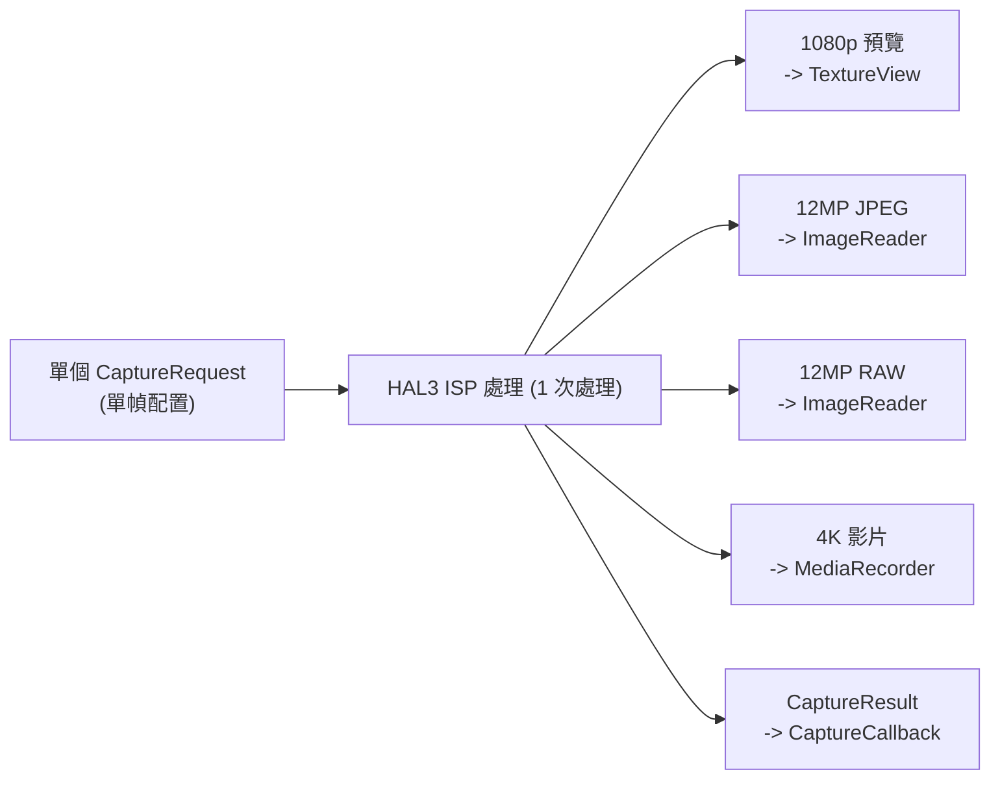
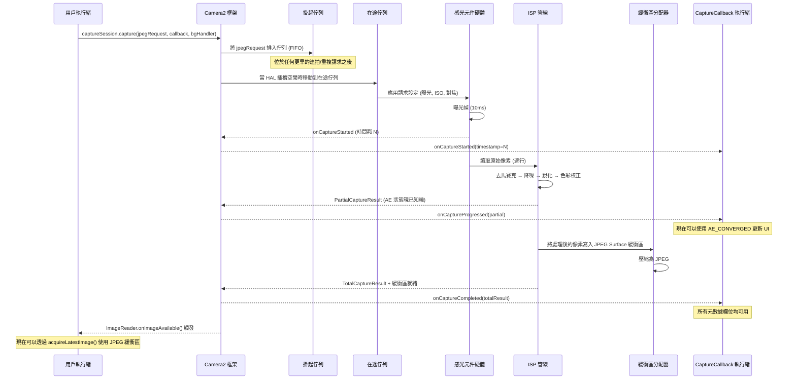

## 10.1 從使用到理解

在本系列的之前章節中，你*使用*了 Camera2：顯示預覽、擷取照片以及處理 RAW 文件。現在是時候反轉鏡頭，向內觀察了——**Camera2 到底是如何交付這些幀的？**

理解管線不僅僅是為了學術研究。當你了解請求如何在系統中流動時，你就可以：
- 診斷高幀率拍攝時的掉幀問題
- 解釋為什麼更改設定需要 1-2 幀才能生效
- 優化連拍擷取以實現零黑屏
- 為回呼時機建立正確的思維模型

**Android Camera Parameters** 應用（[GitHub](https://github.com/zoozooll/AndroidCameraParameters)，[Play 商店](https://play.google.com/store/apps/details?id=com.minininja.cameraparams)）即時可視化了管線行為——查看 **Frame Timing (幀時序)** 和 **Raw JSON** 索引標籤，即可在你自己的設備上即時觀察本章中的概念。

## 10.2 核心數據結構

在觀察管線本身之前，讓我們深入研究流經管線的兩個物件：`CaptureRequest`（進入的）和 `CaptureResult`（出來的）。

### CaptureRequest：不可變的幀藍圖

`CaptureRequest` 是針對**單幀的完整、不可變配置**。它描述了感光元件、鏡頭和 ISP 在一次曝光中應該執行的*所有*操作：感光元件曝光時間、ISO、鏡頭對焦距離、3A 模式、輸出目標、JPEG 質量、裁剪區域等等。

`CaptureRequest` 的關鍵屬性：

- **build() 後不可變** — 一旦你呼叫了 `.build()`，請求就被凍結了。要更改設定，你必須建立一个新的 Builder。
- **建構器模式** — 透過 `CaptureRequest.Builder` 構造，從 `CameraDevice.createCaptureRequest(template)` 獲取。
- **逐幀** — 每一个獨立的幀都有其自己的請求物件。即使是重複擷取也會（隱式地）為每一幀建立一个新請求。
- **定向到 Surface** — 每個請求都會明確列出哪些輸出 Surface 接收處理後的影像緩衝區。

```kotlin
// 使用建構器模式建構 CaptureRequest
val builder = cameraDevice.createCaptureRequest(CameraDevice.TEMPLATE_STILL_CAPTURE)

// 感光元件級參數
builder.set(CaptureRequest.SENSOR_EXPOSURE_TIME, 10_000_000L)   // 10ms
builder.set(CaptureRequest.SENSOR_SENSITIVITY, 400)             // ISO 400
builder.set(CaptureRequest.SENSOR_FRAME_DURATION, 33_333_333L)  // 最大約 30fps

// 鏡頭參數
builder.set(CaptureRequest.LENS_FOCUS_DISTANCE, 0.1f)           // 10cm 對焦
builder.set(CaptureRequest.LENS_APERTURE, 1.8f)                 // f/1.8

// 3A 控制模式
builder.set(CaptureRequest.CONTROL_AF_MODE, CaptureRequest.CONTROL_AF_MODE_OFF)
builder.set(CaptureRequest.CONTROL_AE_MODE, CaptureRequest.CONTROL_AE_MODE_OFF)
builder.set(CaptureRequest.CONTROL_AWB_MODE, CaptureRequest.CONTROL_AWB_MODE_OFF)

// 輸出目標
builder.addTarget(previewSurface)
builder.addTarget(jpegReader.surface)

// 建構 — 現在不可變了！
val request: CaptureRequest = builder.build()

// request.set(...) 將會失敗 — 建構後的物件沒有 set() 方法！
```

:::note
不可變性對於管線的正確性至關重要。由於 HAL 會非同步讀取請求，如果你能在提交後修改它，就會在應用執行緒和硬體處理執行緒之間產生競態條件。
:::

### CaptureResult：元數據報告（而非影像！）

`CaptureResult` 是處理後幀的**元數據輸出**。至關重要的是：**CaptureResult 不包含影像像素數據**。像素流向了你添加到請求中的 `Surface` 目標；`CaptureResult` 流向了你的 `CaptureCallback`，承載著拍攝期間發生的*故事*。

以下是 `CaptureResult` 中最重要的欄位：

| 結果鍵 | 類型 | 說明 |
|-----------|------|-------------|
| `SENSOR_EXPOSURE_TIME` | `Long` | 實際使用的曝光時間（納秒），可能與請求值不同 |
| `SENSOR_SENSITIVITY` | `Int` | 實際應用的 ISO 增益 |
| `SENSOR_TIMESTAMP` | `Long` | 曝光開始時的納秒時間戳（來自 `SystemClock.elapsedRealtimeNanos()`） |
| `CONTROL_AE_STATE` | `Int` | 自動曝光狀態：INACTIVE、SEARCHING、CONVERGED、LOCKED、FLASH_REQUIRED |
| `CONTROL_AF_STATE` | `Int` | 自動對焦狀態：INACTIVE、PASSIVE_SCAN、ACTIVE_SCAN、FOCUSED_LOCKED、NOT_FOCUSED_LOCKED |
| `CONTROL_AWB_STATE` | `Int` | 自動白平衡狀態 |
| `LENS_FOCUS_DISTANCE` | `Float` | 鏡頭設定的實際對焦距離 |
| `SCALER_CROP_REGION` | `Rect` | 用於數位變焦的實際裁剪區域 |
| `JPEG_GPS_LOCATION` | `Location` | 寫入 JPEG 的 GPS 標籤（如果請求了） |
| `STATISTICS_FACE_DETECT_MODE` | `Int` | 實際使用的人臉偵測模式 |

結果欄位是你的**地面真值 (ground truth)**。`CaptureRequest` 是你*要求*硬體做的；`CaptureResult` 是硬體*實際執行*的。在 LEGACY 或 LIMITED 設備上，HAL 可能會靜默地夾斷、捨入或覆蓋你的請求值——而結果能讓你檢測到這一點。

```kotlin
val captureCallback = object : CameraCaptureSession.CaptureCallback() {
    override fun onCaptureCompleted(
        session: CameraCaptureSession,
        request: CaptureRequest,
        result: TotalCaptureResult
    ) {
        val timestampNs = result.get(CaptureResult.SENSOR_TIMESTAMP)
        val exposureNs = result.get(CaptureResult.SENSOR_EXPOSURE_TIME)
        val iso = result.get(CaptureResult.SENSOR_SENSITIVITY)
        val aeState = result.get(CaptureResult.CONTROL_AE_STATE)
        val afState = result.get(CaptureResult.CONTROL_AF_STATE)
        val focusDistance = result.get(CaptureResult.LENS_FOCUS_DISTANCE)
        val cropRegion = result.get(CaptureResult.SCALER_CROP_REGION)

        val aeStateStr = when (aeState) {
            CaptureResult.CONTROL_AE_STATE_INACTIVE -> "未活動"
            CaptureResult.CONTROL_AE_STATE_SEARCHING -> "搜索中"
            CaptureResult.CONTROL_AE_STATE_CONVERGED -> "已收斂"
            CaptureResult.CONTROL_AE_STATE_LOCKED -> "已鎖定"
            CaptureResult.CONTROL_AE_STATE_FLASH_REQUIRED -> "需要閃光"
            else -> "未知($aeState)"
        }

        val afStateStr = when (afState) {
            CaptureResult.CONTROL_AF_STATE_INACTIVE -> "未活動"
            CaptureResult.CONTROL_AF_STATE_PASSIVE_SCAN -> "被動掃描"
            CaptureResult.CONTROL_AF_STATE_ACTIVE_SCAN -> "主動掃描"
            CaptureResult.CONTROL_AF_STATE_FOCUSED_LOCKED -> "對焦鎖定"
            CaptureResult.CONTROL_AF_STATE_NOT_FOCUSED_LOCKED -> "未對焦鎖定"
            else -> "未知($afState)"
        }

        Log.d("Pipeline", buildString {
            append("幀 @${timestampNs?.let { it / 1_000_000 } ?: "?"}ms | ")
            append("曝光: ${exposureNs?.let { "%.2fms".format(it / 1_000_000.0) } ?: "?"} | ")
            append("ISO: $iso | ")
            append("對焦: ${focusDistance?.let { "%.3f".format(it) } ?: "?"} 屈光度 | ")
            append("AE: $aeStateStr | ")
            append("AF: $afStateStr | ")
            append("裁剪: ${cropRegion?.width()}x${cropRegion?.height()}")
        })
    }
}
```

:::tip
在 **Android Camera Parameters** 應用中，在設定中啟用 **Live Result Logging (即時結果記錄)**，即可即時觀察元數據的流動。隨著曝光趨於平穩，你會看到 AE_SEARCHING 轉換為 AE_CONVERGED；點擊對焦時，AF_SCAN 會轉換為 FOCUSED_LOCKED。
:::

## 10.3 請求佇列

Camera2 在框架層使用**雙佇列管線模型**。理解這些佇列可以解釋你觀察到的幾乎所有時序行為。

### 掛起請求佇列 (FIFO)

當你呼叫 `session.capture()`、`session.captureBurst()` 或 `session.setRepeatingRequest()` 時，請求不會立即發送到 HAL。相反，它進入**掛起請求佇列 (Pending Request Queue)**——一个由 Camera2 框架管理的 FIFO（先進先出）佇列。

把它想像成「候診室」。請求在這裡等待，直到 HAL 有能力接受新請求進行處理。

關鍵屬性：
- **FIFO 順序** — 請求按提交的確切順序進行處理。
- **連拍原子性** — `captureBurst()` 中的所有幀都會被連續排隊並處理，不會被重複請求穿插。
- **優先級覆蓋** — 單次/連拍請求在佇列中會跳到重複請求*之前*執行（單次完成後，重複請求會自動重新排隊）。
- **有界的** — 佇列深度有限（通常為 4-8 個請求）；溢出會觸發錯誤。

### 在途佇列 (In-Flight Queue)

當 HAL 從掛起佇列中取出一個請求並開始感光元件讀取/ISP 處理時，該請求就會移動到**在途佇列 (In-Flight Queue)**。此佇列包含硬體目前正在處理的所有請求。

在途佇列的深度 (`CameraCharacteristics.REQUEST_PIPELINE_MAX_DEPTH`) 告訴你硬體可以同時處理多少個幀。在典型的 FULL 設備上，這通常是 3–4 幀深度，這意味著：當幀 N 正在曝光時，幀 N-1 正在由 ISP 處理，幀 N-2 正在被寫入記憶體，而幀 N-3 正在返回給應用。這就是 Camera2 儘管每幀端到端耗時約 100ms 卻能實現 30+ fps 的原因。



## 10.4 結果回呼：CaptureCallback 生命週期

結果透過 `CameraCaptureSession.CaptureCallback` 返回。HAL 可以分階段返回結果，讓你在完整幀就緒之前提前獲取部分元數據。

### 四種回呼方法

| 方法 | 呼叫時機 | 包含內容 | 用例 |
|--------|------------|----------|----------|
| `onCaptureStarted` | 感光元件*開始*對此幀進行曝光 | 最少資訊：幀號、時間戳 | 精確的時序同步 |
| `onCaptureProgressed` | ISP 已部分處理該幀 | PartialCaptureResult — 部分元數據欄位就緒 | 早期 AE/AF 狀態更新 |
| `onCaptureCompleted` | 完整幀已完成，所有緩衝區已交付 | TotalCaptureResult — 所有欄位 | 最終元數據記錄 |
| `onCaptureFailed` | 掉幀 / 發生錯誤 | CaptureFailure — 錯誤代碼、原因 | 錯誤恢復 |

### 部分結果 vs. 全體結果

當 ISP 計算出*一些*元數據欄位但尚未完成整個管線時，會返回 `PartialCaptureResult`。當一切完成後，會返回 `TotalCaptureResult`。



```kotlin
val fullPipelineCallback = object : CameraCaptureSession.CaptureCallback() {
    override fun onCaptureStarted(
        session: CameraCaptureSession,
        request: CaptureRequest,
        timestamp: Long,
        frameNumber: Long
    ) {
        super.onCaptureStarted(session, request, timestamp, frameNumber)
        Log.d("Pipeline", "幀 #$frameNumber 在 ${timestamp / 1_000_000}ms 開始曝光")
    }

    override fun onCaptureProgressed(
        session: CameraCaptureSession,
        request: CaptureRequest,
        partialResult: CaptureResult
    ) {
        super.onCaptureProgressed(session, request, partialResult)
        val aeState = partialResult.get(CaptureResult.CONTROL_AE_STATE)
        val afState = partialResult.get(CaptureResult.CONTROL_AF_STATE)
        Log.v("Pipeline", "部分結果: AE=$aeState AF=$afState")
    }

    override fun onCaptureCompleted(
        session: CameraCaptureSession,
        request: CaptureRequest,
        result: TotalCaptureResult
    ) {
        super.onCaptureCompleted(session, request, result)
        val totalFrames = result.frameNumber
        Log.d("Pipeline", "幀 #$totalFrames 已完全完成")
    }

    override fun onCaptureFailed(
        session: CameraCaptureSession,
        request: CaptureRequest,
        failure: CaptureFailure
    ) {
        super.onCaptureFailed(session, request, failure)
        val reason = when (failure.reason) {
            CaptureFailure.REASON_ERROR -> "內部錯誤"
            CaptureFailure.REASON_FLUSHED -> "由於 abortCaptures() 被刷新丟棄"
            else -> "未知 (${failure.reason})"
        }
        Log.e("Pipeline", "幀 #${failure.frameNumber} 失敗: $reason。已擷取影像: ${failure.wasImageCaptured()}")
    }
}
```

## 10.5 管線內部機制：無狀態、順序、非同步、多輸出

Camera2 暴露的 HAL3 管線模型具有四個定義性屬性。內化這些屬性，大多數 Camera2 的「詭異」行為就會突然變得合理。

### 1. 無狀態性 (Statelessness)

硬體在**請求之間沒有記憶**。每一个 `CaptureRequest` 必須是自包含的——它包含*每一个設定*，而不僅僅是你相對於前一幀所做的更改。

這意味著：
- 如果你在第 N 幀設定了 `SENSOR_EXPOSURE_TIME` 但在第 N+1 幀中*省略*了它，它將恢復為模板預設值。
- 重複請求不是一組「覆蓋設定」——它是框架在每一幀都完整產生並重新提交的。
- 在 HAL 層級没有「設定並忘掉」。

```kotlin
// 🔴 錯誤：期待設定能持久存在
session.setRepeatingRequest(requestWithExposure10ms, callback, handler)
// 稍後：僅更改 AF 觸發，忘記重新設定曝光
val triggerBuilder = cameraDevice.createCaptureRequest(CameraDevice.TEMPLATE_PREVIEW)
triggerBuilder.set(CaptureRequest.CONTROL_AF_TRIGGER, CaptureRequest.CONTROL_AF_TRIGGER_START)
triggerBuilder.addTarget(previewSurface)
session.capture(triggerBuilder.build(), callback, handler)
// 🐛 在此單次幀中，曝光恢復為 TEMPLATE_PREVIEW 的預設值！

// ✅ 正確：每個請求都是自包含的
val triggerBuilder = cameraDevice.createCaptureRequest(CameraDevice.TEMPLATE_PREVIEW)
triggerBuilder.set(CaptureRequest.SENSOR_EXPOSURE_TIME, 10_000_000L)
triggerBuilder.set(CaptureRequest.CONTROL_AF_TRIGGER, CaptureRequest.CONTROL_AF_TRIGGER_START)
triggerBuilder.addTarget(previewSurface)
session.capture(triggerBuilder.build(), callback, handler)
```

### 2. 順序處理

在單個邏輯相機串流中，請求按 **FIFO 順序一次處理一個**。没有重排序，没有並行請求評估。如果第 50 幀在佇列中位於第 49 幀之後，那麼即使第 50 幀的處理速度會「更快」，它也必須等待第 49 幀完成曝光。

這就是為什麼連拍擷取能產生連續、無間隙的幀：連拍的 N 個請求保證背靠背執行。

### 3. 非同步結果

提交請求的執行緒**永遠不是**接收結果的執行緒。結果是在你提供的 `Handler` 執行緒上交付的（如果你傳遞了 `null`，則在 Binder 執行緒上交付）。

實際後果：**絕對不要在没有同步的情況下從回呼中存取共享的可變狀態**。一个常見的 bug 是從點擊擷取按鈕和回呼中同時讀取/寫入 `latestExposure`。

### 4. 單個請求多輸出

一個請求 → 多個輸出。單個 `CaptureRequest` 可以同時針對 2、3 甚至 4 個以上的 `Surface` 目標：

- **預覽 SurfaceTexture**（用於顯示）
- **JPEG ImageReader**（用於靜態拍攝）
- **RAW ImageReader**（用於 DNG）
- **MediaRecorder Surface**（用於影片錄製）
- **Allocation Surface**（用於 RenderScript/機器學習處理）

HAL 負責將單次感光元件讀取路由到多個 ISP 分支，以產生每種輸出格式。你不需要重複進行擷取；你只需宣告目標，硬體就會扇出。



## 10.6 端到端：追蹤單幀

讓我們先追蹤一个 JPEG 擷取請求流經整個管線的過程，將所有內容串聯起來：



## 10.7 觀察管線執行

**Android Camera Parameters** 應用（[GitHub](https://github.com/zoozooll/AndroidCameraParameters)，[Play 商店](https://play.google.com/store/apps/details?id=com.minininja.cameraparams)）包含一个 **Pipeline Visualizer (管線可視化器)** 偵錯視圖，它顯示了目前掛起佇列深度、在途佇列深度以及每幀的時間戳。打開應用，在設定中啟用 **Developer Mode (開發者模式)**，選擇一個相機，並切換到 **Pipeline** 索引標籤以查看：

- 有多少請求正在排隊 vs. 在途
- 從開始到完成的每幀延遲
- 每幀的部分結果計數（觸發了多少次 `onCaptureProgressed` 呼叫）
- 任何帶有失敗原因的掉幀

該索引標籤是建立本章概念直覺的最佳方式。

## 10.8 小結

| 概念 | 關鍵要點 |
|---------|-------------|
| **CaptureRequest** | 不可變的逐幀藍圖。透過 Builder 建構。包含所有設定（無持久性）。 |
| **CaptureResult** | 僅包含元數據（無像素）。硬體*實際執行*情況的真實記錄。檢查 AE/AF 狀態、曝光、裁剪。 |
| **掛起佇列** | FIFO 候診室。連拍保持連續。單次拍攝會插到重複請求之前。 |
| **在途佇列** | 目前正在處理的請求。深度 = 管線最大深度。在 FULL 設備上通常為 3-4 幀。 |
| **CaptureCallback** | 四個階段：started → progressed → completed (或 failed)。部分結果 vs 全部結果。 |
| **無狀態性** | 硬體沒有記憶。每個請求必須包含你關心的每一個設定。 |
| **順序 + 非同步** | 保證 FIFO 順序。回呼執行緒與提交執行緒不同。 |
| **多輸出** | 一个請求 → 多個 Surface（預覽 + JPEG + RAW + 影片，一次完成）。 |

## 下一章

在[第 11 章：擷取類型](capture-types.md)中，我們將研究向此管線提交請求的三種方式——單次、連拍和重複——以及何時使用每一種。我們還將探索內建模板（`TEMPLATE_PREVIEW`、`TEMPLATE_STILL_CAPTURE` 等），它們為常見用例預配置了合理的預設值。
