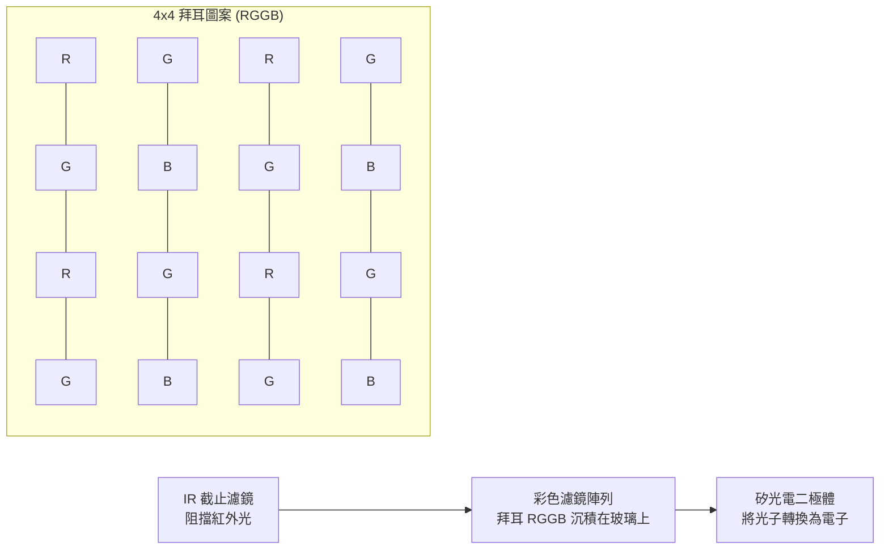
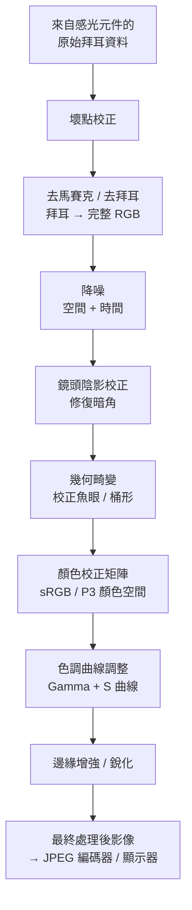
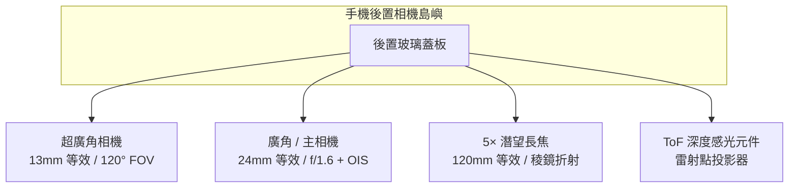
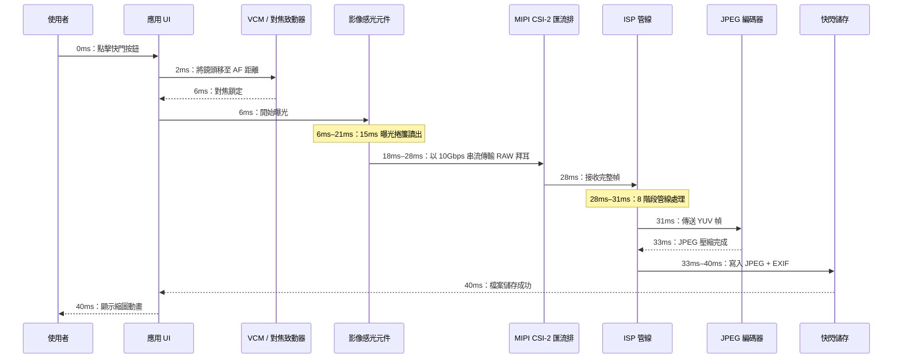

# 第2章：理解智慧型手機相機

在撰寫第一行 Camera2 API 程式碼之前，你必須理解你的程式碼將要指揮的實體硬體。智慧型手機相機不僅僅是「一個對準感光元件的鏡頭」。它是一個高度整合、密封、精密工程的元件，包含光學元件、致動器、濾鏡、半導體和高速資料匯流排。本章將解釋每一個元件，從最初接收光線的玻璃，到最終照片儲存的快閃記憶體晶片。

本章的目標是幫助你建立把相機管線視為一個實體系統的心智模型。當後續章節要求你使用 `CONTROL_AE_TARGET_FPS_RANGE` 或 `SENSOR_SENSITIVITY` 配置擷取請求時，你會清楚地理解這些參數究竟影響哪個硬體部件，以及為什麼這些數值很重要。

## 相機模組：一個密封的光學元件

當你檢視現代旗艦手機的背面——例如 Pixel 10 或 Galaxy S26 Ultra——你會看到一個凸起的矩形島嶼，從後置玻璃表面突出約 2 到 4 公釐。這個島嶼並非單一相機。一個矩形島嶼內包含三個獨立的圓形模組：底部最大的那個是主廣角，上方較小的那個是 3× 潛望長焦，左側中等大小的那個是 0.5× 超廣角。島嶼內的每個圓形「凸起」都是一個完整、獨立的相機模組。

相機模組是在無塵潔淨室中製造的密封單元。它由以下部分構成，按從外部到內部的順序排列：

1. **保護蓋板玻璃**：一塊耐刮擦的藍寶石或 Gorilla Glass 視窗，用於密封模組並防止灰塵進入。
2. **鏡筒**：一個由 4 至 6 片單獨的玻璃（有時是塑膠非球面）鏡片組成的圓柱形堆疊，透過薄塑膠隔片保持精確對齊。
3. **音圈馬達 (VCM)**：一種電磁致動器，可將整個鏡筒沿光軸向前或向後移動零點幾公釐以實現自動對焦。一些高階 VCM 還能讓鏡頭沿垂直於光軸的方向移動，以實現光學防手震 (OIS)。
4. **紅外線 (IR) 截止濾鏡**：一片薄薄的鍍膜玻璃晶圓，直接放置在感光元件前方。它阻擋紅外光（矽感光元件對紅外敏感，但人眼不敏感），使記錄的顏色與人眼所感知的相符。
5. **感光元件裸晶**：矽基 CMOS 影像感光元件晶片本身，透過打線接合連接到基板上。有效像素陣列朝上面對鏡頭。
6. **柔性印刷電路板 (FPC)**：一條薄而柔軟的排線，將電源、接地、控制訊號 (I2C) 和高速影像資料 (MIPI CSI-2) 從模組傳輸到手機主機板。
7. **板對板連接器**：位於 FPC 末端的一個微小、高密度插頭，可插入手機主 PCB 上對應的插座。

整個元件——從蓋板玻璃到連接器——對於傳統的後置相機，厚度通常為 5 到 8 公釐；對於潛望長焦，長度（在手機內部水平方向上）為 10 到 14 公釐。模組在工廠逐一校準：鏡頭對齊、感光元件傾斜、顏色陰影和對焦無限遠位置都會被測量並儲存在模組自身的一次性可程式設計 (OTP) 記憶體中。Camera2 API 在裝置開機時讀取這些校準資料，因此你的應用程式無需考慮製造單元間的差異。

## 鏡頭：焦距、光圈和防手震

鏡頭是光線遇到的第一個元件。它的工作是彎曲入射光線，使其精確匯聚在影像感光元件所在的平面上，形成清晰的影像。

### 焦距和全片幅等效

焦距決定了視場角（場景中有多少能進入畫面）和放大倍率（遠處被攝物看起來有多大）。智慧型手機相機規格總是宣傳**全片幅等效焦距**。這是一種將不同感光元件尺寸進行歸一化的慣例，以便消費者能夠在同等條件下進行比較。全片幅感光元件是歷史上 35mm 軟片單眼相機使用的 36mm × 24mm 尺寸。

智慧型手機上常見的全片幅等效焦距：

- **10–18mm（超廣角）**：100° 至 130° 對角視場角。用於風景、建築、團體自拍和近距離微距拍攝。
- **22–28mm（廣角/主鏡頭）**：每支手機的預設「標準」相機。約 75° 視場角，類似於人眼周邊視覺但更平坦。
- **45–80mm（長焦，2× 至 3×）**：30° 至 50° 的窄視場角。用於人像（自然的人物面部比例、較少的透視畸變）和一般變焦。
- **100–240mm（潛望長焦，5× 至 10×）**：10° 至 25° 視場角。稜鏡折彎的潛望設計允許較長的焦距，而不會讓手機厚達 2 公分。

以下是光線穿過典型 5 片廣角鏡頭組件的路徑：

### 光圈

光圈是鏡頭內部光線通過的開口大小。它用 **f 值**（或 f 號）描述：焦距除以光圈直徑。**較小的 f 值意味著較大的開口，意味著更多光線**到達感光元件。

- f/1.4 至 f/1.8：非常大的光圈。典型旗艦主鏡頭。在低光環境下表現優異。
- f/2.0 至 f/2.4：中等光圈。大多數手機上的典型超廣角和長焦相機。
- f/2.8 至 f/4.0：窄光圈。見於低成本前置相機和某些潛望模組。

智慧型手機相機的光圈通常是固定的。少數 2020 年代的三星旗艦採用了**可變光圈機構**，具有雙隔膜，可在 f/1.5 和 f/2.4 之間機械切換。如今這極為罕見，因為基於 VCM 的對焦和多幀運算 HDR 已使可變光圈在大多數使用場景下不再必要。

### 光學防手震 (OIS)

當你握住手機時，手會自然產生微小的角度抖動——在 1/30 秒內大約 0.1° 至 0.5°。在足夠長的曝光時間內，這種抖動會導致整個影像模糊。**光學防手震 (OIS)** 透過物理移動鏡筒（鏡頭位移 OIS）或感光元件裸晶本身（感光元件位移 OIS）來抵消偵測到的運動，從而解決此問題。相機模組內的一個微型陀螺儀（或來自手機主 IMU 的共享訊號）每秒測量角速度 1,000 至 8,000 次，OIS 致動器相應地移動光學元件。OIS 通常可以補償 3 到 5 級手震，這意味著原本需要 1/60 秒才能保持清晰的曝光，現在可以在 1/8 秒或 1/4 秒拍攝而保持同等清晰度。

## 影像感光元件：光變電的地方

影像感光元件是一塊矽晶片，包含數百萬個獨立的稱為**光電二極體**的光偵測器，排列成精確的矩形網格。如今每個智慧型手機感光元件都是 **CMOS（互補金屬氧化物半導體）** 類型。

### 像素尺寸和像素數

每個獨立的光電二極體 + 讀出電路稱為一個**像素**。每個像素的實體尺寸（以微米 μm 為單位測量）可以說比總像素數更重要。較大的像素在單位時間內捕獲更多光子，這意味著較少的散粒雜訊和更好的低光效能。

2026 年智慧型手機中常見的像素尺寸：

- **0.6μm 至 0.8μm**：非常小的像素。用於 108MP 至 200MP 高解析度感光元件。它們完全依賴像素合併來獲得可接受的雜訊水平。
- **1.0μm 至 1.2μm**：中等尺寸。用於 48MP 至 64MP 感光元件，預設 4:1 合併為 12MP–16MP 輸出。
- **2.0μm 至 2.4μm**：大型「旗艦」像素。用於專用 12MP–16MP 感光元件（Google Pixel、iPhone Pro），或作為 48MP 感光元件在「高品質」模式下合併後的輸出。

像素合併是在讀出期間將相鄰 2×2（或 3×3，或 4×4）像素的電荷合併為一個「超級像素」的技術。一個具有 0.8μm 單像素的 48MP 感光元件，當 4:1 合併時，行為類似一個具有 1.6μm 有效像素的 12MP 感光元件——顯著提高了訊號雜訊比。Camera2 API 將全解析度原始模式和預設合併模式作為單獨的串流配置公開。

像素數的計算很簡單：一個 48MP 感光元件具有約 8,000 × 6,000 個光電二極體的有效陣列 = 48,000,000 個獨立的光偵測器。

### 感光元件尺寸分類

感光元件尺寸遵循可追溯到 1950 年代 Vidicon 電視攝像管的舊式英吋記法。格式為「1/X 英吋」，其中 X 是除數；X 越小，感光元件越大：

- 1/3.06" 至 1/2.55"：小尺寸感光元件，典型用於前置相機和廉價超廣角（約 5MP 至 13MP）。
- 1/1.7" 至 1/1.3"：大型行動感光元件，旗艦主鏡頭（48MP、50MP、108MP）。
- 1 英吋（Type 1）：對手機而言非常大。見於 Xiaomi 13 Ultra、Sharp Aquos R 系列和 Sony Xperia Pro-I。有效區域約 13.2mm × 8.8mm——接近某些 Micro Four Thirds 相機的尺寸。

在像素數相同的情況下，較大的感光元件總是有較大的單一像素。這就是「一英吋感光元件」手機在低光下表現明顯更好的原因。

### 拜耳彩色濾鏡陣列 (CFA)

原始的矽光電二極體是色盲的——它只測量總光子強度，不測量波長。為了記錄顏色，製造商在每個單獨像素上方沉積一層微小的**彩色濾鏡**。幾乎通用的模式是**拜耳 RGGB 濾鏡陣列**：50% 綠色像素，25% 紅色，25% 藍色，以重複的 2×2 平鋪排列。人眼對綠光更敏感，因此將綠色取樣加倍可提高感知的亮度解析度和雜訊效能。

讀出後，感光元件資料是獨立紅、綠、藍值的馬賽克——還不是完整的彩色影像。為每個像素填補缺失顏色資訊的步驟稱為**去馬賽克**（或去拜耳），這是 ISP 中執行的第一個主要運算步驟。

### 捲簾快門 vs 全域快門

幾乎每個智慧型手機影像感光元件都使用**捲簾快門**。感光元件不會同時曝光或讀取所有像素。相反，它從上到下逐行曝光和讀取像素陣列，一次一行。一個典型的 48MP 感光元件捲簾讀出對於全幀擷取大約需要 15 到 25 毫秒。

捲簾快門在非常快速移動的物體上會產生特徵性失真：旋轉的飛機螺旋槳或吊扇看起來彎曲或呈波浪狀；垂直搖拍建築的頂部和底部向相反方向傾斜（影片中的「果凍效應」）。相比之下，全域快門感光元件同時曝光所有像素，並在曝光結束後一次性讀取。全域快門用於機器視覺、運動相機和某些專用前置 IR 臉部解鎖感光元件，但全域快門的像素設計光靈敏度較低、成本較高，因此不用於主智慧型手機相機。

## ISP：影像訊號處理器

**ISP（影像訊號處理器）** 是一個專用硬體區塊（獨立晶片，或更常見的是與 CPU 和 GPU 一起整合在主 SoC 中的部分），其唯一的工作是將從感光元件流出的原始、馬賽克化、有雜訊、有失真的資料轉換為視覺上令人愉悅的彩色影像。

ISP 以極高的吞吐量執行一條固定的、硬接線的影像處理階段管線。一個現代 48MP 感光元件以每秒 30 幀執行時，每秒向 ISP 傳送 14.4 億個像素。ISP 必須在每幀 33 毫秒內處理每個像素通過所有階段才能跟上。

規範的 ISP 管線階段，按順序如下：

1. **壞點校正**：工廠校準的「卡死」像素（始終亮或始終暗）被替換為相鄰像素的插值。
2. **去馬賽克 / 去拜耳**：透過使用邊緣感知插值演算法從周圍像素估計每個像素位置缺失的兩個顏色通道，將拜耳 RGGB 馬賽克轉換為完整的 RGB 影像。
3. **降噪（時間 + 空間）**：抑制隨機的散粒雜訊和感光元件讀出雜訊。空間降噪在保留邊緣的同時平滑平坦區域。時間降噪（如果可用）合併來自先前影片幀的資訊以獲得更乾淨的結果。
4. **鏡頭陰影校正（暗角校正）**：影像角落自然較暗，因為光線必須以更陡的角度穿過鏡頭。ISP 套用逐像素的數位增益斜坡，在角落處更亮，以使照明平坦。此斜坡的校準資料儲存在模組的 OTP 中。
5. **幾何畸變校正**：超廣角和魚眼鏡頭產生桶形畸變（直線向外彎曲）。ISP 使用儲存的多項式鏡頭模型重新映射像素座標，生成直線實際顯示為直線的 rectilinear 影像。此步驟固有地裁剪外圈 5–10% 的像素。
6. **顏色校正矩陣 (CCM)**：原始感光元件的 RGB 光譜響應與人眼的三色響應不匹配。3×3 矩陣乘法將感光元件原生 RGB 轉換為標準 sRGB 或 DCI-P3 顏色空間。CCM 係數按每個模組、每種光源（日光、鎢絲燈、螢光燈）進行調校。
7. **色調曲線調整**：對線性 RGB 資料套用非線性的 S 形色調映射曲線，將高動態範圍感光元件訊號壓縮到低動態範圍輸出（通常是 8 位元 sRGB gamma 編碼）。這一步使影像「突出」——中間調對比度增加，高光被捲離，陰影被提升。
8. **邊緣增強 / 銳化**：套用細微的非銳化遮罩以恢復被降噪和光學低通濾波器軟化的高頻細節。銳化量被精心控制以避免引入光暈。

ISP 的處理品質是手機製造商之間的主要差異化因素。Google、Samsung、Apple 和 Xiaomi 各自以不同的藝術優先級調校其 ISP 管線：一些偏好自然色彩，一些偏好過飽和的「鮮豔」輸出，一些在降噪與保留細節之間取捨不同。Camera2 API 讓你可以部分控制單個 ISP 階段的強度（透過 Android tonemap 和顏色校正控制項），但大多數詳細的階段參數被鎖定在廠商專有 API 之後。

## RAW vs JPEG：從感光元件到儲存的兩條路徑

上述 ISP 管線產生處理後的影像。但 Camera2 API 還允許你完全繞過 ISP 並直接讀取原始感光元件資料。這是 RAW 和 JPEG 輸出之間的關鍵區別。

### RAW 格式

**RAW 檔案**（在 Android 上這意味著 DNG 檔案，即 Digital Negative）包含 ISP 處理執行之前感光元件測量到的精確資料。它是每個像素 10 位元、12 位元或 14 位元的拜耳馬賽克——仍然在原始 RGGB 圖案中，仍然有暗角，仍然有雜訊，仍然是線性的。RAW 檔案還包含元資料標籤，指定確切的彩色濾鏡陣列圖案、感光元件的顏色設定檔、黑電平、白電平和鏡頭模型。

- **位元深度**：RAW10 = 每通道 10 位元 = 1,024 級。RAW12 = 4,096 級。RAW14 = 16,384 級。相比之下 JPEG 的 8 位元 = 256 級。
- **檔案大小**：每張 48MP 照片 20–40 MB。未壓縮或近無損壓縮。
- **使用場景**：專業後期製作編輯。額外的級位裕量允許編輯器「挽救」過曝的高光（2 到 3 級 EV）或提升欠曝的陰影而不會出現條帶。

### JPEG 格式

**JPEG 檔案**是 ISP 的完全加工輸出。上述 8 個 ISP 階段中的每一個都已套用於像素資料。然後影像從 RGB 轉換為 YCbCr 4:2:0 色度子取樣色彩空間，並以大約 10:1 到 20:1 的壓縮比使用有損離散餘弦轉換演算法進行壓縮。

- **位元深度**：始終為每通道 8 位元 = 每色 256 級。
- **檔案大小**：12MP–48MP 照片 2–5 MB，取決於 JPEG 品質級別。
- **使用場景**：即時分享、社群媒體，以及任何照片「已完成」的工作流程。在行動編輯器中的調整會迅速降低影像品質，因為只剩下 256 級。

### 對比表：RAW vs JPEG

| 特性 | RAW (DNG) | JPEG |
|---------|-----------|------|
| 套用的 ISP 處理 | 無——所有階段都跳過 | 全部 8 個階段已套用且不可逆 |
| 色彩深度 | 10–14 位元 (1,024–16,384 級) | 8 位元 (256 級) |
| 白平衡 | 在元資料中標記，後期完全可更改 | 已嵌入像素——僅可微調 |
| 曝光寬容度 | ±2 至 3 級可恢復 | 出現條帶前最多 ±1/2 級 |
| 檔案大小 (48MP) | 25–40 MB | 3–6 MB |
| 色彩空間 | 感光元件原生線性 RGB | sRGB 或 Display P3 gamma 編碼 |
| 銳化 / 降噪 | 無——編輯者的選擇 | 已套用；無法撤銷 |
| 典型工作流程 | Adobe Lightroom / Capture One 工作流程 | 直接分享到 Instagram / Messages |

## 多鏡頭手機：為什麼不是一個巨大的變焦鏡頭？

傳統的隨身相機使用一個帶有移動內部鏡組的變焦鏡頭，可以連續改變焦距從廣角到長焦。為什麼智慧型手機不能這樣做？物理。一個 10× 變焦鏡頭，覆蓋 24mm–240mm 全片幅等效焦距並具有恆定 f/2.8 光圈，需要大約 5 公分（2 英吋）長的光路。一支智慧型手機最多只有 0.9 公分厚。數學上根本不成立。

智慧型手機行業不是用變焦鏡頭解決這個問題，而是採用**多個定焦相機**，每個針對不同用途最佳化，外加一個「平滑變焦」運算系統，在特定變焦比例處從一個相機淡入到下一個。

一個典型的 2026 年旗艦後置相機島嶼包含：

1. **超廣角（0.5× 變焦，約 13mm 等效，約 120° FOV）**：短焦距，大景深。非常適合風景、建築、團體照，以及透過軟體重新定位時的近焦微距。
2. **廣角 / 主鏡頭（1× 變焦，約 24mm 等效，約 75° FOV）**：預設相機。最大的感光元件、最寬的光圈、最好的 OIS。用於 80% 的日常照片。
3. **長焦 / 潛望（3× 至 10× 光學，約 72mm 至約 240mm 等效）**：傳統長焦鏡頭 (3×) 直接位於其感光元件上方。潛望長焦 (5×, 10×) 在手機邊緣附近使用 45° 稜鏡將光線反射 90°，使鏡筒在手機機身內水平執行而不是垂直穿過其厚度。
4. **ToF / 深度感光元件**：一個近紅外雷射點投影器（或在 iPhone 上的結構光 LiDAR 掃描儀），向場景投射 30,000+ 個 IR 點並測量其往返時間以產生逐像素深度圖。用於精確的人像背景虛化、擴增實境遮擋和低光下的快速自動對焦。

當你在相機應用程式中執行捏合變焦手勢時，HAL（硬體抽象層）會在預定的閾值處平滑切換活動的實體相機。例如，從 0.5× 變焦到 1.0× 會從超廣角淡入到廣角。在 2.9× 時，應用程式仍然在數位裁切廣角相機。在 3.0× 時，HAL 將活動源切換到潛望長焦相機。在這些變焦比例之間，一個複雜的影像融合演算法同時使用兩個相機以保持無縫過渡。

## 完整旅程：從光子到儲存的照片，逐毫秒

以下是單張靜態照片擷取期間智慧型手機內部實體發生的完整編號時間線，從使用者手指離開虛擬快門按鈕的那一刻開始。這些數字代表了 2026 年旗艦在日光下擷取 12MP 預設模式 JPEG 的典型情況：

- **0 ms**：使用者點擊快門。Camera2 API 框架接收帶有 `TEMPLATE_STILL_CAPTURE` 的 `CaptureRequest`。
- **0–2 ms**：3A 演算法（自動對焦、自動曝光、自動白平衡）收斂到最終值。
- **2–6 ms**：音圈馬達 (VCM) 給線圈通電，實體上將鏡筒移動 0.2mm 至 AF 演算法計算的精確對焦距離。
- **6–21 ms（15 ms 曝光）**：全域復位釋放感光元件像素的電荷。在 15 毫秒內，光電二極體累積光子產生的電子。捲簾快門在此視窗期間和之後逐行讀出。
- **18–28 ms**：感光元件透過 MIPI CSI-2 高速序列匯流排輸出原始拜耳資料。典型配置是 4 條資料通道，每通道 2.5 Gbps = 總頻寬 10 Gbps，可輕鬆處理 12MP 幀的原始位元深度加上消隱間隔。
- **28–31 ms**：ISP 的 8 階段管線透過壞點校正、去馬賽克、降噪、鏡頭陰影、幾何校正、顏色矩陣、色調曲線和銳化處理該幀。這完全在硬體中發生——像素級別無 CPU 參與。
- **31–33 ms**：處理後的 YUV 影像被傳送到硬體 JPEG 編碼器，該編碼器以品質級別 90–95 套用有損 DCT 壓縮並寫入 JFIF 檔案標頭（EXIF、縮圖，如有標記則包含 GPS 座標）。
- **33–40 ms**：完成的 JPEG 二進位大型物件透過 MediaStore 內容提供者寫入應用程式的檔案目錄，例如 `/data/data/com.yourpackagename/files/DCIM/Camera/IMG_20260806_151042.jpg`。MediaScanner 被通知，照片出現在系統圖庫中。

整個過程對於日光靜態照片端到端大約需要 40 毫秒。在低光環境下，曝光時間本身會延長（對於夜景模式多幀擷取可能長達數秒），時間線也會按比例延長。

## 總結

你現在對智慧型手機相機系統有了完整的實體圖景。你知道每個後置相機凸起都是一個密封模組，包含一個多片鏡筒、一個 VCM 自動對焦致動器、一個 IR 截止濾鏡、一個帶有拜耳 RGGB 彩色濾鏡陣列的 CMOS 感光元件，以及一條傳輸 MIPI CSI-2 資料的柔性排線。你理解焦距等效、光圈和 OIS。你知道 ISP 的 8 階段管線如何將原始拜耳馬賽克轉換為最終的 JPEG，並且你能區分 RAW（感光元件原生，10–14 位元，後期處理裕量）和 JPEG（ISP 處理過，8 位元，可即時分享）。你理解為什麼現代手機使用 3 個以上定焦相機而不是變焦鏡頭，並且你已經走過了單張照片擷取的精確逐毫秒時間線。

## 下一步

在第 3 章中，我們將從實體硬體轉向該硬體能夠產生的成果。我們將探索現代智慧型手機攝影的實際功能：HDR 多幀包圍、透過立體 / ToF / ML 實現的人像背景虛化、Night Sight 多幀長曝光、慢動作高速影片擷取、超廣角畸變校正和潛望長焦。你將學習運算攝影——光學、感光元件、多幀訊號處理和裝置端機器學習的融合——如何創造出任何單一鏡頭/感光元件組合都無法獨立產生的影像。
