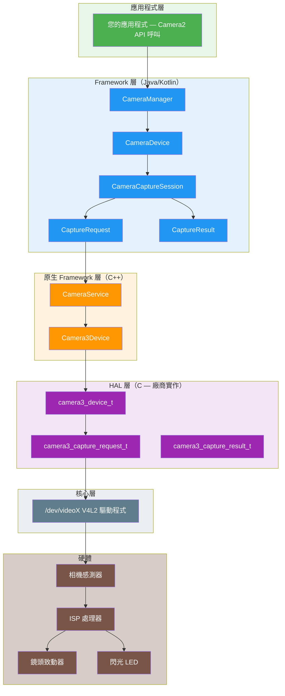
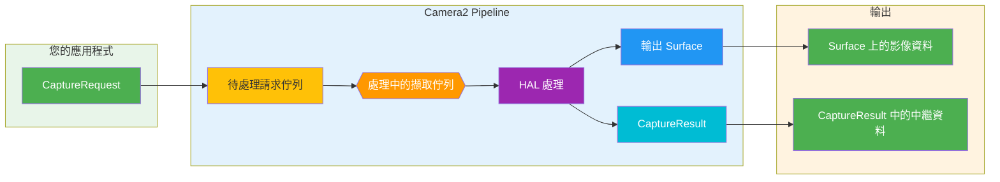
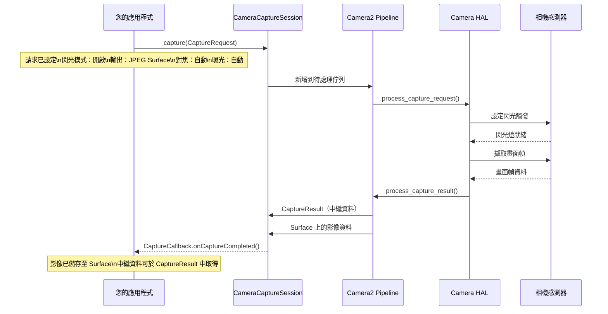
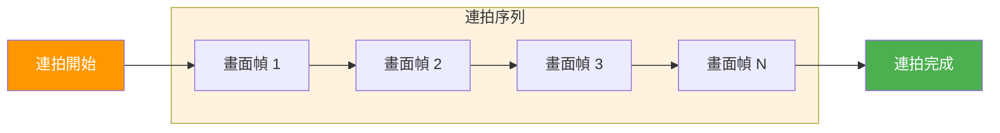
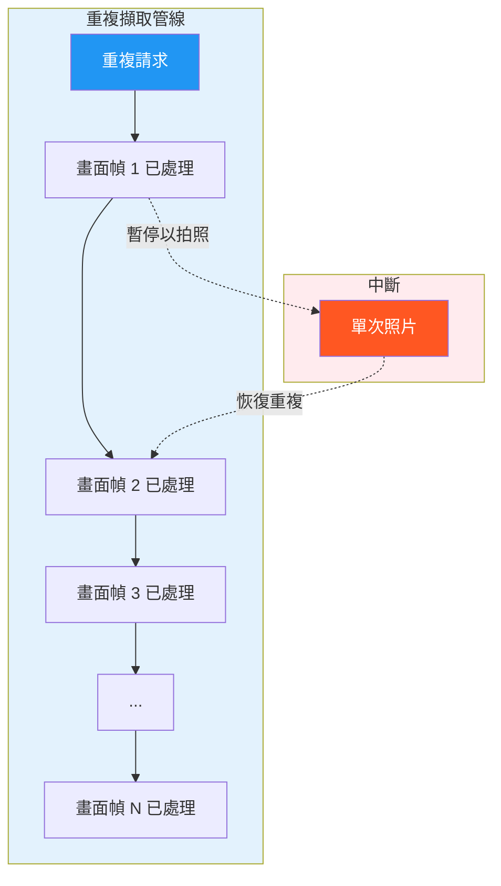
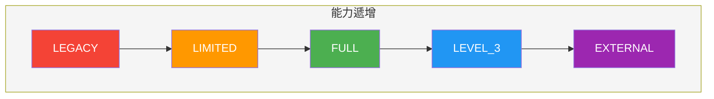
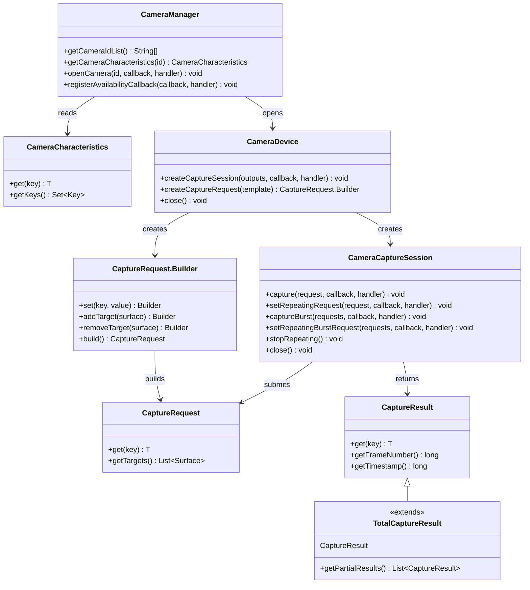
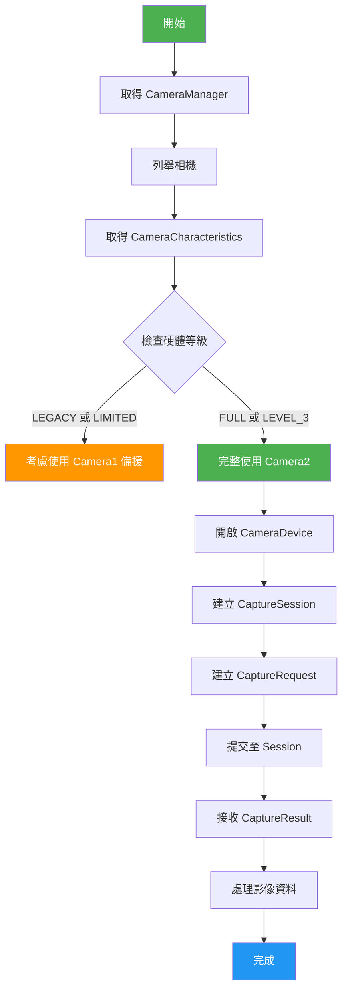
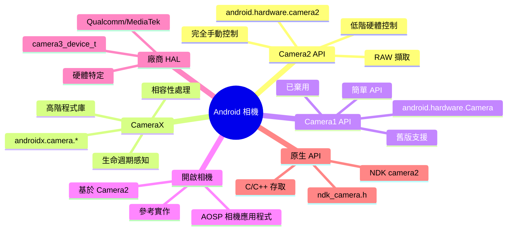

# 第 1 章：歡迎使用 Android Camera2

> ** chapter 概述：** 在本章中，我們將從頭開始探索 Android Camera2 的世界。您不僅會了解 Camera2 *是什麼*，還會了解它*為何*被建立、*如何*運作，以及它在 Android 相機生態系中的定位。我們將涵蓋 Pipeline 模型、擷取類型、硬體等級分類，以及從 App 到 HAL 的完整架構。

---

## 1.1 為何要學習 Camera2？

幾乎每一支智慧型手機現在都擁有強大的相機系統。現代手機可以：

- 透過計算攝影技術擁有專業級的拍照效果
- 以高幀率錄製 4K 和 8K 影片
- 透過深度感應產生人像效果
- 使用夜間模式在極端低光環境下拍攝
- 以 960 fps 拍攝慢動作影片
- 為 AR 應用程式產生 3D 深度資訊
- 無縫結合多個相機

但當您開啟預設相機應用程式時，您只會看到簡單的介面：一個快門按鈕、一個縮放控制項，以及幾個拍攝模式。

在這個簡單介面的背後，是一個驚人複雜的系統。相機應用程式與硬體元件、影像處理器和 Android Framework 通訊，以產生每一個畫面幀。

### 誰應該學習 Camera2？

身為 Android 開發人員，我們可能想要建立超越預設相機應用程式的應用程式：

- 一個**手動攝影應用程式**，可完全控制曝光、ISO 和對焦
- 一個**相機測試工具**，供技術人員驗證裝置能力
- 一個**電腦視覺應用程式**，需要原始畫面幀存取權
- 一個**3D 掃描應用程式**，使用深度感測器
- 一個**專業影片錄影器**，支援編碼器選擇和位元率控制
- 一個**相機能力分析器**，就像我們自己的 [Android Camera Parameters](/)

如果這些情境看起來很熟悉，Camera2 就是您需要精通的 API。

---

## 1.2 什麼是 Android Camera2？

**Android Camera2** 是 Google 在 **Android 5.0（API 等級 21）** 中引入的現代相機框架。它取代了原本的 `android.hardware.Camera` API（現在回溯稱為 **Camera1**）。

### Camera2 解決的問題

舊版相機 API（Camera1）是為較簡單的世界所設計的：單一相機、基本照片拍攝和簡單影片錄製。但智慧型手機相機已大幅演進：

| 年代 | 典型裝置 | 相機 API |
|------|----------|----------|
| 2010-2014 | 單一相機、基本感測器 | Camera1 |
| 2015-2018 | 雙相機、OIS、HDR | Camera2（有限使用） |
| 2019-2022 | 三相機、深度、望遠 | Camera2（標準） |
| 2023+ | 四相機、潛望式、LiDAR、UWB | Camera2（必要） |

現代裝置可能包含多個後置相機（廣角、超廣角、望遠、潛望式）、深度感測器，甚至外接 USB 相機。它們支援進階功能，例如：

- 手動曝光和對焦
- RAW 影像擷取
- 高速影片錄製
- HDR 處理
- 光學防手震（OIS）
- 多相機融合

Camera2 的建立是為了讓開發人員能夠對相機硬體進行**深度、精確且細粒度的控制**。

---

## 1.3 Camera2 與 Camera1 與 CameraX 的比較

在深入研究 Camera2 之前，讓我們先釐清三大相機 API 之間的關係。

### Camera1（`android.hardware.Camera`）

- **引入時間：** Android 1.0（於 Android 5.0 棄用）
- **模型：** 程序式、具狀態、以單一相機為導向
- **優點：** 簡單、易於理解、廣泛相容
- **缺點：** 控制有限、不支援 RAW、不支援多相機、不支援連拍模式

### Camera2（`android.hardware.camera2`）

- **引入時間：** Android 5.0（API 21）
- **模型：** 物件導向、無狀態、請求/回應管線
- **優點：** 深度硬體控制、支援 RAW、支援多相機、支援高速影片
- **缺點：** 複雜、冗長、需要了解相機內部運作

### CameraX（`androidx.camera.*`）

- **引入時間：** Android 10（預發版），Android 11+ 穩定版
- **模型：** 宣告式、生命週期感知、以使用案例為驅動
- **優點：** 易於使用、自動相容性、生命週期管理
- **缺點：** 進階控制有限，可能無法暴露所有硬體功能

### 比較表

| 維度 | Camera1 | Camera2 | CameraX |
|------|---------|---------|---------|
| **等級** | 低階（已棄用） | 低階（目前） | 高階（Jetpack） |
| **難易度** | 簡單 | 困難 | 簡單 |
| **控制度** | 最少 | 最大 | 中等 |
| **RAW 支援** | 否 | 是 | 有限 |
| **多相機** | 否 | 是 | 有限 |
| **連拍模式** | 否 | 是 | 否 |
| **手動控制** | 有限 | 完整 | 有限 |
| **最適合** | 舊版應用程式 | 進階相機應用程式 | 大多數相機應用程式 |
| **狀態** | 已棄用 | 仍在使用 | 建議使用 |

### 為何本系列著重於 Camera2

雖然 CameraX 是大多數應用程式的建議方案，但了解 Camera2 仍然至關重要，因為：

1. **CameraX 建構於 Camera2 之上** — CameraX 在底層使用 Camera2。了解 Camera2 有助於您理解 CameraX 的運作方式。
2. **某些功能僅在 Camera2 中可用** — RAW 擷取、手動感測器控制和進階多相機情境需要使用 Camera2。
3. **除錯需要 Camera2 知識** — 當 CameraX 應用程式無法如預期運作時，您通常需要了解底層的 Camera2 行為來診斷問題。
4. **了解 Camera2 是基礎** — 即使您的應用程式使用 CameraX，了解 Camera2 也能讓您成為更優秀的 Android 相機開發人員。

---

## 1.4 Camera2 架構：整體概覽

Camera2 位於 Android 相機堆疊的中間，連結應用程式碼與硬體驅動程式。了解此架構對於除錯和效能優化至關重要。

### 分層架構



### 架構層說明

| 層 | 位置 | 語言 | 職責 |
|----|------|------|------|
| **應用程式** | 您的應用程式碼 | Kotlin/Java | 建立 CaptureRequest、處理 CaptureResult |
| **Framework（Java）** | `android.hardware.camera2.*` | Java | 公開 API、管理 session、轉換資料 |
| **原生 Framework** | `frameworks/av/` | C++ | Binder IPC、CameraService、Camera3Device |
| **HAL** | `hardware/libhardware/` + 廠商 | C | 硬體抽象、廠商特定實作 |
| **核心** | `/dev/videoX` | C | V4L2 驅動程式、硬體通訊 |
| **硬體** | 實體相機模組 | — | 感測器、ISP、鏡頭、閃光燈 |

### 核心設計原則：Camera2 是一個 Pipeline

關於 Camera2 最重要的概念是，它將相機操作建模為一個**管線（Pipeline）**。每一個動作 — 預覽、照片拍攝、影片錄製 — 都被表示為一個**擷取請求（Capture Request）**，流經管線並產生一個**擷取結果（Capture Result）**。

---

## 1.5 Camera2 Pipeline 模型

Pipeline 是 Camera2 設計的核心。它以無狀態、請求/回應模型取代了 Camera1 的具狀態、一次一個的模型。

### Pipeline 如何運作



### Pipeline 元件說明

| 元件 | 說明 |
|------|------|
| **CaptureRequest** | 一個設定物件，描述*單一畫面幀*的擷取。包含所有參數：曝光時間、對焦模式、閃光燈、輸出 Surface 等。 |
| **待處理請求佇列** | 新的 CaptureRequest 等待處理的 FIFO 佇列 |
| **處理中的擷取佇列** | 目前由 HAL 處理的請求。通常限制為 1-4 個請求，視裝置而定 |
| **HAL 處理** | 硬體抽象層處理請求：控制感測器、ISP、鏡頭等 |
| **輸出 Surface** | 影像被寫入到已設定的 Surface（預覽 Surface、ImageReader Surface 等） |
| **CaptureResult** | 關於擷取的中繼資料：實際曝光時間、AF 狀態、時間戳記等。**不**包含影像資料 |

### Pipeline 關鍵屬性

1. **請求是無狀態的** — 每個 CaptureRequest 都包含所有必要資訊。管線沒有先前請求的記憶。
2. **處理是循序的** — 請求由 HAL 以 FIFO 順序處理。
3. **結果是非同步的** — CaptureResult 透過回傳函式到達，而非同步回傳。
4. **每個請求可有多個輸出** — 一個 CaptureRequest 可以寫入多個 Surface（例如，同時預覽和拍照）。
5. **Pipeline 可以設定** — 您可以選擇範本（預覽、靜態拍攝、錄影）或完全手動模式。

### 具體範例：使用閃光燈拍照

為了了解 Pipeline，讓我們追踪使用閃光燈拍照時發生的過程：



---

## 1.6 擷取類型：單次、連拍與重複

Camera2 定義了三種基本的擷取類型，各自服務不同的使用情境。了解這些對於正確設計相機應用程式至關重要。

### 類型 1：單次擷取（One-Shot Capture）

**單次**擷取只執行一次。它們非常適合單一動作，例如拍照或套用一次性的設定變更。


**使用情境：**
- 拍攝單張照片
- 套用臨時閃光燈
- 擷取畫面幀進行分析
- 觸發一次自動對焦

**API 呼叫：**
```kotlin
cameraCaptureSession.capture(captureRequest, callback, handler)
```

### 類型 2：連拍擷取（Burst Capture）

**連拍**擷取不中斷地連續執行多次。一旦開始，在連拍完成之前，無法插入其他請求。



**關鍵特性：**
- 連拍中的所有畫面幀具有相同或逐步變化的設定
- 連拍期間無法處理其他請求
- 連拍佇列與待處理請求佇列分離
- 優先級高於重複請求

**使用情境：**
- 連續照片擷取（連拍模式）
- 包圍曝光（在不同曝光下擷取同一場景）
- 動作分析（擷取快速移動的主體）
- 用於合成的連續多幀擷取

**API 呼叫：**
```kotlin
cameraCaptureSession.captureBurst(burstRequests, callback, handler)
```

### 類型 3：重複擷取（Repeating Capture）

**重複**擷取持續執行，形成即時預覽和影片錄製的基礎。當重複請求啟用時，它會佔用管線與其他擷取之間的資源。



**關鍵特性：**
- 同一時間只能有一個重複請求處於啟用狀態（取代前一個）
- 可被單次和連拍請求中斷，然後自動恢復
- 形成預覽和影片錄製的基礎
- 不會為每個畫面幀產生單獨的 CaptureResult（為了效率使用部分結果）

**使用情境：**
- 即時相機預覽
- 影片錄製
- 連續對焦監控
- 即時畫面幀分析

**API 呼叫：**
```kotlin
cameraCaptureSession.setRepeatingRequest(captureRequest, callback, handler)
// 或用於影片：
cameraCaptureSession.setRepeatingBurstRequest(burstRequests, callback, handler)
```

### 擷取類型比較

| 功能 | 單次 | 連拍 | 重複 |
|------|------|------|------|
| **執行次數** | 一次 | 多次（連續） | 持續 |
| **優先級** | 高 | 最高 | 最低 |
| **中斷** | 無法中斷 | 無法中斷 | 可被中斷 |
| **佇列** | 待處理佇列 | 獨立連拍佇列 | 管線佔用 |
| **典型用途** | 照片、單一畫面幀 | 連拍模式、包圍曝光 | 預覽、影片 |
| **結果回呼** | 每次呼叫一個結果 | 每幀一個結果 | 定期回傳結果 |

### 擷取範本系統

Camera2 為常見的擷取情境提供了預定義的範本：

| 範本 | 說明 | 使用情境 |
|------|------|----------|
| `TEMPLATE_PREVIEW` | 為即時預覽最佳化 | 相機預覽 |
| `TEMPLATE_STILL_CAPTURE` | 為照片擷取最佳化 | 拍照 |
| `TEMPLATE_RECORD` | 為影片錄製最佳化 | 影片擷取 |
| `TEMPLATE_VIDEO_SNAPSHOT` | 錄製影片時拍照 | 錄影時的快照 |
| `TEMPLATE_ZERO_SHUTTER_LAG` | 高品質、最小延遲 | 連拍攝影 |
| `TEMPLATE_MANUAL` | 所有自動控制已停用 | 完全手動控制 |

範本是預先設定常見參數的捷徑。之後您可以從範本修改個別設定。

---

## 1.7 支援的硬體等級

並非所有 Android 裝置都支援完整的 Camera2 功能集。為了解決這個問題，Google 定義了**支援的硬體等級** — 一個分類系統，用於告知開發人員可以從裝置的相機實作中期待什麼。

### 硬體等級分類



### 等級說明

| 等級 | 說明 | Camera2 支援 |
|------|------|-------------|
| **LEGACY** | 與 Camera1 向下相容。Camera2 呼叫在底層會轉換為 Camera1。 | 僅基本 Camera1 功能 |
| **LIMITED** | 支援部分 Camera2 功能。不保證完整的 Camera2 管線。 | 部分 Camera2 功能 |
| **FULL** | 完整的 Camera2 功能集。完整管線、手動控制、多相機。 | 所有 Camera2 功能 |
| **LEVEL_3** | 包含 FULL 的所有功能，加上 YUV 重處理和額外的輸出串流。 | FULL + 進階功能 |
| **EXTERNAL** | 類似於 LIMITED，但用於外接相機（USB 等）。 | 外接相機支援 |

### 如何檢查硬體等級

您可以使用 `CameraCharacteristics` 查詢硬體等級：

```kotlin
val cameraManager = getSystemService(Context.CAMERA_SERVICE) as CameraManager
val cameraId = cameraManager.cameraIdList[0]
val characteristics = cameraManager.getCameraCharacteristics(cameraId)

val hardwareLevel = characteristics.get(CameraCharacteristics.INFO_SUPPORTED_HARDWARE_LEVEL)
val levelName = when (hardwareLevel) {
    CameraCharacteristics.INFO_SUPPORTED_HARDWARE_LEVEL_LEGACY -> "LEGACY"
    CameraCharacteristics.INFO_SUPPORTED_HARDWARE_LEVEL_LIMITED -> "LIMITED"
    CameraCharacteristics.INFO_SUPPORTED_HARDWARE_LEVEL_FULL -> "FULL"
    CameraCharacteristics.INFO_SUPPORTED_HARDWARE_LEVEL_3 -> "LEVEL_3"
    CameraCharacteristics.INFO_SUPPORTED_HARDWARE_LEVEL_EXTERNAL -> "EXTERNAL"
    else -> "UNKNOWN"
}
Log.d("Camera", "Hardware Level: $levelName")
```

### 實際影響

| 等級 | 對您的應用程式代表什麼 |
|------|----------------------|
| **LEGACY** | Camera2 可能可用但有諸多限制。考慮使用 Camera1 作為備援。 |
| **LIMITED** | 基本 Camera2 功能可用。部分進階功能可能缺失。 |
| **FULL** | 完整的 Camera2 支援。可以安全使用所有 Camera2 功能。 |
| **LEVEL_3** | 可以使用 YUV 重處理和進階多串流功能。 |
| **EXTERNAL** | 可以支援 USB 相機和其他外接輸入。 |

### 執行階段能力查詢

除了硬體等級之外，請務必在執行階段檢查特定能力：

```kotlin
val capabilities = characteristics.get(CameraCharacteristics.REQUEST_AVAILABLE_CAPABILITIES)
capabilities?.forEach { capability ->
    when (capability) {
        CameraMetadata.REQUEST_AVAILABLE_CAPABILITIES_BACKWARD_COMPATIBLE ->
            Log.d("Camera", "Supports backward compatible mode")
        CameraMetadata.REQUEST_AVAILABLE_CAPABILITIES_MANUAL_SENSOR ->
            Log.d("Camera", "Supports manual sensor control")
        CameraMetadata.REQUEST_AVAILABLE_CAPABILITIES_MANUAL_POST_PROCESSING ->
            Log.d("Camera", "Supports manual post-processing")
        CameraMetadata.REQUEST_AVAILABLE_CAPABILITIES_RAW ->
            Log.d("Camera", "Supports RAW capture")
        CameraMetadata.REQUEST_AVAILABLE_CAPABILITIES_PRIVATE_REPROCESSING ->
            Log.d("Camera", "Supports private reprocessing")
        CameraMetadata.REQUEST_AVAILABLE_CAPABILITIES_DEEP_OUTPUT ->
            Log.d("Camera", "Supports deep output")
    }
}
```

---

## 1.8 Camera2 核心類別概述

Camera2 的 API 是圍繞一組核心類別所建構的。讓我們在深入研究每個類別之前先認識它們。

### 核心類別關係圖



### 類別職責

| 類別 | 套件 | 職責 |
|------|------|------|
| `CameraManager` | `android.hardware.camera2` | 頂層系統服務。列舉相機、提供 CameraDevice 的存取。 |
| `CameraCharacteristics` | `android.hardware.camera2` | 唯讀的相機能力中繼資料。 |
| `CameraDevice` | `android.hardware.camera2` | 代表已連接的相機。建立 session 和擷取請求建構器。 |
| `CameraCaptureSession` | `android.hardware.camera2` | 管線執行個體。提交 CaptureRequest、管理重複擷取。 |
| `CaptureRequest` | `android.hardware.camera2` | 不可變的擷取設定。單一畫面幀的所有參數。 |
| `CaptureRequest.Builder` | `android.hardware.camera2` | 用於建立 CaptureRequest 物件的建構器。 |
| `CaptureResult` | `android.hardware.camera2` | 已完成擷取的中繼資料輸出。 |
| `TotalCaptureResult` | `android.hardware.camera2` | 包含所有部分結果的完整擷取結果。 |

### Camera2 工作流程



---

## 1.9 Camera2 與 Camera1：詳細比較

如果您之前使用過 Camera1，您會更欣賞兩者之間的差異。如果您沒有使用過，這一節將幫助您理解為何 Camera2 是一次根本性的重新設計。

### 架構比較

| 面向 | Camera1 | Camera2 |
|------|---------|---------|
| **程式設計模型** | 程序式（指令式） | 物件導向（宣告式） |
| **狀態管理** | 具狀態（相機維護狀態） | 無狀態（每個請求自成一格） |
| **擷取模型** | 指令（takePicture()、startPreview()） | 管線（CaptureRequest → CaptureResult） |
| **執行緒** | 主要為單執行緒 | 為多執行緒使用而設計 |
| **錯誤處理** | 例外、難以復原 | 錯誤碼 + 例外，更細粒度 |
| **中繼資料** | 擷取後唯讀 | 擷取期間即時可用 |
| **多個輸出** | 不支援 | 一個請求 → 多個 Surface |
| **零複製** | 不支援 | 透過 ImageReader 支援 |

### API 並列比較

#### 開啟相機

```kotlin
// Camera1（舊版 API）
val camera = Camera.open()
camera.setPreviewDisplay(surfaceHolder)
camera.startPreview()

// Camera2（新版 API）
val cameraManager = getSystemService(Context.CAMERA_SERVICE) as CameraManager
cameraManager.openCamera(cameraId, object : CameraDevice.StateCallback() {
    override fun onOpened(camera: CameraDevice) {
        mCameraDevice = camera
        // 建立 session 和 request...
    }
    override fun onDisconnected(camera: CameraDevice) { camera.close() }
    override fun onError(camera: CameraDevice, error: Int) { camera.close() }
}, handler)
```

#### 拍照

```kotlin
// Camera1（舊版 API）
camera.takePicture(null, null, object : Camera.PictureCallback() {
    override fun onPictureTaken(data: ByteArray, camera: Camera) {
        // 處理影像資料
    }
})

// Camera2（新版 API）
val requestBuilder = mCameraDevice.createCaptureRequest(CameraDevice.TEMPLATE_STILL_CAPTURE)
requestBuilder.addTarget(imageReader.surface)
val captureRequest = requestBuilder.build()
mCameraCaptureSession.capture(captureRequest, object : CameraCaptureSession.CaptureCallback() {
    override fun onCaptureCompleted(session: CameraCaptureSession, 
                                    request: CaptureRequest, 
                                    result: TotalCaptureResult) {
        // 中繼資料在 result 中
        val exposureTime = result.get(CaptureResult.SENSOR_EXPOSURE_TIME)
    }
}, handler)
// 影像資料透過 ImageReader.OnImageAvailableListener 到達
```

#### 實務上的主要差異

| 操作 | Camera1 | Camera2 |
|------|---------|---------|
| **預覽 + 拍照** | 必須停止預覽才能拍照，然後重新啟動 | 無需停止預覽即可拍照 |
| **多張照片** | 一次只能一張 | 支援任意數量的連拍模式 |
| **手動曝光** | 不可用 | 完全控制曝光時間和增益 |
| **手動對焦** | 僅限預定義模式 | 完全控制鏡頭位置 |
| **RAW 擷取** | 不可用 | 在 FULL+ 裝置上支援 |
| **即時中繼資料** | 不可用 | 透過部分 CaptureResult 可用 |

### 從 Camera1 遷移的提示

如果您正從 Camera1 遷移至 Camera2，請牢記以下提示：

1. **以 CaptureRequest 思維**，而非指令。每個動作 — 對焦、閃光燈、拍照 — 都是一個 CaptureRequest。
2. **將預覽與擷取分離**。在 Camera1 中，您必須停止預覽才能擷取。在 Camera2 中，您在重複請求持續的同時提交一個獨立請求。
3. **使用 handler 處理回呼**。Camera2 回呼在 Handler 的執行緒上執行。務必提供一個以避免 ANR。
4. **先檢查硬體等級**。如果裝置為 LEGACY，考慮改用 Camera1。
5. **使用 CaptureRequest 範本**進行常見操作。從範本修改，而非從頭建立。
6. **不要封鎖主執行緒**。所有 Camera2 操作都應在背景執行緒上執行。

---

## 1.10 Android 生態系中的 Camera2

Camera2 並非孤立存在。它是更大的相機相關 API 和程式庫生態系的一部分。

### 相機 API 生態系



### 何時使用哪個 API

| 需求 | 建議 API | 原因 |
|------|---------|------|
| 簡單拍照應用程式 | CameraX | 最簡單、相容性最佳 |
| 影片錄製 | CameraX | 內建影片支援 |
| 手動攝影 | Camera2 | 完全控制所有參數 |
| 電腦視覺 | Camera2 | 直接畫面幀存取、最小延遲 |
| 多相機融合 | Camera2 | 唯一支援完整多相機的 API |
| RAW 擷取 | Camera2 | 唯一支援 RAW 的 API |
| 外接相機 | Camera2 | 外接相機支援（EXTERNAL 等級） |
| 舊版裝置支援 | Camera1 | 與舊版裝置相容 |

---

## 1.11 使用 Android Camera Parameters 學習

閱讀文件很有用，但當您能看到真實手機的真實資料時，會更容易了解相機能力。在本系列中，我們將使用 [Android Camera Parameters](/) 來探索您自己裝置的實際相機資訊。

您可以使用此 App 探索：

- 可用的相機（ID、朝向、硬體等級）
- 支援的解析度和幀率
- 感測器資訊（有效陣列大小、焦距）
- 手動控制支援（ISO 範圍、曝光時間範圍）
- RAW 能力和格式
- 硬體等級和支援的能力
- 完整的 CameraCharacteristics 轉儲

與從抽象範例學習不同，您可以直接調查自己的裝置，並查看本章中的概念如何應用於真實硬體。

---

## 1.12 關鍵要點

恭喜您讀完第 1 章！以下是您應該牢記的內容：

### 核心概念

1. **Camera2 是一個管線** — 每個相機操作都是一個 CaptureRequest，流經管線並產生一個 CaptureResult。
2. **擷取類型** — 單次（單一）、連拍（多個連續）、重複（持續）
3. **硬體等級** — LEGACY → LIMITED → FULL → LEVEL_3 → EXTERNAL
4. **架構層** — App → Framework → Native Framework → HAL → Kernel → Hardware

### 實務原則

1. **務必檢查硬體等級** — 並非所有裝置都支援完整的 Camera2 功能
2. **在執行階段檢查能力** — 不要假設功能可用
3. **使用範本進行常見操作** — `TEMPLATE_PREVIEW`、`TEMPLATE_STILL_CAPTURE` 等
4. **在背景執行緒上執行** — Camera2 操作不得封鎖主執行緒
5. **將預覽與擷取分離** — 使用重複請求進行預覽，單次請求進行拍照

### 接下來要學什麼

在下一章 **了解智慧型手機相機** 中，我們將暫時離開 Android，探索相機硬體本身。您將了解：

- 相機感測器技術（CMOS 與 CCD）
- 鏡頭設計與焦距
- ISP（影像訊號處理器）處理管線
- 為什麼兩款擁有相似像素數的手機能產生完全不同的照片
- 從光線到最終照片的完整影像管線

一旦您了解硬體，Camera2 的概念將變得更加直觀。

---

## 1.13 摘要

Android Camera2 是一個強大的低階相機框架，為開發人員提供了前所未有的相機硬體控制能力。其基於管線的架構、三種擷取類型和硬體等級分類，為建置進階相機應用程式提供了穩健的基礎。

在本章中，我們涵蓋了：
- ✅ Camera2 架構與生態系定位
- ✅ 管線模型與請求/結果流程
- ✅ 擷取類型：單次、連拍、重複
- ✅ 硬體等級分類與執行階段檢查
- ✅ 核心類別概述與關係
- ✅ Camera1 與 Camera2 詳細比較

現在，讓我們在第 2 章深入探討相機硬體本身吧！🚀