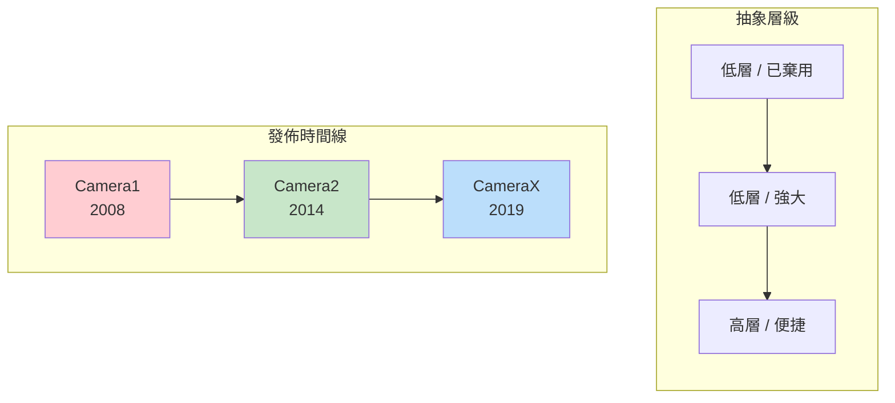
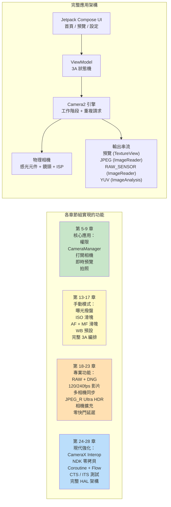

# 第 1 章：歡迎來到 Android Camera2

> **本章概覽：** 在这个開篇章節中，我們退後一步，縱覽全域。Camera2 為什麼存在？與舊版 Camera API 和較新的 CameraX 庫相比，它解決了什麼問題？谁應該投入時間學習 Camera2？最重要的是，到这个系列結束時你實際會建構出什麼？這裡没有深入架構，没有 HAL 層，也没有管線圖——只有每位開發者在深入之前都會問的那些問題的清晰答案。

***

## 1.1 為什麼需要 Camera2？

拿出你的智慧型手機。

看看背面。你大概會看到兩個、三個甚至更多相機鏡頭。那个小小的矩形凸起所容納的光學和矽片性能，比 2000 年代中期的專業單反還要強大。

現在打開預設相機應用。

點一下快門。瞬間，一張高解析度照片就存進了你的相簿。照片很可能看起來很棒——色彩鮮豔、主體清晰、背景虛化柔和，即使在室內光線下陰影也很明亮。

但你正在使用的相機應用僅僅觸及了硬體能力的冰山一角。在友好的快門按鈕之下隱藏著一條極其精密的成像管線：它能拍攝 RAW 照片、錄製 240 fps 慢動作影片、為一張夜景照片融合 10 幀畫面，或者獨立控制鏡頭移動的每一微米。

大多數第三方 Android 應用從未存取過這種能力。為什麼？因為**舊版 Android 相機 API（後來被稱為 Camera1）極其有限**。Camera1 是為單相機手機、基礎拍照和錄影的世界設計的。它無法：

- 手動控制曝光時間或 ISO
- 擷取 RAW 感光元件數據
- 以高幀率錄製慢動作
- 同時使用多個相機
- 在拍攝過程中存取逐幀元數據
- 可靠地進行連拍

從 **Android 5.0（API level 21）** 開始，Google 引入了 **Camera2（android.hardware.camera2）** 來打破這些壁壘。Camera2 不是一次增量更新——它是一次**徹底的重新設計**，從零開始建構，旨在向每一位 Android 開發者暴露現代相機晶片的原始能力。

簡而言之：**Camera2 之所以存在，是因為智慧型手機相機已成為專業級產品，而舊 API 無法跟上步伐。**

***

## 1.2 Camera1 vs Camera2 vs CameraX

十多年的 Android 相機發展催生了**三代**相機 API。在編寫一行程式碼之前，理解哪個 API 解決哪個問題至關重要。

### 三代 API，三種理念

### Camera1 — `android.hardware.Camera`

原始的相機 API，隨 Android 1.0 引入，**在 Android 5.0 中被棄用**。

- **模型：** 程序式命令。你呼叫 `startPreview()`、`takePicture()`、`setFlashMode()` 等方法。
- **設計理念：** 「相機是一台你發號施令的狀態機。」
- **最適合：** 面向非常老舊設備（Lollipop 之前）的遺留應用。僅此而已。
- **為什麼避免使用：** Google 不再更新它。新硬體特性（多相機、RAW、HDR）從未回移植到 Camera1。API 表面極小。在現代設備上，Camera1 實際上**由 Camera2 包裝器內部模擬**，所以你付出了 Camera2 的複雜性卻得不到 Camera2 的好處。

### Camera2 — `android.hardware.camera2.*`

現代低層框架，於 Android 5.0 引入，並在此後的每个 Android 版本中持續擴充。

- **模型：** 請求/響應管線。你建構不可變的 `CaptureRequest` 物件，將它們提交給 `CameraCaptureSession`，並非同步接收 `CaptureResult` 元數據 + 影像緩衝區。
- **設計理念：** 「相機是一條可編程管線。你控制每一幀的每一个參數。」
- **最適合：** 高級相機應用、手動攝影工具、電腦視覺管線、RAW 拍攝、多相機研究、高速影片，以及任何需要接近硬體控制的場景。
- **為什麼使用它：** 完全存取 OEM HAL 暴露的每一項能力。直接幀控制。專業功能的唯一 API 路徑。CameraX 內部呼叫的正是 Camera2。

### CameraX — `androidx.camera.*`

一個 **Jetpack 庫**（不是平台 API），2019 年以測試版發佈，約在 Android 11 時趨於穩定。

- **模型：** 宣告式用例。你將一組 `Preview`、`ImageCapture`、`ImageAnalysis` 或 `VideoCapture` 用例 `bindToLifecycle()`，庫負責其餘工作。
- **設計理念：** 「我們已經為你解決了一萬個邊緣情況。只需告訴我們你需要什麼輸出。」
- **最適合：** 大多數需要相機的應用。QR/條碼掃描器、照片上傳、文件掃描、簡單錄影——任何便捷性和可靠性勝過原始控制的場景。
- **為什麼使用它：** 生命週期感知（無資源洩漏）、解析度選擇自動化、OEM 怪癖內建變通方案，完全相同的程式碼可以在數千款設備型號上執行，且無需任何 `if` 語句。

### 並排對比

| 維度 | Camera1 | Camera2 | CameraX |
|:---|:---|:---|:---|
| **引入版本** | Android 1.0 (2008) | Android 5.0 (2014) | Android 10 (Jetpack) |
| **狀態** | 已棄用 | 活躍，持續維護 | 推薦 (Jetpack) |
| **抽象層級** | 低（遺留） | 低 | 高 |
| **學習曲線** | 簡單 | 非常陡峭 | 非常平緩 |
| **手動曝光 / ISO / 對焦** | 有限 | 完全控制 | 透過 Interop 有限支援 |
| **RAW 拍攝** | 否 | 是 | 需 Interop 變通 |
| **多相機（物理串流）** | 否 | 是 | 否 |
| **高速影片（120+ fps）** | 否 | 是 | 有限 |
| **連拍 / 包圍** | 否 | 完全控制 | 否 |
| **逐幀元數據** | 否 | 是，完整 + 部分結果 | 透過 Interop 回呼暴露 |
| **生命週期安全** | 手動，易出錯 | 手動，易出錯 | 自動，繫結生命週期 |
| **OEM 怪癖處理** | 無 | 無 | 內建（已測試 1000+ 設備） |
| **可用應用的程式碼量** | 中等 | 非常高（冗長） | 非常低 |
| **性能** | 尚可（間接包裝器） | 最大可能 | 接近最大（輕微開銷） |

***

## 1.3 Camera2 能做什麼？

為具體理解 Camera2 的能力，想像一下你在旗艦手機上見過的功能。Camera2 讓**所有這些都能以編程方式存取**：

### 專業級拍攝

- **全手動曝光：** 從 1/8000 秒到 30 秒調節快門速度，ISO 從 50 到 102,400。建構真正的專業模式 UI。
- **RAW 攝影：** 直接從感光元件提取 10 位元、12 位元、14 位元或 16 位元**未處理的 Bayer 數據**（無去馬賽克、無降噪、無色彩校正）。使用內建的 `DngCreator` 寫入 Adobe DNG 文件，用於 Lightroom 編輯。
- **曝光包圍：** 以精確步進的 EV 值拍攝 3、5、7 或 9 幀。將它們輸入到 HDR 融合演算法中。
- **延時鎖定：** 在**數千幀**之間凍結曝光、對焦和白平衡——太陽移動或雲層飄過時也不會出現閃爍。

### 計算攝影硬體存取

- **高速影片：** 配置 `CameraConstrainedHighSpeedCaptureSession` 以 120 fps、240 fps 甚至 960 fps 拍攝。建構慢動作編輯器。
- **邏輯多相機：** **同時**存取一个邏輯多相機 ID 下的**兩個**物理相機。從廣角和望遠鏡頭獲取同步的 YUV 幀，以在設備上計算深度圖。
- **YUV / PRIVATE 重處理（LEVEL_3 設備）：** 在 ISP 中維護一个全解析度**環形緩衝區**，然後在按下快門時，從過去抓取一幀並重新執行重型降噪和銳化。這就是 OEM 實現**零快門延遲（ZSL）**的方式。
- **Ultra HDR / JPEG_R（Android 14+）：** 請求並寫入 `ImageFormat.JPEG_R` 文件，儲存 8 位元 SDR JPEG **加上**一个輔助 HDR 增益圖。傳統查看器看到的是普通照片；HDR 面板可渲染 1,000+ 尼特的高光。
- **相機擴充（Android 12+）：** 將夜景、Bokeh（人像）、HDR 和面部柔化模式**委託給 OEM HAL**——使用與系統相機相同的多幀 AI 管線。

### 高級影片與視覺管線

- **多串流並行輸出：** 透過單次拍攝請求驅動**預覽** Surface、**YUV 分析** Surface（用於以 30 fps 執行的 ML 目標檢測）和 **JPEG 靜態** Surface——全部無需複製記憶體。
- **閃光燈時序精度：** 在逐幀基礎上精確協調預閃測光、主閃光觸發和捲簾快門讀出。
- **部分拍攝結果：** 在最終影像緩衝區就緒前**幾毫秒**接收 AE 狀態和焦距元數據——實現「點擊任意位置 UI 即刻更新」的響應速度。
- **離線工作階段（API 30+）：** 如果用戶在夜間模式中途將你的應用切到背景，將進行中的多幀合併交給一个隔離的 `CameraOfflineSession`，HAL 非同步完成處理；你的應用醒來即可獲得最終照片。

### 這只是開始

每個新的 Android 版本都在擴充 Camera2。Android 15（API 35）增加了 `CameraDeviceSetup`，讓你可以**完全不開啟感光元件**就探查工作階段配置，將能力檢查延遲降低了 10 倍。这个 API 是活的，持續演進，始終領先於最新的相機硬體一步。

***

## 1.4 誰應該學習 Camera2？

正確學習 Camera2 需要時間。API 表面龐大——300+ 个元數據鍵、數十個回呼、多種工作階段類型，以及數百個 OEM 邊緣情況。如果以下任何一條描述了你或你的專案，你就應該投入这段時間：

### 你正在建構高級相機應用

你的應用提供帶手動 ISO/快門/對焦/WB 旋鈕的**專業模式**。或者它拍攝**RAW 照片**並允許用戶導出用於桌面編輯。或者它錄製**慢動作影片**。這些功能在 CameraX 中都無法實現（或嚴重受限）。

### 你正在建構電腦視覺或研究應用

你需要**零拷貝、最低延遲的 YUV 幀**來供給設備上的 ML 管線。或者你需要**幀鎖定的感光元件數據**（`SENSOR_TIMESTAMP` 中的陀螺儀時間戳必須與影像在 ±1 毫秒內比對，以實現精確的 SLAM / 視覺慣性里程計）。或者你必須為結構光/深度感測控制**每幀的精確快門時長**。

### 你正在建構相機能力診斷工具

就像本系列的配套應用——**Android Camera Parameters**（[GitHub](https://github.com/zoozooll/AndroidCameraParameters)，[Google Play](https://play.google.com/store/apps/details?id=com.minininja.cameraparams)）——你需要詳盡地導出每个 `CameraCharacteristics` 鍵，以可視化每台設備支持什麼。CameraX 有意隱藏了大部分這些細節。

### 你正在偵錯 CameraX 或 OEM 相機問題

CameraX 確實會在某些冷門設備上出問題。當你的 CameraX 預覽被拉伸，或者某个 Galaxy 型號在夜間模式返回綠色畫面，或者 Pixel 9 在 `VideoCapture` 上崩潰時，你**必須**下到 Camera2 層來復現和隔離 bug。

### 你從事行動影像、OEM 相機棧或汽車相機管線工作

如果你接觸供應商 HAL 程式碼、`frameworks/av/camera`、Camera NDK，或汽車 EVS→Camera2 遷移——Camera2 的精通是基本要求。

### 誰**不**需要學習 Camera2？

如果你的需求是：*「我需要讓用戶拍一張頭像照片或掃描二維碼」*——**使用 CameraX**。認真的。CameraX 是工程傑作。它會為你節省數月的設備相容性工作。Camera2 是一種專業工具；當確實需要那種能力時再去用它。

***

## 1.5 你將在本書中建構什麼

没有程式碼的理論是抽象的。没有遞進的程式碼是令人困惑的。

在本書中，你將**漸進式建構一個真實、功能完整的 Camera2 應用**。每一章都增加一個功能，每個功能都能在真實手機上編譯執行。到最後一章，你將組裝出这个完整的應用：

### 里程碑

| 章節範圍 | 之後你能做什麼 |
|:---|:---|
| **第 1–4 章** | 你理解了硬體。你知道鏡頭、感光元件和 ISP 如何互動。你能閱讀任何手機的規格表並說出它支持哪些 Camera2 功能。你已安裝 Android Camera Parameters 配套應用並探索了自己的設備。 |
| **第 5–9 章** | 你有了個**可用的相機應用**。它能打開後置鏡頭，在螢幕上顯示即時預覽，並在你的點擊快門按鈕時儲存一張 JPEG 照片。完整的縱橫比校正、正確的直屏旋轉和正確的生命週期清理都能正常執行。 |
| **第 10–12 章** | 你理解了程式碼**為什麼**這樣工作。你能追蹤一个 CaptureRequest 穿過掛起佇列、進行中佇列、HAL，最後作為 CaptureResult 返回。你知道如何根據報告的實際硬體等級和能力來為功能設定門控。 |
| **第 13–17 章** | 你的應用有了**完整的專業模式**。手動 ISO、快門、焦距和 WB 色溫撥盤。即時直方圖 / EV 回讀。完整的單次 AF → 預擷取 AE → 拍攝序列，精確模擬 OEM 系統相機獲得完美結果的方式。 |
| **第 18–23 章** | 你的應用現在是**旗艦級**：同時儲存 RAW+JPEG，錄製 120 fps 慢動作影片，能拍攝雙物理 YUV 串流用於人像深度，寫入 Ultra HDR JPEG_R 文件，將 Bokeh 和夜景模式委託給相機擴充，並在 LEVEL_3 設備上實現零快門延遲重處理。 |
| **第 24–28 章** | 你是一名**高級 Android 相機工程師**。你能透過 Interop 為 90% 的應用引入 CameraX，同時對需要它的 10% 使用 Camera2。你能編寫零拷貝的 NDK 原生相機管線。你將所有回呼包裝在 Kotlin Coroutines 和 Flow 中，實現乾淨、可測試的程式碼。你了解如何編寫通過 CTS ITS 的相機測試。你能在白板上畫出完整的 應用→Framework→Binder→Native→HAL→Kernel→硬體 棧。 |
| **第 29 章（百科全書）** | 你有了一份桌面參考資料，涵蓋 29 個最重要的 `CameraCharacteristics` 鍵，每個都配有原理解釋、Kotlin 查詢、Android Camera Parameters 指針和 OEM 陷阱。這一章在利你交付生產程式碼時保持打開。 |

那是一種真正罕見的技能組合。讓我們開始這段旅程。

***

## 1.6 小結

- **Camera2** 是現代低層 Android 相機框架，於 Android 5.0 引入，旨在暴露當今多相機、ISP 豐富的智慧型手機的全部能力。
- **Camera1** 已棄用；**CameraX** 對大多數用例很便捷，但隱藏了只有 Camera2 才暴露的能力。你根據需求來選擇。
- Camera2 解鎖了**手動控制、RAW 攝影、高速影片、邏輯多相機、YUV 重處理/ZSL、Ultra HDR、OEM 擴充**和**離線工作階段**。
- 當你建構專業攝影工具、視覺/研究管線、診斷應用或偵錯更深層時，投資 Camera2。
- 在本書中，你將**漸進式建構一個功能完整的 Camera2 應用**——從第 9 章的單按鈕相機，到第 23 章的旗艦級影像工具，再到第 28 章由現代 Android 模式強化。

## 1.7 下一章

在編寫一行 Camera2 程式碼之前，我們需要理解我們所指揮的硬體。在**第 2 章：理解智慧型手機相機**中，你將學習手機相機模組的每個部件實際做什麼：鏡頭、影像感光元件、ISP，以及原始光線如何變成壓縮的 JPEG。到最後，你會明白為什麼包裝盒上的「4800 萬像素」標籤幾乎不能說明真實的影像品質。
