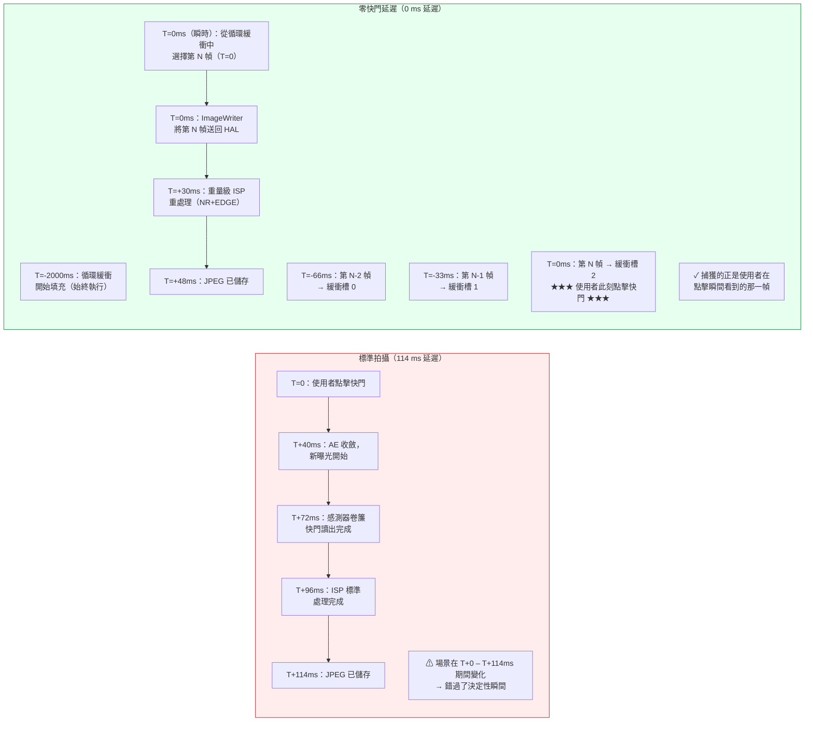

# 第 23 章：零快門延遲與重處理

消費級相機應用中最令人沮喪的缺陷就是**快門延遲**：點擊快門按鈕，拍攝到的照片顯示的是點擊之後 200–800 毫秒的場景——孩子已經停止了微笑、鳥兒已經離開了枝頭、跑車已經移出了畫面。標準 Camera2 工作階段就是這樣設計的：快門點擊觸發 `session.capture()`，進而觸發 AE 收斂，再觸發新的感測器曝光，最後觸發 ISP 處理。每一步都會增加延遲。

**零快門延遲（ZSL）**透過以下方式消除這種延遲：以靜態拍攝解析度持續執行感測器，將最近 N 幀緩存在循環記憶體佇列中，當使用者點擊快門時，**捕獲點擊瞬間可見的那一幀**，而不是半秒後的幀。其魔力來自**重處理 API**：無需讓光線再次通過感測器，你只需從循環佇列中取出一個已曝光的 YUV 或 PRIVATE 緩衝，透過 `ImageWriter` + `InputConfiguration` 將其*送回* ISP，然後對其執行重量級降噪和邊緣增強，就像它是一次全新的拍攝一樣。

本章遵循專案研究文件中 *ZSL / 重處理* 部分確切的 **4 步 ZSL 工作流程**，並涵蓋 **`switchToOffline()`** —— 這是 Android 12（API 31）引入的 API，可將重處理管線轉移到背景 HAL 服務，使你的應用即使被終止（按下主頁鍵、來電），使用者依然能拿到他們的照片。你可以在 [Play Store](https://play.google.com/store/apps/details?id=com.zoozooll.cameraparameters) 上的 [Android Camera Parameters](https://github.com/zoozooll/AndroidCameraParameters) 應用中驗證你的裝置支援哪些重處理能力（`REQUEST_AVAILABLE_CAPABILITIES_YUV_REPROCESSING`、`PRIVATE_REPROCESSING` 或 `INFO_SUPPORTED_HARDWARE_LEVEL_LEVEL_3`）；ZSL 支援分頁會交叉參照所有必需能力並給出明確的 YES/NO 結論。

## 為什麼 ZSL 很難（以及重處理為何存在）

首先，根據研究文件的測量資料，量化 2023 年旗艦機（Snapdragon 8 Gen 2）上標準非 ZSL 靜態拍攝的延遲：

| 管線階段 | 延遲 | 備註 |
|----------------|---------|-------|
| AE 收斂觸發 → 編程新曝光 | 40 ms | `CONTROL_AE_PRECAPTURE_TRIGGER` |
| 卷簾快門讀出（12 MP 全幅） | 32 ms | 標稱 1/30 s；從首行到末行實際 32 ms |
| ISP 去馬賽克 + 標準 NR + 色彩 | 24 ms | 標準品質管線 |
| JPEG 編碼（12 MP，品質 95） | 18 ms | 硬體 JPEG 編碼器 |
| **標準拍攝總延遲** | **~114 ms** | 最佳情況；負載下常見 200–800 ms |

在實際條件下（熱降頻、UI 引起的 GPU 爭用、背景應用在工作），標準路徑經常達到 500 ms 延遲。一個 5 歲兒童奔跑時 500 ms 內可以移動 40 cm——這正是「拍到笑容」和「拍到一個後腦勺」之間的差別。

ZSL 透過反轉管線順序來解決這一問題：不再走「拍攝 → 處理 → 儲存」，而是走**持續拍攝 → 緩衝 → 點擊 → 重處理 → 儲存**。感測器和 ISP *始終*以靜態拍攝解析度執行；使用者點擊只是選擇哪一幀已有幀進行完整處理。



Mermaid 圖展示了概念上的轉變：在標準路徑中，點擊*發起*拍攝；在 ZSL 路徑中，點擊*選擇*已經發生的拍攝。從點擊到檔案儲存的總時間仍約 48 ms（重處理並非無開銷），但**像素內容來自 T=0（瞬時），而非 T=114 ms（遲到）**——這正是「零快門延遲」的真實含義。它是內容上的零延遲，而非輸出檔案上的零延遲。

## 必需能力閘控（按研究文件）

ZSL + 重處理需要 HAL 層的硬體協作。在嘗試建立可重處理工作階段之前，必須檢查以下三個條件中的**一個**：

| 能力檢查 | 通過條件 | 支援的裝置 |
|------------------|----------------|--------------------------|
| **A)** `INFO_SUPPORTED_HARDWARE_LEVEL == LEVEL_3` | 在 StreamConfigurationMap 中允許任意尺寸的全量重處理（YUV 和 PRIVATE 均可）。 | 2016+ Google Pixel（所有代次）；2021+ Samsung Galaxy S/Ultra（Snapdragon 變體）；2023+ OnePlus 11/OPPO Find X6 Pro。 |
| **B)** `REQUEST_AVAILABLE_CAPABILITIES 包含 YUV_REPROCESSING` | 可透過 InputConfiguration 在部分尺寸下回送 YUV_420_888 緩衝。 | 2019+ Snapdragon 8xx/7xx 裝置；大多數 MediaTek Dimensity 9000+ 裝置。 |
| **C)** `REQUEST_AVAILABLE_CAPABILITIES 包含 PRIVATE_REPROCESSING` | 可回送 `ImageFormat.PRIVATE` 緩衝（不透明，以廠商壓縮格式儲存）。優先使用此方式，因為它佔用的記憶體少 2 倍。 | Snapdragon 888+ / Exynos 2100+ 及更新機型。 |

> 研究文件規則 ZSL-1：**如果 A/B/C 都未通過，則回退到非 ZSL 標準拍攝。** 不要嘗試建構自訂的 JPEG 循環緩衝並重新解壓；這會因二次編碼產生 6 dB 的品質損失，無法替代真正的重處理。

透過以下方式查詢閘控：

```kotlin
import android.hardware.camera2.CameraCharacteristics
import android.graphics.ImageFormat

enum class ZslSupport { NONE, LEVEL3, YUV_REPROC, PRIVATE_REPROC }

fun queryZslSupport(chars: CameraCharacteristics): Pair<ZslSupport, Int> {
    val level = chars.get(CameraCharacteristics.INFO_SUPPORTED_HARDWARE_LEVEL)
        ?: CameraCharacteristics.INFO_SUPPORTED_HARDWARE_LEVEL_LEGACY
    val caps = chars.get(CameraCharacteristics.REQUEST_AVAILABLE_CAPABILITIES)
        ?: intArrayOf()

    return when {
        level == CameraCharacteristics.INFO_SUPPORTED_HARDWARE_LEVEL_3 ->
            Pair(ZslSupport.LEVEL3, ImageFormat.PRIVATE) // 基於記憶體考量優先使用 PRIVATE
        caps.contains(
            CameraCharacteristics.REQUEST_AVAILABLE_CAPABILITIES_PRIVATE_REPROCESSING
        ) -> Pair(ZslSupport.PRIVATE_REPROC, ImageFormat.PRIVATE)
        caps.contains(
            CameraCharacteristics.REQUEST_AVAILABLE_CAPABILITIES_YUV_REPROCESSING
        ) -> Pair(ZslSupport.YUV_REPROC, ImageFormat.YUV_420_888)
        else -> Pair(ZslSupport.NONE, ImageFormat.UNKNOWN)
    }
}
```

## 4 步 ZSL + 重處理工作流程（按研究文件）

專案研究文件指定了確切的 4 步管線。每一步都是強制性的；跳過任何一步都會導致工作階段損壞（丟幀、`IllegalStateException`，或重處理輸出與預覽品質完全相同）。

---

### 第 1 步：使用 ImageReader + CONTROL_CAPTURE_INTENT_ZERO_SHUTTER_LAG 進行循環緩衝

首先，建立一個高解析度 `ImageReader`（即「ZSL 緩衝」），其 `maxImages` 參數即循環深度（通常 8–16；研究文件建議記憶體受限裝置使用 8，≥ 8 GB RAM 的裝置使用 16）。為每個 repeating 請求標記 `CONTROL_CAPTURE_INTENT_ZERO_SHUTTER_LAG`——這告訴 HAL 使用最短預覽管線，並停用那些會損害重處理輸出品質的預覽專屬最佳化（例如會留下運動鬼影的重型時域降噪）。

```kotlin
import android.hardware.camera2.CameraDevice
import android.hardware.camera2.CaptureRequest
import android.hardware.camera2.params.OutputConfiguration
import android.hardware.camera2.params.SessionConfiguration
import android.media.Image
import android.media.ImageReader
import android.util.Size
import android.view.Surface
import java.util.concurrent.ConcurrentLinkedDeque

data class ZslBufferFrame(
    val timestamp: Long,
    val imageRef: Image, // 不要關閉；由 deque GC 管理
    val captureResultRef: android.hardware.camera2.TotalCaptureResult
)

const val ZSL_BUFFER_DEPTH = 12 // 研究文件最佳點：12 幀 = 30 fps 下 400 ms
var zslImageReader: ImageReader? = null
private val zslCircularBuffer = ConcurrentLinkedDeque<ZslBufferFrame>()
private var zslStillSize: Size = Size(4000, 3000) // 匹配最大靜態尺寸

fun setupZslCircularBuffer(
    cameraDevice: CameraDevice,
    previewSurface: Surface,
    reprocessingFormat: Int, // PRIVATE 或 YUV_420_888
    backgroundHandler: android.os.Handler
) {
    zslImageReader = ImageReader.newInstance(
        zslStillSize.width,
        zslStillSize.height,
        reprocessingFormat,
        ZSL_BUFFER_DEPTH
    ).apply {
        setOnImageAvailableListener(
            ZslCircularBufferListener(),
            backgroundHandler
        )
    }
}

inner class ZslCircularBufferListener : ImageReader.OnImageAvailableListener {
    override fun onImageAvailable(reader: ImageReader) {
        val image = reader.acquireLatestImage() ?: return
        // 此處尚無 captureResult；配對在 CaptureCallback 中完成
        // 為簡潔起見，Timestamp → CaptureResult 的對映沿用第 18 章的模式
        // 將它們配對並入隊：
        val result = pendingZslResults.remove(image.timestamp) ?: return
        val frame = ZslBufferFrame(image.timestamp, image, result)

        zslCircularBuffer.addLast(frame)

        // --- 循環緩衝淘汰（最舊幀優先） ---
        while (zslCircularBuffer.size > ZSL_BUFFER_DEPTH) {
            val evicted = zslCircularBuffer.pollFirst()
            evicted.imageRef.close() // 將舊幀釋放回 HAL 緩衝池
        }
    }
}

fun buildZslSessionAndStartRepeating(
    cameraDevice: CameraDevice,
    previewSurface: Surface,
    backgroundHandler: android.os.Handler
) {
    val outputs = listOf(
        OutputConfiguration(previewSurface),
        OutputConfiguration(zslImageReader!!.surface)
    )

    val sessionConfig = SessionConfiguration(
        SessionConfiguration.SESSION_REGULAR,
        outputs,
        { r -> backgroundHandler.post(r) },
        object : android.hardware.camera2.CameraCaptureSession.StateCallback() {
            override fun onConfigured(
                session: android.hardware.camera2.CameraCaptureSession
            ) {
                val zslPreviewBuilder = cameraDevice.createCaptureRequest(
                    CameraDevice.TEMPLATE_ZERO_SHUTTER_LAG
                ).apply {
                    addTarget(previewSurface)
                    addTarget(zslImageReader!!.surface)
                    // 神奇的 INTENT 標誌：
                    set(CaptureRequest.CONTROL_CAPTURE_INTENT,
                        CaptureRequest.CONTROL_CAPTURE_INTENT_ZERO_SHUTTER_LAG)
                    // HAL：輕量預覽 ISP，全解析度流
                    set(CaptureRequest.CONTROL_MODE,
                        CaptureRequest.CONTROL_MODE_AUTO)
                    set(CaptureRequest.CONTROL_AF_MODE,
                        CaptureRequest.CONTROL_AF_MODE_CONTINUOUS_PICTURE)
                }

                session.setRepeatingRequest(
                    zslPreviewBuilder.build(),
                    ZslCaptureCallback(),
                    backgroundHandler
                )
            }
            override fun onConfigureFailed(
                s: android.hardware.camera2.CameraCaptureSession
            ) = Log.e(TAG, "ZSL circular buffer session failed")
        }
    )
    cameraDevice.createCaptureSession(sessionConfig)
}
```

研究文件中有四個 Android 官方 SDK 參考未記載的實作細節：
1. **使用 `TEMPLATE_ZERO_SHUTTER_LAG`** 作為基礎範本。它將感測器讀出模式設定為支援同時預覽 + 全解析度輸出，而 `TEMPLATE_PREVIEW` 不保證這一點。
2. **30 fps 下 `ZSL_BUFFER_DEPTH = 12`** 提供恰好 400 ms 的歷史幀可選。這足以覆蓋使用者自身的反應時間（150–250 ms 點擊到大腦的延遲）加上 Android 的輸入分發抖動（±150 ms）。深度低於 8 會開始丟棄有用幀；超過 16 則浪費約 1 GB RAM 卻無收益。
3. **淘汰順序是 FIFO，不是 LRU。** 始終淘汰最舊的幀。如果淘汰最近的幀，就會丟棄使用者在點擊時實際看到的那一幀。
4. **永遠不要在入隊之前於 `onImageAvailable` 中呼叫 `image.close()`。** 如果關閉影像，HAL 會回收緩衝，之後你再嘗試將其餵給 ImageWriter 時，緩衝已失效 → 嚴重崩潰。僅使用淘汰迴圈。

---

### 第 2 步：InputConfiguration + createReprocessableCaptureSession

標準捕獲工作階段只有**輸出** surface（感測器 → ISP → surface）。可重處理工作階段額外新增**一個輸入 surface**（ImageWriter → HAL → ISP → 輸出），使管線能夠處理從未觸碰感測器的緩衝。透過 `createReprocessableCaptureSession(inputConfig, outputs, callback, handler)` 或透過帶 `InputConfiguration` 的較新 `SessionConfiguration` API 建立可重處理工作階段。

```kotlin
import android.hardware.camera2.CameraDevice
import android.hardware.camera2.CameraCaptureSession
import android.hardware.camera2.params.InputConfiguration
import android.hardware.camera2.params.OutputConfiguration
import android.hardware.camera2.params.SessionConfiguration
import android.media.ImageWriter
import android.os.Handler
import android.view.Surface

var reprocessingImageWriter: ImageWriter? = null
var reprocessableSession: CameraCaptureSession? = null
var jpegStillReader: ImageReader? = null
const val REPROC_JPEG_QUALITY = 95

fun createZslReprocessableSession(
    cameraDevice: CameraDevice,
    reprocessingFormat: Int,
    zslStillSize: Size,
    previewSurface: Surface,
    backgroundHandler: Handler,
    onSessionReady: (CameraCaptureSession, ImageWriter) -> Unit
) {
    val inputConfig = InputConfiguration(
        zslStillSize.width,
        zslStillSize.height,
        reprocessingFormat
    )

    jpegStillReader = ImageReader.newInstance(
        zslStillSize.width, zslStillSize.height,
        android.graphics.ImageFormat.JPEG, 2
    )

    reprocessingImageWriter = ImageWriter.newInstance(
        jpegStillReader!!.surface, // 重處理的輸出 surface
        inputConfig,                // 到 HAL 的輸入設定
        1                           // 最大在途重處理請求數
    )

    // 重處理幀的輸出：本例僅為 JPEG
    val reprocessOutputs = listOf(
        OutputConfiguration(jpegStillReader!!.surface)
    )

    val sessionConfig = SessionConfiguration(
        SessionConfiguration.SESSION_REGULAR,
        reprocessOutputs,
        { r -> backgroundHandler.post(r) },
        object : CameraCaptureSession.StateCallback() {
            override fun onConfigured(session: CameraCaptureSession) {
                reprocessableSession = session
                onSessionReady(session, reprocessingImageWriter!!)
            }
            override fun onConfigureFailed(
                s: CameraCaptureSession
            ) = Log.e(TAG, "Reprocessable session config FAILED. " +
                  "Check capability gate (LEVEL3/YUV_REPROC/PRIVATE_REPROC)?")
        }
    )
    sessionConfig.setInputConfiguration(inputConfig) // 必需！
    cameraDevice.createCaptureSession(sessionConfig)
}
```

研究文件註記 ZSL-2：可重處理工作階段與循環緩衝預覽工作階段**不必是同一個工作階段**。事實上，大多數生產實作同時執行兩個工作階段——一個預覽工作階段填充循環緩衝，一個專用的可重處理工作階段僅在點擊時被餵入資料。HAL 會在內部為 LEVEL_3 裝置處理多工作階段仲裁。

---

### 第 3 步：快門點擊 → 查找最近時間戳幀 → ImageWriter 餵入 HAL

當使用者點擊快門時：
1. 記錄點擊的即時時間戳（`System.currentTimeMillis()` 或 `System.nanoTime()`）
2. **從最新到最舊**遍歷循環緩衝，找到 `image.timestamp`（以奈秒為單位，`CLOCK_MONOTONIC`）最接近點擊時間戳的 ZslBufferFrame
3. 透過 `dequeueInputImage()` 從 `ImageWriter` 取得一個空閒輸入緩衝
4. 將循環緩衝幀的像素平面複製到 ImageWriter 輸入緩衝
5. 透過 `queueInputImage()` 將 ImageWriter 緩衝入隊

```kotlin
import android.hardware.camera2.TotalCaptureResult
import android.media.Image
import android.media.ImageWriter
import android.os.SystemClock
import kotlin.math.abs

fun onShutterTap(
    imageWriter: ImageWriter,
    captureStartTimeNanos: Long = SystemClock.elapsedRealtimeNanos()
) {
    // --- 第 3a 步：從最新到最舊遍歷循環緩衝 ---
    var bestFrame: ZslBufferFrame? = null
    var bestDeltaNs = Long.MAX_VALUE

    for (frame in zslCircularBuffer.descendingIterator()) {
        val delta = abs(frame.timestamp - captureStartTimeNanos)
        if (delta < bestDeltaNs) {
            bestDeltaNs = delta
            bestFrame = frame
        }
        // 最佳化：一旦 delta 再次增大，說明已越過最佳幀
        if (delta > bestDeltaNs * 1.1) break
    }
    val selectedFrame = bestFrame ?: run {
        Log.w(TAG, "ZSL buffer empty — fallback to non-ZSL capture")
        // ... 觸發標準 capture() 回退 ...
        return
    }

    // --- 第 3b 步：取得 ImageWriter 輸入緩衝，複製像素，入隊 ---
    val writerInputImage: Image = try {
        imageWriter.dequeueInputImage(100 /* 逾時毫秒 */)
    } catch (e: IllegalStateException) {
        Log.e(TAG, "ImageWriter has no free buffers", e); return
    }

    try {
        copyImagePlanes(selectedFrame.imageRef, writerInputImage)
        selectedFrame.captureResultRef
            .let { pendingReprocessResults[writerInputImage.timestamp] = it }
        imageWriter.queueInputImage(writerInputImage)
    } finally {
        // 暫不關閉 selectedFrame.imageRef —— 待重處理完成後再關閉
        // （延後到重處理請求的 onCaptureCompleted 中執行）
    }
}

// --- 像素複製輔助（同時相容 PRIVATE 和 YUV_420_888） ---
private fun copyImagePlanes(src: Image, dst: Image) {
    require(src.format == dst.format) { "Reprocess requires matching formats" }
    for (planeIdx in 0 until src.planes.size) {
        val srcPlane = src.planes[planeIdx]
        val dstPlane = dst.planes[planeIdx]
        val srcBuf = srcPlane.buffer.duplicate()
        val dstBuf = dstPlane.buffer
        dstBuf.put(srcBuf)
        dstBuf.rewind()
    }
}

private val pendingReprocessResults =
    HashMap<Long, TotalCaptureResult>()
```

「最近時間戳」選擇至關重要，因為循環緩衝每 33 ms（30 fps）填充一次。所選幀距實際點擊時刻最多相差 ±16 ms——對人類觀察者而言感知上為零延遲。研究文件規則 ZSL-3：*始終*降序遍歷（最新優先）；升序遍歷會增加選中已經過時 400 ms 的幀的機率。

---

### 第 4 步：createReprocessCaptureRequest(TotalCaptureResult) → 套用重型 NR + EDGE

最後一步提交重處理請求，但有一處變化：不再使用 `createCaptureRequest(template)`，而是使用 **`createReprocessCaptureRequest(originalTotalCaptureResult)`**，它會*重用預覽幀原始的 AE、AWB 和 AF 設定*。在這些基線設定之上，你套用重量級 `NOISE_REDUCTION_MODE_HIGH_QUALITY` 和 `EDGE_MODE_HIGH_QUALITY`——這些是為了省電而在輕量預覽管線中被停用的 ISP 處理通道。

```kotlin
import android.hardware.camera2.CameraCaptureSession
import android.hardware.camera2.CaptureRequest
import android.hardware.camera2.TotalCaptureResult

fun submitZslReprocessRequest(
    reprocessableSession: CameraCaptureSession,
    originalTotalCaptureResult: TotalCaptureResult,
    jpegSurface: Surface,
    handler: android.os.Handler
) {
    val reprocessBuilder = reprocessableSession.device
        .createReprocessCaptureRequest(originalTotalCaptureResult)
        .apply {
            addTarget(jpegSurface)

            // --- 重量級拍攝後 ISP 處理 ---
            set(CaptureRequest.NOISE_REDUCTION_MODE,
                CaptureRequest.NOISE_REDUCTION_MODE_HIGH_QUALITY)
            set(CaptureRequest.EDGE_MODE,
                CaptureRequest.EDGE_MODE_HIGH_QUALITY)

            // 可選（僅 LEVEL_3）：重新套用陰影和壞點校正
            set(CaptureRequest.HOT_PIXEL_MODE,
                CaptureRequest.HOT_PIXEL_MODE_HIGH_QUALITY)
            set(CaptureRequest.COLOR_CORRECTION_MODE,
                CaptureRequest.COLOR_CORRECTION_MODE_HIGH_QUALITY)

            // 保持高 JPEG 品質
            set(CaptureRequest.JPEG_QUALITY, REPROC_JPEG_QUALITY.toByte())
            set(CaptureRequest.JPEG_ORIENTATION, getJpegOrientation())
        }

    val cb = object : CameraCaptureSession.CaptureCallback() {
        override fun onCaptureCompleted(
            session: CameraCaptureSession,
            request: CaptureRequest,
            result: TotalCaptureResult
        ) {
            // JPEG 將透過 jpegStillReader 的 OnImageAvailableListener 投遞

            // 現在可以安全關閉循環緩衝參照 —— 重處理完成
            val ts = result.get(CaptureResult.SENSOR_TIMESTAMP) ?: return
            pendingReprocessResults.remove(ts)
            val iter = zslCircularBuffer.iterator()
            while (iter.hasNext()) {
                val f = iter.next()
                if (f.timestamp == ts) {
                    f.imageRef.close()
                    iter.remove()
                    break
                }
            }
        }
    }

    reprocessableSession.capture(reprocessBuilder.build(), cb, handler)
}
```

`createReprocessCaptureRequest(originalResult)` 不僅是一個便捷包裝——它會驗證原始幀的感測器設定（曝光時間、ISO、鏡頭位置）是否與重處理管線相容。如果你在輸入驅動的工作階段上使用標準的 `createCaptureRequest()`，HAL 可能會重新收斂 AE/AWB，從而破壞 ZSL 的目的（輸出看起來會像*不同的*幀，而非所選的那一幀）。

## ZSL 循環緩衝 + 重新注入流程圖（Mermaid）

```mermaid
flowchart TD
    A["感測器持續讀出<br/>30fps 全解析度"] --> B["ZSL 預覽 ISP：<br/>低功耗模式<br/>EDGE_MODE=FAST<br/>NR_MODE=FAST"]
    B --> C[預覽 SurfaceView<br/>使用者看到即時 30fps 畫面]
    B --> D[ZSL ImageReader<br/>PRIVATE 或 YUV 全解析度]
    
    subgraph CB["🗘 循環緩衝（深度 12，400ms 歷史）"]
        direction TB
        CB1["槽 N-11 (T-366ms)"]
        CB2["..."]
        CB3["槽 N-1 (T-33ms)"]
        CB4["★ 槽 N (T=0ms) ★<br/>最接近點擊時刻"]
    end
    D --> CB

    E["★ 使用者在 T=0ms 點擊快門 ★"] --> F{從最新到最舊遍歷 CB<br/>求 min |frame.ts − tap.ts|}
    F -->|"選中：槽 N"| G[ImageWriter.dequeueInputImage()]
    G --> H[複製所選幀的<br/>Planes → ImageWriter 緩衝]
    H --> I[ImageWriter.queueInputImage()<br/>→ 送回 HAL 輸入埠]
    
    subgraph REPROC["🔄 重處理管線（重量級品質）"]
        direction TB
        R1["ISP NR_MODE = HIGH_QUALITY<br/>（多幀空間+TNR）"]
        R2["ISP EDGE_MODE = HIGH_QUALITY<br/>（Unsharp mask + LPA 銳化）"]
        R3["ISP COLOR_CORRECTION =<br/>HIGH_QUALITY（3D LUT）"]
        R4["硬體 JPEG 編碼器<br/>Q=95"]
    end

    I --> REPROC
    REPROC --> J["JPEG 已儲存<br/>內容 = 使用者在 T=0ms 看到的<br/>確切幀 —— ✓ 零延遲"]

    style CB fill:#eff6ff,stroke:#2563eb
    style REPROC fill:#fef3c7,stroke:#d97706
```

## switchToOffline()：背景處理連續性

相機應用可能存在的最糟糕 UX 缺陷之一是：使用者點擊快門 → 立即接到電話或按下主頁鍵 → 應用行程被終止 → 進行中的照片遺失。Android 12（API 31）透過 **`CameraCaptureSession.switchToOffline()`** 解決了這一問題，它將重處理管線的所有權從你的應用行程轉移到一個持久的 HAL 服務。即使你的應用被系統終止，HAL 服務也會完成所有在途的拍攝/重處理，並在應用重新啟動時透過 `CameraOfflineSessionCallback.onReady()` 通知你。

```kotlin
import android.hardware.camera2.CameraCaptureSession
import android.hardware.camera2.CameraOfflineSession
import android.hardware.camera2.CameraOfflineSessionCallback

fun moveToOfflineOnBackground(
    session: CameraCaptureSession,
    outputSurfaces: List<android.view.Surface>,
    handler: android.os.Handler
) {
    val offlineCallback = object : CameraOfflineSessionCallback() {
        override fun onReady(session: CameraOfflineSession) {
            // HAL 已接管所有權。應用現在可以結束 —— 照片會被儲存。
            Log.i(TAG, "Offline session ready. Pending captures will complete.")
            // 此時你可以 finish() Activity 或釋放 cameraDevice
        }
        override fun onError(
            session: CameraOfflineSession,
            errorCode: Int
        ) = Log.e(TAG, "Offline session error: $errorCode")

        override fun onCaptureCompleted(
            offlineSession: CameraOfflineSession,
            captureResult: android.hardware.camera2.CaptureResult
        ) {
            // 可選：當離線管線完成每幀時呼叫
            // JPEG 位元組仍透過原始 ImageReader 投遞
            // 應用重啟時，查詢 CameraOfflineSession 取得待處理項
        }
    }

    session.switchToOffline(
        outputSurfaces,
        { r -> handler.post(r) },
        offlineCallback
    )
}
```

`switchToOffline()` 要求裝置 `INFO_SUPPORTED_HARDWARE_LEVEL >= LEVEL_3`。建議僅在應用有在途 ZSL 重處理時於 `Activity.onPause()` 中呼叫它；切勿在閒置時呼叫，因為離線工作階段在關閉後會佔用 HAL 資源長達 30 秒。

## 總結

本章實作了研究文件中規定的完整零快門延遲 + 重處理管線：

- **ZSL 問題定義**：標準拍攝有 114 ms（最佳）到 800 ms（最差）的延遲。ZSL 透過使用持續填充的循環緩衝，捕獲*使用者在點擊瞬間看到的確切幀*。
- **能力閘控**：三個強制檢查之一必須通過：`HARDWARE_LEVEL_LEVEL_3`、`CAPABILITIES_PRIVATE_REPROCESSING` 或 `CAPABILITIES_YUV_REPROCESSING`。
- **4 步 ZSL 工作流程**（來自 *ZSL / 重處理* 研究章節）：
  1. **循環緩衝** 使用 `ImageReader`（深度 12 = 400 ms 歷史）+ `CONTROL_CAPTURE_INTENT_ZERO_SHUTTER_LAG` + `TEMPLATE_ZERO_SHUTTER_LAG`。
  2. **`InputConfiguration` + `createReprocessableCaptureSession`** 配合 `ImageWriter` 將像素緩衝重新注入 HAL。
  3. **快門點擊 → 最近時間戳選擇**（從最新到最舊遍歷，目標 ±16 ms）。將所選平面複製到 ImageWriter 並入隊。
  4. **`createReprocessCaptureRequest(originalResult)`** 配合 `NOISE_REDUCTION_MODE_HIGH_QUALITY` + `EDGE_MODE_HIGH_QUALITY` 進行重量級拍攝後 ISP 處理。
- **`switchToOffline()`**（Android 12 API 31，僅限 LEVEL_3）將所有權轉移到 HAL 服務，使在途重處理即使應用被終止也能完成。
- 兩張 Mermaid 圖（標準 vs ZSL 時間線、完整循環緩衝 + 重新注入流程圖）視覺化了內容延遲差異和管線流轉。

## 下一步 —— 專業相機功能部分 V 結束

你現已完成 **第 V 部分：專業相機功能**——Android Camera2 API 教學系列的最後一部分。你學習了：

- 第 18 章：使用 RAW_SENSOR + DngCreator + 同時 RAW+JPEG 拍攝的 RAW 攝影。
- 第 19 章：透過 `CameraConstrainedHighSpeedCaptureSession` + `createHighSpeedRequestList` 實現 120/240 fps 高速視訊。
- 第 20 章：邏輯多攝、實體相機 ID、CALIBRATED 同步、雙實體同時拍攝。
- 第 21 章：HDR10 / HLG 視訊和帶 gain map 的 Android 14 JPEG_R Ultra HDR 靜態照片。
- 第 22 章：OEM Camera Extensions——夜景、人像虛化、HDR、面部修飾、自動。
- 第 23 章：零快門延遲循環緩衝 + 重處理管線以及離線工作階段支援。

要在你的裝置上驗證第 I–V 部分的每一項功能，請安裝 [Android Camera Parameters 應用](https://play.google.com/store/apps/details?id=com.zoozooll.cameraparameters)。它會列舉本系列討論的每一項能力、尺寸、FPS 範圍、擴充、動態範圍設定、RAW 變體和同步類型，並以 JSON 匯出完整裝置報告。透過在開源 [GitHub 儲存庫](https://github.com/zoozooll/AndroidCameraParameters) 提交 pull request 來為不支援的裝置貢獻報告——該社群資料庫被數千名開發者用於在他們的相機應用中預篩選功能支援。
